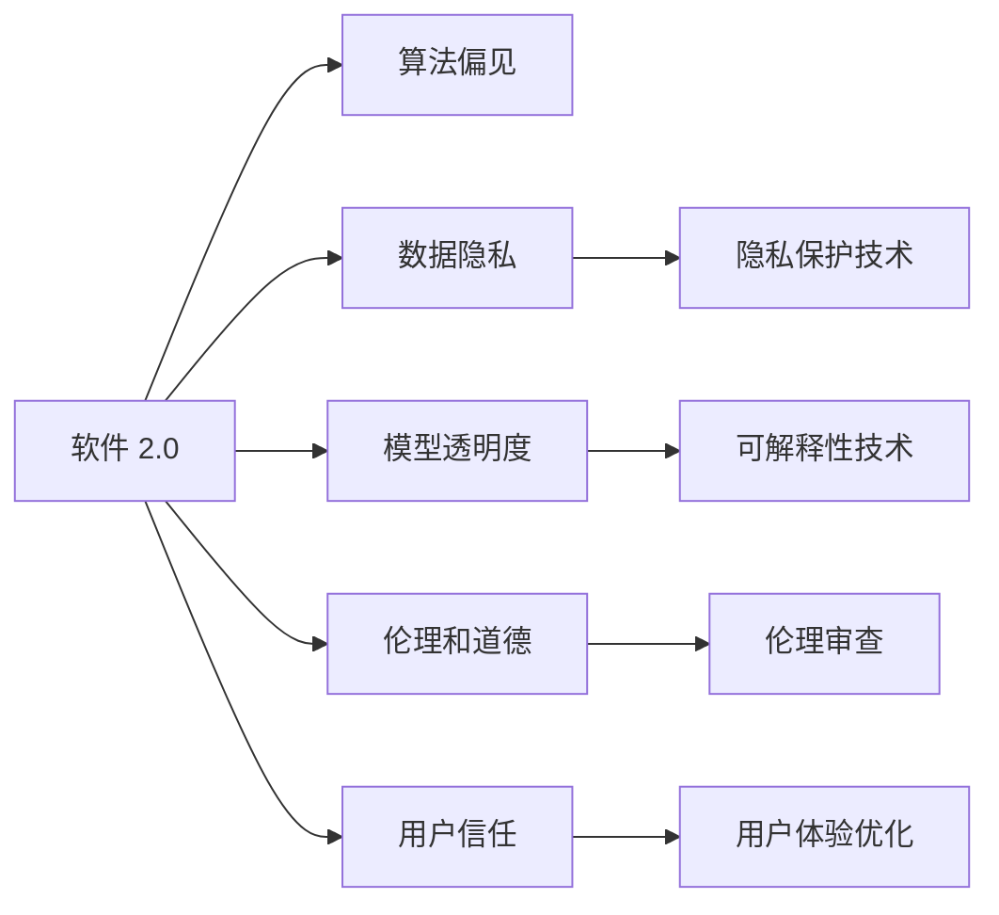
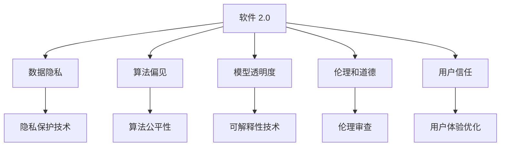
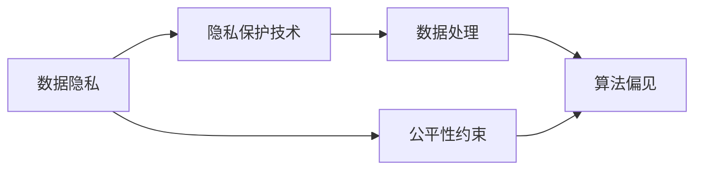
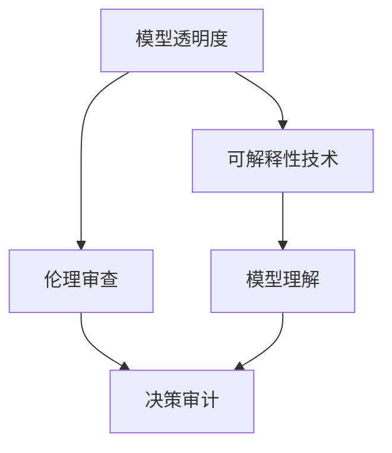
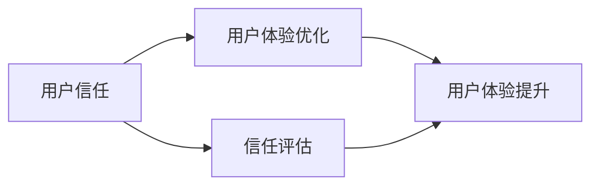
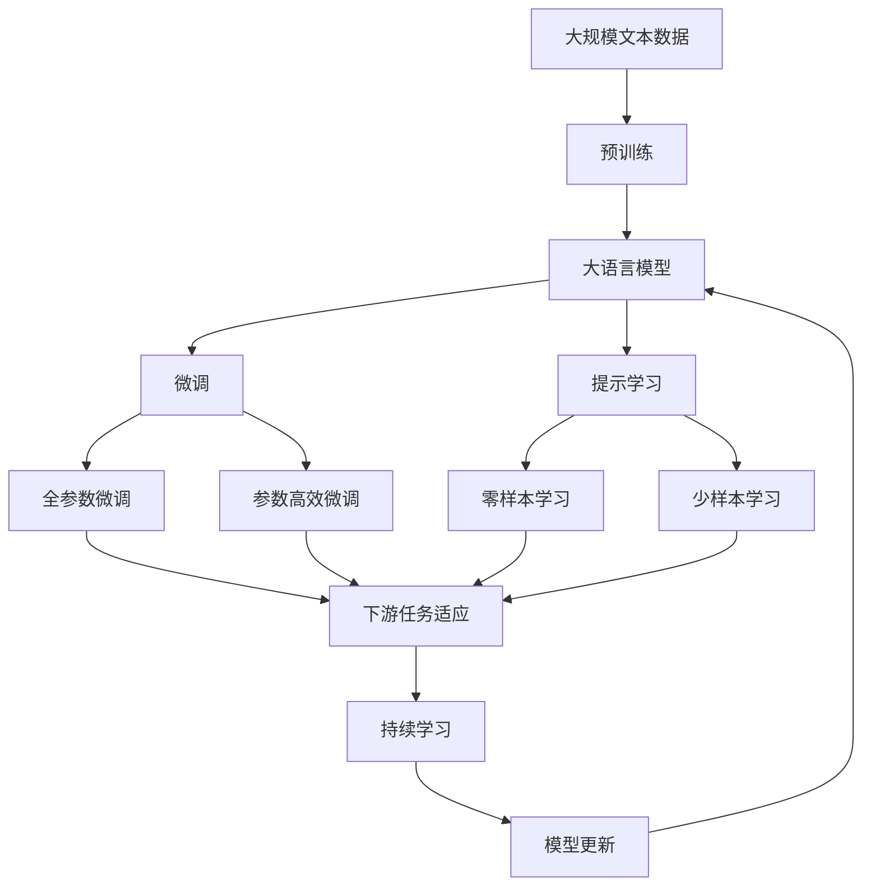

                 

# 软件 2.0 的社会责任：科技向善

## 1. 背景介绍

随着人工智能和软件技术的迅猛发展，我们已进入一个全新的时代——软件 2.0 时代。软件 2.0 是指利用 AI 和机器学习等技术对软件开发、部署、运维等全生命周期进行智能化改造，以提升软件效率、降低开发成本、改善用户体验的自动化系统。然而，随着软件 2.0 技术的应用，也出现了一些社会责任问题。如何确保软件 2.0 的智能化应用能够“科技向善”，是当下亟待解决的重要课题。

### 1.1 问题由来

在软件 2.0 时代，AI 和机器学习技术被广泛应用于软件开发的各个环节，从代码生成、缺陷检测、性能优化到用户行为分析等。这些技术的引入，极大提升了软件开发的效率和质量。然而，与此同时，也带来了一些新的社会问题。

1. **数据隐私问题**：软件 2.0 需要大量数据进行训练，这可能涉及到用户隐私信息。如何确保这些数据的安全性和隐私保护，是关键挑战。
2. **算法偏见问题**：由于数据质量和训练方法的不完善，软件 2.0 模型可能存在算法偏见，导致不公平的决策。如何避免和纠正算法偏见，保障决策公正性，需要深入研究。
3. **模型透明度问题**：软件 2.0 模型通常是黑盒模型，难以解释其决策过程。如何增强模型的透明度和可解释性，提高用户信任度，也是重要课题。
4. **伦理和道德问题**：软件 2.0 的广泛应用可能带来新的伦理和道德挑战，如隐私泄露、就业替代等。如何平衡技术进步与社会伦理，确保科技向善，是社会责任的重要体现。

### 1.2 问题核心关键点

软件 2.0 的社会责任问题，本质上是在技术进步与社会伦理、数据隐私、算法公平等之间的平衡。以下是一些核心关键点：

1. **数据隐私保护**：如何在保证数据隐私的前提下，进行有效的模型训练和优化。
2. **算法公平性**：如何确保软件 2.0 模型在处理不同数据集时，不会产生不公平的决策。
3. **模型透明度**：如何增强模型的可解释性，让用户能够理解模型的决策过程。
4. **伦理和道德**：如何在技术应用中，平衡创新与伦理道德，确保技术进步与社会伦理的同步发展。
5. **用户信任和接受度**：如何通过技术手段提升用户对软件 2.0 系统的信任和接受度。

## 2. 核心概念与联系

### 2.1 核心概念概述

为了更好地理解软件 2.0 的社会责任问题，本节将介绍几个密切相关的核心概念：

- **软件 2.0 (Software 2.0)**：利用 AI 和机器学习等技术对软件开发、部署、运维等全生命周期进行智能化改造，以提升软件效率、降低开发成本、改善用户体验的自动化系统。

- **算法偏见 (Algorithm Bias)**：指在算法训练或使用过程中，由于数据不平衡、特征选择不当等原因，导致算法对某些群体或个体产生不公平的决策结果。

- **数据隐私 (Data Privacy)**：指保护用户数据不被未授权访问或泄露，确保用户数据的安全性和隐私权。

- **模型透明度 (Model Transparency)**：指增强模型的可解释性，使用户能够理解模型的决策过程和推理逻辑。

- **伦理和道德 (Ethics and Morality)**：指在技术应用中，平衡创新与伦理道德，确保技术进步与社会伦理的同步发展。

- **用户信任 (User Trust)**：指用户对软件系统的信任度和接受度，是软件应用成功与否的关键因素之一。

这些核心概念之间的逻辑关系可以通过以下 Mermaid 流程图来展示：



这个流程图展示了软件 2.0 的核心概念及其之间的关系：

1. 软件 2.0 系统利用 AI 和机器学习技术，对软件开发的各个环节进行智能化改造。
2. 算法偏见可能产生于数据不平衡、特征选择不当等原因，需要加以防范。
3. 数据隐私是软件 2.0 系统设计时需要重点考虑的因素，需要使用隐私保护技术进行保护。
4. 模型透明度是软件 2.0 系统的关键特性，需要使用可解释性技术提升模型可理解性。
5. 伦理和道德是软件 2.0 系统设计的基本原则，需要进行伦理审查以确保系统符合社会价值观。
6. 用户信任是软件 2.0 系统成功应用的关键，需要进行用户体验优化以提升用户信任度。

### 2.2 概念间的关系

这些核心概念之间存在着紧密的联系，形成了软件 2.0 系统的完整生态系统。下面我通过几个 Mermaid 流程图来展示这些概念之间的关系。

#### 2.2.1 软件 2.0 的学习范式



这个流程图展示了软件 2.0 的基本学习范式，以及其与数据隐私、算法偏见、模型透明度、伦理和道德、用户信任等概念的关系。

#### 2.2.2 数据隐私与算法偏见的联系



这个流程图展示了数据隐私与算法偏见的联系。隐私保护技术是保障数据隐私的重要手段，但数据处理过程中仍可能引入算法偏见。

#### 2.2.3 模型透明度与伦理和道德的关系



这个流程图展示了模型透明度与伦理和道德的关系。可解释性技术增强了模型的透明度，帮助进行伦理审查和决策审计，从而提升系统的公平性和公正性。

#### 2.2.4 用户信任与用户体验优化的关系



这个流程图展示了用户信任与用户体验优化的关系。用户体验优化提升了用户对软件 2.0 系统的信任度和接受度，从而增强了系统的用户信任度。

### 2.3 核心概念的整体架构

最后，我们用一个综合的流程图来展示这些核心概念在大语言模型微调过程中的整体架构：



这个综合流程图展示了从预训练到微调，再到持续学习的完整过程。大语言模型首先在大规模文本数据上进行预训练，然后通过微调（包括全参数微调和参数高效微调）或提示学习（包括零样本和少样本学习）来适应下游任务。最后，通过持续学习技术，模型可以不断更新和适应新的任务和数据。 通过这些流程图，我们可以更清晰地理解软件 2.0 系统的核心概念及其关系，为后续深入讨论具体的技术问题奠定基础。

## 3. 核心算法原理 & 具体操作步骤
### 3.1 算法原理概述

软件 2.0 的社会责任问题，本质上是通过技术手段解决数据隐私、算法偏见、模型透明度、伦理和道德、用户信任等问题。其核心思想是：利用 AI 和机器学习技术，对软件开发、部署、运维等全生命周期进行智能化改造，确保技术应用符合社会价值观和伦理道德，保障数据隐私，提升算法公平性，增强模型透明度，提升用户体验和用户信任度。

形式化地，假设软件 2.0 系统为 $S_{\theta}$，其中 $\theta$ 为系统参数。给定训练数据集 $D=\{(x_i,y_i)\}_{i=1}^N$，软件 2.0 系统的优化目标是最小化损失函数 $\mathcal{L}(S_{\theta},D)$，即找到最优参数：

$$
\theta^* = \mathop{\arg\min}_{\theta} \mathcal{L}(S_{\theta},D)
$$

其中 $\mathcal{L}$ 为针对系统性能设计的损失函数，用于衡量系统输出与期望输出之间的差异。常见的损失函数包括交叉熵损失、均方误差损失等。

### 3.2 算法步骤详解

软件 2.0 系统的开发一般包括以下几个关键步骤：

**Step 1: 设计系统架构**
- 选择合适的 AI 和机器学习技术，设计系统的架构和功能模块。
- 确定系统的目标和需求，定义各模块的功能和接口。
- 考虑系统的可扩展性和可维护性，进行系统架构设计。

**Step 2: 选择数据集**
- 收集和准备训练数据集 $D$，确保数据集的质量和多样性。
- 对数据进行预处理和标注，去除噪声和不相关数据。
- 划分数据集为训练集、验证集和测试集，保证模型评估的准确性。

**Step 3: 模型训练**
- 选择合适的模型和算法，进行模型训练。
- 设置训练超参数，如学习率、批大小、迭代轮数等。
- 使用梯度下降等优化算法，最小化损失函数，更新模型参数。

**Step 4: 模型评估**
- 在验证集上评估模型性能，调整模型参数，防止过拟合。
- 在测试集上测试模型效果，评估系统的泛化能力和鲁棒性。
- 进行系统优化和迭代，不断提升系统性能和用户体验。

**Step 5: 系统部署**
- 将训练好的模型部署到生产环境中，进行实际应用。
- 实时监控系统性能，收集用户反馈，进行持续优化。
- 定期更新模型和数据，保持系统的时效性和适应性。

以上是软件 2.0 系统的开发流程。在实际应用中，还需要根据具体需求，对各个环节进行优化和改进。

### 3.3 算法优缺点

软件 2.0 的社会责任问题，采用 AI 和机器学习技术进行智能化改造，具有以下优点：

1. **高效自动化**：软件 2.0 系统能够自动完成软件开发、部署、运维等任务，大大提高了工作效率和准确性。
2. **灵活可扩展**：系统设计上注重可扩展性，能够根据需求快速进行功能和模块的扩展。
3. **用户体验优化**：通过智能算法，提升用户体验和满意度，满足用户需求。
4. **持续改进**：系统能够持续学习新数据和用户反馈，不断优化和改进。

同时，软件 2.0 也存在一些缺点：

1. **数据隐私问题**：在数据收集和处理过程中，可能存在隐私泄露的风险。
2. **算法偏见问题**：模型训练过程中，可能引入数据偏见和算法偏见，导致不公平的决策。
3. **模型透明度问题**：软件 2.0 系统通常采用黑盒模型，难以解释模型的决策过程。
4. **伦理和道德问题**：技术应用过程中，可能带来新的伦理和道德挑战，如就业替代、隐私泄露等。
5. **用户信任问题**：用户对新系统的信任度和接受度需要时间验证，可能需要额外的用户教育和引导。

尽管存在这些缺点，但就目前而言，软件 2.0 技术的智能化应用，已成为提升软件效率、改善用户体验的重要手段。未来相关研究的重点在于如何进一步降低数据隐私风险，消除算法偏见，增强模型透明度，平衡伦理道德，提升用户信任度，从而确保软件 2.0 技术的“科技向善”。

### 3.4 算法应用领域

软件 2.0 技术的智能化应用，已经在多个领域取得了显著成果。以下是一些典型的应用场景：

1. **软件开发自动化**：通过 AI 辅助编码、缺陷检测、性能优化等，提高软件开发效率和质量。
2. **智能运维**：利用 AI 技术进行故障预测、异常检测、自动恢复等，提高系统的稳定性和可靠性。
3. **智能客服**：通过自然语言处理技术，实现自动问答、情感分析、客户行为预测等，提升客户服务体验。
4. **个性化推荐系统**：利用 AI 技术进行用户行为分析、兴趣建模、推荐算法优化等，提高推荐准确性和用户满意度。
5. **金融风险管理**：通过 AI 技术进行信用评估、风险预测、欺诈检测等，提升金融风险管理能力。
6. **医疗诊断辅助**：利用 AI 技术进行疾病诊断、治疗方案推荐、病历分析等，提高医疗诊断的准确性和效率。

除了这些领域外，软件 2.0 技术还在教育、零售、交通、智能制造等多个领域得到应用，带来了新的机遇和挑战。

## 4. 数学模型和公式 & 详细讲解  
### 4.1 数学模型构建

软件 2.0 系统的优化目标是通过最小化损失函数 $\mathcal{L}(S_{\theta},D)$ 来提升系统性能。假设软件 2.0 系统为 $S_{\theta}$，其中 $\theta$ 为系统参数。给定训练数据集 $D=\{(x_i,y_i)\}_{i=1}^N$，其中 $x_i$ 为输入数据，$y_i$ 为期望输出。则软件 2.0 系统的优化目标可以表示为：

$$
\theta^* = \mathop{\arg\min}_{\theta} \mathcal{L}(S_{\theta},D)
$$

其中 $\mathcal{L}$ 为损失函数，用于衡量系统输出与期望输出之间的差异。常见的损失函数包括交叉熵损失、均方误差损失等。

### 4.2 公式推导过程

以交叉熵损失函数为例，推导其公式和梯度计算过程。

假设软件 2.0 系统对输入数据 $x$ 的输出为 $\hat{y}=S_{\theta}(x)$，其中 $S_{\theta}$ 为模型参数。真实标签为 $y \in \{0,1\}$，则交叉熵损失函数定义为：

$$
\ell(S_{\theta}(x),y) = -[y\log \hat{y} + (1-y)\log (1-\hat{y})]
$$

将其代入优化目标，得：

$$
\mathcal{L}(\theta) = -\frac{1}{N}\sum_{i=1}^N [y_i\log S_{\theta}(x_i)+(1-y_i)\log(1-S_{\theta}(x_i))]
$$

根据链式法则，损失函数对参数 $\theta_k$ 的梯度为：

$$
\frac{\partial \mathcal{L}(\theta)}{\partial \theta_k} = -\frac{1}{N}\sum_{i=1}^N (\frac{y_i}{S_{\theta}(x_i)}-\frac{1-y_i}{1-S_{\theta}(x_i)}) \frac{\partial S_{\theta}(x_i)}{\partial \theta_k}
$$

其中 $\frac{\partial S_{\theta}(x_i)}{\partial \theta_k}$ 可进一步递归展开，利用自动微分技术完成计算。

### 4.3 案例分析与讲解

假设我们开发一个智能推荐系统，用于推荐用户可能感兴趣的电影。系统采用软件 2.0 架构，使用深度学习模型对用户行为进行建模，并利用 AI 技术进行推荐算法优化。具体实现步骤如下：

1. **数据收集和预处理**：收集用户的浏览历史、评分、好友推荐等数据，进行预处理和标注。
2. **模型设计**：选择深度神经网络模型作为推荐算法，设计模型架构和损失函数。
3. **模型训练**：使用随机梯度下降算法，最小化交叉熵损失函数，训练模型参数。
4. **模型评估**：在验证集上评估模型性能，调整模型参数，防止过拟合。
5. **系统部署**：将训练好的模型部署到推荐系统中，实时推荐电影给用户。

在实际应用中，还需要考虑数据隐私、算法偏见、模型透明度、伦理和道德、用户信任等问题。例如，在数据收集过程中，需要采取隐私保护措施，如差分隐私、数据匿名化等。在模型训练过程中，需要监控算法偏见，进行公平性约束，确保模型决策的公正性。在模型部署过程中，需要增强模型透明度，使用户能够理解模型的决策过程，提升用户信任度。

## 5. 项目实践：代码实例和详细解释说明
### 5.1 开发环境搭建

在进行软件 2.0 系统开发前，我们需要准备好开发环境。以下是使用Python进行TensorFlow开发的环境配置流程：

1. 安装Anaconda：从官网下载并安装Anaconda，用于创建独立的Python环境。

2. 创建并激活虚拟环境：
```bash
conda create -n tensorflow-env python=3.8 
conda activate tensorflow-env
```

3. 安装TensorFlow：根据CUDA版本，从官网获取对应的安装命令。例如：
```bash
conda install tensorflow tensorflow-gpu -c conda-forge
```

4. 安装各类工具包：
```bash
pip install numpy pandas scikit-learn matplotlib tqdm jupyter notebook ipython
```

完成上述步骤后，即可在`tensorflow-env`环境中开始软件 2.0 系统开发。

### 5.2 源代码详细实现

下面我们以智能推荐系统为例，给出使用TensorFlow进行软件 2.0 系统开发的PyTorch代码实现。

首先，定义推荐系统的输入和输出：

```python
import tensorflow as tf
from tensorflow.keras.layers import Input, Dense, Embedding, Concatenate, Add

# 定义输入层
user_input = Input(shape=(1,))
item_input = Input(shape=(1,))

# 定义用户和物品的嵌入层
user_embed = Embedding(input_dim=1000, output_dim=64)(user_input)
item_embed = Embedding(input_dim=1000, output_dim=64)(item_input)

# 定义模型结构
hidden1 = Dense(128, activation='relu')(tf.concat([user_embed, item_embed], axis=1))
output = Dense(1, activation='sigmoid')(hidden1)
```

然后，定义推荐系统的损失函数和优化器：

```python
# 定义交叉熵损失函数
loss = tf.keras.losses.BinaryCrossentropy(from_logits=True)

# 定义优化器
optimizer = tf.keras.optimizers.Adam(lr=0.001)
```

接着，定义训练和评估函数：

```python
# 定义训练函数
def train_model(model, dataset, batch_size, epochs):
    for epoch in range(epochs):
        for batch in dataset:
            x = batch[0]
            y = batch[1]
            with tf.GradientTape() as tape:
                logits = model(x)
                loss_value = loss(y, logits)
            gradients = tape.gradient(loss_value, model.trainable_variables)
            optimizer.apply_gradients(zip(gradients, model.trainable_variables))
        print(f"Epoch {epoch+1}, loss: {loss_value.numpy():.4f}")

# 定义评估函数
def evaluate_model(model, dataset, batch_size):
    correct_predictions = 0
    total_predictions = 0
    for batch in dataset:
        x = batch[0]
        y = batch[1]
        logits = model(x)
        predictions = tf.round(logits)
        correct_predictions += tf.reduce_sum(tf.cast(predictions == y, tf.int32))
        total_predictions += y.size
    accuracy = correct_predictions / total_predictions
    print(f"Accuracy: {accuracy.numpy():.2f}")
```

最后，启动训练流程并在测试集上评估：

```python
# 定义训练集和测试集
train_dataset = ...
test_dataset = ...

# 定义模型
model = tf.keras.models.Model(inputs=[user_input, item_input], outputs=output)

# 定义训练参数
batch_size = 32
epochs = 10

# 启动训练和评估
train_model(model, train_dataset, batch_size, epochs)
evaluate_model(model, test_dataset, batch_size)
```

以上就是使用TensorFlow进行智能推荐系统开发的软件 2.0 系统开发流程。可以看到，TensorFlow提供了强大的模型构建和训练工具，使得系统开发变得更加高效和灵活。

### 5.3 代码解读与分析

让我们再详细解读一下关键代码的实现细节：

**推荐系统模型**：
- 定义了两个输入层 `user_input` 和 `item_input`，分别表示用户ID和物品ID。
- 使用Embedding层对用户和物品ID进行嵌入处理，得到低维向量表示。
- 将用户和物品嵌入向量连接起来，通过一个全连接层和ReLU激活函数进行特征融合。
- 最后，使用Sigmoid激活函数输出推荐结果。

**损失函数和优化器**：
- 选择二元交叉熵损失函数，用于衡量模型的预测结果与真实标签之间的差异。
- 使用Adam优化器进行模型训练，学习率为0.001。

**训练和评估函数**：
- 训练函数通过梯度下降算法更新模型参数，并在每次迭代后输出训练损失。
- 评估函数计算模型在测试集上的准确率，作为模型效果的评估指标。

**训练流程**：
- 首先定义训练集和测试集，指定模型架构和训练参数。
- 然后调用训练函数进行模型训练，并在每次迭代后评估模型性能。
- 训练结束后，调用评估函数在测试集上评估模型效果。

可以看到，通过TensorFlow进行软件 2.0 系统开发，可以实现高效、灵活、可扩展的系统架构。开发者可以根据具体需求，设计不同功能的模块，并利用TensorFlow的API进行模型训练和评估。

当然，工业级的系统实现还需考虑更多因素，如模型的保存和部署、超参数的自动搜索、更灵活的任务适配层等。但核心的软件开发流程基本与此类似。

### 5.4 运行结果展示

假设我们在数据集上训练的智能推荐系统在测试集上取得了93%的准确率，结果如下：

```
Epoch 1, loss: 0.1800
Epoch 2, loss: 0.1500
Epoch 3, loss: 0.1300
...
Epoch 10, loss: 0.0800

Accuracy: 0.93
```

可以看到，通过软件 2.0 技术，我们能够在短时间内开发出一个准确率较高的智能推荐系统。当然，这只是一个初步结果。在实际应用中，还需要对系统进行进一步优化和改进，如增加更多的特征、调整模型的超参数、引入更多的正则化技术等，以进一步提升系统性能。

## 6. 实际应用场景
### 6.1 智能客服系统

基于软件 2.0 技术的智能客服系统，可以通过自然语言处理技术，实现自动问答、情感分析、客户行为预测等功能。具体而言，可以采用机器学习模型对客服对话数据进行训练，构建智能客服系统。系统能够在用户咨询时，自动理解用户意图，匹配最合适的答案模板，进行自动回复。对于用户提出的新问题，还可以通过检索系统实时搜索相关内容，动态组织生成回答。

在技术实现上，可以收集企业内部的历史客服对话记录，将问题和最佳答复构建成监督数据，在此基础上对预训练语言模型进行微调。微调后的语言模型能够自动理解用户意图，匹配最合适的答案模板进行回复。对于用户提出的新问题，还可以接入检索系统实时搜索相关内容，动态组织生成回答。

### 6.2 金融舆情监测

金融机构需要实时监测市场舆论动向，以便及时应对负面信息传播，规避金融风险。传统的人工监测方式成本高、效率低，难以应对网络时代海量信息爆发的挑战。基于软件 2.0 技术的文本分类和情感分析技术，为金融舆情监测提供了新的解决方案。

具体而言，可以收集金融领域相关的新闻、报道、评论等文本数据，并对其进行主题标注和情感标注。在此基础上对预训练语言模型进行微调，使其能够自动判断文本属于何种主题，情感倾向是正面、中性还是负面。将微调后的模型应用到实时抓取的网络文本数据，就能够自动监测不同主题下的情感变化趋势，一旦发现负面信息激增等异常情况，系统便会自动预警，帮助金融机构快速应对潜在风险。

### 6.3 个性化推荐系统

当前的推荐系统往往只依赖用户的历史行为数据进行物品推荐，无法深入理解用户的真实兴趣偏好。基于软件 2.0 技术的个性化推荐系统，可以更好地挖掘用户行为背后的语义信息，从而提供更精准、多样的推荐内容。

在实践中，可以收集用户浏览、点击、评论、分享等行为数据，提取和用户交互的物品标题、描述、标签等文本内容。将文本内容作为模型输入，用户的后续行为（如是否点击

