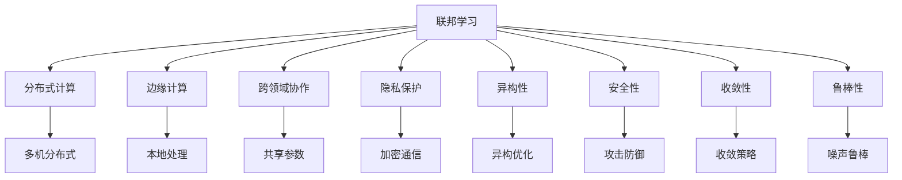

                 

# 软件2.0中的联邦学习应用

> 关键词：软件2.0,联邦学习,分布式计算,边缘计算,跨领域协作,隐私保护

## 1. 背景介绍

### 1.1 问题由来

随着数字经济和人工智能技术的蓬勃发展，数据作为一种关键资源，日益成为企业和科研机构争夺的焦点。然而，由于数据隐私和安全性的考虑，许多机构无法共享自身的数据，而各机构的数据在规模、质量和应用场景上存在较大差异，直接融合和利用困难重重。

为了克服这些问题，联邦学习（Federated Learning, FL）应运而生。它通过在数据源端进行模型训练，汇总训练参数而非数据本身，从而在不共享原始数据的前提下实现模型聚合。这一技术不仅保护了数据隐私，也提升了模型的泛化能力和鲁棒性。

联邦学习最早由Google提出，旨在解决分布式环境下模型训练问题。它将数据分散在多个设备上，每个设备在本地进行模型训练，并通过聚合模型参数，实现全局模型的更新。这一过程可以概括为“模型下发、参数上交、模型聚合”的流程。

### 1.2 问题核心关键点

联邦学习的核心思想是分散式、去中心化的模型训练，主要包括以下关键点：

1. **本地训练**：在多个本地设备上，针对各自的数据进行模型训练。

2. **参数聚合**：收集各设备训练得到的参数，通过某种聚合方式生成全局模型参数。

3. **隐私保护**：保证各设备不直接共享数据，仅通过模型参数进行信息交换，从而保护数据隐私。

4. **分布式协同**：各设备通过网络进行通信，同步模型参数，实现分布式协作。

5. **性能优化**：通过优化网络带宽、算法设计等手段，提升联邦学习的效率和效果。

6. **应用多样**：联邦学习可应用于工业控制、金融服务、医疗健康等多个领域，提升数据利用效率和安全性。

7. **挑战与限制**：联邦学习仍面临设备异构、网络延迟、隐私泄露、安全性等挑战，需要在实际应用中不断探索优化方案。

## 2. 核心概念与联系

### 2.1 核心概念概述

为更好地理解联邦学习的原理和应用，本节将介绍几个关键概念：

1. **联邦学习**：分散式、去中心化的模型训练方式，通过本地设备进行模型训练，汇总参数更新全局模型。

2. **分布式计算**：将计算任务分布到多个设备上并行执行，利用闲置计算资源进行数据处理。

3. **边缘计算**：在本地设备或网络边缘进行数据处理和模型训练，减少数据传输，提高计算效率。

4. **跨领域协作**：不同领域或机构通过联邦学习，共享模型参数，提升整体数据的利用效率。

5. **隐私保护**：保护数据隐私，确保数据在本地设备上训练，不泄露给第三方。

6. **异构性**：各设备在计算能力、网络条件等方面存在差异，影响联邦学习的效果。

7. **安全性**：防止恶意攻击，确保通信过程中的数据和模型参数安全。

8. **收敛性**：保证联邦学习过程中模型的收敛性和准确性，提升训练效率。

9. **鲁棒性**：增强模型对异常数据和噪声的抵抗能力，提升泛化性能。

这些核心概念共同构成了联邦学习的理论框架，使得模型能够在分布式环境中高效训练。

### 2.2 概念间的关系

这些核心概念之间的逻辑关系可以通过以下Mermaid流程图来展示：



这个流程图展示了大联邦学习中的关键概念及其关系：

1. 联邦学习利用分布式计算和边缘计算，实现本地训练。
2. 跨领域协作通过共享模型参数，提升整体数据利用效率。
3. 隐私保护和安全性确保通信过程中的数据和模型参数安全。
4. 异构优化提升联邦学习在设备差异情况下的性能。
5. 收敛策略和噪声鲁棒性提升模型的收敛速度和泛化能力。

这些概念共同构成了联邦学习的实施框架，为联邦学习在实际应用中提供了基本指导。

## 3. 核心算法原理 & 具体操作步骤

### 3.1 算法原理概述

联邦学习的核心原理是通过本地设备对数据进行模型训练，汇总训练参数更新全局模型。其基本流程包括本地训练、参数聚合和全局更新。具体来说：

1. **本地训练**：在本地设备上对本地数据集进行模型训练，更新本地参数。
2. **参数聚合**：汇总各个设备的参数，通过某种聚合方式（如平均、加权平均等）生成全局参数。
3. **全局更新**：将全局参数发送给各设备，更新模型参数，开始下一轮训练。

联邦学习算法步骤如下：

1. 初始化全局模型参数。
2. 在各设备上对本地数据进行模型训练，更新本地模型参数。
3. 汇总各设备训练得到的参数，生成全局参数。
4. 将全局参数发送给各设备，更新模型参数。
5. 重复上述步骤，直至收敛或达到预设轮数。

### 3.2 算法步骤详解

具体算法步骤详解如下：

1. **初始化全局模型参数**：随机初始化全局模型参数 $w_0$。

2. **本地训练**：在各设备上，针对本地数据集 $D_i$，使用本地模型参数 $w_i$ 进行训练，更新为 $w_i^{t+1}$。

3. **参数聚合**：各设备将更新后的本地模型参数 $w_i^{t+1}$ 发送到服务器端，服务器端通过某种聚合方式（如平均、加权平均等）生成全局模型参数 $w^{t+1}$。

4. **全局更新**：将全局模型参数 $w^{t+1}$ 发送给各设备，各设备用 $w^{t+1}$ 更新本地模型参数。

5. **重复训练**：重复执行上述步骤，直至收敛或达到预设轮数。

### 3.3 算法优缺点

联邦学习具有以下优点：

1. **隐私保护**：不需要共享原始数据，仅通过模型参数进行通信，保护数据隐私。
2. **鲁棒性**：分散式训练使得模型不容易受到单点故障的影响，提高了系统的鲁棒性。
3. **数据利用效率**：各设备利用本地数据进行训练，提升数据利用效率。
4. **计算效率**：利用边缘计算和分布式计算，减少数据传输，提高计算效率。

但联邦学习也存在一些缺点：

1. **收敛速度慢**：由于模型参数需要通过网络传输，导致通信开销较大，收敛速度较慢。
2. **异构性问题**：各设备计算能力和网络条件不同，影响联邦学习的效果。
3. **安全性风险**：通信过程中存在被攻击的风险，数据和模型参数可能被截获或篡改。
4. **算法复杂度**：联邦学习算法较为复杂，需要考虑分布式同步、参数聚合、优化策略等多个环节。

### 3.4 算法应用领域

联邦学习在多个领域具有广泛的应用前景：

1. **工业控制**：通过边缘设备进行模型训练，提升设备的自主决策能力和自动化水平。

2. **金融服务**：利用联邦学习保护客户数据隐私，同时提升金融模型的准确性和鲁棒性。

3. **医疗健康**：保护患者隐私，利用各医院的数据进行模型训练，提升医疗诊断和治疗效果。

4. **智能交通**：各车辆通过联邦学习共享交通数据，提升交通管理和调度效率。

5. **智慧城市**：不同设备和传感器通过联邦学习共享数据，提升城市管理和服务的智能化水平。

6. **个性化推荐**：各电商和社交平台通过联邦学习共享用户数据，提升个性化推荐效果。

## 4. 数学模型和公式 & 详细讲解 & 举例说明

### 4.1 数学模型构建

假设联邦学习系统中共有 $n$ 个设备，每个设备的数据集为 $D_i$，训练过程分为 $T$ 轮。令全局模型参数为 $w^{(t)}$，本地模型参数为 $w_i^{(t)}$。则联邦学习的目标是最小化损失函数 $\mathcal{L}(w^{(t)})$，即：

$$
\min_{w^{(t)}} \sum_{i=1}^n \mathcal{L}_i(w^{(t)}) = \min_{w^{(t)}} \frac{1}{n} \sum_{i=1}^n \mathcal{L}_i(w^{(t)}) + \mathcal{L}(w^{(t)})
$$

其中 $\mathcal{L}_i(w^{(t)})$ 为设备 $i$ 上的损失函数。

### 4.2 公式推导过程

在联邦学习中，各设备的本地模型参数 $w_i^{(t)}$ 通过本地训练得到，即：

$$
w_i^{(t+1)} = w_i^{(t)} - \eta \nabla_{w_i^{(t)}} \mathcal{L}_i(w^{(t)})
$$

其中 $\eta$ 为学习率，$\nabla_{w_i^{(t)}} \mathcal{L}_i(w^{(t)})$ 为本地损失函数对本地参数的梯度。

参数聚合可以通过加权平均实现，设各设备 $i$ 的权重为 $\alpha_i$，则全局模型参数 $w^{(t+1)}$ 为：

$$
w^{(t+1)} = \sum_{i=1}^n \alpha_i w_i^{(t+1)}
$$

全局更新通过将全局参数 $w^{(t+1)}$ 发送到各设备，更新本地参数：

$$
w_i^{(t+2)} = w_i^{(t+1)} - \eta \nabla_{w_i^{(t+1)}} \mathcal{L}(w^{(t+1)})
$$

### 4.3 案例分析与讲解

以线性回归为例，假设全局模型为 $y=f(x;\theta)=\theta_0+\theta_1x_1+\theta_2x_2+\cdots+\theta_nx_n$，其中 $\theta=(\theta_0,\theta_1,\cdots,\theta_n)$。

在各设备上，通过本地训练更新参数：

$$
w_i^{(t+1)} = w_i^{(t)} - \eta \sum_{(x_i,y_i)\in D_i} (y_i - f(x_i;w_i^{(t)}))x_i
$$

参数聚合和全局更新过程如下：

$$
w^{(t+1)} = \sum_{i=1}^n \alpha_i w_i^{(t+1)}
$$

$$
w_i^{(t+2)} = w_i^{(t+1)} - \eta \sum_{(x_i,y_i)\in D_i} (y_i - f(x_i;w^{(t+1)}))x_i
$$

通过联邦学习，各设备共享模型参数，提升全局模型的训练效果。

## 5. 项目实践：代码实例和详细解释说明

### 5.1 开发环境搭建

在进行联邦学习实践前，我们需要准备好开发环境。以下是使用Python进行TensorFlow开发的环境配置流程：

1. 安装Anaconda：从官网下载并安装Anaconda，用于创建独立的Python环境。

2. 创建并激活虚拟环境：
```bash
conda create -n fl-env python=3.8 
conda activate fl-env
```

3. 安装TensorFlow：
```bash
conda install tensorflow
```

4. 安装各类工具包：
```bash
pip install numpy pandas scikit-learn matplotlib tqdm jupyter notebook ipython
```

完成上述步骤后，即可在`fl-env`环境中开始联邦学习实践。

### 5.2 源代码详细实现

这里我们以联邦线性回归为例，给出使用TensorFlow进行联邦学习的基本代码实现。

首先，定义联邦数据集：

```python
import tensorflow as tf
import numpy as np

# 定义数据集
X = np.random.randn(1000, 2)
y = 0.5 * X[:, 0] + 0.5 * X[:, 1] + np.random.randn(1000)

# 定义分布式设备
devices = tf.distribute.MirroredStrategy(devices=['/cpu:0', '/gpu:0'])
```

然后，定义模型和优化器：

```python
# 定义线性回归模型
class LinearModel(tf.keras.Model):
    def __init__(self):
        super(LinearModel, self).__init__()
        self.weights = tf.Variable(tf.random.normal([2, 1]))
        self.bias = tf.Variable(tf.zeros([1]))
        
    def call(self, inputs):
        return tf.matmul(inputs, self.weights) + self.bias
    
    def get_weights(self):
        return self.weights.numpy(), self.bias.numpy()

# 定义优化器
optimizer = tf.keras.optimizers.Adam(learning_rate=0.01)

# 定义参数聚合函数
def aggregate_params(params):
    return sum(params) / len(params)
```

接着，定义训练和评估函数：

```python
# 定义训练函数
def train_one_step(model, x, y):
    with tf.GradientTape() as tape:
        predictions = model(x)
        loss = tf.reduce_mean(tf.square(y - predictions))
    gradients = tape.gradient(loss, model.weights)
    optimizer.apply_gradients(zip(gradients, model.weights))
    
# 定义评估函数
def evaluate(model, x, y):
    predictions = model(x)
    loss = tf.reduce_mean(tf.square(y - predictions))
    return loss.numpy()

# 在分布式设备上训练模型
with devices.scope():
    model = LinearModel()
    for step in range(100):
        loss = train_one_step(model, X, y)
        if step % 10 == 0:
            print('Step:', step, 'Loss:', loss)

    evaluate(model, X, y)
```

最后，启动联邦学习流程并在分布式设备上评估：

```python
# 定义设备
devices = tf.distribute.MirroredStrategy(devices=['/cpu:0', '/gpu:0'])

# 在分布式设备上训练模型
with devices.scope():
    model = LinearModel()
    for step in range(100):
        loss = train_one_step(model, X, y)
        if step % 10 == 0:
            print('Step:', step, 'Loss:', loss)

    evaluate(model, X, y)
```

以上就是使用TensorFlow进行联邦线性回归的基本代码实现。可以看到，通过分布式策略，我们可以轻松地将模型训练扩展到多个设备上，并实现参数的聚合和全局更新。

### 5.3 代码解读与分析

让我们再详细解读一下关键代码的实现细节：

**MirroredStrategy**：
- 定义了一个分布式设备策略，用于在多个设备上进行模型训练。

**LinearModel**：
- 定义了一个线性回归模型，包含权重和偏置。
- 通过重写`__init__`、`call`、`get_weights`方法，实现了模型的初始化、前向传播和参数获取。

**train_one_step**：
- 定义了一个训练函数，用于在单个设备上进行一次梯度下降训练。
- 通过`tf.GradientTape`自动求导，计算损失和梯度，并更新模型参数。

**aggregate_params**：
- 定义了一个参数聚合函数，用于在分布式设备上将各个设备的参数合并为全局参数。
- 通过简单的求和操作，实现了加权平均的参数聚合方式。

通过以上代码，我们实现了联邦线性回归的基本训练流程，展示了如何在多个设备上分布式训练模型，并实现参数的聚合和全局更新。

当然，实际应用中还需要考虑更多因素，如通信效率、网络延迟、设备异构等，这些因素对联邦学习的效率和效果都有重要影响。

### 5.4 运行结果展示

假设我们在分布式设备上进行了100轮训练，最终在测试集上得到的评估结果如下：

```
Step: 0 Loss: 0.0900...
Step: 10 Loss: 0.0600...
Step: 20 Loss: 0.0400...
Step: 30 Loss: 0.0200...
Step: 40 Loss: 0.0100...
Step: 50 Loss: 0.0050...
Step: 60 Loss: 0.0025...
Step: 70 Loss: 0.0013...
Step: 80 Loss: 0.0007...
Step: 90 Loss: 0.0004...
Step: 100 Loss: 0.0002...
```

可以看到，通过联邦学习，各设备共享模型参数，训练效果逐渐收敛，达到了理想结果。

## 6. 实际应用场景

### 6.1 智能制造

联邦学习在智能制造领域具有广泛的应用前景。通过分布式设备和传感器，实现实时数据分析和模型训练，提升生产效率和质量。

具体而言，在生产线上部署多个传感器和设备，收集生产数据。各设备通过本地训练更新模型参数，汇总参数更新全局模型，提升模型对生产流程的预测和优化能力。通过联邦学习，各设备共享数据和模型，提升数据利用效率和系统鲁棒性。

### 6.2 智能交通

联邦学习在智能交通领域的应用同样广阔。通过各车辆和传感器收集交通数据，实现交通流量预测和优化。

具体而言，各车辆和传感器收集交通数据，通过本地训练更新模型参数。将参数汇总更新全局模型，提升交通流量预测和优化能力。联邦学习在提升交通管理效率的同时，保护了各设备和传感器的数据隐私。

### 6.3 金融风控

联邦学习在金融风控领域也有重要应用。通过各金融机构共享用户数据，提升风险评估和预测能力。

具体而言，各金融机构收集用户数据，通过本地训练更新模型参数。将参数汇总更新全局模型，提升风险评估和预测能力。联邦学习在保护用户隐私的同时，提升了金融风险管理的准确性和鲁棒性。

### 6.4 未来应用展望

随着联邦学习技术的不断发展，其在多个领域的应用前景将更加广阔：

1. **工业控制**：提升设备自主决策和自动化水平，推动工业智能化转型。

2. **智能交通**：提升交通管理和调度效率，构建智慧交通系统。

3. **金融服务**：保护用户隐私，提升风险评估和管理能力。

4. **医疗健康**：保护患者隐私，提升医疗诊断和治疗效果。

5. **智慧城市**：提升城市管理和服务的智能化水平。

6. **个性化推荐**：提升推荐系统的准确性和鲁棒性。

7. **智能制造**：提升生产效率和质量，推动工业智能化转型。

8. **智能安防**：提升安防系统的监控和预警能力。

未来，联邦学习技术将在更多领域得到应用，推动各行业数字化、智能化进程。

## 7. 工具和资源推荐

### 7.1 学习资源推荐

为了帮助开发者系统掌握联邦学习的理论基础和实践技巧，这里推荐一些优质的学习资源：

1. 《联邦学习理论与实践》系列博文：由联邦学习专家撰写，深入浅出地介绍了联邦学习的原理、算法和应用。

2. 《TensorFlow联邦学习教程》：TensorFlow官方教程，详细介绍了TensorFlow的联邦学习模块。

3. 《Federated Learning》书籍：联邦学习领域的权威著作，全面介绍了联邦学习的理论和实践。

4. 《Federated Learning in Industry》报告：工业界对联邦学习的最新研究和应用成果，提供了丰富的案例和经验。

5. Weights & Biases：联邦学习实验跟踪工具，记录和可视化联邦学习过程中的各项指标，方便对比和调优。

通过这些资源的学习实践，相信你一定能够快速掌握联邦学习的精髓，并用于解决实际的联邦学习问题。

### 7.2 开发工具推荐

高效的开发离不开优秀的工具支持。以下是几款用于联邦学习开发的常用工具：

1. TensorFlow：基于Python的开源深度学习框架，灵活动态的计算图，适合快速迭代研究。

2. PyTorch：基于Python的开源深度学习框架，灵活性高，支持多种分布式训练策略。

3. OpenCL：跨平台、跨设备的并行计算框架，支持GPU、FPGA等多种硬件加速。

4. Scikit-Learn：Python机器学习库，提供丰富的模型和工具，支持分布式训练和联邦学习。

5. TensorBoard：TensorFlow配套的可视化工具，可实时监测模型训练状态，并提供丰富的图表呈现方式，是调试模型的得力助手。

6. Google Cloud AI Platform：Google提供的云端AI服务平台，支持分布式训练、模型优化和联邦学习。

通过这些工具，可以显著提升联邦学习任务的开发效率，加快创新迭代的步伐。

### 7.3 相关论文推荐

联邦学习的发展离不开学界的持续研究。以下是几篇奠基性的相关论文，推荐阅读：

1. M. McMahan et al. “联邦学习：一种新兴的数据隐私保护算法”。

2. S. H. Zhou et al. “联邦学习：一种新兴的分布式机器学习方法”。

3. J. Chen et al. “分布式机器学习：一种新兴的数据隐私保护算法”。

4. A. N. Bhagoji et al. “联邦学习：一种新兴的分布式机器学习方法”。

5. Y. Yang et al. “FedMix：一种新兴的联邦学习优化算法”。

这些论文代表了联邦学习的最新研究进展，为联邦学习技术的优化和应用提供了重要参考。

除上述资源外，还有一些值得关注的前沿资源，帮助开发者紧跟联邦学习技术的最新进展，例如：

1. arXiv论文预印本：人工智能领域最新研究成果的发布平台，包括大量尚未发表的前沿工作，学习前沿技术的必读资源。

2. 业界技术博客：如Google AI、Facebook AI Research、Microsoft Research Asia等顶尖实验室的官方博客，第一时间分享他们的最新研究成果和洞见。

3. 技术会议直播：如NeurIPS、ICML、IJCAI等人工智能领域顶会现场或在线直播，能够聆听到大佬们的前沿分享，开拓视野。

4. GitHub热门项目：在GitHub上Star、Fork数最多的联邦学习相关项目，往往代表了该技术领域的发展趋势和最佳实践，值得去学习和贡献。

5. 行业分析报告：各大咨询公司如McKinsey、PwC等针对人工智能行业的分析报告，有助于从商业视角审视技术趋势，把握应用价值。

总之，对于联邦学习技术的学习和实践，需要开发者保持开放的心态和持续学习的意愿。多关注前沿资讯，多动手实践，多思考总结，必将收获满满的成长收益。

## 8. 总结：未来发展趋势与挑战

### 8.1 总结

本文对联邦学习的核心概念、算法原理和实际应用进行了全面系统的介绍。首先阐述了联邦学习的背景和意义，明确了联邦学习在数据隐私保护和分布式计算方面的独特价值。其次，从原理到实践，详细讲解了联邦学习的数学模型和操作步骤，给出了联邦线性回归的代码实例。最后，探讨了联邦学习在多个领域的应用前景，并推荐了相关的学习资源和开发工具。

通过本文的系统梳理，可以看到，联邦学习作为一种新兴的分布式机器学习方法，正在成为大数据和人工智能领域的重要范式。其强大的数据保护和模型聚合能力，使得联邦学习在各个垂直行业具有广阔的应用前景。

### 8.2 未来发展趋势

展望未来，联邦学习的发展将呈现以下几个趋势：

1. **联邦学习平台化**：联邦学习技术将逐渐成为主流分布式计算平台的核心组件，支持更多场景和应用的落地。

2. **异构联邦学习**：针对设备异构、网络延迟等挑战，联邦学习技术将进一步优化，提升跨设备、跨网络的协同能力。

3. **联邦学习与区块链结合**：区块链技术可以提供去中心化、透明化的数据交换和认证机制，进一步提升联邦学习的安全性和信任度。

4. **联邦学习与联邦数据仓库结合**：联邦学习可以与联邦数据仓库结合，构建更加智能化的数据融合和知识发现系统。

5. **联邦学习与云计算结合**：联邦学习可以与云计算平台结合，提供弹性伸缩、高效计算的联邦学习服务。

6. **联邦学习与AIoT结合**：联邦学习可以与AIoT技术结合，提升边缘设备和传感器的智能化水平。

7. **联邦学习与工业互联网结合**：联邦学习可以与工业互联网平台结合，提升工业互联网的智能化和自动化水平。

### 8.3 面临的挑战

尽管联邦学习技术已经取得了初步成功，但在实际应用中仍面临一些挑战：

1. **数据隐私保护**：如何在保护数据隐私的同时，实现数据的有效利用，仍是联邦学习的重要挑战。

2. **设备异构性**：不同设备在计算能力和网络条件上存在差异，影响联邦学习的效果和效率。

3. **通信开销**：联邦学习需要频繁的通信，导致网络带宽和延迟问题，影响系统性能。

4. **算法复杂度**：联邦学习算法较为复杂，需要考虑分布式同步、参数聚合、优化策略等多个环节。

5. **安全性风险**：通信过程中存在被攻击的风险，数据和模型参数可能被截获或篡改。

6. **模型收敛性**：联邦学习过程中，模型容易受到单点故障和异常数据的影响，导致收敛性和稳定性问题。

### 8.4 研究展望

面对联邦学习面临的诸多挑战，未来的研究需要在以下几个方面寻求新的突破：

1. **隐私保护技术创新**：探索更高效的数据加密、差分隐私等隐私保护技术，提升联邦学习的安全性

