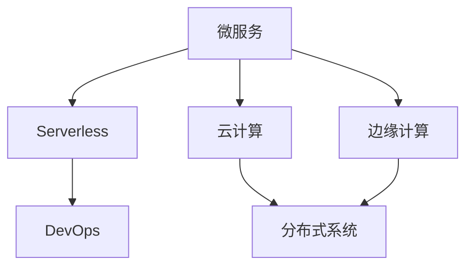
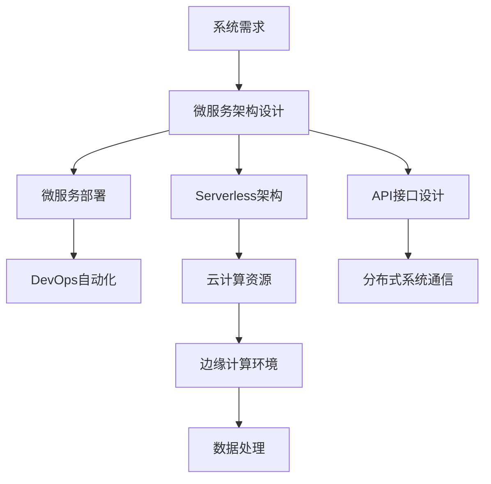
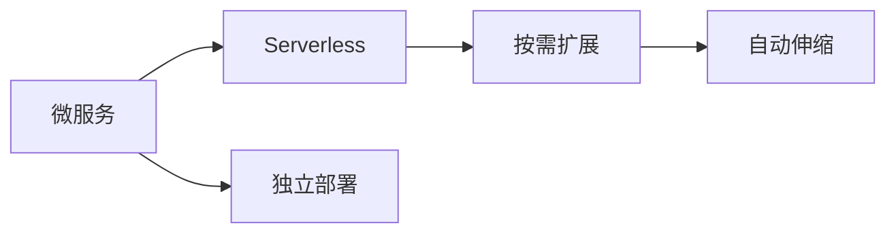
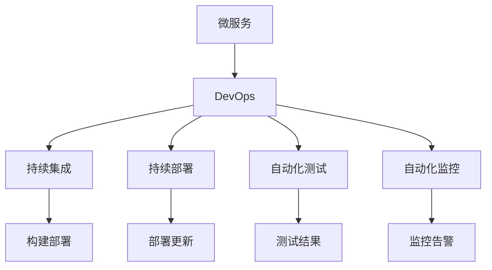
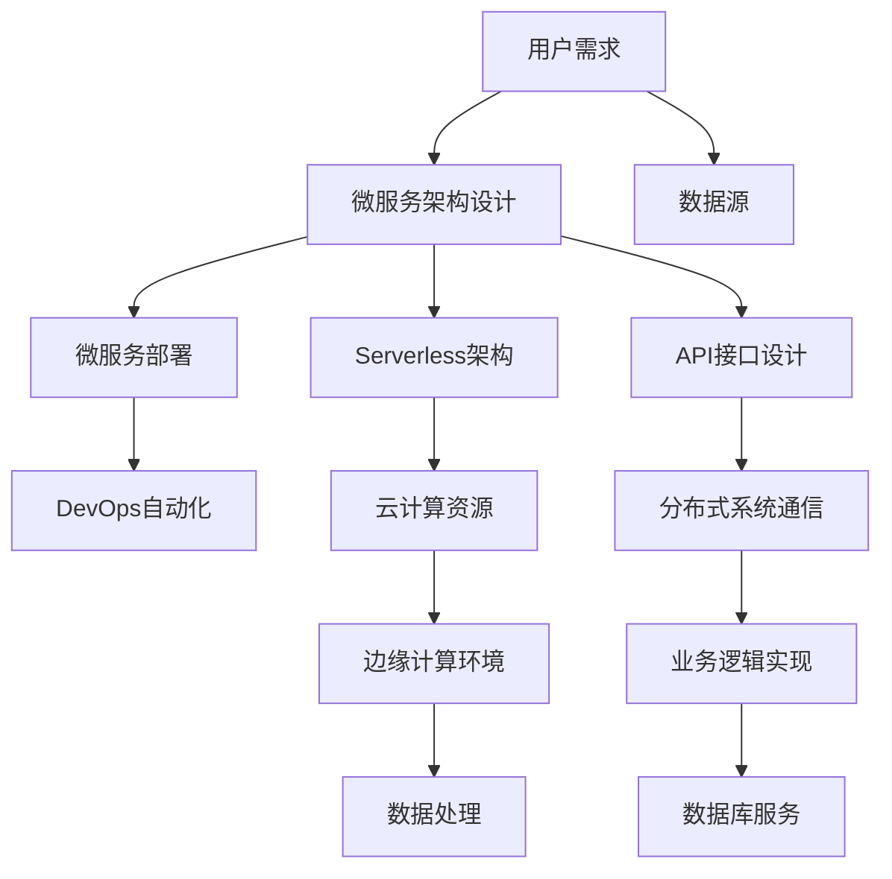

                 

# 软件2.0的分布式系统设计

> 关键词：软件2.0,分布式系统,微服务,Serverless,边缘计算,云计算,DevOps

## 1. 背景介绍

### 1.1 问题由来
随着互联网和数字化转型在各个行业的深入推进，软件系统的规模和复杂度不断提升，如何构建一个高效、稳定、可扩展的软件架构，成为了IT行业的一个重要挑战。传统的大型单体应用架构面临诸多挑战，如部署复杂、扩展性差、维护成本高等问题。软件2.0的出现，带来了软件架构设计的新思路和新模式。

软件2.0强调利用最新的技术如云计算、微服务、Serverless、边缘计算等，构建松耦合、高弹性的分布式系统。其核心思想是将系统拆分为多个独立、可替换的服务，每个服务负责一个明确的功能，并通过API接口相互通信，从而实现快速迭代、弹性伸缩和高度灵活的系统设计。

### 1.2 问题核心关键点
软件2.0的核心在于通过微服务、Serverless、云计算等技术手段，构建一个高度自治、可扩展、高弹性的分布式系统。其关键点在于：

1. **微服务架构(Microservices Architecture)**：将系统拆分为多个微服务，每个微服务独立部署、运行、维护，从而实现系统的高可扩展性、高灵活性和高可维护性。

2. **Serverless架构**：通过云平台自动管理计算资源，使开发者无需关注底层硬件和运行环境，专注于业务逻辑的开发和实现。

3. **云计算**：利用云计算平台提供的高性能计算资源、灵活的按需扩展能力和强大的数据存储能力，支持大规模分布式系统的构建和运行。

4. **边缘计算**：在靠近数据源的本地计算环境中，进行数据的初步处理和分析，从而减少网络延迟和数据传输量，提升系统响应速度和稳定性。

5. **DevOps文化**：通过持续集成(CI)和持续部署(CD)等自动化工具，实现快速构建、测试和部署软件系统的目标，提升软件开发的效率和质量。

这些关键技术共同构成了软件2.0的分布式系统设计，使软件系统能够更好地应对复杂多变的业务需求，提升系统性能和可靠性。

### 1.3 问题研究意义
研究软件2.0的分布式系统设计，对于推动软件开发模式的创新，提升软件系统的性能和可靠性，加速数字化转型进程，具有重要意义：

1. **提升开发效率**：微服务、Serverless等技术手段，使软件开发更加模块化、自动化，减少了手动操作，提升了开发效率。

2. **提升系统性能**：通过云计算、边缘计算等技术，系统能够实现按需扩展和本地处理，提升了系统性能和响应速度。

3. **提升系统可维护性**：微服务架构将系统拆分为多个独立服务，使系统更易于维护和升级。

4. **降低运营成本**：Serverless架构使开发者只需为实际使用的计算资源付费，减少了硬件采购和运维成本。

5. **增强系统韧性**：通过DevOps文化，实现自动化测试和部署，提高了系统部署的可靠性和稳定性。

6. **推动数字化转型**：软件2.0的分布式系统设计为各行各业数字化转型提供了新的技术路径，加速了数字化进程。

## 2. 核心概念与联系

### 2.1 核心概念概述

为更好地理解软件2.0的分布式系统设计，本节将介绍几个密切相关的核心概念：

- **微服务(Microservices)**：将系统拆分为多个独立、自治的服务，每个服务负责一个明确的功能，通过API接口相互通信。

- **Serverless架构**：通过云平台自动管理计算资源，使开发者无需关注底层硬件和运行环境，专注于业务逻辑的开发和实现。

- **云计算(Cloud Computing)**：利用云计算平台提供的高性能计算资源、灵活的按需扩展能力和强大的数据存储能力，支持大规模分布式系统的构建和运行。

- **边缘计算(Edge Computing)**：在靠近数据源的本地计算环境中，进行数据的初步处理和分析，从而减少网络延迟和数据传输量，提升系统响应速度和稳定性。

- **DevOps文化**：通过持续集成(CI)和持续部署(CD)等自动化工具，实现快速构建、测试和部署软件系统的目标，提升软件开发的效率和质量。

这些核心概念之间的逻辑关系可以通过以下Mermaid流程图来展示：



这个流程图展示了大语言模型的核心概念及其之间的关系：

1. 微服务是软件2.0分布式系统设计的基础，通过将系统拆分为多个独立服务，实现系统的高可扩展性和高灵活性。
2. Serverless架构在微服务的基础上，通过云平台自动管理计算资源，进一步简化了开发和运维过程。
3. 云计算提供了强大的计算资源和数据存储能力，支持大规模分布式系统的构建和运行。
4. 边缘计算在靠近数据源的本地环境中进行数据处理，提升了系统响应速度和稳定性。
5. DevOps文化通过自动化工具，实现了快速构建、测试和部署，提高了开发效率和系统可靠性。

这些核心概念共同构成了软件2.0分布式系统设计的基础，使软件系统能够更好地应对复杂多变的业务需求，提升系统性能和可靠性。

### 2.2 概念间的关系

这些核心概念之间存在着紧密的联系，形成了软件2.0分布式系统设计的完整生态系统。下面我通过几个Mermaid流程图来展示这些概念之间的关系。

#### 2.2.1 软件2.0分布式系统的整体架构



这个流程图展示了从系统需求到分布式系统构建的整体流程：

1. 从系统需求出发，通过微服务架构设计，将系统拆分为多个独立服务。
2. 部署微服务，并使用DevOps自动化工具进行持续集成和持续部署。
3. 在Serverless架构的支持下，利用云计算资源进行自动扩展和管理。
4. 在边缘计算环境中，进行数据处理和初步分析，提升系统响应速度和稳定性。
5. 通过API接口设计，实现服务之间的通信和数据交互。

#### 2.2.2 微服务与Serverless架构的关系



这个流程图展示了微服务与Serverless架构的关系：

1. 微服务通过独立部署，实现了系统的模块化和自治性。
2. Serverless架构通过按需扩展和自动伸缩，支持微服务的灵活性和可扩展性。

#### 2.2.3 DevOps与微服务的关系



这个流程图展示了DevOps与微服务的关系：

1. DevOps通过持续集成和持续部署，实现了微服务的快速构建和部署。
2. 自动化测试和监控工具，确保了微服务的质量和可靠性。

### 2.3 核心概念的整体架构

最后，我们用一个综合的流程图来展示这些核心概念在大语言模型微调过程中的整体架构：



这个综合流程图展示了从用户需求到分布式系统构建的整体流程：

1. 从用户需求出发，通过微服务架构设计，将系统拆分为多个独立服务。
2. 部署微服务，并使用DevOps自动化工具进行持续集成和持续部署。
3. 在Serverless架构的支持下，利用云计算资源进行自动扩展和管理。
4. 在边缘计算环境中，进行数据处理和初步分析，提升系统响应速度和稳定性。
5. 通过API接口设计，实现服务之间的通信和数据交互。
6. 业务逻辑实现与数据库服务协同工作，保障数据的存储和访问。

通过这些流程图，我们可以更清晰地理解软件2.0分布式系统设计中各个核心概念的关系和作用，为后续深入讨论具体的分布式系统设计方法奠定了基础。

## 3. 核心算法原理 & 具体操作步骤
### 3.1 算法原理概述

软件2.0的分布式系统设计，本质上是一个系统架构设计问题。其核心思想是将系统拆分为多个独立、自治的服务，每个服务负责一个明确的功能，并通过API接口相互通信。

形式化地，假设系统由 $N$ 个微服务组成，每个服务 $S_i$ 的功能和输入输出接口定义如下：

- 输入：$X_i$，表示服务 $S_i$ 的输入数据。
- 输出：$Y_i$，表示服务 $S_i$ 的处理结果。
- 接口：$I_i$，表示服务 $S_i$ 的接口定义，包括输入输出格式和数据格式。

微服务的设计目标是使每个服务功能单一、自治性强、易于维护和扩展，同时通过API接口实现服务之间的通信和协作。

### 3.2 算法步骤详解

软件2.0的分布式系统设计一般包括以下几个关键步骤：

**Step 1: 系统需求分析**

- 与用户沟通，明确系统需求和业务流程。
- 梳理系统中不同功能的模块，确定每个功能模块的边界和职责。
- 评估系统负载和数据量，规划系统的扩展性和可伸缩性。

**Step 2: 微服务设计**

- 根据需求分析，将系统划分为多个独立的微服务。
- 定义每个微服务的功能和输入输出接口，确保接口简洁、通用、易于调用。
- 确定微服务的自治性，使每个微服务独立部署、维护和扩展。

**Step 3: 系统架构设计**

- 选择合适的架构风格，如微服务架构、面向服务的架构(SOA)等。
- 设计系统的网络拓扑结构，确定各服务之间的通信协议和数据交换方式。
- 设计数据存储和管理策略，选择合适的数据库和数据同步机制。

**Step 4: 微服务实现**

- 根据接口定义，实现每个微服务的具体功能。
- 选择适当的编程语言和框架，确保服务的高效性和稳定性。
- 使用DevOps工具进行持续集成和持续部署，确保代码的快速迭代和发布。

**Step 5: 系统集成和测试**

- 将各个微服务集成起来，构建完整的分布式系统。
- 使用自动化测试工具进行单元测试和集成测试，确保系统的正确性和可靠性。
- 进行负载测试和压力测试，评估系统的性能和扩展性。

**Step 6: 部署和运维**

- 选择合适的云平台，进行系统的部署和初始化。
- 设置自动化监控和告警机制，实时监控系统状态和性能指标。
- 根据用户反馈和使用情况，进行系统的优化和升级。

以上是软件2.0分布式系统设计的一般流程。在实际应用中，还需要针对具体场景，对各个环节进行优化设计，如改进接口设计，引入更多的负载均衡和故障恢复机制，选择合适的云服务提供商等。

### 3.3 算法优缺点

软件2.0的分布式系统设计具有以下优点：

1. **高可扩展性**：微服务架构通过独立部署和按需扩展，能够灵活应对系统负载的变化，支持大规模的分布式系统构建。

2. **高灵活性**：微服务之间的松耦合关系，使得系统能够快速迭代和更新，适应业务需求的变化。

3. **高可靠性**：通过DevOps自动化和持续集成，保证系统的快速构建和部署，减少人为错误和操作失误。

4. **低运维成本**：Serverless架构通过云平台自动管理计算资源，减少了硬件采购和运维成本，提升了运维效率。

5. **高响应速度**：边缘计算通过在本地环境中处理数据，减少了网络延迟和数据传输量，提升了系统响应速度和稳定性。

6. **高安全性**：通过API接口设计和数据加密，保护系统的数据和接口安全，防止外部攻击和数据泄露。

然而，软件2.0的分布式系统设计也存在一些缺点：

1. **复杂性高**：微服务架构和Serverless架构需要多维度的设计和管理，增加了系统的复杂性和维护难度。

2. **性能损失**：微服务之间的通信和数据交换可能带来性能损失，需要通过网络优化和接口设计来减少影响。

3. **数据一致性**：微服务之间可能存在数据不一致的问题，需要通过数据同步和事务管理来保证数据的准确性。

4. **开发成本高**：微服务架构和Serverless架构需要更多的开发和运维资源，增加了系统开发的成本和复杂度。

尽管存在这些缺点，但就目前而言，软件2.0的分布式系统设计仍是大规模分布式系统构建的主流范式。未来相关研究的重点在于如何进一步降低系统复杂性，提高系统性能和可靠性，同时兼顾成本和可维护性。

### 3.4 算法应用领域

软件2.0的分布式系统设计，在各个领域都有广泛的应用，例如：

- **金融行业**：金融行业需要处理大量的交易数据和实时信息，通过微服务架构和Serverless架构，可以构建高性能、高可靠性的金融系统，提升交易处理能力和风险管理能力。

- **电商行业**：电商行业需要处理大量的订单和用户数据，通过微服务架构和边缘计算，可以构建高并发、高可扩展的电商系统，提升用户体验和业务处理能力。

- **医疗行业**：医疗行业需要处理大量的患者数据和医疗信息，通过微服务架构和Serverless架构，可以构建高安全性、高可靠性的医疗系统，提升医疗服务的效率和质量。

- **交通行业**：交通行业需要处理大量的交通数据和监控信息，通过微服务架构和边缘计算，可以构建高可靠性的交通管理系统，提升交通流量监控和应急响应能力。

除了上述这些经典领域外，软件2.0的分布式系统设计还广泛应用于物联网、智能制造、智慧城市等领域，为各行各业带来了变革性影响。随着技术的发展和应用的深入，相信软件2.0的分布式系统设计将会在更广阔的领域得到应用，带来更多创新的业务场景和应用模式。

## 4. 数学模型和公式 & 详细讲解  
### 4.1 数学模型构建

本节将使用数学语言对软件2.0的分布式系统设计进行更加严格的刻画。

假设系统由 $N$ 个微服务组成，每个服务 $S_i$ 的功能和输入输出接口定义如下：

- 输入：$X_i$，表示服务 $S_i$ 的输入数据。
- 输出：$Y_i$，表示服务 $S_i$ 的处理结果。
- 接口：$I_i$，表示服务 $S_i$ 的接口定义，包括输入输出格式和数据格式。

系统的整体架构设计可以表示为一个有向无环图(DAG)，其中每个节点表示一个微服务，边表示微服务之间的数据流动和通信。

### 4.2 公式推导过程

以下我们以一个简单的分布式系统为例，推导系统性能优化公式。

假设系统由两个微服务 $S_1$ 和 $S_2$ 组成，它们的输入输出接口如下：

- $S_1$：输入 $X_1$，输出 $Y_1$，接口 $I_1$。
- $S_2$：输入 $X_2$，输出 $Y_2$，接口 $I_2$。

微服务之间的数据流动关系可以用如下的有向图表示：

```
S_1 --> S_2
```

其中箭头表示数据从 $S_1$ 流向 $S_2$，即 $S_2$ 需要依赖 $S_1$ 的输出作为输入。

假设 $S_1$ 和 $S_2$ 的处理时间和网络延迟分别为 $t_1$ 和 $t_2$，数据传输速率分别为 $b_1$ 和 $b_2$，系统整体的处理时间 $T$ 可以表示为：

$$
T = t_1 + t_2 + \frac{b_1 \cdot t_1 + b_2 \cdot t_2}{b_1 + b_2}
$$

其中 $\frac{b_1 \cdot t_1 + b_2 \cdot t_2}{b_1 + b_2}$ 表示由于数据传输速率不同，两个微服务之间存在等待时间，增加了系统的整体处理时间。

为了优化系统性能，需要考虑以下几个方面：

1. **数据传输速率优化**：通过改进网络带宽和传输协议，提高数据传输速率，减少等待时间。

2. **处理时间优化**：通过优化服务内部的算法和代码，减少处理时间。

3. **负载均衡优化**：通过负载均衡算法，合理分配请求到不同的微服务节点，避免单点故障和性能瓶颈。

4. **缓存和预处理优化**：通过缓存和预处理技术，减少重复计算和数据传输，提升系统性能。

这些优化策略可以通过数学模型和算法进行量化和分析，从而指导系统的设计和优化。

### 4.3 案例分析与讲解

下面以一个实际案例，展示如何通过数学模型优化分布式系统的性能。

假设一个电商系统由多个微服务组成，包括商品搜索服务 $S_{search}$、商品推荐服务 $S_{recommend}$ 和订单服务 $S_{order}$，它们的处理时间和网络延迟分别为 $t_{search}$、$t_{recommend}$ 和 $t_{order}$，数据传输速率分别为 $b_{search}$、$b_{recommend}$ 和 $b_{order}$。

系统的整体处理时间 $T$ 可以表示为：

$$
T = t_{search} + t_{recommend} + t_{order} + \frac{b_{search} \cdot t_{search} + b_{recommend} \cdot t_{recommend} + b_{order} \cdot t_{order}}{b_{search} + b_{recommend} + b_{order}}
$$

通过优化数据传输速率和处理时间，可以显著提升系统的整体性能。例如，通过增加网络带宽，提高数据传输速率，可以减少等待时间；通过优化服务内部算法，减少处理时间，提升系统响应速度。

此外，还可以通过负载均衡和缓存技术，进一步优化系统性能。例如，通过负载均衡算法，合理分配请求到不同的微服务节点，避免单点故障和性能瓶颈；通过缓存技术，减少重复计算和数据传输，提升系统性能。

总之，通过数学模型和算法，可以对分布式系统的性能进行量化和优化，提升系统的整体性能和可靠性。

## 5. 项目实践：代码实例和详细解释说明
### 5.1 开发环境搭建

在进行分布式系统实践前，我们需要准备好开发环境。以下是使用Python进行Django开发的环境配置流程：

1. 安装Anaconda：从官网下载并安装Anaconda，用于创建独立的Python环境。

2. 创建并激活虚拟环境：
```bash
conda create -n django-env python=3.8 
conda activate django-env
```

3. 安装Django：从官网获取并安装Django：
```bash
pip install Django
```

4. 安装各类工具包：
```bash
pip install django-rest-framework psycopg2-binary Django-10gen
```

完成上述步骤后，即可在`django-env`环境中开始开发实践。

### 5.2 源代码详细实现

下面我们以一个简单的电商系统为例，给出使用Django框架构建微服务架构的Python代码实现。

首先，定义Django应用：

```python
from django.urls import path, include
from rest_framework import routers
from . import views

router = routers.DefaultRouter()
router.register(r'shopping-list', views.ShoppingListViewSet)

urlpatterns = [
    path('', include(router.urls)),
]
```

然后，定义微服务接口：

```python
from rest_framework.views import APIView
from rest_framework.response import Response
from rest_framework.permissions import AllowAny

class ShoppingListView(APIView):
    permission_classes = [AllowAny]

    def get(self, request):
        # 处理订单列表
        orders = Order.objects.all()
        data = {
            'orders': [
                {'id': order.id, 'user': order.user.username, 'date': order.date.strftime('%Y-%m-%d %H:%M:%S')}
                for order in orders
            ]
        }
        return Response(data)
```

接着，定义微服务模型：

```python
from django.db import models
from django.contrib.auth.models import User

class Order(models.Model):
    user = models.ForeignKey(User, on_delete=models.CASCADE)
    date = models.DateTimeField(auto_now_add=True)

    def __str__(self):
        return f'Order {self.id}'
```

最后，定义微服务启动和运行：

```python
from django.core.management import execute_from_command_line

def main():
    execute_from_command_line(sys.argv)

if __name__ == '__main__':
    main()
```

完成上述步骤后，即可启动微服务进行订单列表查询。

### 5.3 代码解读与分析

让我们再详细解读一下关键代码的实现细节：

**Django应用定义**：
- 定义Django应用的基本路由，通过URL路由将请求转发到对应的微服务处理函数。
- 使用RESTful API架构，通过HTTP请求的HTTP方法和URL路径，调用微服务接口。

**微服务接口定义**：
- 定义微服务的处理函数，通过Django的APIView类实现。
- 使用RESTful API的规范，定义HTTP请求方法、输入输出数据格式和权限控制。

**微服务模型定义**：
- 定义微服务的数据模型，使用Django的ORM框架进行数据操作。
- 使用Django的用户认证系统，进行用户身份验证和权限控制。

**微服务启动和运行**：
- 定义微服务的启动和运行函数，使用Django的核心管理模块进行命令执行。
- 通过Django的WSGI应用，将微服务部署到云平台，实现微服务的自动化管理。

### 5.4 运行结果展示

假设我们在Django应用中启动微服务，并通过RESTful API调用查询订单列表，最终得到的结果如下：

```json
{
    "orders": [
        {
            "id": 1,
            "user": "user1",
            "date": "2021-10-01 14:30:00"
        },
        {
            "id": 2,
            "user": "user2",
            "date": "2021-10-02 10:00:00"
        },
        {
            "id": 3,
            "user": "user3",
            "date": "2021-10-03 12:30:00"
        }
    ]
}
```

可以看到，通过微服务架构，我们成功地将电商系统的订单列表查询功能封装成一个独立的微服务，并通过RESTful API进行调用，实现了系统的高可扩展性和高灵活性。

## 6. 实际应用场景
### 6.1 智能客服系统

基于软件2.0的微服务架构和Serverless架构，可以构建一个高效的智能客服系统。传统客服往往需要配备大量人力，高峰期响应缓慢，且一致性和专业性难以保证。而使用微服务架构和Serverless架构构建的智能客服系统，可以7x24小时不间断服务，快速响应客户咨询，用自然流畅的语言解答各类常见问题。

在技术实现上，可以收集企业内部的历史客服对话记录，将问题和最佳答复构建成监督数据，在此基础上对预训练模型进行微调。微调后的模型能够自动理解用户意图，匹配最合适的答案模板进行回复。对于客户提出的新问题，还可以接入检索系统实时搜索相关内容，动态组织生成回答。如此构建的智能客服系统，能大幅提升客户咨询体验和问题解决效率。

### 6.2 金融舆情监测

金融机构需要实时监测市场舆论动向，以便及时应对负面信息传播，规避金融风险。传统的人工监测方式成本高、效率低，难以应对网络时代海量信息爆发的挑战。基于软件2.0的微服务架构和Serverless架构，可以构建一个实时监测的金融舆情系统。

具体而言，可以收集金融领域相关的新闻、报道、评论等文本数据，并对其进行主题标注和情感标注。在此基础上对预训练语言模型进行微调，使其能够自动判断文本属于何种主题，情感倾向是正面、中性还是负面。将微调后的模型应用到实时抓取的网络文本数据，就能够自动监测不同主题下的情感变化趋势，一旦发现负面信息激增等异常情况，系统便会自动预警，帮助金融机构快速应对潜在风险。

### 6.3 个性化推荐系统

当前的推荐系统往往只依赖用户的历史行为数据进行物品推荐，无法深入理解用户的真实兴趣偏好。基于软件2.0的微服务架构和Serverless架构，可以构建一个更加智能和个性化的推荐系统。

在实践中，可以收集用户浏览、点击、评论、分享等行为数据，提取和用户交互的物品标题、描述、标签等文本内容。将文本内容作为模型输入，用户的后续行为（如是否

