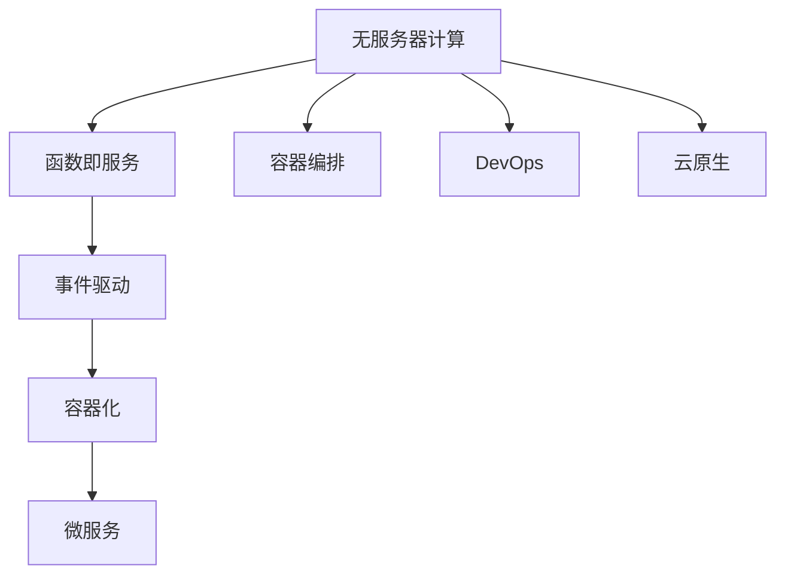
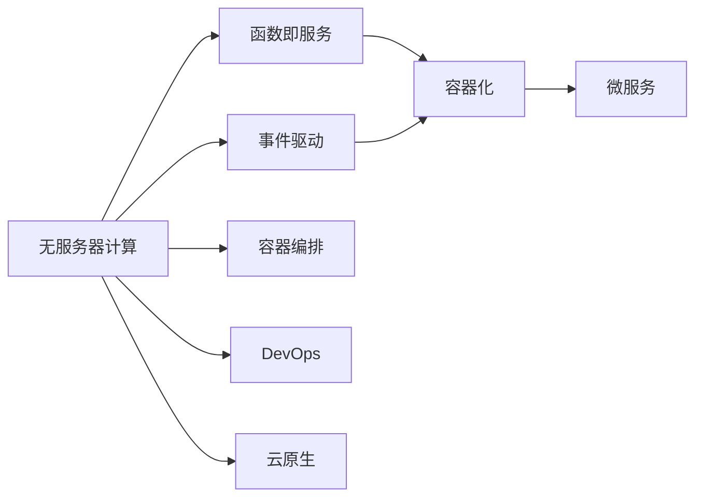
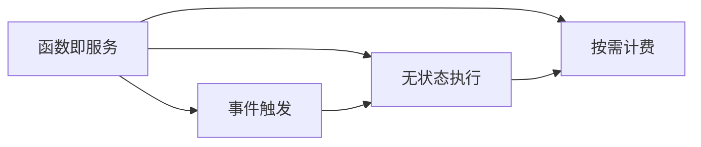
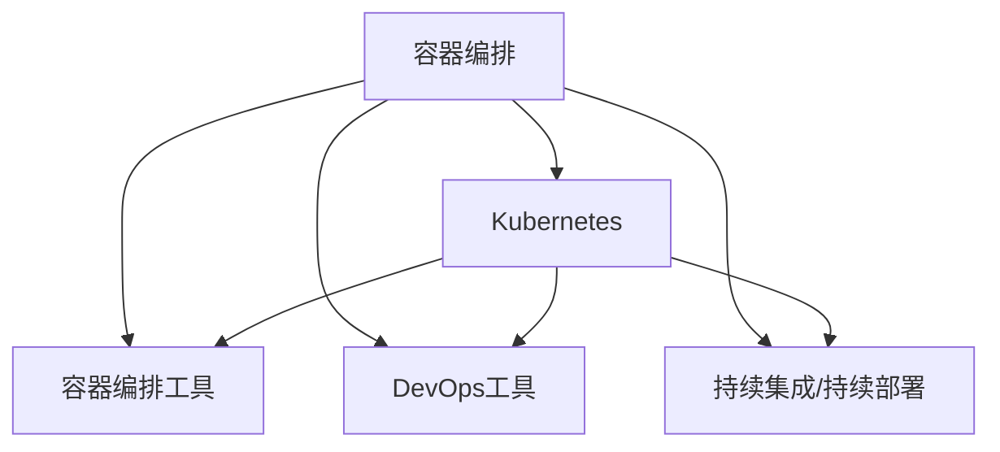
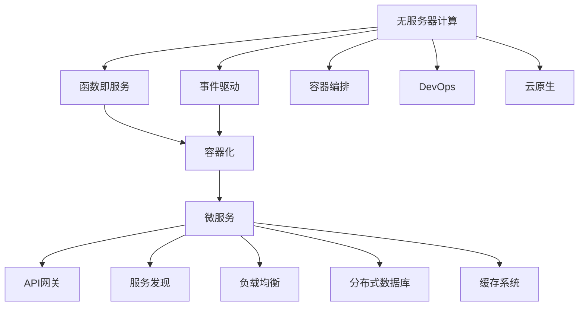

                 

# 软件2.0的无服务器计算架构

## 1. 背景介绍

### 1.1 问题由来
随着云计算技术的迅猛发展，无服务器计算（Serverless Computing）成为了云计算领域的一个重要趋势。与传统服务器端编程不同，无服务器计算打破了服务器的边界，使得开发和部署更加灵活、高效。

### 1.2 问题核心关键点
无服务器计算的核心在于“按需计费”的架构设计，即开发者只需要上传代码，无须管理底层计算资源，按实际使用量付费。这种架构模式降低了开发者的运维成本，提高了应用的部署效率，同时也推动了微服务、函数即服务（FaaS）等新兴技术的发展。

### 1.3 问题研究意义
研究无服务器计算架构，对于推动云计算技术的发展，降低企业IT成本，提高软件开发和部署的效率，具有重要意义：

1. 降低运维成本。无服务器架构大大减少了对底层服务器和网络的维护，开发和运维更加便捷。
2. 提升应用部署效率。开发者只需上传代码即可部署应用，不再需要烦琐的配置和部署流程。
3. 促进云计算技术的应用。无服务器计算作为云计算的重要组成部分，推动了云原生、微服务架构等新兴技术的发展。
4. 推动软件2.0时代的到来。无服务器计算与函数即服务（FaaS）等技术相结合，推动了软件2.0时代的到来，开发者可以更专注于应用开发，而非基础设施管理。

## 2. 核心概念与联系

### 2.1 核心概念概述

为更好地理解无服务器计算架构，本节将介绍几个密切相关的核心概念：

- 无服务器计算(Serverless Computing)：指开发者只需上传代码，无须管理底层计算资源，按实际使用量付费的架构设计。
- 函数即服务（Function as a Service，FaaS）：一种无服务器计算服务，通过函数的方式进行编程和部署。
- 事件驱动（Event-Driven）：无服务器计算基于事件驱动，即通过事件触发函数的执行。
- 容器化（Containerization）：无服务器计算通常采用容器化技术，如Docker、Kubernetes等，以便更高效地管理应用和资源。
- 微服务（Microservice）：微服务架构是无服务器计算的重要应用场景，将大系统拆分成多个独立运行的小服务，提升系统的灵活性和可维护性。

这些核心概念之间的逻辑关系可以通过以下Mermaid流程图来展示：



这个流程图展示而无服务器计算的各个核心概念及其之间的关系：

1. 无服务器计算基于函数即服务，通过事件驱动方式执行函数。
2. 容器化技术用于更好地管理和部署应用。
3. 微服务架构是无服务器计算的重要应用场景。
4. 容器编排和DevOps是无服务器计算的关键支持技术。
5. 云原生技术是无服务器计算的重要组成部分。

### 2.2 概念间的关系

这些核心概念之间存在着紧密的联系，形成了无服务器计算架构的完整生态系统。下面我通过几个Mermaid流程图来展示这些概念之间的关系。

#### 2.2.1 无服务器计算的架构组成



这个流程图展示了无服务器计算架构的组成：

1. 无服务器计算基于函数即服务，通过事件驱动方式执行函数。
2. 容器化技术用于更好地管理和部署应用。
3. 微服务架构是无服务器计算的重要应用场景。
4. 容器编排和DevOps是无服务器计算的关键支持技术。
5. 云原生技术是无服务器计算的重要组成部分。

#### 2.2.2 函数即服务的实现方式



这个流程图展示了函数即服务的实现方式：

1. 函数即服务通过事件触发执行函数。
2. 函数执行无状态，按需计费。

#### 2.2.3 容器编排的架构组成



这个流程图展示了容器编排的架构组成：

1. 容器编排基于Kubernetes等容器编排工具。
2. 容器编排工具用于管理和调度容器。
3. DevOps工具用于自动化开发和部署流程。
4. 持续集成/持续部署用于实现高效的开发和部署。

### 2.3 核心概念的整体架构

最后，我们用一个综合的流程图来展示这些核心概念在大规模微服务架构中的整体架构：



这个综合流程图展示了无服务器计算在大规模微服务架构中的整体架构：

1. 无服务器计算基于函数即服务，通过事件驱动方式执行函数。
2. 容器化技术用于更好地管理和部署应用。
3. 微服务架构是无服务器计算的重要应用场景。
4. 容器编排和DevOps是无服务器计算的关键支持技术。
5. 云原生技术是无服务器计算的重要组成部分。
6. API网关、服务发现、负载均衡、分布式数据库和缓存系统是无服务器计算的重要组成部分。

## 3. 核心算法原理 & 具体操作步骤
### 3.1 算法原理概述

无服务器计算架构的核心在于“按需计费”的架构设计，即开发者只需上传代码，无须管理底层计算资源，按实际使用量付费。这种架构模式降低了开发者的运维成本，提高了应用的部署效率。

### 3.2 算法步骤详解

无服务器计算架构的实现步骤通常包括：

1. 代码上传：开发者将应用代码上传到云平台。
2. 事件触发：通过API网关、消息队列、Webhook等方式触发函数执行。
3. 函数执行：无服务器计算平台根据事件触发执行函数。
4. 资源管理：容器编排工具管理和调度容器。
5. 应用部署：DevOps工具自动化部署和配置应用。
6. 监控告警：云平台实时监控应用性能，设置告警规则。

### 3.3 算法优缺点

无服务器计算架构具有以下优点：

1. 降低运维成本：无须管理底层计算资源，开发和运维更加便捷。
2. 提升应用部署效率：开发者只需上传代码即可部署应用，不再需要烦琐的配置和部署流程。
3. 弹性伸缩：根据实际使用量动态扩展资源，提高应用的可用性和性能。
4. 按需计费：根据实际使用量付费，避免资源浪费。

同时，无服务器计算架构也存在以下缺点：

1. 冷启动延迟：函数执行需要一定的时间进行冷启动，可能会导致性能瓶颈。
2. 性能限制：函数执行时间、内存资源等限制可能导致某些复杂任务无法实现。
3. 成本风险：按需计费模式下，过度使用可能导致高昂的计算费用。

### 3.4 算法应用领域

无服务器计算架构已经在多个领域得到了广泛应用，例如：

- 应用开发：开发者可以使用无服务器架构快速开发、部署和发布应用。
- 企业级应用：大中型企业可以采用无服务器架构实现应用的自动化部署和管理。
- 物联网应用：物联网设备可以通过无服务器架构实现快速部署和扩展。
- 移动应用：移动应用可以使用无服务器架构实现后台服务的快速开发和部署。
- 数据分析：大数据分析任务可以使用无服务器架构进行快速部署和扩展。

除了上述这些经典应用场景外，无服务器计算架构还在越来越多的领域得到应用，如金融科技、医疗健康、智能制造等，为各行各业带来了新的变革。

## 4. 数学模型和公式 & 详细讲解 & 举例说明

### 4.1 数学模型构建

为了更好地理解无服务器计算架构的数学模型，我们将基于实际应用场景构建模型，并给出具体的数学公式推导。

假设一个典型的电商应用，采用无服务器计算架构实现。该应用的访问流量由以下函数描述：

$$ T(t) = A + B \times \sin(2\pi t/T_0) + C \times \cos(2\pi t/T_0) $$

其中，$T(t)$ 为$t$时刻的访问流量，$A$为基本访问流量，$B$为正弦波振幅，$T_0$为正弦波周期，$C$为余弦波振幅。

### 4.2 公式推导过程

在无服务器计算架构中，函数执行的时间和资源消耗是未知的，但可以通过以下公式计算：

$$ C(t) = k \times f(t) \times r(t) $$

其中，$C(t)$ 为$t$时刻函数执行的成本，$k$为函数执行的单价，$f(t)$ 为函数执行的时间，$r(t)$ 为函数执行的资源消耗。

为了最小化总成本，我们可以使用以下优化目标：

$$ \min_{A, B, C, T_0} \int_{0}^{T} C(t) dt $$

这是一个典型的单目标优化问题。通过求解该问题，可以计算出最佳的函数执行参数，最小化总成本。

### 4.3 案例分析与讲解

以电商应用为例，假设该应用在$t_1$时刻的访问流量为$T_1$，函数执行时间为$f_1$，资源消耗为$r_1$。通过计算可以得到该时刻的函数执行成本$C_1$。

$$ C_1 = k \times f_1 \times r_1 $$

将$C_1$代入总成本公式，得到：

$$ C_{total} = \int_{0}^{t_1} C(t) dt + k \times f_1 \times r_1 $$

为了最小化总成本，需要找到最佳的函数执行参数$A, B, C, T_0$。可以通过以下步骤实现：

1. 对$C_1$进行灵敏度分析，找出对总成本影响最大的参数。
2. 优化函数执行参数，使函数执行时间$f(t)$和资源消耗$r(t)$尽可能接近最优值。
3. 通过云计算平台实时监控应用性能，动态调整资源配置，实现弹性伸缩。

## 5. 项目实践：代码实例和详细解释说明
### 5.1 开发环境搭建

在进行无服务器计算实践前，我们需要准备好开发环境。以下是使用Python进行AWS Lambda开发的环境配置流程：

1. 安装AWS CLI：从官网下载并安装AWS CLI，用于与AWS云平台交互。

2. 配置AWS账户：在AWS管理控制台中创建或配置AWS账户，确保具有必要的权限。

3. 安装Python解释器：安装Python 3.x版本的解释器，确保与AWS Lambda支持的环境一致。

4. 安装相关库：安装AWS Lambda所需的库和依赖，如boto3、Flask等。

完成上述步骤后，即可在AWS Lambda上进行无服务器计算实践。

### 5.2 源代码详细实现

这里我们以一个简单的电商应用为例，展示如何在AWS Lambda上实现无服务器计算架构。

首先，编写应用代码：

```python
from flask import Flask
app = Flask(__name__)

@app.route('/')
def hello_world():
    return 'Hello, World!'
```

然后，创建Docker镜像：

```bash
docker build -t my-lambda .
```

接着，将Docker镜像上传到AWS Lambda：

```bash
aws lambda update-function-code --function-name my-lambda --zip-file fileb://my-lambda.zip
```

最后，设置触发器：

```bash
aws lambda add-trigger --function-name my-lambda --event my-event --filter "key=eventMyEvent && value=my-value" --service arn:aws:events:region:account-id:service
```

这样，应用就可以通过事件触发器自动启动，实现无服务器计算架构。

### 5.3 代码解读与分析

让我们再详细解读一下关键代码的实现细节：

**应用代码**：
- 使用Flask框架创建简单的Web应用，监听根路径。

**Docker镜像**：
- 使用Docker命令将应用代码打包成镜像，方便在云平台部署。

**Lambda上传**：
- 使用AWS CLI上传Docker镜像到Lambda函数，并进行配置。

**触发器设置**：
- 使用AWS CLI设置触发器，将Lambda函数绑定到指定事件。

在实践中，我们还需要根据具体应用场景，进行更深入的配置和优化。例如，调整函数执行时间和资源消耗，设置合适的函数执行参数，优化应用的响应速度和性能。

### 5.4 运行结果展示

假设我们在AWS Lambda上部署上述应用，并通过API网关触发函数执行。最终，我们可以通过API网关访问应用，验证函数执行的正确性。

## 6. 实际应用场景
### 6.1 电商系统

无服务器计算架构可以广泛应用于电商系统，实现应用的快速部署和扩展。电商系统需要实时处理大量用户请求，无服务器架构可以有效降低运维成本，提升系统的稳定性和可靠性。

在技术实现上，电商应用可以使用AWS Lambda、API网关、RDS等云服务，快速部署和管理电商系统。同时，可以采用无服务器架构进行库存管理、订单处理、物流跟踪等业务功能的开发和部署。

### 6.2 金融系统

金融系统对系统的稳定性和可靠性要求极高，无服务器计算架构可以满足这些要求。例如，银行可以使用无服务器架构实现账户管理、交易处理、风险控制等功能。

在技术实现上，金融应用可以使用AWS Lambda、SNS、Kinesis等云服务，实现应用的快速部署和扩展。同时，可以采用无服务器架构进行数据清洗、模型训练、实时分析等业务功能的开发和部署。

### 6.3 智能制造

智能制造需要对大量的传感器数据进行实时处理和分析，无服务器计算架构可以提供高效的解决方案。例如，工业企业可以使用无服务器架构实现设备的监控和维护、生产线的优化和调整等功能。

在技术实现上，智能制造应用可以使用AWS Lambda、Kinesis、S3等云服务，实现应用的快速部署和扩展。同时，可以采用无服务器架构进行实时数据采集、分析和可视化，提升生产效率和质量。

### 6.4 未来应用展望

随着无服务器计算架构的不断成熟，未来的应用场景将更加广泛。以下是几个未来可能的应用方向：

1. 物联网设备：物联网设备可以使用无服务器架构实现快速部署和扩展，提升设备的智能化水平。
2. 人工智能应用：AI模型可以使用无服务器架构进行快速部署和训练，提升算法的应用效率。
3. 自动驾驶：自动驾驶系统可以使用无服务器架构实现实时数据处理和分析，提升系统的智能化和安全性。
4. 智慧城市：智慧城市应用可以使用无服务器架构实现实时数据采集和处理，提升城市管理的智能化水平。

这些应用方向的探索和发展，必将进一步推动无服务器计算架构的普及和应用，为各行各业带来新的变革。

## 7. 工具和资源推荐
### 7.1 学习资源推荐

为了帮助开发者系统掌握无服务器计算架构的理论基础和实践技巧，这里推荐一些优质的学习资源：

1. AWS Lambda官方文档：Amazon Web Services提供的官方文档，包含详细的API、SDK和示例代码，是入门无服务器计算架构的最佳资源。
2. Serverless Architectures with AWS Lambda: 由AWS官方发布的教程，深入浅出地介绍了无服务器计算架构和AWS Lambda的使用方法。
3. 《Serverless Architectures》书籍：O'Reilly出版社出版的书籍，全面介绍了无服务器计算架构的理论和实践。
4. 《The Serverless Compendium》在线资源：综合性的无服务器计算资源，包含大量的教程、示例和最佳实践。
5. 《Serverless Architecture Patterns》视频课程：Udemy平台上提供的在线课程，涵盖无服务器计算架构的各种模式和最佳实践。

通过对这些资源的学习实践，相信你一定能够快速掌握无服务器计算架构的精髓，并用于解决实际的IT问题。

### 7.2 开发工具推荐

高效的开发离不开优秀的工具支持。以下是几款用于无服务器计算开发的常用工具：

1. AWS CLI：Amazon Web Services提供的命令行工具，用于与云平台交互，管理和部署应用。
2. Docker：开源的容器化平台，用于打包应用，实现快速部署和扩展。
3. Kubernetes：开源的容器编排平台，用于管理和调度容器，实现高效的部署和运维。
4. AWS SAM：Amazon Web Services提供的Serverless Application Model，用于自动化部署和配置无服务器应用。
5. AWS CDK：Amazon Web Services提供的云开发工具，用于创建和管理云基础设施。

合理利用这些工具，可以显著提升无服务器计算应用的开发效率，加快创新迭代的步伐。

### 7.3 相关论文推荐

无服务器计算架构的研究源于学界的持续研究。以下是几篇奠基性的相关论文，推荐阅读：

1. Serverless Computing: Concepts, Technology and Economics（Serverless计算：概念、技术与经济学）：由UCLA、Microsoft Research和Amazon合作的综述性论文，系统介绍了Serverless计算的技术背景和应用场景。
2. Multi-Server, Multi-Task Machine Learning: Elastic and Efficient Machine Learning in the Cloud（多服务器、多任务机器学习：云计算中的弹性与高效机器学习）：由Microsoft Research发表的论文，探讨了Serverless计算在机器学习中的应用。
3. Resource Management in Serverless Environments（Serverless环境下的资源管理）：由AMI、Microsoft和IBM联合发表的论文，讨论了Serverless环境下的资源管理策略。
4. Towards Elastic and Scalable Deep Learning for Mobile Applications（面向移动应用的弹性可扩展深度学习）：由Cornell University发表的论文，探讨了Serverless计算在移动应用中的深度学习应用。
5. Designing Effective Serverless Applications（设计有效的Serverless应用）：由Microsoft Research发表的论文，讨论了Serverless应用的优化设计方法。

这些论文代表了大规模无服务器计算技术的发展脉络。通过学习这些前沿成果，可以帮助研究者把握学科前进方向，激发更多的创新灵感。

除上述资源外，还有一些值得关注的前沿资源，帮助开发者紧跟无服务器计算技术的最新进展，例如：

1. arXiv论文预印本：人工智能领域最新研究成果的发布平台，包括大量尚未发表的前沿工作，学习前沿技术的必读资源。
2. 业界技术博客：如AWS官方博客、Google Cloud Blog等，第一时间分享他们的最新研究成果和洞见。
3. 技术会议直播：如AWS re:Invent、Google I/O、Microsoft Build等，能够聆听到大佬们的前沿分享，开拓视野。
4. GitHub热门项目：在GitHub上Star、Fork数最多的无服务器计算相关项目，往往代表了该技术领域的发展趋势和最佳实践，值得去学习和贡献。
5. 行业分析报告：各大咨询公司如McKinsey、PwC等针对无服务器计算行业的分析报告，有助于从商业视角审视技术趋势，把握应用价值。

总之，对于无服务器计算技术的学习和实践，需要开发者保持开放的心态和持续学习的意愿。多关注前沿资讯，多动手实践，多思考总结，必将收获满满的成长收益。

## 8. 总结：未来发展趋势与挑战
### 8.1 研究成果总结

本文对无服务器计算架构进行了全面系统的介绍。首先阐述了无服务器计算的起源、原理和应用场景，明确了无服务器计算架构在云计算技术中的重要地位。其次，从原理到实践，详细讲解了无服务器计算架构的实现步骤，给出了无服务器计算架构的完整代码实例。同时，本文还广泛探讨了无服务器计算架构在电商、金融、智能制造等多个行业领域的应用前景，展示了无服务器计算架构的巨大潜力。此外，本文精选了无服务器计算架构的学习资源，力求为读者提供全方位的技术指引。

通过本文的系统梳理，可以看到，无服务器计算架构正在成为云计算技术的重要组成部分，极大地降低了企业IT成本，提升了应用的部署效率。未来，伴随无服务器计算架构的不断成熟，将有越来越多的应用场景得到实现，推动云计算技术的发展和应用。

### 8.2 未来发展趋势

展望未来，无服务器计算架构将呈现以下几个发展趋势：

1. 更高的可伸缩性：无服务器计算架构将进一步提升弹性伸缩能力，支持更大规模、更高频率的访问流量。
2. 更强的资源管理：无服务器计算架构将引入更多的资源管理工具和策略，提高资源利用率。
3. 更多的服务集成：无服务器计算架构将支持更多的云服务集成，实现更全面的功能和服务。
4. 更高的安全性：无服务器计算架构将引入更多的安全保障措施，保护数据和应用安全。
5. 更强的可扩展性：无服务器计算架构将支持更多的开发语言和框架，提高应用的灵活性。

这些趋势凸显了无服务器计算架构的广阔前景。这些方向的探索发展，必将进一步提升无服务器计算架构的性能和应用范围，为云计算技术的发展和应用带来新的动力。

### 8.3 面临的挑战

尽管无服务器计算架构已经取得了瞩目成就，但在迈向更加智能化、普适化应用的过程中，它仍面临着诸多挑战：

1. 冷启动延迟：函数执行需要一定的时间进行冷启动，可能会导致性能瓶颈。
2. 性能限制：函数执行时间、内存资源等限制可能导致某些复杂任务无法实现。
3. 成本风险：按需计费模式下，过度使用可能导致高昂的计算费用。
4. 安全问题：无服务器架构下，数据和应用的安全保障需要加强。
5. 资源管理：无服务器架构需要高效的管理工具和策略，保证资源的最优利用。

### 8.4 研究展望

面对无服务器计算架构所面临的挑战，未来的研究需要在以下几个方面寻求新的突破：

1. 冷启动优化：通过优化函数执行引擎和资源管理策略，减小冷启动延迟。
2. 性能优化：改进函数执行时间和内存消耗的算法，支持更复杂任务的执行。
3. 成本控制：引入更细粒度的计费策略和预算控制，避免过度使用导致的成本风险。
4. 安全性增强：引入更多的安全保障措施，保护数据和应用安全。
5. 资源管理优化：开发更高效的管理工具和策略，保证资源的最优利用。

这些研究方向的探索，必将引领无服务器计算架构迈向更高的台阶，为云计算技术的发展和应用带来新的动力。相信随着学界和产业界的共同努力，这些挑战终将一一被克服，无服务器计算架构必将在构建人机协同的智能时代中扮演越来越重要的角色。

## 9. 附录：常见问题与解答

**Q1：无服务器计算架构与传统服务器端编程有何区别？**

A: 无服务器计算架构与传统服务器端编程的最大区别在于，无服务器计算架构不需要开发者管理底层计算资源，按实际使用量付费。开发者只需上传代码，无须关注服务器的部署、配置、运维等环节，大大降低了运维成本。

**Q2：无服务器计算架构的优势和劣势是什么？**

A: 无服务器计算架构的主要优势包括：
1. 降低运维成本：无须管理底层计算资源，开发和运维更加便捷。
2. 提升应用部署效率：开发者只需上传代码即可部署应用，不再需要烦琐的配置和部署流程。
3. 弹性伸缩：根据实际使用量动态扩展资源，提高应用的可用性和性能。
4. 按需计费：根据实际使用量付费，避免资源浪费。

无服务器计算架构的主要劣势包括：
1. 冷启动延迟：函数执行需要一定的时间进行冷启动，可能会导致性能瓶颈。
2. 性能限制：函数执行时间、内存资源等限制可能导致某些复杂任务无法实现。
3. 成本风险：按需计费模式下，过度使用可能导致高昂的计算费用。

**Q3：无服务器计算架构适用于哪些场景？**

A: 无服务器计算架构适用于各种应用场景，特别是对运维成本、部署效率和资源管理要求较高的场景。例如：
1. 电商系统：需要实时处理大量用户请求，无服务器架构可以有效降低运维成本，提升系统的稳定性和可靠性。
2. 金融系统：对系统的稳定性和可靠性要求极高，无服务器计算架构可以满足这些要求。
3. 智能制造：需要对大量的传感器数据进行实时处理和分析，无服务器架构可以提供高效的解决方案。
4. 物联网设备：物联网设备可以使用无服务器架构实现快速部署和扩展，提升设备的智能化水平。

总之，无服务器计算架构适用于任何需要高效、灵活、弹性部署的应用场景。

**Q4：如何使用AWS Lambda实现无服务器计算架构？**

A: 使用AWS Lambda实现无服务器计算架构主要包括以下步骤：
1. 编写应用代码，并将其打包成Docker镜像。
2. 使用AWS CLI上传Docker镜像到AWS Lambda。
3. 设置触发器，将Lambda函数绑定到指定事件。

例如，可以使用以下命令将应用代码上传和配置到AWS Lambda：

```bash
docker build -t my-lambda .
aws lambda update-function-code --function-name my-lambda --zip-file fileb://my-lambda.zip
```

**Q5：无服务器计算架构的缺点有哪些？**

A

