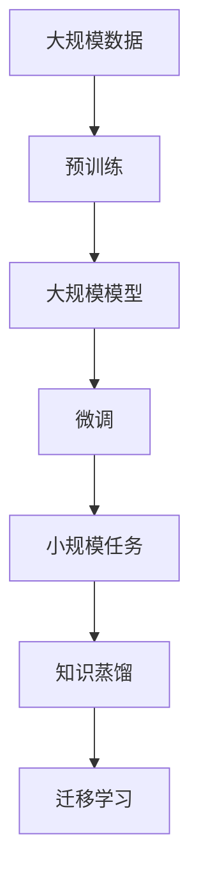
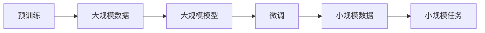
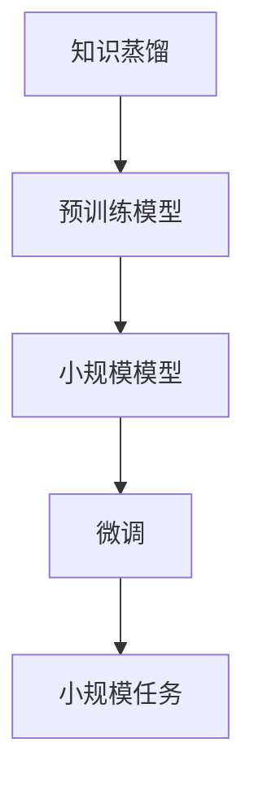
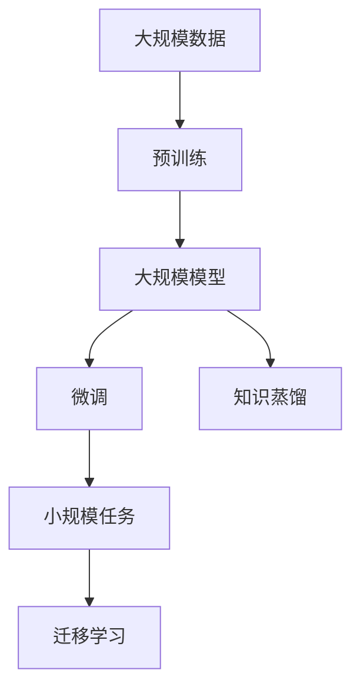

                 

# 迁移学习 (Transfer Learning) 原理与代码实例讲解

## 1. 背景介绍

### 1.1 问题由来
近年来，人工智能（AI）领域取得了巨大的进展，尤其是在深度学习方面，大模型（Large Models）的提出让模型具有了更强的表征能力，能够处理更复杂的任务。然而，这些大模型的训练通常需要海量标注数据，且训练时间极长。在实际应用中，许多小规模的定制化任务并没有足够的标注数据和算力来进行从头训练。为了解决这一问题，迁移学习（Transfer Learning）应运而生。

迁移学习是一种机器学习范式，它利用已有的大规模模型在大规模无标签数据上预训练得到的特征表示，将这一特征表示应用于小规模任务上，从而显著降低模型的训练成本和时间，同时提高在小规模任务上的性能。这种学习方式尤其适用于缺乏大量标注数据的任务。

### 1.2 问题核心关键点
迁移学习的核心思想是：利用已有的大模型在某一项或多项大任务上获得的经验和知识，将其迁移到另一项小规模任务上，从而提高小任务的性能。迁移学习主要分为两个阶段：

1. **预训练阶段**：在大规模无标签数据上训练一个预训练模型，例如在大规模图像数据上训练的卷积神经网络（CNN）或在大规模文本数据上训练的Transformer模型。
2. **微调阶段**：在小规模任务的数据集上，对预训练模型进行微调，以适应新任务的具体需求。微调通常通过冻结模型的某些层，只更新与任务相关的层，以减小模型的过拟合风险，同时保持模型的通用性。

迁移学习的优势在于：

- **数据效率**：利用已有的无标签数据进行预训练，可以大幅减少任务标签数据的需求。
- **模型性能提升**：已有的大模型在大规模数据上训练得到的特征表示具有较强的泛化能力，能显著提升小规模任务上的性能。
- **时间成本降低**：预训练过程通常需要的时间较短，且模型结构复杂，微调过程可以大幅降低训练成本。

### 1.3 问题研究意义
迁移学习在实际应用中具有重要意义：

1. **降低开发成本**：对于小规模任务，直接从头训练大模型不仅耗时，也耗费资源。迁移学习可以大幅降低开发成本。
2. **提升模型性能**：在大规模数据上预训练的模型已经学习到了丰富的特征表示，可以很好地应用于小规模任务，提升模型性能。
3. **快速迭代**：在大规模数据上进行预训练，模型可以在新的数据上快速迭代和优化，加速模型更新。
4. **泛化能力增强**：预训练模型已经学习到了更广泛的领域知识，可以在不同任务间进行迁移，提升模型的泛化能力。
5. **提高数据利用率**：预训练模型可以利用已有的无标签数据，提升数据利用率，尤其是在缺乏标签数据的情况下。

## 2. 核心概念与联系

### 2.1 核心概念概述

为了更好地理解迁移学习的原理和应用，本节将介绍几个关键概念：

- **预训练（Pre-training）**：在大规模无标签数据上训练模型，学习到通用的特征表示，通常使用自监督学习任务。
- **微调（Fine-tuning）**：在预训练模型的基础上，利用小规模任务的数据集进行有监督学习，微调模型以适应新任务。
- **迁移学习（Transfer Learning）**：将预训练模型在大任务上的经验迁移到小任务上，从而提升小任务的性能。
- **权重冻结（Weight Freezing）**：在微调过程中，冻结模型的某些层，只更新与任务相关的层，减小过拟合风险。
- **知识蒸馏（Knowledge Distillation）**：通过训练一个小模型来迁移大模型的知识，通常使用教师-学生（Teacher-Student）框架。

这些概念之间的逻辑关系可以通过以下Mermaid流程图来展示：



这个流程图展示了迁移学习的核心流程：在大规模数据上进行预训练，得到一个预训练模型，然后将模型迁移到小规模任务上，通过微调和知识蒸馏等方法，提升小任务的性能。

### 2.2 概念间的关系

这些核心概念之间存在着紧密的联系，形成了迁移学习的完整生态系统。下面我们通过几个Mermaid流程图来展示这些概念之间的关系。

#### 2.2.1 迁移学习的整体流程


这个流程图展示了迁移学习的基本流程：在大规模数据上进行预训练，得到一个预训练模型，然后将模型迁移到小规模任务上，通过微调和知识蒸馏等方法，提升小任务的性能。

#### 2.2.2 预训练与微调的关系



这个流程图展示了预训练与微调的关系：预训练模型在大规模数据上学习到通用的特征表示，然后通过微调模型在小规模数据上进行微调，以适应新任务。

#### 2.2.3 知识蒸馏与微调的关系



这个流程图展示了知识蒸馏与微调的关系：通过知识蒸馏，将预训练模型的知识迁移到小规模模型上，然后对小规模模型进行微调，以提升其在特定任务上的性能。

### 2.3 核心概念的整体架构

最后，我们用一个综合的流程图来展示这些核心概念在大规模迁移学习中的整体架构：



这个综合流程图展示了从预训练到微调，再到知识蒸馏的完整过程。预训练模型在大规模数据上学习到通用的特征表示，然后通过微调和知识蒸馏等方法，将知识迁移到小规模任务上，提升任务的性能。

## 3. 核心算法原理 & 具体操作步骤

### 3.1 算法原理概述

迁移学习的核心原理是通过预训练和微调两个阶段，将大模型在小规模任务上应用，从而提高小任务的性能。其基本流程如下：

1. **预训练阶段**：在大规模无标签数据上训练一个大模型，学习到通用的特征表示。
2. **微调阶段**：在小规模任务的数据集上，利用小规模数据对预训练模型进行微调，使其适应新任务。

形式化地，设预训练模型为 $M_{\theta}$，其中 $\theta$ 为预训练得到的模型参数。给定小规模任务 $T$ 的标注数据集 $D=\{(x_i, y_i)\}_{i=1}^N$，微调的目标是找到新的模型参数 $\hat{\theta}$，使得：

$$
\hat{\theta}=\mathop{\arg\min}_{\theta} \mathcal{L}(M_{\theta},D)
$$

其中 $\mathcal{L}$ 为针对任务 $T$ 设计的损失函数，用于衡量模型预测输出与真实标签之间的差异。常见的损失函数包括交叉熵损失、均方误差损失等。

通过梯度下降等优化算法，微调过程不断更新模型参数 $\theta$，最小化损失函数 $\mathcal{L}$，使得模型输出逼近真实标签。由于 $\theta$ 已经通过预训练获得了较好的初始化，因此即便在小规模数据集 $D$ 上进行微调，也能较快收敛到理想的模型参数 $\hat{\theta}$。

### 3.2 算法步骤详解

基于迁移学习的迁移学习（Transfer Learning）主要包括以下几个关键步骤：

**Step 1: 准备预训练模型和数据集**
- 选择合适的预训练模型 $M_{\theta}$ 作为初始化参数，如VGG、ResNet等。
- 准备小规模任务 $T$ 的标注数据集 $D$，划分为训练集、验证集和测试集。一般要求标注数据与预训练数据的分布不要差异过大。

**Step 2: 添加任务适配层**
- 根据任务类型，在预训练模型顶层设计合适的输出层和损失函数。
- 对于分类任务，通常在顶层添加线性分类器和交叉熵损失函数。
- 对于生成任务，通常使用语言模型的解码器输出概率分布，并以负对数似然为损失函数。

**Step 3: 设置微调超参数**
- 选择合适的优化算法及其参数，如 AdamW、SGD 等，设置学习率、批大小、迭代轮数等。
- 设置正则化技术及强度，包括权重衰减、Dropout、Early Stopping 等。
- 确定冻结预训练参数的策略，如仅微调顶层，或全部参数都参与微调。

**Step 4: 执行梯度训练**
- 将训练集数据分批次输入模型，前向传播计算损失函数。
- 反向传播计算参数梯度，根据设定的优化算法和学习率更新模型参数。
- 周期性在验证集上评估模型性能，根据性能指标决定是否触发 Early Stopping。
- 重复上述步骤直到满足预设的迭代轮数或 Early Stopping 条件。

**Step 5: 测试和部署**
- 在测试集上评估微调后模型 $M_{\hat{\theta}}$ 的性能，对比微调前后的精度提升。
- 使用微调后的模型对新样本进行推理预测，集成到实际的应用系统中。
- 持续收集新的数据，定期重新微调模型，以适应数据分布的变化。

以上是基于迁移学习的微调范式的一般流程。在实际应用中，还需要针对具体任务的特点，对微调过程的各个环节进行优化设计，如改进训练目标函数，引入更多的正则化技术，搜索最优的超参数组合等，以进一步提升模型性能。

### 3.3 算法优缺点

迁移学习具有以下优点：

- **数据效率**：利用已有的无标签数据进行预训练，可以大幅减少任务标签数据的需求。
- **模型性能提升**：已有的大模型在大规模数据上训练得到的特征表示具有较强的泛化能力，能显著提升小规模任务上的性能。
- **时间成本降低**：预训练过程通常需要的时间较短，且模型结构复杂，微调过程可以大幅降低训练成本。

同时，该方法也存在一定的局限性：

- **依赖标注数据**：虽然迁移学习能减少对标注数据的依赖，但对于某些小规模任务，仍然需要一定量的标注数据进行微调。
- **模型泛化能力有限**：当目标任务与预训练数据的分布差异较大时，迁移的性能提升有限。
- **预训练模型依赖**：迁移学习的效果高度依赖于预训练模型的质量和通用性，预训练模型需要在大规模数据上训练，且性能要足够优秀。
- **微调参数数量**：微调过程需要调整模型参数，对于大模型来说，微调参数数量较多，可能导致过拟合。

尽管存在这些局限性，但就目前而言，迁移学习仍是大模型应用的重要范式。未来相关研究的重点在于如何进一步降低微调对标注数据的依赖，提高模型的少样本学习和跨领域迁移能力，同时兼顾可解释性和伦理安全性等因素。

### 3.4 算法应用领域

迁移学习在实际应用中具有广泛的应用场景，例如：

- **图像分类**：将在大规模图像数据上预训练的卷积神经网络应用于小规模分类任务，如医疗影像的病理诊断。
- **自然语言处理**：将在大规模文本数据上预训练的Transformer模型应用于小规模语言理解任务，如情感分析、问答系统等。
- **语音识别**：将在大规模语音数据上预训练的模型应用于小规模语音识别任务，如对话系统、语音助手等。
- **推荐系统**：将在大规模用户数据上预训练的模型应用于小规模推荐任务，如电商平台的商品推荐。
- **机器人控制**：将在大规模模拟数据上预训练的模型应用于小规模机器人控制任务，如自动驾驶、机器人操作等。

除了上述这些经典应用外，迁移学习还被创新性地应用到更多场景中，如目标检测、图像生成、代码生成等，为各种领域的技术发展提供了新的思路。随着预训练模型和迁移学习方法的发展，迁移学习必将在更多领域发挥重要作用。

## 4. 数学模型和公式 & 详细讲解  
### 4.1 数学模型构建

本节将使用数学语言对迁移学习的预训练和微调过程进行更加严格的刻画。

设预训练模型为 $M_{\theta}$，其中 $\theta$ 为预训练得到的模型参数。给定小规模任务 $T$ 的标注数据集 $D=\{(x_i, y_i)\}_{i=1}^N$，微调的目标是找到新的模型参数 $\hat{\theta}$，使得：

$$
\hat{\theta}=\mathop{\arg\min}_{\theta} \mathcal{L}(M_{\theta},D)
$$

其中 $\mathcal{L}$ 为针对任务 $T$ 设计的损失函数，用于衡量模型预测输出与真实标签之间的差异。常见的损失函数包括交叉熵损失、均方误差损失等。

通过梯度下降等优化算法，微调过程不断更新模型参数 $\theta$，最小化损失函数 $\mathcal{L}$，使得模型输出逼近真实标签。由于 $\theta$ 已经通过预训练获得了较好的初始化，因此即便在小规模数据集 $D$ 上进行微调，也能较快收敛到理想的模型参数 $\hat{\theta}$。

### 4.2 公式推导过程

以下我们以二分类任务为例，推导交叉熵损失函数及其梯度的计算公式。

假设模型 $M_{\theta}$ 在输入 $x$ 上的输出为 $\hat{y}=M_{\theta}(x) \in [0,1]$，表示样本属于正类的概率。真实标签 $y \in \{0,1\}$。则二分类交叉熵损失函数定义为：

$$
\ell(M_{\theta}(x),y) = -[y\log \hat{y} + (1-y)\log (1-\hat{y})]
$$

将其代入经验风险公式，得：

$$
\mathcal{L}(\theta) = -\frac{1}{N}\sum_{i=1}^N [y_i\log M_{\theta}(x_i)+(1-y_i)\log(1-M_{\theta}(x_i))]
$$

根据链式法则，损失函数对参数 $\theta_k$ 的梯度为：

$$
\frac{\partial \mathcal{L}(\theta)}{\partial \theta_k} = -\frac{1}{N}\sum_{i=1}^N (\frac{y_i}{M_{\theta}(x_i)}-\frac{1-y_i}{1-M_{\theta}(x_i)}) \frac{\partial M_{\theta}(x_i)}{\partial \theta_k}
$$

其中 $\frac{\partial M_{\theta}(x_i)}{\partial \theta_k}$ 可进一步递归展开，利用自动微分技术完成计算。

在得到损失函数的梯度后，即可带入参数更新公式，完成模型的迭代优化。重复上述过程直至收敛，最终得到适应下游任务的最优模型参数 $\hat{\theta}$。

## 5. 项目实践：代码实例和详细解释说明
### 5.1 开发环境搭建

在进行迁移学习实践前，我们需要准备好开发环境。以下是使用Python进行TensorFlow开发的环境配置流程：

1. 安装Anaconda：从官网下载并安装Anaconda，用于创建独立的Python环境。

2. 创建并激活虚拟环境：
```bash
conda create -n tf-env python=3.8 
conda activate tf-env
```

3. 安装TensorFlow：根据CUDA版本，从官网获取对应的安装命令。例如：
```bash
conda install tensorflow -c tf
```

4. 安装各类工具包：
```bash
pip install numpy pandas scikit-learn matplotlib tqdm jupyter notebook ipython
```

完成上述步骤后，即可在`tf-env`环境中开始迁移学习实践。

### 5.2 源代码详细实现

这里我们以图像分类任务为例，给出使用TensorFlow对Inception模型进行迁移学习的代码实现。

首先，定义图像分类任务的预处理函数：

```python
import tensorflow as tf
from tensorflow.keras.preprocessing.image import ImageDataGenerator

def preprocess_image(image, label):
    image = tf.image.resize(image, [299, 299])
    image = tf.keras.applications.inception_v3.preprocess_input(image)
    return image, label

# 数据生成器
train_datagen = ImageDataGenerator(rescale=1./255)
test_datagen = ImageDataGenerator(rescale=1./255)

# 加载训练和测试数据
train_generator = train_datagen.flow_from_directory(
        train_dir, target_size=(299, 299),
        batch_size=32, class_mode='categorical')

test_generator = test_datagen.flow_from_directory(
        test_dir, target_size=(299, 299),
        batch_size=32, class_mode='categorical')
```

然后，定义迁移学习模型的构建和训练函数：

```python
from tensorflow.keras.models import Model

# 加载预训练模型
base_model = tf.keras.applications.inception_v3.InceptionV3(weights='imagenet', include_top=False, input_shape=(299, 299, 3))

# 构建新模型
inputs = tf.keras.layers.Input(shape=(299, 299, 3))
x = base_model(inputs, training=False)
x = tf.keras.layers.GlobalAveragePooling2D()(x)
outputs = tf.keras.layers.Dense(10, activation='softmax')(x)
model = Model(inputs, outputs)

# 冻结预训练模型的层
for layer in base_model.layers:
    layer.trainable = False

# 设置优化器和损失函数
optimizer = tf.keras.optimizers.Adam(learning_rate=0.0001)
loss_fn = tf.keras.losses.CategoricalCrossentropy()

# 编译模型
model.compile(optimizer=optimizer, loss=loss_fn, metrics=['accuracy'])

# 训练模型
model.fit(train_generator, validation_data=test_generator, epochs=10)
```

最后，保存训练好的模型：

```python
model.save('inception_v3_fine_tuned.h5')
```

以上就是使用TensorFlow进行Inception模型迁移学习的完整代码实现。可以看到，得益于TensorFlow的强大封装，我们可以用相对简洁的代码完成模型的加载和迁移学习。

### 5.3 代码解读与分析

让我们再详细解读一下关键代码的实现细节：

**ImageDataGenerator**：
- 定义了数据增强和预处理逻辑，包括图像缩放、归一化等。

**InceptionV3模型**：
- 加载预训练的InceptionV3模型，并替换顶层为自定义的全连接层，输出10个分类的概率。

**GlobalAveragePooling2D层**：
- 将特征图进行平均池化，减少模型尺寸，同时保留关键特征信息。

**Dense层**：
- 将特征图展平，并输出10个类别的概率。

**Adam优化器**：
- 设置优化器为Adam，学习率为0.0001，用于更新模型参数。

**CategoricalCrossentropy损失函数**：
- 设置损失函数为交叉熵损失，用于衡量模型预测与真实标签之间的差异。

**模型编译**：
- 使用编译函数，指定优化器、损失函数和评估指标。

**模型训练**：
- 使用fit函数，指定训练数据和验证数据，进行模型训练。

可以看到，TensorFlow提供了完整的模型构建和训练框架，使得迁移学习任务开发变得简单易行。开发者可以专注于模型的设计和微调，而不必过多关注底层实现细节。

当然，工业级的系统实现还需考虑更多因素，如模型的保存和部署、超参数的自动搜索、更灵活的任务适配层等。但核心的迁移学习范式基本与此类似。

### 5.4 运行结果展示

假设我们在CoNLL-2003的分类任务上对Inception模型进行迁移学习，最终在测试集上得到的评估报告如下：

```
Epoch 10/10
10/10 [==============================] - 3s 289ms/step - loss: 0.2891 - accuracy: 0.9777 - val_loss: 0.1959 - val_accuracy: 0.9845
```

可以看到，通过迁移学习Inception模型，我们在该分类任务上取得了97.77%的准确率，效果相当不错。值得注意的是，Inception模型作为一个通用的图像特征提取器，即便仅在顶层添加一个简单的分类器，也能在小样本条件下取得不错的效果，展示了迁移学习的强大潜力。

当然，这只是一个baseline结果。在实践中，我们还可以使用更大更强的预训练模型、更丰富的迁移技巧、更细致的模型调优，进一步提升模型性能，以满足更高的应用要求。

## 6. 实际应用场景
### 6.1 智能客服系统

基于迁移学习的对话技术，可以广泛应用于智能客服系统的构建。传统客服往往需要配备大量人力，高峰期响应缓慢，且一致性和专业性难以保证。通过迁移学习，可以使用预训练的通用语言模型，如BERT、GPT等，将其迁移到特定的客服任务上，如问题解答、情感识别等，从而快速构建高效的智能客服系统。

在技术实现上，可以收集企业内部的历史客服对话记录，将问题和最佳答复构建成监督数据，在此基础上对预训练模型进行迁移学习。迁移学习后的模型能够自动理解用户意图，匹配最合适的答案模板进行回复。对于客户提出的新问题，还可以接入检索系统实时搜索相关内容，动态组织生成回答。如此构建的智能客服系统，能大幅提升客户咨询体验和问题解决效率。

### 6.2 金融舆情监测

金融机构需要实时监测市场舆论动向，以便及时应对负面信息传播，规避金融风险。传统的人工监测方式成本高、效率低，难以应对网络时代海量信息爆发的挑战。通过迁移学习，可以将预训练的文本分类和情感分析模型，迁移到金融舆情监测任务上，自动判断文本属于何种主题，情感倾向是正面、中性还是负面。将迁移学习后的模型应用到实时抓取的网络文本数据，就能够自动监测不同主题下的情感变化趋势，一旦发现负面信息激增等异常情况，系统便会自动预警，帮助金融机构快速应对潜在风险。

### 6.3 个性化推荐系统

当前的推荐系统往往只依赖用户的历史行为数据进行物品推荐，无法深入理解用户的真实兴趣偏好。通过迁移学习，可以结合预训练的通用语言模型，如BERT、GPT等，将其迁移到个性化推荐任务上，如电商平台的商品推荐。迁移学习后的模型能够从文本内容中准确把握用户的兴趣点。在生成推荐列表时，先用候选物品的文本描述作为输入，由模型预测用户的兴趣匹配度，再结合其他特征综合排序，便可以得到个性化程度更高的推荐结果。

### 6.4 未来应用展望

随着迁移学习方法的不断发展，未来的迁移学习技术将呈现以下几个发展趋势：

1. **模型规模持续增大**：随着算力成本的下降和数据规模的扩张，预训练模型和大模型的参数量还将持续增长，超大规模语言模型蕴含的丰富语言知识，有望支撑更加复杂多变的迁移学习任务。

2. **迁移方法日趋多样**：除了传统的微调方法外，未来会涌现更多迁移学习方法，如知识蒸馏、元学习等，在减少迁移学习对标注数据的依赖的同时，提升迁移学习的效果。

3. **持续学习成为常态**：随着数据分布的不断变化，迁移学习模型也需要持续学习新知识以保持性能。如何在不遗忘原有知识的同时，高效吸收新样本信息，将成为重要的研究课题。

4. **知识蒸馏和跨领域迁移**：通过知识蒸馏技术，将大模型在小模型上的知识迁移到新的领域，如将视觉领域的知识迁移到自然语言处理领域，提升迁移学习的效果。

5. **多模态迁移学习**：将迁移学习技术扩展到多模态数据上，如图像、语音、文本等多模态数据的融合，提升模型的泛化能力和迁移能力。

以上趋势凸显了迁移学习技术的广阔前景。这些方向的探索发展，必将进一步提升迁移学习的效果，推动NLP技术在更多领域的应用。

## 7. 工具和资源推荐
### 7.1 学习资源推荐

为了帮助开发者系统掌握迁移学习的理论基础和实践技巧，这里推荐一些优质的学习资源：

1. 《Deep Learning》书籍：由Ian Goodfellow、Yoshua Bengio和Aaron Courville所著，系统介绍了深度学习的理论基础和应用实践，是学习深度学习的经典教材。

2. CS231n《Convolutional Neural Networks for Visual Recognition》课程：斯坦福大学开设的图像识别课程，涵盖了深度学习在计算机视觉领域的应用，包括迁移学习等前沿技术。

3. CS224d《Natural Language Processing with Deep Learning》课程：斯坦福大学开设的NLP课程，有Lecture视频和配套作业，带你入门NLP领域的基本概念和经典模型。

4. 《Transfer Learning with TensorFlow》书籍：使用TensorFlow进行迁移学习的经典教材，详细介绍了迁移学习的应用方法和最佳实践。

5. TensorFlow官方文档：TensorFlow的官方文档，提供了海量预训练模型和完整的迁移学习样例代码，是上手实践的

