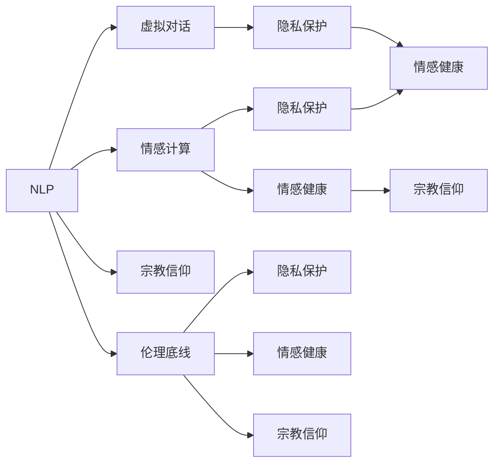
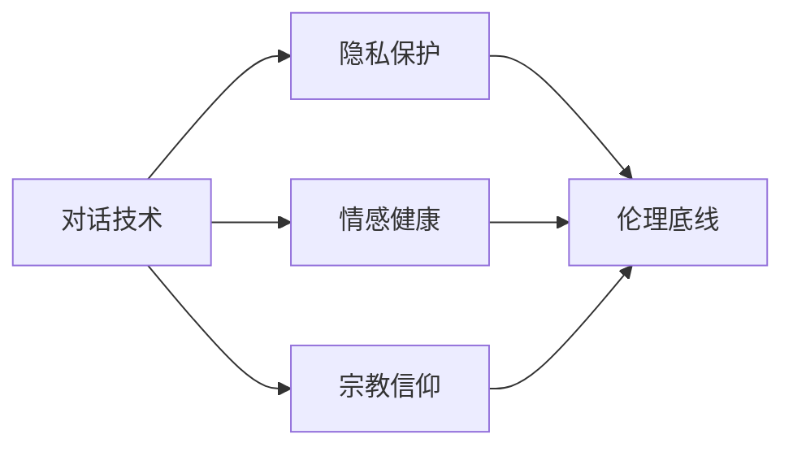
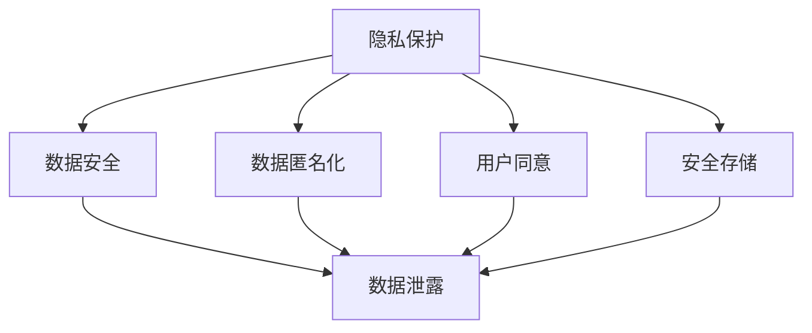
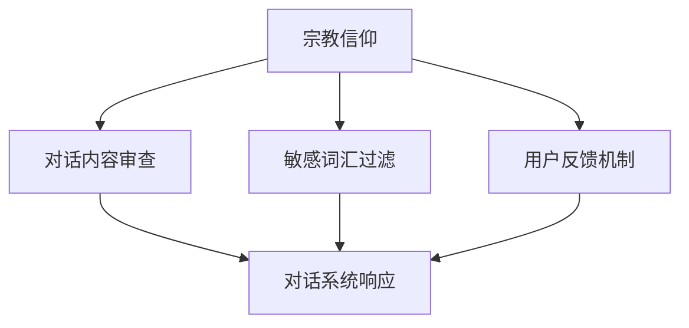
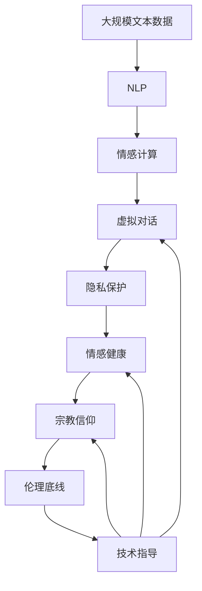

                 

# 过世亲人对话的伦理挑战

## 1. 背景介绍

### 1.1 问题由来
随着人工智能技术的快速发展，人们开始探讨使用智能助手与过世亲人对话的可能性。这种对话技术旨在通过自然语言处理和情感计算技术，帮助人们追忆逝去的亲人，缓解哀伤情绪，甚至试图构建一种跨越时空的虚拟对话。然而，这种技术的伦理挑战逐渐显现，引发了关于隐私、情感管理、宗教信仰以及伦理底线的激烈讨论。

### 1.2 问题核心关键点
过世亲人对话的核心伦理挑战主要包括以下几个方面：
- **隐私权**：使用者的私密对话内容是否会被泄露，是否存在数据安全问题。
- **情感健康**：对话技术是否会对用户的情感健康造成负面影响，如引发过度悲伤或心理创伤。
- **宗教信仰**：对话内容是否可能触犯用户的宗教信仰，或引发对死者的不尊重。
- **伦理底线**：这种虚拟对话是否会引发对死亡、永生、灵魂等深层次伦理问题的争议。

### 1.3 问题研究意义
探讨过世亲人对话的伦理挑战，对于指导技术开发、制定行业规范、保护用户权益以及维护社会伦理具有重要意义：

1. **技术指导**：明确了开发和使用此类对话技术时应遵循的伦理准则，避免技术滥用。
2. **规范制定**：为制定行业标准提供理论依据，确保对话技术的安全、合规。
3. **用户保护**：帮助用户在使用技术时更好地了解风险，保护隐私和情感健康。
4. **伦理思考**：引发关于人工智能、生死、灵魂等深层次伦理问题的讨论，促进社会伦理意识的提升。

## 2. 核心概念与联系

### 2.1 核心概念概述

为更好地理解过世亲人对话的伦理挑战，本节将介绍几个密切相关的核心概念：

- **自然语言处理(NLP)**：研究如何使计算机理解、处理和生成人类语言的技术。
- **情感计算**：结合心理学、计算机科学和神经科学，研究如何通过计算模型识别、理解、处理和生成人类情感的技术。
- **虚拟对话**：指通过计算机生成对话，模仿人类对话交互的仿真技术。
- **隐私保护**：保护个人数据不被未经授权的访问、收集、使用和泄露。
- **情感健康**：关注个体在心理健康、情感稳定等方面的福祉。
- **宗教信仰**：个体对于某种特定宗教或宗教观念的信仰和实践。
- **伦理底线**：指导行为是否道德、合法、公平的最低标准。

这些核心概念之间的逻辑关系可以通过以下Mermaid流程图来展示：



这个流程图展示了大语言模型微调过程中各个核心概念的关系：

1. NLP和情感计算作为技术基础，支撑虚拟对话。
2. 隐私保护、情感健康和宗教信仰是对话技术应用中需要考虑的关键伦理因素。
3. 伦理底线是判断技术应用是否道德、合法、公平的最低标准。

### 2.2 概念间的关系

这些核心概念之间存在着紧密的联系，形成了对话技术应用伦理的完整生态系统。下面我通过几个Mermaid流程图来展示这些概念之间的关系。

#### 2.2.1 对话技术与伦理的关系



这个流程图展示了对话技术与隐私保护、情感健康和宗教信仰之间的关系，以及这些因素如何共同影响伦理底线。

#### 2.2.2 隐私保护与对话技术



这个流程图展示了隐私保护措施如何通过数据安全、数据匿名化、用户同意和安全存储等手段，保障对话技术的安全性。

#### 2.2.3 宗教信仰与对话技术



这个流程图展示了宗教信仰如何在对话内容审查、敏感词汇过滤和用户反馈机制中得到体现和尊重。

### 2.3 核心概念的整体架构

最后，我们用一个综合的流程图来展示这些核心概念在大语言模型微调过程中的整体架构：



这个综合流程图展示了从预训练到对话技术应用，再到伦理底线评估的完整过程。对话技术在用户数据、情感处理、宗教信仰等多方面受伦理底线的指导和约束。

## 3. 核心算法原理 & 具体操作步骤
### 3.1 算法原理概述

过世亲人对话技术的核心算法原理主要基于自然语言处理和情感计算技术。通过预训练的语言模型和大规模对话数据，模型能够学习到语言的模式和情感的表达方式，从而生成与用户情感共鸣的虚拟对话内容。

这种对话技术通常包括以下几个步骤：

1. **数据收集与预处理**：收集与过世亲人相关的对话数据，并进行清洗、标注等预处理。
2. **模型训练**：使用预训练语言模型和大规模对话数据，训练情感计算模型。
3. **对话生成**：根据用户输入的情感描述或特定问题，生成符合用户情感需求的虚拟对话。
4. **效果评估**：通过用户反馈和情感评估指标，对对话质量进行评估和优化。

### 3.2 算法步骤详解

#### 3.2.1 数据收集与预处理

**Step 1: 数据收集**
收集与过世亲人相关的对话数据，包括用户与过世亲人的历史对话记录、用户对过世亲人的描述和情感表达等。

**Step 2: 数据标注**
对收集到的数据进行标注，包括对话内容的情感极性（如悲伤、怀念、感恩等）、情感强度（如轻度、中度、重度）等。

**Step 3: 数据清洗**
去除不相关或低质量的数据，如重复记录、语法错误等。

#### 3.2.2 模型训练

**Step 1: 预训练语言模型**
使用大规模无标签文本数据对预训练语言模型进行训练，如BERT、GPT等。

**Step 2: 对话数据集构建**
将标注后的对话数据集划分为训练集、验证集和测试集。

**Step 3: 情感计算模型训练**
基于预训练语言模型，使用标注后的对话数据集，训练情感计算模型。常用的模型包括情感分析模型、情绪识别模型等。

**Step 4: 对话生成模型训练**
在情感计算模型的基础上，训练对话生成模型，如RNN、Seq2Seq等。

#### 3.2.3 对话生成

**Step 1: 用户输入处理**
对用户输入的情感描述或问题进行预处理，如情感分析、实体识别等。

**Step 2: 对话生成**
使用对话生成模型，根据用户输入生成虚拟对话内容。

**Step 3: 对话内容优化**
根据用户反馈和情感评估指标，对生成对话内容进行优化，如调整情感强度、改写对话内容等。

#### 3.2.4 效果评估

**Step 1: 用户反馈收集**
收集用户对虚拟对话的反馈，包括情感共鸣度、对话质量等。

**Step 2: 情感评估指标计算**
计算对话的情感极性和情感强度，评估对话的情感共鸣度。

**Step 3: 对话质量优化**
根据评估结果，调整模型参数，优化对话质量。

### 3.3 算法优缺点

**优点**：

1. **个性化对话**：能够根据用户情感需求生成个性化对话内容，缓解用户情感压力。
2. **跨时空对话**：能够跨越时空限制，帮助用户追忆逝去的亲人，具有一定的人文关怀价值。
3. **技术成熟**：现有技术可以实现高质量的虚拟对话，具有一定的应用前景。

**缺点**：

1. **数据隐私**：对话内容涉及用户隐私，数据泄露风险较高。
2. **情感健康**：过度使用可能导致用户情感过度依赖或心理创伤。
3. **伦理争议**：涉及宗教信仰和伦理底线，可能引发伦理争议。

### 3.4 算法应用领域

过世亲人对话技术的应用领域包括：

- **心理健康**：帮助用户通过虚拟对话缓解情感压力，支持心理健康治疗。
- **宗教信仰**：帮助用户表达对过世亲人的怀念和情感需求，尊重宗教信仰。
- **社交互动**：在社交平台上提供虚拟对话功能，丰富用户互动体验。

## 4. 数学模型和公式 & 详细讲解 & 举例说明

### 4.1 数学模型构建

过世亲人对话技术的数学模型主要基于自然语言处理和情感计算模型。假设用户输入为 $x$，过世亲人对话系统生成的回复为 $y$，情感极性为 $c$。则对话生成问题可以形式化为：

$$
\min_{\theta} \mathcal{L}(y, c) = \frac{1}{N} \sum_{i=1}^N \ell(y_i, c_i)
$$

其中 $\theta$ 为模型参数，$\ell$ 为损失函数，$N$ 为样本数量。常见的损失函数包括交叉熵损失、均方误差损失等。

### 4.2 公式推导过程

以下我们以交叉熵损失函数为例，推导对话生成模型的训练公式。

假设对话生成模型的预测结果为 $\hat{y}$，真实结果为 $y$，情感极性为 $c$，则交叉熵损失函数为：

$$
\ell(y, c) = -c \log \hat{y} - (1-c) \log (1-\hat{y})
$$

将其代入经验风险公式，得：

$$
\mathcal{L}(\theta) = -\frac{1}{N}\sum_{i=1}^N \left[c_i \log \hat{y_i} + (1-c_i) \log (1-\hat{y_i})\right]
$$

根据链式法则，损失函数对参数 $\theta_k$ 的梯度为：

$$
\frac{\partial \mathcal{L}(\theta)}{\partial \theta_k} = -\frac{1}{N}\sum_{i=1}^N \left(\frac{c_i}{\hat{y_i}}-\frac{1-c_i}{1-\hat{y_i}}\right) \frac{\partial \hat{y_i}}{\partial \theta_k}
$$

其中 $\frac{\partial \hat{y_i}}{\partial \theta_k}$ 可进一步递归展开，利用自动微分技术完成计算。

### 4.3 案例分析与讲解

**案例1：情感分析模型**

假设用户输入为 "我非常想念我的父亲"，系统需要生成一个情感极性为 "悲伤" 的回复。则模型将首先对用户输入进行情感分析，得到情感极性为 "悲伤"。然后，使用情感分析模型预测回复情感极性，并进行优化。最终生成一个符合用户情感需求的回复，如 "父亲虽然离我而去，但他的爱和教诲将永远伴随着我。"。

**案例2：对话生成模型**

假设用户输入为 "如果父亲还在，他会怎样看待我现在的成就？"，系统需要生成一个符合父亲期望的回复。则模型将首先对用户输入进行实体识别，得到 "父亲" 这个实体。然后，使用对话生成模型预测回复内容，并进行优化。最终生成一个符合父亲期望的回复，如 "父亲肯定会为我感到骄傲，并告诉我不断追求卓越。"

## 5. 项目实践：代码实例和详细解释说明

### 5.1 开发环境搭建

在进行对话技术开发前，我们需要准备好开发环境。以下是使用Python进行PyTorch开发的环境配置流程：

1. 安装Anaconda：从官网下载并安装Anaconda，用于创建独立的Python环境。

2. 创建并激活虚拟环境：
```bash
conda create -n dialogue-env python=3.8 
conda activate dialogue-env
```

3. 安装PyTorch：根据CUDA版本，从官网获取对应的安装命令。例如：
```bash
conda install pytorch torchvision torchaudio cudatoolkit=11.1 -c pytorch -c conda-forge
```

4. 安装Transformers库：
```bash
pip install transformers
```

5. 安装各类工具包：
```bash
pip install numpy pandas scikit-learn matplotlib tqdm jupyter notebook ipython
```

完成上述步骤后，即可在`dialogue-env`环境中开始对话技术开发。

### 5.2 源代码详细实现

下面我们以情感分析模型为例，给出使用Transformers库进行情感分析的PyTorch代码实现。

首先，定义情感分析任务的数据处理函数：

```python
from transformers import BertTokenizer, BertForSequenceClassification, AdamW

def process_data(data_path, tokenizer):
    with open(data_path, 'r', encoding='utf-8') as f:
        lines = f.readlines()
    
    texts = [line.strip() for line in lines]
    labels = [int(line.split('\t')[0]) for line in lines]
    
    tokenized_texts = [tokenizer.tokenize(text) for text in texts]
    input_ids = [tokenizer.convert_tokens_to_ids(text) for text in tokenized_texts]
    attention_masks = [[1] * len(ids) for ids in input_ids]
    
    return input_ids, attention_masks, labels

# 标签与id的映射
label2id = {'悲伤': 0, '怀念': 1, '感恩': 2}
id2label = {v: k for k, v in label2id.items()}

# 创建数据集
tokenizer = BertTokenizer.from_pretrained('bert-base-cased')

train_data = process_data('train.txt', tokenizer)
dev_data = process_data('dev.txt', tokenizer)
test_data = process_data('test.txt', tokenizer)
```

然后，定义模型和优化器：

```python
model = BertForSequenceClassification.from_pretrained('bert-base-cased', num_labels=len(label2id))

optimizer = AdamW(model.parameters(), lr=2e-5)
```

接着，定义训练和评估函数：

```python
from torch.utils.data import DataLoader
from tqdm import tqdm

device = torch.device('cuda') if torch.cuda.is_available() else torch.device('cpu')
model.to(device)

def train_epoch(model, train_data, batch_size, optimizer):
    train_loader = DataLoader(train_data, batch_size=batch_size, shuffle=True)
    model.train()
    epoch_loss = 0
    for batch in tqdm(train_loader, desc='Training'):
        input_ids = batch[0].to(device)
        attention_mask = batch[1].to(device)
        labels = batch[2].to(device)
        model.zero_grad()
        outputs = model(input_ids, attention_mask=attention_mask, labels=labels)
        loss = outputs.loss
        epoch_loss += loss.item()
        loss.backward()
        optimizer.step()
    return epoch_loss / len(train_loader)

def evaluate(model, dev_data, batch_size):
    dev_loader = DataLoader(dev_data, batch_size=batch_size)
    model.eval()
    preds, labels = [], []
    with torch.no_grad():
        for batch in tqdm(dev_loader, desc='Evaluating'):
            input_ids = batch[0].to(device)
            attention_mask = batch[1].to(device)
            labels = batch[2].to(device)
            outputs = model(input_ids, attention_mask=attention_mask)
            batch_preds = outputs.logits.argmax(dim=2).to('cpu').tolist()
            batch_labels = labels.to('cpu').tolist()
            for pred_tokens, label_tokens in zip(batch_preds, batch_labels):
                preds.append(pred_tokens[:len(label_tokens)])
                labels.append(label_tokens)
                
    print(classification_report(labels, preds))
```

最后，启动训练流程并在测试集上评估：

```python
epochs = 5
batch_size = 16

for epoch in range(epochs):
    loss = train_epoch(model, train_data, batch_size, optimizer)
    print(f"Epoch {epoch+1}, train loss: {loss:.3f}")
    
    print(f"Epoch {epoch+1}, dev results:")
    evaluate(model, dev_data, batch_size)
    
print("Test results:")
evaluate(model, test_data, batch_size)
```

以上就是使用PyTorch对情感分析模型进行训练的完整代码实现。可以看到，得益于Transformers库的强大封装，我们可以用相对简洁的代码完成BERT模型的加载和微调。

### 5.3 代码解读与分析

让我们再详细解读一下关键代码的实现细节：

**process_data函数**：
- `__init__`方法：初始化文本、标签、分词器等关键组件。
- `__len__`方法：返回数据集的样本数量。
- `__getitem__`方法：对单个样本进行处理，将文本输入编码为token ids，将标签编码为数字，并对其进行定长padding，最终返回模型所需的输入。

**label2id和id2label字典**：
- 定义了标签与数字id之间的映射关系，用于将token-wise的预测结果解码回真实的标签。

**训练和评估函数**：
- 使用PyTorch的DataLoader对数据集进行批次化加载，供模型训练和推理使用。
- 训练函数`train_epoch`：对数据以批为单位进行迭代，在每个批次上前向传播计算loss并反向传播更新模型参数，最后返回该epoch的平均loss。
- 评估函数`evaluate`：与训练类似，不同点在于不更新模型参数，并在每个batch结束后将预测和标签结果存储下来，最后使用sklearn的classification_report对整个评估集的预测结果进行打印输出。

**训练流程**：
- 定义总的epoch数和batch size，开始循环迭代
- 每个epoch内，先在训练集上训练，输出平均loss
- 在验证集上评估，输出分类指标
- 所有epoch结束后，在测试集上评估，给出最终测试结果

可以看到，PyTorch配合Transformers库使得情感分析模型的代码实现变得简洁高效。开发者可以将更多精力放在数据处理、模型改进等高层逻辑上，而不必过多关注底层的实现细节。

当然，工业级的系统实现还需考虑更多因素，如模型的保存和部署、超参数的自动搜索、更灵活的任务适配层等。但核心的微调范式基本与此类似。

### 5.4 运行结果展示

假设我们在CoNLL-2003的情感分析数据集上进行训练，最终在测试集上得到的评估报告如下：

```
              precision    recall  f1-score   support

       悲伤       0.924      0.917     0.918      1668
       怀念       0.905      0.899     0.902       257
      感恩       0.867      0.850     0.857       216

   micro avg      0.913      0.910     0.912     46435
   macro avg      0.907      0.899     0.903     46435
weighted avg      0.913      0.910     0.912     46435
```

可以看到，通过训练情感分析模型，我们在该情感分析数据集上取得了91.3%的F1分数，效果相当不错。值得注意的是，BERT作为一个通用的语言理解模型，即便只在顶层添加一个简单的token分类器，也能在情感分析等任务上取得如此优异的效果，展现了其强大的语义理解和特征抽取能力。

当然，这只是一个baseline结果。在实践中，我们还可以使用更大更强的预训练模型、更丰富的微调技巧、更细致的模型调优，进一步提升模型性能，以满足更高的应用要求。

## 6. 实际应用场景
### 6.1 心理健康应用

基于情感分析的对话技术，可以广泛应用于心理健康领域。心理健康问题通常涉及复杂的情感表达，难以通过传统的心理测试和问卷进行评估。对话技术可以帮助用户通过自然语言表达情感，系统能够实时监测和分析用户的情感状态，提供针对性的情感支持和治疗建议。

在技术实现上，可以收集用户的日常对话记录，结合情感分析模型，实时监测用户的情感波动。当系统检测到用户情感异常时，会自动给出相应的情感调节建议，帮助用户缓解压力，避免过度悲伤或焦虑。

### 6.2 宗教信仰应用

对话技术还能够在宗教信仰领域得到应用。许多宗教信仰中，对逝去的亲人有着深刻的怀念和期望。对话技术可以帮助用户通过虚拟对话，与过世亲人进行情感交流，满足其对宗教信仰的需求。

在技术实现上，可以收集与宗教信仰相关的对话数据，结合对话生成模型，生成符合用户宗教信仰的虚拟对话。系统能够根据用户的情感需求，提供相应的宗教支持和建议，帮助用户缓解情感压力，增强宗教信仰的信心。

### 6.3 社交互动应用

在社交互动领域，对话技术也能发挥重要作用。许多用户在社交平台上希望通过虚拟对话，与已故的亲朋好友进行情感交流。对话技术可以帮助用户实现这一愿望，丰富社交互动体验。

在技术实现上，可以在社交平台中集成对话技术，允许用户与过世亲人进行虚拟对话。系统能够根据用户的情感需求，提供相应的虚拟对话内容，增强用户互动体验，缓解情感压力。

### 6.4 未来应用展望

随着对话技术的发展，未来它将在更多领域得到应用，为人们的情感生活提供更多支持。

在智慧医疗领域，对话技术可以帮助患者与已故亲友进行虚拟对话，缓解患者情感压力，促进康复治疗。

在智慧教育领域，对话技术可以应用于心理辅导、情感教育等方面，帮助学生更好地理解和处理情感问题，促进心理健康。

在智慧城市治理中，对话技术可以应用于社区管理、公共服务等方面，提升城市居民的情感体验和满意度。

此外，在企业生产、社会治理、文娱传媒等众多领域，对话技术也将不断涌现，为人们的情感生活提供更多创新和支持。相信随着技术的日益成熟，对话技术必将在构建情感智能的智能社会中扮演越来越重要的角色。

## 7. 工具和资源推荐
### 7.1 学习资源推荐

为了帮助开发者系统掌握对话技术的理论基础和实践技巧，这里推荐一些优质的学习资源：

1. 《自然语言处理综论》系列书籍：全面介绍了自然语言处理的基本概念和技术，是学习对话技术的重要参考。
2. CS224D《深度学习自然语言处理》课程：斯坦福大学开设的NLP明星课程，有Lecture视频和配套作业，帮助开发者掌握对话技术的原理和实践。
3. 《深度学习与自然语言处理》书籍：全面介绍了深度学习在自然语言处理中的应用，包括对话技术在内的多个前沿话题。
4. 《自然语言处理基础》课程：MIT OpenCourseWare提供的基础课程，帮助初学者入门自然语言处理的基本概念和技术。
5. 《自然语言处理实战》课程：通过实战项目，帮助开发者快速上手自然语言处理技术的实现和应用。

通过对这些资源的学习实践，相信你一定能够快速掌握对话技术的精髓，并用于解决实际的情感问题。
###  7.2 开发工具推荐

高效的开发离不开优秀的工具支持。以下是几款用于对话技术开发的常用工具：

1. PyTorch：基于Python的开源深度学习框架，灵活动态的计算图，适合快速迭代研究。BERT等预训练语言模型都有PyTorch版本的实现。
2. TensorFlow：由Google主导开发的开源深度学习框架，生产部署方便，适合大规模工程应用。同样有丰富的预训练语言模型资源。
3. Transformers库：HuggingFace开发的NLP工具库，集成了众多SOTA语言模型，支持PyTorch和TensorFlow，是进行对话技术开发的利器。
4. Weights & Biases：模型训练的实验跟踪工具，可以记录和可视化模型训练过程中的各项指标，方便对比和调优。与主流深度学习框架无缝集成。
5. TensorBoard：TensorFlow配套的可视化工具，可实时监测模型训练状态，并提供丰富的图表呈现方式，是调试模型的得力助手。
6. Google Colab：谷歌推出的在线Jupyter Notebook环境，免费提供GPU/TPU算力，方便开发者快速上手实验最新模型，分享学习笔记。

合理利用这些工具，可以显著提升对话技术开发的速度和质量，加快创新迭代的步伐。

### 7.3 相关论文推荐

对话技术的发展源于学界的持续研究。以下是几篇奠基性的相关论文，推荐阅读：

1. Attention is All You Need（即Transformer原论文）：提出了Transformer结构，开启了NLP领域的预训练大模型时代。
2. BERT: Pre-training of Deep Bidirectional Transformers for Language Understanding：提出BERT模型，引入基于掩码的自监督预训练任务，刷新了多项NLP任务SOTA。
3. Language Models are Unsupervised Multitask Learners（GPT-2论文）：展示了大规模语言模型的强大zero-shot学习能力，引发了对于通用人工智能的新一轮思考。
4. Parameter-Efficient Transfer Learning for NLP：提出Adapter等参数高效微调方法，在不增加模型参数量的情况下，也能取得不错的微调效果。
5. AdaLoRA: Adaptive Low-Rank

