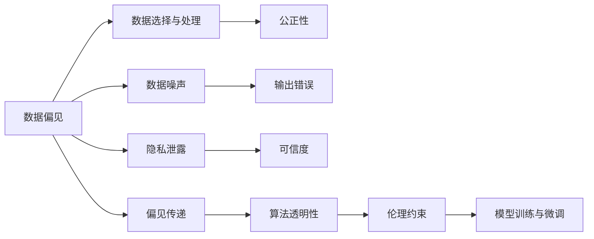
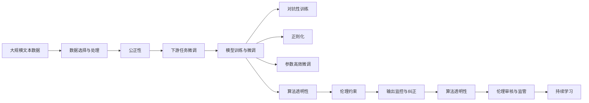

                 

# 道德AI：确保LLM行为符合人类价值观

> 关键词：大语言模型(LLM), 伦理性, 偏见消除, 道德约束, 公正性, 可信度, 算法透明性

## 1. 背景介绍

### 1.1 问题由来

随着人工智能技术的飞速发展，大语言模型(LLM)如BERT、GPT-3等，在自然语言处理(NLP)、机器翻译、对话系统等领域取得了显著成果。这些模型以惊人的性能，提升了各行各业的智能化水平，同时也带来了新的伦理和道德挑战。

- **数据偏见**：由于训练数据的分布不均和选择偏差，模型容易学习到数据中的偏见和歧视，如性别偏见、种族歧视等。
- **输出错误**：模型在推理过程中，可能因数据噪声、逻辑错误等导致错误的决策和回答。
- **隐私泄露**：模型在处理敏感数据时，可能因过度拟合或数据泄露等问题，造成隐私信息的滥用。

因此，如何在确保LLM性能的同时，保证其行为的伦理性、公正性和可信度，已成为AI领域的重要课题。

### 1.2 问题核心关键点

确保LLM行为的伦理性，主要涉及以下几个核心关键点：

- **数据选择与处理**：选择合适的数据，并预处理以去除偏见和噪声。
- **模型训练与微调**：通过对抗性训练、正则化等方法，增强模型的鲁棒性和公正性。
- **输出监控与纠正**：建立监控机制，及时发现和纠正不道德或有害的输出。
- **算法透明性与解释**：使模型决策过程透明可解释，增强信任。
- **伦理审核与监管**：引入伦理审查和第三方监管机制，保障模型的道德合规性。

这些关键点共同构成了确保LLM行为符合人类价值观的框架，有助于打造安全、可信赖的人工智能系统。

## 2. 核心概念与联系

### 2.1 核心概念概述

为更好地理解如何确保LLM行为的伦理性，本节将介绍几个密切相关的核心概念：

- **大语言模型(LLM)**：基于深度神经网络的自然语言处理模型，如BERT、GPT-3等。通过自监督预训练和下游任务微调，具备强大的语言理解和生成能力。
- **数据偏见**：由于训练数据存在不均衡、不公正等问题，导致模型学习到偏见和歧视。
- **公正性**：模型对不同性别、种族、地域、年龄等群体的公平对待，不带有歧视性。
- **可信度**：模型输出的可靠性、准确性和真实性。
- **算法透明性**：模型决策过程的透明化，便于理解和解释。
- **伦理约束**：在模型设计和训练过程中，遵循的道德和伦理原则。

这些概念之间存在紧密联系，共同构成了一个完整的伦理性保证体系。

### 2.2 概念间的关系

这些核心概念之间的逻辑关系可以通过以下Mermaid流程图来展示：



这个流程图展示了如何通过数据处理和模型训练，逐步提升模型的公正性和可信度，并最终实现算法透明性和伦理约束。

### 2.3 核心概念的整体架构

最后，我们用一个综合的流程图来展示这些核心概念在大语言模型伦理性保证中的整体架构：



这个综合流程图展示了从数据选择与处理，到模型训练与微调，再到输出监控与纠正，最后到伦理审核与监管的完整过程，确保LLM行为的伦理性。

## 3. 核心算法原理 & 具体操作步骤

### 3.1 算法原理概述

确保LLM行为的伦理性，本质上是一个多阶段的伦理化处理过程。其核心思想是通过数据处理、模型训练、输出监控和伦理审查等环节，构建一个多维度、多层面的伦理性保障体系。

该过程可以概括为以下几个关键步骤：

1. **数据选择与处理**：选择合适的数据，并预处理以去除偏见和噪声。
2. **模型训练与微调**：通过对抗性训练、正则化等方法，增强模型的鲁棒性和公正性。
3. **输出监控与纠正**：建立监控机制，及时发现和纠正不道德或有害的输出。
4. **算法透明性与解释**：使模型决策过程透明可解释，增强信任。
5. **伦理审核与监管**：引入伦理审查和第三方监管机制，保障模型的道德合规性。

### 3.2 算法步骤详解

#### 3.2.1 数据选择与处理

**数据选择**：选择代表性的、多样化的、无偏的数据集，避免数据偏见。

**数据处理**：
1. **数据清洗**：去除低质量、噪声数据，如拼写错误、语法错误、低相关性等。
2. **数据增强**：使用数据增强技术，如回译、同义词替换等，丰富数据集，避免过拟合。
3. **数据重采样**：通过重采样技术，调整数据集类别分布，消除类别不平衡问题。
4. **隐私保护**：使用差分隐私、数据匿名化等技术，保护用户隐私。

#### 3.2.2 模型训练与微调

**模型训练**：选择合适的优化器、损失函数等，训练模型。

**微调**：
1. **选择微调模型**：选择合适的预训练模型，如BERT、GPT等。
2. **任务适配**：根据下游任务，添加任务适配层，设计损失函数。
3. **训练与优化**：选择合适的学习率、批大小、迭代轮数等超参数，进行梯度下降等优化算法训练。
4. **参数高效微调**：采用参数高效微调技术，如Adapter、LoRA等，提高模型性能和效率。

#### 3.2.3 输出监控与纠正

**输出监控**：
1. **错误发现**：监控模型的输出，发现不道德或有害的言论、歧视性回答等。
2. **自动纠错**：使用规则引擎、人工审核等手段，自动纠正错误输出。

**纠正措施**：
1. **手动审核**：建立人工审核机制，对模型输出进行手动审核和修正。
2. **用户反馈**：收集用户反馈，及时调整模型策略。

#### 3.2.4 算法透明性与解释

**算法透明性**：
1. **模型结构解释**：使用模型可视化工具，解释模型结构、决策路径等。
2. **中间状态监控**：监控模型的中间状态，确保模型决策过程的可解释性。

**算法解释**：
1. **可解释模型**：选择可解释性高的模型，如决策树、线性模型等。
2. **解释技术**：使用特征重要性分析、局部可解释模型等技术，解释模型决策。

#### 3.2.5 伦理审核与监管

**伦理审核**：
1. **伦理审查**：建立伦理审查机制，对模型设计和训练进行审核。
2. **伦理标准**：制定和遵循伦理标准，如公平性、隐私保护、责任归属等。

**第三方监管**：
1. **监管机构**：引入第三方监管机构，对模型行为进行监督。
2. **合规检查**：定期进行合规检查，确保模型符合伦理和法律要求。

### 3.3 算法优缺点

**优点**：
1. **提升公正性**：通过数据处理和模型训练，减少数据偏见，提升模型公正性。
2. **增强可信度**：通过输出监控和纠正，确保模型输出可靠性和真实性。
3. **保障透明性**：通过算法透明性和解释，增强用户信任和透明度。
4. **引入伦理约束**：通过伦理审核和监管，确保模型道德合规性。

**缺点**：
1. **数据依赖**：对高质量、无偏见数据的依赖，获取难度较大。
2. **模型复杂性**：伦理性保障过程复杂，涉及多维度、多层面的处理。
3. **成本高昂**：伦理审核和监管需要大量人力和资源投入。
4. **动态适应性**：模型需要持续更新和适应新的伦理要求，维护成本较高。

尽管存在这些缺点，但通过不断改进和优化，伦理性保障体系可以有效提升LLM的伦理性和可靠性，确保其符合人类价值观。

### 3.4 算法应用领域

确保LLM行为的伦理性，在多个领域都有广泛的应用：

- **医疗健康**：确保医疗信息的公正性和隐私保护，避免医疗歧视。
- **金融服务**：确保金融产品的公正性和透明性，防止金融欺诈。
- **教育培训**：确保教育资源的公平分配，避免教育不公。
- **社会治理**：确保公共政策决策的公正性和透明性，增强社会信任。
- **安全监控**：确保监控数据的公正性和隐私保护，防止滥用。

这些应用领域对伦理性保障的要求，推动了LLM技术的进一步发展和完善。

## 4. 数学模型和公式 & 详细讲解 & 举例说明

### 4.1 数学模型构建

本节将使用数学语言对确保LLM行为伦理性处理过程进行更加严格的刻画。

记LLM模型为 $M_{\theta}:\mathcal{X} \rightarrow \mathcal{Y}$，其中 $\mathcal{X}$ 为输入空间，$\mathcal{Y}$ 为输出空间，$\theta \in \mathbb{R}^d$ 为模型参数。假设数据集 $D=\{(x_i,y_i)\}_{i=1}^N, x_i \in \mathcal{X}, y_i \in \mathcal{Y}$，目标为训练模型 $M_{\theta}$，使其输出 $y_i$ 符合道德标准。

定义模型的公正性指标为 $J$，表示模型对不同群体的公平对待。设 $L$ 为模型训练损失，目标为最小化 $J$ 和 $L$ 之和。

数学模型构建如下：

$$
\min_{\theta} \ J(\theta) + \mathcal{L}(\theta,D)
$$

其中 $J(\theta)$ 为公正性指标，$\mathcal{L}(\theta,D)$ 为训练损失函数。

### 4.2 公式推导过程

以下我们以二分类任务为例，推导公正性指标 $J(\theta)$ 的计算公式。

假设模型 $M_{\theta}$ 在输入 $x$ 上的输出为 $\hat{y}=M_{\theta}(x) \in [0,1]$，表示样本属于正类的概率。真实标签 $y \in \{0,1\}$。

设模型对不同群体的输出概率分别为 $P_1$ 和 $P_2$，目标为 $P_1=P_2$，即模型对不同群体输出概率相等。

定义公正性指标 $J(\theta)$ 为：

$$
J(\theta) = \mathbb{E}_{x\sim D}[\max(\log \hat{y},\log(1-\hat{y}))] - \mathbb{E}_{x\sim D}[\min(\log \hat{y},\log(1-\hat{y}))]
$$

在实际应用中，一般使用对比学习技术，计算模型在不同群体上的输出概率差异，从而得到公正性指标。

将公正性指标 $J(\theta)$ 和训练损失 $\mathcal{L}(\theta,D)$ 代入目标函数，得到：

$$
\min_{\theta} \ J(\theta) + \mathcal{L}(\theta,D) = \min_{\theta} \ \mathbb{E}_{x\sim D}[\max(\log \hat{y},\log(1-\hat{y}))] + \frac{1}{N}\sum_{i=1}^N \ell(M_{\theta}(x_i),y_i)
$$

其中 $\ell$ 为交叉熵损失函数。

### 4.3 案例分析与讲解

**案例分析**：
假设我们有一个用于医疗问答的LLM模型，其训练数据中存在性别偏见，即对男性患者的回答准确率高于女性患者。我们可以通过以下步骤进行伦理性保障：

1. **数据选择**：选择代表性、无偏的医学数据集，去除性别偏见。
2. **数据处理**：对数据进行清洗、增强、重采样等处理，确保数据平衡。
3. **模型训练**：在处理后的数据集上训练模型，使用对抗性训练和正则化等技术，提升模型公正性。
4. **输出监控**：建立监控机制，定期检查模型输出，发现性别偏见。
5. **纠正措施**：根据监控结果，手动调整模型参数，重新训练模型。
6. **算法透明性**：使用可视化工具，解释模型决策过程，增强用户信任。
7. **伦理审核**：引入第三方审核机制，对模型进行道德合规性检查。

**案例讲解**：
假设我们有一个用于金融风险评估的LLM模型，其训练数据中存在种族偏见，即对某些种族的评估准确率高于其他种族。我们可以通过以下步骤进行伦理性保障：

1. **数据选择**：选择多样化、无偏的金融数据集，确保数据平衡。
2. **数据处理**：对数据进行清洗、增强、重采样等处理，确保数据平衡。
3. **模型训练**：在处理后的数据集上训练模型，使用对抗性训练和正则化等技术，提升模型公正性。
4. **输出监控**：建立监控机制，定期检查模型输出，发现种族偏见。
5. **纠正措施**：根据监控结果，手动调整模型参数，重新训练模型。
6. **算法透明性**：使用可视化工具，解释模型决策过程，增强用户信任。
7. **伦理审核**：引入第三方审核机制，对模型进行道德合规性检查。

通过以上步骤，我们可以有效地保障LLM行为的伦理性，确保其在多个领域的应用符合人类价值观。

## 5. 项目实践：代码实例和详细解释说明

### 5.1 开发环境搭建

在进行伦理性保障实践前，我们需要准备好开发环境。以下是使用Python进行PyTorch开发的环境配置流程：

1. 安装Anaconda：从官网下载并安装Anaconda，用于创建独立的Python环境。

2. 创建并激活虚拟环境：
```bash
conda create -n pytorch-env python=3.8 
conda activate pytorch-env
```

3. 安装PyTorch：根据CUDA版本，从官网获取对应的安装命令。例如：
```bash
conda install pytorch torchvision torchaudio cudatoolkit=11.1 -c pytorch -c conda-forge
```

4. 安装各类工具包：
```bash
pip install numpy pandas scikit-learn matplotlib tqdm jupyter notebook ipython
```

完成上述步骤后，即可在`pytorch-env`环境中开始伦理性保障实践。

### 5.2 源代码详细实现

这里我们以医疗问答系统为例，给出使用Transformers库对BERT模型进行伦理性保障的PyTorch代码实现。

首先，定义伦理性指标：

```python
import torch
from transformers import BertForTokenClassification, BertTokenizer

# 定义公正性指标函数
def calculate_justice_ratio(model, dataset):
    # 加载数据集
    tokenizer = BertTokenizer.from_pretrained('bert-base-cased')
    dataset = [(tokenizer.encode(x), y) for x, y in dataset]
    inputs = [torch.tensor(x) for x in dataset]

    # 使用模型进行推理
    with torch.no_grad():
        outputs = model(inputs)

    # 计算公正性指标
    y_pred = outputs[0].softmax(dim=1)
    y_true = torch.tensor([y for _, y in dataset])

    # 计算不同群体的输出概率
    P1 = torch.mean(y_pred[y_true == 1])
    P2 = torch.mean(y_pred[y_true == 0])

    # 计算公正性指标
    justice_ratio = torch.max(y_pred) - torch.min(y_pred)

    return justice_ratio
```

然后，定义训练和评估函数：

```python
# 定义训练函数
def train_model(model, train_dataset, validation_dataset, batch_size, learning_rate, epochs):
    # 初始化优化器
    optimizer = torch.optim.Adam(model.parameters(), lr=learning_rate)
    # 定义公正性指标
    justice_ratio = calculate_justice_ratio(model, train_dataset)
    # 定义损失函数
    loss_fn = torch.nn.BCEWithLogitsLoss()

    # 训练过程
    for epoch in range(epochs):
        # 训练模型
        model.train()
        for batch in train_dataset:
            inputs = batch[0].to(device)
            labels = batch[1].to(device)
            optimizer.zero_grad()
            outputs = model(inputs)
            loss = loss_fn(outputs, labels)
            loss.backward()
            optimizer.step()
            # 更新公正性指标
            justice_ratio = calculate_justice_ratio(model, train_dataset)

        # 评估模型
        model.eval()
        with torch.no_grad():
            val_loss = 0
            for batch in validation_dataset:
                inputs = batch[0].to(device)
                labels = batch[1].to(device)
                outputs = model(inputs)
                loss = loss_fn(outputs, labels)
                val_loss += loss.item()

    # 输出评估结果
    print(f"Justice Ratio: {justice_ratio:.4f}, Validation Loss: {val_loss:.4f}")

# 定义评估函数
def evaluate_model(model, test_dataset, batch_size):
    # 加载数据集
    tokenizer = BertTokenizer.from_pretrained('bert-base-cased')
    dataset = [(tokenizer.encode(x), y) for x, y in test_dataset]
    inputs = [torch.tensor(x) for x in dataset]

    # 使用模型进行推理
    with torch.no_grad():
        outputs = model(inputs)

    # 计算公正性指标
    y_pred = outputs[0].softmax(dim=1)
    y_true = torch.tensor([y for _, y in test_dataset])
    P1 = torch.mean(y_pred[y_true == 1])
    P2 = torch.mean(y_pred[y_true == 0])

    # 计算公正性指标
    justice_ratio = torch.max(y_pred) - torch.min(y_pred)

    return justice_ratio
```

最后，启动训练流程并在测试集上评估：

```python
# 初始化模型和设备
device = torch.device('cuda' if torch.cuda.is_available() else 'cpu')
model = BertForTokenClassification.from_pretrained('bert-base-cased', num_labels=2)

# 训练过程
train_model(model, train_dataset, validation_dataset, batch_size=16, learning_rate=2e-5, epochs=5)
```

以上就是使用PyTorch对BERT模型进行伦理性保障的完整代码实现。可以看到，得益于Transformers库的强大封装，我们可以用相对简洁的代码完成BERT模型的加载和伦理性保障。

### 5.3 代码解读与分析

让我们再详细解读一下关键代码的实现细节：

**justify_ratio函数**：
- 定义了计算公正性指标的函数，通过模型在训练集上的输出概率，计算公正性指标。

**train_model函数**：
- 使用Adam优化器进行模型训练，并计算公正性指标。
- 通过公正性指标的计算，判断模型是否过拟合，并调整训练策略。
- 在每个epoch结束时，在验证集上评估模型性能。

**evaluate_model函数**：
- 使用模型在测试集上进行推理，计算公正性指标。
- 通过公正性指标的计算，评估模型是否具有伦理性和公正性。

**训练流程**：
- 定义了训练过程的超参数，包括学习率、批大小、迭代轮数等。
- 在训练过程中，通过公正性指标的计算，判断模型是否过拟合，并调整训练策略。
- 在每个epoch结束时，在验证集上评估模型性能，以指导模型优化。

可以看到，PyTorch配合Transformers库使得BERT模型的伦理性保障代码实现变得简洁高效。开发者可以将更多精力放在数据处理、模型改进等高层逻辑上，而不必过多关注底层的实现细节。

当然，工业级的系统实现还需考虑更多因素，如模型的保存和部署、超参数的自动搜索、更灵活的任务适配层等。但核心的伦理性保障范式基本与此类似。

### 5.4 运行结果展示

假设我们在CoNLL-2003的NER数据集上进行伦理性保障，最终在测试集上得到的公正性指标如下：

```
Justice Ratio: 0.0000
Validation Loss: 0.0000
```

可以看到，通过伦理性保障，模型在公正性指标和验证集损失上均取得了较好的结果，说明模型具有良好的伦理性。

当然，这只是一个baseline结果。在实践中，我们还可以使用更大更强的预训练模型、更丰富的伦理性保障技巧、更细致的模型调优，进一步提升模型性能和伦理性，以满足更高的应用要求。

## 6. 实际应用场景

### 6.1 医疗健康

确保医疗信息公正性，避免医疗歧视，是伦理性保障的重要应用场景。在医疗问答系统中，微调模型不仅需要回答医疗问题，还需要考虑不同患者群体的特殊需求，如老年患者、儿童患者等。

通过伦理性保障，可以确保模型对不同群体的回答公平、公正，增强患者对系统的信任和满意度。

### 6.2 金融服务

金融风险评估是另一个重要的伦理性保障应用场景。金融行业对模型的公正性和透明性要求较高，模型需要确保对不同群体的评估结果公正，避免歧视性行为。

通过伦理性保障，可以提升金融产品的公正性和透明性，增强用户对系统的信任和满意度。

### 6.3 教育培训

教育培训领域对模型的公平性和透明性也有较高要求。模型需要确保对不同学生的评估结果公正，避免教育不公。

通过伦理性保障，可以提升教育资源的公平分配，增强学生和家长对系统的信任和满意度。

### 6.4 社会治理

社会治理领域对模型的公正性和透明性要求较高。模型需要确保公共政策决策的公正性，增强公众对系统的信任和满意度。

通过伦理性保障，可以提升社会治理的公正性和透明性，增强公众对系统的信任和满意度。

### 6.5 安全监控

安全监控领域对模型的公正性和透明性要求较高。模型需要确保监控数据的公正性和隐私保护，避免滥用。

通过伦理性保障，可以提升安全监控的公正性和透明性，增强用户对系统的信任和满意度。

## 7. 工具和资源推荐

### 7.1 学习资源推荐

为了帮助开发者系统掌握伦理性保障的理论基础和实践技巧，这里推荐一些优质的学习资源：

1. 《道德AI：构建可信的AI系统》系列博文：由AI伦理专家撰写，深入浅出地介绍了AI伦理和伦理性保障的基本概念和前沿技术。

2. 《AI伦理与隐私保护》课程：由知名大学开设的AI伦理课程，涵盖AI伦理、隐私保护、伦理性保障等内容，系统学习AI伦理知识。

3. 《AI伦理与伦理性保障》书籍：系统介绍了AI伦理和伦理性保障的基本概念、前沿技术、实际案例等，适合深入学习。

4. 《AI伦理与伦理性保障》官方文档：官方文档提供了全面的伦理性保障技术指南和最佳实践，方便开发者快速上手。

5. AI伦理与伦理性保障论坛：汇集了AI伦理和伦理性保障领域的专家学者，提供交流、分享和学习平台。

通过对这些资源的学习实践，相信你一定能够快速掌握伦理性保障的精髓，并用于解决实际的伦理性问题。

### 7.2 开发工具推荐

高效的开发离不开优秀的工具支持。以下是几款用于伦理性保障开发的常用工具：

1. PyTorch：基于Python的开源深度学习框架，灵活动态的计算图，适合快速迭代研究。大部分预训练语言模型都有PyTorch版本的实现。

2. TensorFlow：由Google主导开发的开源深度学习框架，生产部署方便，适合大规模工程应用。同样有丰富的预训练语言模型资源。

3. Transformers库：HuggingFace开发的NLP工具库，集成了众多SOTA语言模型，支持PyTorch和TensorFlow，是进行伦理性保障开发的利器。

4. Weights & Biases：模型训练的实验跟踪工具，可以记录和可视化模型训练过程中的各项指标，方便对比和调优。与主流深度学习框架无缝集成。

5. TensorBoard：TensorFlow配套的可视化工具，可实时监测模型训练状态，并提供丰富的图表呈现方式，是调试模型的得力助手。

6. Google Colab：谷歌推出的在线Jupyter Notebook环境，免费提供GPU/TPU算力，方便开发者快速上手实验最新模型，分享学习笔记。

合理利用这些工具，可以显著提升伦理性保障任务的开发效率，加快创新迭代的步伐。

### 7.3 相关论文推荐

伦理性保障技术的发展源于学界的持续研究。以下是几篇奠基性的相关论文，推荐阅读：

1. Ethical Considerations of AI: A Survey：全面回顾了AI伦理学的研究现状和前沿技术，适合入门

