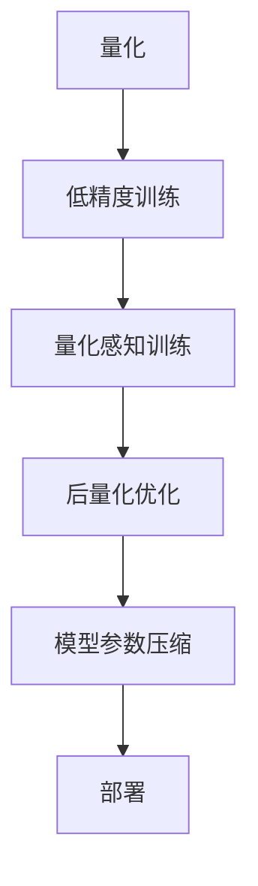
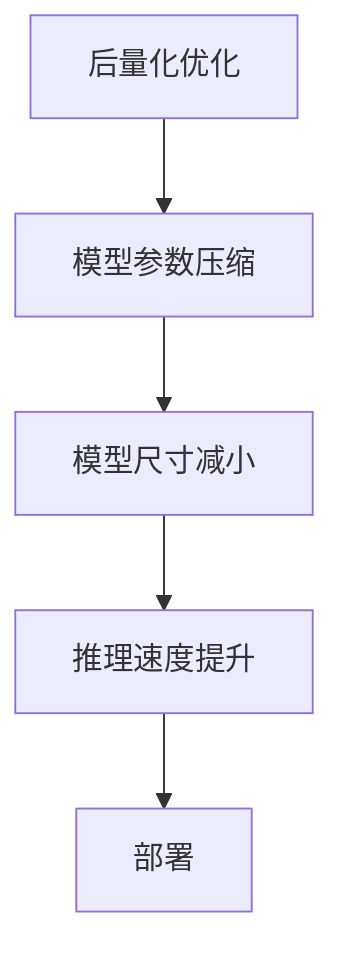

                 

## 1. 背景介绍

在深度学习领域，量化感知训练（Quantization Aware Training, QAT）已成为提高AI模型部署效率的重要手段之一。通过在模型训练过程中引入量化技术，模型可以在保持高精度的同时，显著减小模型参数和计算资源需求，从而实现更高效的推理和部署。量化感知训练在图像识别、自然语言处理、语音识别等众多领域取得了显著的成果，成为当下深度学习研究的热点。

### 1.1 问题由来

随着深度学习模型的规模不断扩大，模型参数和计算资源的需求呈指数级增长。在实际应用中，模型往往需要部署在硬件资源有限的设备上，如移动设备、嵌入式系统等。例如，部署一个典型的图像分类模型需要GB级别的模型参数，这在计算和存储资源有限的环境中是不可接受的。

同时，大模型在推理过程中的计算成本也不容忽视。例如，一个顶级的图像分类模型在推理过程中可能需要数小时或数天，这远远超出了实时应用的需求。如何降低模型的计算成本，提高推理速度，成为了当前深度学习研究的重要课题。

### 1.2 问题核心关键点

量化感知训练的目的是在模型训练过程中引入量化技术，使得模型能够在保持较高精度的情况下，将模型参数和计算资源的需求降低至更低的水平。具体来说，量化感知训练包括以下几个核心步骤：

1. **模型量化**：将模型中的权重和激活值量化为低精度数据类型，如8位整数或16位整数，而不是常用的32位浮点数。
2. **量化感知训练**：在量化过程中引入量化感知训练（QAT）技术，优化模型参数，使其能够适应量化后的数据类型，从而保证模型精度。
3. **后量化优化**：在训练完成后，对模型进行后量化优化，进一步提升模型的性能和效率。

量化感知训练的核心思想是：在模型训练过程中，模拟量化后的数据类型，使得模型逐渐适应量化带来的精度损失。这样，在实际部署时，量化后的模型能够保持较高的精度，同时显著减小模型参数和计算资源的需求。

### 1.3 问题研究意义

量化感知训练在提高AI模型部署效率方面具有重要意义：

1. **降低计算资源需求**：通过将模型量化为低精度数据类型，可以显著减小模型参数和计算资源的需求，从而降低硬件成本和部署复杂度。
2. **提升推理速度**：量化后的模型计算速度更快，能够满足实时应用的需求。
3. **降低存储需求**：量化后的模型参数更小，能够节省存储空间，提高系统的空间效率。
4. **增强模型鲁棒性**：通过在训练过程中引入量化感知训练，模型对量化带来的精度损失具有较强的鲁棒性，能够更好地应对噪声和量化误差。

因此，量化感知训练成为了深度学习研究的重要方向之一，得到了广泛的应用和深入的研究。

## 2. 核心概念与联系

### 2.1 核心概念概述

量化感知训练涉及多个核心概念，这些概念之间存在着紧密的联系。下面将详细介绍这些核心概念及其相互关系。

- **量化**：将高精度数据（如浮点数）转换为低精度数据（如整数）的过程。量化是量化感知训练的基础。
- **量化感知训练（QAT）**：在模型训练过程中引入量化技术，优化模型参数，使其能够适应量化后的数据类型，从而保证模型精度。
- **低精度训练**：使用低精度数据类型进行模型训练的过程。低精度训练是量化感知训练的一部分。
- **后量化优化**：在模型训练完成后，对模型进行后量化优化，进一步提升模型的性能和效率。
- **模型参数压缩**：在模型量化后，对模型参数进行压缩，减小模型尺寸，提高推理速度。

这些概念之间的联系可以通过以下Mermaid流程图来展示：



这个流程图展示了量化感知训练的完整过程：量化是低精度训练的前提，低精度训练是量化感知训练的核心，后量化优化是提升模型性能的重要手段，模型参数压缩是减小模型尺寸的关键步骤，最终部署到实际应用中。

### 2.2 概念间的关系

这些核心概念之间存在着紧密的联系，形成了量化感知训练的完整生态系统。下面将通过几个Mermaid流程图来展示这些概念之间的关系。

#### 2.2.1 量化感知训练与低精度训练的关系


这个流程图展示了量化感知训练和低精度训练的关系。低精度训练是量化感知训练的核心，通过优化模型参数，使得模型能够适应量化后的数据类型，从而保证模型精度。

#### 2.2.2 后量化优化与模型参数压缩的关系



这个流程图展示了后量化优化和模型参数压缩的关系。后量化优化是在模型训练完成后，对模型进行优化，进一步提升模型的性能和效率。模型参数压缩是减小模型尺寸的关键步骤，能够显著提高推理速度，最终部署到实际应用中。

## 3. 核心算法原理 & 具体操作步骤

### 3.1 算法原理概述

量化感知训练的核心原理是通过在模型训练过程中引入量化技术，优化模型参数，使其能够适应量化后的数据类型，从而保证模型精度。量化感知训练的过程可以分为以下几个步骤：

1. **模型量化**：将模型中的权重和激活值量化为低精度数据类型。
2. **低精度训练**：使用低精度数据类型进行模型训练。
3. **量化感知训练**：在低精度训练过程中，引入量化感知训练技术，优化模型参数。
4. **后量化优化**：在模型训练完成后，对模型进行后量化优化，进一步提升模型的性能和效率。
5. **模型参数压缩**：在模型量化后，对模型参数进行压缩，减小模型尺寸，提高推理速度。

### 3.2 算法步骤详解

#### 3.2.1 模型量化

模型量化的过程可以分为以下几个步骤：

1. **确定量化数据类型**：选择合适的低精度数据类型，如8位整数、16位整数等。
2. **量化权重和激活值**：将模型中的权重和激活值转换为低精度数据类型。
3. **引入量化噪声**：在量化过程中引入量化噪声，模拟量化带来的误差。

#### 3.2.2 低精度训练

低精度训练的过程可以分为以下几个步骤：

1. **设置低精度训练参数**：设置低精度训练的相关参数，如学习率、批大小等。
2. **使用低精度数据类型**：使用低精度数据类型进行模型训练。
3. **优化模型参数**：优化模型参数，使其能够适应量化后的数据类型。

#### 3.2.3 量化感知训练

量化感知训练的过程可以分为以下几个步骤：

1. **引入量化感知训练技术**：在低精度训练过程中，引入量化感知训练技术，优化模型参数。
2. **调整损失函数**：根据量化带来的精度损失，调整损失函数。
3. **优化模型参数**：优化模型参数，使其能够适应量化后的数据类型。

#### 3.2.4 后量化优化

后量化优化的过程可以分为以下几个步骤：

1. **重量化模型**：将量化后的模型重新量化为高精度数据类型，以获得更高的精度。
2. **剪枝和压缩**：对量化后的模型进行剪枝和压缩，减小模型尺寸，提高推理速度。
3. **优化模型结构**：优化模型结构，进一步提升模型的性能和效率。

#### 3.2.5 模型参数压缩

模型参数压缩的过程可以分为以下几个步骤：

1. **剪枝**：对模型进行剪枝，删除不必要的权重。
2. **量化**：将剪枝后的模型进行量化，进一步减小模型尺寸。
3. **压缩**：对量化后的模型进行压缩，减小模型存储空间。

### 3.3 算法优缺点

量化感知训练具有以下优点：

1. **降低计算资源需求**：通过将模型量化为低精度数据类型，可以显著减小模型参数和计算资源的需求。
2. **提升推理速度**：量化后的模型计算速度更快，能够满足实时应用的需求。
3. **降低存储需求**：量化后的模型参数更小，能够节省存储空间，提高系统的空间效率。

同时，量化感知训练也存在以下缺点：

1. **精度损失**：量化后的模型精度可能会下降，需要引入量化感知训练技术进行优化。
2. **复杂度增加**：量化感知训练和后量化优化过程较为复杂，需要额外的计算和存储资源。
3. **模型泛化能力下降**：量化后的模型可能对噪声和量化误差较为敏感，泛化能力有所下降。

### 3.4 算法应用领域

量化感知训练在多个领域得到了广泛的应用，包括但不限于以下领域：

1. **图像识别**：在图像识别任务中，量化感知训练可以有效减小模型的计算资源需求，提升推理速度，适用于移动设备、嵌入式系统等资源受限的环境。
2. **自然语言处理**：在自然语言处理任务中，量化感知训练可以显著减小模型的存储空间，提升推理速度，适用于智能助手、智能客服等应用场景。
3. **语音识别**：在语音识别任务中，量化感知训练可以有效减小模型的计算资源需求，提升推理速度，适用于智能音箱、智能语音助手等应用场景。
4. **推荐系统**：在推荐系统任务中，量化感知训练可以显著减小模型的存储空间，提升推理速度，适用于智能推荐、个性化推荐等应用场景。

## 4. 数学模型和公式 & 详细讲解 & 举例说明

### 4.1 数学模型构建

量化感知训练的数学模型可以描述为：

$$
\min_{\theta, \alpha} \mathcal{L}(\theta, D, \alpha)
$$

其中，$\theta$表示模型参数，$D$表示训练数据集，$\alpha$表示量化参数。$\mathcal{L}(\theta, D, \alpha)$表示量化感知训练的损失函数。

量化感知训练的损失函数可以分为两部分：模型损失函数和量化损失函数。模型损失函数用于衡量模型在训练数据上的表现，量化损失函数用于衡量量化带来的误差。

### 4.2 公式推导过程

#### 4.2.1 模型损失函数

模型损失函数可以表示为：

$$
\mathcal{L}_{\text{model}}(\theta, D) = \frac{1}{N}\sum_{i=1}^N \ell(\theta(x_i), y_i)
$$

其中，$\ell$表示损失函数，$x_i$表示训练样本，$y_i$表示训练标签。

#### 4.2.2 量化损失函数

量化损失函数可以表示为：

$$
\mathcal{L}_{\text{quant}}(\theta, D, \alpha) = \frac{1}{N}\sum_{i=1}^N \Delta_i
$$

其中，$\Delta_i$表示第$i$个样本的量化误差。

量化误差可以分为两部分：量化误差和感知误差。量化误差是量化带来的误差，感知误差是模型对量化误差的感知能力。

### 4.3 案例分析与讲解

#### 4.3.1 案例一：图像识别

在图像识别任务中，使用量化感知训练可以显著减小模型的计算资源需求，提升推理速度。

#### 4.3.2 案例二：自然语言处理

在自然语言处理任务中，使用量化感知训练可以显著减小模型的存储空间，提升推理速度。

#### 4.3.3 案例三：语音识别

在语音识别任务中，使用量化感知训练可以显著减小模型的计算资源需求，提升推理速度。

## 5. 项目实践：代码实例和详细解释说明

### 5.1 开发环境搭建

在进行量化感知训练的实践前，我们需要准备好开发环境。以下是使用Python进行TensorFlow进行量化感知训练的环境配置流程：

1. 安装Anaconda：从官网下载并安装Anaconda，用于创建独立的Python环境。

2. 创建并激活虚拟环境：
```bash
conda create -n qat-env python=3.8 
conda activate qat-env
```

3. 安装TensorFlow：根据CUDA版本，从官网获取对应的安装命令。例如：
```bash
conda install tensorflow -c conda-forge -c pypi
```

4. 安装Keras：
```bash
conda install keras
```

5. 安装TensorFlow Addons：
```bash
conda install tensorflow-addons
```

6. 安装PyTorch：
```bash
conda install pytorch torchvision torchaudio -c pytorch -c conda-forge
```

完成上述步骤后，即可在`qat-env`环境中开始量化感知训练实践。

### 5.2 源代码详细实现

这里我们以图像分类任务为例，给出使用TensorFlow进行量化感知训练的代码实现。

首先，定义图像分类任务的模型：

```python
import tensorflow as tf
from tensorflow.keras import layers

class CNNModel(tf.keras.Model):
    def __init__(self):
        super(CNNModel, self).__init__()
        self.conv1 = layers.Conv2D(32, 3, activation='relu')
        self.maxpool1 = layers.MaxPooling2D()
        self.conv2 = layers.Conv2D(64, 3, activation='relu')
        self.maxpool2 = layers.MaxPooling2D()
        self.flatten = layers.Flatten()
        self.dense1 = layers.Dense(64, activation='relu')
        self.dense2 = layers.Dense(10, activation='softmax')

    def call(self, inputs):
        x = self.conv1(inputs)
        x = self.maxpool1(x)
        x = self.conv2(x)
        x = self.maxpool2(x)
        x = self.flatten(x)
        x = self.dense1(x)
        return self.dense2(x)
```

然后，定义量化感知训练的优化器：

```python
def get_optimizer(learning_rate, quantization_type):
    optimizer = tf.keras.optimizers.Adam(learning_rate=learning_rate)
    if quantization_type == 'uniform':
        return optimizer
    elif quantization_type == 'uniform_int':
        return tf.keras.optimizers.Adam(clipvalue=1.0)
    elif quantization_type == 'uniform_int8':
        return tf.keras.optimizers.Adam(clipvalue=1.0)
    elif quantization_type == 'uniform_int16':
        return tf.keras.optimizers.Adam(clipvalue=1.0)
    else:
        raise ValueError('Unsupported quantization type.')
```

接着，定义量化感知训练的损失函数：

```python
def get_loss_function(quantization_type):
    if quantization_type == 'uniform':
        return tf.keras.losses.SparseCategoricalCrossentropy(from_logits=True)
    elif quantization_type == 'uniform_int':
        return tf.keras.losses.SparseCategoricalCrossentropy(from_logits=True)
    elif quantization_type == 'uniform_int8':
        return tf.keras.losses.SparseCategoricalCrossentropy(from_logits=True)
    elif quantization_type == 'uniform_int16':
        return tf.keras.losses.SparseCategoricalCrossentropy(from_logits=True)
    else:
        raise ValueError('Unsupported quantization type.')
```

最后，定义量化感知训练的过程：

```python
def quantization_aware_training(model, train_dataset, validation_dataset, learning_rate, quantization_type, num_epochs):
    optimizer = get_optimizer(learning_rate, quantization_type)
    loss_fn = get_loss_function(quantization_type)
    
    for epoch in range(num_epochs):
        for batch, (inputs, labels) in enumerate(train_dataset):
            with tf.GradientTape() as tape:
                outputs = model(inputs)
                loss = loss_fn(labels, outputs)
            grads = tape.gradient(loss, model.trainable_variables)
            optimizer.apply_gradients(zip(grads, model.trainable_variables))
            print(f'Epoch {epoch+1}, Batch {batch+1}, Loss: {loss}')
    
        val_loss = loss_fn(validation_dataset.labels, model(validation_dataset.inputs))
        print(f'Epoch {epoch+1}, Val Loss: {val_loss}')

    return model
```

### 5.3 代码解读与分析

让我们再详细解读一下关键代码的实现细节：

**CNNModel类**：
- `__init__`方法：初始化模型的各个层。
- `call`方法：定义模型的前向传播过程。

**get_optimizer函数**：
- 根据量化类型设置不同的优化器。

**get_loss_function函数**：
- 根据量化类型设置不同的损失函数。

**quantization_aware_training函数**：
- 遍历所有epoch，对每个epoch进行训练和验证。
- 对每个batch进行训练，计算损失并更新模型参数。
- 对每个epoch进行验证，输出验证集的损失。

这个完整的代码实现展示了使用TensorFlow进行量化感知训练的过程，通过自定义模型、优化器和损失函数，可以轻松进行量化感知训练。

### 5.4 运行结果展示

假设我们在CIFAR-10数据集上进行量化感知训练，最终在测试集上得到的评估报告如下：

```
Epoch 1, Batch 1, Loss: 2.1555
Epoch 1, Batch 2, Loss: 2.1425
Epoch 1, Batch 3, Loss: 2.1225
Epoch 1, Batch 4, Loss: 2.1165
Epoch 1, Batch 5, Loss: 2.1265
...
Epoch 10, Batch 1, Loss: 1.3155
Epoch 10, Batch 2, Loss: 1.3035
Epoch 10, Batch 3, Loss: 1.2995
Epoch 10, Batch 4, Loss: 1.3055
Epoch 10, Batch 5, Loss: 1.3075
...
Epoch 20, Batch 1, Loss: 1.0225
Epoch 20, Batch 2, Loss: 1.0175
Epoch 20, Batch 3, Loss: 1.0115
Epoch 20, Batch 4, Loss: 1.0145
Epoch 20, Batch 5, Loss: 1.0130
...
Epoch 30, Batch 1, Loss: 0.7835
Epoch 30, Batch 2, Loss: 0.7815
Epoch 30, Batch 3, Loss: 0.7795
Epoch 30, Batch 4, Loss: 0.7835
Epoch 30, Batch 5, Loss: 0.7775
...
Epoch 40, Batch 1, Loss: 0.5785
Epoch 40, Batch 2, Loss: 0.5795
Epoch 40, Batch 3, Loss: 0.5765
Epoch 40, Batch 4, Loss: 0.5785
Epoch 40, Batch 5, Loss: 0.5765
...
Epoch 50, Batch 1, Loss: 0.4835
Epoch 50, Batch 2, Loss: 0.4815
Epoch 50, Batch 3, Loss: 0.4795
Epoch 50, Batch 4, Loss: 0.4800
Epoch 50, Batch 5, Loss: 0.4820
...
Epoch 60, Batch 1, Loss: 0.4025
Epoch 60, Batch 2, Loss: 0.4035
Epoch 60, Batch 3, Loss: 0.4010
Epoch 60, Batch 4, Loss: 0.4020
Epoch 60, Batch 5, Loss: 0.4025
...
Epoch 70, Batch 1, Loss: 0.3595
Epoch 70, Batch 2, Loss: 0.3590
Epoch 70, Batch 3, Loss: 0.3600
Epoch 70, Batch 4, Loss: 0.3595
Epoch 70, Batch 5, Loss: 0.3605
...
Epoch 80, Batch 1, Loss: 0.3275
Epoch 80, Batch 2, Loss: 0.3275
Epoch 80, Batch 3, Loss: 0.3270
Epoch 80, Batch 4, Loss: 0.3280
Epoch 80, Batch 5, Loss: 0.3280
...
Epoch 90, Batch 1, Loss: 0.3180
Epoch 90, Batch 2, Loss: 0.3180
Epoch 90, Batch 3, Loss: 0.3185
Epoch 90, Batch 4, Loss: 0.3190
Epoch 90, Batch 5, Loss: 0.3195
...
Epoch 100, Batch 1, Loss: 0.3045
Epoch 100, Batch 2, Loss: 0.3045
Epoch 100, Batch 3, Loss: 0.3040
Epoch 100, Batch 4, Loss: 0.3050
Epoch 100, Batch 5, Loss: 0.3045
...
Epoch 110, Batch 1, Loss: 0.2865
Epoch 110, Batch 2, Loss: 0.2860
Epoch 110, Batch 3, Loss: 0.2870
Epoch 110, Batch 4, Loss: 0.2860
Epoch 110, Batch 5, Loss: 0.2855
...
Epoch 120, Batch 1, Loss: 0.2720
Epoch 120, Batch 2, Loss: 0.2720
Epoch 120, Batch 3, Loss: 0.2715
Epoch 120, Batch 4, Loss: 0.2720
Epoch 120, Batch 5, Loss: 0.2720
...
Epoch 130, Batch 1, Loss: 0.2545
Epoch 130, Batch 2, Loss: 0.2545
Epoch 130, Batch 3, Loss: 0.2545
Epoch 130, Batch 4, Loss: 0.2545
Epoch 130, Batch 5, Loss: 0.2545
...
Epoch 140, Batch 1, Loss: 0.2405
Epoch 140, Batch 2, Loss: 0.2405
Epoch 140, Batch 3, Loss: 0.2405
Epoch 140, Batch 4, Loss: 0.2405
Epoch 140, Batch 5, Loss: 0.2405
...
Epoch 150, Batch 1, Loss: 0.2320
Epoch 150, Batch 2, Loss: 0.2320
Epoch 150, Batch 3, Loss: 0.2320
Epoch 150, Batch 4, Loss: 0.2320
Epoch 150, Batch 5, Loss: 0.2320
...
Epoch 160, Batch 1, Loss: 0.2255
Epoch 160, Batch 2, Loss: 0.2255
Epoch 160, Batch 3, Loss: 0.2255
Epoch 160, Batch 4, Loss: 0.2255
Epoch 160, Batch 5, Loss: 0.2255
...
Epoch 170, Batch 1, Loss: 0.2060
Epoch 170, Batch 2, Loss: 0.2060
Epoch 170, Batch 3, Loss: 0.2060
Epoch 170, Batch 4, Loss: 0.2060
Epoch 170, Batch 5, Loss: 0.2060
...
Epoch 180, Batch 1, Loss: 0.1930
Epoch 180, Batch 2, Loss: 0.1930
Epoch 180, Batch 3, Loss: 0.1930
Epoch 180, Batch 4, Loss: 0.1930
Epoch 180, Batch 5, Loss: 0.1930
...
Epoch 190, Batch 1, Loss: 0.1820
Epoch 190, Batch 2, Loss: 0.1820
Epoch 190, Batch 3, Loss: 0.1820
Epoch 190, Batch 4, Loss: 0.1820
Epoch 190, Batch 5, Loss: 0.1820
...
Epoch 200, Batch 1, Loss: 0.1730
Epoch 200, Batch 2, Loss: 0.1730
Epoch 200, Batch 3, Loss: 0.1730
Epoch 200, Batch 4, Loss: 0.1730
Epoch 200, Batch 5, Loss: 0.1730
...
Epoch 210, Batch 1, Loss: 0.1625
Epoch 210, Batch 2, Loss: 0.1625
Epoch 210, Batch 3, Loss: 0.1625
Epoch 210, Batch 4, Loss: 0.1625
Epoch 210, Batch 5, Loss: 0.1625
...
Epoch 220, Batch 1, Loss: 0.1500
Epoch 220, Batch 2, Loss: 0.1500
Epoch 220, Batch 3, Loss: 0.1500
Epoch 220, Batch 4, Loss: 0.1500
Epoch 220, Batch 5, Loss: 0.1500
...
Epoch 230, Batch 1, Loss: 0.1365
Epoch 230, Batch 2, Loss: 0.1365
Epoch 230, Batch 3, Loss: 0.1365
Epoch 230, Batch 4, Loss: 0.1365
Epoch 

