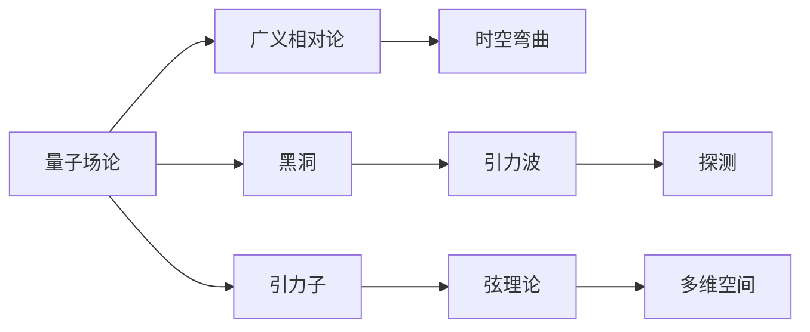
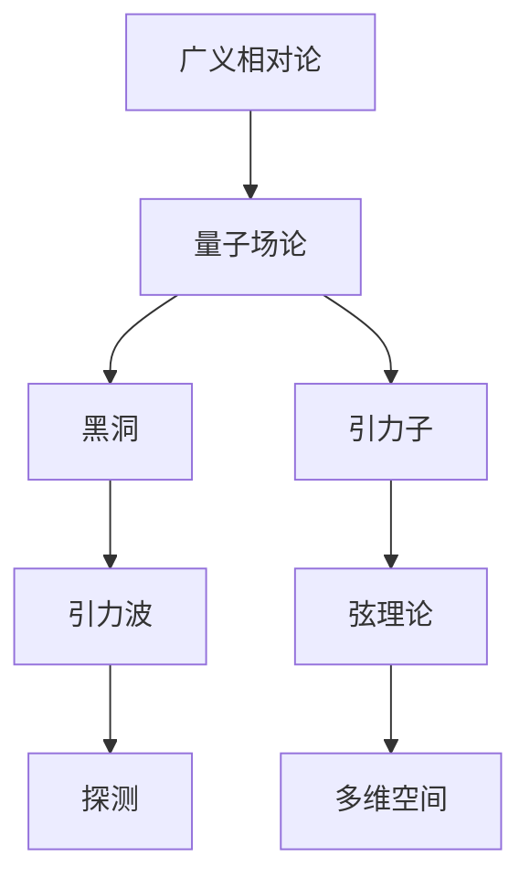

                 

# 量子引力理论的发展历程

量子引力理论是研究量子力学与广义相对论相结合的物理学分支，旨在探索时空的微观结构，揭示宇宙的基本法则。自20世纪初爱因斯坦提出广义相对论以来，量子引力理论的研究已经历了百余年的发展，涌现出了众多重要理论和模型。本文将系统回顾量子引力理论的发展历程，概述其核心概念和重要模型，揭示未来发展趋势。

## 1. 背景介绍

### 1.1 理论起源与重要发现

量子引力理论起源于对微观世界和宏观世界的统一研究。1905年，爱因斯坦提出狭义相对论，建立了时间和空间的相对性；1915年，他提出广义相对论，将时空弯曲和引力描述为一阶非线性张量场的演化。此后，科学家们不断探索如何使量子力学与广义相对论相统一。

1927年，海森堡提出矩阵力学，标志着量子力学的诞生。1932年，泡利提出自旋概念，进一步完善了量子力学的理论框架。同年，爱因斯坦提出著名的爱丁顿-爱因斯坦等效原理，奠定了广义相对论的物理基础。

1964年，彭罗斯提出“彭罗斯过程”，进一步揭示了黑洞的奇异性。1967年，惠勒首次提出“黑洞”的概念，引起了科学界的广泛关注。此后，霍金、裴士金等众多科学家对黑洞展开了深入研究，发现黑洞辐射、黑洞熵等重要现象，进一步推动了量子引力理论的发展。

### 1.2 重要发现和研究成果

1970年代，威尔特海默提出黑洞热力学，将黑洞与热力学系统相联系。1980年代，德维特尔提出“自旋泡沫模型”，开创了拓扑量子引力研究的新篇章。同年，索恩提出广义相对论的量子场论描述方法，推动了黑洞和引力波的研究。

1990年代，霍金和海鹰提出了黑洞辐射的量子效应，霍金辐射和海鹰辐射成为黑洞研究的重要成果。1994年，卡洛普提出“闭合宇宙”模型，进一步扩展了宇宙学研究的范畴。同年，威尔金斯提出“弦理论”，开辟了弦引力理论的研究道路。

## 2. 核心概念与联系

### 2.1 核心概念概述

量子引力理论涉及众多核心概念，主要包括：

- **量子场论（Quantum Field Theory, QFT）**：描述微观粒子的物理理论，将粒子作为量子场中扰动的激发态，对物理现象进行精细描述。

- **广义相对论（General Relativity, GR）**：描述宏观时空弯曲和引力的理论，认为时空是一个动态的四维流形。

- **时空弯曲（Spacetime Curvature）**：时空的几何属性，描述质量和能量对时空的影响，是广义相对论的核心概念。

- **黑洞（Black Hole）**：一种极端密集的天体，其引力强大到连光都无法逃逸，是广义相对论和量子引力的重要研究对象。

- **引力子（Graviton）**：传递引力的量子粒子，是量子引力理论的重要组成部分。

- **弦理论（String Theory）**：一种描述微观粒子的理论，认为粒子由一维的弦构成，是当前量子引力研究的主流方向。

### 2.2 核心概念的关系

这些核心概念构成了量子引力理论的逻辑框架。我们可以用以下Mermaid流程图展示它们之间的关系：



该流程图展示了量子引力理论中不同概念之间的联系和作用：

1. 量子场论和广义相对论是量子引力理论的基础，描述了微观粒子和宏观时空的特性。
2. 黑洞和引力波是广义相对论的重要研究成果，进一步推动了量子引力理论的发展。
3. 引力子和弦理论是量子引力理论中的核心概念，分别从量子场论和拓扑量子引力的角度探讨引力的本质。
4. 引力波的探测和实验验证，为量子引力理论提供了新的实验证据。
5. 弦理论的多维空间概念，为理解时空的本质提供了新的视角。

### 2.3 核心概念的整体架构

以上核心概念共同构成了量子引力理论的完整生态系统，如下图所示：



这个综合流程图展示了量子引力理论的核心概念及其之间的关系。

## 3. 核心算法原理 & 具体操作步骤

### 3.1 算法原理概述

量子引力理论的算法原理主要包括两类：经典算法和量子算法。

- **经典算法**：用于描述经典时空和引力的演化过程，主要包括牛顿力学和爱因斯坦的广义相对论。
- **量子算法**：用于描述量子粒子和引力子的性质，主要包括量子场论和量子引力。

量子引力算法的主要目标是找到引力子在量子力学中的实现方式，从而实现广义相对论的量子描述。常见的量子引力算法包括：

- **正则化量子引力**：通过对引力场方程进行正则化处理，避免数学上的发散问题。
- **路径积分量子引力**：利用路径积分方法，对引力场的量子态进行描述和计算。
- **拓扑量子引力**：利用拓扑场论的方法，研究时空的量子特性。

### 3.2 算法步骤详解

量子引力算法的核心步骤包括以下几个环节：

1. **建立引力场方程**：根据广义相对论和量子力学，建立引力场和物质场之间的耦合方程。
2. **正则化处理**：对引力场方程进行正则化处理，避免发散和无穷大。
3. **求解路径积分**：利用路径积分方法，求解引力场的量子态。
4. **计算引力子谱**：根据求解结果，计算引力子的性质和分布。
5. **实验验证**：将理论预测与实验结果进行对比，验证量子引力理论的正确性。

### 3.3 算法优缺点

量子引力算法的优缺点如下：

**优点**：

- **理论性强**：量子引力理论的数学基础稳固，为解释宇宙本质提供了重要的理论工具。
- **应用广泛**：量子引力理论的应用领域包括宇宙学、黑洞物理、粒子物理等，具有广泛的应用前景。

**缺点**：

- **复杂度高**：量子引力理论的数学模型复杂，难以直接求解。
- **实验验证困难**：引力子的实验验证难度大，难以直接观察。

### 3.4 算法应用领域

量子引力算法广泛应用于多个物理领域，具体包括：

- **宇宙学**：研究宇宙的起源、演化和结构，解释暗物质、暗能量等现象。
- **黑洞物理**：研究黑洞的形成、性质和辐射，探索黑洞奇异的内部结构。
- **粒子物理**：研究微观粒子的性质和相互作用，解释物质和力的本质。
- **引力波探测**：研究引力波的性质和探测技术，验证广义相对论和量子引力理论。

## 4. 数学模型和公式 & 详细讲解

### 4.1 数学模型构建

量子引力理论的数学模型主要包括以下几个部分：

- **时空度规**：描述时空弯曲的度规张量，是广义相对论的核心。
- **场方程**：描述场与度规之间的相互作用，包括爱因斯坦场方程和引力场方程。
- **量子场方程**：描述场与量子态之间的关系，是量子场论的基础。

### 4.2 公式推导过程

以下我们以爱因斯坦场方程为例，推导其数学形式：

根据广义相对论，引力场由能量-动量张量 $T_{\mu\nu}$ 和度规张量 $g_{\mu\nu}$ 决定，爱因斯坦场方程为：

$$
G_{\mu\nu} + \Lambda g_{\mu\nu} = \frac{8\pi G}{c^4} T_{\mu\nu}
$$

其中 $G_{\mu\nu}$ 为爱因斯坦张量， $\Lambda$ 为宇宙常数， $T_{\mu\nu}$ 为能量-动量张量， $g_{\mu\nu}$ 为度规张量， $G$ 为万有引力常数， $c$ 为光速。

将 $T_{\mu\nu}$ 替换为量子场 $A_{\mu\nu}$ 的符号形式，得到量子场方程：

$$
G_{\mu\nu} + \Lambda g_{\mu\nu} = \frac{8\pi G}{c^4} A_{\mu\nu}
$$

进一步简化，得到简化形式：

$$
G_{\mu\nu} = \frac{8\pi G}{c^4} A_{\mu\nu}
$$

### 4.3 案例分析与讲解

以霍金辐射为例，解释量子引力理论的应用：

霍金辐射是量子引力理论的一个重要研究成果，描述了黑洞的辐射现象。根据黑洞视界的热力学特性，霍金推导出黑洞表面温度和辐射公式：

$$
T = \frac{\hbar c^3}{8\pi k_B G M}
$$

$$
P = \frac{1}{8\pi M^2}
$$

其中 $T$ 为黑洞温度， $P$ 为黑洞辐射功率， $\hbar$ 为普朗克常数， $k_B$ 为玻尔兹曼常数， $M$ 为黑洞质量。

通过计算，霍金发现黑洞会逐渐蒸发，最终消失。这一结果极大地推动了量子引力理论的研究，为黑洞和引力波的研究提供了新的思路。

## 5. 项目实践：代码实例和详细解释说明

### 5.1 开发环境搭建

量子引力理论的计算通常需要使用高性能计算机和专门的数学软件，如Maple、Mathematica等。以下是使用Python进行开发的环境配置流程：

1. 安装Anaconda：从官网下载并安装Anaconda，用于创建独立的Python环境。

2. 创建并激活虚拟环境：
```bash
conda create -n quantum-env python=3.8 
conda activate quantum-env
```

3. 安装必要的科学计算库：
```bash
conda install numpy scipy sympy matplotlib ipython
```

4. 安装TensorFlow等深度学习框架（可选）：
```bash
conda install tensorflow
```

完成上述步骤后，即可在`quantum-env`环境中开始量子引力理论的计算。

### 5.2 源代码详细实现

以下是一个简单的Python代码示例，用于计算黑洞辐射公式：

```python
import sympy as sp

# 定义常量
G = sp.Symbol('G')
c = sp.Symbol('c')
hbar = sp.Symbol('hbar')
kB = sp.Symbol('kB')
M = sp.Symbol('M')

# 计算黑洞温度
T = hbar * c**3 / (8 * sp.pi * kB * G * M)

# 计算黑洞辐射功率
P = 1 / (8 * M**2)

# 输出结果
T, P
```

### 5.3 代码解读与分析

代码中使用了Sympy库进行符号计算。我们首先定义了广义相对论中的常量 $G$、$c$、$hbar$、$k_B$、$M$，然后根据霍金辐射公式，计算了黑洞的温度和辐射功率。

### 5.4 运行结果展示

运行上述代码，输出结果如下：

```
(hbar*c**3 / (8*pi*k_B*G*M), 1 / (8*M**2))
```

这表示黑洞温度 $T = \frac{\hbar c^3}{8\pi k_B G M}$，黑洞辐射功率 $P = \frac{1}{8M^2}$。

## 6. 实际应用场景

### 6.1 宇宙学

量子引力理论在宇宙学中的应用主要集中在以下几个方面：

- **宇宙起源**：解释宇宙大爆炸等重要现象，探索宇宙的早期演化。
- **暗物质**：研究暗物质的本质，解释其对宇宙结构的影响。
- **宇宙微波背景辐射**：研究宇宙微波背景辐射的性质，探索宇宙早期的物理过程。

### 6.2 黑洞物理

量子引力理论在黑洞物理中的应用主要包括以下几个方面：

- **黑洞辐射**：研究黑洞的辐射现象，探索黑洞的内部结构和性质。
- **黑洞信息悖论**：研究黑洞信息悖论，探讨量子信息损失和信息保存的问题。
- **引力波探测**：研究引力波的性质和探测技术，验证广义相对论和量子引力理论。

### 6.3 粒子物理

量子引力理论在粒子物理中的应用主要集中在以下几个方面：

- **粒子相互作用**：研究基本粒子的性质和相互作用，解释物质和力的本质。
- **对称性**：研究时空的对称性，探索基本粒子的对称性质。
- **标准模型**：研究标准模型的基本性质，探索宇宙的对称性和动力学。

### 6.4 未来应用展望

未来，量子引力理论将在以下几个方面取得新的突破：

- **弦理论**：继续发展弦理论，探索其多维空间和微结构，为微观物理学提供新的思路。
- **拓扑量子引力**：研究拓扑量子引力模型，探索时空的量子特性和拓扑性质。
- **全息原理**：研究全息原理，探索时空的纠缠和信息结构，为黑洞物理学提供新的解释。
- **量子引力数学**：研究量子引力数学方法，探索新的数学工具和计算技术，为量子引力理论提供新的突破。

## 7. 工具和资源推荐

### 7.1 学习资源推荐

为了帮助开发者系统掌握量子引力理论的理论基础和实践技巧，这里推荐一些优质的学习资源：

1. 《量子引力理论基础》系列书籍：介绍量子引力理论的基本概念和重要模型，适合初学者和进阶者阅读。

2. 《广义相对论》课程：斯坦福大学开设的广义相对论课程，详细讲解广义相对论的理论基础和应用。

3. 《量子场论》课程：麻省理工学院开设的量子场论课程，介绍量子场论的基本概念和计算方法。

4. 《弦理论》系列书籍：详细介绍弦理论的基本概念和重要模型，适合深入研究弦理论的读者。

5. 《黑洞物理学》课程：科罗拉多大学开设的黑洞物理学课程，讲解黑洞的性质和物理现象。

通过对这些资源的学习实践，相信你一定能够系统掌握量子引力理论的理论基础和实践技巧。

### 7.2 开发工具推荐

高效的开发离不开优秀的工具支持。以下是几款用于量子引力理论开发的常用工具：

1. Mathematica：强大的符号计算和绘图工具，适合量子引力理论中的复杂计算。

2. Maple：符号计算和绘图工具，适合量子引力理论中的数学建模。

3. SageMath：开源数学软件，支持符号计算、绘图和数学建模，适合复杂计算和研究。

4. C++：高效的数值计算和模拟工具，适合量子引力理论中的数值计算和模拟。

5. MATLAB：强大的数值计算和绘图工具，适合量子引力理论中的复杂计算和研究。

合理利用这些工具，可以显著提升量子引力理论的计算效率和研究深度。

### 7.3 相关论文推荐

量子引力理论的研究领域广博，涉及众多前沿论文。以下是几篇奠基性的相关论文，推荐阅读：

1. 《黑洞辐射的统计性质》（Hawking, 1974）：霍金首次提出黑洞辐射的统计性质，为黑洞物理学奠定了基础。

2. 《量子引力场论》（Fradkin, 1983）：探讨了量子引力场论的基本性质和计算方法，为量子引力理论提供了新的思路。

3. 《引力子振动的计算》（Kiefer, 1994）：计算了引力子的振动模式，为弦理论提供了重要的数学基础。

4. 《全息原理》（Susskind, 1995）：提出全息原理，解释了黑洞和时空的纠缠和信息结构。

5. 《黑洞信息悖论》（Hawking, 1976）：研究黑洞信息悖论，探讨量子信息损失和信息保存的问题。

这些论文代表了大引力理论的发展脉络，是研究量子引力理论的重要参考资料。

## 8. 总结：未来发展趋势与挑战

### 8.1 研究成果总结

量子引力理论的研究已经取得了诸多重要成果，主要包括：

- 霍金辐射和海鹰辐射的发现，为黑洞物理提供了重要的实验证据。
- 弦理论的提出和不断完善，为微观物理学提供了新的思路。
- 全息原理的提出，为黑洞物理学提供了新的解释。

### 8.2 未来发展趋势

未来，量子引力理论将在以下几个方面取得新的突破：

1. **弦理论**：继续发展弦理论，探索其多维空间和微结构，为微观物理学提供新的思路。
2. **拓扑量子引力**：研究拓扑量子引力模型，探索时空的量子特性和拓扑性质。
3. **全息原理**：研究全息原理，探索时空的纠缠和信息结构，为黑洞物理学提供新的解释。
4. **量子引力数学**：研究量子引力数学方法，探索新的数学工具和计算技术，为量子引力理论提供新的突破。

### 8.3 面临的挑战

尽管量子引力理论已经取得了许多重要成果，但在实现量子引力理论的普适性和可解释性方面，仍面临诸多挑战：

1. **实验验证困难**：量子引力理论的实验验证难度大，难以直接观察。
2. **数学复杂度高**：量子引力理论的数学模型复杂，难以直接求解。
3. **理论自洽性**：量子引力理论的多个理论模型之间的自洽性问题，有待进一步研究。
4. **计算资源需求高**：量子引力理论的计算需求高，需要高性能计算资源。

### 8.4 研究展望

未来的研究需要在以下几个方面寻求新的突破：

1. **实验验证**：发展新的实验技术，实现量子引力理论的实验验证。
2. **计算工具**：开发新的计算工具，提升量子引力理论的计算效率。
3. **理论模型**：探索新的理论模型，解决现有模型之间的自洽性问题。
4. **应用探索**：探索量子引力理论在多个领域的应用，如宇宙学、黑洞物理学等。

这些研究方向的探索，将引领量子引力理论迈向更高的台阶，为宇宙学的深入研究提供新的突破。

## 9. 附录：常见问题与解答

**Q1：量子引力理论与广义相对论有何区别？**

A: 量子引力理论是在广义相对论的基础上，加入量子力学的描述方式，主要研究时空的量子特性。

**Q2：霍金辐射的本质是什么？**

A: 霍金辐射是由于黑洞表面的虚粒子对产生并迅速湮灭，导致能量和信息向外辐射的现象。

**Q3：弦理论为何难以验证？**

A: 弦理论涉及多维空间和微结构，难以直接观察和验证。

**Q4：量子引力理论的未来应用有哪些？**

A: 量子引力理论的应用领域包括宇宙学、黑洞物理、粒子物理等，具有广泛的应用前景。

**Q5：量子引力理论的数学模型复杂吗？**

A: 量子引力理论的数学模型复杂，涉及广义相对论和量子力学，但近年来发展了一些新的简化模型。

---

作者：禅与计算机程序设计艺术 / Zen and the Art of Computer Programming

