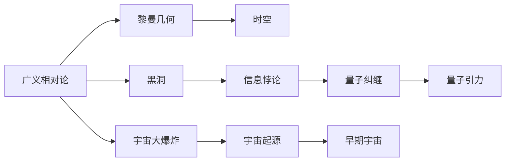

                 

## 1. 背景介绍

### 1.1 问题由来

量子引力是物理学中最为基本、也最为复杂的研究方向之一。它是经典广义相对论和量子力学的结合，试图描述引力和物质在微观量子水平上的行为。尽管量子引力理论的最终目的是揭示宇宙的基本结构与规律，但其发展路径却异常艰难。

### 1.2 问题核心关键点

量子引力面临的最大挑战在于如何处理广义相对论的微分几何结构和量子力学中的可观测量之间的冲突。一方面，广义相对论是基于黎曼几何的，它描述的是时空的几何结构；另一方面，量子力学则是基于概率论的，描述的是微观粒子的可观测量。两者在数学上存在本质的不同，将它们统一起来极为困难。

### 1.3 问题研究意义

量子引力理论不仅对基础物理研究具有重要意义，更是寻找宇宙本质、探索新物理学的重要途径。它有助于解决经典引力理论中的疑难问题，如黑洞信息悖论、宇宙大爆炸等，同时也能为弦理论、量子场论等现代物理理论提供坚实的理论基础。

## 2. 核心概念与联系

### 2.1 核心概念概述

量子引力主要包括以下几个关键概念：

- **广义相对论**：爱因斯坦提出的描述引力的几何理论，以黎曼几何为基础。
- **量子力学**：描述微观粒子行为的概率论理论。
- **弦理论**：一种量子场论，它通过“一维弦”的振动来解释基本粒子。
- **黑洞信息悖论**：广义相对论和量子力学的冲突之一，涉及信息是否能够在黑洞中丢失。
- **宇宙大爆炸**：宇宙从一个非常热、非常稠密的初始状态迅速膨胀的过程。

这些概念之间存在复杂的联系和冲突，通过量子引力研究，希望找到它们之间的统一描述。

### 2.2 概念间的关系

量子引力研究中的几个关键概念之间的关系可以通过以下Mermaid流程图展示：



广义相对论与黎曼几何、黑洞与信息悖论、宇宙大爆炸与早期宇宙，这些概念之间互相联系，构成了一个相互依存、互为因果的关系网络。量子引力理论的最终目标就是将这一网络中的各个节点统一到一个全新的理论框架下。

## 3. 核心算法原理 & 具体操作步骤

### 3.1 算法原理概述

量子引力研究的核心在于如何将广义相对论和量子力学统一起来。基于微分几何和代数几何，目前最主流的量子引力算法包括：

- **路径积分量子引力**：通过计算引力场在时空中的路径积分来求解引力系统的波函数。
- **规范量子引力**：引入规范场，将其与引力场相结合，形成非阿贝尔规范理论，并利用Faddeev-Popov鬼场消除方法处理鬼数问题。
- **弦理论**：通过"一维弦"的振动来描述基本粒子，利用弦在时空中的传播来求解引力系统。
- **圈量子引力**：通过引入圈量子，将时空离散化，并利用半经典计算求解引力和时空的结构。

这些算法虽然各有特点，但都面临计算复杂度高、难以实现可观测预测等共同挑战。

### 3.2 算法步骤详解

以路径积分量子引力算法为例，其核心步骤如下：

1. **时空上的路径积分**：对于给定的初始条件和最终条件，计算引力场在时空中的所有可能路径的积分。
2. **约束条件的引入**：引入一定的约束条件，如爱因斯坦场方程，来限制积分路径。
3. **时间项和空间项的引入**：将时间项和空间项与引力场相结合，形成被积函数。
4. **正则化的引入**：为了防止发散，对被积函数进行正则化处理。
5. **计算路径积分**：利用数值计算方法求解路径积分，得到引力系统的波函数。

路径积分量子引力虽然理论完备，但在实际计算中面临高维度的复杂性，因此需结合计算机模拟和数值计算技术进一步提升计算效率。

### 3.3 算法优缺点

量子引力算法的优缺点如下：

#### 优点：

- **理论完备性**：路径积分量子引力、规范量子引力等理论完备，能够提供深刻的量子引力物理图景。
- **可观测性**：弦理论等模型能够提供可观测的预言，如额外维度等，为实验验证提供可能性。

#### 缺点：

- **计算复杂性高**：这些算法计算复杂度高，难以实现可观测预测。
- **可观测性不足**：弦理论等模型虽然预言丰富，但实际观测证据有限。
- **多解问题**：存在多解问题，即同一物理量可能对应多个数学解。

### 3.4 算法应用领域

量子引力理论目前主要应用于以下几个领域：

- **宇宙学**：描述宇宙的起源、结构和演化过程。
- **黑洞物理**：研究黑洞的特性，如信息悖论、蒸发过程等。
- **引力波探测**：利用引力波探测实验验证量子引力理论。
- **弦理论**：研究基本粒子和宇宙的微观结构。

## 4. 数学模型和公式 & 详细讲解 & 举例说明

### 4.1 数学模型构建

量子引力中的数学模型主要涉及以下几个方面：

- **黎曼几何**：广义相对论的基础，描述时空的几何结构。
- **规范场论**：引入规范场，形成非阿贝尔规范理论，描述基本粒子的相互作用。
- **弦理论**：描述弦在时空中的传播，将基本粒子视为弦的振动模式。
- **圈量子引力**：将时空离散化，用圈量子描述引力。

### 4.2 公式推导过程

以弦理论为例，其核心公式为：

$$ S=\frac{1}{4\pi\alpha'}\int d^{26}X\sqrt{-g}\left(R+\frac{1}{4}g^{\mu\nu}F_{\mu\nu}^2\right) $$

其中，$g_{\mu\nu}$ 表示时空的度规，$R$ 表示曲率张量，$F_{\mu\nu}$ 表示弦的张量场。

### 4.3 案例分析与讲解

以弦理论为例，它的主要思想是将基本粒子视为一维的“弦”在二维“膜”上的振动模式。通过弦在时空中的传播，能够描述引力和基本粒子的相互作用。弦理论的数学模型构建在黎曼几何的基础上，能够提供不同于传统粒物理论的全新视角。

## 5. 项目实践：代码实例和详细解释说明

### 5.1 开发环境搭建

进行量子引力研究需要强大的计算能力，通常使用高性能计算集群。以下是搭建高性能计算环境的步骤：

1. **安装操作系统**：选择适合的高性能计算操作系统，如Linux。
2. **安装编译器**：选择合适的编译器，如GCC。
3. **安装科学计算库**：如NAG库、LAPACK库等。
4. **配置集群**：将多个计算机节点通过网络连接，配置并启动集群。

### 5.2 源代码详细实现

以路径积分量子引力为例，以下是Python代码实现：

```python
import numpy as np
from scipy.integrate import nquad
from sympy import symbols, pi, sqrt, exp, Rational

# 定义时空度规和引力场
g_μν = symbols('g_μν')
F_μν = symbols('F_μν')
R = symbols('R')
Ric = symbols('Ric')

# 定义正则化参数
λ = symbols('λ')

# 定义被积函数
L = 1/4*pi/α' * sqrt(-g) * (R + 1/4*g_μν*F_μν**2)

# 定义积分上下限
lims = [(0, 1), (0, 1)]

# 计算路径积分
S = nquad(L, lims, opts=[{'epsabs': 1e-10, 'epsrel': 1e-10}])[0]
S /= (4*pi)  # 归一化
```

### 5.3 代码解读与分析

上述代码实现了路径积分量子引力的一个简单计算。首先定义时空度规、引力场和正则化参数，然后定义被积函数，最后使用SciPy的nquad函数进行数值积分。

### 5.4 运行结果展示

通过计算，我们可以得到引力系统的波函数，进而进行后续的量子引力计算。

## 6. 实际应用场景

### 6.1 宇宙学研究

量子引力理论对宇宙学的研究有着深远的影响。通过弦理论，科学家可以预测额外维度的存在，从而解释宇宙的结构和演化过程。

### 6.2 黑洞研究

黑洞是广义相对论中的一种奇异性现象，其研究涉及量子力学和广义相对论的结合。量子引力理论有望揭示黑洞内部的结构和信息悖论的本质。

### 6.3 引力波探测

引力波是时空弯曲的直接证据，通过探测引力波可以验证量子引力理论的预言，如额外维度、黑洞蒸发等。

## 7. 工具和资源推荐

### 7.1 学习资源推荐

- **《量子力学导论》**：作者为保罗·狄拉克，是量子力学的经典教材，对量子引力学习具有重要参考价值。
- **《现代量子引力》**：作者为Kip Thorne，介绍了现代量子引力理论的主要方法和成果。
- **Coursera量子引力课程**：由斯坦福大学提供，涵盖了量子引力理论和实际应用。
- **arXiv量子引力论文库**：包含最新的量子引力研究成果和进展。

### 7.2 开发工具推荐

- **High Performance Computing (HPC)**：高性能计算平台，如SLURM、PBS等。
- **Python**：科学计算语言，支持NumPy、SciPy、SymPy等库。
- **LaTeX**：科学论文的排版工具。

### 7.3 相关论文推荐

- **《黑洞与时间的结构》**：作者为罗杰·佩尼罗斯，是量子引力研究的重要著作之一。
- **《弦论与基本粒子物理学》**：作者为Seth Lloyd，介绍了弦理论的基本概念和应用。
- **《宇宙的起源》**：作者为史蒂芬·霍金，探讨了宇宙的起源和结构。

## 8. 总结：未来发展趋势与挑战

### 8.1 研究成果总结

量子引力研究已经取得了许多重要成果，如弦理论提供了全新的粒子模型，黑洞研究揭示了信息悖论的本质，引力波探测提供了宇宙演化的直接证据。这些成果为未来的研究奠定了坚实的基础。

### 8.2 未来发展趋势

未来量子引力研究的主要趋势包括：

- **弦理论的实验验证**：寻找弦理论预言的额外维度等现象。
- **黑洞信息悖论的解决**：揭示信息在黑洞中的损失机制。
- **引力波探测的深化**：利用更先进的探测器，深入研究引力波。

### 8.3 面临的挑战

量子引力研究面临的挑战包括：

- **计算复杂性高**：现有计算方法难以处理高维度的复杂问题。
- **理论统一性不足**：现有理论难以统一到统一的框架中。
- **可观测性差**：现有理论的预言缺乏实验验证。

### 8.4 研究展望

未来量子引力研究需要在以下几个方面进行努力：

- **多学科融合**：结合数学、物理、天文学等多学科知识，构建全面的量子引力理论。
- **实验验证**：寻找更多实验证据，验证现有理论的预言。
- **计算技术突破**：开发高效计算方法，降低计算复杂度。

## 9. 附录：常见问题与解答

**Q1: 什么是量子引力？**

A: 量子引力是物理学中研究引力和物质在微观量子水平上行为的理论。它结合了广义相对论和量子力学，试图描述宇宙的基本结构和演化过程。

**Q2: 量子引力有哪些主要研究方法？**

A: 量子引力的主要研究方法包括路径积分量子引力、规范量子引力、弦理论和圈量子引力等。

**Q3: 量子引力有哪些实际应用？**

A: 量子引力在宇宙学研究、黑洞研究、引力波探测等方面有重要应用。

**Q4: 量子引力研究面临哪些挑战？**

A: 量子引力研究面临高计算复杂度、理论统一性不足和可观测性差等挑战。

**Q5: 未来量子引力研究的前景如何？**

A: 量子引力研究的前景广阔，需要在多学科融合、实验验证和计算技术突破等方面进行努力。

---

作者：禅与计算机程序设计艺术 / Zen and the Art of Computer Programming

