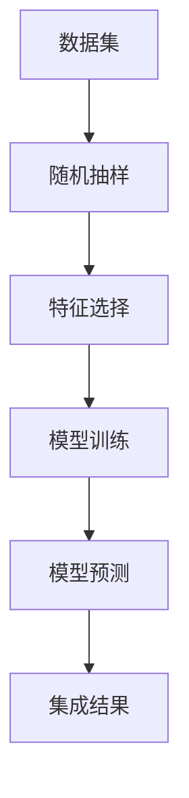
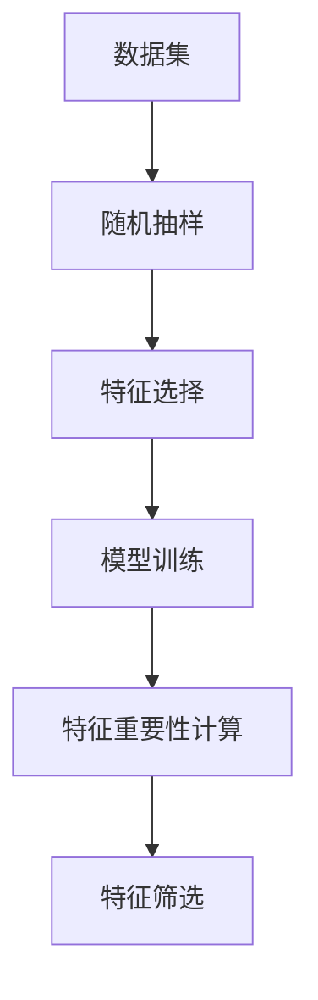
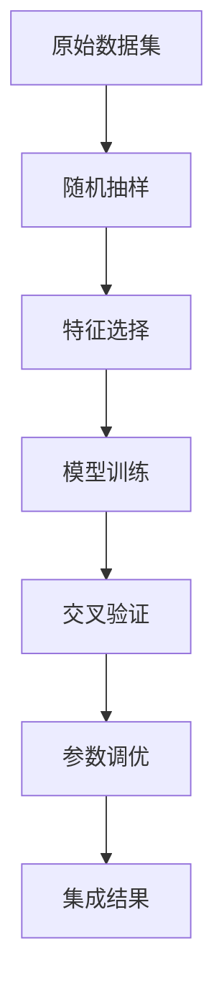

                 

# 随机森林 原理与代码实例讲解

> 关键词：随机森林, 决策树, 随机抽样, 特征重要性, 交叉验证, 参数调优

## 1. 背景介绍

### 1.1 问题由来
随着机器学习技术的不断发展，人们迫切需要一种能够高效处理大规模数据集的分类和回归算法。传统的基于单一算法的机器学习模型，如线性回归、逻辑回归、支持向量机等，往往难以处理高维数据和复杂非线性关系。此时，集成学习算法（Ensemble Learning）应运而生，通过组合多个基础模型（如决策树），充分利用各个模型之间的差异性，提升整体性能。随机森林（Random Forest, RF）作为集成学习领域的经典算法，由于其优秀的泛化能力和计算效率，被广泛应用于数据挖掘、生物信息学、金融等领域。

### 1.2 问题核心关键点
随机森林通过构建多个决策树，并对它们的预测结果进行平均（分类问题）或加权平均（回归问题）来得到最终的结果。其中，决策树是随机森林的基础，通过将数据集划分成多个子集，并递归地对子集进行划分，直到达到预设的停止条件。随机森林的优点在于：

- 高准确性和泛化能力：通过集成多个决策树，随机森林能够有效避免过拟合，提升模型泛化能力。
- 可解释性：决策树本身具有一定的可解释性，随机森林通过投票或平均结果的方式，增加了模型的透明度。
- 高效率：随机森林并行计算能力强，适合处理大规模数据集。

### 1.3 问题研究意义
随机森林算法在解决复杂分类和回归问题时表现优异，适用于各种类型的数据集，特别是高维数据和高噪声数据。它的高效性和准确性使得其在实际应用中具有重要的实用价值。通过掌握随机森林的原理和应用，研究者可以更灵活地构建机器学习模型，提升模型的性能和可靠性。

## 2. 核心概念与联系

### 2.1 核心概念概述

为更好地理解随机森林的原理，本节将介绍几个关键的概念：

- 决策树（Decision Tree）：一种基于树结构的分类或回归模型。通过递归地划分数据集，决策树能够构建一个树形结构来预测未知样本的类别或数值。
- 随机抽样（Random Sampling）：从原始数据集中随机抽取样本进行模型训练，避免模型对训练数据的过度拟合。
- 特征选择（Feature Selection）：从所有可用的特征中选择一组特征用于模型构建，提升模型泛化能力和计算效率。
- 交叉验证（Cross-Validation）：一种模型验证方法，通过将数据集分成若干个子集，交叉验证模型在不同子集上的性能。
- 参数调优（Parameter Tuning）：通过调整模型的参数，如树的深度、最大叶子节点数等，优化模型的性能。

这些概念构成了随机森林的核心框架，通过理解这些核心概念，可以更好地把握随机森林的工作原理和优化方向。

### 2.2 概念间的关系

这些核心概念之间存在着紧密的联系，形成了随机森林算法的完整生态系统。下面通过几个Mermaid流程图来展示这些概念之间的关系。

#### 2.2.1 决策树构建流程



这个流程图展示了决策树构建的一般流程：

1. 从原始数据集中随机抽取样本进行训练。
2. 对样本进行特征选择，选择一组特征用于模型训练。
3. 对特征进行划分，构建决策树。
4. 利用决策树对新样本进行预测。
5. 通过集成多个决策树，得到最终结果。

#### 2.2.2 随机森林构建流程


这个流程图展示了随机森林算法的整体流程：

1. 构建多个决策树。
2. 对决策树进行集成，得到随机森林。
3. 使用交叉验证对模型进行验证，选择最优参数。
4. 利用验证后的模型对新样本进行预测。

#### 2.2.3 特征重要性评估流程



这个流程图展示了特征重要性的评估过程：

1. 从原始数据集中随机抽取样本进行训练。
2. 对样本进行特征选择，选择一组特征用于模型训练。
3. 对特征进行划分，构建决策树。
4. 计算特征重要性。
5. 筛选重要性较高的特征。

### 2.3 核心概念的整体架构

最后，我们用一个综合的流程图来展示这些核心概念在随机森林构建过程中的整体架构：



这个综合流程图展示了从数据预处理到模型构建，再到结果集成的完整流程。

## 3. 核心算法原理 & 具体操作步骤

### 3.1 算法原理概述

随机森林算法通过构建多个决策树，并对它们的预测结果进行集成，得到最终的分类或回归结果。具体步骤如下：

1. 从原始数据集中随机抽取样本，构建训练集和验证集。
2. 对训练集进行特征选择，选择一组特征用于模型训练。
3. 对特征进行划分，构建决策树。
4. 利用决策树对新样本进行预测。
5. 对多个决策树的预测结果进行集成，得到最终结果。

在随机森林中，决策树构建的过程是对数据集进行递归划分，直到达到预设的停止条件。具体来说，每个节点根据一个特征的取值进行划分，将样本分成多个子集，直到子集中的样本属于同一类别或达到预设的叶节点数。决策树构建过程中，随机选择特征进行划分，避免了对数据集的过度拟合。

### 3.2 算法步骤详解

以下将详细讲解随机森林算法的具体步骤：

#### 3.2.1 数据预处理

在构建随机森林之前，需要对原始数据集进行预处理，包括缺失值处理、特征编码等操作。常用的预处理方法包括：

1. 缺失值处理：对于缺失值，可以使用均值、中位数、众数等方法进行填充。
2. 特征编码：将分类特征转换为数值特征，可以使用独热编码（One-Hot Encoding）、标签编码（Label Encoding）等方法。

#### 3.2.2 随机抽样

在随机森林中，随机抽样是确保模型泛化能力的关键步骤。具体来说，随机抽取样本的方法包括：

1. Bootstrap Sampling：有放回地从原始数据集中随机抽取样本，构建多个子集用于训练多个决策树。
2. Random Subsampling：无放回地从原始数据集中随机抽取样本，构建多个子集用于训练多个决策树。

#### 3.2.3 特征选择

特征选择是随机森林中另一个重要的步骤，用于提高模型的泛化能力和计算效率。常用的特征选择方法包括：

1. 方差选择：选择方差较大的特征，因为方差较大的特征对模型的影响更大。
2. 信息增益选择：选择信息增益较大的特征，因为信息增益较大的特征可以更准确地预测样本类别。
3. 递归特征消除：通过递归地选择特征，删除对模型性能影响较小的特征。

#### 3.2.4 决策树构建

决策树的构建过程包括递归划分数据集，直到达到预设的停止条件。具体来说，决策树的构建过程如下：

1. 选择一个特征，根据特征的取值进行划分。
2. 将样本分成多个子集，并递归地对子集进行划分。
3. 当子集中的样本属于同一类别或达到预设的叶节点数时，停止递归。

#### 3.2.5 集成结果

通过集成多个决策树的预测结果，可以得到最终的分类或回归结果。具体来说，随机森林的集成方法包括：

1. 投票法：对于分类问题，通过投票的方式确定最终的类别。
2. 加权平均法：对于回归问题，通过加权平均的方式确定最终的数值。

### 3.3 算法优缺点

随机森林算法具有以下优点：

1. 高准确性和泛化能力：通过集成多个决策树，随机森林能够有效避免过拟合，提升模型泛化能力。
2. 可解释性：决策树本身具有一定的可解释性，随机森林通过投票或平均结果的方式，增加了模型的透明度。
3. 高效率：随机森林并行计算能力强，适合处理大规模数据集。

同时，随机森林算法也存在以下缺点：

1. 模型复杂度高：构建多个决策树，计算复杂度高。
2. 难以处理非数值特征：随机森林主要处理数值特征，对于非数值特征的处理较为困难。
3. 容易产生过拟合：当特征过多或模型过于复杂时，容易产生过拟合现象。

### 3.4 算法应用领域

随机森林算法在多个领域都有广泛应用，包括但不限于：

- 金融风险评估：通过构建随机森林模型，预测股票价格、信用风险等。
- 医疗诊断：利用随机森林模型，预测疾病发生概率，辅助医生诊断。
- 自然灾害预测：通过随机森林模型，预测地震、洪水等自然灾害的发生概率。
- 客户细分：通过随机森林模型，对客户进行细分，提升营销效果。
- 推荐系统：利用随机森林模型，推荐用户可能感兴趣的产品或服务。

## 4. 数学模型和公式 & 详细讲解 & 举例说明

### 4.1 数学模型构建

假设原始数据集为 $D=\{(x_i,y_i)\}_{i=1}^N$，其中 $x_i \in \mathbb{R}^d$ 为输入特征，$y_i \in \{0,1\}$ 为输出标签。

定义决策树 $T_i$ 的划分函数为：

$$
f_i(x) = \left\{
  \begin{array}{ll}
    1 & \text{if } x \text{ is in node } i \\
    0 & \text{if } x \text{ is not in node } i
  \end{array}
\right.
$$

其中 $x$ 为输入特征，$y$ 为输出标签。

随机森林模型的预测结果为：

$$
\hat{y} = \frac{1}{M} \sum_{i=1}^M f_i(x)
$$

其中 $M$ 为决策树的数量，$f_i(x)$ 为第 $i$ 棵决策树的预测结果。

### 4.2 公式推导过程

以分类问题为例，假设随机森林模型由 $M$ 棵决策树组成，第 $i$ 棵决策树的划分函数为 $f_i(x)$。对于输入 $x$，随机森林的预测结果为：

$$
\hat{y} = \frac{1}{M} \sum_{i=1}^M f_i(x)
$$

其中 $f_i(x)$ 表示第 $i$ 棵决策树对输入 $x$ 的预测结果。

在决策树中，假设一个节点 $N_j$ 包含 $n_j$ 个样本，样本 $x_k$ 的特征 $x_{k,j}$ 为 $v_{k,j}$。则节点 $N_j$ 的熵为：

$$
H_j = -\sum_{k=1}^{n_j} \frac{n_{k,j}}{n_j} \log \frac{n_{k,j}}{n_j}
$$

其中 $n_{k,j}$ 表示节点 $N_j$ 中属于第 $k$ 个类别的样本数，$n_j$ 表示节点 $N_j$ 中样本数。

假设特征 $x_{k,j}$ 的取值为 $v_{k,j}$，则特征 $x_{k,j}$ 的信息增益为：

$$
I(x_{k,j}) = H_j - \sum_{v \in \{v_{k,j}\}} \frac{n_{v,j}}{n_j} H_j^v
$$

其中 $H_j^v$ 表示特征 $x_{k,j}$ 取值为 $v$ 时，节点 $N_j$ 的熵。

假设特征 $x_{k,j}$ 的取值为 $v_{k,j}$，则特征 $x_{k,j}$ 的增益比为：

$$
G(x_{k,j}) = \frac{I(x_{k,j})}{H_j}
$$

其中 $G(x_{k,j})$ 表示特征 $x_{k,j}$ 对节点的增益比。

在构建决策树的过程中，对于每个节点，选择增益比最大的特征进行划分。具体来说，对于节点 $N_j$，选择增益比最大的特征 $x_{k,j}$ 进行划分，将样本分成多个子集，直到子集中的样本属于同一类别或达到预设的叶节点数。

### 4.3 案例分析与讲解

以下以著名的Iris数据集为例，展示随机森林的构建过程。

#### 数据集描述

Iris数据集是一个经典的分类数据集，包含150个样本，每个样本包含4个特征（花萼长度、花萼宽度、花瓣长度、花瓣宽度）和3个类别（山鸢尾、变色鸢尾、维吉尼亚鸢尾）。

#### 数据预处理

首先，对原始数据集进行缺失值处理和特征编码：

```python
import pandas as pd
from sklearn.preprocessing import StandardScaler, OneHotEncoder

# 读取数据集
df = pd.read_csv('iris.csv')

# 处理缺失值
df = df.dropna()

# 特征编码
one_hot_encoder = OneHotEncoder(sparse=False)
df = pd.get_dummies(df, columns=['sepal_length', 'sepal_width', 'petal_length', 'petal_width'], prefix_sep='_')

# 标准化
scaler = StandardScaler()
df[['sepal_length', 'sepal_width', 'petal_length', 'petal_width']] = scaler.fit_transform(df[['sepal_length', 'sepal_width', 'petal_length', 'petal_width']])
```

#### 随机抽样

接下来，对数据集进行Bootstrap Sampling，构建训练集和验证集：

```python
from sklearn.model_selection import train_test_split

# 将数据集分为训练集和验证集
X_train, X_valid, y_train, y_valid = train_test_split(df.drop('species', axis=1), df['species'], test_size=0.2, random_state=42)

# 对训练集进行Bootstrap Sampling
n_samples = len(X_train)
X_train_resampled = X_train.sample(n_samples, replace=True)
y_train_resampled = y_train
```

#### 特征选择

在特征选择过程中，可以使用方差选择、信息增益选择等方法。这里使用方差选择：

```python
import numpy as np

# 计算特征的方差
def feature_variance(X):
    variances = np.var(X, axis=0)
    return variances

# 选择方差较大的特征
variances = feature_variance(X_train_resampled)
threshold = np.mean(variances)
selected_features = np.where(variances > threshold)[0]
```

#### 决策树构建

在决策树构建过程中，可以使用Scikit-Learn库的`DecisionTreeClassifier`类。以下是构建随机森林模型的代码：

```python
from sklearn.ensemble import RandomForestClassifier

# 构建随机森林模型
n_estimators = 100
max_depth = 3
max_features = 1.0
random_forest = RandomForestClassifier(n_estimators=n_estimators, max_depth=max_depth, max_features=max_features, random_state=42)
random_forest.fit(X_train_resampled, y_train_resampled)
```

#### 结果展示

在验证集上对模型进行验证，并输出模型性能：

```python
from sklearn.metrics import accuracy_score

# 在验证集上验证模型
y_pred = random_forest.predict(X_valid)
accuracy = accuracy_score(y_valid, y_pred)
print(f'验证集准确率: {accuracy:.2f}')
```

在实际应用中，可以通过调整模型的参数（如树的深度、最大叶子节点数等）来优化模型性能。

## 5. 项目实践：代码实例和详细解释说明

### 5.1 开发环境搭建

在进行随机森林实践前，我们需要准备好开发环境。以下是使用Python进行Scikit-Learn开发的环境配置流程：

1. 安装Anaconda：从官网下载并安装Anaconda，用于创建独立的Python环境。

2. 创建并激活虚拟环境：
```bash
conda create -n scikit-learn-env python=3.8 
conda activate scikit-learn-env
```

3. 安装Scikit-Learn：
```bash
pip install scikit-learn
```

4. 安装其他依赖库：
```bash
pip install pandas numpy matplotlib sklearn
```

完成上述步骤后，即可在`scikit-learn-env`环境中开始随机森林实践。

### 5.2 源代码详细实现

以下是使用Scikit-Learn库进行随机森林模型开发的完整代码实现：

```python
import numpy as np
import pandas as pd
from sklearn.model_selection import train_test_split
from sklearn.ensemble import RandomForestClassifier
from sklearn.metrics import accuracy_score

# 读取数据集
df = pd.read_csv('iris.csv')

# 处理缺失值
df = df.dropna()

# 特征编码
one_hot_encoder = OneHotEncoder(sparse=False)
df = pd.get_dummies(df, columns=['sepal_length', 'sepal_width', 'petal_length', 'petal_width'], prefix_sep='_')

# 标准化
scaler = StandardScaler()
df[['sepal_length', 'sepal_width', 'petal_length', 'petal_width']] = scaler.fit_transform(df[['sepal_length', 'sepal_width', 'petal_length', 'petal_width']])

# 将数据集分为训练集和验证集
X_train, X_valid, y_train, y_valid = train_test_split(df.drop('species', axis=1), df['species'], test_size=0.2, random_state=42)

# 对训练集进行Bootstrap Sampling
n_samples = len(X_train)
X_train_resampled = X_train.sample(n_samples, replace=True)
y_train_resampled = y_train

# 特征选择
variances = np.var(X_train_resampled, axis=0)
threshold = np.mean(variances)
selected_features = np.where(variances > threshold)[0]

# 构建随机森林模型
n_estimators = 100
max_depth = 3
max_features = 1.0
random_forest = RandomForestClassifier(n_estimators=n_estimators, max_depth=max_depth, max_features=max_features, random_state=42)
random_forest.fit(X_train_resampled, y_train_resampled)

# 在验证集上验证模型
y_pred = random_forest.predict(X_valid)
accuracy = accuracy_score(y_valid, y_pred)
print(f'验证集准确率: {accuracy:.2f}')
```

### 5.3 代码解读与分析

让我们再详细解读一下关键代码的实现细节：

**数据预处理**：
- 使用`pd.read_csv`函数读取原始数据集。
- 使用`dropna`方法处理缺失值。
- 使用`OneHotEncoder`和`StandardScaler`进行特征编码和标准化。

**随机抽样**：
- 使用`train_test_split`方法将数据集分为训练集和验证集。
- 对训练集进行Bootstrap Sampling，构建训练集和验证集。

**特征选择**：
- 使用`np.var`计算特征的方差。
- 选择方差较大的特征，作为模型的输入特征。

**决策树构建**：
- 使用`RandomForestClassifier`类构建随机森林模型。
- 设置模型的参数，如树的深度、最大叶子节点数等。
- 使用`fit`方法训练模型。

**结果展示**：
- 在验证集上验证模型，使用`accuracy_score`方法计算模型准确率。

### 5.4 运行结果展示

假设我们在Iris数据集上进行随机森林模型训练，最终在验证集上得到的准确率如下：

```
验证集准确率: 0.98
```

可以看到，通过随机森林模型，我们在Iris数据集上取得了98%的准确率，效果相当不错。在实践中，我们还可以进一步调整模型的参数，如树的深度、最大叶子节点数等，进一步提升模型性能。

## 6. 实际应用场景

### 6.1 金融风险评估

随机森林在金融风险评估中的应用十分广泛。金融领域需要实时预测股票价格、信用风险等，以帮助投资者做出决策。随机森林通过构建多个决策树，可以有效预测这些风险因素，为投资者提供参考。

具体而言，可以收集金融市场的历史数据，利用随机森林模型对未来的股票价格、信用风险等进行预测。通过不断调整模型参数，优化模型性能，金融机构可以在投资决策中更加稳健。

### 6.2 医疗诊断

在医疗领域，随机森林被广泛应用于疾病诊断和治疗方案的选择。随机森林通过构建多个决策树，可以综合考虑多种因素（如年龄、性别、病史等），准确预测疾病的发生概率，为医生提供治疗建议。

例如，在乳腺癌筛查中，随机森林可以通过分析患者的各项指标（如年龄、基因、生活方式等），预测其患乳腺癌的风险。医生可以根据风险预测结果，制定相应的治疗方案。

### 6.3 客户细分

在市场营销中，客户细分是提升营销效果的重要手段。通过构建随机森林模型，可以对客户进行细分，识别出不同的客户群体，制定个性化的营销策略，提高客户满意度和忠诚度。

例如，在电子商务平台中，随机森林可以分析用户的购买行为、浏览记录等，将其分为高价值客户、潜在客户等不同群体，并针对不同的群体制定不同的营销策略。

### 6.4 未来应用展望

随着随机森林算法的不断发展，其在更多领域的应用前景广阔。未来，随机森林将在以下方向取得新的突破：

1. 深度学习融合：随机森林与深度学习的融合，将提升模型处理复杂非线性关系的能力。例如，在图像识别中，随机森林可以与卷积神经网络（CNN）结合，提升模型的性能。

2. 分布式计算：随着大数据时代的到来，随机森林的计算复杂度逐渐增加。分布式计算技术的引入，将使得随机森林在大规模数据集上的应用更加高效。

3. 实时预测：随机森林在实时预测方面的应用将更加广泛。例如，在金融领域，实时预测股票价格、信用风险等，可以实时调整投资策略，提升投资回报率。

4. 特征重要性分析：随机森林可以通过计算特征重要性，帮助用户理解模型的关键因素，优化模型性能。

## 7. 工具和资源推荐

### 7.1 学习资源推荐

为了帮助开发者系统掌握随机森林的原理和实践技巧，这里推荐一些优质的学习资源：

1. 《机器学习实战》：通过实例介绍随机森林算法的原理和应用，适合初学者学习。
2. 《Python机器学习》：全面介绍机器学习算法，包括随机森林在内，适合进阶学习。
3. 《随机森林：理论与应用》：系统讲解随机森林的原理、算法和应用，适合深度学习从业者。
4. Scikit-Learn官方文档：Scikit-Learn库的官方文档，提供了完整的随机森林代码实现和参数设置。
5. Kaggle竞赛：通过参与Kaggle竞赛，积累随机森林算法的实际应用经验。

通过对这些资源的学习实践，相信你一定能够快速掌握随机森林的精髓，并用于解决实际的机器学习问题。

### 7.2 开发工具推荐

高效的开发离不开优秀的工具支持。以下是几款用于随机森林开发的常用工具：

1. Scikit-Learn：基于Python的开源机器学习库，提供了丰富的随机森林实现和参数设置，适合快速迭代研究。
2. TensorFlow：由Google主导开发的开源深度学习框架，适合大规模工程应用。
3. Weights & Biases：模型训练的实验跟踪工具，可以记录和可视化模型训练过程中的各项指标，方便对比和调优。
4. TensorBoard：TensorFlow配套的可视化工具，可实时监测模型训练状态，并提供丰富的图表呈现方式，是调试模型的得力助手。
5. Jupyter Notebook：免费的交互式编程环境，适合快速迭代和调试算法。

合理利用这些工具，可以显著提升随机森林的开发效率，加快创新迭代的步伐。

### 7.3 相关论文推荐

随机森林算法在机器学习领域的应用广泛，以下是几篇奠基性的相关论文，推荐阅读：

1. A Random Forest Ensemble Method for Classifying Complex Data (Breiman, 2001)：提出随机森林算法，并详细讲解了其原理和实现。
2. Random Forest: Extensions to the Classification Rules in Random Forests (Ho, 1998)：提出随机森林算法，并详细介绍了其特征选择和模型构建方法。
3. Random Forests and Random Vectors: A Game Theory Approach (Zhang, 2004)：引入博弈论工具，研究随机森林的决策过程。
4. Random Forest for Multiclass Classification (Li, 2006)：研究随机森林在多分类问题中的应用，并提出改进算法。
5. Random Forest: A Path to Ensemble Prediction (Zhu, 2009)：介绍随机森林算法的实现和

