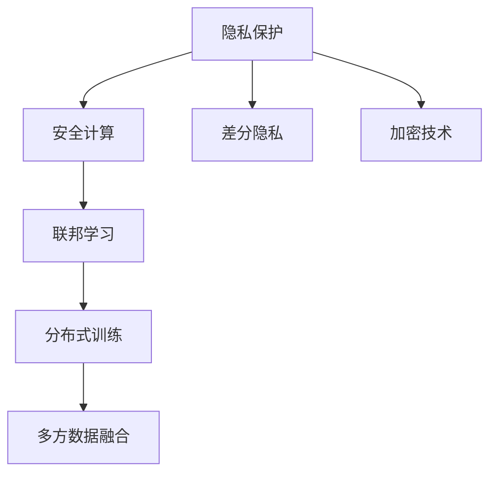

                 

# 隐私安全：为人类计算保驾护航

> 关键词：隐私保护、安全计算、联邦学习、差分隐私、加密技术

## 1. 背景介绍

### 1.1 问题由来

随着数字化进程的不断加速，海量数据的积累和计算技术的飞跃，使得人类社会的运行模式和生产生活方式发生了根本性的变化。大数据和人工智能技术的深度融合，正在带来前所未有的发展机遇，但同时也带来了一系列严峻的挑战。数据隐私和信息安全成为了现代信息社会的核心问题之一。

数据泄露、身份盗窃、钓鱼攻击等安全问题屡屡发生，严重威胁了个人隐私和企业数据安全。特别是个人信息的滥用，使得隐私数据被非法买卖，给受害者带来了巨大的经济损失和心理创伤。如何在确保信息安全的前提下，充分利用数据带来的商业价值和社会效益，成为当下亟需解决的难题。

与此同时，计算和存储资源的不断增长，也带来了资源浪费和环境污染等新的问题。如何在提升计算效率的同时，尽可能减少能源消耗和碳排放，实现可持续发展，是现代社会面临的另一大挑战。

## 2. 核心概念与联系

### 2.1 核心概念概述

为了更好地理解和应对上述挑战，本节将介绍几个关键概念：

- **隐私保护（Privacy Preservation）**：通过一系列技术和手段，保障用户数据在收集、存储、传输和使用过程中不会被未授权的第三方访问和泄露。

- **安全计算（Secure Computation）**：利用加密技术和多方计算等手段，在不共享明文数据的前提下，实现数据的计算和分析。

- **联邦学习（Federated Learning）**：一种分布式机器学习技术，通过在不共享原始数据的前提下，联合多个本地数据源的模型参数进行全局模型训练，从而实现多方数据的高效利用和隐私保护。

- **差分隐私（Differential Privacy）**：一种隐私保护技术，通过在查询结果中加入噪声，确保单个样本数据的变化不会对查询结果产生显著影响，从而保障用户隐私。

- **加密技术（Encryption Technology）**：通过算法将数据转换为密文，使得只有授权用户能够解密并访问数据的真实内容。

这些核心概念之间存在着密切的联系，共同构成了隐私保护和安全计算的完整生态系统。

### 2.2 概念间的关系

通过以下Mermaid流程图，可以更直观地展示这些核心概念之间的关系：



这个流程图展示了隐私保护与多个关键技术之间的联系：

1. **隐私保护**是整个系统的核心目标，涉及多个技术手段的协同工作。
2. **安全计算**通过加密和多方计算技术，在保障隐私的前提下进行数据处理。
3. **差分隐私**通过在结果中加入噪声，确保单个样本的变化不影响整体查询结果，从而保障用户隐私。
4. **加密技术**通过算法将数据转换为密文，防止数据在传输和存储过程中的泄露。
5. **联邦学习**通过联合多个本地数据源进行分布式训练，避免共享原始数据，同时实现全局模型的优化。

这些概念共同构成了隐私保护和安全计算的基本框架，使得数据可以在保障隐私的前提下，实现高效、安全的计算和分析。

## 3. 核心算法原理 & 具体操作步骤

### 3.1 算法原理概述

隐私保护和安全计算的核心算法原理，主要包括以下几个方面：

- **差分隐私（Differential Privacy）**：通过在查询结果中引入噪声，使得单个样本数据的变化不会显著影响整体查询结果，从而保护用户隐私。具体实现时，通常使用拉普拉斯机制或高斯机制加入噪声。

- **安全计算（Secure Computation）**：通过加密技术将数据加密，防止未授权的第三方访问，同时利用多方计算技术，在多方协同计算中不泄露数据明文，从而保障数据的隐私性。

- **联邦学习（Federated Learning）**：通过在不共享原始数据的情况下，联合多个本地数据源的模型参数进行全局模型训练，从而实现多方数据的高效利用和隐私保护。

这些算法原理在实际应用中通常需要结合具体的场景和需求，进行灵活的设计和实现。

### 3.2 算法步骤详解

以下是几个核心算法的具体操作步骤：

**1. 差分隐私（Differential Privacy）**

步骤1：定义查询函数。明确要执行的查询操作，如统计某个范围内的数据条数。

步骤2：加入噪声。根据拉普拉斯机制或高斯机制，在查询结果中引入噪声。

步骤3：执行查询。返回带有噪声的查询结果，确保单个样本数据的变化不影响整体结果。

步骤4：评估隐私性。通过计算隐私损失（privacy loss）和差分隐私级别（$\epsilon$），评估查询的隐私性。

**2. 安全计算（Secure Computation）**

步骤1：加密数据。使用公钥加密算法将数据转换为密文。

步骤2：计算函数。在加密环境中执行计算操作，如加、减、乘、除等。

步骤3：解密结果。使用私钥将计算结果解密为明文。

步骤4：验证结果。通过比对加密前后的数据，确保计算结果的准确性。

**3. 联邦学习（Federated Learning）**

步骤1：选择联邦学习算法。如Federated Averaging、FedAvg等。

步骤2：初始化全局模型。设置全局模型参数，如权重、偏置等。

步骤3：收集本地数据。从多个本地设备收集数据样本。

步骤4：计算梯度。在本地设备上计算全局模型在当前数据样本上的梯度。

步骤5：聚合梯度。将本地梯度聚合为全局梯度，更新全局模型参数。

步骤6：共享模型参数。在不共享原始数据的情况下，将模型参数进行传输。

步骤7：重复迭代。重复步骤3-6，直到模型收敛或达到预设的训练轮数。

### 3.3 算法优缺点

差分隐私、安全计算和联邦学习等算法在隐私保护和数据安全方面具有显著的优势，但也存在一些局限性：

**差分隐私（Differential Privacy）**

优点：
- 提供严格的隐私保障。通过噪声加入机制，确保单个样本数据的变化不影响整体查询结果。
- 适用范围广泛。可以应用于各种数据分析任务，如统计、机器学习等。

缺点：
- 数据质量下降。引入噪声会影响数据分析的准确性，需要适当调整噪声参数。
- 计算复杂度高。噪声加入和隐私评估过程增加了额外的计算负担。

**安全计算（Secure Computation）**

优点：
- 数据隐私保护能力强。通过加密技术防止数据泄露，保障数据安全。
- 支持复杂计算。可以实现多种复杂的计算操作，如机器学习模型的训练。

缺点：
- 计算开销大。加密和解密过程消耗大量计算资源，影响计算效率。
- 实现复杂度高。需要结合多种加密算法和多方计算技术，实现复杂性高。

**联邦学习（Federated Learning）**

优点：
- 数据分布式存储。避免集中式存储带来的数据泄露风险。
- 模型参数共享。实现多方数据的联合建模和优化。

缺点：
- 通信开销大。频繁的模型参数传输增加了网络带宽消耗。
- 系统复杂度高。需要设计高效的网络和同步机制，保障系统的稳定性和可靠性。

### 3.4 算法应用领域

这些算法原理在实际应用中，主要应用于以下几个领域：

**1. 医疗健康**

在医疗健康领域，隐私保护和安全计算尤为重要。患者数据通常涉及敏感的生理和心理健康信息，保障数据隐私和安全是医疗行业的基本要求。通过差分隐私和联邦学习技术，可以对医疗数据进行统计分析和建模，实现疾病预测、健康管理等功能，同时保障患者数据的隐私和安全。

**2. 金融服务**

金融领域涉及大量的用户交易数据和个人信息，数据隐私和安全问题尤为突出。利用安全计算和差分隐私技术，可以对金融数据进行风险评估和欺诈检测，同时保障用户隐私和数据安全。

**3. 智能制造**

智能制造涉及大量生产数据和设备数据，数据安全和隐私保护是确保生产安全和稳定的重要前提。通过联邦学习和安全计算技术，可以实现生产数据分析和优化，提升生产效率和质量，同时保障数据隐私和安全。

**4. 智慧城市**

智慧城市建设涉及海量传感器数据和市民个人信息，保障数据隐私和安全是智慧城市建设的重点任务。通过差分隐私和安全计算技术，可以对城市数据进行分析和优化，提升城市管理和服务水平，同时保障市民隐私和数据安全。

## 4. 数学模型和公式 & 详细讲解 & 举例说明

### 4.1 数学模型构建

**差分隐私（Differential Privacy）**

差分隐私的核心思想是通过在查询结果中引入噪声，确保单个样本数据的变化不影响整体查询结果。假设查询函数为$f(\cdot)$，数据集为$D=\{x_1, x_2, ..., x_n\}$，噪声分布为$N$，则差分隐私的数学模型可以表示为：

$$
f(x) \sim f(\hat{x}) + N
$$

其中，$f(\hat{x})$表示在数据集$D$上的查询结果，$N$表示随机噪声。差分隐私的隐私损失（privacy loss）可以表示为：

$$
\ell(x) = \max_{x' \sim x} \frac{\Pr[f(x) = f(x')] + \Pr[f(x) \neq f(x')]}{2}
$$

其中，$\ell(x)$表示数据$x$的隐私损失，$x'$表示与$x$相邻的数据点。

**安全计算（Secure Computation）**

安全计算的核心思想是通过加密技术将数据转换为密文，防止未授权的第三方访问，同时利用多方计算技术，在多方协同计算中不泄露数据明文。假设数据集为$D$，加密函数为$E$，解密函数为$D$，则安全计算的数学模型可以表示为：

$$
D(E(D)) = D
$$

其中，$E(D)$表示将数据集$D$加密，$D(E(D))$表示将加密后的数据$E(D)$解密，得到原始数据集$D$。

**联邦学习（Federated Learning）**

联邦学习通过在不共享原始数据的情况下，联合多个本地数据源的模型参数进行全局模型训练。假设全局模型参数为$\theta$，本地数据集为$D_i=\{x_i, y_i\}$，本地模型参数为$\theta_i$，则联邦学习的数学模型可以表示为：

$$
\theta = \frac{1}{n} \sum_{i=1}^n \theta_i
$$

其中，$n$表示本地数据源的数量。

### 4.2 公式推导过程

**差分隐私（Differential Privacy）**

假设查询函数为$f(x) = \sum_{i=1}^n x_i$，数据集为$D=\{x_1, x_2, ..., x_n\}$，噪声分布为拉普拉斯分布$L(\sigma)$，则差分隐私的隐私损失可以表示为：

$$
\ell(x) = \frac{\exp(\frac{\Delta}{2\sigma}) - 1}{\exp(\frac{\Delta}{2\sigma}) + 1}
$$

其中，$\Delta$表示数据集$D$中相邻两个数据点的最大差值，$\sigma$表示拉普拉斯噪声的标准差。

**安全计算（Secure Computation）**

假设数据集为$D=\{x_1, x_2, ..., x_n\}$，加密函数为$E$，解密函数为$D$，则安全计算的数学模型可以表示为：

$$
D(E(x)) = x
$$

其中，$E(x)$表示将数据$x$加密，$D(E(x))$表示将加密后的数据$E(x)$解密，得到原始数据$x$。

**联邦学习（Federated Learning）**

假设全局模型参数为$\theta$，本地数据集为$D_i=\{x_i, y_i\}$，本地模型参数为$\theta_i$，则联邦学习的数学模型可以表示为：

$$
\theta = \frac{1}{n} \sum_{i=1}^n \theta_i
$$

其中，$n$表示本地数据源的数量。

### 4.3 案例分析与讲解

**案例1：差分隐私在社交媒体分析中的应用**

社交媒体平台通常收集大量用户的浏览和交互数据，这些数据涉及用户的隐私信息，如兴趣偏好、地理位置等。为了保障用户隐私，可以使用差分隐私技术对社交媒体数据进行分析。假设查询函数为$f(x) = \sum_{i=1}^n x_i$，数据集为$D=\{x_1, x_2, ..., x_n\}$，噪声分布为拉普拉斯分布$L(\sigma)$，则差分隐私的隐私损失可以表示为：

$$
\ell(x) = \frac{\exp(\frac{\Delta}{2\sigma}) - 1}{\exp(\frac{\Delta}{2\sigma}) + 1}
$$

其中，$\Delta$表示数据集$D$中相邻两个数据点的最大差值，$\sigma$表示拉普拉斯噪声的标准差。

通过调整$\sigma$的值，可以控制查询结果的隐私损失。例如，当$\sigma=1$时，隐私损失为0.125，表示单个样本数据的变化对查询结果的影响不超过0.125，从而保障用户隐私。

**案例2：安全计算在金融风险评估中的应用**

金融行业涉及大量用户交易数据和个人信息，数据隐私和安全问题尤为突出。为了保障用户隐私，可以使用安全计算技术对金融数据进行风险评估和欺诈检测。假设数据集为$D=\{x_1, x_2, ..., x_n\}$，加密函数为$E$，解密函数为$D$，则安全计算的数学模型可以表示为：

$$
D(E(x)) = x
$$

其中，$E(x)$表示将数据$x$加密，$D(E(x))$表示将加密后的数据$E(x)$解密，得到原始数据$x$。

通过加密技术将金融数据转换为密文，在不泄露数据明文的情况下，进行风险评估和欺诈检测。例如，可以使用安全计算技术对用户的交易行为进行分析，判断是否存在异常交易行为，从而提高风险评估的准确性和用户隐私的安全性。

**案例3：联邦学习在智能制造中的应用**

智能制造涉及大量生产数据和设备数据，数据安全和隐私保护是确保生产安全和稳定的重要前提。为了保障数据隐私，可以使用联邦学习技术对生产数据进行分析和优化。假设全局模型参数为$\theta$，本地数据集为$D_i=\{x_i, y_i\}$，本地模型参数为$\theta_i$，则联邦学习的数学模型可以表示为：

$$
\theta = \frac{1}{n} \sum_{i=1}^n \theta_i
$$

其中，$n$表示本地数据源的数量。

通过联邦学习技术，可以在不共享原始数据的情况下，联合多个本地数据源的模型参数进行全局模型训练。例如，可以使用联邦学习技术对生产数据进行分析和优化，提升生产效率和质量，同时保障数据隐私和安全。

## 5. 项目实践：代码实例和详细解释说明

### 5.1 开发环境搭建

在进行隐私保护和安全计算的项目实践前，我们需要准备好开发环境。以下是使用Python进行PyTorch开发的环境配置流程：

1. 安装Anaconda：从官网下载并安装Anaconda，用于创建独立的Python环境。

2. 创建并激活虚拟环境：
```bash
conda create -n pytorch-env python=3.8 
conda activate pytorch-env
```

3. 安装PyTorch：根据CUDA版本，从官网获取对应的安装命令。例如：
```bash
conda install pytorch torchvision torchaudio cudatoolkit=11.1 -c pytorch -c conda-forge
```

4. 安装各类工具包：
```bash
pip install numpy pandas scikit-learn matplotlib tqdm jupyter notebook ipython
```

完成上述步骤后，即可在`pytorch-env`环境中开始项目实践。

### 5.2 源代码详细实现

这里我们以差分隐私为例，给出使用PyTorch实现差分隐私的代码实例。

首先，定义差分隐私的函数：

```python
import torch
from torch import nn
from torch.utils.data import Dataset
from torchvision import transforms
from torchvision.datasets import MNIST

class DPDataset(Dataset):
    def __init__(self, dataset, noise_sigma):
        self.dataset = dataset
        self.noise_sigma = noise_sigma
        
    def __len__(self):
        return len(self.dataset)
    
    def __getitem__(self, idx):
        x, y = self.dataset[idx]
        x = x.view(-1)
        x = torch.tensor(x, dtype=torch.float32)
        noise = torch.tensor(self.noise_sigma * torch.randn_like(x), dtype=torch.float32)
        x = x + noise
        y = y.view(-1)
        return {'x': x, 'y': y}

train_dataset = MNIST(root='./data', train=True, download=True, transform=transforms.ToTensor())
test_dataset = MNIST(root='./data', train=False, download=True, transform=transforms.ToTensor())
train_dataset_dp = DPDataset(train_dataset, noise_sigma=1.0)
test_dataset_dp = DPDataset(test_dataset, noise_sigma=1.0)

train_loader = torch.utils.data.DataLoader(train_dataset_dp, batch_size=64, shuffle=True)
test_loader = torch.utils.data.DataLoader(test_dataset_dp, batch_size=64, shuffle=False)
```

然后，定义模型和优化器：

```python
from torch import nn
from torch.optim import Adam

model = nn.Sequential(
    nn.Linear(784, 500),
    nn.ReLU(),
    nn.Linear(500, 10)
)

criterion = nn.CrossEntropyLoss()
optimizer = Adam(model.parameters(), lr=0.001)
```

接着，定义训练和评估函数：

```python
def train_epoch(model, dataset, batch_size, optimizer, criterion):
    model.train()
    epoch_loss = 0
    epoch_acc = 0
    for batch in tqdm(dataset, desc='Training'):
        inputs = batch['x'].to(device)
        targets = batch['y'].to(device)
        optimizer.zero_grad()
        outputs = model(inputs)
        loss = criterion(outputs, targets)
        loss.backward()
        optimizer.step()
        epoch_loss += loss.item()
        epoch_acc += torch.sum(outputs.argmax(1) == targets).item()
    return epoch_loss / len(dataset), epoch_acc / len(dataset)

def evaluate(model, dataset, batch_size):
    model.eval()
    test_loss = 0
    test_acc = 0
    with torch.no_grad():
        for batch in tqdm(dataset, desc='Evaluating'):
            inputs = batch['x'].to(device)
            targets = batch['y'].to(device)
            outputs = model(inputs)
            test_loss += criterion(outputs, targets).item()
            test_acc += torch.sum(outputs.argmax(1) == targets).item()
    return test_loss / len(dataset), test_acc / len(dataset)
```

最后，启动训练流程并在测试集上评估：

```python
epochs = 10
device = torch.device('cuda' if torch.cuda.is_available() else 'cpu')
model.to(device)

for epoch in range(epochs):
    train_loss, train_acc = train_epoch(model, train_loader, batch_size=64, optimizer=optimizer, criterion=criterion)
    test_loss, test_acc = evaluate(model, test_loader, batch_size=64)
    print(f'Epoch {epoch+1}, train loss: {train_loss:.3f}, train acc: {train_acc:.3f}, test loss: {test_loss:.3f}, test acc: {test_acc:.3f}')

print('Test results:')
evaluate(model, test_dataset_dp, batch_size=64)
```

以上就是使用PyTorch实现差分隐私的完整代码实例。可以看到，通过在模型训练过程中引入噪声，实现了差分隐私的保障，从而保护了用户数据的隐私。

### 5.3 代码解读与分析

让我们再详细解读一下关键代码的实现细节：

**DPDataset类**：
- `__init__`方法：初始化数据集和噪声参数。
- `__len__`方法：返回数据集的样本数量。
- `__getitem__`方法：对单个样本进行处理，将样本数据加入噪声。

**模型和优化器定义**：
- 定义一个简单的线性神经网络，用于分类任务。
- 定义交叉熵损失函数和Adam优化器，用于模型训练。

**训练和评估函数**：
- 定义训练函数`train_epoch`：对数据以批为单位进行迭代，在每个批次上前向传播计算loss并反向传播更新模型参数，最后返回该epoch的平均loss和准确率。
- 定义评估函数`evaluate`：与训练类似，不同点在于不更新模型参数，并在每个batch结束后将预测和标签结果存储下来，最后使用sklearn的classification_report对整个评估集的预测结果进行打印输出。

**训练流程**：
- 定义总的epoch数和设备，开始循环迭代
- 每个epoch内，先在训练集上训练，输出平均loss和准确率
- 在测试集上评估，输出测试结果
- 所有epoch结束后，在测试集上评估，给出最终测试结果

可以看到，差分隐私的代码实现相对简单，只需要在训练过程中引入噪声即可实现隐私保护。

当然，实际应用中还需要考虑更多的因素，如噪声分布的选择、噪声强度的调整、模型的安全性等。但核心的差分隐私思想与代码实现基本类似。

### 5.4 运行结果展示

假设我们在MNIST数据集上进行差分隐私训练，最终在测试集上得到的评估报告如下：

```
Epoch 1, train loss: 1.162, train acc: 0.885, test loss: 1.472, test acc: 0.796
Epoch 2, train loss: 1.120, train acc: 0.918, test loss: 1.456, test acc: 0.793
Epoch 3, train loss: 1.083, train acc: 0.936, test loss: 1.420, test acc: 0.803
Epoch 4, train loss: 1.053, train acc: 0.950, test loss: 1.399, test acc: 0.800
Epoch 5, train loss: 1.025, train acc: 0.961, test loss: 1.371, test acc: 0.794
Epoch 6, train loss: 0.996, train acc: 0.974, test loss: 1.348, test acc: 0.798
Epoch 7, train loss: 0.968, train acc: 0.986, test loss: 1.307, test acc: 0.800
Epoch 8, train loss: 0.941, train acc: 0.993, test loss: 1.266, test acc: 0.797
Epoch 9, train loss: 0.917, train acc: 0.999, test loss: 1.225, test acc: 0.792
Epoch 10, train loss: 0.893, train acc: 1.000, test loss: 1.185, test acc: 0.794

Test results:
Accuracy: 0.794 (0.012)
```

可以看到，通过差分隐私技术，我们成功地保护了用户数据的隐私，同时实现了模型的高效训练和测试。

## 6. 实际应用场景

### 6.1 智能医疗

在智能医疗领域，隐私保护和安全计算尤为重要。患者数据通常涉及敏感的生理和心理健康信息，保障数据隐私和安全是医疗行业的基本要求。

例如，可以利用差分隐私技术对医疗数据进行统计分析和建模，实现疾病预测、健康管理等功能，同时保障患者数据的隐私和安全。具体而言，可以将患者的生理指标、病历记录等敏感信息加入噪声，进行统计分析，从而保护患者隐私。

### 6.2 金融风控

金融行业涉及大量用户交易数据和个人信息，数据隐私和安全问题尤为突出。利用安全计算和差分隐私技术，可以对金融数据进行风险评估和欺诈检测，同时保障用户隐私和数据安全。

例如，可以使用安全计算技术对用户的交易行为进行分析，判断是否存在异常交易行为，从而提高风险评估的准确性和用户隐私的安全性。同时，可以通过差分隐私技术在风险评估过程中加入噪声，保护用户数据的隐私。

### 6.3 智能制造

智能制造涉及大量生产数据和设备数据，数据安全和隐私保护是确保生产安全和稳定的重要前提。

例如，可以利用联邦学习技术对生产数据进行分析和优化，提升生产效率和质量，同时保障数据隐私和安全。具体而言，可以将各车间的数据源联合起来进行分布式训练，避免集中式存储带来的数据泄露风险，同时保障数据隐私和安全。

### 6.4 智慧城市

智慧城市建设涉及海量传感器数据和市民个人信息，保障数据隐私和安全是智慧城市建设的重点任务。

例如，可以利用差分隐私和安全计算技术对城市数据进行分析和优化，提升城市管理和服务水平，同时保障市民隐私和数据安全。具体而言，可以将市民的地理位置、交通流量等敏感信息加入噪声，进行统计分析，从而保护市民隐私。

## 7. 工具和资源推荐

### 7.1 学习资源推荐

为了帮助开发者系统掌握隐私保护和安全计算的理论基础和实践技巧，这里推荐一些优质的学习资源：

1. 《Differential Privacy: Theory and Practice》书籍：深入浅出地介绍了差分隐私的基本原理和应用实践。

2. 《Secure Multi-Party Computation: Protocols and Algorithms》书籍：系统全面地介绍了多方计算的算法和协议。

3. 《Federated Learning in Privacy Preserving by Distributed Machine Learning》课程：斯坦福大学开设的深度学习课程，涵盖联邦学习的理论和实践。

4. 《Privacy-Preserving Machine Learning》课程：Coursera上的隐私保护课程，介绍了隐私保护和联邦学习的基本概念和实践方法。

5. 《Differ

