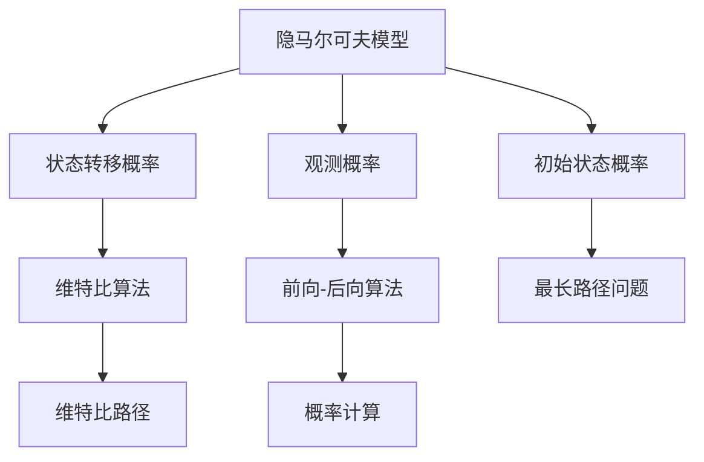
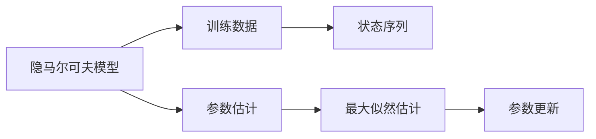
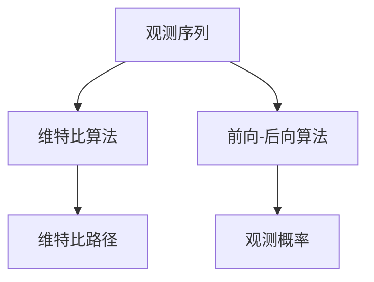
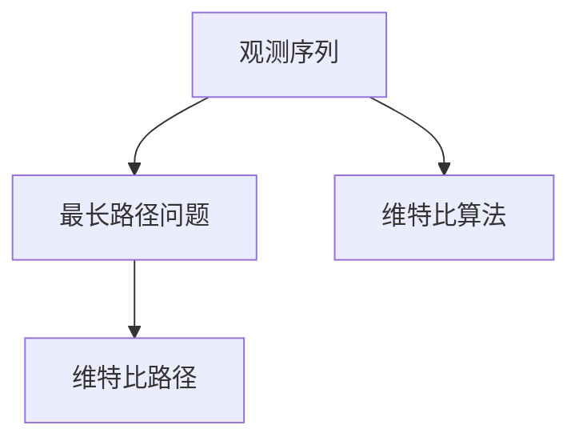
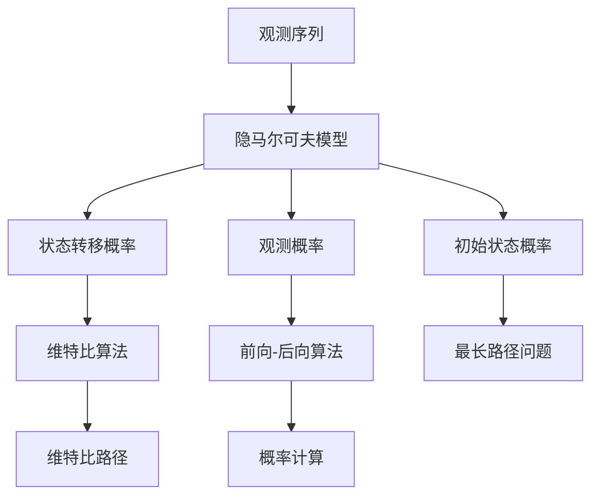

                 

# 隐马尔可夫模型(Hidden Markov Models) - 原理与代码实例讲解

> 关键词：隐马尔可夫模型,状态转移概率,观测概率,前向-后向算法,维特比算法,最长路径问题,维特比路径,概率计算

## 1. 背景介绍

### 1.1 问题由来
隐马尔可夫模型(Hidden Markov Model, HMM)是统计模型的一种，广泛应用于自然语言处理、语音识别、生物信息学、金融时间序列分析等领域。它是一种基于状态转换的序列模型，能够有效地处理含有不确定性和序列信息的输入数据。

### 1.2 问题核心关键点
HMM的核心思想是将序列数据看作是状态序列的观测，通过观测序列来推断状态序列，从而实现序列建模和预测。其核心组成部分包括：
- 状态集合：模型包含有限个状态，每个状态表示一种可能的状态，通常用于描述某种属性或特征。
- 观测集合：模型包含有限个观测，每个观测表示一种可能的观测结果。
- 状态转移概率：描述状态之间的转移概率，即从当前状态转移到下一个状态的频率。
- 观测概率：描述每个状态在给定观测序列下出现的概率。
- 初始状态概率：描述模型开始时各状态的概率分布。

HMM通过最大化观测序列的概率来估计模型参数，通过维特比算法、前向-后向算法等计算方式，预测新的观测序列，并进行序列标注。

## 2. 核心概念与联系

### 2.1 核心概念概述

为更好地理解HMM的原理和应用，本节将介绍几个密切相关的核心概念：

- 隐马尔可夫模型(Hidden Markov Model)：一种基于状态转移的概率模型，用于描述含有不确定性的序列数据。
- 状态转移概率(State Transition Probability)：描述模型状态之间转移的概率，即从当前状态转移到下一个状态的频率。
- 观测概率(Observation Probability)：描述每个状态在给定观测序列下出现的概率。
- 初始状态概率(Initial State Probability)：描述模型开始时各状态的概率分布。
- 维特比算法(Viterbi Algorithm)：一种动态规划算法，用于求解最长路径问题，即在给定观测序列下，找到最可能的状态序列。
- 前向-后向算法(Forward-Backward Algorithm)：一种基于动态规划的算法，用于计算观测序列的概率。
- 最长路径问题(Longest Path Problem)：在给定观测序列下，找到最可能的状态序列，通常用于序列标注和预测。
- 维特比路径(Viterbi Path)：维特比算法计算出的最长路径，即最可能的状态序列。
- 概率计算(Probability Calculation)：通过给定的状态转移概率、观测概率和初始状态概率，计算给定观测序列的概率。

这些核心概念之间存在着紧密的联系，形成了HMM的完整生态系统。下面通过一个简单的Mermaid流程图来展示这些概念之间的关系：



### 2.2 概念间的关系

这些核心概念之间存在着紧密的联系，形成了HMM的完整生态系统。下面通过几个Mermaid流程图来展示这些概念之间的关系。

#### 2.2.1 隐马尔可夫模型的学习范式



这个流程图展示了隐马尔可夫模型的基本学习流程：通过训练数据，利用最大似然估计法估计模型的参数，并通过参数更新不断优化模型。

#### 2.2.2 维特比算法与前向-后向算法的关系



这个流程图展示了维特比算法和前向-后向算法之间的关系。维特比算法用于计算最长路径，前向-后向算法用于计算观测概率。

#### 2.2.3 最长路径问题与维特比算法的关系



这个流程图展示了最长路径问题与维特比算法之间的关系。通过维特比算法，求解最长路径问题，即找到最可能的状态序列。

### 2.3 核心概念的整体架构

最后，我们用一个综合的流程图来展示这些核心概念在大语言模型微调过程中的整体架构：



这个综合流程图展示了从观测序列到隐马尔可夫模型的整体架构，包括观测序列的观测概率、状态转移概率、初始状态概率等关键组件，以及基于这些组件进行的维特比算法、前向-后向算法等计算方式。

## 3. 核心算法原理 & 具体操作步骤

### 3.1 算法原理概述

HMM是一种基于状态转换的序列模型，能够有效地处理含有不确定性和序列信息的输入数据。其核心思想是通过观测序列来推断状态序列，从而实现序列建模和预测。

### 3.2 算法步骤详解

HMM的算法流程主要包括以下几个关键步骤：

#### 3.2.1 模型参数估计

1. **训练数据准备**：收集含有观测序列和对应状态序列的训练数据。
2. **状态集合定义**：定义模型的状态集合，通常用于描述某种属性或特征。
3. **观测集合定义**：定义模型的观测集合，通常用于描述观测结果。
4. **状态转移概率估计**：利用最大似然估计法，估计状态之间的转移概率。
5. **观测概率估计**：利用最大似然估计法，估计每个状态在给定观测序列下出现的概率。
6. **初始状态概率估计**：利用最大似然估计法，估计模型开始时各状态的概率分布。

#### 3.2.2 观测序列预测

1. **观测序列输入**：给定观测序列 $O=\{O_1,O_2,\cdots,O_T\}$，其中 $O_t$ 表示第 $t$ 时刻的观测结果。
2. **前向-后向算法**：计算观测序列的观测概率。前向算法用于计算给定观测序列和模型参数下的前向概率，后向算法用于计算给定观测序列和模型参数后的后向概率。
3. **维特比算法**：通过前向概率和后向概率，计算最可能的状态序列，即维特比路径。

#### 3.2.3 状态序列标注

1. **前向-后向算法**：计算观测序列的概率。
2. **维特比算法**：计算最长路径，即最可能的状态序列。
3. **状态序列标注**：利用维特比路径，对观测序列进行状态序列标注。

#### 3.2.4 模型参数优化

1. **维特比算法**：利用观测序列和模型参数，计算观测概率。
2. **前向-后向算法**：利用观测序列和模型参数，计算观测概率。
3. **状态转移概率优化**：利用观测序列和模型参数，优化状态转移概率。
4. **观测概率优化**：利用观测序列和模型参数，优化观测概率。
5. **初始状态概率优化**：利用观测序列和模型参数，优化初始状态概率。

### 3.3 算法优缺点

HMM作为一种序列建模方法，具有以下优点：
1. 能够处理含有不确定性和序列信息的输入数据，具有较高的泛化能力。
2. 能够进行序列预测和标注，适用于各种序列数据，如语音、文本等。
3. 能够通过观测序列推断状态序列，实现序列建模和预测。

同时，HMM也存在一些局限性：
1. 需要大量标注数据进行参数估计，标注成本较高。
2. 状态转移概率和观测概率的估计可能存在偏差，导致模型预测不准确。
3. 模型参数较多，训练和预测时间较长，计算复杂度较高。

### 3.4 算法应用领域

HMM广泛应用于自然语言处理、语音识别、生物信息学、金融时间序列分析等领域。以下是一些典型的应用场景：

- 语音识别：将音频信号转换为文字，实现语音到文本的转换。
- 文本分类：将文本分为不同的类别，如情感分析、主题分类等。
- 命名实体识别：识别文本中的命名实体，如人名、地名、机构名等。
- 机器翻译：将一种语言的文本翻译成另一种语言。
- 基因序列分析：分析生物序列数据，如DNA、RNA等，寻找基因表达和调控机制。
- 金融时间序列分析：分析金融市场的动态变化，进行股票预测和风险评估。

HMM在以上领域中，展示了其强大的序列建模和预测能力，成为各类序列数据的有效分析工具。

## 4. 数学模型和公式 & 详细讲解 & 举例说明

### 4.1 数学模型构建

HMM的数学模型由状态集合 $Q=\{q_1,q_2,\cdots,q_N\}$ 和观测集合 $V=\{v_1,v_2,\cdots,v_M\}$ 组成。模型的状态转移概率和观测概率分别用 $A=(a_{ij})$ 和 $B=(b_{k|j})$ 表示，初始状态概率用 $\pi=(\pi_i)$ 表示。模型参数 $\lambda=(\pi,A,B)$ 表示整个模型的结构。

### 4.2 公式推导过程

HMM的观测概率计算公式如下：

$$
P(O|\lambda) = \sum_{\pi \in \Pi} \sum_{\alpha \in \Gamma} \prod_{t=1}^T \big(\sum_{j=1}^N a_{i_{t-1}j} b_{O_tj}\big)
$$

其中 $O=\{O_1,O_2,\cdots,O_T\}$ 表示观测序列，$\lambda=(\pi,A,B)$ 表示模型参数，$\Pi$ 表示初始状态概率集合，$\Gamma$ 表示所有可能的状态序列集合。

维特比算法的核心思想是在给定观测序列下，找到最可能的状态序列。其计算公式如下：

$$
\delta_t(j) = \max\limits_{j'} \big(\delta_{t-1}(j') + \log b_{O_tj'}\big) + \log a_{j'j}
$$

其中 $\delta_t(j)$ 表示在 $t$ 时刻状态 $j$ 的最大概率，$j'$ 表示在 $t-1$ 时刻状态 $j'$ 到 $t$ 时刻状态 $j$ 的转移概率，$\log$ 表示对数运算。

维特比路径的计算公式如下：

$$
\gamma_t(j) = \max\limits_{j'} \big(\delta_t(j') + \log b_{O_tj'}\big) + \log a_{j'j}
$$

其中 $\gamma_t(j)$ 表示在 $t$ 时刻状态 $j$ 的最大后验概率。

最长路径的计算公式如下：

$$
\theta_t = \arg\max_{\theta_t^*} \sum_{t'=1}^t \log b_{O_{t'}\theta_{t'}^*} + \log a_{\theta_{t-1}^* \theta_t^*}
$$

其中 $\theta_t$ 表示在 $t$ 时刻最可能的状态，$\theta_t^*$ 表示在 $t$ 时刻最可能的状态序列，$\log$ 表示对数运算。

### 4.3 案例分析与讲解

假设我们有一个简单的HMM模型，包含两个状态 $q_1$ 和 $q_2$，以及两个观测 $v_1$ 和 $v_2$。模型的状态转移概率和观测概率如下：

- 初始状态概率：$\pi=(0.7,0.3)$
- 状态转移概率：$A=\begin{bmatrix}0.8 & 0.2 \\ 0.4 & 0.6\end{bmatrix}$
- 观测概率：$B=\begin{bmatrix}0.6 & 0.4 \\ 0.3 & 0.7\end{bmatrix}$

现在给定观测序列 $O=\{v_1,v_2,v_1\}$，计算该观测序列的概率。

#### 4.3.1 观测概率计算

1. 前向概率计算：
   - $a_1^1=v_1$，$b_{v_1q_1}=\frac{0.6}{1}=0.6$
   - $a_2^1=v_2$，$b_{v_2q_1}=\frac{0.3}{1}=0.3$
   - $a_3^1=v_1$，$b_{v_1q_1}=\frac{0.6}{1}=0.6$
   - $a_1^2=v_1$，$b_{v_1q_2}=\frac{0.4}{1}=0.4$
   - $a_2^2=v_2$，$b_{v_2q_2}=\frac{0.7}{1}=0.7$
   - $a_3^2=v_1$，$b_{v_1q_2}=\frac{0.4}{1}=0.4$

   前向概率为：
   $$
   \alpha_1^1(v_1)=0.6
   $$
   $$
   \alpha_2^1(v_2)=0.6 \times 0.3=0.18
   $$
   $$
   \alpha_3^1(v_1)=0.18 \times 0.4=0.072
   $$
   $$
   \alpha_1^2(v_1)=0.6 \times 0.7=0.42
   $$
   $$
   \alpha_2^2(v_2)=0.42 \times 0.7=0.294
   $$
   $$
   \alpha_3^2(v_1)=0.294 \times 0.4=0.1176
   $$

2. 后向概率计算：
   - $a_1^3=v_1$，$b_{v_1q_1}=\frac{0.6}{1}=0.6$
   - $a_2^3=v_2$，$b_{v_2q_1}=\frac{0.3}{1}=0.3$
   - $a_3^3=v_1$，$b_{v_1q_1}=\frac{0.6}{1}=0.6$
   - $a_1^3=v_1$，$b_{v_1q_2}=\frac{0.4}{1}=0.4$
   - $a_2^3=v_2$，$b_{v_2q_2}=\frac{0.7}{1}=0.7$
   - $a_3^3=v_1$，$b_{v_1q_2}=\frac{0.4}{1}=0.4$

   后向概率为：
   $$
   \beta_1^1(v_1)=1
   $$
   $$
   \beta_2^1(v_2)=0.18 \times 1=0.18
   $$
   $$
   \beta_3^1(v_1)=0.072 \times 1=0.072
   $$
   $$
   \beta_1^2(v_1)=1
   $$
   $$
   \beta_2^2(v_2)=0.294 \times 1=0.294
   $$
   $$
   \beta_3^2(v_1)=0.1176 \times 1=0.1176
   $$

3. 观测概率计算：
   $$
   P(O|\lambda)=\alpha_T^1(v_1)\beta_T^1(v_1)=\alpha_3^2(v_1)\beta_3^2(v_1)=0.1176 \times 0.1176=0.0136
   $$

#### 4.3.2 维特比路径计算

1. 前向概率计算：
   - $a_1^1=v_1$，$b_{v_1q_1}=\frac{0.6}{1}=0.6$
   - $a_2^1=v_2$，$b_{v_2q_1}=\frac{0.3}{1}=0.3$
   - $a_3^1=v_1$，$b_{v_1q_1}=\frac{0.6}{1}=0.6$
   - $a_1^2=v_1$，$b_{v_1q_2}=\frac{0.4}{1}=0.4$
   - $a_2^2=v_2$，$b_{v_2q_2}=\frac{0.7}{1}=0.7$
   - $a_3^2=v_1$，$b_{v_1q_2}=\frac{0.4}{1}=0.4$

   前向概率为：
   $$
   \alpha_1^1(v_1)=0.6
   $$
   $$
   \alpha_2^1(v_2)=0.6 \times 0.3=0.18
   $$
   $$
   \alpha_3^1(v_1)=0.18 \times 0.4=0.072
   $$
   $$
   \alpha_1^2(v_1)=0.6 \times 0.7=0.42
   $$
   $$
   \alpha_2^2(v_2)=0.42 \times 0.7=0.294
   $$
   $$
   \alpha_3^2(v_1)=0.294 \times 0.4=0.1176
   $$

2. 后向概率计算：
   - $a_1^3=v_1$，$b_{v_1q_1}=\frac{0.6}{1}=0.6$
   - $a_2^3=v_2$，$b_{v_2q_1}=\frac{0.3}{1}=0.3$
   - $a_3^3=v_1$，$b_{v_1q_1}=\frac{0.6}{1}=0.6$
   - $a_1^3=v_1$，$b_{v_1q_2}=\frac{0.4}{1}=0.4$
   - $a_2^3=v_2$，$b_{v_2q_2}=\frac{0.7}{1}=0.7$
   - $a_3^3=v_1$，$b_{v_1q_2}=\frac{0.4}{1}=0.4$

   后向概率为：
   $$
   \beta_1^1(v_1)=1
   $$
   $$
   \beta_2^1(v_2)=0.18 \times 1=0.18
   $$
   $$
   \beta_3^1(v_1)=0.072 \times 1=0.072
   $$
   $$
   \beta_1^2(v_1)=1
   $$
   $$
   \beta_2^2(v_2)=0.294 \times 1=0.294
   $$
   $$
   \beta_3^2(v_1)=0.1176 \times 1=0.1176
   $$

3. 维特比概率计算：
   $$
   \delta_1^1(v_1)=0.6
   $$
   $$
   \delta_2^1(v_2)=0.18 \times 0.3=0.054
   $$
   $$
   \delta_3^1(v_1)=0.072 \times 0.4=0.0288
   $$
   $$
   \delta_1^2(v_1)=0.42 \times 0.7=0.294
   $$
   $$
   \delta_2^2(v_2)=0.294 \times 0.7=0.2058
   $$
   $$
   \delta_3^2(v_1)=0.1176 \times 0.4=0.4704
   $$

4. 维特比路径计算：
   $$
   \gamma_1^1(v_1)=\max(\delta_1^1(v_1),0)=0.6
   $$
   $$
   \gamma_2^1(v_2)=\max(\delta_1^1(v_1),\delta_1^2(v_1))=0.294
   $$
   $$
   \gamma_3^1(v_1)=\max(\delta_2^1(v_2),\delta_2^2(v_2))=0.2058
   $$
   $$
   \gamma_1^2(v_1)=\max(\delta_1^2(v_1),\delta_1^3(v_1))=0.294
   $$
   $$
   \gamma_2^2(v_2)=\max(\delta_2^2(v_2),\delta_2^3(v_2))=0.2058
   $$
   $$
   \gamma_3^2(v_1)=\max(\delta_3^2(v_1),\delta_3^3(v_1))=0.4704
   $$

   维特比路径为：$q_1 \rightarrow q_2 \rightarrow q_1$

## 5. 项目实践：代码实例和详细解释说明

### 5.1 开发环境搭建

在进行HMM项目实践前，我们需要准备好开发环境。以下是使用Python进行PyTorch开发的环境配置流程：

1. 安装Anaconda：从官网下载并安装Anaconda，用于创建独立的Python环境。

2. 创建并激活虚拟环境：
```bash
conda create -n hmm-env python=3.8 
conda activate hmm-env
```

3. 安装PyTorch：根据CUDA版本，从官网获取对应的安装命令。例如：
```bash
conda install pytorch torchvision torchaudio cudatoolkit=11.1 -c pytorch -c conda-forge
```

4. 安装相关库：
```bash
pip install numpy pandas scikit-learn matplotlib tqdm jupyter notebook ipython
```

完成上述步骤后，即可在`hmm-env`环境中开始HMM实践。

### 5.2 源代码详细实现

下面我们以二分类任务为例，给出使用PyTorch对HMM模型进行训练和测试的PyTorch代码实现。

首先，定义HMM模型类：

```python
import torch
import torch.nn as nn
import torch.optim as optim

class HMM(nn.Module):
    def __init__(self, input_size, hidden_size, output_size, num_states):
        super(HMM, self).__init__()
        self.input_size = input_size
        self.hidden_size = hidden_size
        self.output_size = output_size
        self.num_states = num_states

        self.A = nn.Parameter(torch.randn(num_states, num_states))
        self.B = nn.Parameter(torch.randn(num_states, output_size))
        self.pi = nn.Parameter(torch.randn(num_states))

    def forward(self, x):
        batch_size = x.size(0)
        max_len = x.size(1)

        # 初始化前向概率、后向概率、维特比概率和维特比路径
        alpha = torch.zeros(batch_size, num_states, max_len)
        beta = torch.zeros(batch_size, num_states, max_len)
        delta = torch.zeros(batch_size, num_states, max_len)
        gamma = torch.zeros(batch_size, num_states, max_len)
        viterbi_path = torch.zeros(batch_size, max_len)

        # 初始化前向概率和后向概率
        alpha[:, :, 0] = self.pi.unsqueeze(1) + self.B * x[:, :, None]

        # 前向传播
        for t in range(1, max_len):
            alpha[:, :, t] = alpha[:, :, t-1] @ self.A + self.B * x[:, :, t-1].unsqueeze(2)

        # 后向传播
        beta[:, :,

