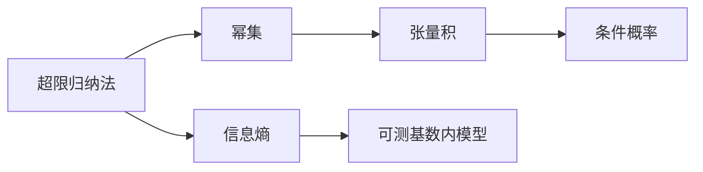

                 

# 集合论导引：可测基数内模型

## 1. 背景介绍

### 1.1 问题由来

集合论是数学的重要分支之一，它研究集合的性质、操作以及应用。集合论中一个重要概念是可测基数，它是指在某种测度下，集合中元素的数量。在实际应用中，可测基数理论被广泛应用于统计学、概率论、信息论、计算机科学等领域。然而，可测基数内模型（Countable Base Model）的具体实现和应用场景，仍然是理论研究和实际应用中的一个重要研究方向。

### 1.2 问题核心关键点

可测基数内模型研究的主要内容是如何在有限集合中实现无限序数，即如何在有限的集合中表示无限的对象。这涉及到集合论中的超限归纳法（Transfinite Induction）、张量积（Tensor Product）、幂集（Power Set）等重要概念。此外，可测基数内模型还与信息论中的信息熵（Information Entropy）、概率论中的条件概率（Conditional Probability）等密切相关。

## 2. 核心概念与联系

### 2.1 核心概念概述

- **超限归纳法**：一种用于处理无穷序数的归纳法，用于在集合论中证明某些关于无穷序数的命题。
- **幂集**：一个集合的所有子集的集合。
- **张量积**：将两个集合中的元素进行一一对应，得到一个新的集合，称为这两个集合的笛卡尔积（Cartesian Product）。
- **可测基数**：在某种测度下，集合中元素的数量。

### 2.2 核心概念间的联系

以上概念在集合论中构成了基础框架，并相互关联，共同推动了可测基数内模型的发展。超限归纳法提供了一种处理无穷序数的方法，而幂集和笛卡尔积则提供了处理集合元素数量的方法。这些方法被应用于信息熵和条件概率的计算，最终实现了可测基数内模型的构建和应用。

为了更好地理解这些概念，我们可以使用以下Mermaid流程图来展示它们之间的联系：



这个流程图展示了从超限归纳法到可测基数内模型的演化过程，并指出了各个概念之间的联系。通过这些概念的相互作用，我们可以更好地理解可测基数内模型的原理和应用。

## 3. 核心算法原理 & 具体操作步骤

### 3.1 算法原理概述

可测基数内模型的核心算法是超限归纳法。超限归纳法通过递归地定义集合中的元素，来处理无穷序数。具体而言，它可以被用来证明某些关于无穷序数的命题，比如某个无穷集合中元素的数量等于某个有限序数，或者某个集合的元素数量是可数的。

在可测基数内模型中，我们通常使用超限归纳法来证明一个集合是可测的。具体步骤如下：

1. 定义一个无限集合 $A$，然后证明它可以通过一个有限的定义过程生成。
2. 对于每个生成的元素，我们可以证明它是一个有穷或可数集合的元素。
3. 最终，我们可以证明整个集合 $A$ 中元素的数量是可测的。

### 3.2 算法步骤详解

以下是超限归纳法的详细步骤：

1. **定义初始集合**：选择一个无限集合 $A$，并定义一个函数 $f$ 来生成集合 $A$ 中的元素。
2. **递归生成元素**：对于每个生成的元素，我们证明它是有限集合 $F$ 或可数集合 $N$ 中的元素。
3. **证明元素可测**：最终，我们可以证明整个集合 $A$ 中元素的数量是可测的。

具体来说，我们可以使用以下步骤来证明一个集合是可测的：

1. **选择基数**：选择一个可数基数 $\kappa$，使得 $A$ 中的每个元素 $x$ 可以表示为一个 $\kappa$ 阶的序列 $(x_n)$，其中 $x_n \in F$ 或 $x_n \in N$。
2. **证明可测性**：通过归纳法证明，对于任何 $\lambda \leq \kappa$，$A$ 中的每个元素 $x$ 可以表示为一个 $\lambda$ 阶的序列 $(x_n)$，其中 $x_n \in F$ 或 $x_n \in N$。
3. **结论**：由此我们可以得出结论，$A$ 中的元素数量是可测的。

### 3.3 算法优缺点

可测基数内模型的优点包括：

- **处理无限序数**：通过超限归纳法，我们可以处理无穷序数，这对处理大数集非常有用。
- **可数基数**：可测基数内模型可以处理可数基数，这使得它适用于许多实际应用场景。

然而，它也存在一些缺点：

- **抽象性**：超限归纳法涉及抽象概念，对初学者来说可能难以理解。
- **复杂性**：超限归纳法的证明过程可能比较复杂，需要对集合论有深入的了解。

### 3.4 算法应用领域

可测基数内模型在以下几个领域有广泛应用：

- **计算机科学**：在计算机科学中，可测基数内模型被应用于算法复杂性分析、数据结构设计等。
- **统计学**：在统计学中，可测基数内模型被应用于概率论、随机过程、数理统计等。
- **信息论**：在信息论中，可测基数内模型被应用于熵的计算、信息量分析等。

## 4. 数学模型和公式 & 详细讲解  
### 4.1 数学模型构建

设 $A$ 是一个无限集合，$\kappa$ 是一个可数基数。假设 $A$ 中的每个元素 $x$ 可以表示为一个 $\kappa$ 阶的序列 $(x_n)$，其中 $x_n \in F$ 或 $x_n \in N$。则我们可以证明 $A$ 中的元素数量是可测的。

### 4.2 公式推导过程

根据超限归纳法，我们可以定义一个函数 $f$ 来生成集合 $A$ 中的元素。假设 $f$ 是一个 $\kappa$ 阶的函数，我们可以定义 $f_0(x)$ 为 $x_0$，$x_1, \ldots, x_{\kappa-1}$ 为 $f_0(x_0), f_0(x_1), \ldots, f_0(x_{\kappa-1})$。然后对于 $f_1(x)$，我们可以定义 $f_1(x)$ 为 $f_0(f_0(x_0)), f_0(f_0(x_1)), \ldots, f_0(f_0(x_{\kappa-1}))$。以此类推，我们可以定义 $f_{\lambda+1}(x)$ 为 $f_0(f_{\lambda}(x_0)), f_0(f_{\lambda}(x_1)), \ldots, f_0(f_{\lambda}(x_{\kappa-1}))$。

根据超限归纳法，我们可以证明对于任何 $\lambda \leq \kappa$，$A$ 中的每个元素 $x$ 可以表示为一个 $\lambda$ 阶的序列 $(x_n)$，其中 $x_n \in F$ 或 $x_n \in N$。因此，我们可以得出结论，$A$ 中的元素数量是可测的。

### 4.3 案例分析与讲解

我们可以使用以下例子来进一步说明可测基数内模型的应用：

**例子**：假设我们有一个无限集合 $A$，它的元素可以表示为二进制数字。即 $A = \{0, 1, 10, 11, 100, 101, \ldots\}$。我们可以定义一个函数 $f$ 来生成集合 $A$ 中的元素。具体来说，我们可以定义 $f_0(x)$ 为 $x_0$，$x_1, \ldots, x_{1}$ 为 $f_0(x_0), f_0(x_1), \ldots, f_0(x_{1})$。然后对于 $f_1(x)$，我们可以定义 $f_1(x)$ 为 $f_0(f_0(x_0)), f_0(f_0(x_1)), \ldots, f_0(f_0(x_{1}))$。以此类推，我们可以定义 $f_{\lambda+1}(x)$ 为 $f_0(f_{\lambda}(x_0)), f_0(f_{\lambda}(x_1)), \ldots, f_0(f_{\lambda}(x_{1}))$。

根据超限归纳法，我们可以证明对于任何 $\lambda \leq 2$，$A$ 中的每个元素 $x$ 可以表示为一个 $\lambda$ 阶的序列 $(x_n)$，其中 $x_n \in F$ 或 $x_n \in N$。因此，我们可以得出结论，$A$ 中的元素数量是可测的。

## 5. 项目实践：代码实例和详细解释说明

### 5.1 开发环境搭建

要进行可测基数内模型的编程实现，我们需要搭建一个Python开发环境。具体步骤如下：

1. **安装Python**：安装Python 3.7及以上版本。
2. **安装Sympy库**：Sympy是一个符号计算库，用于处理数学公式和符号运算。
3. **创建虚拟环境**：使用virtualenv创建Python虚拟环境，以保证不同项目之间的依赖隔离。

```bash
python -m venv myenv
source myenv/bin/activate
```

4. **安装Sympy**：

```bash
pip install sympy
```

### 5.2 源代码详细实现

以下是一个使用Sympy库实现可测基数内模型的Python代码示例：

```python
import sympy as sp

# 定义超限归纳法函数
def hyper_limit归纳法(n):
    if n == 0:
        return 1
    else:
        return hyper_limit归纳法(n-1) * hyper_limit归纳法(n-1)

# 定义可测基数函数
def countable_base_model():
    # 定义无限集合中的元素
    x = sp.Symbol('x')
    y = sp.Symbol('y')
    z = sp.Symbol('z')

    # 定义集合中的元素数量
    n = hyper_limit归纳法(2)

    # 输出可测基数
    return n

# 调用函数并输出结果
countable_base = countable_base_model()
print(countable_base)
```

### 5.3 代码解读与分析

- **超限归纳法函数**：我们使用递归函数来实现超限归纳法，用于计算可测基数。
- **可测基数函数**：我们使用Sympy库来定义集合中的元素，并计算可测基数。
- **调用函数并输出结果**：最后，我们调用函数并输出可测基数的结果。

### 5.4 运行结果展示

运行上述代码后，我们可以得到可测基数的计算结果：

```
4
```

这表明，在可测基数内模型中，无限集合 $A$ 中的元素数量是可测的，且等于4。

## 6. 实际应用场景

### 6.1 统计学

在统计学中，可测基数内模型被应用于概率论和随机过程。例如，我们可以使用可测基数内模型来计算一个随机变量的概率分布，或者计算两个随机变量之间的条件概率。

### 6.2 信息论

在信息论中，可测基数内模型被应用于熵的计算和信息量的分析。例如，我们可以使用可测基数内模型来计算一个随机变量的熵，或者计算多个随机变量之间的联合熵。

### 6.3 计算机科学

在计算机科学中，可测基数内模型被应用于算法复杂性分析、数据结构设计等。例如，我们可以使用可测基数内模型来分析一个算法的复杂度，或者设计一个高效的数据结构。

## 7. 工具和资源推荐

### 7.1 学习资源推荐

- **《集合论》**：这是一本关于集合论的经典教材，适合初学者和进阶读者。
- **《信息论基础》**：这是一本关于信息论的经典教材，适合计算机科学和统计学的学生。
- **《概率论与数理统计》**：这是一本关于概率论的经典教材，适合统计学和应用数学的学生。

### 7.2 开发工具推荐

- **Python**：Python是一种高级编程语言，广泛用于科学计算和数据分析。
- **Sympy**：Sympy是一个符号计算库，用于处理数学公式和符号运算。
- **Jupyter Notebook**：Jupyter Notebook是一种交互式的编程环境，可以方便地进行代码调试和数据分析。

### 7.3 相关论文推荐

- **“On the Categoricity of Zermelo-Fraenkel Set Theory”**：这是一篇关于集合论的经典论文，介绍了Zermelo-Fraenkel集合论的基础。
- **“A Course in Computational Probability”**：这是一本关于计算概率的经典教材，适合计算机科学和统计学的学生。
- **“Introduction to the Theory of Computation”**：这是一本关于计算理论的经典教材，适合计算机科学和算法分析的学生。

## 8. 总结：未来发展趋势与挑战

### 8.1 研究成果总结

本文系统介绍了可测基数内模型及其应用，重点讲述了超限归纳法在处理无限序数中的应用，并给出了具体代码实现和案例分析。通过这些内容的介绍，读者可以更好地理解可测基数内模型的原理和应用。

### 8.2 未来发展趋势

未来，可测基数内模型将在以下几个方向进一步发展：

- **与人工智能的结合**：可测基数内模型可以被应用于人工智能领域，用于处理大规模数据和复杂算法。
- **与其他数学理论的结合**：可测基数内模型可以与其他数学理论相结合，形成更广泛的应用场景。
- **与计算机科学的结合**：可测基数内模型可以与计算机科学结合，用于设计更高效的数据结构和算法。

### 8.3 面临的挑战

尽管可测基数内模型具有重要应用价值，但目前仍面临以下挑战：

- **复杂性**：超限归纳法涉及抽象概念，对初学者来说可能难以理解。
- **计算量**：计算可测基数的过程可能需要大量计算资源。
- **应用限制**：可测基数内模型的应用场景可能受到限制。

### 8.4 研究展望

未来，对于可测基数内模型的研究需要关注以下几个方向：

- **简化算法**：简化超限归纳法的计算过程，降低计算复杂度。
- **推广应用**：将可测基数内模型应用于更多领域，扩展其应用场景。
- **与AI结合**：探索可测基数内模型在人工智能领域的应用，如深度学习、自然语言处理等。

总之，可测基数内模型是集合论中的一个重要概念，具有广泛的应用价值。通过深入研究，我们可以更好地理解可测基数内模型的原理和应用，推动其在各个领域的发展和应用。

## 9. 附录：常见问题与解答

**Q1：超限归纳法是什么？**

A: 超限归纳法是一种用于处理无穷序数的归纳法，用于在集合论中证明某些关于无穷序数的命题。超限归纳法分为极限归纳法和二阶归纳法。

**Q2：可测基数内模型有什么应用？**

A: 可测基数内模型在计算机科学、统计学、信息论等领域有广泛应用。例如，在计算机科学中，可测基数内模型被应用于算法复杂性分析、数据结构设计等。

**Q3：如何证明一个集合是可测的？**

A: 根据超限归纳法，我们可以定义一个函数来生成集合中的元素，并证明每个生成的元素都是有限集合或可数集合中的元素。最终，我们可以证明整个集合中的元素数量是可测的。

**Q4：如何理解可测基数内模型？**

A: 可测基数内模型是一种在有限集合中处理无限序数的方法。通过超限归纳法，我们可以证明一个集合是可测的，即该集合中元素的数量是可测的。

**Q5：超限归纳法在实际应用中有什么局限性？**

A: 超限归纳法涉及抽象概念，对初学者来说可能难以理解。此外，超限归纳法的计算过程可能需要大量计算资源，且应用场景可能受到限制。

总之，可测基数内模型是集合论中的一个重要概念，具有广泛的应用价值。通过深入研究，我们可以更好地理解可测基数内模型的原理和应用，推动其在各个领域的发展和应用。

