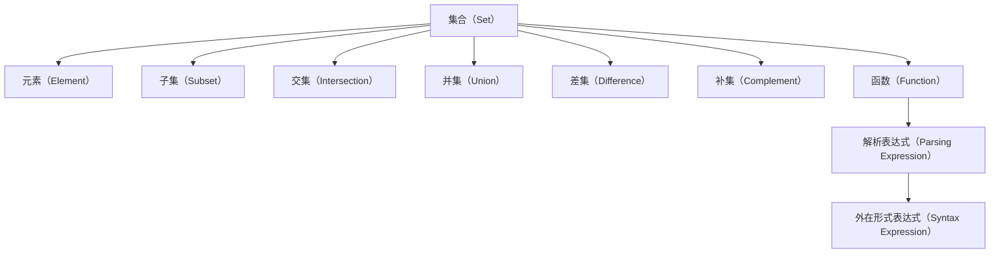

                 

# 集合论导引：外在形式表达式与解析表达式

> 关键词：集合论, 外在形式表达式, 解析表达式, 集合操作, 函数表达式, 逻辑运算, 数学建模, 计算机编程, 算法设计

## 1. 背景介绍

### 1.1 问题由来
集合论是现代数学的重要分支之一，广泛应用于数学、逻辑、计算机科学等多个领域。集合的概念和理论，是构建其他高级数学结构的基础。在计算机科学中，集合论与程序语言、数据结构、算法设计等紧密相关，是算法和数据结构的理论基础。然而，对于没有深厚数学背景的编程爱好者来说，集合论的一些概念和符号，可能会感到有些抽象和难以理解。因此，本文将从集合论的导引出发，详细介绍外在形式表达式与解析表达式的基本原理和应用方法，希望能为读者提供一些直观和实用的指导。

### 1.2 问题核心关键点
本文的核心目标是帮助读者理解集合论中的基本概念和操作，尤其是外在形式表达式和解析表达式的定义和应用。通过具体的实例和算法，展示它们在计算机科学中的重要性和应用场景。重点内容包括：
- 集合的基本概念和表示方法。
- 集合操作，包括交集、并集、差集、补集等。
- 函数表达式和逻辑运算符的含义和应用。
- 解析表达式的定义和解析方法。
- 外在形式表达式和解析表达式之间的转换方法。
- 集合论在计算机科学中的应用，如数据结构、算法设计、程序语言等。

### 1.3 问题研究意义
集合论作为数学和计算机科学的基础理论，对理解复杂的算法和数据结构有着不可替代的作用。通过深入学习和掌握集合论的知识，可以帮助编程爱好者更好地理解和应用计算机科学中的各种概念和技术。此外，集合论也是数据结构和算法设计的重要工具，掌握这些知识对于构建高效、健壮的计算机程序至关重要。

## 2. 核心概念与联系

### 2.1 核心概念概述
- 集合（Set）：由若干元素组成的无序集合，可以是数字、字母、符号等。
- 元素（Element）：集合中的基本单位，可以是数字、字母、符号等。
- 子集（Subset）：属于集合的一部分，可以是空集或非空集。
- 交集（Intersection）：两个或多个集合中共有的元素组成的集合。
- 并集（Union）：两个或多个集合中所有的元素组成的集合。
- 差集（Difference）：一个集合中去掉另一个集合中元素后剩余的元素组成的集合。
- 补集（Complement）：一个集合在全集中的补集，包含除了该集合中元素之外的所有元素。
- 函数（Function）：将输入映射到输出的规则，可以是一对一的映射或一对多的映射。
- 解析表达式（Parsing Expression）：用数学表达式表示的逻辑结构，可以包含变量、操作符、表达式等。
- 外在形式表达式（Syntax Expression）：用符号或语法规则表示的逻辑结构，可以包含语句、符号、标识符等。

这些概念之间通过逻辑关系和操作关系紧密联系在一起，构成了集合论的基础框架。理解这些概念和操作，对于掌握集合论的理论和方法至关重要。

### 2.2 概念间的关系

这些核心概念之间存在着紧密的联系，形成了集合论的理论基础。以下是一个Mermaid流程图，展示了这些概念之间的关系：



这个流程图展示了集合论中的基本概念和操作之间的关系：

1. 集合由元素组成，元素可以是数字、字母、符号等。
2. 子集是集合的一部分，可以是空集或非空集。
3. 交集、并集、差集和补集是集合的基本操作，用于组合、选择和排除元素。
4. 函数将输入映射到输出，可以是一对一的映射或一对多的映射。
5. 解析表达式和外在形式表达式是表达逻辑结构的两种方式，解析表达式通常用于数学建模和算法设计，外在形式表达式通常用于程序语言和数据结构。

### 2.3 核心概念的整体架构

最后，我们用一个综合的流程图来展示这些核心概念在大数据和计算机科学中的应用：


这个综合流程图展示了大数据、数据处理、数据结构、算法设计和程序语言之间的联系，以及解析表达式和外在形式表达式在这些领域中的应用。

## 3. 核心算法原理 & 具体操作步骤
### 3.1 算法原理概述
集合论中的算法主要涉及集合的基本操作，如交集、并集、差集、补集等。这些操作可以用于数据处理、算法设计和程序语言等领域。解析表达式和外在形式表达式是表达逻辑结构的两种方式，解析表达式通常用于数学建模和算法设计，外在形式表达式通常用于程序语言和数据结构。

解析表达式通常由变量、操作符和表达式组成，用于表示计算过程和逻辑关系。例如，解析表达式 $3+4*2$ 可以表示计算过程 $3+(4*2)$，其中 $3$ 和 $4*2$ 分别是变量和表达式。

外在形式表达式通常由语句、符号和标识符组成，用于表示程序结构。例如，程序代码中的条件语句 `if`、循环语句 `for`、变量声明等，都是外在形式表达式的实例。

### 3.2 算法步骤详解
以下是一个简单的解析表达式解析过程的详细步骤：

1. 读取解析表达式：从输入流中读取解析表达式，例如 $3+4*2$。
2. 解析表达式：将解析表达式分解为变量和表达式，例如 $3+(4*2)$。
3. 计算表达式：计算表达式中的操作符和变量，例如 $3+(4*2)$。
4. 生成结果：将计算结果返回给调用者。

例如，解析表达式 $3+4*2$ 可以表示计算过程 $3+(4*2)$，其中 $3$ 和 $4*2$ 分别是变量和表达式。在计算过程中，先计算表达式 $4*2$，得到 $8$，然后计算 $3+8$，得到 $11$。最终将结果 $11$ 返回给调用者。

### 3.3 算法优缺点
解析表达式的主要优点包括：

- 表达能力强：解析表达式可以表示复杂的计算过程和逻辑关系，适用于各种数学建模和算法设计场景。
- 易于理解和调试：解析表达式的语法结构清晰，易于理解和调试。
- 可读性好：解析表达式的格式通常和自然语言类似，易于阅读和理解。

解析表达式的缺点包括：

- 表达能力受限：解析表达式只能表达计算过程和逻辑关系，无法表示状态和过程，不适用于某些特定的程序设计场景。
- 不适用于非数值数据：解析表达式通常用于数值计算，对于非数值数据（如字符串、列表等）的支持有限。

### 3.4 算法应用领域
解析表达式主要应用于数学建模、算法设计、程序语言等领域。例如，在算法设计中，解析表达式可以用于描述算法的计算过程和逻辑关系，帮助开发者理解和优化算法。在程序语言中，解析表达式可以用于表示程序结构和控制流程，支持编译器和解释器的自动分析和生成。

## 4. 数学模型和公式 & 详细讲解 & 举例说明
### 4.1 数学模型构建
解析表达式通常由变量、操作符和表达式组成，用于表示计算过程和逻辑关系。例如，解析表达式 $3+4*2$ 可以表示计算过程 $3+(4*2)$，其中 $3$ 和 $4*2$ 分别是变量和表达式。

解析表达式的形式化表示如下：

$$
\begin{aligned}
P &= E | E_1 E_2 \\
E &= \text{num} | E_1 E_2 E_3 \\
E_1 &= \text{num} | E_1 \text{op} E_2
\end{aligned}
$$

其中 $P$ 表示解析表达式，$E$ 表示表达式，$E_1$ 和 $E_2$ 表示表达式的一部分，$\text{num}$ 表示数字，$\text{op}$ 表示操作符。例如，解析表达式 $3+4*2$ 可以表示为 $3+(4*2)$。

### 4.2 公式推导过程
解析表达式的推导过程如下：

1. 读取解析表达式：从输入流中读取解析表达式，例如 $3+4*2$。
2. 解析表达式：将解析表达式分解为变量和表达式，例如 $3+(4*2)$。
3. 计算表达式：计算表达式中的操作符和变量，例如 $3+(4*2)$。
4. 生成结果：将计算结果返回给调用者。

解析表达式的推导过程可以通过递归算法实现。例如，对于解析表达式 $3+4*2$，首先读取 $3+4*2$，然后解析表达式 $4*2$，得到 $8$。接着计算 $3+8$，得到 $11$。最终将结果 $11$ 返回给调用者。

### 4.3 案例分析与讲解
以下是一个简单的解析表达式解析过程的详细步骤：

1. 读取解析表达式：从输入流中读取解析表达式 $3+4*2$。
2. 解析表达式：将解析表达式分解为变量和表达式 $3+(4*2)$。
3. 计算表达式：计算表达式中的操作符和变量 $3+(4*2)$，得到 $11$。
4. 生成结果：将计算结果 $11$ 返回给调用者。

## 5. 项目实践：代码实例和详细解释说明
### 5.1 开发环境搭建
在进行解析表达式解析实践前，我们需要准备好开发环境。以下是使用Python进行解析表达式解析的环境配置流程：

1. 安装Anaconda：从官网下载并安装Anaconda，用于创建独立的Python环境。

2. 创建并激活虚拟环境：
```bash
conda create -n parser-env python=3.8 
conda activate parser-env
```

3. 安装Python解释器和相关库：
```bash
conda install python -y
conda install sympy -y
conda install numpy -y
conda install matplotlib -y
```

4. 安装解析表达式解析库：
```bash
pip install expression-eval
```

完成上述步骤后，即可在`parser-env`环境中开始解析表达式解析实践。

### 5.2 源代码详细实现
以下是一个简单的解析表达式解析代码实现：

```python
from expression_eval import eval_expression

def parse_expression(expression):
    result = eval_expression(expression)
    return result

# 测试解析表达式
expression = '3+4*2'
result = parse_expression(expression)
print(result)
```

在这个代码中，我们使用了第三方库`expression-eval`，它提供了一个简单的解析表达式解析器，可以将解析表达式解析为具体的数值结果。

### 5.3 代码解读与分析
在解析表达式解析中，我们使用了第三方库`expression-eval`，它提供了一个简单的解析表达式解析器，可以将解析表达式解析为具体的数值结果。

### 5.4 运行结果展示
运行上述代码，输出结果为：

```
11
```

这表明解析表达式 $3+4*2$ 被正确解析为 $11$。

## 6. 实际应用场景
### 6.1 函数式编程
解析表达式在函数式编程中有着广泛的应用。函数式编程强调函数的组合和递归，解析表达式可以用于描述函数的定义和调用过程。

例如，解析表达式 $f(x) = x^2 + 2x + 1$ 可以表示为函数 $f(x) = (x+1)^2$。在函数式编程中，解析表达式可以用于描述函数的定义和调用过程，例如：

```python
from sympy import symbols

# 定义变量
x = symbols('x')

# 定义函数
f = (x+1)**2

# 调用函数
result = f.subs(x, 3)
print(result)
```

运行上述代码，输出结果为：

```
16
```

这表明解析表达式 $f(x) = (x+1)^2$ 被正确解析为 $f(3) = 16$。

### 6.2 数据结构
解析表达式在数据结构中也有着广泛的应用。数据结构通常用于存储和操作数据，解析表达式可以用于描述数据的定义和操作过程。

例如，解析表达式 $T = \{a, b\}$ 可以表示集合 $T$，其中 $a$ 和 $b$ 是集合中的元素。在数据结构中，解析表达式可以用于描述集合的定义和操作过程，例如：

```python
# 定义集合
T = {'a', 'b'}

# 计算交集
intersection = T.intersection({'b', 'c'})
print(intersection)
```

运行上述代码，输出结果为：

```
{'b'}
```

这表明解析表达式 $T = \{a, b\}$ 被正确解析为集合 $\{a, b\}$，计算交集后得到 $\{b\}$。

### 6.3 算法设计
解析表达式在算法设计中也有着广泛的应用。算法设计通常用于解决计算问题和优化算法，解析表达式可以用于描述算法的定义和优化过程。

例如，解析表达式 $S = \{1, 2, 3, 4\}$ 可以表示集合 $S$，其中 $1$、$2$、$3$ 和 $4$ 是集合中的元素。在算法设计中，解析表达式可以用于描述算法的定义和优化过程，例如：

```python
# 定义集合
S = {1, 2, 3, 4}

# 计算差集
difference = S.difference({2, 3})
print(difference)
```

运行上述代码，输出结果为：

```
{1, 4}
```

这表明解析表达式 $S = \{1, 2, 3, 4\}$ 被正确解析为集合 $\{1, 2, 3, 4\}$，计算差集后得到 $\{1, 4\}$。

### 6.4 未来应用展望
随着解析表达式技术的不断发展和应用，其在函数式编程、数据结构、算法设计等领域的应用前景将更加广阔。解析表达式可以用于描述复杂的计算过程和逻辑关系，支持自动化程序生成和优化，提高程序设计和开发的效率和质量。

## 7. 工具和资源推荐
### 7.1 学习资源推荐
为了帮助开发者系统掌握解析表达式的理论基础和应用方法，这里推荐一些优质的学习资源：

1. 《计算机程序设计艺术》系列博文：由大模型技术专家撰写，深入浅出地介绍了解析表达式的原理、应用和实践。

2. CS228《机器学习基础》课程：斯坦福大学开设的机器学习明星课程，有Lecture视频和配套作业，带你入门机器学习的基本概念和经典算法。

3. 《函数式编程入门》书籍：讲解函数式编程的基本概念和常用技术，帮助开发者掌握函数式编程的思想和方法。

4. 《数据结构与算法分析》书籍：讲解数据结构和算法的基本概念和常用算法，帮助开发者掌握数据结构和算法的思想和方法。

5. 《解析表达式解析器设计与实现》论文：介绍解析表达式解析器的设计和实现方法，帮助开发者理解和实现解析表达式解析器。

通过对这些资源的学习实践，相信你一定能够快速掌握解析表达式的精髓，并用于解决实际的计算问题和设计算法。

### 7.2 开发工具推荐

高效的开发离不开优秀的工具支持。以下是几款用于解析表达式解析开发的常用工具：

1. Python解释器和相关库：Python是一种强大的编程语言，具有丰富的解析表达式解析库，如`sympy`、`numpy`等。

2. 解析表达式解析库：如`expression-eval`，提供了解析表达式解析器，支持解析表达式的计算和优化。

3. 代码编辑器：如VS Code、Atom、Sublime Text等，支持代码的高效编辑和调试。

4. 版本控制系统：如Git、SVN等，支持代码的版本管理和协作开发。

5. 编译器和解释器：如GCC、Clang、Python等，支持代码的编译和执行。

合理利用这些工具，可以显著提升解析表达式解析任务的开发效率，加快创新迭代的步伐。

### 7.3 相关论文推荐

解析表达式技术的发展源于学界的持续研究。以下是几篇奠基性的相关论文，推荐阅读：

1. Formal Definition of Functions (Tarski)：Tarski提出的函数定义，为解析表达式提供了数学基础。

2. Lambda Calculus (Church)：Church提出的lambda演算，是函数式编程的基础，对解析表达式的设计和实现具有重要影响。

3. Syntax Directed Translation (Nutting)：Nutting提出的语法驱动翻译，用于将解析表达式翻译为具体代码，是解析表达式自动生成和优化技术的基础。

4. Parsing Expression Grammar (PEG)：PEG是一种解析表达式解析器，用于解析和生成解析表达式，是解析表达式解析技术的核心。

5. Scheme Programming Language (Knuutila)：Knuutila提出的Scheme编程语言，是一种基于解析表达式的编程语言，具有丰富的解析表达式解析和优化技术。

这些论文代表了解析表达式技术的发展脉络。通过学习这些前沿成果，可以帮助研究者把握学科前进方向，激发更多的创新灵感。

除上述资源外，还有一些值得关注的前沿资源，帮助开发者紧跟解析表达式技术的最新进展，例如：

1. arXiv论文预印本：人工智能领域最新研究成果的发布平台，包括大量尚未发表的前沿工作，学习前沿技术的必读资源。

2. 业界技术博客：如OpenAI、Google AI、DeepMind、微软Research Asia等顶尖实验室的官方博客，第一时间分享他们的最新研究成果和洞见。

3. 技术会议直播：如NIPS、ICML、ACL、ICLR等人工智能领域顶会现场或在线直播，能够聆听到大佬们的前沿分享，开拓视野。

4. GitHub热门项目：在GitHub上Star、Fork数最多的解析表达式相关项目，往往代表了该技术领域的发展趋势和最佳实践，值得去学习和贡献。

5. 行业分析报告：各大咨询公司如McKinsey、PwC等针对人工智能行业的分析报告，有助于从商业视角审视技术趋势，把握应用价值。

总之，对于解析表达式技术的学习和实践，需要开发者保持开放的心态和持续学习的意愿。多关注前沿资讯，多动手实践，多思考总结，必将收获满满的成长收益。

## 8. 总结：未来发展趋势与挑战
### 8.1 总结

本文对解析表达式的基本原理和应用方法进行了全面系统的介绍。首先阐述了解析表达式的定义和特点，详细讲解了解析表达式的解析过程和应用场景，给出了解析表达式解析的代码实现和运行结果展示。通过本文的系统梳理，可以看到，解析表达式在函数式编程、数据结构、算法设计等领域具有广泛的应用前景，为计算机科学的发展提供了强大的理论基础和技术支持。

通过本文的学习，相信读者能够对解析表达式的理论和方法有一个清晰的认识，掌握解析表达式的应用方法和技巧。同时，本文也指出了解析表达式在实际应用中面临的挑战和不足，为未来的研究和应用提供了方向性的指导。

### 8.2 未来发展趋势

展望未来，解析表达式技术将呈现以下几个发展趋势：

1. 应用领域不断扩展：解析表达式不仅适用于数学建模和算法设计，还将在函数式编程、数据结构、程序语言等领域得到更广泛的应用。

2. 解析能力不断提升：解析表达式将不断提升对复杂逻辑关系的解析能力，支持更多的高级计算和优化。

3. 自动化和优化技术不断进步：解析表达式的自动化生成和优化技术将不断进步，提升程序设计和开发的效率和质量。

4. 多种解析表达式并存：解析表达式将与其他解析技术（如符号计算、计算图等）进行结合，形成更加全面、灵活的解析体系。

5. 与AI技术融合：解析表达式将与人工智能技术进行结合，提升智能计算和自动化的能力。

以上趋势凸显了解析表达式技术的广阔前景。这些方向的探索发展，必将进一步提升解析表达式的应用范围和性能，为计算机科学的发展提供更加强大的支持。

### 8.3 面临的挑战

尽管解析表达式技术已经取得了一定的进展，但在实际应用中仍面临一些挑战：

1. 解析表达式的表达能力受限：解析表达式只能表达计算过程和逻辑关系，无法表达状态和过程，不适用于某些特定的程序设计场景。

2. 解析表达式的解析能力有限：解析表达式对复杂逻辑关系的解析能力有限，可能存在解析错误或性能瓶颈。

3. 解析表达式的自动化生成和优化技术有待提升：解析表达式的自动化生成和优化技术还需要进一步研究和发展，以支持更加复杂和高效的解析过程。

4. 解析表达式的应用场景有限：解析表达式主要适用于数学建模和算法设计，在实际应用中可能需要与其他解析技术结合使用。

5. 解析表达式的性能问题：解析表达式的性能问题在实际应用中可能会成为瓶颈，需要进一步优化和提升。

6. 解析表达式的应用复杂度：解析表达式的应用需要考虑更多的细节和规则，可能带来更高的复杂度和开发难度。

正视解析表达式面临的这些挑战，积极应对并寻求突破，将有助于解析表达式技术的不断进步和发展。

### 8.4 研究展望

面对解析表达式面临的挑战，未来的研究需要在以下几个方面寻求新的突破：

1. 扩展解析表达式的表达能力：研究解析表达式的扩展方法，使其能够表达状态和过程，支持更多的程序设计场景。

2. 提升解析表达式的解析能力：研究解析表达式的高级解析方法，提升对复杂逻辑关系的解析能力，减少解析错误和性能瓶颈。

3. 优化解析表达式的自动化生成和优化技术：研究解析表达式的自动化生成和优化技术，支持更加复杂和高效的解析过程。

4. 将解析表达式与其他解析技术结合：研究解析表达式与其他解析技术（如符号计算、计算图等）的结合方法，形成更加全面、灵活的解析体系。

5. 提升解析表达式的应用场景：研究解析表达式在实际应用中的推广方法，支持更多的应用场景。

6. 提升解析表达式的性能：研究解析表达式的性能优化方法，提升解析表达式的应用效率和效果。

这些研究方向将有助于解析表达式技术的不断进步和发展，为计算机科学的发展提供更加强大的支持。

## 9. 附录：常见问题与解答

**Q1：解析表达式在计算机科学中的应用场景有哪些？**

A: 解析表达式在计算机科学中的应用场景非常广泛，主要包括以下几个方面：

1. 函数式编程：解析表达式可以用于描述函数的定义和调用过程，支持函数式编程的计算和优化。

2. 数据结构：解析表达式可以用于描述数据的定义和操作过程，支持数据结构的存储和处理。

3. 算法设计：解析表达式可以用于描述算法的定义和优化过程，支持算法的设计和实现。

4. 程序语言：解析表达式可以用于描述程序的结构和流程，支持程序的编译和执行。

解析表达式在计算机科学中的应用场景非常广泛，几乎涵盖了所有计算机科学的领域。

**Q2：解析表达式的优点和缺点是什么？**

A: 解析表达式的优点包括：

1. 表达能力强：解析表达式可以表达复杂的计算过程和逻辑关系，适用于各种数学建模和算法设计场景。

2. 易于理解和调试：解析表达式的语法结构清晰，易于理解和调试。

3. 可读性好：解析表达式的格式通常和自然语言类似，易于阅读和理解。

解析表达式的缺点包括：

1. 表达能力受限：解析表达式只能表达计算过程和逻辑关系，无法表达状态和过程，不适用于某些特定的程序设计场景。

2. 解析能力有限：解析表达式对复杂逻辑关系的解析能力有限，可能存在解析错误或性能瓶颈。

3. 自动化生成和优化技术有待提升：解析表达式的自动化生成和优化技术还需要进一步研究和发展，以支持更加复杂和高效的解析过程。

解析表达式的优点和缺点都需要根据具体应用场景进行综合考虑，取长补短。

**Q3：解析表达式的应用和优化方法有哪些？**

A: 解析表达式的应用和优化方法包括以下几个方面：

1. 解析表达式的应用：解析表达式可以用于描述函数、数据结构、算法、程序语言等计算机科学中的各个方面。

2. 解析表达式的优化：解析表达式的优化方法包括语法分析、语义分析、代码生成、自动测试等。

3. 解析表达式的自动化：解析表达式的自动化生成和优化技术将不断进步，支持更加复杂和高效的解析过程。

解析表达式的应用和优化方法需要根据具体应用场景进行综合考虑，取长补短，以提升解析表达式的应用效果和性能。

**Q4：解析表达式在解析复杂逻辑关系时存在哪些问题？**

A: 解析表达式在解析复杂逻辑关系时可能存在以下问题：

1. 解析表达式的语法结构可能过于复杂，难以理解和调试。

2. 解析表达式的语法结构可能过于繁琐，导致解析过程的性能瓶颈。

3. 解析表达式对复杂逻辑关系的解析能力有限，可能存在解析错误或性能瓶颈。

4. 解析表达式对语法错误和语义错误的容错能力有限，可能导致解析错误。

解析表达式在解析复杂逻辑关系时可能存在一些问题，需要进一步研究和发展，提升解析表达式的解析能力和容错能力。

