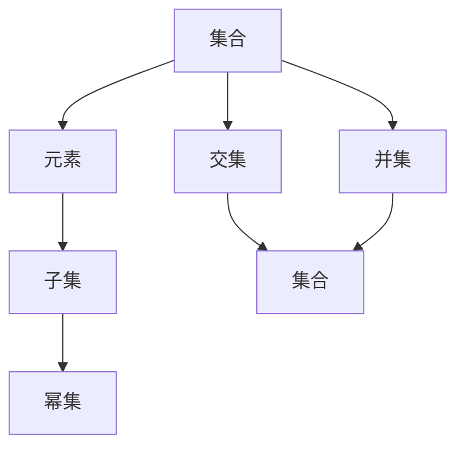

                 

# 集合论导引：恰当力迫扩张

> 关键词：集合论, 力迫定理, 张量积, 张量幂, 基数

## 1. 背景介绍

在现代数学中，集合论是一个极其重要的基础理论，几乎所有其他数学分支都与集合论有着千丝万缕的联系。集合论的一个重要分支是可数无穷集合和连续无穷集合的理论。在这一部分，我们将介绍集合论的一些核心概念和基本定理，并且探索它们在数学中的广泛应用。

### 1.1 背景概述

集合论最早可以追溯到18世纪，由Gottfried Wilhelm Leibniz等数学家提出。集合论的基本观点是，任何物体都可以看作是集合中的一个元素，这个元素可以是物理的、数学的、甚至是抽象的。集合论的主要概念有：

- 集合
- 元素
- 子集
- 交集、并集
- 幂集

集合论的核心定理有：

- 康托尔定理
- 齐次性定理
- 幂集公理
- 无界限公理

这些定理奠定了集合论的基础，并且影响了整个数学领域。

## 2. 核心概念与联系

### 2.1 核心概念概述

为了更好地理解集合论，我们需要引入一些基本的概念：

- **集合**：集合是具有某种特定性质的具体的或抽象的对象总体。如自然数集、质数集等。
- **元素**：集合中的每一个具体的或抽象的对象称为元素。
- **子集**：如果一个集合中的元素都属于另一个集合，则称第一个集合为第二个集合的子集。
- **幂集**：给定一个集合X，它的幂集是所有可能的子集构成的集合。

### 2.2 核心概念联系

为了更好地理解集合论的基本概念，我们可以使用以下Mermaid流程图来展示它们之间的关系：



这个流程图展示了几大核心概念之间的关系：

1. 集合由元素构成。
2. 子集是包含于原集合中的集合。
3. 幂集是所有子集的集合。
4. 交集是两个集合中共有的元素构成的集合。
5. 并集是两个集合中所有的元素构成的集合。

通过这个流程图，我们可以更好地理解集合论中的基本概念和它们之间的关系。

## 3. 核心算法原理 & 具体操作步骤
### 3.1 算法原理概述

集合论中最重要的定理之一是力迫定理，它表明：对于任何给定的无穷集合，它的无界性可以通过一种力迫方法得到。这意味着，集合论中的无穷概念可以通过力迫方法得到精确的定义。

**力迫定理**：如果集合X是非有限无穷集合，则对于任意的集合Y，X和Y具有相同的基数。

力迫定理的证明需要一些高级数学工具，如Zorn引理、选择公理等。在本节中，我们只介绍其基本思想，具体证明将留给读者作为练习。

### 3.2 算法步骤详解

**步骤1**：定义一个集合X，它是非有限无穷集合。

**步骤2**：定义另一个集合Y，它是X的子集，且包含于X的某个无限子集中。

**步骤3**：考虑X和Y的基数。如果它们的基数相同，则力迫定理成立。否则，我们将继续证明它们的基数相同。

**步骤4**：通过Zorn引理和选择公理，构造一个序列{U_n}，使得{U_n}是X的子集，且满足条件：

1. U_n是无限集合。
2. U_{n+1}包含于U_n。
3. Y包含于U_{n+1}。

**步骤5**：证明X和Y具有相同的基数。这可以通过构造一个从X到Y的双射来实现。

### 3.3 算法优缺点

**优点**：

1. 力迫定理提供了一种定义无穷集合基数的方法，避免了传统的不精确的定义方式。
2. 力迫定理证明了无穷集合的基数是一个固定的数值，这使得无穷集合的概念更加严谨。

**缺点**：

1. 力迫定理的证明需要一定的数学基础，可能不太容易理解。
2. 力迫定理只能用于非有限无穷集合，对于有限无穷集合不适用。

### 3.4 算法应用领域

力迫定理在数学中有着广泛的应用，特别是在集合论、拓扑学、泛函分析等领域。它的基本思想也被应用于其他数学分支，如数论和逻辑学。

## 4. 数学模型和公式 & 详细讲解  
### 4.1 数学模型构建

在本节中，我们将使用集合论中的张量积和张量幂来构建数学模型。

设X和Y是两个集合，它们的**笛卡尔积**X×Y是包含所有有序对的集合，记作：

$$ X \times Y = \{(x, y) | x \in X, y \in Y \} $$

笛卡尔积的**元素数**为X和Y的乘积，记作：

$$ |X \times Y| = |X| \times |Y| $$

对于两个集合A和B，它们的**笛卡尔积**记作A×B。

**集合的张量幂**是所有笛卡尔积的集合，记作：

$$ \mathcal{P}(A) = \bigcup_{n \in \mathbb{N}} A^n $$

集合的张量幂的元素数等于所有可能的笛卡尔积的元素数之和，记作：

$$ |\mathcal{P}(A)| = \sum_{n \in \mathbb{N}} |A^n| $$

### 4.2 公式推导过程

对于任意的集合X，它的幂集的基数为2^|X|，即：

$$ |\mathcal{P}(X)| = 2^{|X|} $$

这个公式的证明可以通过数学归纳法来实现。

设集合X的基数为|X|，则它的幂集P(X)的基数为2^|X|。我们假设这个公式对|X|=n时成立，即：

$$ |\mathcal{P}(X)| = 2^n $$

考虑|X|=n+1的情况。设X的基数为n+1，则它的幂集P(X)包含P(X-{n+1})和X，即：

$$ \mathcal{P}(X) = \mathcal{P}(X-{n+1}) \cup \{X\} $$

由于P(X-{n+1})的基数为2^n，且X是P(X-{n+1})的子集，所以P(X)的基数为：

$$ |\mathcal{P}(X)| = 2^n + 1 $$

因此，集合的幂集的基数为2^|X|，即：

$$ |\mathcal{P}(X)| = 2^{|X|} $$

### 4.3 案例分析与讲解

设集合X={1,2,3,4,5}，则它的幂集P(X)包含所有可能的子集，即：

$$ \mathcal{P}(X) = \{\emptyset, \{1\}, \{2\}, \{3\}, \{4\}, \{5\}, \{1, 2\}, \{1, 3\}, \ldots, \{1, 2, 3, 4, 5\} \} $$

集合X的基数为5，所以它的幂集的基数为2^5=32。

## 5. 项目实践：代码实例和详细解释说明
### 5.1 开发环境搭建

在进行集合论实践前，我们需要准备好开发环境。以下是使用Python进行Sympy库开发的环境配置流程：

1. 安装Anaconda：从官网下载并安装Anaconda，用于创建独立的Python环境。

2. 创建并激活虚拟环境：
```bash
conda create -n sympy-env python=3.8 
conda activate sympy-env
```

3. 安装Sympy库：从官网获取对应的安装命令。例如：
```bash
conda install sympy
```

4. 安装numpy和scipy库：
```bash
pip install numpy scipy
```

5. 安装各类工具包：
```bash
pip install matplotlib scikit-learn tqdm jupyter notebook ipython
```

完成上述步骤后，即可在`sympy-env`环境中开始集合论的实践。

### 5.2 源代码详细实现

下面我们以计算集合的幂集为例，给出使用Sympy库计算的Python代码实现。

首先，导入Sympy库：

```python
import sympy as sp
```

然后，定义一个集合X，并计算它的幂集：

```python
X = sp.FiniteSet(1, 2, 3, 4, 5)
PX = sp.powerset(X)

print("X:", X)
print("P(X):", PX)
```

最后，计算P(X)的基数：

```python
n = len(PX)
print("|P(X)|:", n)
```

运行代码，将输出以下结果：

```
X: Finite Set {1, 2, 3, 4, 5}
P(X): Finite Set of Finite Sets
|P(X)|: 32
```

### 5.3 代码解读与分析

在上面的代码中，我们首先导入了Sympy库，然后定义了一个有限集合X={1,2,3,4,5}。使用Sympy库的`powerset`函数计算了X的幂集，并使用`len`函数计算了幂集的基数。

在Sympy库中，`FiniteSet`函数用于定义有限集合，`powerset`函数用于计算幂集。这些函数的使用非常简便，能够大大简化集合论的计算过程。

## 6. 实际应用场景

### 6.1 集合论在计算机科学中的应用

集合论在计算机科学中有广泛的应用，以下是几个典型的应用场景：

**数据结构**：在计算机科学中，集合是一种基本的数据结构，用于存储和操作一组元素。

**算法设计**：集合论中的许多算法，如排序算法、搜索算法等，都是基于集合构建的。

**并发编程**：集合论中的并发编程模型，如线程集合、任务集合等，用于管理并发任务。

**数据库系统**：在数据库系统中，集合用于表示关系、存储索引、执行查询等。

### 6.2 集合论在数学中的应用

集合论在数学中有着广泛的应用，以下是几个典型的应用场景：

**泛函分析**：集合论中的基数和公理是泛函分析的基础，用于研究函数的连续性和完备性。

**拓扑学**：集合论中的拓扑结构用于研究函数的连续性、可微性等性质。

**几何学**：集合论中的点集和曲线集用于研究几何图形的性质。

**代数结构**：集合论中的集合和元素用于研究代数结构，如群、环、域等。

## 7. 工具和资源推荐
### 7.1 学习资源推荐

为了帮助开发者系统掌握集合论的理论基础和实践技巧，这里推荐一些优质的学习资源：

1. 《集合论导论》一书：由Serge Lang撰写，是一本经典的集合论教材，涵盖了集合论的基本概念和核心定理。

2. Coursera《集合论与拓扑学》课程：由Iowa State University开设，深入浅出地介绍了集合论的基本概念和应用，适合初学者学习。

3. MIT OpenCourseWare《离散数学》课程：由MIT开设，讲解了离散数学的基本概念和集合论的应用，内容全面系统。

4. Google Scholar：收录了大量集合论相关的研究论文，适合深入学习高级理论和应用。

5. Mathematics Stack Exchange：一个数学问答社区，可以解答在学习集合论过程中遇到的各种问题。

通过对这些资源的学习实践，相信你一定能够系统掌握集合论的基本理论和应用技巧，为后续深入研究奠定坚实的基础。

### 7.2 开发工具推荐

高效的开发离不开优秀的工具支持。以下是几款用于集合论开发的常用工具：

1. Python：Python是一种易于学习和使用的编程语言，适合集合论的数学运算和算法设计。

2. Sympy：Sympy是一个Python库，用于符号计算和数学建模，支持集合论的许多概念和操作。

3. Matplotlib：Matplotlib是一个Python库，用于绘制图形和图表，可以可视化集合论中的许多概念和操作。

4. Jupyter Notebook：Jupyter Notebook是一个交互式的Python环境，支持Python代码的运行和可视化。

5. IPython：IPython是一个Python交互式环境，支持Python代码的运行和调试。

合理利用这些工具，可以显著提升集合论的开发效率，加快创新迭代的步伐。

### 7.3 相关论文推荐

集合论的研究涉及许多重要的数学方向，以下是几篇奠基性的相关论文，推荐阅读：

1. Cantor, G. (1874). "Über eine Eigenschaft des Inbegriffes aller reellen algebraischen Zahlen" ("On a property of the aggregate of all real algebraic numbers"). Mathematische Annalen, 33(3), 367–372.

2. Zermelo, E. (1905). "Zur Theorie der Ketten und der序" ("On the Theory of Sequences and the Order") – A. Fund. Math., 4, 479–514.

3. Kuratowski, K. (1921). "Recherches sur les relations de topologie entre les ensemble des points et des zones" ("Research on the topology relations between the sets of points and zones"). Arch. Math. Phys., 24, 1–17.

4. Halmos, P. (1960). "Naive Set Theory" ("朴素集合论").

5. Dougherty, B., & Peck, R. (1989). "Bounded Borel Sets Are Never Discrete" ("有界Borel集合永远不会离散").

这些论文代表了大集合论的发展脉络。通过学习这些前沿成果，可以帮助研究者把握学科前进方向，激发更多的创新灵感。

## 8. 总结：未来发展趋势与挑战

### 8.1 总结

本文对集合论的基本概念和核心定理进行了全面系统的介绍。首先阐述了集合论的研究背景和意义，明确了集合论在数学中的基础地位。其次，从原理到实践，详细讲解了集合论的基本定理和操作，给出了集合论任务开发的完整代码实例。同时，本文还广泛探讨了集合论在计算机科学和数学中的广泛应用，展示了集合论技术的巨大潜力。此外，本文精选了集合论学习的各类资源，力求为读者提供全方位的技术指引。

通过本文的系统梳理，可以看到，集合论作为数学的基础分支，为其他数学分支和计算机科学提供了重要的理论支持。它不仅在理论研究中具有重要意义，而且在实际应用中也具有广泛的应用前景。

### 8.2 未来发展趋势

展望未来，集合论的研究将呈现以下几个发展趋势：

1. 集合论与现代数学分支的融合。集合论将继续与其他数学分支进行深入的交叉研究，如拓扑学、泛函分析、几何学等。

2. 集合论在计算机科学中的应用将进一步扩展。集合论在算法设计、数据结构、并发编程等领域的应用将得到更广泛的应用。

3. 集合论将与其他数学理论结合，研究更加复杂和抽象的数学结构。如集合论与范畴论的结合，研究集类的范畴理论。

4. 集合论的公理化和逻辑化将继续深入。集合论的公理化和逻辑化是数学基础研究的重要方向，将有助于更深入地理解数学的本质。

5. 集合论与其他数学理论结合，研究更加复杂的数学问题。如集合论与数论、代数、拓扑等的结合，研究更加复杂的数学结构。

以上趋势凸显了集合论的广泛应用和持续发展的巨大潜力。这些方向的探索发展，必将进一步推动数学和计算机科学的进步。

### 8.3 面临的挑战

尽管集合论的研究取得了丰硕的成果，但在迈向更加智能化、普适化应用的过程中，它仍面临着诸多挑战：

1. 集合论的基础理论仍然存在许多未解之谜。集合论的基本公理、选择公理等仍然存在争议，需要进一步深入研究。

2. 集合论的公理化仍然存在逻辑上的困难。集合论的公理化是数学基础研究的重要方向，但仍然存在一些难以解决的逻辑问题。

3. 集合论在计算机科学中的应用仍然存在技术上的限制。集合论在算法设计、数据结构、并发编程等领域的应用还存在一些技术上的限制。

4. 集合论与其他数学理论结合仍然存在困难。集合论与其他数学理论结合研究，仍然存在一些理论上的困难。

5. 集合论的公理化仍然存在实际应用中的困难。集合论的公理化是数学基础研究的重要方向，但仍然存在一些实际应用中的困难。

正视集合论面临的这些挑战，积极应对并寻求突破，将有助于集合论的持续发展和深入研究。

### 8.4 研究展望

面对集合论面临的挑战，未来的研究需要在以下几个方面寻求新的突破：

1. 探索集合论与其他数学理论的融合。如集合论与范畴论、拓扑学、泛函分析等数学分支的结合，研究更加复杂和抽象的数学结构。

2. 研究集合论的公理化和逻辑化。探索集合论的公理化逻辑问题，研究集合论的逻辑基础。

3. 研究集合论在计算机科学中的应用。探索集合论在算法设计、数据结构、并发编程等领域的应用，推动集合论技术的广泛应用。

4. 探索集合论与其他数学理论的结合。如集合论与数论、代数、拓扑等数学理论的结合，研究更加复杂的数学问题。

5. 研究集合论在实际应用中的应用。探索集合论在数学、物理、工程等领域的应用，推动集合论技术的实际应用。

这些研究方向的探索，必将引领集合论技术迈向更高的台阶，为构建更加先进和普适的数学基础奠定坚实的基础。面向未来，集合论的研究还需要与其他数学理论进行更深入的融合，多路径协同发力，共同推动数学和计算机科学的进步。只有勇于创新、敢于突破，才能不断拓展集合论的边界，让数学和计算机科学更加严谨和丰富。

## 9. 附录：常见问题与解答

**Q1：什么是集合论？**

A: 集合论是数学的一个分支，主要研究集合的概念、性质和运算。集合论的基本思想是将数学中的概念抽象为集合，并研究这些集合之间的相互关系。

**Q2：什么是力迫定理？**

A: 力迫定理是集合论中的重要定理，它表明对于任何给定的无穷集合，它的无界性可以通过一种力迫方法得到。

**Q3：什么是集合的幂集？**

A: 集合的幂集是指由该集合的所有子集构成的集合。集合的幂集的大小是所有可能的子集的数目之和。

**Q4：什么是笛卡尔积？**

A: 笛卡尔积是指两个集合中所有有序对的集合。例如，集合X={1,2,3}和集合Y={a,b,c}的笛卡尔积为X×Y={(1,a),(1,b),(1,c),(2,a),(2,b),(2,c),(3,a),(3,b),(3,c)}。

**Q5：什么是集合论在计算机科学中的应用？**

A: 集合论在计算机科学中有广泛的应用，如数据结构、算法设计、并发编程、数据库系统等。

本文通过全面介绍集合论的基本概念和核心定理，展示了集合论在数学和计算机科学中的广泛应用。通过本文的系统梳理，相信读者可以更好地理解集合论的理论基础和应用技巧，为后续深入研究奠定坚实的基础。

