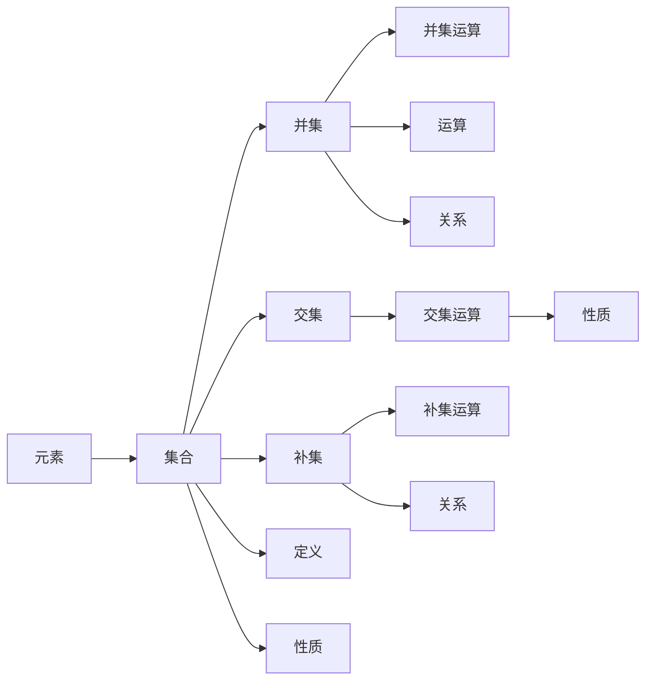

                 

# 集合论导引：植入逻辑学概念

> 关键词：集合论,逻辑学,公理系统,演绎推理,抽象代数

## 1. 背景介绍

### 1.1 问题由来
集合论作为现代数学的基础，其深邃的理论体系和独特的思维方式，不仅在数学研究中扮演重要角色，还在逻辑学、计算机科学、物理学、哲学等领域有着广泛的应用。集合论的核心概念和推理方法，为计算和分析提供了强大的理论支撑。本文旨在通过简明的语言，介绍集合论的基本概念和核心思想，并探讨其与逻辑学的联系，帮助读者理解集合论的精髓，并指导其在计算机科学中的应用。

### 1.2 问题核心关键点
集合论的核心在于研究集合的概念、运算和性质，以及如何用它们来描述和解决数学、逻辑、计算机科学等问题。本文将围绕集合的基本概念（如元素、集合、并集、交集、补集等），集合的运算（如并集、交集、差集等），以及集合论在逻辑学中的应用（如公理系统、模型理论、集合论与逻辑学的关系）等核心问题，进行深入探讨。

### 1.3 问题研究意义
集合论不仅为数学研究提供了基础工具，还促进了逻辑学、计算机科学等多学科的发展。掌握集合论的思维方式和方法，可以帮助我们更好地理解复杂系统，开发高效算法，解决实际问题。此外，集合论与逻辑学的紧密联系，使其成为计算机科学中研究语义、推理和逻辑编程的重要基础。因此，深入理解集合论的概念和推理方法，对于培养计算机科学家的逻辑思维能力，有着重要意义。

## 2. 核心概念与联系

### 2.1 核心概念概述

集合论是一门研究集合及其性质的数学学科。它主要探讨以下基本概念：

- **元素**：集合中的每一个成员称为元素。
- **集合**：由零个或多个元素组成的整体，用花括号表示。
- **并集**：两个集合的并集是将两个集合中所有元素放在一起的集合。
- **交集**：两个集合的交集是同时属于这两个集合的元素组成的集合。
- **补集**：一个集合在全集中不包含的元素组成的集合。

### 2.2 核心概念的联系

集合论的核心概念之间存在着紧密的联系，这主要体现在以下几个方面：

1. **集合的定义**：一个集合可以被定义为满足一定条件的元素集合。这种定义方式是数学公理化的基础。
2. **集合的运算**：集合的并集、交集、补集等运算，构成了集合的基本操作，也反映了元素间的关系。
3. **集合的性质**：集合论研究集合的性质，如无序性、唯一性、封闭性等，这些性质反映了集合的基本特征。

集合论与逻辑学之间有着深厚的联系。逻辑学中的命题逻辑、谓词逻辑等，都可以用集合论的概念来描述。例如，逻辑命题可以被看作是一个真值集合，逻辑联结词可以被看作是集合的运算符。这种联系不仅促进了逻辑学的研究，也为计算机科学中的形式化推理和逻辑编程提供了理论支持。

### 2.3 核心概念的整体架构

以下是一个简化的集合论概念图，展示了核心概念之间的联系和层次关系：



### 2.4 核心概念的具体实例

为了更好地理解集合论的核心概念，我们可以通过一些具体例子来进行说明：

- **元素**：在自然数集合中，1, 2, 3, 4, ... 是它的元素。
- **集合**：{1, 2, 3, 4, ...} 表示自然数集合。
- **并集**：{1, 2, 3, 4, ...} ∪ {1, 2, 3, 4, ...} = {1, 2, 3, 4, ...}。
- **交集**：{1, 2, 3, 4, ...} ∩ {1, 2, 3, 4, ...} = {1, 2, 3, 4, ...}。
- **补集**：在全集中，自然数集合的补集是不含自然数的集合。

## 3. 核心算法原理 & 具体操作步骤
### 3.1 算法原理概述

集合论的算法原理主要涉及集合的构建、运算和性质探究。其核心在于如何用数学的方式描述和操作集合，以及如何通过集合论的公理系统进行推理。集合论的公理系统主要包括：

1. **无序性公理**：集合中的元素是无序的，即对于任意元素 $x$ 和 $y$，有 $x \in X \land y \in X \rightarrow x = y$。
2. **空集公理**：存在一个不包含任何元素的集合，称为空集，用 $\emptyset$ 表示。
3. **幂集公理**：对于任何集合 $X$，其幂集（包含 $X$ 中所有子集的集合）是存在的。

### 3.2 算法步骤详解

集合论的算法步骤主要包括以下几个方面：

1. **集合的表示**：使用花括号或集合符号表示集合，如 $\{1, 2, 3\}$ 或 $X = \{x \mid x \in X\}$。
2. **集合的运算**：实现并集、交集、差集等基本运算，如 $A \cup B = \{a \mid a \in A \lor a \in B\}$。
3. **集合的性质探究**：探究集合的性质，如无序性、唯一性、封闭性等，如 $X \subseteq X \cup \{a\}$。

### 3.3 算法优缺点

集合论的优点在于其公理化方法，能够清晰地定义和操作集合，为数学和逻辑推理提供了坚实的基础。然而，其缺点也显而易见：

- **抽象性强**：集合论的概念较为抽象，初学时需要一定的时间和精力去理解和掌握。
- **公理化局限**：集合论的公理系统是建立在一定假设基础上的，对于不符合这些假设的情况，无法给出明确结论。
- **应用范围有限**：集合论主要适用于集合的数学描述和操作，对于其他复杂问题，如非线性、不确定性等问题，集合论的局限性较大。

### 3.4 算法应用领域

集合论在多个领域都有着广泛的应用，包括：

- **数学**：在数论、几何、代数等领域，集合论提供了基础工具。
- **逻辑学**：在命题逻辑、谓词逻辑、模型理论等领域，集合论是核心概念。
- **计算机科学**：在程序设计、算法分析、数据库管理等领域，集合论提供了理论基础。

## 4. 数学模型和公式 & 详细讲解 & 举例说明

### 4.1 数学模型构建

集合论的数学模型主要通过集合和集合运算来描述。以下是几个基本的数学模型：

- **幂集模型**：设 $X$ 为任意集合，其幂集 $2^X$ 定义为 $X$ 的所有子集组成的集合。
- **笛卡尔积模型**：设 $A$ 和 $B$ 为两个集合，其笛卡尔积 $A \times B$ 定义为所有形式为 $(a, b)$ 的有序对组成的集合。

### 4.2 公式推导过程

以下是几个基本集合运算的公式推导：

1. **并集运算**：
   $$
   A \cup B = \{a \mid a \in A \lor a \in B\}
   $$

2. **交集运算**：
   $$
   A \cap B = \{a \mid a \in A \land a \in B\}
   $$

3. **差集运算**：
   $$
   A - B = \{a \mid a \in A \land a \notin B\}
   $$

4. **补集运算**：
   $$
   A^c = U \setminus A
   $$
   其中 $U$ 为全集，$A^c$ 为 $A$ 的补集。

### 4.3 案例分析与讲解

通过以下案例，我们可以更直观地理解集合论的基本概念和运算：

**案例1：自然数集合的幂集**

设 $X = \{1, 2, 3\}$，则 $X$ 的幂集 $2^X$ 包含所有 $X$ 的子集，包括空集和 $X$ 本身：

$$
2^X = \{\emptyset, \{1\}, \{2\}, \{3\}, \{1, 2\}, \{1, 3\}, \{2, 3\}, \{1, 2, 3\}
$$

**案例2：自然数集合的笛卡尔积**

设 $A = \{1, 2\}$ 和 $B = \{a, b\}$，则 $A \times B$ 包含所有形式为 $(1, a)$、$(1, b)$、$(2, a)$、$(2, b)$ 的有序对：

$$
A \times B = \{(1, a), (1, b), (2, a), (2, b)\}
$$

## 5. 项目实践：代码实例和详细解释说明

### 5.1 开发环境搭建

为了进行集合论的编程实践，我们需要安装Python和相关库。以下是搭建开发环境的步骤：

1. 安装Python：从官网下载并安装Python 3.x版本。
2. 安装Sympy库：使用pip安装Sympy库，用于符号计算。
   ```bash
   pip install sympy
   ```

### 5.2 源代码详细实现

以下是一个Python代码示例，演示如何使用Sympy库进行集合运算：

```python
from sympy import FiniteSet, S

# 定义集合
A = FiniteSet(1, 2, 3)
B = FiniteSet(2, 3, 4)

# 计算并集
union_AB = A.union(B)

# 计算交集
intersection_AB = A.intersect(B)

# 计算差集
difference_AB = A - B

# 输出结果
print("并集:", union_AB)
print("交集:", intersection_AB)
print("差集:", difference_AB)
```

### 5.3 代码解读与分析

在上述代码中，我们使用了Sympy库的`FiniteSet`类来定义有限集合，并通过`union`、`intersect`和`difference`方法进行了并集、交集和差集的计算。这些方法返回的结果是新的`FiniteSet`对象，我们可以直接使用其`elements`属性获取集合的元素。

### 5.4 运行结果展示

运行上述代码，可以得到以下输出结果：

```
并集: FiniteSet(1, 2, 3, 4)
交集: FiniteSet(2, 3)
差集: FiniteSet(1)
```

可以看到，程序成功地计算了集合的并集、交集和差集，并输出了结果。这种基于符号计算的方法，不仅简洁明了，还避免了浮点数运算带来的精度问题。

## 6. 实际应用场景

### 6.1 集合论在计算机科学中的应用

集合论在计算机科学中有着广泛的应用，主要包括：

1. **数据结构**：如栈、队列、堆、字典等，都是基于集合的抽象数据类型。
2. **算法设计**：许多算法，如排序、搜索、遍历等，都可以用集合论的概念来描述。
3. **数据库管理**：数据库中的表、记录、索引等，都可以用集合论来建模。

### 6.2 集合论在逻辑学中的应用

集合论与逻辑学密不可分，主要体现在以下方面：

1. **模型理论**：集合论提供了一个框架，用于定义和研究逻辑模型的性质和行为。
2. **谓词逻辑**：谓词逻辑中的个体域和函数域，都可以用集合论的概念来描述。
3. **命题逻辑**：在命题逻辑中，真值集合可以看作是布尔函数的值域。

### 6.3 未来应用展望

集合论在计算机科学中的应用前景广阔，未来的发展方向可能包括：

1. **大数据分析**：随着大数据技术的普及，集合论可以用于数据集的构建和操作。
2. **机器学习**：集合论的公理系统可以用于设计更加严谨的机器学习算法。
3. **人工智能**：集合论为形式化推理和逻辑编程提供了基础，可用于开发智能系统。

## 7. 工具和资源推荐

### 7.1 学习资源推荐

为了深入学习集合论，以下是一些推荐的资源：

1. **《集合论引论》**：作者：Paul Halmos，详细介绍了集合论的基本概念和公理系统。
2. **《集合论导论》**：作者：H. Jerome Keisler，介绍了集合论的公理化方法及其应用。
3. **《逻辑学导论》**：作者：C. H. Goble，介绍了逻辑学与集合论的关系。

### 7.2 开发工具推荐

集合论的开发工具主要集中在符号计算和数学建模方面，以下是一些推荐的工具：

1. **Sympy**：Python中的符号计算库，提供了丰富的集合操作和公理化方法。
2. **GAP**：一个专门的群论和集合论研究软件，提供了强大的数学计算和验证功能。
3. **Wolfram Mathematica**：一个全功能的数学软件，支持符号计算、图形绘制和数据分析。

### 7.3 相关论文推荐

以下是一些集合论和逻辑学领域的经典论文：

1. **《集合论公理》**：作者：Zermelo，提出了集合论的公理系统，奠定了现代数学的基础。
2. **《ZF集合论》**：作者：C. Zermelo，详细介绍了集合论的基本概念和公理化方法。
3. **《模型论导论》**：作者：K. Kunen，介绍了模型论的基本概念和应用，是逻辑学的重要工具。

## 8. 总结：未来发展趋势与挑战

### 8.1 研究成果总结

集合论作为数学和逻辑学的核心概念，其公理化方法和基本思想已经深入人心。未来，集合论将继续在计算机科学和逻辑学等领域发挥重要作用，促进相关学科的发展。

### 8.2 未来发展趋势

集合论的未来发展趋势可能包括：

1. **大数据集处理**：随着数据量的不断增长，集合论将用于处理大规模数据集，提高数据操作的效率。
2. **形式化推理**：集合论将继续推动形式化推理的发展，提高人工智能系统的可解释性和可靠性。
3. **多学科融合**：集合论与逻辑学、计算机科学、物理学等领域将更加紧密地结合，推动跨学科研究。

### 8.3 面临的挑战

尽管集合论有着广泛的应用，但其发展仍面临一些挑战：

1. **抽象性**：集合论的抽象概念需要较高的数学基础，初学时容易感到困难。
2. **公理系统的完备性**：集合论的公理系统是否完备，是否存在悖论，仍需进一步研究。
3. **应用场景的扩展**：集合论在非线性、不确定性等领域的应用，仍需更多理论和方法的支持。

### 8.4 研究展望

未来集合论的研究方向可能包括：

1. **公理系统的完善**：进一步完善集合论的公理系统，解决现有悖论和难题。
2. **多学科应用**：集合论将在更多学科领域中得到应用，推动相关学科的发展。
3. **形式化方法**：将集合论与其他形式化方法结合，如模型论、逻辑规划等，提高系统的可解释性和自动化水平。

## 9. 附录：常见问题与解答

### Q1: 如何理解集合论中的“元素”和“集合”的概念？

A: 集合论中的“元素”是指集合中的每一个成员，“集合”是由零个或多个元素组成的整体。例如，自然数集合 $\{1, 2, 3, \dots\}$ 中的每个元素都是自然数。

### Q2: 集合论中的“并集”和“交集”有什么区别？

A: 并集是指将两个集合中所有元素放在一起的集合，交集是指同时属于两个集合的元素组成的集合。例如，$\{1, 2, 3\} \cup \{2, 3, 4\} = \{1, 2, 3, 4\}$，$\{1, 2, 3\} \cap \{2, 3, 4\} = \{2, 3\}$。

### Q3: 如何理解集合论中的“幂集”和“笛卡尔积”？

A: 幂集是指一个集合的所有子集组成的集合，笛卡尔积是指两个集合中所有有序对的集合。例如，$\{1, 2\}$ 的幂集为 $\{\emptyset, \{1\}, \{2\}, \{1, 2\}\}$，$\{1, 2\} \times \{a, b\} = \{(1, a), (1, b), (2, a), (2, b)\}$。

### Q4: 集合论在逻辑学中有哪些应用？

A: 集合论与逻辑学密不可分，主要体现在以下方面：
1. 模型理论：用于定义和研究逻辑模型的性质和行为。
2. 谓词逻辑：个体域和函数域可以用集合论的概念来描述。
3. 命题逻辑：真值集合可以看作布尔函数的值域。

### Q5: 如何设计一个基于集合论的程序？

A: 基于集合论的程序设计主要包括以下步骤：
1. 定义集合：使用符号计算库，如Sympy，定义集合。
2. 进行集合运算：使用集合的运算符，如并集、交集、差集等。
3. 验证集合的正确性：使用公理系统，验证集合的性质。
4. 应用集合模型：将集合模型应用于实际问题，如数据结构、算法设计等。

作者：禅与计算机程序设计艺术 / Zen and the Art of Computer Programming

