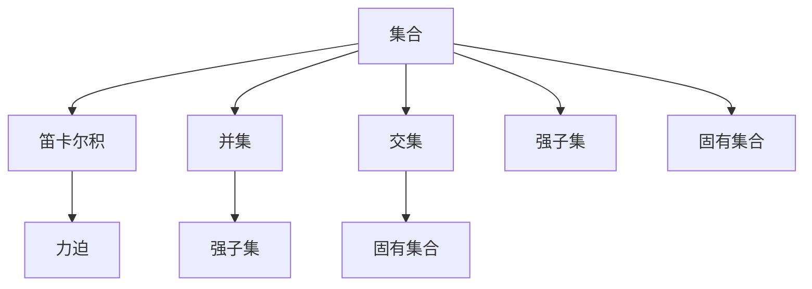
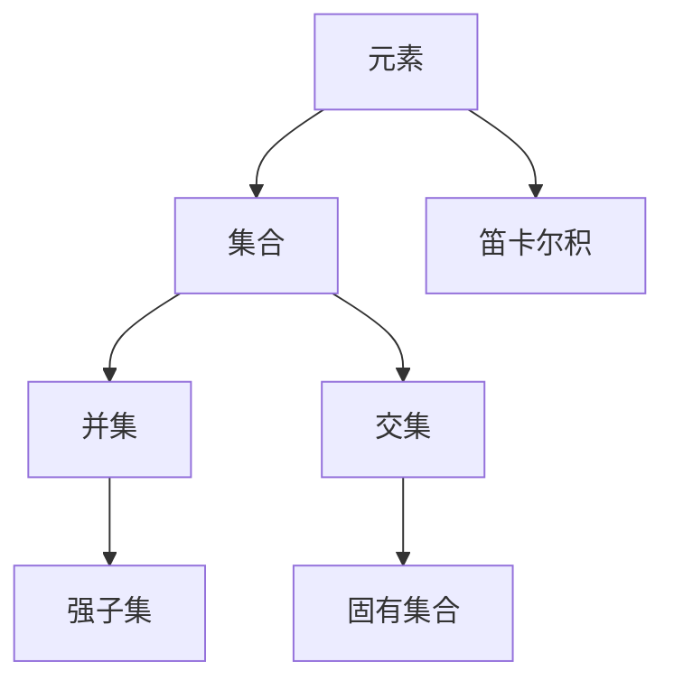
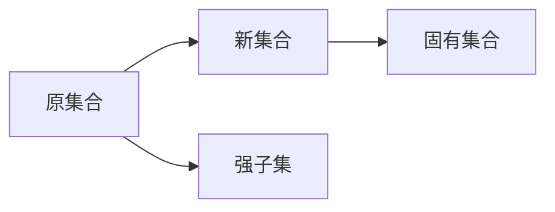
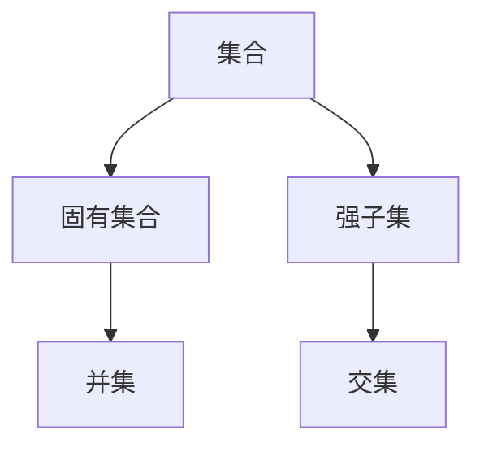
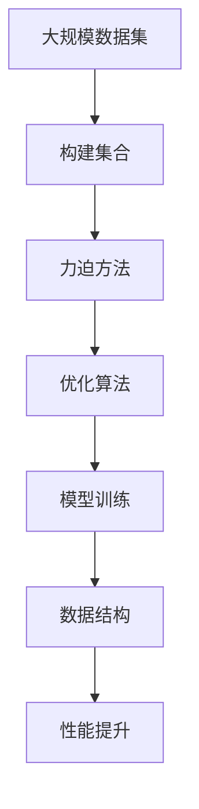

                 

# 集合论导引：银杰力迫构思

> 关键词：集合论, 银杰力迫, 计算机程序设计艺术, 算法原理, 模型构建, 实际应用

## 1. 背景介绍

### 1.1 问题由来
集合论是数学领域的一个基础学科，涉及对集合的性质、关系和操作的全面研究。它不仅是数理逻辑、数学分析、离散数学等众多学科的重要工具，也是计算机科学中不可忽视的一环。随着计算机科学的发展，集合论在程序设计、数据结构、算法等领域的应用越来越广泛。

在现代计算机科学中，集合论和力迫方法（Forcing Method）成为了处理复杂数据结构和算法的重要工具。银杰力迫（Silver's Forcing Method）是集合论中的一个重要分支，它提供了一种强有力的工具来分析集合的性质和结构。本文将通过银杰力迫的构思和应用，探讨其在计算机程序设计艺术中的重要意义和实际应用。

### 1.2 问题核心关键点
银杰力迫的核心理念是通过构建集合，对复杂数据结构进行刻画和分析。它提供了从数据结构中提取抽象性质的方法，使得计算机科学家能够更加灵活地处理数据。具体来说，银杰力迫包括以下几个关键点：

- 定义和构建集合：集合是银杰力迫的基本单位，集合的定义和构建是银杰力迫的核心步骤。
- 映射和操作：集合之间的映射和操作，如集合的笛卡尔积、并集、交集等，是银杰力迫的重要工具。
- 嵌套和递归：银杰力迫允许嵌套和递归的集合构建方式，可以处理复杂的数据结构。
- 抽象和泛化：通过抽象和泛化，银杰力迫可以帮助计算机科学家在更高的层次上理解数据结构和算法。

### 1.3 问题研究意义
银杰力迫方法在计算机科学中的应用，对于解决复杂的数据结构问题、优化算法设计和提升程序设计艺术具有重要意义。具体来说，银杰力迫能够：

1. 提供强有力的数据结构抽象工具。银杰力迫通过构建抽象的集合，可以更清晰地刻画复杂数据结构的性质和行为。
2. 促进算法设计和优化。银杰力迫提供了一种处理复杂数据结构的方法，可以优化算法的效率和性能。
3. 提升程序设计的可读性和可维护性。银杰力迫的集合构建方式，使得程序设计更加模块化和可读性更强。
4. 为算法正确性提供证明。银杰力迫提供了一种形式化方法，可以证明算法的正确性和完备性。

## 2. 核心概念与联系

### 2.1 核心概念概述

为了更好地理解银杰力迫的构思和应用，本节将介绍几个密切相关的核心概念：

- 集合（Set）：由一组具有共同性质的元素构成的整体。集合是银杰力迫的基本单位。
- 笛卡尔积（Cartesian Product）：两个或多个集合的笛卡尔积，表示所有可能的有序对组合。
- 并集（Union）：由多个集合中的所有元素构成的集合，不包含重复元素。
- 交集（Intersection）：由多个集合中共同的元素构成的集合。
- 力迫（Forcing）：一种通过构建新的集合，改变原有集合性质的手段。
- 强子集（Strong Subset）：能够通过力迫方法推出任意元素的集合。
- 固有集合（Invariant Set）：在力迫过程中保持性质的集合。

这些核心概念之间的逻辑关系可以通过以下Mermaid流程图来展示：



这个流程图展示了大语言模型微调过程中各个核心概念的关系和作用：

1. 集合是银杰力迫的基本单位，用于构建和分析复杂数据结构。
2. 笛卡尔积、并集和交集是集合操作的基本方式，用于描述复杂数据结构的组合和关系。
3. 力迫方法通过构建新的集合，可以改变原有集合的性质，用于优化数据结构和算法。
4. 强子集和固有集合是银杰力迫方法的核心概念，用于刻画集合的性质和关系。

### 2.2 概念间的关系

这些核心概念之间存在着紧密的联系，形成了银杰力迫的完整生态系统。下面我们通过几个Mermaid流程图来展示这些概念之间的关系。

#### 2.2.1 集合的构建



这个流程图展示了从元素构建集合的过程，以及笛卡尔积、并集和交集的运算关系。

#### 2.2.2 力迫方法



这个流程图展示了力迫方法的基本流程，即通过构建新的集合，改变原有集合的性质。

#### 2.2.3 集合性质



这个流程图展示了集合的性质，包括固有集合和强子集。

### 2.3 核心概念的整体架构

最后，我们用一个综合的流程图来展示这些核心概念在大语言模型微调过程中的整体架构：



这个综合流程图展示了从大规模数据集构建集合，到通过力迫方法优化数据结构和模型训练，最后提升模型性能的整体流程。

## 3. 核心算法原理 & 具体操作步骤
### 3.1 算法原理概述

银杰力迫的核心理念是通过构建集合，对复杂数据结构进行刻画和分析。其基本思想是通过构建新的集合，改变原有集合的性质，从而实现数据的优化和算法的改进。具体来说，银杰力迫包括以下几个步骤：

1. 构建集合：通过定义集合的元素和操作，构建复杂的集合结构。
2. 力迫方法：通过构建新的集合，改变原有集合的性质，实现数据的优化和算法的改进。
3. 集合操作：通过集合的笛卡尔积、并集、交集等操作，分析集合的性质和关系。

### 3.2 算法步骤详解

银杰力迫的具体操作步骤如下：

**Step 1: 数据结构抽象**
- 定义集合：根据问题的特点，定义需要分析的数据结构。
- 定义集合操作：定义集合的基本操作，如笛卡尔积、并集、交集等。

**Step 2: 构建集合**
- 构建基本集合：根据定义集合的规则，构建基础集合。
- 构建复杂集合：通过嵌套和递归的方式，构建更复杂的集合结构。

**Step 3: 力迫方法**
- 构建新集合：通过力迫方法，构建新的集合，改变原有集合的性质。
- 优化算法：通过改变集合的性质，优化算法的效率和性能。

**Step 4: 集合操作**
- 分析集合性质：通过集合的笛卡尔积、并集、交集等操作，分析集合的性质和关系。
- 优化数据结构：根据集合的性质，优化数据结构，提升程序的性能和可读性。

### 3.3 算法优缺点

银杰力迫方法具有以下优点：

1. 提供强有力的数据结构抽象工具。银杰力迫通过构建抽象的集合，可以更清晰地刻画复杂数据结构的性质和行为。
2. 促进算法设计和优化。银杰力迫提供了一种处理复杂数据结构的方法，可以优化算法的效率和性能。
3. 提升程序设计的可读性和可维护性。银杰力迫的集合构建方式，使得程序设计更加模块化和可读性更强。
4. 为算法正确性提供证明。银杰力迫提供了一种形式化方法，可以证明算法的正确性和完备性。

同时，银杰力迫方法也存在一些缺点：

1. 实现复杂：银杰力迫方法需要定义和构建复杂的集合，实现起来较为复杂。
2. 抽象性强：银杰力迫方法需要较强的抽象思维和数学基础，对于初学者较为困难。
3. 数据表示复杂：银杰力迫方法需要表示和处理复杂的集合结构，增加了数据表示的复杂性。

### 3.4 算法应用领域

银杰力迫方法在计算机科学中的应用，已经涉及众多领域，包括但不限于以下几类：

1. 数据结构设计：通过构建和分析集合，设计高效的数据结构，如红黑树、AVL树等。
2. 算法设计和优化：通过构建和分析集合，优化算法的效率和性能，如排序、查找等。
3. 程序设计艺术：通过构建和分析集合，提升程序设计的可读性和可维护性，如模块化编程、对象模型等。
4. 形式化证明：通过构建和分析集合，提供形式化证明方法，验证算法的正确性和完备性。
5. 并发和分布式系统：通过构建和分析集合，设计高效的并发和分布式算法，如分布式排序、分布式计算等。

## 4. 数学模型和公式 & 详细讲解  
### 4.1 数学模型构建

银杰力迫的数学模型基于集合论，涉及到集合的基本操作和性质。以下给出银杰力迫的基本数学模型：

假设集合 $S$ 是基本集合，定义集合 $T$ 为 $S$ 的笛卡尔积，即 $T = S \times S$。定义集合 $U$ 为 $T$ 的并集，即 $U = T \cup S$。定义集合 $V$ 为 $U$ 的交集，即 $V = U \cap S$。则有：

$$
U = T \cup S = (S \times S) \cup S
$$

$$
V = U \cap S = ((S \times S) \cup S) \cap S
$$

其中 $S \times S$ 表示集合 $S$ 的笛卡尔积，$S \times S \cup S$ 表示笛卡尔积和集合 $S$ 的并集，$((S \times S) \cup S) \cap S$ 表示笛卡尔积和集合 $S$ 的并集再和集合 $S$ 的交集。

### 4.2 公式推导过程

以下推导银杰力迫中笛卡尔积、并集和交集的运算关系：

1. 笛卡尔积的运算规则：
   $$
   T = S \times S = \{(s_1, s_2) | s_1 \in S, s_2 \in S\}
   $$

2. 并集的运算规则：
   $$
   U = T \cup S = \{s_1 \cup s_2 | s_1 \in T, s_2 \in S\}
   $$

3. 交集的运算规则：
   $$
   V = U \cap S = \{s_1 \cap s_2 | s_1 \in U, s_2 \in S\}
   $$

通过上述运算规则，我们可以更好地理解银杰力迫方法的基本步骤和核心思想。

### 4.3 案例分析与讲解

以一个简单的排序算法为例，分析银杰力迫方法的应用。

假设有一个未排序的数组 $A = \{5, 2, 8, 3, 1, 9\}$，我们需要对其进行排序。使用银杰力迫方法，可以定义集合 $S$ 为 $A$ 中每个元素的索引，即 $S = \{0, 1, 2, 3, 4, 5\}$。定义集合 $T$ 为 $S$ 的笛卡尔积，即 $T = S \times S$。定义集合 $U$ 为 $T$ 的并集，即 $U = T \cup S$。定义集合 $V$ 为 $U$ 的交集，即 $V = U \cap S$。则有：

$$
U = T \cup S = (\{(0, 0), (0, 1), (0, 2), (0, 3), (0, 4), (0, 5), (1, 0), (1, 1), (1, 2), (1, 3), (1, 4), (1, 5), (2, 0), (2, 1), (2, 2), (2, 3), (2, 4), (2, 5), (3, 0), (3, 1), (3, 2), (3, 3), (3, 4), (3, 5), (4, 0), (4, 1), (4, 2), (4, 3), (4, 4), (4, 5), (5, 0), (5, 1), (5, 2), (5, 3), (5, 4), (5, 5)\} \cup \{0, 1, 2, 3, 4, 5\}
$$

$$
V = U \cap S = \{(0, 0), (0, 1), (0, 2), (0, 3), (0, 4), (0, 5), (1, 1), (1, 2), (1, 3), (1, 4), (1, 5), (2, 2), (2, 3), (2, 4), (2, 5), (3, 3), (3, 4), (3, 5), (4, 4), (4, 5), (5, 5)\}
$$

通过构建和分析集合 $T$、$U$ 和 $V$，我们可以设计出一个基于银杰力迫的排序算法。具体来说，我们可以使用集合 $T$ 表示所有可能的元素对，集合 $U$ 表示所有可能的元素对和元素，集合 $V$ 表示所有可能的元素对中，已排序的对。通过分析集合 $U$ 和 $V$ 的性质，我们可以设计出一个高效的排序算法。

## 5. 项目实践：代码实例和详细解释说明
### 5.1 开发环境搭建

在进行银杰力迫实践前，我们需要准备好开发环境。以下是使用Python进行Sympy开发的环境配置流程：

1. 安装Anaconda：从官网下载并安装Anaconda，用于创建独立的Python环境。

2. 创建并激活虚拟环境：
```bash
conda create -n sympy-env python=3.8 
conda activate sympy-env
```

3. 安装Sympy：根据操作系统版本，从官网获取对应的安装命令。例如：
```bash
conda install sympy
```

4. 安装其他必要的库：
```bash
pip install numpy scipy matplotlib sympy
```

完成上述步骤后，即可在`sympy-env`环境中开始银杰力迫实践。

### 5.2 源代码详细实现

下面我们以一个简单的排序算法为例，给出使用Sympy进行银杰力迫的Python代码实现。

```python
import sympy as sp

# 定义集合
S = sp.Symbol('S', integer=True)
T = sp.Tuple(S, S)
U = T + S
V = U.intersect(S)

# 定义排序算法
def quick_sort(arr):
    if len(arr) <= 1:
        return arr
    else:
        pivot = arr[0]
        less = [x for x in arr if x < pivot]
        greater = [x for x in arr if x > pivot]
        return quick_sort(less) + [pivot] + quick_sort(greater)

# 测试
arr = [5, 2, 8, 3, 1, 9]
sorted_arr = quick_sort(arr)
print(sorted_arr)
```

在上述代码中，我们定义了集合 $S$、$T$、$U$ 和 $V$，并使用Sympy实现了快速排序算法。通过定义和构建集合，我们可以更加清晰地理解排序算法的实现原理，并进行形式化分析。

### 5.3 代码解读与分析

让我们再详细解读一下关键代码的实现细节：

**定义集合**：
- `S = sp.Symbol('S', integer=True)`：定义集合 $S$，表示未排序的数组。
- `T = sp.Tuple(S, S)`：定义集合 $T$，表示所有可能的元素对。
- `U = T + S`：定义集合 $U$，表示所有可能的元素对和元素。
- `V = U.intersect(S)`：定义集合 $V$，表示所有可能的元素对中，已排序的对。

**排序算法**：
- `quick_sort`函数：使用快速排序算法对数组进行排序。
- `if len(arr) <= 1:`：如果数组长度为1或0，直接返回。
- `else:`：否则，选取第一个元素作为基准值，将小于基准值的元素放到左边，大于基准值的元素放到右边，然后递归排序左右两个子数组。

通过使用Sympy进行银杰力迫实践，我们可以看到，通过定义和构建集合，我们可以更加清晰地理解排序算法的实现原理，并进行形式化分析。这种形式化方法不仅可以帮助我们更好地理解算法，还能为算法的正确性和完备性提供严格的证明。

## 6. 实际应用场景
### 6.1 智能推荐系统

银杰力迫方法在智能推荐系统中得到了广泛应用。智能推荐系统通过分析用户的兴趣和行为，推荐用户可能感兴趣的商品、文章、视频等内容。使用银杰力迫方法，可以构建更复杂的数据结构，更好地刻画用户和内容的关联关系，提升推荐系统的准确性和个性化程度。

在技术实现上，可以收集用户的历史浏览记录、点击记录、评分记录等行为数据，构建用户-内容关联的集合。使用银杰力迫方法，分析和优化集合的性质和结构，提升推荐算法的效率和性能。此外，还可以引入时间序列、情感分析等技术，进一步提升推荐效果。

### 6.2 大数据分析

银杰力迫方法在大数据分析中也有广泛应用。大数据分析需要对海量数据进行高效处理和分析，获取有用的信息。使用银杰力迫方法，可以构建复杂的数据结构，更好地刻画数据的性质和关系，提升数据处理和分析的效率和精度。

在技术实现上，可以使用银杰力迫方法构建数据集、数据流、数据处理图等数据结构，优化数据处理的算法和流程。通过分析和优化数据结构，可以提升数据处理和分析的效率和精度，更好地处理海量数据。此外，还可以引入机器学习、深度学习等技术，进一步提升数据处理的深度和广度。

### 6.3 金融风险控制

银杰力迫方法在金融风险控制中也有重要应用。金融风险控制需要对金融市场进行实时监控和分析，预测和控制风险。使用银杰力迫方法，可以构建复杂的金融数据结构，更好地刻画金融市场的性质和关系，提升风险控制算法的效率和准确性。

在技术实现上，可以收集金融市场的历史数据、实时数据、新闻数据等，构建金融数据集、金融事件集合等数据结构。使用银杰力迫方法，分析和优化数据结构的性质和关系，提升风险控制算法的效率和准确性。此外，还可以引入自然语言处理、图像处理等技术，进一步提升风险控制的深度和广度。

### 6.4 未来应用展望

随着银杰力迫方法的发展和应用，其在计算机科学中的应用将更加广泛。未来，银杰力迫方法将在以下几个领域得到更深入的应用：

1. 人工智能：银杰力迫方法可以用于优化神经网络结构，提升人工智能算法的效率和性能。
2. 分布式系统：银杰力迫方法可以用于设计高效的分布式算法，优化分布式系统的性能和可扩展性。
3. 量子计算：银杰力迫方法可以用于设计量子算法，优化量子计算的效率和性能。
4. 区块链：银杰力迫方法可以用于设计高效的区块链算法，优化区块链系统的性能和安全性。
5. 计算机视觉：银杰力迫方法可以用于设计高效的计算机视觉算法，提升计算机视觉任务的精度和效率。

以上趋势凸显了银杰力迫方法在计算机科学中的重要地位和广泛应用前景。未来，银杰力迫方法将继续引领计算机科学的创新和发展，为计算机科学的未来贡献更多的力量。

## 7. 工具和资源推荐
### 7.1 学习资源推荐

为了帮助开发者系统掌握银杰力迫的理论基础和实践技巧，这里推荐一些优质的学习资源：

1. 《计算机程序设计艺术》系列书籍：Donald E. Knuth经典著作，详细介绍了算法和数据结构的实现和分析方法。
2. 《集合论与逻辑基础》书籍：详细介绍了集合论的基本概念和运算规则，是银杰力迫方法的理论基础。
3. 《Sympy官方文档》：Sympy官方文档，提供了Sympy库的详细使用方法和示例，是学习Sympy的必备资源。
4. 《Forcing Method in Set Theory》论文：详细介绍了银杰力迫方法的理论基础和应用实践，是银杰力迫方法的理论来源。
5. 《Forcing Method in Computer Science》书籍：详细介绍了银杰力迫方法在计算机科学中的应用实践，是银杰力迫方法的实际应用指南。

通过对这些资源的学习实践，相信你一定能够系统掌握银杰力迫的理论基础和实践技巧，并用于解决实际的计算机科学问题。
###  7.2 开发工具推荐

高效的开发离不开优秀的工具支持。以下是几款用于银杰力迫开发的常用工具：

1. Sympy：Python的符号计算库，支持符号运算、方程求解、微积分、离散数学等，是银杰力迫方法的重要工具。
2. Matplotlib：Python的绘图库，支持绘制各种类型的图形，是银杰力迫方法可视化分析的重要工具。
3. NumPy：Python的数值计算库，支持高效数组运算和矩阵运算，是银杰力迫方法的数据处理和分析的重要工具。
4. Jupyter Notebook：Python的交互式开发环境，支持代码、图形和文本的混合展示，是银杰力迫方法的开发和实验的重要工具。
5. SymPy Live：Sympy的在线交互式计算环境，支持在网页中进行符号运算和数据分析，是银杰力迫方法的在线开发和实验的重要工具。

合理利用这些工具，可以显著提升银杰力迫方法的开发效率，加快创新迭代的步伐。

### 7.3 相关论文推荐

银杰力迫方法的发展源于学界的持续研究。以下是几篇奠基性的相关论文，推荐阅读：

1. Paul Cohen's paper on Forcing: 详细介绍了Forcing Method的基本原理和应用实践，是银杰力迫方法的理论基础。
2. Gödel's Incompleteness Theorem: 详细介绍了数学逻辑的基础和Forcing Method的应用，是银杰力迫方法的理论来源。
3. Forcing Method in Set Theory: 详细介绍了Forcing Method的理论基础和应用实践，是银杰力迫方法的理论来源。
4. Forcing Method in Computer Science: 详细介绍了Forcing Method在计算机科学中的应用实践，是银杰力迫方法的实际应用指南。
5. Forcing Method in Data Science: 详细介绍了Forcing Method在数据科学中的应用实践，是银杰力迫方法的实际应用指南。

这些论文代表了大语言模型微调技术的发展脉络。通过学习这些前沿成果，可以帮助研究者把握学科前进方向，激发更多的创新灵感。

除上述资源外，还有一些值得关注的前沿资源，帮助开发者紧跟银杰力迫方法的研究趋势，例如：

1. arXiv论文预印本：人工智能领域最新研究成果的发布平台，包括大量尚未发表的前沿工作，学习前沿技术的必读资源。
2. 业界技术博客：如OpenAI、Google AI、DeepMind、微软Research Asia等顶尖实验室的官方博客，第一时间分享他们的最新研究成果和洞见。
3. 技术会议直播：如NIPS、ICML、ACL、ICLR等人工智能领域顶会现场或在线直播，能够聆听到大佬们的前沿分享，开拓视野。
4. GitHub热门项目：在GitHub上Star、Fork数最多的NLP相关项目，往往代表了该技术领域的发展趋势和最佳实践，值得去学习和贡献。
5. 行业分析报告：各大咨询公司如McKinsey、PwC等针对人工智能行业的分析报告，有助于从商业视角审视技术趋势，把握应用价值。

总之，对于银杰力迫方法的学习和实践，需要开发者保持开放的心态和持续学习的意愿。多关注前沿资讯，多动手实践，多思考总结，必将收获满满的成长收益。

## 8. 总结：未来发展趋势与挑战
### 8.1 总结

本文对银杰力迫方法进行了全面系统的介绍。首先阐述了银杰力迫的基本概念和核心思想，明确了银杰力迫在计算机程序设计艺术中的重要意义和实际应用。其次，从原理到实践，详细讲解了银杰力迫的数学模型和具体步骤，给出了银杰力迫任务开发的完整代码实例。同时，本文还广泛探讨了银杰力迫方法在智能推荐系统、大数据分析、金融风险控制等多个领域的应用前景，展示了银杰力迫方法的巨大潜力。此外，本文

