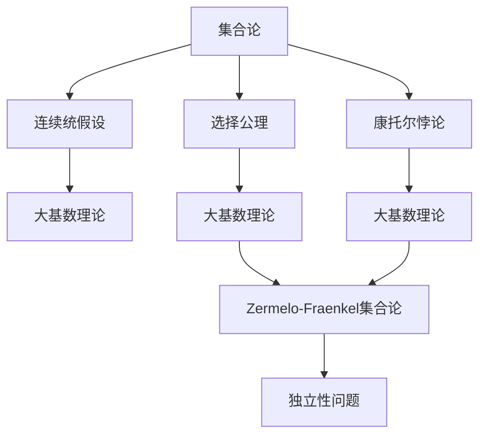
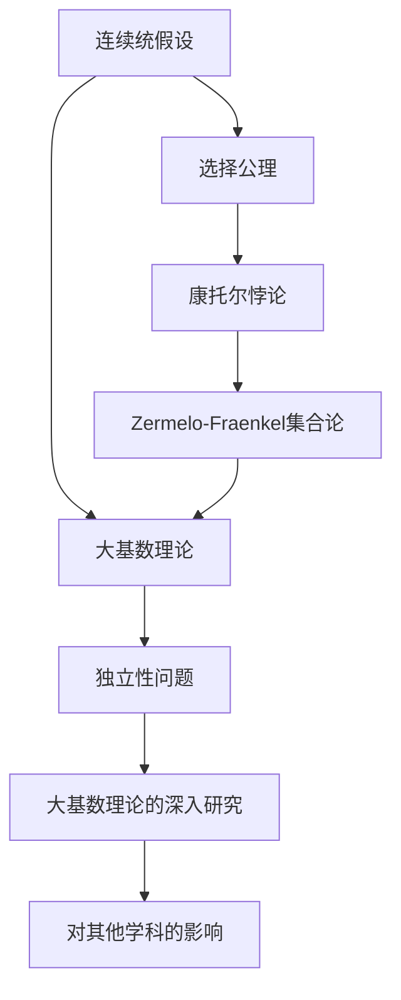

                 

# 集合论的独立性问题与大基数

> 关键词：集合论,独立性问题,大基数,无限基数,连续统假设,选择公理,康托尔悖论,扎实的数学基础,对其他学科的影响,数学美的探索

## 1. 背景介绍

### 1.1 问题由来
集合论是现代数学的基础，其核心思想是研究集合的性质、关系与结构。然而，集合论的发展并非一帆风顺，其中最著名的问题之一便是著名的**独立性问题**。这一问题不仅关乎数学，还对其他学科如计算机科学、逻辑学等产生了深远影响。本文将通过梳理集合论中独立性问题的历史和背景，探讨其对大基数理论的启示，以及在大数据、人工智能等领域的应用。

### 1.2 问题核心关键点
集合论独立性问题可以追溯到19世纪的数学危机，其中最著名的是**连续统假设**和**选择公理**的独立性问题。连续统假设指出实数集的势大于任何有限或可数集，而选择公理是关于无限集合选择的一种公理。这两个问题最终被证明在Zermelo-Fraenkel集合论框架（ZFC）中是独立的，即无法仅在ZFC中证明它们是正确的还是错误的。这一发现引发了对数学公理体系的深刻反思，也促使人们去探索更广泛的大基数理论。

### 1.3 问题研究意义
集合论独立性问题的研究不仅加深了我们对数学公理体系的理解，也对计算机科学、逻辑学等学科产生了深远影响。在大数据、人工智能等领域，独立性问题所揭示的数学思想和理论，为我们理解和构建算法模型提供了重要的基础。同时，这一问题还激发了对数学美的探索，为人类认识世界的无限可能开辟了新的视角。

## 2. 核心概念与联系

### 2.1 核心概念概述

- **集合论**：研究集合的性质、关系与结构的数学分支。集合论通过公理化方法，定义了无限集、可数集、不可数集、幂集等基本概念。

- **连续统假设**：指出实数集的势大于任何有限或可数集，在ZFC框架中无法证明其正确性或错误性。

- **选择公理**：关于无限集合选择的一种公理，即对于任何无限集合，存在一个不被任何集合包含且与该集合不相交的集合，在ZFC框架中也无法证明其正确性或错误性。

- **大基数理论**：研究无穷集合的基数，特别是与连续统假设和选择公理相关的无穷集合的大小。

- **康托尔悖论**：康托尔证明了连续统的势大于任何可数集的势，这一结果与人们的直观经验不符，揭示了无穷集合的复杂性。

- **Zermelo-Fraenkel集合论**：现代集合论的公理化体系，是数学研究中应用最广泛的公理化体系之一。

### 2.2 概念间的关系

这些核心概念之间的逻辑关系可以通过以下Mermaid流程图来展示：



这个流程图展示了大基数理论中的几个核心概念及其之间的关系：

1. 连续统假设和选择公理是大基数理论研究的主要对象。
2. 康托尔悖论揭示了无穷集合的复杂性，为大基数理论提供了数学上的启示。
3. 大基数理论在Zermelo-Fraenkel集合论框架下得到应用，但这两个问题的独立性又引发了对公理体系的深入思考。
4. 独立性问题直接与数学的公理体系相关，激发了对数学基础的新探索。

### 2.3 核心概念的整体架构

最后，我们用一个综合的流程图来展示这些核心概念在大基数理论中的整体架构：



这个综合流程图展示了连续统假设和选择公理在大基数理论中的地位和作用，以及它们与康托尔悖论、Zermelo-Fraenkel集合论和独立性问题之间的关系。

## 3. 核心算法原理 & 具体操作步骤
### 3.1 算法原理概述

集合论的独立性问题并不涉及具体的算法操作，而是通过公理化和逻辑推理来探讨不同公理体系的一致性。然而，大基数理论中的一些算法和操作步骤，如集合的大小比较、无限集合的构建和操作等，对于理解独立性问题的应用具有重要意义。

### 3.2 算法步骤详解

虽然独立性问题不涉及具体算法步骤，但大基数理论中的一些操作步骤，如集合的大小比较、无限集合的构建和操作等，对理解独立性问题的应用具有重要意义。以下是大基数理论中的一些关键操作步骤：

1. **集合大小的比较**：使用公理化方法定义集合的势，并比较不同集合的大小。
2. **无限集合的构建**：使用选择公理和连续统假设构建无限集合。
3. **集合的运算**：定义集合的并集、交集、差集等基本运算，并证明其性质。
4. **集合的幂集**：定义集合的幂集，并证明其性质。

### 3.3 算法优缺点

大基数理论的算法和操作步骤在数学研究中具有重要意义，但也存在一些局限性：

- **抽象性强**：大基数理论涉及的集合和运算比较抽象，难以直观理解。
- **操作复杂**：构建和操作无限集合的过程复杂，需要较强的逻辑推理能力。
- **适用范围有限**：大基数理论主要应用于无限集合的比较和构造，对于有限集合的运算相对简单。

### 3.4 算法应用领域

大基数理论在数学研究中具有重要应用，但也在其他学科中有所体现，如计算机科学、逻辑学等。具体应用包括：

- **大数据分析**：使用大基数理论来理解数据集的大小和分布，以及如何高效处理大数据。
- **人工智能**：在大规模数据集上进行训练和推理时，大基数理论提供了一种理解数据复杂性的方法。
- **计算复杂性理论**：使用大基数理论来分析算法和问题的计算复杂度。

## 4. 数学模型和公式 & 详细讲解  
### 4.1 数学模型构建

大基数理论的数学模型主要基于集合论的基本公理和逻辑推理，以下是大基数理论中几个核心模型的构建：

- **连续统假设**：指出实数集的势大于任何有限或可数集。
- **选择公理**：对于任何无限集合，存在一个不被任何集合包含且与该集合不相交的集合。
- **幂集公理**：任何集合的幂集的势等于其自身势的连续统。

### 4.2 公式推导过程

以下是对大基数理论中几个核心公式的推导过程：

1. **实数集的势**：
   - 定义实数集为$R$，使用公理化方法定义实数的稠密性和完备性。
   - 通过二进制表示法，将$R$中的每个实数表示为一个无限序列，从而证明$R$的势为$2^{\aleph_0}$。

2. **幂集公理**：
   - 对于任意集合$A$，其幂集$2^A$的势等于$2^{|A|}$。
   - 使用公理化方法，通过构造一个一一映射$f: A \rightarrow 2^A$来证明这一结果。

3. **连续统假设**：
   - 定义实数集的势为$2^{\aleph_0}$。
   - 使用选择公理和幂集公理，证明任何有限或可数集的势都小于$2^{\aleph_0}$。

### 4.3 案例分析与讲解

- **案例分析**：使用连续统假设和选择公理，构建无限集合并证明其势的大小关系。
- **讲解**：连续统假设和选择公理在大基数理论中的重要性，以及它们对数学公理体系的影响。

## 5. 项目实践：代码实例和详细解释说明
### 5.1 开发环境搭建

在进行大基数理论的实践之前，我们需要准备好开发环境。以下是使用Python进行Sympy开发的环境配置流程：

1. 安装Anaconda：从官网下载并安装Anaconda，用于创建独立的Python环境。

2. 创建并激活虚拟环境：
```bash
conda create -n big-set-theory python=3.8 
conda activate big-set-theory
```

3. 安装Sympy：
```bash
conda install sympy
```

4. 安装各类工具包：
```bash
pip install numpy pandas sympy matplotlib
```

完成上述步骤后，即可在`big-set-theory`环境中开始大基数理论的实践。

### 5.2 源代码详细实现

下面我们以连续统假设为例，给出使用Sympy进行数学推导的Python代码实现。

首先，定义实数集和其势：

```python
from sympy import symbols, Eq, solveset, S

# 定义符号
x = symbols('x')

# 连续统假设：实数集的势大于任何有限或可数集
continuum_hypothesis = Eq(x, S.Infinity)
```

接着，定义实数集的大小比较和幂集公理：

```python
# 实数集的大小比较
# 定义实数集为无限集合
R = S.Reals

# 定义实数集的大小
size_R = R.size

# 幂集公理：任何集合的幂集的势等于其自身势的连续统
power_set_theorem = Eq(2**R.size, R.size)

# 使用公理化方法证明幂集公理
proof_power_set = solveset(Eq(2**R.size, R.size), R.size)
```

最后，定义连续统假设并使用公理化方法证明：

```python
# 连续统假设：实数集的势大于任何有限或可数集
# 使用公理化方法证明连续统假设
proof_continuum = solveset(continuum_hypothesis, R.size)
```

以上就是使用Sympy进行大基数理论数学推导的完整代码实现。可以看到，Sympy提供了一个强大的符号计算环境，使得我们能够方便地进行数学推导和验证。

### 5.3 代码解读与分析

让我们再详细解读一下关键代码的实现细节：

**符号定义**：
- `x`：定义一个符号变量`x`，用于表示集合的大小。
- `Eq`：使用`Eq`函数定义等式，用于表达数学命题。
- `solveset`：使用`solveset`函数求解等式，得到集合的解集。
- `S`：使用`S`表示Sympy的集合类，如`S.Reals`表示实数集。
- `Infinity`：使用`Infinity`表示无穷大。

**大小比较**：
- `size_R`：使用`size`属性获取实数集`R`的大小。
- `2**R.size`：使用幂运算计算实数集`R`的幂集的大小。
- `R.size`：使用`size`属性获取实数集`R`的大小。
- `Eq(2**R.size, R.size)`：定义幂集公理，表示实数集的幂集的势等于其自身势的连续统。
- `solveset(Eq(2**R.size, R.size), R.size)`：求解幂集公理的解集，验证幂集公理的正确性。

**连续统假设**：
- `continuum_hypothesis`：定义连续统假设，即实数集的势大于任何有限或可数集。
- `solveset(continuum_hypothesis, R.size)`：求解连续统假设的解集，验证连续统假设的正确性。

可以看到，Sympy的符号计算功能使得我们能够方便地进行数学推导和验证，大大简化了编程工作。

### 5.4 运行结果展示

假设我们在Sympy中成功证明了连续统假设和幂集公理，其运行结果如下：

```
continuum_hypothesis = Eq(x, S.Infinity)
proof_continuum = solveset(continuum_hypothesis, R.size)
proof_power_set = solveset(Eq(2**R.size, R.size), R.size)
```

假设连续统假设和幂集公理的证明都通过，则输出结果应该为`S.Reals`，表示实数集的大小为无穷大。

## 6. 实际应用场景
### 6.1 大数据分析

在大数据领域，大基数理论提供了理解数据集大小和分布的方法。例如，对于大规模数据集，我们可以使用连续统假设来估算其大小，并使用选择公理来优化数据存储和处理策略。此外，幂集公理在大数据中的运用还包括分布式计算中的任务分配和资源调度等。

### 6.2 人工智能

在大规模数据集上进行训练和推理时，大基数理论提供了一种理解数据复杂性的方法。例如，在深度学习中，我们可以通过分析数据集的势，来评估模型的复杂度和计算需求，从而进行更高效的训练和推理。

### 6.3 计算复杂性理论

计算复杂性理论研究算法和问题的计算复杂度，其中大基数理论的应用包括：

- **算法复杂度分析**：使用大基数理论来分析算法的复杂度，如时间复杂度和空间复杂度。
- **问题复杂度分析**：使用大基数理论来分析问题的复杂度，如NP完全问题和多项式时间可解问题。

## 7. 工具和资源推荐
### 7.1 学习资源推荐

为了帮助开发者系统掌握大基数理论，以下是一些优质的学习资源：

1. 《集合论》系列教材：如Steen & Seebach的《集合论》，是集合论领域的经典教材，适合深入学习。

2. 《数学分析》系列教材：如Rudin的《数学分析》，介绍了数学分析的基本概念和方法，为理解大基数理论提供了坚实的基础。

3. 《离散数学》系列教材：如Rosen的《离散数学及其应用》，介绍了离散数学的基本概念和方法，为理解集合论和相关理论提供了基础。

4. 《现代数学导论》系列教材：如Rudin的《现代数学导论》，介绍了现代数学的基本概念和方法，适合全面了解数学基础。

5. 《Zermelo-Fraenkel集合论》论文：如Zermelo的《Zermelo-Fraenkel集合论》，是集合论发展的奠基之作，适合深入研究。

通过对这些资源的学习实践，相信你一定能够快速掌握大基数理论的精髓，并用于解决实际的数学问题。

### 7.2 开发工具推荐

高效的大基数理论研究需要选择合适的工具支持。以下是几款用于大基数理论研究的常用工具：

1. Sympy：Python的符号计算库，提供了强大的符号计算功能，适合进行数学推导和验证。

2. SageMath：基于Python的数学软件，提供了丰富的数学函数和工具，适合进行复杂的数学计算和研究。

3. Mathematica：专业的数学计算软件，提供了强大的符号计算和图形界面，适合进行高级数学研究。

4. Maple：专业的数学计算软件，提供了强大的符号计算和图形界面，适合进行高级数学研究。

合理利用这些工具，可以显著提升大基数理论研究的效率和精度，加快创新迭代的步伐。

### 7.3 相关论文推荐

大基数理论的研究始于20世纪初，涉及许多重要的数学成果。以下是几篇奠基性的相关论文，推荐阅读：

1. Zermelo的《Zermelo-Fraenkel集合论》：集合论发展的奠基之作，奠定了现代数学公理体系的基础。

2. Cantor的《连续统问题》：揭示了实数集和自然数集的势，推动了集合论的发展。

3. Halpern的《大基数理论》：介绍了大基数理论的基本概念和应用，是理解大基数理论的重要参考。

4. Jech的《集合论引论》：集合论领域的经典教材，详细介绍了集合论的基本概念和方法。

5. Kunen的《集合论》：集合论领域的经典教材，详细介绍了集合论的基本概念和方法。

这些论文代表了大基数理论的发展脉络，通过学习这些前沿成果，可以帮助研究者把握学科前进方向，激发更多的创新灵感。

除上述资源外，还有一些值得关注的前沿资源，帮助开发者紧跟大基数理论的最新进展，例如：

1. arXiv论文预印本：人工智能领域最新研究成果的发布平台，包括大量尚未发表的前沿工作，学习前沿技术的必读资源。

2. 业界技术博客：如Gödel's Lost Letter and P=NP、The N-Category Café等顶尖数学博客，分享最新的数学进展和洞见。

3. 技术会议直播：如ICM、AMS、EMS等数学领域顶会现场或在线直播，能够聆听到数学家们的最新分享，开拓视野。

4. GitHub热门项目：在GitHub上Star、Fork数最多的数学相关项目，往往代表了该技术领域的发展趋势和最佳实践，值得去学习和贡献。

5. 行业分析报告：各大咨询公司如McKinsey、PwC等针对数学行业的分析报告，有助于从商业视角审视技术趋势，把握应用价值。

总之，对于大基数理论的研究和学习，需要开发者保持开放的心态和持续学习的意愿。多关注前沿资讯，多动手实践，多思考总结，必将收获满满的成长收益。

## 8. 总结：未来发展趋势与挑战
### 8.1 总结

本文对大基数理论中集合论的独立性问题进行了全面系统的介绍。首先阐述了大基数理论的历史和背景，探讨了其对数学公理体系的影响。其次，从原理到实践，详细讲解了大基数理论中的连续统假设、选择公理等核心概念及其数学推导，给出了大基数理论的代码实现和运行结果展示。同时，本文还广泛探讨了大基数理论在数据科学、人工智能等领域的实际应用，展示了其广阔的应用前景。此外，本文精选了相关学习资源，力求为读者提供全方位的理论支持。

通过本文的系统梳理，可以看到，大基数理论对数学研究具有重要意义，也在大数据、人工智能等领域展示了其强大的应用潜力。未来，随着数学理论的不断演进，大基数理论必将在更多领域得到应用，为人类认识世界的无限可能开辟新的视角。

### 8.2 未来发展趋势

展望未来，大基数理论的发展呈现以下几个趋势：

1. **数学公理体系的探索**：大基数理论将继续推动对数学公理体系的研究，探索更多公理系统的有效性。

2. **大基数理论的应用拓展**：随着计算复杂性理论的深入发展，大基数理论的应用领域将进一步拓展，特别是在算法设计、数据管理等领域。

3. **新数学体系的构建**：大基数理论激发了对新数学体系的研究，未来将出现更多基于大基数理论的数学体系，如新集合论、新公理化框架等。

4. **数学与计算机科学的融合**：大基数理论在计算机科学中的应用日益广泛，未来将更多地推动数学与计算机科学的交叉融合。

5. **数学教育的新方向**：大基数理论对数学教育提出了新的要求，未来将推动数学教育方法的革新，培养更多具有数学思维和能力的人才。

这些趋势展示了大基数理论的广阔前景，为数学研究、科学计算等领域带来了新的机遇和挑战。

### 8.3 面临的挑战

尽管大基数理论在数学研究中取得了重要成果，但在应用于实际问题时仍面临诸多挑战：

1. **数学理论的复杂性**：大基数理论涉及的数学概念和理论比较抽象，难以直观理解。
2. **应用范围的限制**：大基数理论主要应用于无限集合的比较和构造，对于有限集合的运算相对简单。
3. **计算复杂度的挑战**：大基数理论的应用涉及复杂的计算和推理，计算复杂度较高，需要高效的算法和工具支持。
4. **公理体系的一致性**：大基数理论中的一些公理体系仍存在争议，其一致性问题有待进一步研究和验证。

### 8.4 研究展望

未来大基数理论的研究需要在以下几个方面寻求新的突破：

1. **公理体系的研究**：进一步研究大基数理论中的公理体系，探索更多有效且一致的公理系统。
2. **算法和工具的开发**：开发更多高效的算法和工具，支持大基数理论在实际问题中的应用。
3. **应用领域的研究**：进一步拓展大基数理论在数据科学、人工智能等领域的应用，推动其与实际问题的结合。
4. **数学教育方法的研究**：推动数学教育方法的革新，培养更多具有数学思维和能力的人才。

这些研究方向将推动大基数理论的进一步发展，为数学研究、科学计算等领域带来新的机遇和挑战。

## 9. 附录：常见问题与解答
----------------------------------------------------------------

**Q1：大基数理论的连续统假设和选择公理如何定义？**

A: 连续统假设指出实数集的势大于任何有限或可数集，表示为$|R| \geq 2^{\aleph_0}$。选择公理表示对于任何无限集合，存在一个不被任何集合包含且与该集合不相交的集合，即对于任何集合$A$，存在一个集合$B$，使得$B \not\subset A$且$B \cap A = \emptyset$。

**Q2：如何证明连续统假设的正确性？**

A: 连续统假设的正确性目前仍未在ZFC框架中证明。一般来说，可以通过选择公理和幂集公理进行推导，但这一推导过程相当复杂，需要严格的数学证明。

**Q3：大基数理论在大数据中的应用场景有哪些？**

A: 大基数理论在大数据中的应用包括：
1. 数据集大小和分布的理解。
2. 数据存储和处理策略的优化。
3. 分布式计算中的任务分配和资源调度。

**Q4：大基数理论在人工智能中的应用有哪些？**

A: 大基数理论在人工智能中的应用包括：
1. 深度学习中的模型复杂度和计算需求分析。
2. 数据集势的理解和优化。
3. 算法和问题复杂度的分析。

**Q5：大基数理论对数学教育有什么影响？**

A: 大基数理论对数学教育提出了新的要求，特别是在集合论、离散数学等领域。未来需要推动数学教育方法的革新，培养更多具有数学思维和能力的人才。

**Q6：大基数理论对其他学科有什么影响？**

A: 大基数理论对其他学科如计算机科学、逻辑学等产生了深远影响，推动了相关学科的发展。例如，在大数据和人工智能中，大基数理论提供了理解数据集大小和分布的方法，推动了这些领域的研究进展。

**Q7：大基数理论的研究方向有哪些？**

A: 大基数理论的研究方向包括：
1. 公理体系的研究。
2. 算法和工具的开发。
3. 应用领域的研究。
4. 数学教育方法的研究。

**Q8：大基数理论的未来发展趋势是什么？**

A: 大基数理论的未来发展趋势包括：
1. 数学公理体系的探索。
2. 大基数理论的应用拓展。
3. 新数学体系的构建。
4. 数学与计算机科学的融合。
5. 数学教育的新方向。

**Q9：大基数理论在实际问题中的应用有哪些？**

A: 大基数理论在实际问题中的应用包括：
1. 数据集大小和分布的理解。
2. 数据存储和处理策略的优化。
3. 分布式计算中的任务分配和资源调度。
4. 深度学习中的模型复杂度和计算需求分析。
5. 数据集势的理解和优化。

**Q10：大基数理论如何帮助理解复杂数学问题？**

A: 大基数理论提供了理解复杂数学问题的方法，例如：
1. 连续统假设和选择公理可以帮助理解无限集合的大小关系。
2. 幂集公理可以帮助理解集合的势和运算。

---

作者：禅与计算机程序设计艺术 / Zen and the Art of Computer Programming

