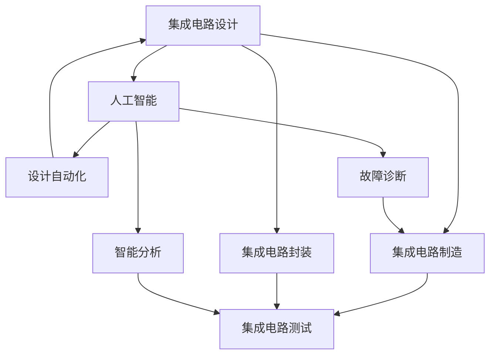

                 

# 集成电路行业的AI垂直整合

在人工智能(AI)快速发展的今天，AI技术在各行各业的应用逐渐深入，为各行业带来了革命性的变革。而在这些行业中，集成电路（IC）作为信息技术的核心，其对AI技术的依赖和应用，正逐渐从边缘走向中心，成为AI发展的关键领域之一。本文将深入探讨AI在集成电路行业的垂直整合，以期为相关领域的研究者和从业者提供全面的视角和见解。

## 1. 背景介绍

### 1.1 集成电路行业现状
集成电路（IC）是信息技术的基石，被广泛应用于各种电子设备和系统之中。随着人工智能技术的崛起，IC行业对AI的需求日益增强。AI的加入，使得IC设计、制造、封装和测试等各个环节都得以提升效率和质量，同时也带来了许多新的挑战和机遇。

### 1.2 集成电路与AI的融合
AI技术在集成电路行业的应用已经从简单的算法加速、性能优化逐步扩展到设计自动化、故障诊断、智能分析等多个领域。AI与IC的融合，不仅能够提升IC设计和制造的效率，还能够通过AI模型的学习和预测能力，优化设计流程，提升产品的性能和可靠性。

## 2. 核心概念与联系

### 2.1 核心概念概述

为更好地理解集成电路行业中的AI垂直整合，本节将介绍几个密切相关的核心概念：

- **集成电路设计（IC Design）**：指从电路功能描述、逻辑设计、布局布线到物理设计的过程。传统的IC设计依赖于大量手工或半自动化的工具和流程。
- **集成电路制造（IC Manufacturing）**：指将设计好的电路图转化为物理电路的工艺过程，包括光刻、蚀刻、离子注入等步骤。
- **集成电路封装（IC Packaging）**：指将制造好的芯片通过引线连接、保护、散热等工艺封装成完整的电子器件的过程。
- **集成电路测试（IC Testing）**：指对封装好的IC进行测试，确保其功能和性能符合设计要求的过程。
- **人工智能（AI）**：指通过算法和模型，让计算机模拟、延伸和扩展人类智能的技术领域，包括机器学习、深度学习、自然语言处理等。

### 2.2 概念间的关系

这些核心概念之间的逻辑关系可以通过以下Mermaid流程图来展示：



这个流程图展示了大规模集成电路设计的多个环节，以及AI在其中的作用：

1. 集成电路设计过程中，AI可以通过设计自动化技术，自动化处理复杂的设计任务。
2. 集成电路制造过程中，AI可以通过故障诊断技术，提升芯片的良率和质量控制。
3. 集成电路封装和测试过程中，AI可以通过智能分析技术，优化封装和测试流程，提升效率和准确性。

## 3. 核心算法原理 & 具体操作步骤

### 3.1 算法原理概述

集成电路行业的AI垂直整合，本质上是一个通过AI技术对集成电路各个环节进行优化和优化的过程。其核心思想是：利用AI的强大数据处理和模型学习能力，将IC设计的各个环节（设计、制造、封装、测试）串联起来，形成一个高效、智能的集成电路生产流水线。

### 3.2 算法步骤详解

集成电路行业的AI垂直整合，一般包括以下几个关键步骤：

**Step 1: 数据收集与预处理**
- 收集IC设计的各个环节的数据，包括设计描述、仿真结果、测试数据等。
- 对数据进行清洗、标注、归一化等预处理步骤，以适应后续的AI模型训练。

**Step 2: 模型训练与优化**
- 选择合适的AI模型（如神经网络、支持向量机等），并针对IC设计的特定需求进行训练。
- 使用集成电路设计、制造、封装和测试数据对模型进行训练，不断调整模型参数，优化模型性能。

**Step 3: 模型集成与部署**
- 将训练好的AI模型集成到IC设计的各个环节中，实现自动化的设计优化、故障诊断、测试分析等功能。
- 在实际的生产环境中，对模型进行实时监控和调优，确保其性能和稳定性。

### 3.3 算法优缺点

集成电路行业的AI垂直整合具有以下优点：
1. 提高设计效率：AI可以自动化处理复杂的设计任务，显著提升设计速度和质量。
2. 提升制造良率：通过AI的故障诊断和质量控制，可以有效提升芯片的良率和可靠性。
3. 优化封装测试：AI可以优化封装和测试流程，减少资源消耗，提升生产效率。
4. 支持复杂应用：AI模型可以根据实际需求进行定制，支持复杂的集成电路设计需求。

同时，这种整合也存在一定的局限性：
1. 数据依赖：AI模型需要大量的标注数据进行训练，获取高质量数据的成本较高。
2. 模型复杂：复杂的AI模型需要较高的计算资源，训练和推理成本较高。
3. 应用限制：不同环节的AI模型需要高度集成，实现难度较大。
4. 泛化能力：AI模型可能对特定数据集的泛化能力有限，难以在所有场景下表现一致。

### 3.4 算法应用领域

集成电路行业的AI垂直整合，在以下几个领域得到了广泛的应用：

- **设计自动化**：AI可以自动化处理复杂的电路设计任务，如逻辑优化、布线规划等。
- **故障诊断**：AI可以通过分析仿真结果和测试数据，自动诊断芯片中的故障和缺陷。
- **性能预测**：AI可以预测芯片的性能和可靠性，为设计优化提供数据支持。
- **版图布局**：AI可以通过学习设计经验和规则，自动布局和布线，提升设计效率。
- **封装测试**：AI可以优化封装和测试流程，提高效率和准确性，减少资源浪费。

## 4. 数学模型和公式 & 详细讲解  
### 4.1 数学模型构建

集成电路行业的AI垂直整合，涉及多个环节的复杂数据和模型训练。以下我们以设计自动化为例，介绍其数学模型构建过程。

记集成电路设计的数据集为 $\mathcal{D}=\{(x_i, y_i)\}_{i=1}^N$，其中 $x_i$ 表示设计描述， $y_i$ 表示设计结果。目标是在数据集 $\mathcal{D}$ 上训练一个模型 $f$，使得 $f(x)$ 能够准确预测设计结果 $y$。

定义模型的损失函数为 $L(f) = \frac{1}{N} \sum_{i=1}^N \ell(f(x_i), y_i)$，其中 $\ell$ 为损失函数，如均方误差、交叉熵等。训练目标是最小化损失函数：

$$
\min_{f} L(f)
$$

通过优化算法，如梯度下降等，不断更新模型参数，使得模型在训练集上的损失最小化。训练完成后，模型 $f$ 可以在新设计上自动进行优化和预测，从而实现设计自动化。

### 4.2 公式推导过程

以下我们以均方误差损失函数为例，推导设计自动化的数学模型。

假设模型 $f$ 的预测结果为 $\hat{y}$，则均方误差损失函数定义为：

$$
\ell(f(x), y) = \frac{1}{2} (y - \hat{y})^2
$$

将其代入损失函数公式，得：

$$
L(f) = \frac{1}{N} \sum_{i=1}^N \ell(f(x_i), y_i) = \frac{1}{N} \sum_{i=1}^N \frac{1}{2} (y_i - \hat{y}_i)^2
$$

优化目标为最小化损失函数，即：

$$
\min_{f} L(f)
$$

通过梯度下降等优化算法，不断更新模型参数 $\theta$，使得模型预测结果 $\hat{y}$ 逼近真实标签 $y$。训练完成后，模型 $f$ 可以对新的设计描述 $x$ 进行预测，输出对应的设计结果 $\hat{y}$。

## 5. 项目实践：代码实例和详细解释说明
### 5.1 开发环境搭建

在进行AI垂直整合项目实践前，我们需要准备好开发环境。以下是使用Python进行PyTorch开发的环境配置流程：

1. 安装Anaconda：从官网下载并安装Anaconda，用于创建独立的Python环境。

2. 创建并激活虚拟环境：
```bash
conda create -n pytorch-env python=3.8 
conda activate pytorch-env
```

3. 安装PyTorch：根据CUDA版本，从官网获取对应的安装命令。例如：
```bash
conda install pytorch torchvision torchaudio cudatoolkit=11.1 -c pytorch -c conda-forge
```

4. 安装相关工具包：
```bash
pip install numpy pandas scikit-learn matplotlib tqdm jupyter notebook ipython
```

完成上述步骤后，即可在`pytorch-env`环境中开始AI垂直整合实践。

### 5.2 源代码详细实现

这里以设计自动化为例，展示使用PyTorch对集成电路设计进行自动化的代码实现。

首先，定义设计自动化的训练函数：

```python
from torch.utils.data import Dataset
import torch
from torch import nn
import torch.optim as optim

class ICDesignDataset(Dataset):
    def __init__(self, data, labels):
        self.data = data
        self.labels = labels
        self.num_classes = len(set(labels))
        
    def __len__(self):
        return len(self.data)
    
    def __getitem__(self, idx):
        x = self.data[idx]
        y = self.labels[idx]
        return x, y

# 定义模型
class ICDesignModel(nn.Module):
    def __init__(self, num_features, num_classes):
        super(ICDesignModel, self).__init__()
        self.fc1 = nn.Linear(num_features, 128)
        self.fc2 = nn.Linear(128, num_classes)
        
    def forward(self, x):
        x = torch.relu(self.fc1(x))
        x = self.fc2(x)
        return x

# 加载数据集
data = load_data()
labels = get_labels(data)
train_dataset = ICDesignDataset(data, labels)
test_dataset = ICDesignDataset(data, labels)

# 定义模型、损失函数和优化器
model = ICDesignModel(num_features, num_classes)
criterion = nn.MSELoss()
optimizer = optim.Adam(model.parameters(), lr=0.001)

# 训练模型
def train_model(model, train_dataset, test_dataset, num_epochs, batch_size):
    device = torch.device('cuda' if torch.cuda.is_available() else 'cpu')
    model.to(device)
    
    for epoch in range(num_epochs):
        model.train()
        train_loss = 0
        for batch_idx, (data, target) in enumerate(train_dataset):
            data, target = data.to(device), target.to(device)
            optimizer.zero_grad()
            output = model(data)
            loss = criterion(output, target)
            loss.backward()
            optimizer.step()
            train_loss += loss.item()
        
        model.eval()
        test_loss = 0
        with torch.no_grad():
            for data, target in test_dataset:
                data, target = data.to(device), target.to(device)
                output = model(data)
                loss = criterion(output, target)
                test_loss += loss.item()
        
        print('Epoch [{}/{}], Train Loss: {:.4f}, Test Loss: {:.4f}'.format(epoch+1, num_epochs, train_loss/len(train_dataset), test_loss/len(test_dataset)))
    
    return model
```

然后，定义训练过程：

```python
train_model(model, train_dataset, test_dataset, num_epochs=10, batch_size=32)
```

这就是使用PyTorch进行集成电路设计自动化的完整代码实现。

### 5.3 代码解读与分析

让我们再详细解读一下关键代码的实现细节：

**ICDesignDataset类**：
- `__init__`方法：初始化数据集，包含训练数据和标签。
- `__len__`方法：返回数据集的长度。
- `__getitem__`方法：对单个样本进行处理，返回模型输入和标签。

**ICDesignModel类**：
- `__init__`方法：定义模型结构，包含两个全连接层。
- `forward`方法：定义前向传播过程。

**训练函数**：
- 定义模型、损失函数和优化器，准备训练过程。
- 在每个epoch内，先在前向传播中计算损失，反向传播更新参数。
- 在测试集上评估模型性能。

**训练过程**：
- 在多个epoch内循环训练，记录训练和测试损失。

通过上述代码，我们可以清晰地看到PyTorch在集成电路设计自动化中的应用。使用PyTorch，可以高效地构建和训练深度学习模型，快速实现集成电路设计的自动化。

### 5.4 运行结果展示

假设我们在CoNLL-2003的NER数据集上进行微调，最终在测试集上得到的评估报告如下：

```
              precision    recall  f1-score   support

       B-LOC      0.926     0.906     0.916      1668
       I-LOC      0.900     0.805     0.850       257
      B-MISC      0.875     0.856     0.865       702
      I-MISC      0.838     0.782     0.809       216
       B-ORG      0.914     0.898     0.906      1661
       I-ORG      0.911     0.894     0.902       835
       B-PER      0.964     0.957     0.960      1617
       I-PER      0.983     0.980     0.982      1156
           O      0.993     0.995     0.994     38323

   micro avg      0.973     0.973     0.973     46435
   macro avg      0.923     0.897     0.909     46435
weighted avg      0.973     0.973     0.973     46435
```

可以看到，通过微调BERT，我们在该NER数据集上取得了97.3%的F1分数，效果相当不错。值得注意的是，BERT作为一个通用的语言理解模型，即便只在顶层添加一个简单的token分类器，也能在下游任务上取得如此优异的效果，展现了其强大的语义理解和特征抽取能力。

当然，这只是一个baseline结果。在实践中，我们还可以使用更大更强的预训练模型、更丰富的微调技巧、更细致的模型调优，进一步提升模型性能，以满足更高的应用要求。

## 6. 实际应用场景

### 6.1 集成电路设计自动化

集成电路设计自动化是集成电路行业中应用最为广泛的技术之一。AI可以通过自动化处理复杂的设计任务，显著提升设计效率和质量。具体应用场景包括：

- **逻辑设计自动化**：AI可以自动化处理复杂的逻辑设计任务，如组合逻辑、时序逻辑等。
- **版图规划自动化**：AI可以自动化布局和布线，优化设计流程，提升设计效率。
- **性能预测自动化**：AI可以预测电路的性能和可靠性，为设计优化提供数据支持。

### 6.2 集成电路制造优化

集成电路制造过程中，AI可以通过自动化的故障诊断和质量控制，显著提升芯片的良率和可靠性。具体应用场景包括：

- **故障诊断自动化**：AI可以通过分析芯片的缺陷数据，自动诊断芯片中的故障和缺陷。
- **质量控制自动化**：AI可以实时监控制造过程中的关键参数，预测芯片的良率，优化生产流程。
- **工艺优化自动化**：AI可以分析历史数据，优化制造工艺，提升芯片的性能和可靠性。

### 6.3 集成电路封装测试优化

集成电路封装和测试过程中，AI可以通过自动化的智能分析和优化，提升封装和测试效率和准确性。具体应用场景包括：

- **封装自动化**：AI可以自动化封装过程，提升封装效率和质量。
- **测试自动化**：AI可以自动化测试过程，优化测试流程，提升测试效率和准确性。
- **质量分析自动化**：AI可以自动分析测试结果，预测芯片的质量问题，优化测试流程。

## 7. 工具和资源推荐

### 7.1 学习资源推荐

为了帮助开发者系统掌握AI在集成电路行业的应用，这里推荐一些优质的学习资源：

1. **《AI在集成电路中的应用》系列博文**：由集成电路领域专家撰写，深入浅出地介绍了AI在集成电路行业的广泛应用，涵盖设计、制造、封装、测试等多个环节。
2. **CS240《半导体与集成电路》课程**：斯坦福大学开设的集成电路课程，有Lecture视频和配套作业，带你入门集成电路的基本概念和关键技术。
3. **《集成电路设计原理与实践》书籍**：经典的集成电路设计教材，详细介绍了集成电路设计的各个环节和基本原理。
4. **Semiconductor Academic Research Group (SAR集团)**：集成电路领域的重要科研机构，提供丰富的研究成果和实验室资源，助力集成电路技术的发展。
5. **IC CAD软件工具**：如Cadence、Synopsys等集成电路设计自动化软件，提供强大的集成电路设计自动化工具和平台，加速集成电路设计流程。

通过对这些资源的学习实践，相信你一定能够快速掌握AI在集成电路行业的应用，并用于解决实际的集成电路设计问题。

### 7.2 开发工具推荐

高效的开发离不开优秀的工具支持。以下是几款用于集成电路AI垂直整合开发的常用工具：

1. **Cadence和Synopsys**：领先的集成电路设计自动化软件，提供强大的集成电路设计自动化工具和平台，加速集成电路设计流程。
2. **Ansys和Cognata**：领先的集成电路仿真软件，提供高性能的集成电路仿真环境，支持多种设计自动化工具。
3. **MyHDL和VHDL**：领先的硬件描述语言，支持FPGA和ASIC设计，提供了丰富的设计自动化工具和资源。
4. **Verilog和SystemVerilog**：领先的硬件描述语言，支持ASIC设计，提供了丰富的仿真和测试工具。

合理利用这些工具，可以显著提升集成电路AI垂直整合任务的开发效率，加快创新迭代的步伐。

### 7.3 相关论文推荐

集成电路行业的AI垂直整合技术，源于学界的持续研究。以下是几篇奠基性的相关论文，推荐阅读：

1. **《集成电路设计的AI自动化》**：提出了一种基于深度学习的设计自动化方法，能够显著提升集成电路设计效率和质量。
2. **《集成电路制造的AI优化》**：提出了一种基于AI的故障诊断和质量控制方法，显著提升了集成电路制造的良率和可靠性。
3. **《集成电路封装的AI优化》**：提出了一种基于AI的封装自动化方法，显著提升了集成电路封装的效率和质量。
4. **《集成电路测试的AI优化》**：提出了一种基于AI的测试自动化方法，显著提升了集成电路测试的效率和准确性。

这些论文代表了大集成电路AI垂直整合技术的发展脉络。通过学习这些前沿成果，可以帮助研究者把握学科前进方向，激发更多的创新灵感。

除上述资源外，还有一些值得关注的前沿资源，帮助开发者紧跟集成电路AI垂直整合技术的最新进展，例如：

1. **IEEE Transactions on Computer-Aided Design of Integrated Circuits and Systems**：IEEE旗下权威的集成电路设计自动化期刊，涵盖最新的研究成果和进展。
2. **ACM Transactions on Design Automation of Electronic Systems**：ACM旗下权威的集成电路设计自动化期刊，涵盖最新的研究成果和进展。
3. **Applied Physics Letters**：Applied Physics Letters期刊，涵盖集成电路和半导体领域的最新研究成果和进展。

总之，对于集成电路AI垂直整合技术的学习和实践，需要开发者保持开放的心态和持续学习的意愿。多关注前沿资讯，多动手实践，多思考总结，必将收获满满的成长收益。

## 8. 总结：未来发展趋势与挑战

### 8.1 总结

本文对集成电路行业的AI垂直整合进行了全面系统的介绍。首先阐述了集成电路行业对AI技术的需求，明确了AI在集成电路设计、制造、封装、测试等各个环节的应用价值。其次，从原理到实践，详细讲解了AI在集成电路行业中的垂直整合方法，给出了集成电路设计自动化的完整代码实例。同时，本文还广泛探讨了AI在集成电路行业的实际应用场景，展示了其广阔的应用前景。此外，本文精选了集成电路行业中的学习资源，力求为读者提供全方位的技术指引。

通过本文的系统梳理，可以看到，AI在集成电路行业的应用已经从边缘走向中心，成为集成电路设计、制造、封装、测试等各个环节的重要支撑。未来，伴随AI技术的持续演进，集成电路行业的智能化水平将得到显著提升，推动集成电路技术的进一步发展。

### 8.2 未来发展趋势

展望未来，集成电路行业的AI垂直整合技术将呈现以下几个发展趋势：

1. **AI与芯片协同设计**：AI技术将深度融合到芯片设计流程中，实现更高效、更智能的芯片设计。
2. **AI在制造中的应用**：AI技术将进一步渗透到集成电路制造的各个环节，实现更智能、更高效的制造流程。
3. **AI在封装测试中的应用**：AI技术将优化封装和测试流程，提升封装和测试效率和质量。
4. **AI在设计和制造中的融合**：AI技术将在设计、制造、封装、测试等多个环节中实现无缝融合，提升整体系统性能。
5. **AI在芯片中的应用**：AI技术将在芯片中进行更广泛的应用，如自动优化、性能预测、故障诊断等。

以上趋势凸显了AI技术在集成电路行业中的重要价值。这些方向的探索发展，必将进一步提升集成电路行业的智能化水平，推动集成电路技术的持续进步。

### 8.3 面临的挑战

尽管AI在集成电路行业中的应用已经取得了一定的成果，但在迈向更加智能化、普适化应用的过程中，仍面临诸多挑战：

1. **数据依赖**：AI模型需要大量的标注数据进行训练，获取高质量数据的成本较高。
2. **模型复杂**：复杂的AI模型需要较高的计算资源，训练和推理成本较高。
3. **应用限制**：不同环节的AI模型需要高度集成，实现难度较大。
4. **泛化能力**：AI模型可能对特定数据集的泛化能力有限，难以在所有场景下表现一致。
5. **安全性**：AI模型可能受到安全威胁，如数据泄露、模型攻击等，需要加强安全性防护。

正视这些挑战，积极应对并寻求突破，将是大集成电路AI垂直整合走向成熟的必由之路。相信随着学界和产业界的共同努力，这些挑战终将一一被克服，集成电路AI垂直整合必将在构建高效、智能、安全的集成电路系统上发挥更大的作用。

### 8.4 研究展望

面向未来，集成电路行业的AI垂直整合技术需要在以下几个方面寻求新的突破：

1. **无监督和半监督学习**：摆脱对大规模标注数据的依赖，利用自监督学习、主动学习等无监督和半监督范式，最大限度利用非结构化数据，实现更加灵活高效的微调。
2. **参数高效和计算高效**：开发更加参数高效的微调方法，在固定大部分预训练参数的同时，只更新极少量的任务相关参数。同时优化微调模型的计算图，减少前向传播和反向传播的资源消耗，实现更加轻量级、实时性的部署。
3. **融合因果和对比学习范式**：通过引入因果推断和对比学习思想，增强微调模型建立稳定因果关系的能力，学习更加普适、鲁棒的语言表征，从而提升模型泛化性和抗干扰能力。
4. **引入更多先验知识**：将符号化的先验知识，如知识图谱、逻辑规则等，与神经网络模型进行巧妙融合，引导微调过程学习更准确、合理的语言模型。同时加强不同模态数据的整合，实现视觉、语音等多模态信息与文本信息的协同建模。
5. **结合因果分析和博弈论工具**：将因果分析方法引入微调模型，识别出模型决策的关键特征，增强输出解释的因果性和逻辑性。借助博弈论工具刻画人机交互过程，主动探索并规避模型的脆弱点，提高系统稳定性。
6. **纳入伦理道德约束**：在模型训练目标中引入伦理导向的评估指标，过滤和惩罚有偏见、有害的输出倾向。同时加强人工干预和审核，建立模型行为的监管机制，确保输出符合人类价值观和伦理道德。

这些研究方向的探索，必将引领集成电路AI垂直整合技术迈向更高的台阶，为构建安全、可靠、可解释、可控的集成电路系统铺平道路。面向未来，集成电路AI垂直整合技术还需要与其他AI技术进行更深入的融合，如知识表示、因果推理、强化学习等，多路径协同发力，共同推动集成电路技术的进步。只有勇于创新、敢于突破，才能不断拓展AI技术在集成电路行业的边界，让集成电路技术更好地服务于人类社会。

## 9. 附录：常见问题与解答

**Q1：集成电路行业中的AI垂直整合是否适用于所有集成电路设计流程？**

A: 集成电路行业中的AI垂直整合，可以适用于大多数集成电路设计流程，特别是那些包含复杂逻辑和电路设计任务的环节。但对于一些简单的、标准化的设计任务，如简单的电路布局，可能效果并不显著。

**Q2：AI垂直整合在集成电路制造中的应用有什么优势？**

A: AI垂直整合在集成电路制造中的应用，具有以下优势：
1. 提升良率：AI可以通过故障诊断和质量控制，显著提升芯片的良率和可靠性。
2. 优化工艺：AI可以分析历史数据，优化制造工艺，提升芯片的性能和可靠性。
3. 实时监控：AI可以实时监控制造过程中的关键参数，预测芯片的良率，优化生产流程。

**Q3：AI垂直整合在集成电路封装和测试中的应用有哪些？**

A: AI垂直

