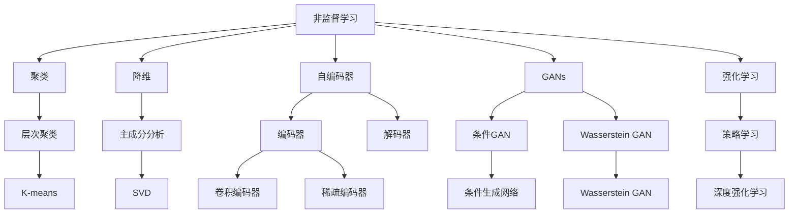
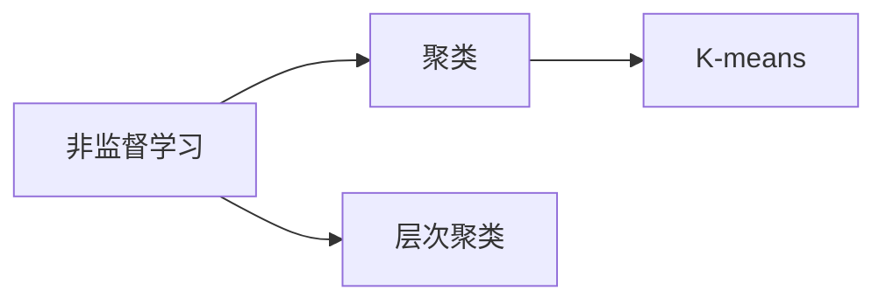
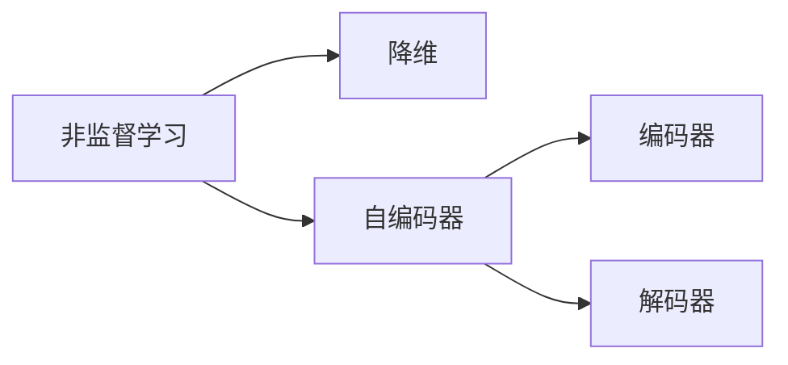
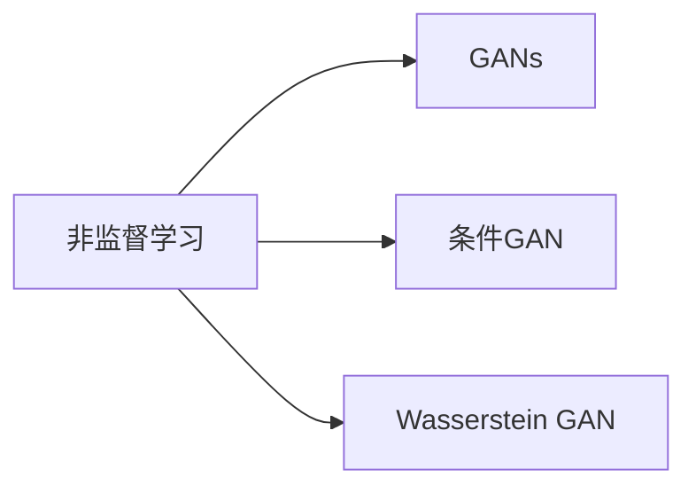
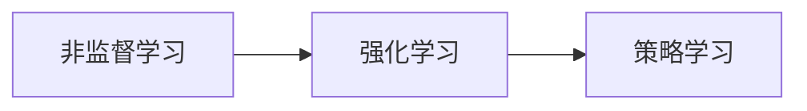
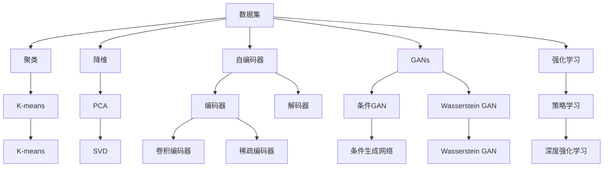

                 

# 非监督学习 原理与代码实例讲解

> 关键词：非监督学习,聚类,降维,自编码器,GANs,强化学习

## 1. 背景介绍

### 1.1 问题由来

在当今数据驱动的智能时代，机器学习算法逐渐成为推动科技和经济发展的重要引擎。然而，在诸多应用场景中，数据往往是不完全标注的，甚至无标签的。如何充分利用这些数据，提取有价值的信息，是智能系统设计中面临的重大挑战。

在此背景下，非监督学习（Unsupervised Learning）应运而生。非监督学习算法无需依赖大量标注数据，通过对数据的内在结构进行学习，自动识别模式和规律，提升数据价值。其广泛应用在图像识别、自然语言处理、信号处理等领域，成为机器学习的重要分支。

### 1.2 问题核心关键点

非监督学习的核心目标是通过数据内在的统计规律，识别潜在的有价值模式，从而提升数据解释力。其关键点包括：

- 无需标注数据：非监督算法可以处理任意数据，无需事先进行标注。
- 自动探索规律：算法自动从数据中学习结构，识别潜在模式。
- 广泛应用场景：适用于多种数据类型和应用场景，如聚类、降维、生成模型等。

### 1.3 问题研究意义

研究非监督学习算法，对于提升数据利用效率、降低数据标注成本、探索数据内在结构具有重要意义：

1. **提升数据价值**：通过自动探索数据内在规律，非监督算法能够从大量未标注数据中挖掘出潜在价值，促进知识的自动发现。
2. **降低标注成本**：在标注数据难以获取的场景中，非监督算法能够有效利用原始数据，减少标注的必要性。
3. **优化模型性能**：非监督算法可以作为预训练步骤，提升后续监督学习模型的性能，如利用降维算法减少特征维度，提高训练效率。
4. **推动技术进步**：非监督学习的方法和算法不断演进，推动了人工智能技术的创新和发展，如生成对抗网络（GANs）、自编码器等前沿技术。

## 2. 核心概念与联系

### 2.1 核心概念概述

为了更好地理解非监督学习，本节将介绍几个密切相关的核心概念：

- **非监督学习**：无需标注数据的机器学习算法，通过数据内在的统计规律自动探索模式和规律。
- **聚类**：将数据点分为不同类别的过程，相似的数据点被划分到同一类别。
- **降维**：减少数据维度，保留数据内在结构的过程，常用于处理高维数据。
- **自编码器**：通过编码器和解码器，对数据进行重构，学习数据的内在结构。
- **生成对抗网络（GANs）**：通过两个神经网络互相竞争，生成高质量的合成数据。
- **强化学习**：通过与环境互动，学习最优策略以达成目标。

这些概念之间的逻辑关系可以通过以下Mermaid流程图来展示：



这个流程图展示了非监督学习的核心概念及其之间的关系：

1. 非监督学习可以涵盖聚类、降维、自编码器、GANs和强化学习等多种算法。
2. 聚类算法，如K-means，是识别数据分组的一种方式。
3. 降维算法，如主成分分析（PCA），用于减少数据维度。
4. 自编码器由编码器和解码器组成，用于学习数据的内在结构。
5. GANs由生成器和判别器组成，用于生成高质量的合成数据。
6. 强化学习通过与环境互动，学习最优策略以达成目标。

这些概念共同构成了非监督学习的学习框架，使其能够在各种场景下发挥强大的数据探索能力。

### 2.2 概念间的关系

这些核心概念之间存在着紧密的联系，形成了非监督学习的完整生态系统。下面通过几个Mermaid流程图来展示这些概念之间的关系。

#### 2.2.1 非监督学习与聚类



这个流程图展示了非监督学习与聚类之间的关系。非监督学习中的聚类算法，如K-means，用于识别数据的内在分组规律。

#### 2.2.2 降维与自编码器



这个流程图展示了降维与自编码器之间的关系。降维算法，如主成分分析（PCA），常用于减少数据维度；自编码器通过编码器和解码器，对数据进行重构，学习数据的内在结构。

#### 2.2.3 GANs在生成模型中的应用



这个流程图展示了GANs在生成模型中的应用。GANs由生成器和判别器组成，用于生成高质量的合成数据。

#### 2.2.4 强化学习在策略学习中的应用



这个流程图展示了强化学习在策略学习中的应用。强化学习通过与环境互动，学习最优策略以达成目标。

### 2.3 核心概念的整体架构

最后，我们用一个综合的流程图来展示这些核心概念在非监督学习中的整体架构：



这个综合流程图展示了从数据到各类非监督算法之间的整体架构：

1. 数据集进入聚类、降维、自编码器、GANs和强化学习等算法，进行探索和建模。
2. 聚类算法如K-means用于识别数据的内在分组规律。
3. 降维算法如主成分分析（PCA）用于减少数据维度。
4. 自编码器通过编码器和解码器，对数据进行重构，学习数据的内在结构。
5. GANs由生成器和判别器组成，用于生成高质量的合成数据。
6. 强化学习通过与环境互动，学习最优策略以达成目标。

这些算法共同构成了非监督学习的学习框架，使其能够在各种场景下发挥强大的数据探索能力。

## 3. 核心算法原理 & 具体操作步骤
### 3.1 算法原理概述

非监督学习算法无需依赖标注数据，通过对数据的内在规律进行学习，自动探索潜在模式。其核心思想是：通过对数据集进行内在的统计分析，发现数据的内在结构和分布规律，从而提取有价值的信息。

### 3.2 算法步骤详解

非监督学习的算法步骤一般包括以下几个关键步骤：

**Step 1: 数据预处理**

- 数据清洗：去除噪声、缺失值等异常数据，保证数据质量。
- 数据标准化：对数据进行归一化或标准化，使得数据分布在一个合理范围内。

**Step 2: 选择合适的非监督算法**

- 根据任务需求，选择聚类、降维、生成模型、强化学习等非监督算法。
- 选择合适的模型架构和参数，如K-means、PCA、GANs、DQN等。

**Step 3: 训练算法模型**

- 将预处理后的数据集输入到非监督算法中，进行模型训练。
- 不断调整算法参数和超参数，优化模型性能。

**Step 4: 评估模型效果**

- 在验证集上评估模型性能，如聚类的簇内相似度、降维后的重构误差、生成数据的分布一致性等。
- 根据评估结果调整模型参数，进一步优化模型性能。

**Step 5: 模型应用**

- 将训练好的模型应用于实际任务中，如对新数据进行聚类、降维、生成或策略优化。
- 定期更新模型，保持模型的有效性和准确性。

以上是非监督学习的典型步骤，具体实现还需根据具体任务进行调整。

### 3.3 算法优缺点

非监督学习算法具有以下优点：

1. 无需标注数据：在数据标注成本较高或难以获取标注数据的情况下，非监督算法提供了更有效的解决方案。
2. 自动探索模式：无需人工干预，自动从数据中提取内在规律和结构。
3. 多应用场景：适用于聚类、降维、生成模型等多种数据处理任务。

同时，非监督学习算法也存在以下缺点：

1. 结果难以解释：非监督学习的结果通常难以解释，难以提供明确的因果关系。
2. 参数调整复杂：非监督算法的参数调整较为复杂，需大量实验和调试。
3. 数据质量要求高：数据质量对非监督算法的影响较大，噪声数据会严重影响结果。

尽管存在这些局限，非监督学习算法在处理大规模数据、探索数据内在结构等方面具有不可替代的优势，广泛应用于各种实际应用场景。

### 3.4 算法应用领域

非监督学习算法在众多领域得到了广泛应用，例如：

- **聚类分析**：在市场细分、客户分组、文档分类等领域，通过聚类算法自动识别数据模式和分组。
- **降维处理**：在图像处理、文本分析、信号处理等领域，通过降维算法减少数据维度，提升处理效率。
- **生成模型**：在图像生成、文本生成、音乐生成等领域，通过生成模型自动生成高质量的合成数据。
- **强化学习**：在自动控制、游戏AI、机器人导航等领域，通过强化学习算法学习最优策略，实现自主决策。

除了上述这些经典任务外，非监督学习算法还被创新性地应用于更多场景中，如异常检测、协同过滤、知识发现等，为数据处理和知识探索提供了新的思路。

## 4. 数学模型和公式 & 详细讲解  
### 4.1 数学模型构建

本节将使用数学语言对非监督学习算法进行更加严格的刻画。

记数据集为 $D=\{x_i\}_{i=1}^N$，其中 $x_i \in \mathbb{R}^d$ 为 $d$ 维的样本数据。假设非监督算法为 $f$，其输出为 $y=f(x)$。

定义模型 $f$ 在数据集 $D$ 上的经验风险为：

$$
\mathcal{L}(f) = \frac{1}{N} \sum_{i=1}^N \ell(f(x_i),y_i)
$$

其中 $\ell$ 为损失函数，用于衡量模型的预测输出与真实标签之间的差异。常见的损失函数包括均方误差、交叉熵等。

非监督学习的目标是最小化经验风险，即找到最优的模型参数 $\theta$：

$$
\theta^* = \mathop{\arg\min}_{\theta} \mathcal{L}(f)
$$

在实践中，我们通常使用基于梯度的优化算法（如SGD、Adam等）来近似求解上述最优化问题。设 $\eta$ 为学习率，则参数的更新公式为：

$$
\theta \leftarrow \theta - \eta \nabla_{\theta}\mathcal{L}(\theta)
$$

其中 $\nabla_{\theta}\mathcal{L}(\theta)$ 为损失函数对参数 $\theta$ 的梯度，可通过反向传播算法高效计算。

### 4.2 公式推导过程

以下我们以聚类算法K-means为例，推导其损失函数及其梯度的计算公式。

K-means算法假设数据集中存在 $K$ 个聚类中心 $c_k \in \mathbb{R}^d$，每个样本 $x_i$ 隶属于最近的聚类中心。目标函数定义为：

$$
\mathcal{L}(c) = \frac{1}{2N} \sum_{i=1}^N \min_k ||x_i - c_k||^2
$$

其中 $||\cdot||$ 为欧几里得距离。目标函数最小化聚类内点的平方误差，使得聚类中心能够准确地反映数据点的分布。

根据目标函数，对聚类中心 $c_k$ 的梯度定义为：

$$
\nabla_{c_k}\mathcal{L}(c) = \frac{1}{N} \sum_{i=1}^N \frac{(x_i - c_k)}{||x_i - c_k||^2}
$$

在梯度下降算法中，根据梯度方向更新聚类中心：

$$
c_k \leftarrow c_k - \eta \nabla_{c_k}\mathcal{L}(c)
$$

其中 $\eta$ 为学习率。通过不断迭代更新聚类中心，最终得到最优的聚类结果。

### 4.3 案例分析与讲解

在实际应用中，K-means算法在聚类任务中广泛使用，常用于市场细分、客户分组、文档分类等场景。以下是K-means算法的具体实现示例：

```python
import numpy as np
from sklearn.cluster import KMeans

# 假设数据集为N个d维的向量
X = np.random.rand(100, 2)

# 创建K-means模型，设置聚类数为5
kmeans = KMeans(n_clusters=5)

# 训练模型
kmeans.fit(X)

# 预测聚类结果
y_pred = kmeans.predict(X)

# 打印聚类中心
print(kmeans.cluster_centers_)
```

在这个示例中，我们使用Scikit-learn库中的KMeans算法，将数据集 $X$ 分为5个聚类中心，并预测每个样本所属的聚类。最终输出的聚类中心即为聚类的质心，反映了每个聚类的分布情况。

通过这个示例，可以更直观地理解K-means算法的基本原理和实现步骤。

## 5. 项目实践：代码实例和详细解释说明
### 5.1 开发环境搭建

在进行非监督学习实践前，我们需要准备好开发环境。以下是使用Python进行Scikit-learn开发的环境配置流程：

1. 安装Anaconda：从官网下载并安装Anaconda，用于创建独立的Python环境。

2. 创建并激活虚拟环境：
```bash
conda create -n sklearn-env python=3.8 
conda activate sklearn-env
```

3. 安装Scikit-learn：
```bash
pip install scikit-learn
```

4. 安装必要的库：
```bash
pip install matplotlib numpy pandas
```

完成上述步骤后，即可在`sklearn-env`环境中开始非监督学习实践。

### 5.2 源代码详细实现

下面我们以K-means聚类算法为例，给出使用Scikit-learn库对K-means算法进行聚类的Python代码实现。

```python
from sklearn.cluster import KMeans
from sklearn.datasets import make_blobs
import matplotlib.pyplot as plt

# 生成随机数据集
X, y = make_blobs(n_samples=100, centers=5, random_state=42)

# 创建K-means模型，设置聚类数为5
kmeans = KMeans(n_clusters=5)

# 训练模型
kmeans.fit(X)

# 预测聚类结果
y_pred = kmeans.predict(X)

# 打印聚类中心
print(kmeans.cluster_centers_)

# 绘制聚类结果
plt.scatter(X[:, 0], X[:, 1], c=y_pred, cmap='viridis')
plt.scatter(kmeans.cluster_centers_[:, 0], kmeans.cluster_centers_[:, 1], marker='x', s=200, linewidths=3, color='r')
plt.show()
```

在这个示例中，我们使用Scikit-learn库的KMeans算法对生成的随机数据集进行聚类。具体实现步骤如下：

1. 生成随机数据集 $X$。
2. 创建K-means模型，设置聚类数为5。
3. 训练模型，拟合数据集 $X$。
4. 预测聚类结果 $y$。
5. 打印聚类中心。
6. 绘制聚类结果，可视化聚类效果。

可以看到，使用Scikit-learn库，K-means算法的实现非常简单高效，只需要几行代码即可实现聚类任务。

### 5.3 代码解读与分析

让我们再详细解读一下关键代码的实现细节：

**K-means算法**：
- `make_blobs`函数：生成随机数据集，其中数据点均匀分布在5个聚类中心周围。
- `KMeans`类：创建K-means模型，设置聚类数为5。
- `fit`方法：训练模型，拟合数据集。
- `predict`方法：预测聚类结果，返回每个样本所属的聚类标签。
- `cluster_centers_`属性：获取聚类中心。

**可视化**：
- `scatter`函数：绘制数据点分布图，并根据聚类结果着色。
- `marker`和`cmap`参数：设置标记和颜色映射。
- `show`方法：显示绘制结果。

通过这个示例，可以更清晰地理解K-means算法的实现细节和具体应用。

当然，工业级的系统实现还需考虑更多因素，如超参数的自动搜索、聚类结果的验证、多任务协同等。但核心的算法原理和实现方式，可以帮助研究者快速掌握非监督学习的基本方法，并用于解决实际的聚类问题。

## 6. 实际应用场景
### 6.1 市场细分

在市场细分领域，非监督学习算法可以自动识别不同市场细分群体的特征和行为模式，帮助企业进行目标客户分析、产品定位和市场策略制定。

具体而言，可以收集客户的历史交易数据、行为数据等，构建客户画像，并在此基础上进行K-means聚类。通过分析聚类结果，企业可以识别出不同客户群体的特点，如高价值客户、忠诚客户、潜在流失客户等，从而制定差异化的市场策略，提升客户满意度和市场竞争力。

### 6.2 文档分类

在文本分类任务中，非监督学习算法可以自动识别文档的主题和类别，减少人工标注的复杂度，提升分类的准确性和效率。

具体而言，可以收集大量未标注的文档数据，利用TF-IDF、词袋模型等技术将文本转换为数值特征向量。在此基础上，使用K-means算法进行文档聚类，识别出不同主题的文档。通过进一步分析聚类结果，可以对文档进行分类，如新闻、科技、娱乐等，提升文档自动分类的效果。

### 6.3 异常检测

在异常检测任务中，非监督学习算法可以自动识别数据中的异常点，及时发现数据异常，避免潜在的风险。

具体而言，可以收集各种传感器数据、交易数据等，构建数据集。使用PCA等降维算法对数据进行降维处理，然后使用K-means算法对降维后的数据进行聚类。通过分析聚类结果，可以识别出异常数据点，如设备故障、交易异常等，从而及时采取措施，保障数据安全。

### 6.4 未来应用展望

随着非监督学习算法的不断发展，其在更多领域的应用前景广阔。

在医疗健康领域，非监督学习算法可以自动分析医疗影像、基因数据等，提取患者特征，提升诊断和治疗效果。在金融领域，非监督学习算法可以自动识别市场风险、客户行为等，提升风险管理和客户服务水平。在环境保护领域，非监督学习算法可以自动分析环境监测数据，识别异常行为，提升环境治理能力。

此外，在教育、交通、安全等众多领域，非监督学习算法也将不断涌现，为数据驱动的决策提供新的支持。

## 7. 工具和资源推荐
### 7.1 学习资源推荐

为了帮助开发者系统掌握非监督学习的基本理论和方法，这里推荐一些优质的学习资源：

1. 《机器学习》课程：由斯坦福大学Andrew Ng教授讲授，系统介绍了机器学习的基本概念和常用算法，包括非监督学习。

2. 《Python机器学习》书籍：由Sebastian Raschka和Vahid Mirjalili合著，深入浅出地介绍了机器学习算法在Python中的实现，包括K-means聚类、PCA降维等。

3. 《Pattern Recognition and Machine Learning》书籍：由Christopher Bishop撰写，全面介绍了模式识别和机器学习的基本理论和算法，包括非监督学习。

4. Scikit-learn官方文档：Scikit-learn库的官方文档，提供了丰富的算法实现和案例，是学习和使用Scikit-learn的必备资料。

5. Coursera在线课程：提供各类高质量的机器学习和数据科学课程，包括非监督学习的内容，适合初学者和进阶学习。

通过这些资源的学习实践，相信你一定能够快速掌握非监督学习的基本方法，并用于解决实际的聚类问题。

### 7.2 开发工具推荐

高效的开发离不开优秀的工具支持。以下是几款用于非监督学习开发的常用工具：

1. Python：通用编程语言，广泛用于数据处理和机器学习算法的实现。
2. Scikit-learn：基于Python的开源机器学习库，提供多种非监督算法实现，如K-means、PCA等。
3. TensorFlow：由Google主导开发的深度学习框架，支持多种算法实现，适合大规模工程应用。
4. PyTorch：基于Python的开源深度学习框架，灵活易用，适合研究和实验。
5. Jupyter Notebook：交互式编程环境，便于数据处理和模型调试。

合理利用这些工具，可以显著提升非监督学习算法的开发效率，加速创新迭代的步伐。

### 7.3 相关论文推荐

非监督学习的研究方向多样，涵盖了聚类、降维、生成模型、强化学习等多个领域。以下是几篇奠基性的相关论文，推荐阅读：

1. On Some Measures of Information Gain in Systematic Sampling and Resampling (K-Means)：提出K-means聚类算法的基本原理和实现方法。

2. A Tutorial on Principal Component Analysis（PCA）：全面介绍了主成分分析（PCA）算法的基本概念和应用。

3. Generative Adversarial Nets（GANs）：介绍生成对抗网络（GANs）的基本原理和实现方法。

4. Self-Organizing Maps（SOMs）：介绍自组织映射算法的基本原理和应用。

5. Reinforcement Learning: An Introduction：全面介绍了强化学习的基本理论和算法，包括深度强化学习。

这些论文代表了大规模非监督学习的研究脉络。通过学习这些前沿成果，可以帮助研究者把握学科前进方向，激发更多的创新灵感。

除上述资源外，还有一些值得关注的前沿资源，帮助开发者紧跟非监督学习的研究进展，例如：

1. arXiv论文预印本：人工智能领域最新研究成果的发布平台，包括大量尚未发表的前沿工作，学习前沿技术的必读资源。

2. 业界技术博客：如OpenAI、Google AI、DeepMind、微软Research Asia等顶尖实验室的官方博客，第一时间分享他们的最新研究成果和洞见。

3. 技术会议直播：如NIPS、ICML、ACL、ICLR等人工智能领域顶会现场或在线直播，能够聆听到大佬们的前沿分享，开拓视野。

4. GitHub热门项目：在GitHub上Star、Fork数最多的非监督学习相关项目，往往代表了该技术领域的发展趋势和最佳实践，值得去学习和贡献。

5. 行业分析报告：各大咨询公司如McKinsey、PwC等针对非监督学习的研究报告，有助于从商业视角审视技术趋势，把握应用价值。

总之，对于非监督学习的研究和学习，需要开发者保持开放的心态和持续学习的意愿。多关注前沿资讯，多动手实践，多思考总结，必将收获满满的成长收益。

## 8. 总结：未来发展趋势与挑战

### 8.1 总结

本文对非监督学习算法进行了全面系统的介绍。首先阐述了非监督学习的基本概念和应用背景，明确了非监督学习在数据探索和处理中的重要作用。其次，从原理到实践，详细讲解了非监督学习的数学模型和算法实现，给出了K-means聚类的代码实现示例。同时，本文还广泛探讨了非监督学习在市场细分、文档分类、异常检测等实际应用场景中的应用前景，展示了非监督学习算法的广泛应用价值。此外，本文精选了非监督学习的各类学习资源，力求为读者提供全方位的技术指引。

通过本文的系统梳理，可以看到，非监督学习算法在处理未标注数据、探索数据内在结构等方面具有不可替代的优势，广泛应用于各种实际应用场景。尽管非监督学习在理论和方法上还有诸多挑战，但其广阔的应用前景和巨大的潜力，使得

