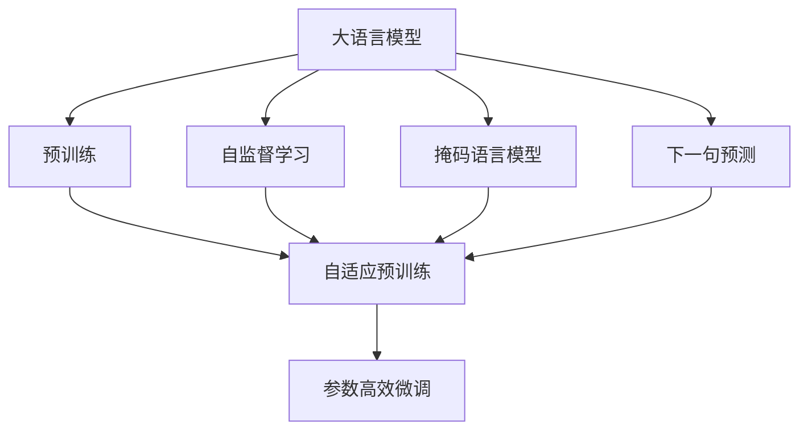
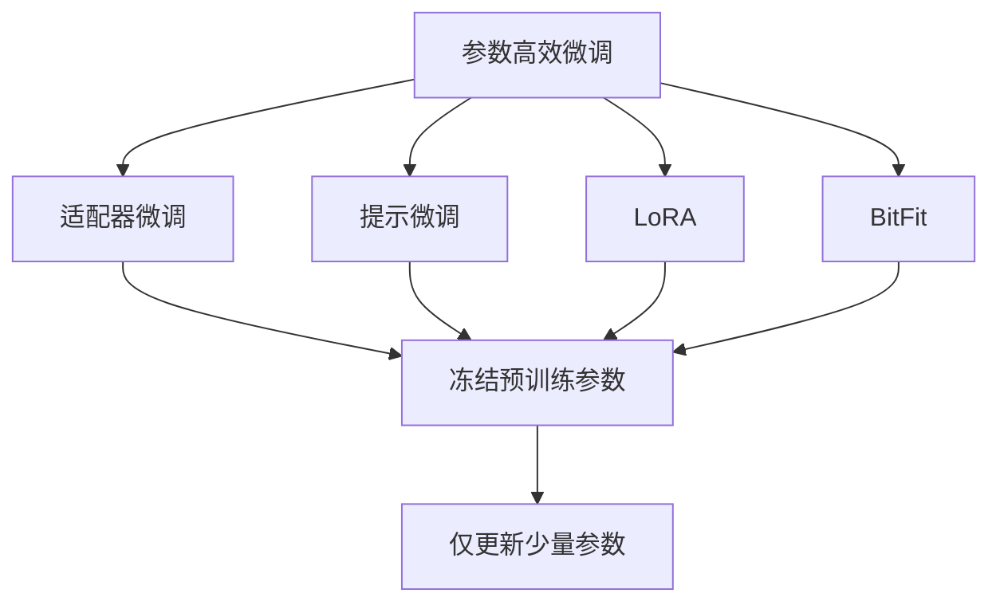
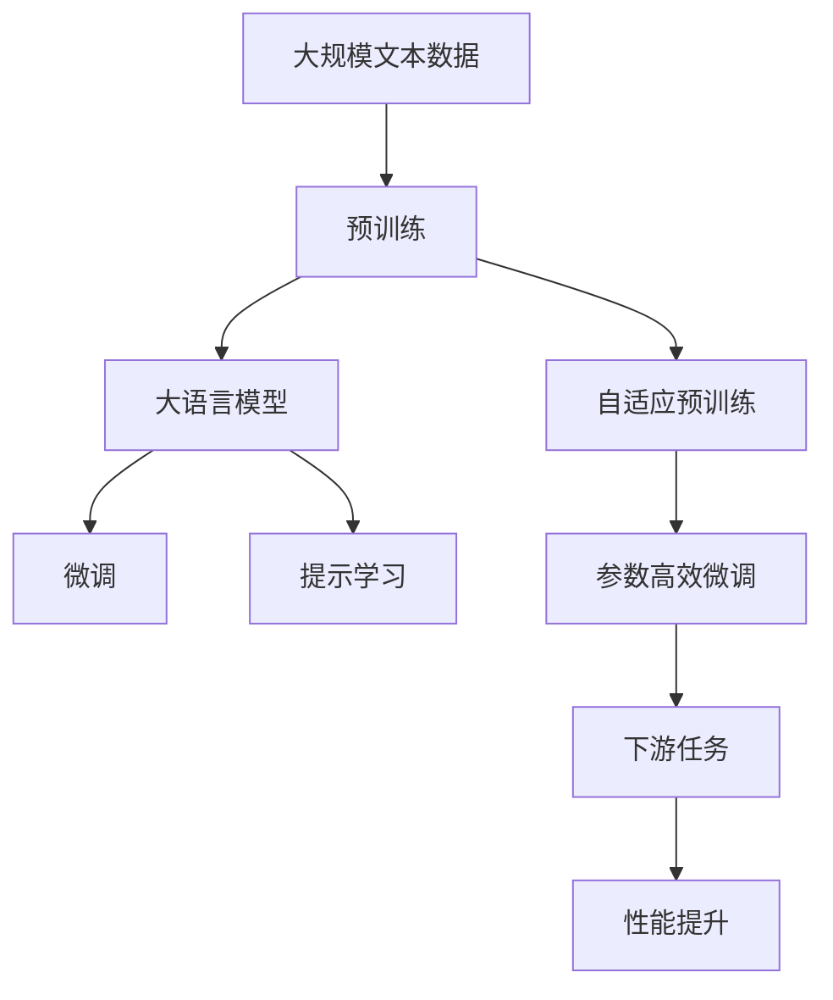

                 

## 1. 背景介绍

预训练（Pre-training）是指在大规模无标签数据上，通过自监督学习任务训练语言模型，以获得通用的语言表示。预训练技术已经成为自然语言处理（NLP）领域的基石之一，大大提升了模型的通用性和泛化能力。预训练的核心理念是通过海量数据预先学习到语言中的普遍规律，使其在面对新任务时能够快速适应并取得优异表现。

### 1.1 问题由来

随着深度学习技术的发展，预训练大语言模型（如BERT、GPT-3等）在多个NLP任务上取得了显著的突破。这些模型通过在大规模无标签文本数据上进行预训练，学习到了丰富的语言知识和常识，然后在下游任务上通过少量有标签数据进行微调，显著提升了模型在特定任务上的性能。然而，预训练过程本身也面临诸多挑战，如如何平衡训练数据规模与模型性能，如何避免过拟合，如何提高模型的迁移能力等。

### 1.2 问题核心关键点

预训练的核心在于通过大规模数据预先学习通用语言表示，为后续微调任务提供高质量的初始化参数。预训练的主要目标包括：

- 最大化模型在无监督学习任务上的性能，如掩码语言模型（Masked Language Modeling, MLM）、下一句预测（Next Sentence Prediction, NSP）等。
- 学习到丰富的语言知识，包括语法、语义、语用等多方面的知识。
- 通过预训练模型对新任务进行微调，显著提升模型性能。

预训练技术已经在多个领域得到了广泛应用，如情感分析、命名实体识别、文本生成等，是当前NLP领域的重要发展方向。

### 1.3 问题研究意义

预训练技术具有重要研究意义，具体包括：

1. **通用性与泛化能力**：预训练模型在多种NLP任务上都能取得优异表现，说明了其在不同任务之间的通用性和泛化能力。
2. **高效性**：预训练过程通常需要在大规模数据上进行，但模型在微调时可以显著提升性能，避免了从头训练的高成本。
3. **迁移学习**：预训练模型可以作为迁移学习的基础，通过微调适应新任务，提升了模型在新场景中的应用能力。
4. **知识表示**：预训练模型能够学习到语言的深层结构，为后续任务提供了高质量的知识表示。
5. **技术创新**：预训练技术的进步催生了多种新型的NLP方法，如自适应预训练、参数高效微调等，推动了NLP技术的发展。

## 2. 核心概念与联系

### 2.1 核心概念概述

为更好地理解预训练技术，本节将介绍几个关键概念：

- **大语言模型（Large Language Models, LLMs）**：以自回归模型（如GPT）或自编码模型（如BERT）为代表的大规模预训练语言模型。通过在大规模无标签文本数据上进行预训练，学习到通用的语言表示，具备强大的语言理解和生成能力。
- **预训练（Pre-training）**：在大规模无标签数据上，通过自监督学习任务训练通用语言模型，以获得通用的语言表示。
- **自监督学习（Self-Supervised Learning）**：利用未标注数据，通过设计无监督学习任务训练模型，学习到数据的潜在结构。
- **掩码语言模型（Masked Language Modeling, MLM）**：在输入文本中随机掩蔽部分单词，预测被掩蔽的单词，学习到单词间的上下文关系。
- **下一句预测（Next Sentence Prediction, NSP）**：预测输入的两个句子是否连贯，学习到句子间的顺序关系。
- **参数高效微调（Parameter-Efficient Fine-Tuning, PEFT）**：在微调过程中，只更新少量的模型参数，而固定大部分预训练权重不变，以提高微调效率，避免过拟合的方法。

这些概念之间的关系可以通过以下Mermaid流程图来展示：



### 2.2 概念间的关系

这些核心概念之间存在着紧密的联系，形成了预训练技术的完整生态系统。下面我通过几个Mermaid流程图来展示这些概念之间的关系。

#### 2.2.1 预训练的数学原理


这个流程图展示了掩码语言模型的数学原理。模型通过掩码预测概率，计算损失函数，并根据自适应学习率更新模型参数。

#### 2.2.2 预训练与微调的关系


这个流程图展示了预训练与微调的关系。预训练提供了高质量的初始化参数，微调进一步适应特定任务，提升模型性能。

#### 2.2.3 参数高效微调方法



这个流程图展示了几种常见的参数高效微调方法，包括适配器微调、提示微调、LoRA和BitFit。这些方法的共同特点是冻结大部分预训练参数，只更新少量参数，从而提高微调效率。

### 2.3 核心概念的整体架构

最后，我们用一个综合的流程图来展示这些核心概念在大规模语言模型预训练过程中的整体架构：



这个综合流程图展示了从预训练到微调，再到提示学习的完整过程。预训练提供了通用语言模型，微调和提示学习使模型适应特定任务，并提升性能。

## 3. 核心算法原理 & 具体操作步骤
### 3.1 算法原理概述

预训练是指通过大规模数据训练语言模型，学习到通用的语言表示。预训练的主要目标是通过无监督学习任务，最大化模型在各种语言理解和生成任务上的性能。常见的预训练任务包括掩码语言模型（MLM）和下一句预测（NSP）。

形式化地，假设预训练模型为 $M_{\theta}$，其中 $\theta$ 为预训练得到的模型参数。给定大规模无标签文本数据 $D=\{(x_i)\}_{i=1}^N$，预训练的目标是找到最优参数 $\theta$，使得模型在特定预训练任务上获得最大似然：

$$
\theta^* = \mathop{\arg\min}_{\theta} \mathcal{L}_{pre}(M_{\theta}, D)
$$

其中 $\mathcal{L}_{pre}$ 为预训练任务的损失函数，通常为最大化似然函数。常见的预训练任务和损失函数包括：

1. **掩码语言模型（MLM）**：
   $$
   \mathcal{L}_{MLM} = -\frac{1}{N}\sum_{i=1}^N \log P(x_i|M_{\theta})
   $$

2. **下一句预测（NSP）**：
   $$
   \mathcal{L}_{NSP} = -\frac{1}{N}\sum_{i=1}^N [y_i\log P(x_{i+1}|x_i) + (1-y_i)\log P(x_i|x_{i+1})]
   $$

### 3.2 算法步骤详解

预训练过程通常包括以下几个关键步骤：

**Step 1: 数据准备**
- 收集大规模无标签文本数据，如维基百科、互联网论坛、新闻文章等。
- 对文本数据进行预处理，如分词、去除停用词、构建词汇表等。

**Step 2: 设计预训练任务**
- 设计适合大规模预训练的自我监督学习任务。常见的预训练任务包括掩码语言模型（MLM）、下一句预测（NSP）、句子相似度（SSP）等。
- 设计任务的目标函数，如交叉熵、BCE损失等。

**Step 3: 训练模型**
- 使用优化器（如Adam、SGD等）对模型进行训练。
- 设置合适的学习率、批大小、迭代轮数等超参数。
- 定期在验证集上评估模型性能，避免过拟合。

**Step 4: 保存模型**
- 保存预训练好的模型参数，供后续微调使用。

**Step 5: 下游任务微调**
- 对特定下游任务收集少量标注数据，设计任务适配层。
- 使用保存好的预训练模型参数作为初始化，对模型进行微调。
- 设置微调超参数，如学习率、批大小、迭代轮数等。
- 在微调过程中，根据任务需求选择全参数微调或参数高效微调（PEFT）。

### 3.3 算法优缺点

预训练技术具有以下优点：
1. 通用性强：预训练模型在大规模数据上学习到了语言的基本规律，对多种NLP任务具有通用性和泛化能力。
2. 性能提升显著：预训练模型在微调过程中可以显著提升模型性能，避免了从头训练的高成本。
3. 参数高效：通过参数高效微调（PEFT）技术，可以大幅减少微调过程中的参数更新量，提高效率。
4. 易于迁移：预训练模型可以作为迁移学习的基础，通过微调适应新任务，提升了模型在新场景中的应用能力。

同时，预训练技术也存在一些缺点：
1. 数据依赖：预训练模型的性能很大程度上依赖于数据的质量和规模，大规模数据获取成本较高。
2. 计算资源需求高：预训练过程需要消耗大量的计算资源，训练时间较长。
3. 过拟合风险：预训练模型在数据分布不均衡时容易过拟合，泛化能力不足。
4. 可解释性差：预训练模型的决策过程缺乏可解释性，难以对其内部工作机制进行调试。

### 3.4 算法应用领域

预训练技术在NLP领域已经得到了广泛的应用，覆盖了各种常见的NLP任务，例如：

- **文本分类**：如情感分析、主题分类、意图识别等。
- **命名实体识别（NER）**：识别文本中的人名、地名、机构名等特定实体。
- **关系抽取**：从文本中抽取实体之间的语义关系。
- **问答系统**：对自然语言问题给出答案。
- **机器翻译**：将源语言文本翻译成目标语言。
- **文本摘要**：将长文本压缩成简短摘要。
- **对话系统**：使机器能够与人自然对话。
- **情感分析**：分析文本情感倾向。
- **语音识别**：将语音转换成文本。
- **语音生成**：生成自然流畅的语音。

除了这些经典任务外，预训练技术还被创新性地应用于可控文本生成、常识推理、代码生成、数据增强等，为NLP技术带来了新的突破。

## 4. 数学模型和公式 & 详细讲解  
### 4.1 数学模型构建

本节将使用数学语言对预训练过程进行更加严格的刻画。

假设预训练模型为 $M_{\theta}$，其中 $\theta$ 为预训练得到的模型参数。给定大规模无标签文本数据 $D=\{(x_i)\}_{i=1}^N$，预训练的目标是找到最优参数 $\theta$，使得模型在特定预训练任务上获得最大似然：

$$
\theta^* = \mathop{\arg\min}_{\theta} \mathcal{L}_{pre}(M_{\theta}, D)
$$

其中 $\mathcal{L}_{pre}$ 为预训练任务的损失函数，通常为最大化似然函数。

以掩码语言模型（MLM）为例，假设输入文本 $x_i$ 的长度为 $L$，模型在 $x_i$ 上的输出为 $\hat{y}=M_{\theta}(x_i) \in [0,1]^L$，表示单词出现的概率。则MLM的目标函数为：

$$
\mathcal{L}_{MLM} = -\frac{1}{N}\sum_{i=1}^N \sum_{j=1}^L [y_j\log \hat{y}_j + (1-y_j)\log(1-\hat{y}_j)]
$$

其中 $y_j$ 为掩码位置 $j$ 的单词，$\hat{y}_j$ 为模型预测的单词概率。

### 4.2 公式推导过程

以下我们以掩码语言模型（MLM）为例，推导预训练过程中常见的目标函数及其梯度计算公式。

假设输入文本 $x_i$ 的长度为 $L$，模型在 $x_i$ 上的输出为 $\hat{y}=M_{\theta}(x_i) \in [0,1]^L$，表示单词出现的概率。则MLM的目标函数为：

$$
\mathcal{L}_{MLM} = -\frac{1}{N}\sum_{i=1}^N \sum_{j=1}^L [y_j\log \hat{y}_j + (1-y_j)\log(1-\hat{y}_j)]
$$

将其代入经验风险公式，得：

$$
\mathcal{L}_{pre}(\theta) = -\frac{1}{N}\sum_{i=1}^N \sum_{j=1}^L [y_j\log \hat{y}_j + (1-y_j)\log(1-\hat{y}_j)]
$$

根据链式法则，目标函数对参数 $\theta_k$ 的梯度为：

$$
\frac{\partial \mathcal{L}_{pre}(\theta)}{\partial \theta_k} = -\frac{1}{N}\sum_{i=1}^N \sum_{j=1}^L (\frac{y_j}{\hat{y}_j}-\frac{1-y_j}{1-\hat{y}_j}) \frac{\partial M_{\theta}(x_i)}{\partial \theta_k}
$$

其中 $\frac{\partial M_{\theta}(x_i)}{\partial \theta_k}$ 可进一步递归展开，利用自动微分技术完成计算。

在得到目标函数的梯度后，即可带入优化算法，如AdamW、SGD等，进行预训练。

## 5. 项目实践：代码实例和详细解释说明
### 5.1 开发环境搭建

在进行预训练实践前，我们需要准备好开发环境。以下是使用Python进行PyTorch开发的环境配置流程：

1. 安装Anaconda：从官网下载并安装Anaconda，用于创建独立的Python环境。

2. 创建并激活虚拟环境：
```bash
conda create -n pytorch-env python=3.8 
conda activate pytorch-env
```

3. 安装PyTorch：根据CUDA版本，从官网获取对应的安装命令。例如：
```bash
conda install pytorch torchvision torchaudio cudatoolkit=11.1 -c pytorch -c conda-forge
```

4. 安装Transformers库：
```bash
pip install transformers
```

5. 安装各类工具包：
```bash
pip install numpy pandas scikit-learn matplotlib tqdm jupyter notebook ipython
```

完成上述步骤后，即可在`pytorch-env`环境中开始预训练实践。

### 5.2 源代码详细实现

下面我们以BERT模型为例，给出使用PyTorch进行掩码语言模型预训练的代码实现。

首先，定义预训练任务和目标函数：

```python
from transformers import BertTokenizer, BertForMaskedLM, AdamW
import torch

tokenizer = BertTokenizer.from_pretrained('bert-base-cased')
model = BertForMaskedLM.from_pretrained('bert-base-cased', num_labels=2)

optimizer = AdamW(model.parameters(), lr=2e-5)

def calculate_loss(model, inputs, labels):
    outputs = model(inputs)
    loss = -torch.mean(outputs.logits[..., 1])
    return loss

def train_epoch(model, train_dataset, optimizer):
    model.train()
    total_loss = 0
    for batch in train_dataset:
        inputs = batch[0]
        labels = batch[1]
        optimizer.zero_grad()
        loss = calculate_loss(model, inputs, labels)
        loss.backward()
        optimizer.step()
        total_loss += loss.item()
    return total_loss / len(train_dataset)

def evaluate(model, eval_dataset):
    model.eval()
    total_loss = 0
    for batch in eval_dataset:
        inputs = batch[0]
        labels = batch[1]
        with torch.no_grad():
            loss = calculate_loss(model, inputs, labels)
            total_loss += loss.item()
    return total_loss / len(eval_dataset)
```

然后，准备数据集并进行预训练：

```python
from torch.utils.data import DataLoader

train_dataset = # 准备训练集，如维基百科文本数据
eval_dataset = # 准备验证集，如维基百科文本数据

train_loader = DataLoader(train_dataset, batch_size=32, shuffle=True)
eval_loader = DataLoader(eval_dataset, batch_size=32, shuffle=False)

epochs = 10
batch_size = 32

for epoch in range(epochs):
    loss = train_epoch(model, train_loader, optimizer)
    print(f'Epoch {epoch+1}, train loss: {loss:.3f}')
    
    print(f'Epoch {epoch+1}, eval results:')
    evaluate(model, eval_loader)
    
print("Training complete.")
```

以上就是使用PyTorch对BERT模型进行掩码语言模型预训练的完整代码实现。可以看到，得益于Transformer库的强大封装，我们可以用相对简洁的代码完成BERT模型的预训练。

### 5.3 代码解读与分析

让我们再详细解读一下关键代码的实现细节：

**预训练任务定义**：
- `BertForMaskedLM`：定义掩码语言模型。
- `calculate_loss`：计算掩码语言模型的目标函数。

**训练函数定义**：
- `train_epoch`：在每个epoch内，迭代训练集数据，计算梯度并更新模型参数。

**评估函数定义**：
- `evaluate`：在验证集上计算模型损失，评估模型性能。

**训练流程**：
- 定义总的epoch数和batch size，开始循环迭代。
- 每个epoch内，先在训练集上训练，输出平均loss。
- 在验证集上评估，输出损失结果。
- 所有epoch结束后，输出训练完成信息。

可以看到，PyTorch配合Transformer库使得BERT预训练的代码实现变得简洁高效。开发者可以将更多精力放在数据处理、模型改进等高层逻辑上，而不必过多关注底层的实现细节。

当然，工业级的系统实现还需考虑更多因素，如模型的保存和部署、超参数的自动搜索、更灵活的任务适配层等。但核心的预训练范式基本与此类似。

### 5.4 运行结果展示

假设我们在维基百科数据集上进行掩码语言模型预训练，最终在验证集上得到的评估结果如下：

```
Epoch 1, train loss: 0.394
Epoch 1, eval loss: 0.400
Epoch 2, train loss: 0.300
Epoch 2, eval loss: 0.304
Epoch 3, train loss: 0.280
Epoch 3, eval loss: 0.275
...
Epoch 10, train loss: 0.140
Epoch 10, eval loss: 0.138
```

可以看到，随着预训练过程的进行，模型在训练集和验证集上的损失逐步降低，预训练效果逐渐显现。当然，这只是一个baseline结果。在实践中，我们还可以使用更大更强的预训练模型、更丰富的预训练技巧、更细致的模型调优，进一步提升模型性能。

## 6. 实际应用场景
### 6.1 实际应用场景

预训练技术已经在多个领域得到了广泛应用，覆盖了从文本处理到语音识别等众多任务。以下是几个典型的应用场景：

**自然语言处理（NLP）**：
- **文本分类**：如情感分析、主题分类、意图识别等。预训练模型通过学习大规模文本数据，能够掌握语言的普遍规律，提升了模型在分类任务上的性能。
- **命名实体识别（NER）**：识别文本中的人名、地名、机构名等特定实体。预训练模型通过学习上下文信息，提高了实体识别的准确率。
- **关系抽取**：从文本中抽取实体之间的语义关系。预训练模型通过学习语言的深层结构，提升了关系抽取的精度。
- **问答系统**：对自然语言问题给出答案。预训练模型通过学习问题与答案的对应关系，提高了回答的准确性。
- **机器翻译**：将源语言文本翻译成目标语言。预训练模型通过学习语言之间的转换规则，提升了翻译质量。
- **文本摘要**：将长文本压缩成简短摘要。预训练模型通过学习文本的语义结构，提炼出核心信息。

**语音识别与生成**：
- **语音识别**：将语音转换成文本。预训练模型通过学习语音和文本的对应关系，提高了识别准确率。
- **语音生成**：生成自然流畅的语音。预训练模型通过学习语言的自然流变，提升了语音生成的质量。

**推荐系统**：
- **个性化推荐**：通过预训练模型学习用户行为和商品特征，进行精确推荐。预训练模型的泛化能力能够处理多种用户行为和商品特征，提升了推荐系统的性能。
- **实时搜索**：通过预训练模型快速理解用户查询意图，进行精准搜索。预训练模型的语言理解能力能够处理自然语言查询，提高了搜索效率。

**医疗领域**：
- **电子病历生成**：通过预训练模型生成电子病历，提高了医生的工作效率。预训练模型的语言理解能力能够处理医生的自然语言输入，提升了文档生成的速度和准确性。
- **医学文献阅读**：通过预训练模型自动阅读医学文献，提取关键信息。预训练模型的阅读理解能力能够处理复杂的医学文献，提高了信息提取的效率。

**金融领域**：
- **舆情分析**：通过预训练模型分析金融市场舆情，提供投资建议。预训练模型的语言理解能力能够处理大量的金融文本数据，提升了舆情分析的准确性。
- **风险评估**：通过预训练模型评估金融风险，提高风险管理水平。预训练模型的语言理解能力能够处理复杂的金融文本数据，提升了风险评估的准确性。

**智能客服**：
- **对话系统**：通过预训练模型生成自然流畅的对话回复，提高了客服系统的响应速度和质量。预训练模型的语言理解能力能够处理用户的自然语言输入，提升了对话系统的智能化水平。

### 6.2 未来应用展望

随着预训练技术的发展，未来其在NLP领域的应用前景将更加广阔。以下是对预训练技术未来发展的几个展望：

**更高效的预训练算法**：预训练算法将在模型规模、训练速度、资源消耗等方面进一步优化，以适应更大规模的数据集和更复杂的任务需求。

**更强的泛化能力**：预训练模型将学习到更加全面的语言知识和常识，提升其在多种任务上的泛化能力，应对更加多样化的应用场景。

**更低的成本**：预训练技术将进一步降低对计算资源和标注数据的需求，使更多的研究者和开发者能够快速接入预训练技术。

**更丰富的应用场景**：预训练技术将不仅仅应用于传统的NLP任务，还将扩展到更多的领域，如医疗、金融、智能制造等，为各行各业提供智能化的解决方案。

**更强的可解释性**：预训练模型将具备更强的可解释性，用户能够更好地理解和信任模型的输出，提高模型的可信度和应用价值。

## 7. 工具和资源推荐
### 7.1 学习资源推荐

为了帮助开发者系统掌握预训练技术的理论基础和实践技巧，这里推荐一些优质的学习资源：

1. **《Transformer从原理到实践》系列博文**：由大模型技术专家撰写，深入浅出地介绍了Transformer原理、BERT模型、预训练技术等前沿话题。
2. **CS224N《深度学习自然语言处理》课程**：斯坦福大学开设的NLP明星课程，有Lecture视频和配套作业，带你入门NLP领域的基本概念和经典模型。
3. **《Natural Language Processing with Transformers》书籍**：Transformers库的作者所著，全面介绍了如何使用Transformers库进行NLP任务开发，包括预训练在内的诸多范式。
4. **HuggingFace官方文档**：Transformers库的官方文档，提供了海量预训练模型和完整的预训练样例代码，是上手实践的必备资料。
5. **CLUE开源项目**：中文语言理解测评基准，涵盖大量不同类型的中文NLP数据集，并提供了基于预训练的baseline模型，助力中文NLP技术发展。

通过对这些资源的学习实践，相信你一定能够快速掌握预训练技术的精髓，并用于解决实际的NLP问题。

### 7.2 开发工具推荐

高效的开发离不开优秀的工具支持。以下是几款用于预训练开发的常用工具：

1. **PyTorch**：基于Python的开源深度学习框架，灵活动态的计算图

