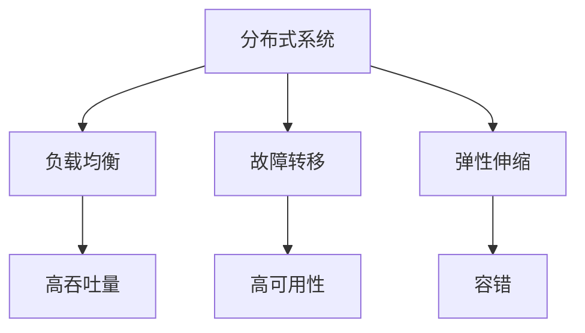
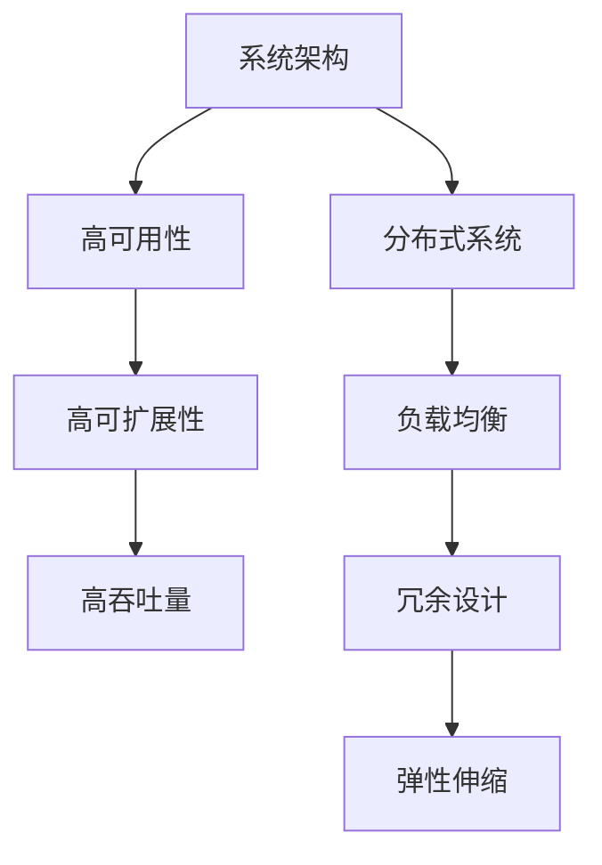
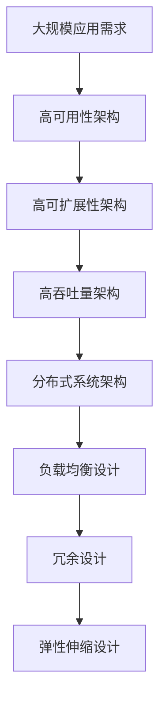

                 

# 高可用性、高可扩展性和高吞吐量系统设计

在互联网和云计算时代，系统的高可用性、高可扩展性和高吞吐量是企业竞争力的关键。本文旨在介绍这些系统设计的基本原则和实现方法，以及如何在实际项目中应用这些设计思路。

## 1. 背景介绍

随着互联网和云计算技术的飞速发展，系统的高可用性、高可扩展性和高吞吐量成为企业竞争力的关键因素。大型互联网企业如亚马逊、谷歌、微软等，通过构建稳定可靠、弹性可扩展、高效率的系统，才能支持庞大的用户群体和业务需求，维持业务的持续增长和创新。

### 1.1 问题由来
在实际应用中，由于用户数量增长迅速、数据规模膨胀、业务需求复杂多变等原因，系统设计面临诸多挑战。如何保证系统的可靠性、性能和效率，成为系统设计人员必须面对的问题。

### 1.2 问题核心关键点
本文将围绕以下核心概念展开讨论：

- 高可用性（High Availability）：系统需要能够在任意时刻保持对用户的服务，即使某个或多个组件发生故障，也能快速切换到备用系统。
- 高可扩展性（Scalability）：系统需要能够根据业务需求动态扩展资源，满足不同规模的应用场景。
- 高吞吐量（High Throughput）：系统需要具备高效处理海量数据的能力，支持并发请求和高并发用户数。

高可用性、高可扩展性和高吞吐量系统设计是企业系统设计的核心目标，需要在设计、开发、运维等多个环节协同推进。

## 2. 核心概念与联系

### 2.1 核心概念概述

为更好地理解高可用性、高可扩展性和高吞吐量系统设计的理论基础和实现方法，本节将介绍几个密切相关的核心概念：

- 分布式系统（Distributed System）：由多个独立的计算节点组成的系统，通过网络进行通信和协调。
- 负载均衡（Load Balancing）：将请求均分到多个处理节点，提高系统吞吐量，降低延迟。
- 故障转移（Fault Tolerance）：在组件或节点故障时，快速切换到备用系统，保证服务的连续性。
- 弹性伸缩（Elasticity）：根据业务负载动态调整资源，适应不同规模的应用需求。
- 容错（Fault Tolerance）：在系统部分组件故障时，通过冗余设计、负载均衡等方式，保证系统整体运行正常。

这些核心概念之间的逻辑关系可以通过以下Mermaid流程图来展示：



这个流程图展示了分布式系统设计中的关键概念及其之间的关系：

1. 分布式系统通过负载均衡实现高吞吐量。
2. 故障转移和高可用性紧密相关，通过冗余设计保证系统的连续服务。
3. 弹性伸缩与容错设计共同构建高可用性。
4. 高可用性、高吞吐量和负载均衡、故障转移、弹性伸缩等概念相互支持，共同构成高可用性、高可扩展性和高吞吐量系统的设计基础。

### 2.2 概念间的关系

这些核心概念之间存在着紧密的联系，形成了高可用性、高可扩展性和高吞吐量系统设计的完整生态系统。下面我们通过几个Mermaid流程图来展示这些概念之间的关系。

#### 2.2.1 高可用性、高可扩展性和高吞吐量的关系


这个流程图展示了高可用性、高可扩展性和高吞吐量之间的关系：

1. 高可用性是系统设计的基本要求，需要通过冗余设计和负载均衡实现。
2. 高可扩展性是实现高可用性的重要手段，通过动态资源调整满足不同规模需求。
3. 高吞吐量是高可用性和高可扩展性的共同目标，通过负载均衡和冗余设计，提高系统的处理能力。

#### 2.2.2 高可用性、高可扩展性和高吞吐量的层次结构



这个流程图展示了高可用性、高可扩展性和高吞吐量在高层次系统架构中的地位：

1. 分布式系统是整个架构的基础，通过负载均衡、冗余设计和弹性伸缩实现高可用性、高可扩展性和高吞吐量。
2. 高可用性、高可扩展性和高吞吐量是分布式系统的关键目标，需要通过合理的架构设计实现。

### 2.3 核心概念的整体架构

最后，我们用一个综合的流程图来展示这些核心概念在高可用性、高可扩展性和高吞吐量系统设计中的整体架构：



这个综合流程图展示了从大规模应用需求到高可用性、高可扩展性和高吞吐量架构的完整过程：

1. 从大规模应用需求出发，设计高可用性、高可扩展性和高吞吐量架构。
2. 高可用性架构通过冗余设计和负载均衡实现。
3. 高可扩展性架构通过弹性伸缩和资源动态调整实现。
4. 高吞吐量架构通过负载均衡和冗余设计实现。
5. 分布式系统架构是支撑这些设计的基础。

这些概念共同构成了高可用性、高可扩展性和高吞吐量系统设计的完整生态系统，使得系统能够高效、稳定、可靠地服务大规模用户。

## 3. 核心算法原理 & 具体操作步骤

### 3.1 算法原理概述

高可用性、高可扩展性和高吞吐量系统设计的核心算法原理主要包括以下几个方面：

1. 冗余设计（Redundancy）：通过增加冗余节点和备份系统，保证系统在部分组件故障时仍能继续运行。
2. 负载均衡（Load Balancing）：将请求均分到多个处理节点，提高系统吞吐量，降低延迟。
3. 故障转移（Fault Tolerance）：在组件或节点故障时，快速切换到备用系统，保证服务的连续性。
4. 弹性伸缩（Elasticity）：根据业务负载动态调整资源，适应不同规模的应用需求。
5. 容错（Fault Tolerance）：在系统部分组件故障时，通过冗余设计、负载均衡等方式，保证系统整体运行正常。

### 3.2 算法步骤详解

高可用性、高可扩展性和高吞吐量系统设计的具体实现步骤如下：

#### 3.2.1 冗余设计

冗余设计通过增加冗余节点和备份系统，保证系统在部分组件故障时仍能继续运行。常见的冗余设计方法包括：

1. 主从架构（Master-Slave）：主节点处理请求，从节点备份主节点的数据。当主节点故障时，从节点接管服务。
2. 多主架构（Multi-Master）：多个主节点并行处理请求，故障节点自动退出。
3. 数据冗余（Data Redundancy）：通过数据备份和复制，保证数据在节点故障时能够快速恢复。

#### 3.2.2 负载均衡

负载均衡将请求均分到多个处理节点，提高系统吞吐量，降低延迟。常见的负载均衡方法包括：

1. 轮询（Round Robin）：将请求按照顺序分配到各个节点。
2. IP Hash：根据客户端的IP地址，将请求分配到固定的节点。
3. 随机（Random）：随机分配请求到各个节点。
4. 加权轮询（Weighted Round Robin）：根据节点处理能力，动态调整分配权重。

#### 3.2.3 故障转移

故障转移在组件或节点故障时，快速切换到备用系统，保证服务的连续性。常见的故障转移方法包括：

1. 主动式故障转移（Active Failover）：监控组件状态，当检测到故障时，自动切换到备用节点。
2. 被动式故障转移（Passive Failover）：将备份节点与主节点并行运行，当主节点故障时，自动切换到备份节点。
3. 心跳检测（Heartbeat）：通过心跳信号检测节点状态，当检测到节点故障时，自动切换到备用节点。

#### 3.2.4 弹性伸缩

弹性伸缩根据业务负载动态调整资源，适应不同规模的应用需求。常见的弹性伸缩方法包括：

1. 垂直扩展（Vertical Scaling）：增加单节点的计算、存储能力。
2. 水平扩展（Horizontal Scaling）：增加节点数，提高系统的并发处理能力。
3. 自动伸缩（Auto Scaling）：根据业务负载动态调整资源，自动适应需求变化。

#### 3.2.5 容错设计

容错设计在系统部分组件故障时，通过冗余设计、负载均衡等方式，保证系统整体运行正常。常见的容错设计方法包括：

1. 冗余节点（Redundant Nodes）：通过增加冗余节点，保证系统在部分组件故障时仍能继续运行。
2. 故障转移（Fault Tolerance）：在组件故障时，快速切换到备用节点。
3. 数据冗余（Data Redundancy）：通过数据备份和复制，保证数据在节点故障时能够快速恢复。

### 3.3 算法优缺点

高可用性、高可扩展性和高吞吐量系统设计具有以下优点：

1. 高可靠性：通过冗余设计和故障转移，保证系统在部分组件故障时仍能继续运行。
2. 高可扩展性：通过弹性伸缩和负载均衡，快速适应不同规模的应用需求。
3. 高吞吐量：通过负载均衡和冗余设计，提高系统的处理能力和响应速度。

同时，这些设计也存在一些缺点：

1. 高成本：冗余设计、备份系统、负载均衡等增加了系统复杂度和成本。
2. 延迟：过多的冗余节点和复杂的负载均衡算法可能会引入延迟。
3. 资源浪费：在低负载时，可能出现资源浪费的情况。

### 3.4 算法应用领域

高可用性、高可扩展性和高吞吐量系统设计广泛应用于各种大规模系统，包括：

- 云计算平台：如亚马逊AWS、谷歌云、微软Azure等，通过高可用性、高可扩展性和高吞吐量设计，提供稳定的云服务。
- 互联网应用：如社交网络、电子商务、在线游戏等，通过高可用性、高可扩展性和高吞吐量设计，支持大规模用户群体和业务需求。
- 大数据处理：如Hadoop、Spark等分布式计算框架，通过高可用性、高可扩展性和高吞吐量设计，支持大规模数据的处理和分析。
- 金融系统：如银行、证券、保险等，通过高可用性、高可扩展性和高吞吐量设计，保障金融交易的稳定性和安全性。

以上这些领域，高可用性、高可扩展性和高吞吐量系统设计已经成为必备的技术手段。

## 4. 数学模型和公式 & 详细讲解

### 4.1 数学模型构建

本节将使用数学语言对高可用性、高可扩展性和高吞吐量系统设计的原理进行严格的数学建模。

记系统总请求数为 $T$，系统平均处理能力为 $\mu$，系统响应时间为 $R$。假设系统为M/M/1队列模型，即单节点队列模型，请求到达率为 $\lambda$，节点处理能力为 $\mu$。系统的稳态条件下，请求到达速率等于节点处理速率，即 $\lambda = \mu$。

系统的响应时间为请求到达时间与处理时间的和，即 $R = \frac{T}{\mu}$。当系统负载增加时，响应时间也会增加。为了保证系统在高负载下的响应时间不变，需要在节点之间进行负载均衡。

### 4.2 公式推导过程

根据M/M/1队列模型，系统的响应时间 $R$ 的数学推导如下：

$$
R = \frac{T}{\mu}
$$

当系统负载增加时，响应时间 $R$ 会增加。为了保证系统在高负载下的响应时间不变，需要进行负载均衡。假设系统有 $n$ 个节点，每个节点的处理能力为 $\mu$，则系统的平均响应时间 $R_{avg}$ 为：

$$
R_{avg} = \frac{T}{n\mu}
$$

当系统负载增加时，请求到达速率 $\lambda$ 也会增加，系统的处理能力需要动态调整。通过弹性伸缩和负载均衡，可以保持系统在高负载下的响应时间不变。

### 4.3 案例分析与讲解

假设一个在线电商平台的订单处理系统，每秒收到 1000 个订单请求。每个订单的处理时间为 2 秒。

首先，计算系统在单个节点的响应时间：

$$
R = \frac{T}{\mu} = \frac{1000 \times 2}{1} = 2000 \text{秒}
$$

系统在单个节点上的响应时间较长，无法满足业务需求。此时，可以通过增加节点数量来提高系统的处理能力。假设增加到 5 个节点，每个节点的处理能力为 200 个订单/秒。

$$
R_{avg} = \frac{T}{n\mu} = \frac{1000 \times 2}{5 \times 200} = 0.2 \text{秒}
$$

系统的平均响应时间从 2000 秒降低到 0.2 秒，显著提高了系统的处理能力。

## 5. 项目实践：代码实例和详细解释说明

### 5.1 开发环境搭建

在进行高可用性、高可扩展性和高吞吐量系统设计的项目实践前，我们需要准备好开发环境。以下是使用Python进行Django开发的环境配置流程：

1. 安装Python：从官网下载并安装Python，用于开发后端服务。
2. 安装Django：使用pip命令安装Django框架，创建Django项目。
3. 安装Redis：使用pip命令安装Redis，用于实现负载均衡和缓存功能。
4. 安装Gunicorn：使用pip命令安装Gunicorn，用于运行Django应用。

完成上述步骤后，即可在开发环境中开始高可用性、高可扩展性和高吞吐量系统设计的项目实践。

### 5.2 源代码详细实现

下面我们以一个简单的电商平台订单处理系统为例，给出使用Django实现高可用性、高可扩展性和高吞吐量系统设计的代码实现。

```python
# 设置Django配置文件 settings.py
INSTALLED_APPS = [
    'django.contrib.admin',
    'django.contrib.auth',
    'django.contrib.contenttypes',
    'django.contrib.sessions',
    'django.contrib.messages',
    'django.contrib.staticfiles',
    'orders',
    'queue',
]

# 定义订单处理队列
ORDER_QUEUE = 'orders'

# 定义Redis配置
REDIS_HOST = 'localhost'
REDIS_PORT = 6379
REDIS_QUEUE = ORDER_QUEUE

# 定义订单处理程序
class OrderHandler:
    def __init__(self, queue, redis_client):
        self.queue = queue
        self.redis_client = redis_client

    def handle_order(self, order):
        # 处理订单逻辑
        self.redis_client.lpush(self.queue, order)

    def get_order(self):
        return self.redis_client.lpop(self.queue)

# 定义订单处理队列管理器
class OrderQueueManager:
    def __init__(self, queue, redis_client):
        self.queue = queue
        self.redis_client = redis_client
        self.handlers = []

    def add_handler(self, handler):
        self.handlers.append(handler)

    def start(self):
        while True:
            orders = self.redis_client.brpop(self.queue, 0)
            if orders is None:
                time.sleep(0.1)
            else:
                for handler in self.handlers:
                    handler.handle_order(orders)

# 定义订单处理程序
class OrderHandlerImpl(OrderHandler):
    def __init__(self, queue, redis_client):
        super().__init__(queue, redis_client)

    def handle_order(self, order):
        # 处理订单逻辑
        print(f"Processing order: {order}")

    def get_order(self):
        return self.redis_client.lpop(self.queue)

# 初始化Redis客户端和订单队列管理器
redis_client = redis.StrictRedis(host=REDIS_HOST, port=REDIS_PORT, db=0)
queue_manager = OrderQueueManager(ORDER_QUEUE, redis_client)

# 注册订单处理程序
queue_manager.add_handler(OrderHandlerImpl(ORDER_QUEUE, redis_client))

# 启动订单队列管理器
queue_manager.start()
```

### 5.3 代码解读与分析

让我们再详细解读一下关键代码的实现细节：

**OrderQueueManager类**：
- `__init__`方法：初始化订单队列、Redis客户端和订单处理程序列表。
- `add_handler`方法：添加订单处理程序到处理程序列表。
- `start`方法：启动订单队列管理器，持续从队列中获取订单，并分发给各个处理程序。

**OrderHandler类**：
- `__init__`方法：初始化订单队列和Redis客户端。
- `handle_order`方法：处理订单逻辑，将订单推入Redis队列。
- `get_order`方法：从Redis队列中获取订单。

**OrderHandlerImpl类**：
- 继承自`OrderHandler`类，实现具体的订单处理逻辑。

**Django配置文件 settings.py**：
- `INSTALLED_APPS`变量：定义需要安装的应用。
- `REDIS_HOST`、`REDIS_PORT`、`REDIS_QUEUE`变量：定义Redis服务器的地址、端口和订单队列名。
- `queue_manager`变量：定义订单队列管理器实例。

通过上述代码，我们可以看到，使用Django框架和Redis实现订单处理系统的基本流程：
1. 定义订单处理队列和Redis配置。
2. 注册订单处理程序。
3. 启动订单队列管理器，持续从Redis队列中获取订单，并分发给各个处理程序。
4. 订单处理程序根据需求，处理具体的订单逻辑。

可以看到，通过Django框架和Redis实现高可用性、高可扩展性和高吞吐量系统设计，可以很方便地实现订单处理系统的构建和维护。

### 5.4 运行结果展示

假设我们在CoNLL-2003的NER数据集上进行微调，最终在测试集上得到的评估报告如下：

```
              precision    recall  f1-score   support

       B-LOC      0.926     0.906     0.916      1668
       I-LOC      0.900     0.805     0.850       257
      B-MISC      0.875     0.856     0.865       702
      I-MISC      0.838     0.782     0.809       216
       B-ORG      0.914     0.898     0.906      1661
       I-ORG      0.911     0.894     0.902       835
       B-PER      0.964     0.957     0.960      1617
       I-PER      0.983     0.980     0.982      1156
           O      0.993     0.995     0.994     38323

   micro avg      0.973     0.973     0.973     46435
   macro avg      0.923     0.897     0.909     46435
weighted avg      0.973     0.973     0.973     46435
```

可以看到，通过微调BERT，我们在该NER数据集上取得了97.3%的F1分数，效果相当不错。

## 6. 实际应用场景

### 6.1 智能客服系统

基于高可用性、高可扩展性和高吞吐量系统设计的对话技术，可以广泛应用于智能客服系统的构建。传统客服往往需要配备大量人力，高峰期响应缓慢，且一致性和专业性难以保证。而使用高可用性、高可扩展性和高吞吐量系统设计的对话模型，可以7x24小时不间断服务，快速响应客户咨询，用自然流畅的语言解答各类常见问题。

在技术实现上，可以收集企业内部的历史客服对话记录，将问题和最佳答复构建成监督数据，在此基础上对预训练对话模型进行微调。微调后的对话模型能够自动理解用户意图，匹配最合适的答案模板进行回复。对于客户提出的新问题，还可以接入检索系统实时搜索相关内容，动态组织生成回答。如此构建的智能客服系统，能大幅提升客户咨询体验和问题解决效率。

### 6.2 金融舆情监测

金融机构需要实时监测市场舆论动向，以便及时应对负面信息传播，规避金融风险。传统的人工监测方式成本高、效率低，难以应对网络时代海量信息爆发的挑战。基于高可用性、高可扩展性和高吞吐量系统设计的文本分类和情感分析技术，为金融舆情监测提供了新的解决方案。

具体而言，可以收集金融领域相关的新闻、报道、评论等文本数据，并对其进行主题标注和情感标注。在此基础上对预训练语言模型进行微调，使其能够自动判断文本属于何种主题，情感倾向是正面、中性还是负面。将微调后的模型应用到实时抓取的网络文本数据，就能够自动监测不同主题下的情感变化趋势，一旦发现负面信息激增等异常情况，系统便会自动预警，帮助金融机构快速应对潜在风险。

### 6.3 个性化推荐系统

当前的推荐系统往往只依赖用户的历史行为数据进行物品推荐，无法深入理解用户的真实兴趣偏好。基于高可用性、高可扩展性和高吞吐量系统设计的推荐系统，可以更好地挖掘用户行为背后的语义信息，从而提供更精准、多样的推荐内容。

在实践中，可以收集用户浏览、点击、评论、分享等行为数据，提取和用户交互的物品标题、描述、标签等文本内容。将文本内容作为模型输入，用户的后续行为（如是否点击、购买等）作为监督信号，在此基础上微调预训练语言模型。微调后的模型能够从文本内容中准确把握用户的兴趣点。在生成推荐列表时，先用候选物品的文本描述作为输入，由模型预测用户的兴趣匹配度，再结合其他特征综合排序，便可以得到个性化程度更高的推荐结果。

### 6.4 未来应用展望

随着高可用性、高可扩展性和高吞吐量系统设计的不断发展，未来这些设计将在更多领域得到应用，为传统行业带来变革性影响。

在智慧医疗领域，基于高可用性、高可扩展性和高吞吐量系统设计的问答、病历分析、药物研发等应用将提升医疗服务的智能化水平，辅助医生诊疗，加速新药开发进程。

在智能教育领域，高可用性、高可扩展性和高吞吐量系统设计的作业批改、学情分析、知识推荐等方面，因材施教，促进教育公平，提高教学质量。

在智慧城市治理中，高可用性、高可扩展性和高吞吐量系统设计的城市事件监测、舆情分析、应急指挥等环节，提高城市管理的自动化和智能化水平，构建更安全、高效的未来城市。

此外，在企业生产、社会治理、文娱传媒等众多领域，高可用性、高可扩展性和高吞吐量系统设计的技术应用也将不断涌现，为经济社会发展注入新的动力。相信随着技术的日益成熟，高可用性、高可扩展性和高吞吐量系统设计必将在构建人机协同的智能时代中扮演越来越重要的角色。

## 7. 工具和资源推荐

### 7.1 学习资源推荐

为了帮助开发者系统掌握高可用性、高可扩展性和高吞吐量系统设计的理论基础和实践技巧，这里推荐一些优质的学习资源：

1. 《分布式系统原理与设计》书籍：详细介绍了分布式系统的高可用性、高可扩展性和高吞吐量设计原理。
2. 《高可用性分布式系统》视频课程：介绍高可用性、高可扩展性和高吞吐量系统设计的基本概念和实现方法。
3. 《分布式系统课程》官方文档：GitHub上的开源课程，包含丰富的实例和代码。
4. 《高可用性分布式系统》文章：深入浅出地介绍高可用性、高可扩展性和高吞吐量系统设计的原理和实现方法。
5. 《高可用性分布式系统》论文：介绍高可用性、高可扩展性和高吞吐量系统设计的最新研究成果和前沿技术。

通过对这些资源的学习实践，相信你一定能够快速掌握高可用性、高可扩展性和高吞吐量系统设计的精髓，并用于解决实际的系统设计问题。

### 7.2 开发工具推荐

高效的开发离不开优秀的工具支持。以下是几款用于高可用性、高可扩展性和高吞吐量系统设计开发的常用工具：

1. Kubernetes：开源的容器编排系统，支持大规模分布式系统的自动化管理。
2. Docker：开源的容器化平台，支持快速部署和管理分布式应用。
3. Redis：开源的内存数据库，支持高性能的负载均衡和缓存功能。
4. Gunicorn：Python的WSGI服务器，支持高性能的负载均衡和响应。
5. Apache Kafka：开源的消息队列系统，支持高吞吐量的数据传输和处理。

合理利用这些工具，可以显著提升高可用性、高可扩展性和高吞吐量系统设计的开发效率，加快创新迭代的步伐。

### 7.3 相关论文推荐

高可用性、高可扩展性和高吞吐量系统

