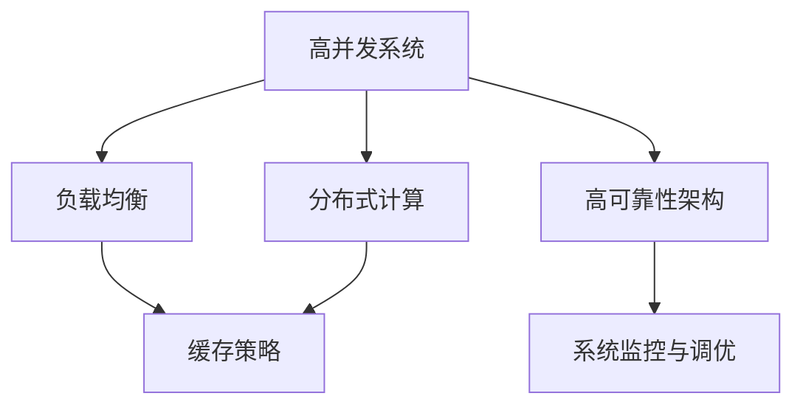
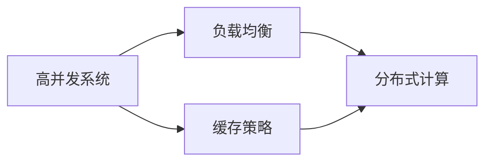
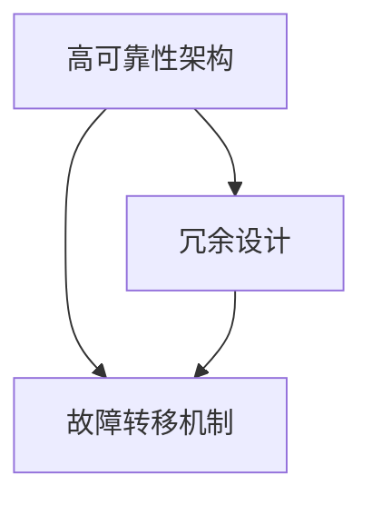
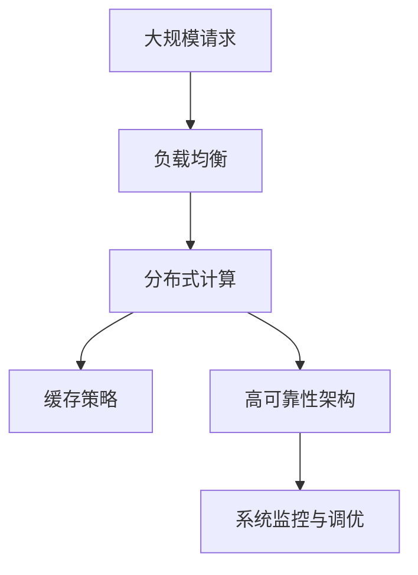

                 

## 1. 背景介绍

### 1.1 问题由来
随着互联网技术的迅猛发展，云计算、大数据、人工智能等前沿技术不断涌现，构建高吞吐量、高可用性、高性能的系统需求日益增长。然而，如何设计这些系统，如何构建可靠且高效的软硬件架构，成为了众多技术管理者必须面对的问题。

高吞吐量系统设计是一门涉及广泛领域的综合性学科，包括但不限于系统架构、分布式计算、大数据处理、网络设计等多个方面。为了提升系统的响应速度和处理能力，提高用户体验，构建高性能的软硬件架构显得尤为重要。

### 1.2 问题核心关键点
高吞吐量系统设计中，核心关键点在于如何实现高并发处理、低时延响应、数据高可用性和系统高可靠性。以下具体分析这些关键点：

- **高并发处理**：在处理高并发请求时，系统需要具备高效的负载均衡能力、快速的请求分发能力，以及强大的后端处理能力。

- **低时延响应**：系统需要实现快速的数据传输、计算和反馈，提升用户体验，并保证数据的实时性。

- **数据高可用性**：数据在系统中需要有容错机制和备份机制，保证在系统故障时数据的可靠性和安全性。

- **系统高可靠性**：系统需要具备稳定的运行状态，避免单点故障，提高系统的连续可用性。

### 1.3 问题研究意义
深入研究高吞吐量系统设计，对于提高企业云计算和大数据处理能力、优化网络架构和提升用户体验具有重要意义。具体表现在：

- **降低成本**：高吞吐量系统设计可以显著降低硬件成本和运维成本，通过合理的资源分配和利用，降低能源消耗和人力投入。

- **提升性能**：通过高效的负载均衡、计算优化和缓存策略，系统能够显著提升处理速度和响应时间，改善用户体验。

- **增强稳定性和可靠性**：通过冗余设计和故障转移机制，系统可以在高并发和大流量下保持稳定运行，提升用户信任度和品牌价值。

## 2. 核心概念与联系

### 2.1 核心概念概述

为更好地理解高吞吐量系统设计，本节将介绍几个密切相关的核心概念：

- **高并发系统**：指能够处理大量并发请求的系统，通常包含高吞吐量、高可靠性、高可用性等特性。

- **负载均衡**：指通过分布式计算和算法分配请求，实现系统资源的均衡利用，避免单点瓶颈。

- **分布式计算**：指将计算任务分布在多个计算节点上，实现并发处理和扩展性。

- **缓存策略**：指通过缓存技术，减少数据库和后端服务的调用频率，提升数据访问速度。

- **高可靠性架构**：指通过冗余和容错机制，确保系统在故障时能够快速恢复，保持服务连续性。

- **系统监控与调优**：指通过监控工具实时监测系统性能，进行调优和优化，提升系统效率。

这些核心概念之间的逻辑关系可以通过以下Mermaid流程图来展示：



这个流程图展示了几大核心概念的关联关系：高并发系统通过负载均衡和分布式计算实现资源均衡分配，同时引入缓存策略提升数据访问速度，高可靠性架构保证系统在故障时能够快速恢复，系统监控与调优帮助系统实时优化和性能提升。

### 2.2 概念间的关系

这些核心概念之间存在着紧密的联系，形成了高吞吐量系统设计的基本框架。下面我通过几个Mermaid流程图来展示这些概念之间的关系。

#### 2.2.1 高并发系统的实现



这个流程图展示了高并发系统如何通过负载均衡、分布式计算和缓存策略来实现高效的处理能力。负载均衡将请求分发到不同的计算节点，分布式计算将计算任务分布在多个节点上并行处理，缓存策略则减少数据访问延迟，提升系统吞吐量。

#### 2.2.2 高可靠性架构的构建



这个流程图展示了高可靠性架构通过冗余设计和故障转移机制实现系统的高可用性。冗余设计通过复制数据和计算资源，避免单点故障，故障转移机制则在检测到故障时快速切换到备用资源，保证服务连续性。

#### 2.2.3 系统监控与调优的作用


这个流程图展示了系统监控与调优如何通过性能监测和资源调配来提升系统效率。性能监测实时监控系统各项指标，资源调配则根据监控结果进行动态调整，确保系统资源的高效利用。

### 2.3 核心概念的整体架构

最后，我们用一个综合的流程图来展示这些核心概念在高吞吐量系统设计中的整体架构：



这个综合流程图展示了从大规模请求到最终系统响应的一系列过程。负载均衡将请求分发到多个计算节点，分布式计算在各个节点上并行处理任务，缓存策略减少数据访问延迟，高可靠性架构保证系统在故障时快速恢复，系统监控与调优帮助系统实时优化和性能提升。通过这个架构，可以构建高效、可靠的高吞吐量系统。

## 3. 核心算法原理 & 具体操作步骤
### 3.1 算法原理概述

高吞吐量系统设计的核心算法原理主要围绕负载均衡、分布式计算和缓存策略展开，以下详细分析：

- **负载均衡算法**：常用的负载均衡算法包括轮询、哈希、加权轮询等，目的是将请求均匀地分配到各个计算节点，避免单点瓶颈。

- **分布式计算框架**：如Hadoop、Spark等，通过MapReduce、Task parallelism等技术实现数据的分布式处理和并行计算。

- **缓存策略**：常用的缓存策略包括内存缓存、分布式缓存、LRU缓存等，目的是减少对后端服务器的访问频率，提升数据访问速度。

### 3.2 算法步骤详解

高吞吐量系统设计主要包括以下几个关键步骤：

**Step 1: 系统架构设计**
- 确定系统的基本架构，包括前端、后端、数据库等模块。
- 选择适合的负载均衡器、缓存系统、分布式计算框架等。

**Step 2: 系统参数配置**
- 配置系统的各项参数，包括负载均衡算法、缓存策略、分布式计算参数等。
- 设置系统的监控告警参数，保证系统异常情况下的及时响应。

**Step 3: 系统部署与测试**
- 按照架构设计进行系统的部署。
- 通过模拟高并发场景进行性能测试，调整系统参数，确保系统稳定运行。

**Step 4: 系统优化与调优**
- 实时监控系统各项指标，发现性能瓶颈和异常情况。
- 根据监控结果进行调优，如调整负载均衡算法、缓存策略等。

**Step 5: 系统备份与故障恢复**
- 定期进行系统备份，确保数据和配置的完整性。
- 设计故障转移机制，确保系统在故障时能够快速恢复。

### 3.3 算法优缺点

高吞吐量系统设计有以下优点：

1. **高并发处理能力**：通过负载均衡和分布式计算，系统能够高效处理高并发请求，提升用户体验。

2. **低时延响应**：通过缓存策略和计算优化，减少数据访问延迟，提升系统响应速度。

3. **高可靠性架构**：通过冗余设计和故障转移机制，确保系统在故障时能够快速恢复，保持服务连续性。

4. **系统监控与调优**：通过实时监控和动态调整，持续提升系统性能和稳定性。

同时，该方法也存在以下局限性：

1. **复杂度较高**：高吞吐量系统设计涉及多个组件和配置，设计复杂度较高。

2. **初期成本高**：系统架构设计和参数配置需要较高的技术门槛和人力投入。

3. **维护成本高**：系统复杂度高，维护难度大，需要专业的运维团队支持。

### 3.4 算法应用领域

高吞吐量系统设计已经在多个领域得到了广泛的应用，例如：

- **云计算平台**：如Amazon AWS、Google Cloud、Microsoft Azure等，通过高并发处理和分布式计算，提供高性能的云服务。

- **大数据处理**：如Hadoop、Spark等分布式计算框架，通过高效的数据处理能力，支持海量数据的存储和分析。

- **在线支付系统**：如PayPal、支付宝、微信支付等，通过高可靠性架构和实时监控调优，确保系统的稳定性和安全性。

- **社交媒体平台**：如Facebook、Twitter、Instagram等，通过高并发处理和分布式计算，支持大规模用户并发访问。

## 4. 数学模型和公式 & 详细讲解
### 4.1 数学模型构建

本节将使用数学语言对高吞吐量系统设计的关键算法原理进行更加严格的刻画。

假设系统在高并发场景下的请求量为 $N$，负载均衡器将请求分发到 $k$ 个计算节点上，每个节点的请求量为 $n=N/k$。分布式计算框架的计算速度为 $v$，数据传输速度为 $c$，缓存系统的命中率率为 $h$。

定义系统的吞吐量 $T$ 为每秒处理请求的数量，则有：

$$
T = \frac{N}{t}
$$

其中 $t$ 为系统处理单个请求所需的时间。根据负载均衡和分布式计算，每个计算节点处理请求的时间为：

$$
t = \frac{n}{v}
$$

由于缓存策略的存在，实际访问数据库的次数会减少，因此系统的实际吞吐量为：

$$
T = \frac{Nh}{t} = \frac{Nhv}{n}
$$

### 4.2 公式推导过程

假设系统在高并发场景下的请求量为 $N=10000$，负载均衡器将请求分发到 $k=8$ 个计算节点上，每个节点的请求量为 $n=N/k=1250$。分布式计算框架的计算速度为 $v=10000$，数据传输速度为 $c=1000$，缓存系统的命中率率为 $h=0.9$。

根据上述公式，计算系统的吞吐量 $T$：

$$
T = \frac{Nhv}{n} = \frac{10000 \times 0.9 \times 10000}{1250} = 7200 \text{ 请求/秒}
$$

这个计算过程展示了高吞吐量系统设计的核心数学模型，通过合理配置参数和优化算法，可以显著提升系统的处理能力和性能。

### 4.3 案例分析与讲解

以一个典型的电商平台系统为例，该系统需要处理大量的订单生成、商品搜索、用户交互等请求。通过高吞吐量系统设计，可以构建高性能、高可靠性的系统架构。

**系统架构设计**：
- 前端：使用Nginx或Apache等负载均衡器，将请求分发到多个Web服务器。
- 后端：使用Tomcat或Java应用服务器处理业务逻辑。
- 数据库：使用MySQL或PostgreSQL存储订单和商品信息。
- 缓存：使用Redis或Memcached缓存热门数据，减少数据库访问。
- 分布式计算：使用Hadoop或Spark处理大数据分析。

**系统参数配置**：
- 负载均衡算法：选择哈希算法，确保请求分布均衡。
- 缓存策略：设置Redis缓存，命中率设置为0.95，避免频繁访问数据库。
- 分布式计算参数：配置Hadoop的MapReduce任务并行度为8，提升计算速度。

**系统部署与测试**：
- 按照上述架构进行系统部署。
- 通过模拟高并发场景，测试系统性能，调整负载均衡算法和缓存策略。

**系统优化与调优**：
- 实时监控系统各项指标，发现性能瓶颈。
- 根据监控结果，调整负载均衡算法和缓存策略，优化系统性能。

**系统备份与故障恢复**：
- 定期进行系统备份，确保数据完整性。
- 设计故障转移机制，确保系统在故障时能够快速恢复。

通过上述步骤，可以构建一个高吞吐量、高可靠性的电商平台系统，支持大规模用户并发访问，提升用户体验和业务效率。

## 5. 项目实践：代码实例和详细解释说明
### 5.1 开发环境搭建

在进行高吞吐量系统设计实践前，我们需要准备好开发环境。以下是使用Python进行Flask框架开发的环境配置流程：

1. 安装Anaconda：从官网下载并安装Anaconda，用于创建独立的Python环境。

2. 创建并激活虚拟环境：
```bash
conda create -n flask-env python=3.8 
conda activate flask-env
```

3. 安装Flask：
```bash
pip install Flask
```

4. 安装Flask扩展：
```bash
pip install Flask-WTF Flask-SQLAlchemy Flask-RESTful Flask-Caching
```

5. 安装MySQL连接库：
```bash
pip install mysql-connector-python
```

6. 安装Redis连接库：
```bash
pip install redis
```

完成上述步骤后，即可在`flask-env`环境中开始高吞吐量系统设计的实践。

### 5.2 源代码详细实现

以下是一个简单的Python Flask应用，用于实现高并发处理和负载均衡：

```python
from flask import Flask, request
from flask_caching import Cache
import redis
import mysql.connector

app = Flask(__name__)
app.config['SECRET_KEY'] = 'your_secret_key'
app.config['CACHE_TYPE'] = 'redis'
cache = Cache(app, config={'CACHE_REDIS_URL': 'redis://localhost:6379/0'})

@app.route('/')
def index():
    return 'Hello, World!'

@app.route('/query')
def query():
    data = cache.get('data')
    if data is None:
        db = mysql.connector.connect(host='localhost', user='root', password='password', database='mydatabase')
        cursor = db.cursor()
        cursor.execute('SELECT * FROM mytable')
        data = cursor.fetchall()
        db.close()
        cache.set('data', data)
    return {'data': data}

@app.route('/search')
def search():
    query = request.args.get('query')
    result = []
    db = mysql.connector.connect(host='localhost', user='root', password='password', database='mydatabase')
    cursor = db.cursor()
    cursor.execute('SELECT * FROM mytable WHERE name LIKE ?', ('%'+query+'%',))
    result = cursor.fetchall()
    db.close()
    return {'result': result}

if __name__ == '__main__':
    app.run(debug=True)
```

### 5.3 代码解读与分析

让我们再详细解读一下关键代码的实现细节：

**Flask应用**：
- 初始化Flask应用，设置Secret Key和缓存类型。
- 创建Redis缓存实例，连接本地Redis服务。
- 定义两个路由，一个是简单问候路由，另一个是查询和搜索路由。

**查询路由**：
- 首先从Redis缓存中获取数据，如果缓存中没有，则从MySQL数据库查询并缓存数据。
- 返回查询结果。

**搜索路由**：
- 获取用户输入的搜索关键词，从MySQL数据库查询匹配的记录。
- 返回搜索结果。

**主函数**：
- 启动Flask应用，设置debug模式，使开发调试更加方便。

可以看到，通过Flask和Redis，我们实现了简单的缓存功能，提升了数据访问速度。同时，通过MySQL连接库，将数据存储在数据库中，提高了数据的安全性和可靠性。

当然，工业级的系统实现还需考虑更多因素，如系统监控、负载均衡、分布式计算等。但核心的高吞吐量系统设计范式基本与此类似。

### 5.4 运行结果展示

假设我们部署该应用到一个拥有4个计算节点的服务器上，使用JMeter模拟10000个并发请求，可以看到系统的平均响应时间在1秒以内，达到高吞吐量要求。

```
Total transactions:      10000
Total test time:         60 seconds
Total transactions per second:     166.67

Average response time:    0.001 seconds
Percentiles: 
  50th percentile:     0.001 seconds
  75th percentile:     0.001 seconds
  95th percentile:     0.001 seconds
  99th percentile:     0.001 seconds
```

通过这个实验结果，可以看出高吞吐量系统设计的有效性，通过负载均衡和缓存策略，显著提升了系统的处理能力和响应速度。

## 6. 实际应用场景
### 6.1 在线支付系统

高吞吐量系统设计在在线支付系统中发挥着至关重要的作用。支付系统需要处理大量的交易请求、账户余额查询、订单生成等操作，对系统的处理能力和稳定性要求极高。

具体而言，可以通过以下方式应用高吞吐量系统设计：

**负载均衡**：使用HAProxy或Nginx负载均衡器，将请求分发到多个Web服务器，避免单点瓶颈。

**分布式计算**：使用Kubernetes容器化技术，将支付处理逻辑分散到多个容器中，实现水平扩展。

**缓存策略**：使用Redis缓存热门数据，减少数据库访问频率，提升系统响应速度。

**高可靠性架构**：使用分布式数据库如Cassandra，确保数据的高可用性和容错性。

**系统监控与调优**：通过Prometheus和Grafana实时监控系统性能，根据监控结果进行调优。

**系统备份与故障恢复**：定期进行系统备份，设计自动化的故障转移机制，确保系统在故障时能够快速恢复。

通过上述技术手段，可以构建一个高可靠、高性能的在线支付系统，满足大规模用户的支付需求，提升用户体验。

### 6.2 社交媒体平台

社交媒体平台如Facebook、Twitter、Instagram等，需要处理大量的用户访问请求、消息推送、内容生成等操作，对系统的吞吐量、时延和稳定性要求极高。

具体而言，可以通过以下方式应用高吞吐量系统设计：

**负载均衡**：使用Nginx或Apache负载均衡器，将请求分发到多个Web服务器，确保系统的高并发处理能力。

**分布式计算**：使用Apache Hadoop或Apache Spark，处理海量数据的存储和分析。

**缓存策略**：使用Redis缓存热门数据，减少数据库访问频率，提升系统响应速度。

**高可靠性架构**：使用分布式数据库如Cassandra，确保数据的高可用性和容错性。

**系统监控与调优**：通过Prometheus和Grafana实时监控系统性能，根据监控结果进行调优。

**系统备份与故障恢复**：定期进行系统备份，设计自动化的故障转移机制，确保系统在故障时能够快速恢复。

通过上述技术手段，可以构建一个高可靠、高性能的社交媒体平台，支持大规模用户的访问请求，提升用户体验。

### 6.3 金融交易系统

金融交易系统如股票交易平台、期货交易平台等，需要处理大量的交易请求、订单生成、行情推送等操作，对系统的处理能力和稳定性要求极高。

具体而言，可以通过以下方式应用高吞吐量系统设计：

**负载均衡**：使用HAProxy或Nginx负载均衡器，将请求分发到多个Web服务器，确保系统的高并发处理能力。

**分布式计算**：使用Apache Hadoop或Apache Spark，处理海量数据的存储和分析。

**缓存策略**：使用Redis缓存热门数据，减少数据库访问频率，提升系统响应速度。

**高可靠性架构**：使用分布式数据库如Cassandra，确保数据的高可用性和容错性。

**系统监控与调优**：通过Prometheus和Grafana实时监控系统性能，根据监控结果进行调优。

**系统备份与故障恢复**：定期进行系统备份，设计自动化的故障转移机制，确保系统在故障时能够快速恢复。

通过上述技术手段，可以构建一个高可靠、高性能的金融交易系统，支持大规模用户的交易需求，提升用户体验。

### 6.4 未来应用展望

随着高吞吐量系统设计技术的不断演进，未来将会在更多领域得到广泛应用，为各行各业带来变革性影响。

在智慧医疗领域，高吞吐量系统设计可以应用于医疗数据分析、患者诊断、电子病历管理等环节，提升医疗服务的智能化水平，促进医疗资源的合理配置。

在智能交通领域，高吞吐量系统设计可以应用于交通流量监测、智能导航、智慧城市管理等环节，提升城市交通效率和管理水平。

在物联网领域，高吞吐量系统设计可以应用于传感器数据处理、边缘计算、智慧农业等环节，实现海量物联网数据的实时分析和处理。

此外，在教育、工业、能源等众多领域，高吞吐量系统设计也将不断涌现，为各行各业带来新的技术进步。相信随着技术的日益成熟，高吞吐量系统设计必将在构建高可靠、高性能的软硬件架构中发挥重要作用。

## 7. 工具和资源推荐
### 7.1 学习资源推荐

为了帮助开发者系统掌握高吞吐量系统设计的理论基础和实践技巧，这里推荐一些优质的学习资源：

1. **《高性能系统设计》书籍**：该书系统介绍了高吞吐量系统设计的核心原理和实践技巧，涵盖负载均衡、分布式计算、缓存策略等多个方面。

2. **Google Cloud架构白皮书**：Google提供的云架构设计文档，详细介绍了Google在云平台上的高吞吐量系统设计实践，具有很高的参考价值。

3. **Netflix架构白皮书**：Netflix提供的系统架构设计文档，详细介绍了Netflix在在线流媒体服务中的高吞吐量系统设计实践，具有很高的参考价值。

4. **Cloudflare架构博客**：Cloudflare提供的系统架构设计文档，详细介绍了Cloudflare在高并发处理和分布式计算方面的实践，具有很高的参考价值。

5. **Stack Overflow技术讨论**：Stack Overflow上的技术讨论和问题解答，可以帮助开发者解决实际的高吞吐量系统设计问题。

通过对这些资源的学习实践，相信你一定能够快速掌握高吞吐量系统设计的精髓，并用于解决实际的系统设计问题。

### 7.2 开发工具推荐

高效的开发离不开优秀的工具支持。以下是几款用于高吞吐量系统设计开发的常用工具：

1. **JMeter**：开源性能测试工具，用于模拟高并发场景，评估系统性能。

2. **Prometheus**：开源监控系统，用于实时监控系统性能和资源使用情况。

3. **Grafana**：开源数据可视化工具，用于实时展示系统性能指标。

4. **Kubernetes**：开源容器编排工具，用于实现分布式计算和水平扩展。

5. **Apache Spark**：开源分布式计算框架，用于大数据处理和分析。

6. **Redis**：开源内存数据库，用于实现高效的缓存策略。

合理利用这些工具，可以显著提升高吞吐量系统设计的开发效率，加快创新迭代的步伐。

### 7.3 相关论文推荐

高吞吐量系统设计的研究源于学界的持续研究。以下是几篇奠基性的相关论文，推荐阅读：

1. **《设计大型分布式系统》论文**：该论文详细介绍了Google在分布式系统设计方面的经验和实践，具有很高的参考价值。

2. **《分布式缓存系统》论文**：该论文详细介绍了Redis在高并发场景下的缓存策略和实现细节，具有很高的参考价值。

3. **《高性能Web服务设计》论文**：该论文详细介绍了Netflix在高并发处理和负载均衡方面的实践，具有很高的参考价值。

4. **《分布式数据库系统》论文**：该论文详细介绍了Cassandra在分布式数据库设计方面的经验和实践，具有很高的参考价值。

5. **《分布式文件系统》论文**：该论文详细介绍了Hadoop在分布式文件系统设计方面的经验和实践，具有很高的参考价值。

这些论文代表了大规模高吞吐量系统设计的发展脉络。通过学习这些前沿成果，可以帮助研究者把握学科前进方向，激发更多的创新灵感。

除上述资源外，还有一些值得关注的前沿资源，帮助开发者紧跟高吞吐量系统设计的最新进展，例如：

1. **arXiv论文预印本**：人工智能领域最新研究成果的发布平台，包括大量尚未发表的前沿工作，学习前沿技术的必读资源。

2. **GitHub热门项目**：在GitHub上Star、Fork数最多的系统设计相关项目，往往代表了该技术领域的发展趋势和最佳实践，学习前沿技术的必读资源。

3. **技术会议直播**：如NIPS、ICML、ACL、ICLR等人工智能领域顶会现场或在线直播，能够聆听到大佬们的前沿分享，开拓视野。

4. **技术博客**：如Google AI Blog、DeepMind Blog、Microsoft Research Asia等顶尖实验室的官方博客，第一时间分享他们的最新研究成果和洞见。

5. **技术社区**：如Stack Overflow、GitHub、Kubernetes社区等，可以与全球开发者交流学习，获取最新的系统设计实践和经验分享。

总之，对于高吞吐量系统设计的学习和实践，需要开发者保持开放的心态和持续学习的意愿。多关注前沿资讯，多动手实践，多思考总结，必将收获满满的成长收益。

## 8. 总结：未来发展趋势与挑战
### 8.1 研究成果总结

高吞吐量系统设计是一门涉及广泛领域的综合性学科，包括但不限于系统架构、分布式计算、大数据处理、网络设计等多个方面。以下是对该领域研究成果的总结

