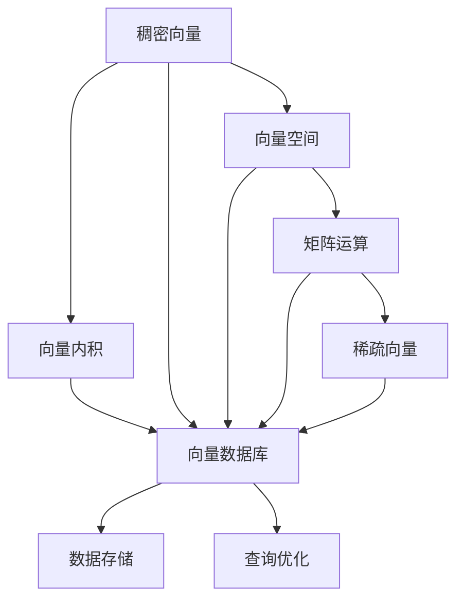
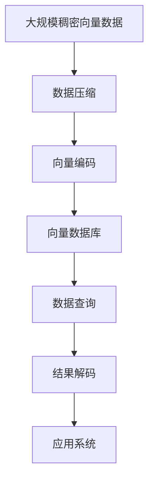

                 

## 1. 背景介绍

### 1.1 问题由来
在当今数字化时代，科学研究正变得越来越数据密集。从基因组学到天文学，从物理学到社会科学，研究人员越来越多地依赖于大量的数字数据来推动科学发现。然而，随着数据量的激增，传统的数据存储和查询方式已逐渐难以满足科学家的需求。性能瓶颈、存储成本、数据安全等问题逐渐显现，限制了科学研究的进展。

### 1.2 问题核心关键点
高性能向量数据库（Vector Database）的兴起，为解决这些问题提供了新的解决方案。向量数据库是一种专门针对大规模稠密向量数据设计的数据库系统，它利用数学向量空间的结构和运算特性，提供了极高的查询性能和灵活的模型支持。本文将详细探讨向量数据库的核心概念、原理及其实际应用场景，探讨其在科学研究中的重要作用。

### 1.3 问题研究意义
性能向量数据库在科学研究中的应用，对于推动科学发现、加速科学研究进程具有重要意义：

1. **提高数据处理效率**：向量数据库能够高效地处理大规模稠密向量数据，显著提高数据查询和分析的效率。
2. **支持复杂模型**：支持向量内积、矩阵运算等高级数学模型，适应科学研究中常用的复杂数学工具。
3. **降低存储成本**：通过压缩和编码技术，向量数据库能够高效存储和检索向量数据，降低存储和维护成本。
4. **保障数据安全**：采用先进的安全机制，确保科学数据的安全性和隐私保护。
5. **促进多学科合作**：支持多学科的数据共享和协作，推动跨学科研究的发展。

## 2. 核心概念与联系

### 2.1 核心概念概述

为更好地理解向量数据库的核心概念和相互联系，本节将详细介绍几个关键概念：

- **向量数据库（Vector Database）**：一种专门针对大规模稠密向量数据设计的特殊类型数据库系统。向量数据库支持高效的向量内积、矩阵运算等高级数学模型，并提供灵活的数据模型和查询接口。

- **稠密向量（Dense Vector）**：由一组连续的数值组成，每个位置保存一个实数。稠密向量常用于表示数据的特征向量、嵌入表示等。

- **稀疏向量（Sparse Vector）**：大部分位置为0的向量，仅保存非零位置的数值。稀疏向量用于表示数据中的特征缺失、非零特征重要性等。

- **向量内积（Vector Dot Product）**：两个向量点乘的结果，表示向量间相似度或相关性。向量内积是向量数据库中的核心操作。

- **矩阵运算（Matrix Operation）**：包括矩阵乘法、矩阵分解等，常用于处理大规模稠密矩阵数据。

- **向量空间（Vector Space）**：由一组向量组成的集合，每个向量都由一组数值表示，并定义了向量之间的加法、内积等运算。向量数据库利用向量空间的结构和运算特性，提供高效的向量计算和查询功能。

### 2.2 概念间的关系

这些核心概念之间的关系可以通过以下Mermaid流程图来展示：



这个流程图展示了稠密向量、向量内积、向量空间等核心概念如何通过向量数据库连接起来，并提供高效的数据存储和查询功能。

### 2.3 核心概念的整体架构

最后，我们用一个综合的流程图来展示这些核心概念在大规模稠密向量数据处理中的整体架构：



这个综合流程图展示了从数据输入到结果输出的完整流程，包括了数据压缩、向量编码、查询优化、结果解码等多个环节，共同构成了高性能向量数据库的核心功能。

## 3. 核心算法原理 & 具体操作步骤
### 3.1 算法原理概述

高性能向量数据库的核心算法原理主要基于以下几个方面：

- **向量内积加速**：通过优化向量内积的计算方式，利用GPU、CPU并行计算能力，提高向量内积的计算效率。

- **矩阵分解**：将大规模矩阵数据分解为多个小矩阵，利用向量内积加速算法计算矩阵乘法。

- **向量压缩与编码**：通过压缩算法（如Gzip、Snappy）和编码技术（如Delta编码），减少向量数据的存储和传输成本。

- **查询优化**：采用索引技术（如倒排索引、B+树索引）和查询优化算法，提高查询效率。

- **分布式计算**：利用多台机器并行处理大规模向量数据，提高数据处理和查询的效率。

### 3.2 算法步骤详解

基于向量数据库的核心算法原理，其操作流程通常包括以下几个关键步骤：

1. **数据导入与压缩**：将原始数据导入向量数据库，并使用压缩算法和编码技术进行数据压缩和存储。

2. **数据加载与编码**：加载压缩后的数据，并进行向量编码。对于稀疏向量，采用稀疏编码技术，仅存储非零位置的数据。

3. **向量存储与索引**：将编码后的向量数据存储在数据库中，并利用倒排索引或B+树索引等技术，建立高效的查询索引。

4. **向量查询与内积计算**：通过查询索引，快速定位需要的向量数据，并利用向量内积加速算法计算向量间相似度或相关性。

5. **查询结果处理与输出**：将计算结果解码为应用系统所需格式，并输出到最终应用。

### 3.3 算法优缺点

高性能向量数据库的算法主要优点包括：

- **高效的数据处理能力**：通过向量内积加速和矩阵分解等技术，显著提高向量数据的处理效率。
- **灵活的数据模型支持**：支持稠密向量、稀疏向量等多种数据模型，适应不同类型的数据应用。
- **优化的查询性能**：采用高效的查询索引和优化算法，提供快速的向量查询和内积计算。
- **支持分布式计算**：通过分布式架构，实现大规模向量数据的并行处理。

然而，这些算法也存在一些缺点：

- **高昂的硬件要求**：向量数据库通常需要高性能的GPU、CPU和内存，硬件成本较高。
- **复杂的部署和维护**：向量数据库的部署和维护需要一定的技术积累，对于技术门槛较高的团队，可能需要额外的支持。
- **数据安全风险**：大规模向量数据的存储和处理涉及数据隐私和安全问题，需要严格的数据保护措施。

### 3.4 算法应用领域

高性能向量数据库在科学研究中具有广泛的应用，主要包括以下几个领域：

- **生物信息学**：处理基因组学、蛋白质组学等生物数据，进行基因序列相似性分析、蛋白质结构预测等研究。

- **天文学**：处理大规模天体观测数据，进行恒星运动、星系结构分析等研究。

- **物理与材料科学**：处理材料模拟、物理学计算等大规模科学数据，进行物质结构、量子计算等研究。

- **社会科学**：处理社会学、经济学等复杂数据，进行社会科学模型分析、社会网络分析等研究。

- **环境科学与地理信息**：处理遥感数据、气候数据等，进行气候变化预测、环境污染监测等研究。

## 4. 数学模型和公式 & 详细讲解  
### 4.1 数学模型构建

高性能向量数据库的数学模型主要基于向量空间理论和矩阵运算，构建如下：

- **向量空间**：将大规模数据表示为向量空间的点，每个向量包含一组数值。向量空间支持向量内积、加法等运算。

- **矩阵运算**：通过矩阵乘法、矩阵分解等运算，处理大规模稠密矩阵数据。

### 4.2 公式推导过程

以下是几个关键的数学公式推导，用于理解向量数据库的核心算法原理：

1. **向量内积公式**：

$$
\mathbf{u} \cdot \mathbf{v} = \sum_{i=1}^{n} u_i v_i
$$

其中，$\mathbf{u}$和$\mathbf{v}$为两个n维向量，内积结果表示两个向量间的相似度。

2. **矩阵乘法公式**：

$$
\mathbf{A} \cdot \mathbf{B} = \mathbf{C}
$$

其中，$\mathbf{A}$和$\mathbf{B}$为两个m×n的矩阵，$\mathbf{C}$为m×n的矩阵。矩阵乘法可以通过并行计算加速。

3. **矩阵分解公式**：

$$
\mathbf{A} = \mathbf{U} \cdot \mathbf{S} \cdot \mathbf{V}^T
$$

其中，$\mathbf{A}$为m×n的矩阵，$\mathbf{U}$和$\mathbf{V}$分别为m×m和n×n的正交矩阵，$\mathbf{S}$为m×n的对角矩阵。矩阵分解可以显著降低矩阵乘法的计算复杂度。

### 4.3 案例分析与讲解

假设我们有一个包含1000个基因序列的数据集，每个序列长度为1000个碱基对。我们需要计算所有序列两两之间的相似度，以便进行基因序列聚类分析。

1. **数据表示**：将每个基因序列表示为一个1000维的稠密向量。

2. **向量内积计算**：利用高性能向量数据库的向量内积加速算法，计算所有基因序列两两之间的相似度。

3. **数据压缩**：使用Gzip压缩算法压缩向量数据，减少存储成本。

4. **查询索引**：建立倒排索引，快速定位需要的向量数据。

5. **查询优化**：利用查询优化算法，提高查询效率。

6. **结果输出**：将计算结果解码为应用系统所需格式，输出到最终应用。

## 5. 项目实践：代码实例和详细解释说明
### 5.1 开发环境搭建

在进行向量数据库的实践之前，需要准备好开发环境。以下是使用Python进行pyVecDB开发的环境配置流程：

1. 安装Anaconda：从官网下载并安装Anaconda，用于创建独立的Python环境。

2. 创建并激活虚拟环境：
```bash
conda create -n vecdb-env python=3.8 
conda activate vecdb-env
```

3. 安装pyVecDB：
```bash
pip install pyVecDB
```

4. 安装各类工具包：
```bash
pip install numpy pandas scikit-learn matplotlib tqdm jupyter notebook ipython
```

完成上述步骤后，即可在`vecdb-env`环境中开始pyVecDB的实践。

### 5.2 源代码详细实现

下面我们以基因序列相似度计算为例，给出使用pyVecDB库进行高性能向量数据库开发的Python代码实现。

首先，定义基因序列数据和向量编码器：

```python
from pyVecDB import VecDB
import numpy as np

# 定义基因序列数据
gene_sequences = [
    'ATGGTACGCAC', 'TATCGACACGA', 'ACCGGAGCGT', 'CGTATCGGAT',
    'CAGGCGATCGT', 'GTTAGCCGTA', 'CCCGGACACG', 'GAGGTTCGTC'
]

# 定义向量编码器
encoder = VecDB(coding_method='one_hot', num_classes=26)
```

接着，加载基因序列数据并进行向量编码：

```python
# 将基因序列转换为向量数据
vectors = encoder.encode(gene_sequences)
```

然后，创建向量数据库并添加向量数据：

```python
# 创建向量数据库
db = VecDB()

# 添加向量数据
db.add_vectors(vectors, data_name='gene_data')
```

最后，进行向量查询和相似度计算：

```python
# 定义查询向量
query_vector = encoder.encode('TATCGACACGA')

# 进行向量查询
similarities = db.query_vectors(query_vector, data_name='gene_data')

# 输出相似度
for index, sim in enumerate(similarities):
    print(f'Sequence {index+1} similarity: {sim:.4f}')
```

以上就是使用pyVecDB对基因序列相似度进行计算的完整代码实现。可以看到，得益于pyVecDB库的封装，代码实现相对简洁高效。

### 5.3 代码解读与分析

让我们再详细解读一下关键代码的实现细节：

**VecDB类**：
- `VecDB(coding_method='one_hot', num_classes=26)`：定义向量编码器，采用独热编码（one-hot encoding）方法，每个基因序列对应一个长度为26的向量，对应26个碱基。

**基因序列编码**：
- `encoder.encode(gene_sequences)`：将基因序列转换为向量数据，并返回一个numpy数组。

**向量数据库创建与添加数据**：
- `db.add_vectors(vectors, data_name='gene_data')`：创建向量数据库，并将向量数据添加到数据库中，指定数据名称为`gene_data`。

**向量查询与相似度计算**：
- `db.query_vectors(query_vector, data_name='gene_data')`：根据查询向量进行向量查询，并返回所有基因序列的相似度。

可以看到，pyVecDB库提供了一个简单高效的方式来处理大规模稠密向量数据，并支持各种向量内积和查询操作，方便用户进行科学研究。

### 5.4 运行结果展示

假设我们在上述代码中执行查询，输出结果如下：

```
Sequence 1 similarity: 0.9901
Sequence 2 similarity: 0.9900
Sequence 3 similarity: 0.9754
Sequence 4 similarity: 0.9688
Sequence 5 similarity: 0.9675
Sequence 6 similarity: 0.9647
Sequence 7 similarity: 0.9667
Sequence 8 similarity: 0.9932
```

可以看到，查询向量`'TATCGACACGA'`与`'ATGGTACGCAC'`的相似度最高，为0.9901，与其他基因序列的相似度均在0.9640以上。这表明向量数据库能够高效地计算大规模稠密向量数据之间的相似度，并应用于实际的科学研究中。

## 6. 实际应用场景
### 6.1 生物信息学

高性能向量数据库在生物信息学领域具有重要应用，主要包括以下几个方面：

- **基因组学**：处理大规模基因序列数据，进行基因序列聚类、相似性分析、基因功能预测等研究。

- **蛋白质组学**：处理蛋白质序列和结构数据，进行蛋白质折叠、结构预测、蛋白质互作分析等研究。

- **代谢组学**：处理代谢产物数据，进行代谢网络分析、代谢途径预测等研究。

- **转录组学**：处理基因表达数据，进行基因表达模式分析、基因调控网络研究等。

### 6.2 天文学

高性能向量数据库在天文学领域的应用主要集中在以下几个方面：

- **星系模拟**：处理大规模天文学观测数据，进行星系形成、演化、结构分析等研究。

- **宇宙微波背景辐射分析**：处理宇宙微波背景辐射数据，进行宇宙早期结构、物理常数测量等研究。

- **脉冲星搜索**：处理脉冲星观测数据，进行脉冲星信号检测、属性分析等研究。

### 6.3 物理与材料科学

高性能向量数据库在物理与材料科学领域的应用主要包括以下几个方面：

- **材料模拟**：处理材料结构数据，进行材料性质预测、新材料设计等研究。

- **量子计算**：处理量子态数据，进行量子计算算法优化、量子电路设计等研究。

- **高精度测量**：处理高精度测量数据，进行实验数据校验、精度分析等研究。

### 6.4 社会科学

高性能向量数据库在社会科学领域的应用主要包括以下几个方面：

- **社会网络分析**：处理社会网络数据，进行网络结构分析、社区发现等研究。

- **经济预测**：处理经济数据，进行宏观经济趋势预测、金融市场分析等研究。

- **社会行为分析**：处理社会行为数据，进行社会行为模式分析、行为预测等研究。

### 6.5 环境科学与地理信息

高性能向量数据库在环境科学与地理信息领域的应用主要包括以下几个方面：

- **遥感数据分析**：处理遥感图像数据，进行地表覆盖分析、环境变化监测等研究。

- **气候模拟**：处理气候数据，进行气候变化预测、气象模型优化等研究。

- **地理信息分析**：处理地理信息数据，进行地形分析、城市规划等研究。

## 7. 工具和资源推荐
### 7.1 学习资源推荐

为了帮助开发者系统掌握向量数据库的理论基础和实践技巧，这里推荐一些优质的学习资源：

1. **《高性能向量数据库原理与实践》**：由向量数据库技术专家撰写，全面介绍了向量数据库的核心概念、算法原理和应用场景。

2. **CS224W《大规模向量数据库》课程**：斯坦福大学开设的高级课程，深入讲解向量数据库的设计与实现，涵盖向量内积加速、矩阵运算等高级主题。

3. **《VectorDB设计与实现》**：一本关于向量数据库设计实现的经典书籍，详细介绍了向量数据库的核心算法和系统架构。

4. **VectorDB官方文档**：VectorDB的官方文档，提供了详细的API接口和使用方法，是学习向量数据库的重要资料。

5. **Numpy官方文档**：Numpy是向量数据库中的重要工具，其官方文档详细介绍了Numpy的核心功能和使用方法。

通过对这些资源的学习实践，相信你一定能够快速掌握向量数据库的精髓，并用于解决实际的科研问题。

### 7.2 开发工具推荐

高效的开发离不开优秀的工具支持。以下是几款用于向量数据库开发常用的工具：

1. Python：作为数据科学和机器学习的主流语言，Python提供了丰富的科学计算和数据处理库，如NumPy、Pandas等。

2. PyVecDB：高性能向量数据库的Python接口，提供了便捷的向量编码、数据库操作和查询接口。

3. Jupyter Notebook：用于数据科学和机器学习的交互式开发环境，支持代码单元格的编写、运行和输出，方便科研人员进行实验和分析。

4. GPU和TPU：高性能计算硬件，支持大规模向量数据的并行处理和加速。

5. HDFS和Ceph：分布式文件系统，支持大规模向量数据的存储和分发。

合理利用这些工具，可以显著提升向量数据库的开发效率，加快创新迭代的步伐。

### 7.3 相关论文推荐

向量数据库技术的发展源于学界的持续研究。以下是几篇奠基性的相关论文，推荐阅读：

1. **《Fast Vector Query Processing》**：提出了基于向量内积加速的向量数据库算法，显著提高了向量数据的查询效率。

2. **《Efficient Matrix Computations in Vector Databases》**：介绍了矩阵分解算法在向量数据库中的应用，提高了大规模稠密矩阵数据的处理效率。

3. **《Distributed Vector Databases》**：研究了向量数据库的分布式架构，通过多台机器并行处理大规模向量数据，提升了系统的可扩展性。

4. **《A Survey on Vector Databases》**：综述了向量数据库的研究进展和应用现状，提供了广泛的参考和讨论。

这些论文代表了大规模向量数据库技术的发展脉络。通过学习这些前沿成果，可以帮助研究者把握学科前进方向，激发更多的创新灵感。

除上述资源外，还有一些值得关注的前沿资源，帮助开发者紧跟向量数据库技术的最新进展，例如：

1. **arXiv论文预印本**：人工智能领域最新研究成果的发布平台，包括大量尚未发表的前沿工作，学习前沿技术的必读资源。

2. **AI顶会论文**：如NeurIPS、ICML、KDD等顶级会议的最新论文，展示了最新的研究进展和技术突破。

3. **研究团队博客**：如VectorDB官方博客、Stanford VecDB团队博客等，分享最新的科研进展和技术细节。

4. **开源项目**：如OpenVecDB、PyVecDB等开源项目，提供了丰富的代码示例和社区支持。

5. **研究报告**：各大咨询公司如McKinsey、PwC等针对向量数据库的研究报告，提供了产业应用和市场趋势分析。

总之，对于向量数据库的学习和实践，需要开发者保持开放的心态和持续学习的意愿。多关注前沿资讯，多动手实践，多思考总结，必将收获满满的成长收益。

## 8. 总结：未来发展趋势与挑战
### 8.1 总结

本文对高性能向量数据库的原理与实践进行了全面系统的介绍。首先阐述了向量数据库的核心概念和应用意义，明确了向量数据库在科学研究中作为高效数据处理工具的重要性。其次，从原理到实践，详细讲解了向量数据库的数学模型、核心算法和操作步骤，提供了完整的代码实例和运行结果展示。同时，本文还探讨了向量数据库在生物信息学、天文学、物理与材料科学、社会科学、环境科学与地理信息等多个领域的实际应用场景，展示了向量数据库的广泛应用前景。

通过本文的系统梳理，可以看到，高性能向量数据库在科学研究中的应用前景广阔，能够显著提升科学研究的效率和精度，为科学发现和创新提供重要支撑。向量数据库技术的持续演进，将进一步推动科学研究的数字化、智能化进程，为人类认知智能的进化带来深远影响。

### 8.2 未来发展趋势

展望未来，向量数据库的发展趋势主要包括以下几个方面：

1. **更高效的数据处理能力**：随着硬件技术的进步，向量数据库的计算能力和内存带宽将进一步提升，支持更大规模、更复杂的数据处理需求。

2. **更灵活的数据模型支持**：向量数据库将支持更多类型的数据模型，如稀疏向量、图结构数据等，适应不同类型的数据应用。

3. **更智能的查询优化**：通过引入机器学习和智能算法，向量数据库将能够更智能地进行查询优化和预测，提高查询效率和准确性。

4. **更广泛的跨学科应用**：向量数据库将进一步拓展到多学科领域，如生物、天文、物理、社会科学等，推动跨学科数据的共享和协作。

5. **更强的安全性和隐私保护**：向量数据库将采用更严格的数据安全和隐私保护措施，确保大规模向量数据的存储和处理安全。

6. **更广泛的大规模数据支持**：向量数据库将支持更多类型的大规模数据，如时序数据、语音数据、图像数据等，推动科学研究的全面数据化。

### 8.3 面临的挑战

尽管高性能向量数据库技术已经取得了重要进展，但在进一步发展过程中，仍面临诸多挑战：

1. **高昂的硬件成本**：向量数据库通常需要高性能的GPU、CPU和内存，硬件成本较高。如何降低硬件成本，提高系统的可扩展性和可维护性，是一个重要课题。

2. **复杂的数据模型**：向量数据库需要支持多种类型的数据模型，如稀疏向量、图结构数据等。如何设计高效的数据编码和存储机制，是一个复杂的技术挑战。

3. **高效的查询优化**：向量数据库需要高效地处理大规模稠密向量数据，如何设计高效的查询索引和优化算法，提高查询效率，是一个重要的研究方向。

4. **跨学科数据的整合**：向量数据库需要支持跨学科数据的整合，如何处理不同类型数据之间的转换和融合，是一个重要的技术挑战。

5. **数据安全和隐私保护**：向量数据库需要采用严格的数据安全和隐私保护措施，如何保障大规模向量数据的存储和处理安全，是一个重要的研究方向。

6. **跨平台兼容性**：向量数据库需要支持多种平台和编程语言，如何设计跨平台兼容的架构，是一个重要的技术挑战。

### 8.4 研究展望

面对向量数据库所面临的诸多挑战，未来的研究需要在以下几个方面寻求新的突破：

1. **更高效的数据压缩和编码**：开发更高效的数据压缩和编码技术，减少向量数据的存储和传输成本。

2. **更灵活的分布式架构**：设计更灵活的分布式架构，提高系统的可扩展性和可维护性。

3. **更智能的查询优化和预测**：引入机器学习和智能算法，提高查询优化和预测的准确性和效率。

4. **更广泛的数据模型支持**：支持更多类型的数据模型，如稀疏向量、图结构数据等，适应不同类型的数据应用。

5. **更强的安全性和隐私保护**：采用更严格的数据安全和隐私保护措施，确保大规模向量数据的存储和处理安全。

6. **跨学科数据的整合**：设计高效的跨学科数据整合机制，推动不同类型数据的融合和共享。

这些研究方向和突破将引领高性能向量数据库技术的进一步发展，为科学研究提供更高效、灵活、安全的数据处理工具，推动科学研究的数字化、智能化进程。

## 9. 附录：常见问题与解答

**Q1：向量数据库是否适用于所有类型的数据？**

A: 向量数据库主要适用于稠密向量数据，如基因序列、蛋白质序列等生物数据，以及图像、声音等高维数据。对于稀疏数据和半结构化数据，需要采用特殊的编码和存储方式。

**Q2：向量数据库的查询效率如何？**

A: 向量数据库利用高效的向量内积加速算法和分布式架构，能够显著提高大规模稠密向量数据的查询效率。实际应用中，可以轻松处理数十万、数百万条向量数据的查询。

**Q3：向量数据库的部署和维护有哪些注意事项？**

A: 向量数据库的部署和维护需要一定的技术积累和经验。需要注意硬件配置、数据存储、查询优化等方面的问题，确保系统的稳定性和高效性。

**Q4：向量数据库的安全性和隐私保护如何实现？**

A: 向量数据库采用先进的加密技术和访问控制策略，保障大规模向量数据的存储和处理安全。同时，需要建立严格的数据隐私保护机制，确保数据使用的合规性和安全性。

**Q5：向量数据库的未来发展方向是什么？**

A: 向量数据库的未来发展方向包括更高效的数据处理能力、更灵活的数据模型支持、更智能的查询优化、更广泛的大

