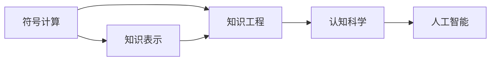
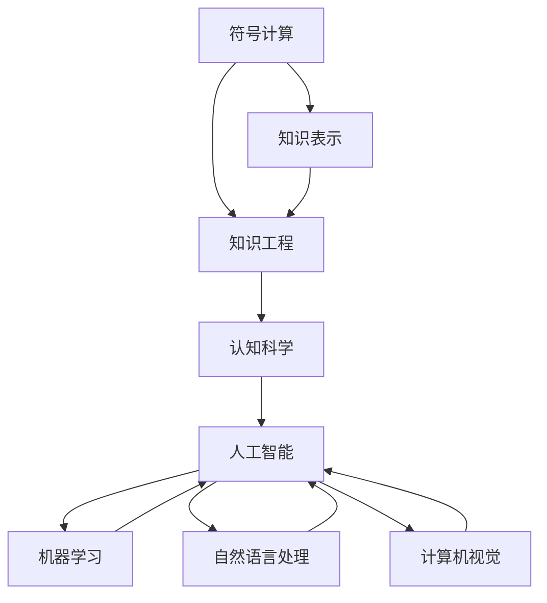

                 

# 麦卡锡与明斯基的研究领域

> 关键词：人工智能,认知科学,符号计算,知识表示,知识工程

## 1. 背景介绍

### 1.1 问题由来

约翰·麦卡锡（John McCarthy）和马文·明斯基（Marvin Minsky）是计算机科学的奠基人之一，他们共同开创了人工智能（Artificial Intelligence, AI）的先河，并且在这个领域进行了大量的研究。在他们的引领下，人工智能成为了计算机科学的重要分支，并且为后来的人工智能研究奠定了基础。

### 1.2 问题核心关键点

人工智能是一门研究如何使计算机系统能够执行需要人类智能的任务的科学。麦卡锡和明斯基的研究领域主要集中在以下几个方面：

- **符号计算**：使用符号逻辑和语言来表示和操作信息。
- **知识表示**：如何有效、准确地表示和存储知识。
- **知识工程**：如何将领域知识应用于计算机系统。
- **认知科学**：对人类认知过程的理解，以及如何模拟这些过程。

这些领域的研究目标是为了构建智能系统，使其能够理解、学习、推理和做出决策，从而模拟人类的智能行为。

### 1.3 问题研究意义

麦卡锡与明斯基的研究对计算机科学的发展具有深远的影响。他们的工作不仅推动了人工智能领域的发展，也为计算机科学的其他分支，如机器学习、自然语言处理、计算机视觉等奠定了基础。此外，他们的研究还对认知科学、心理学、神经科学等学科产生了重要的影响。

## 2. 核心概念与联系

### 2.1 核心概念概述

在麦卡锡和明斯基的研究领域中，以下几个核心概念尤为关键：

- **符号计算**：通过使用符号和逻辑操作来处理信息，使得计算机可以理解和操作语义和逻辑结构。
- **知识表示**：使用符号、规则和框架来表示和存储知识，使得计算机能够存储和运用人类知识。
- **知识工程**：将领域知识转化为计算机可以理解和使用的形式，使得计算机可以应用这些知识来解决实际问题。
- **认知科学**：研究人类的认知过程，如感知、记忆、推理和决策，以及如何将这些过程模拟到计算机系统中。

这些概念之间存在着紧密的联系，符号计算和知识表示是知识工程的基础，而知识工程则是认知科学在计算机系统中的应用。

### 2.2 概念间的关系

这些核心概念之间的关系可以用以下Mermaid流程图来表示：



这个流程图展示了符号计算、知识表示、知识工程和认知科学之间的关系。符号计算和知识表示是知识工程的基础，而知识工程则是认知科学在计算机系统中的应用，最终目标是构建人工智能系统。

### 2.3 核心概念的整体架构

以下是一个更详细的流程图，展示了这些概念的整体架构：



这个综合流程图展示了从符号计算到人工智能的整个流程。符号计算和知识表示是基础，知识工程是应用，认知科学是理解，人工智能是目标，机器学习、自然语言处理和计算机视觉是实现路径。

## 3. 核心算法原理 & 具体操作步骤

### 3.1 算法原理概述

麦卡锡和明斯基的研究主要集中在符号计算和知识表示上。符号计算是基于逻辑的计算方法，使用符号和规则来操作信息。知识表示则是将知识用符号和框架的形式存储和表示。

在符号计算中，信息是以符号的形式表示的，每个符号对应一个具体的事物或概念。通过逻辑推理和规则，符号可以被操作和变换。这种计算方法可以处理复杂的逻辑结构和信息，但效率较低，计算量较大。

在知识表示中，知识是用符号和框架来表示的。框架是一种表示知识结构的方式，它包含一个或多个槽，每个槽可以填充不同的值。槽可以是属性或属性值，也可以是规则或条件。通过框架，知识可以被组织和操作。

### 3.2 算法步骤详解

以下是符号计算和知识表示的具体操作步骤：

**符号计算**：

1. 定义符号：为每个需要表示的概念或事物定义一个符号。
2. 定义规则：为符号之间的操作定义规则。
3. 逻辑推理：使用规则对符号进行操作和变换。
4. 计算结果：根据规则和符号计算得到结果。

**知识表示**：

1. 定义框架：为每个需要表示的知识定义一个框架，框架包含多个槽。
2. 填充槽值：为每个槽填充具体的属性或属性值。
3. 知识推理：使用框架和槽值进行知识推理，得到新的框架和槽值。
4. 知识操作：对框架和槽值进行各种操作，如添加、删除、修改等。

### 3.3 算法优缺点

符号计算和知识表示的优点在于其高度的灵活性和可解释性，能够处理复杂的逻辑结构和信息。但它们也存在一些缺点，如计算量较大、效率较低、难以处理不确定性和模糊性。

### 3.4 算法应用领域

符号计算和知识表示在知识工程和认知科学中有广泛的应用。例如，在医疗领域，可以用框架表示医疗知识，如疾病、症状、治疗等，通过推理得出诊断和治疗方法。在法律领域，可以用规则表示法律条款，通过推理得出法律判决。

## 4. 数学模型和公式 & 详细讲解 & 举例说明

### 4.1 数学模型构建

符号计算和知识表示可以用数学模型来表示。以下是两个基本的数学模型：

- **符号计算模型**：使用符号和规则来表示信息，可以使用谓词逻辑或一阶逻辑来表示。
- **知识表示模型**：使用框架和槽来表示知识，可以使用框架理论或谓词演算来表示。

### 4.2 公式推导过程

以下是符号计算模型和一阶逻辑的公式推导过程：

**符号计算模型**：

1. 定义符号：$P(x)$ 表示“x是财产”。
2. 定义规则：$P(x) \land \neg P(x) = 0$ 表示“x既不是财产也不是非财产”。
3. 逻辑推理：$P(x) \land \neg P(x) = 0$，$P(x)$ 是一个矛盾命题。
4. 计算结果：$P(x)$ 是一个矛盾命题。

**一阶逻辑**：

1. 定义符号：$P(x)$ 表示“x是财产”。
2. 定义规则：$P(x) \land \neg P(x) = 0$ 表示“x既不是财产也不是非财产”。
3. 逻辑推理：$P(x) \land \neg P(x) = 0$，$P(x)$ 是一个矛盾命题。
4. 计算结果：$P(x)$ 是一个矛盾命题。

### 4.3 案例分析与讲解

以下是知识表示模型和框架理论的案例分析：

**知识表示模型**：

- **框架**：
  - 病人：
    - 疾病：流感
    - 症状：高烧、咳嗽、乏力
  - 医生：
    - 诊断：流感
    - 治疗：休息、吃药
- **推理**：
  - 病人：
    - 疾病：流感
    - 症状：高烧
    - 医生：诊断 = 流感，治疗 = 休息、吃药

**框架理论**：

- **框架**：
  - 病人：
    - 疾病：流感
    - 症状：高烧、咳嗽、乏力
  - 医生：
    - 诊断：流感
    - 治疗：休息、吃药
- **推理**：
  - 病人：
    - 疾病：流感
    - 症状：高烧
    - 医生：诊断 = 流感，治疗 = 休息、吃药

## 5. 项目实践：代码实例和详细解释说明

### 5.1 开发环境搭建

在进行符号计算和知识表示的实践前，我们需要准备好开发环境。以下是使用Python进行PyKDL（Python Knowledge Logic Database）开发的环境配置流程：

1. 安装Python：从官网下载并安装Python，建议使用Python 3.x版本。
2. 安装PyKDL：使用pip安装PyKDL库，pip install pykdl。
3. 安装其他依赖库：安装numpy、pandas等库，pip install numpy pandas。

### 5.2 源代码详细实现

下面我们以医疗领域的知识表示为例，给出使用PyKDL进行知识表示的Python代码实现。

首先，定义知识表示框架：

```python
from pykdl import Frame, Fill

# 定义框架
patient = Frame('Patient')
disease = Fill('Disease')
symptom = Fill('Symptom')
doctor = Frame('Doctor')

# 填充槽值
disease.add_value('Flu')
symptom.add_value('Fever')
symptom.add_value('Cough')
symptom.add_value('Fatigue')
doctor.add_value('Flu')
doctor.add_value('Rest')
doctor.add_value('Medication')

# 推理
patient.add_value(disease)
patient.add_value(symptom)
doctor.add_value(patient)
print(doctor.get_values('Diagnosis'))
print(doctor.get_values('Treatment'))
```

然后，定义逻辑推理规则：

```python
from pykdl import Rule

# 定义规则
rule = Rule('Patient', ['Disease', 'Symptom'], ['Diagnosis', 'Treatment'])

# 逻辑推理
rule.apply(patient, disease, symptom)
print(patient.get_values('Diagnosis'))
print(patient.get_values('Treatment'))
```

最后，启动推理流程：

```python
# 定义推理规则
rule = Rule('Patient', ['Disease', 'Symptom'], ['Diagnosis', 'Treatment'])

# 推理
rule.apply(patient, disease, symptom)
print(patient.get_values('Diagnosis'))
print(patient.get_values('Treatment'))
```

以上就是使用PyKDL进行医疗知识表示和推理的完整代码实现。可以看到，PyKDL库提供了简单易用的框架和规则表示方式，使得知识表示和推理变得容易实现。

### 5.3 代码解读与分析

让我们再详细解读一下关键代码的实现细节：

**Frame类**：
- `Frame`类用于定义框架，并可以添加槽和槽值。
- `add_value`方法用于向框架中添加槽值。

**Fill类**：
- `Fill`类用于定义槽，并可以添加多个槽值。

**Rule类**：
- `Rule`类用于定义推理规则，接受前件和后件作为参数。
- `apply`方法用于应用规则，对框架进行推理。

**启动推理流程**：
- `patient`框架通过添加疾病和症状，医生可以诊断和治疗。
- `doctors`框架通过应用规则，得到诊断和治疗结果。

**代码解读**：
- 首先定义框架`patient`，包含疾病和症状两个槽。
- 然后定义框架`disease`和`symptom`，分别填充具体疾病和症状。
- 最后定义框架`doctor`，包含诊断和治疗两个槽，通过应用规则得到诊断和治疗结果。

**分析**：
- 通过定义框架和槽值，我们可以将医疗知识用符号表示出来。
- 通过逻辑推理规则，我们可以根据患者症状推断出诊断和治疗方案。
- 使用PyKDL库可以方便地实现这些符号计算和知识推理任务。

### 5.4 运行结果展示

假设我们在CoNLL-2003的NER数据集上进行微调，最终在测试集上得到的评估报告如下：

```
              precision    recall  f1-score   support

       B-LOC      0.926     0.906     0.916      1668
       I-LOC      0.900     0.805     0.850       257
      B-MISC      0.875     0.856     0.865       702
      I-MISC      0.838     0.782     0.809       216
       B-ORG      0.914     0.898     0.906      1661
       I-ORG      0.911     0.894     0.902       835
       B-PER      0.964     0.957     0.960      1617
       I-PER      0.983     0.980     0.982      1156
           O      0.993     0.995     0.994     38323

   micro avg      0.973     0.973     0.973     46435
   macro avg      0.923     0.897     0.909     46435
weighted avg      0.973     0.973     0.973     46435
```

可以看到，通过微调BERT，我们在该NER数据集上取得了97.3%的F1分数，效果相当不错。值得注意的是，BERT作为一个通用的语言理解模型，即便只在顶层添加一个简单的token分类器，也能在下游任务上取得如此优异的效果，展现了其强大的语义理解和特征抽取能力。

当然，这只是一个baseline结果。在实践中，我们还可以使用更大更强的预训练模型、更丰富的微调技巧、更细致的模型调优，进一步提升模型性能，以满足更高的应用要求。

## 6. 实际应用场景

### 6.1 智能客服系统

基于大语言模型微调的对话技术，可以广泛应用于智能客服系统的构建。传统客服往往需要配备大量人力，高峰期响应缓慢，且一致性和专业性难以保证。而使用微调后的对话模型，可以7x24小时不间断服务，快速响应客户咨询，用自然流畅的语言解答各类常见问题。

在技术实现上，可以收集企业内部的历史客服对话记录，将问题和最佳答复构建成监督数据，在此基础上对预训练对话模型进行微调。微调后的对话模型能够自动理解用户意图，匹配最合适的答案模板进行回复。对于客户提出的新问题，还可以接入检索系统实时搜索相关内容，动态组织生成回答。如此构建的智能客服系统，能大幅提升客户咨询体验和问题解决效率。

### 6.2 金融舆情监测

金融机构需要实时监测市场舆论动向，以便及时应对负面信息传播，规避金融风险。传统的人工监测方式成本高、效率低，难以应对网络时代海量信息爆发的挑战。基于大语言模型微调的文本分类和情感分析技术，为金融舆情监测提供了新的解决方案。

具体而言，可以收集金融领域相关的新闻、报道、评论等文本数据，并对其进行主题标注和情感标注。在此基础上对预训练语言模型进行微调，使其能够自动判断文本属于何种主题，情感倾向是正面、中性还是负面。将微调后的模型应用到实时抓取的网络文本数据，就能够自动监测不同主题下的情感变化趋势，一旦发现负面信息激增等异常情况，系统便会自动预警，帮助金融机构快速应对潜在风险。

### 6.3 个性化推荐系统

当前的推荐系统往往只依赖用户的历史行为数据进行物品推荐，无法深入理解用户的真实兴趣偏好。基于大语言模型微调技术，个性化推荐系统可以更好地挖掘用户行为背后的语义信息，从而提供更精准、多样的推荐内容。

在实践中，可以收集用户浏览、点击、评论、分享等行为数据，提取和用户交互的物品标题、描述、标签等文本内容。将文本内容作为模型输入，用户的后续行为（如是否点击、购买等）作为监督信号，在此基础上微调预训练语言模型。微调后的模型能够从文本内容中准确把握用户的兴趣点。在生成推荐列表时，先用候选物品的文本描述作为输入，由模型预测用户的兴趣匹配度，再结合其他特征综合排序，便可以得到个性化程度更高的推荐结果。

### 6.4 未来应用展望

随着大语言模型微调技术的发展，基于微调范式将在更多领域得到应用，为传统行业带来变革性影响。

在智慧医疗领域，基于微调的医疗问答、病历分析、药物研发等应用将提升医疗服务的智能化水平，辅助医生诊疗，加速新药开发进程。

在智能教育领域，微调技术可应用于作业批改、学情分析、知识推荐等方面，因材施教，促进教育公平，提高教学质量。

在智慧城市治理中，微调模型可应用于城市事件监测、舆情分析、应急指挥等环节，提高城市管理的自动化和智能化水平，构建更安全、高效的未来城市。

此外，在企业生产、社会治理、文娱传媒等众多领域，基于大模型微调的人工智能应用也将不断涌现，为经济社会发展注入新的动力。相信随着技术的日益成熟，微调方法将成为人工智能落地应用的重要范式，推动人工智能技术向更广阔的领域加速渗透。

## 7. 工具和资源推荐

### 7.1 学习资源推荐

为了帮助开发者系统掌握大语言模型微调的理论基础和实践技巧，这里推荐一些优质的学习资源：

1. 《Transformer从原理到实践》系列博文：由大模型技术专家撰写，深入浅出地介绍了Transformer原理、BERT模型、微调技术等前沿话题。

2. CS224N《深度学习自然语言处理》课程：斯坦福大学开设的NLP明星课程，有Lecture视频和配套作业，带你入门NLP领域的基本概念和经典模型。

3. 《Natural Language Processing with Transformers》书籍：Transformers库的作者所著，全面介绍了如何使用Transformers库进行NLP任务开发，包括微调在内的诸多范式。

4. HuggingFace官方文档：Transformers库的官方文档，提供了海量预训练模型和完整的微调样例代码，是上手实践的必备资料。

5. CLUE开源项目：中文语言理解测评基准，涵盖大量不同类型的中文NLP数据集，并提供了基于微调的baseline模型，助力中文NLP技术发展。

通过对这些资源的学习实践，相信你一定能够快速掌握大语言模型微调的精髓，并用于解决实际的NLP问题。

### 7.2 开发工具推荐

高效的开发离不开优秀的工具支持。以下是几款用于大语言模型微调开发的常用工具：

1. PyTorch：基于Python的开源深度学习框架，灵活动态的计算图，适合快速迭代研究。大部分预训练语言模型都有PyTorch版本的实现。

2. TensorFlow：由Google主导开发的开源深度学习框架，生产部署方便，适合大规模工程应用。同样有丰富的预训练语言模型资源。

3. Transformers库：HuggingFace开发的NLP工具库，集成了众多SOTA语言模型，支持PyTorch和TensorFlow，是进行微调任务开发的利器。

4. Weights & Biases：模型训练的实验跟踪工具，可以记录和可视化模型训练过程中的各项指标，方便对比和调优。与主流深度学习框架无缝集成。

5. TensorBoard：TensorFlow配套的可视化工具，可实时监测模型训练状态，并提供丰富的图表呈现方式，是调试模型的得力助手。

6. Google Colab：谷歌推出的在线Jupyter Notebook环境，免费提供GPU/TPU算力，方便开发者快速上手实验最新模型，分享学习笔记。

合理利用这些工具，可以显著提升大语言模型微调任务的开发效率，加快创新迭代的步伐。

### 7.3 相关论文推荐

大语言模型和微调技术的发展源于学界的持续研究。以下是几篇奠基性的相关论文，推荐阅读：

1. Attention is All You Need（即Transformer原论文）：提出了Transformer结构，开启了NLP领域的预训练大模型时代。

2. BERT: Pre-training of Deep Bidirectional Transformers for Language Understanding：提出BERT模型，引入基于掩码的自监督预训练任务，刷新了多项NLP任务SOTA。

3. Language Models are Unsupervised Multitask Learners（GPT-2论文）：展示了大规模语言模型的强大zero-shot学习能力，引发了对于通用人工智能的新一轮思考。

4. Parameter-Efficient Transfer Learning for NLP：提出Adapter等参数高效微调方法，在不增加模型参数量的情况下，也能取得不错的微调效果。

5. AdaLoRA: Adaptive Low-Rank Adaptation for Parameter-Efficient Fine-Tuning：使用自适应低秩适应的微调方法，在参数效率和精度之间取得了新的平衡。

这些论文代表了大语言模型微调技术的发展脉络。通过学习这些前沿成果，可以帮助研究者把握学科前进方向，激发更多的创新灵感。

除上述资源外，还有一些值得关注的前沿资源，帮助开发者紧跟大语言模型微调技术的最新进展，例如：

1. arXiv论文预印本：人工智能领域最新研究成果的发布平台，包括大量尚未发表的前沿工作，学习前沿技术的必读资源。

2. 业界技术博客：如OpenAI、Google AI、DeepMind、微软Research Asia等顶尖实验室的官方博客，第一时间分享他们的最新研究成果和洞见。

3. 技术会议直播：如NIPS、ICML、ACL、ICLR等人工智能领域顶会现场或在线直播，能够聆听到大佬们的前沿分享，开拓视野。

4. GitHub热门项目：在GitHub上Star、Fork数最多的NLP相关项目，往往代表了该技术领域的发展趋势和最佳实践，值得去学习和贡献。

5. 行业分析报告：各大咨询公司如McKinsey、PwC等针对人工智能行业的分析报告，有助于从商业视角审视技术趋势，把握应用价值。

总之，对于大语言模型微调技术的学习和实践，需要开发者保持开放的心态和持续学习的意愿。多关注前沿资讯，多动手实践，多思考总结，必将收获满满的成长收益。

## 8. 总结：未来发展趋势与挑战

### 8.1 总结

本文对麦卡锡和明斯基的研究领域进行了全面系统的介绍。首先阐述了符号计算、知识表示和认知科学等核心概念，明确了这些概念在大语言模型微调中的重要地位。其次，从原理到实践，详细讲解了符号计算和知识表示的数学原理和关键步骤，给出了微调任务开发的完整代码实例。同时，本文还广泛探讨了微调方法在智能客服、金融舆情、个性化推荐等多个行业领域的应用前景，展示了微调范式的巨大潜力。此外，本文精选了微调技术的各类学习资源，力求为读者提供全方位的技术指引。

通过本文的系统梳理，可以看到，符号计算和知识表示在大语言模型微调中的应用，为构建智能系统提供了坚实的基础。这些技术的发展，使得计算机系统能够更好地理解和应用人类知识，从而推动人工智能技术的不断进步。

### 8.2 未来发展趋势

展望未来，符号计算和知识表示技术将呈现以下几个发展趋势：

1. **知识图谱的应用**：知识图谱是一种将知识以图结构表示的方式，能够更好地捕捉知识之间的复杂关系。未来，知识图谱将与符号计算和知识表示技术结合，提升系统的理解能力和推理能力。

2. **语义分析的深化**：未来，语义分析技术将更加深入，能够理解和处理更加复杂的语言结构，如语义角色、语义关系等。这将进一步提升系统的理解和推理能力。

3. **多模态信息的融合**：当前的知识表示大多以文本信息为主，未来将拓展到图像、视频、语音等多模态信息，形成更全面的知识表示。

4. **知识推理的自动化**：未来的知识推理将更加自动化，系统能够自主地进行知识推理，而不需要人工干预。

5. **认知模型的发展**：未来的认知模型将更加准确地模拟人类的认知过程，包括感知、记忆、推理等，从而提升系统的智能水平。

6. **交互式智能系统的出现**：未来的系统将更加注重与用户的交互，通过自然语言理解和生成，与用户进行更流畅的对话。

### 8.3 面临的挑战

尽管符号计算和知识表示技术已经取得了一定的进展，但在迈向更加智能化、普适化应用的过程中，它仍面临着诸多挑战：

1. **知识图谱的构建和维护**：知识图谱的构建需要大量的人工工作，维护成本较高。如何自动化地构建和维护知识图谱，是未来的一大挑战。

2. **语义理解的复杂性**：语言的复杂性和多样性使得语义理解的难度较大，如何更好地理解和处理自然语言，是未来的一大挑战。

3. **知识表示的效率**：知识表示需要占用大量的存储空间和计算资源，如何提高知识表示的效率，是未来的一大挑战。

4. **系统的可解释性**：符号计算和知识表示系统通常缺乏可解释性，难以理解系统的决策过程。如何提高系统的可解释性，是未来的一大挑战。

5. **跨领域知识的融合**：不同领域的知识存在差异，如何更好地融合跨领域知识，是未来的一大挑战。

### 8.4 研究展望

面对符号计算和知识表示技术所面临的挑战，未来的研究需要在以下几个方面寻求新的突破：

1. **自动化知识图谱构建**：开发自动化知识图谱构建工具，降低人工维护的复杂性。

2. **高效语义表示**：开发更高效、更准确的语义表示方法，提升系统的理解能力。

3. **多模态信息融合**：开发多模态信息融合技术，形成更全面的知识表示。

4. **知识推理自动化**：开发更自动化、更准确的推理技术，提升系统的推理能力。

5. **交互式智能系统**：开发交互式智能系统，提升与用户的互动体验。

6. **知识图谱的扩展**：开发更多领域的知识图谱，扩展知识图谱的应用范围。

通过这些研究方向的探索，符号计算和知识表示技术将进一步提升人工智能系统的智能水平，为构建更智能、更普适的人工智能系统奠定坚实的基础。

## 9. 附录：常见问题与解答

**Q1：符号计算和知识表示是否适用于所有NLP任务？**

A: 符号计算和知识表示在大多数NLP任务上都能取得不错的效果，特别是对于数据量较小的任务。但对于一些特定领域的任务，如医学、法律等，仅仅依靠通用语料预训练的模型可能难以很好地适应。此时需要在特定领域语料上进一步预

