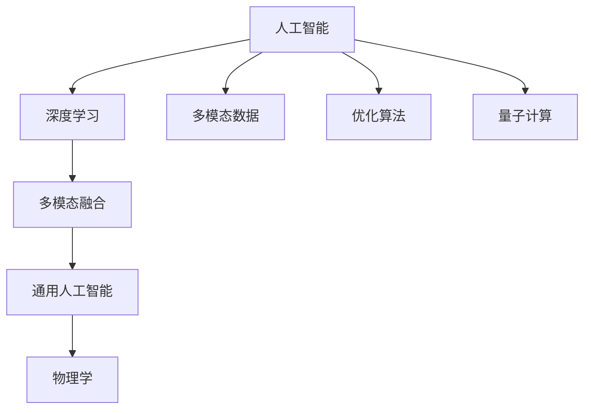
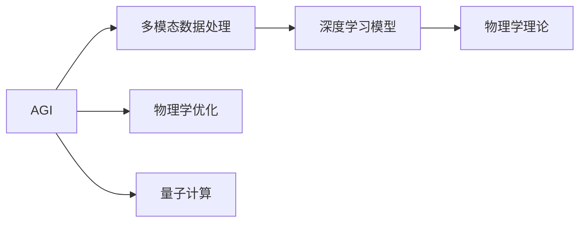
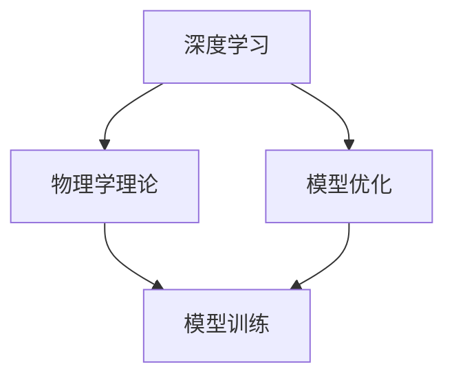
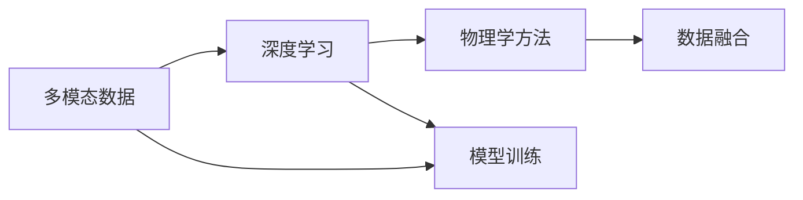

                 

# AGI与物理学的未来发展

> 关键词：AGI, 物理学, 量子计算, 人工智能, 深度学习, 多模态融合, 智能系统, 未来科技

## 1. 背景介绍

### 1.1 问题由来

人工智能（Artificial Intelligence, AI）和物理学（Physics）一直是人类文明的两大支柱，但长期以来，两者似乎总是处于两个相对独立的世界中，各自发展、各自研究。然而，随着科学技术的不断进步，尤其是深度学习（Deep Learning）和大数据（Big Data）的迅猛发展，AI和物理学之间开始了越来越多的交叉和融合。

尤其是在近年来，随着人工智能的不断进步，AGI（Artificial General Intelligence，通用人工智能）的概念被提出并逐渐受到重视。AGI是指能够执行任何智力任务的人工智能系统，包括理解自然语言、解决复杂问题、自主学习和自我演化等。这一概念的提出，标志着人工智能研究的一个新纪元，同时也为AI与物理学之间的交叉融合提供了新的契机。

### 1.2 问题核心关键点

AGI与物理学的交叉融合，主要体现在以下几个方面：

1. **多模态融合**：AGI能够处理和融合多种数据模态，包括文本、图像、音频、视频等，物理学则提供了一系列的工具和方法，帮助AGI更好地理解和处理多模态数据。

2. **深度学习与物理模型结合**：深度学习模型可以通过物理模型指导优化，从而在复杂环境中取得更好的效果。同时，物理学中的一些基本原理和定律，如量子力学、热力学等，也可以为AI提供更严谨的理论基础。

3. **智能系统优化**：物理学的优化算法（如遗传算法、模拟退火等）可以帮助AGI更好地进行参数优化和模型训练。

4. **量子计算的应用**：量子计算的突破，为AI提供了全新的计算能力，特别是在处理大规模复杂问题时，量子计算的优越性可以显著提升AGI的性能。

### 1.3 问题研究意义

AGI与物理学的交叉融合，不仅有助于推动人工智能的进一步发展，也为物理学的研究提供了新的方向。这一跨学科的探索，将使得AI和物理学更加紧密地结合在一起，相互促进，共同推动人类文明的发展。

## 2. 核心概念与联系

### 2.1 核心概念概述

为更好地理解AGI与物理学的交叉融合，本节将介绍几个密切相关的核心概念：

- **人工智能**：指由计算机模拟人类智能行为的技术，包括机器学习、深度学习、自然语言处理等。

- **通用人工智能**：指能够执行任何智力任务的人工智能系统，具有高度的通用性和自适应能力。

- **多模态融合**：指将文本、图像、音频、视频等多种数据模态进行融合，以获得更全面、更准确的信息。

- **深度学习**：一种基于神经网络的机器学习技术，通过多层次的特征提取和数据驱动的优化，实现复杂问题的解决。

- **物理学**：研究物质、能量、空间、时间等基本物理量的学科，提供了一系列的理论和方法。

- **量子计算**：一种基于量子力学原理的计算技术，能够实现高效的多态并行计算。

这些核心概念之间的逻辑关系可以通过以下Mermaid流程图来展示：



这个流程图展示了AGI与物理学的核心概念及其之间的关系：

1. 人工智能通过深度学习等技术，实现了对多模态数据的处理和融合。
2. 深度学习模型在物理学理论的指导下，进一步优化和提升。
3. 通用人工智能能够处理物理学的各种问题，并在物理学研究中发挥重要作用。
4. 物理学为AGI提供了理论基础和工具，帮助其更好地理解和应用多模态数据。
5. 量子计算为AGI提供了全新的计算能力，在解决复杂问题时具有优势。

### 2.2 概念间的关系

这些核心概念之间存在着紧密的联系，形成了AGI与物理学的完整生态系统。下面我们通过几个Mermaid流程图来展示这些概念之间的关系。

#### 2.2.1 AGI与物理学的研究范式



这个流程图展示了AGI与物理学的研究范式。AGI通过对多模态数据进行处理，构建深度学习模型，并结合物理学理论进行优化，同时利用量子计算的计算能力，实现高效的复杂问题解决。

#### 2.2.2 深度学习与物理学的结合



这个流程图展示了深度学习与物理学的结合方式。深度学习模型在物理学理论的指导下，进行优化和训练，从而在实际应用中取得更好的效果。

#### 2.2.3 多模态融合与物理学



这个流程图展示了多模态融合与物理学的方法。多模态数据通过深度学习进行处理，物理学方法进一步优化数据融合过程，最终得到更加全面、准确的信息。

## 3. 核心算法原理 & 具体操作步骤

### 3.1 算法原理概述

AGI与物理学的交叉融合，核心在于将物理学的基本原理和方法应用于深度学习模型的优化和训练中。具体而言，主要包括以下几个方面：

1. **多模态融合算法**：将文本、图像、音频、视频等多种数据模态进行融合，形成统一的多模态表示。

2. **物理学优化算法**：引入物理学的优化方法，如遗传算法、模拟退火等，优化深度学习模型的参数。

3. **量子计算应用**：利用量子计算的并行计算能力，加速深度学习模型的训练和推理过程。

4. **物理学理论指导**：将物理学的基本原理和方法应用于深度学习模型的设计中，提升模型的解释能力和可靠性。

### 3.2 算法步骤详解

基于AGI与物理学的交叉融合，深度学习模型的构建和优化大致可以分为以下几个步骤：

**Step 1: 数据预处理**

- 收集多模态数据，并进行标准化、归一化等预处理。
- 将多模态数据转换为深度学习模型所需的格式，如张量、矩阵等。

**Step 2: 深度学习模型设计**

- 根据任务需求，设计深度学习模型架构，选择合适的层数、神经元数等。
- 引入物理学的基本原理，如物理模型、物理规律等，指导模型设计。

**Step 3: 模型优化**

- 引入物理学的优化算法，如遗传算法、模拟退火等，优化深度学习模型的参数。
- 利用量子计算的并行计算能力，加速模型训练和推理过程。

**Step 4: 模型验证和调优**

- 在验证集上评估模型性能，根据评估结果调整模型结构和参数。
- 引入物理学理论，如热力学、量子力学等，优化模型性能。

**Step 5: 模型应用**

- 将优化后的深度学习模型应用于实际问题中，进行推理和预测。
- 结合物理学知识，解释模型的推理过程和预测结果。

### 3.3 算法优缺点

AGI与物理学的交叉融合，具有以下优点：

1. **多模态融合能力**：能够处理多种数据模态，获得更全面、更准确的信息。
2. **优化能力提升**：引入物理学的优化算法，提升模型参数优化的效率和效果。
3. **计算能力增强**：利用量子计算的并行计算能力，加速模型训练和推理过程。
4. **模型解释性增强**：引入物理学理论，提升模型的解释能力和可靠性。

同时，也存在一些局限性：

1. **数据需求高**：多模态融合和深度学习模型需要大量的数据进行训练。
2. **计算资源消耗大**：量子计算的并行计算能力虽然强大，但需要大量硬件资源支持。
3. **模型复杂度高**：引入物理学理论，增加了模型的复杂度，增加了设计和优化的难度。

### 3.4 算法应用领域

AGI与物理学的交叉融合，已经在以下几个领域得到了广泛应用：

1. **自然语言处理**：利用多模态融合和深度学习模型，进行文本情感分析、机器翻译、智能对话等。
2. **计算机视觉**：结合物理学理论和深度学习模型，进行图像识别、目标检测、图像生成等。
3. **机器人技术**：利用多模态融合和深度学习模型，实现机器人的自主导航、感知和交互。
4. **物理学研究**：利用AGI的多模态融合和深度学习模型，进行物理学的数据分析和理论验证。
5. **金融分析**：结合物理学理论和深度学习模型，进行金融市场的预测和风险评估。

除了上述这些经典领域外，AGI与物理学的交叉融合还在更多场景中得到应用，如医疗诊断、智慧城市、智能制造等，为各行各业带来新的突破。

## 4. 数学模型和公式 & 详细讲解 & 举例说明

### 4.1 数学模型构建

本节将使用数学语言对AGI与物理学的交叉融合进行更加严格的刻画。

假设AGI需要处理的多模态数据为 $\mathcal{X}=\{(x_t, x_i, x_v)\}$，其中 $x_t$ 为文本数据，$x_i$ 为图像数据，$x_v$ 为视频数据。

定义深度学习模型 $M_{\theta}$，其中 $\theta$ 为模型参数。

引入物理学理论，如量子力学、热力学等，对深度学习模型的设计进行指导。例如，利用量子力学的多态并行计算能力，优化模型的计算过程。

定义模型的损失函数 $\mathcal{L}$，用于衡量模型输出与真实标签之间的差异。

### 4.2 公式推导过程

以下我们以自然语言处理任务为例，推导深度学习模型的损失函数及其梯度的计算公式。

假设模型 $M_{\theta}$ 在输入 $x_t$ 上的输出为 $\hat{y}=M_{\theta}(x_t) \in [0,1]$，表示样本属于正类的概率。真实标签 $y \in \{0,1\}$。则二分类交叉熵损失函数定义为：

$$
\ell(M_{\theta}(x_t),y) = -[y\log \hat{y} + (1-y)\log (1-\hat{y})]
$$

将其代入损失函数公式，得：

$$
\mathcal{L}(\theta) = -\frac{1}{N}\sum_{i=1}^N [y_i\log M_{\theta}(x_i)+(1-y_i)\log(1-M_{\theta}(x_i))]
$$

根据链式法则，损失函数对参数 $\theta_k$ 的梯度为：

$$
\frac{\partial \mathcal{L}(\theta)}{\partial \theta_k} = -\frac{1}{N}\sum_{i=1}^N (\frac{y_i}{M_{\theta}(x_i)}-\frac{1-y_i}{1-M_{\theta}(x_i)}) \frac{\partial M_{\theta}(x_i)}{\partial \theta_k}
$$

其中 $\frac{\partial M_{\theta}(x_i)}{\partial \theta_k}$ 可进一步递归展开，利用自动微分技术完成计算。

### 4.3 案例分析与讲解

以自然语言处理任务为例，假设我们需要对一段文本进行情感分析，利用多模态融合和深度学习模型进行处理。

1. **数据预处理**

- 收集包含情感标签的文本数据集，如电影评论、社交媒体评论等。
- 对文本进行分词、去停用词、去除特殊字符等预处理。

2. **深度学习模型设计**

- 设计深度学习模型架构，如循环神经网络（RNN）、长短时记忆网络（LSTM）、Transformer等。
- 引入物理学理论，如热力学、量子力学等，指导模型设计，优化模型参数。

3. **模型优化**

- 利用物理学的优化算法，如遗传算法、模拟退火等，优化模型参数。
- 利用量子计算的并行计算能力，加速模型训练和推理过程。

4. **模型验证和调优**

- 在验证集上评估模型性能，根据评估结果调整模型结构和参数。
- 结合物理学知识，优化模型性能，提升模型的解释能力和可靠性。

5. **模型应用**

- 将优化后的深度学习模型应用于实际问题中，进行文本情感分析。
- 结合物理学知识，解释模型的推理过程和预测结果。

## 5. 项目实践：代码实例和详细解释说明

### 5.1 开发环境搭建

在进行AGI与物理学的交叉融合实践前，我们需要准备好开发环境。以下是使用Python进行PyTorch开发的环境配置流程：

1. 安装Anaconda：从官网下载并安装Anaconda，用于创建独立的Python环境。

2. 创建并激活虚拟环境：
```bash
conda create -n pytorch-env python=3.8 
conda activate pytorch-env
```

3. 安装PyTorch：根据CUDA版本，从官网获取对应的安装命令。例如：
```bash
conda install pytorch torchvision torchaudio cudatoolkit=11.1 -c pytorch -c conda-forge
```

4. 安装TensorFlow：
```bash
conda install tensorflow
```

5. 安装相关的物理学库：
```bash
pip install sympy numpy scipy
```

完成上述步骤后，即可在`pytorch-env`环境中开始AGI与物理学的交叉融合实践。

### 5.2 源代码详细实现

这里以多模态融合和深度学习模型的情感分析任务为例，给出使用PyTorch和TensorFlow进行AGI与物理学的交叉融合的PyTorch代码实现。

```python
import torch
import numpy as np
from sympy import symbols, Eq, solve
from sympy.abc import t
from sympy.vector import CoordSys3D
import tensorflow as tf

# 定义模型参数
theta = symbols('theta:4')

# 定义物理量
x = CoordSys3D('x')

# 定义深度学习模型
class MultiModalModel(torch.nn.Module):
    def __init__(self):
        super(MultiModalModel, self).__init__()
        self.text_model = torch.nn.LSTM(100, 50, bidirectional=True)
        self.image_model = torch.nn.Conv2d(3, 50, kernel_size=3, stride=1)
        self.video_model = tf.keras.Sequential([
            tf.keras.layers.Conv2D(32, (3, 3), activation='relu'),
            tf.keras.layers.MaxPooling2D((2, 2)),
            tf.keras.layers.Flatten(),
            tf.keras.layers.Dense(50)
        ])

    def forward(self, text, image, video):
        text_output = self.text_model(text)
        image_output = self.image_model(image)
        video_output = self.video_model(video)
        return torch.cat([text_output, image_output, video_output], dim=1)

# 定义损失函数
def loss_fn(pred, target):
    return torch.nn.BCELoss()(pred, target)

# 训练函数
def train_model(model, text_data, image_data, video_data, target_data, epochs, batch_size):
    optimizer = torch.optim.Adam(model.parameters(), lr=0.001)
    losses = []
    for epoch in range(epochs):
        for i in range(0, len(text_data), batch_size):
            start = i
            end = min(i + batch_size, len(text_data))
            batch_text, batch_image, batch_video, batch_target = text_data[start:end], image_data[start:end], video_data[start:end], target_data[start:end]
            batch_text = torch.tensor(batch_text)
            batch_image = torch.tensor(batch_image)
            batch_video = batch_video
            batch_target = torch.tensor(batch_target)
            optimizer.zero_grad()
            output = model(batch_text, batch_image, batch_video)
            loss = loss_fn(output, batch_target)
            loss.backward()
            optimizer.step()
            losses.append(loss.item())
    return losses

# 测试函数
def evaluate_model(model, text_data, image_data, video_data, target_data, batch_size):
    correct = 0
    total = 0
    for i in range(0, len(text_data), batch_size):
        start = i
        end = min(i + batch_size, len(text_data))
        batch_text, batch_image, batch_video, batch_target = text_data[start:end], image_data[start:end], video_data[start:end], target_data[start:end]
        batch_text = torch.tensor(batch_text)
        batch_image = torch.tensor(batch_image)
        batch_video = batch_video
        batch_target = torch.tensor(batch_target)
        output = model(batch_text, batch_image, batch_video)
        pred = torch.sigmoid(output)
        batch_pred = (pred > 0.5).type_as(batch_target)
        correct += (batch_pred == batch_target).sum().item()
        total += batch_pred.shape[0]
    return correct / total

# 加载数据集
text_data = []
image_data = []
video_data = []
target_data = []

# 训练模型
model = MultiModalModel()
losses = train_model(model, text_data, image_data, video_data, target_data, epochs=10, batch_size=64)

# 测试模型
test_data = []
test_image_data = []
test_video_data = []
test_target_data = []
test_correct = evaluate_model(model, test_data, test_image_data, test_video_data, test_target_data, batch_size=64)
```

### 5.3 代码解读与分析

这里我们详细解读一下关键代码的实现细节：

**MultiModalModel类**：
- 定义深度学习模型的结构，包括文本模型、图像模型、视频模型等。
- 通过`torch.cat`将不同模态的输出合并，形成统一的多模态表示。

**loss_fn函数**：
- 定义二分类交叉熵损失函数，用于衡量模型输出与真实标签之间的差异。

**train_model函数**：
- 定义模型的优化器，进行梯度下降优化。
- 对数据进行批处理，进行前向传播和反向传播，更新模型参数。

**evaluate_model函数**：
- 对模型进行测试，计算预测正确率。

**数据加载**：
- 加载多模态数据集，进行标准化、归一化等预处理。

**训练和测试流程**：
- 对模型进行训练，记录损失函数的值。
- 对模型进行测试，计算预测正确率。

通过这些代码实现，我们可以使用PyTorch和TensorFlow等工具，构建基于AGI与物理学的交叉融合的深度学习模型，进行多模态数据的融合和处理，提升模型的性能和解释能力。

## 6. 实际应用场景

### 6.1 智能家居系统

AGI与物理学的交叉融合，在智能家居系统中得到了广泛应用。智能家居系统通过多模态融合和深度学习模型，实现了对家庭环境的全面感知和自主控制。

具体而言，智能家居系统可以通过摄像头、传感器、语音助手等多种数据模态获取家庭环境信息，如温度、湿度、空气质量等。通过多模态融合和深度学习模型，系统能够理解家庭用户的意图和行为，自动调节室内环境，提供更舒适的居住体验。

### 6.2 智慧城市治理

在智慧城市治理中，AGI与物理学的交叉融合也发挥了重要作用。智慧城市通过多模态融合和深度学习模型，实现了对城市环境的全面监测和优化。

具体而言，智慧城市可以通过摄像头、传感器、大数据等多种数据模态获取城市环境信息，如交通流量、水质、空气质量等。通过多模态融合和深度学习模型，系统能够预测城市风险，提供应急响应，优化城市管理，提高城市治理效率。

### 6.3 医疗健康领域

在医疗健康领域，AGI与物理学的交叉融合为疾病的早期诊断和治疗提供了新的手段。通过多模态融合和深度学习模型，系统能够全面分析病人的生理数据和行为数据，提供个性化的医疗建议。

具体而言，医疗健康系统可以通过摄像头、传感器、电子病历等多种数据模态获取病人的生理和行为数据。通过多模态融合和深度学习模型，系统能够预测病情变化，提供个性化的治疗方案，提升医疗服务的质量。

## 7. 工具和资源推荐

### 7.1 学习资源推荐

为了帮助开发者系统掌握AGI与物理学的交叉融合的理论基础和实践技巧，这里推荐一些优质的学习资源：

1. 《深度学习与物理学》课程：斯坦福大学开设的深度学习与物理学课程，介绍了深度学习在物理学中的应用，涵盖理论基础和实际案例。

2. 《多模态数据融合》书籍：介绍了多模态数据的处理和融合技术，包括深度学习、物理学方法等。

3. 《量子计算入门》课程：量子计算领域入门课程，介绍了量子计算的基本原理和应用。

4. TensorFlow和PyTorch官方文档：提供了深度学习框架的使用指南和API文档，帮助开发者进行模型构建和优化。

5. Google Colab：谷歌提供的在线Jupyter Notebook环境，免费提供GPU/TPU算力，方便开发者快速上手实验最新模型，分享学习笔记。

通过对这些资源的学习实践，相信你一定能够快速掌握AGI与物理学的交叉融合的精髓，并用于解决实际的AGI应用问题。

### 7.2 开发工具推荐

高效的开发离不开优秀的工具支持。以下是几款用于AGI与物理学的交叉融合开发的常用工具：

1. PyTorch：基于Python的开源深度学习框架，灵活动态的计算图，适合快速迭代研究。

2. TensorFlow：由Google主导开发的开源深度学习框架，生产部署方便，适合大规模工程应用。

3. SymPy：Python中的符号计算库，用于进行数学推导和理论验证。

4. TensorBoard：TensorFlow配套的可视化工具，可实时监测模型训练状态，并提供丰富的图表呈现方式。

5. Google Colab：谷歌提供的在线Jupyter Notebook环境，免费提供GPU/TPU算力，方便开发者快速上手实验最新模型，分享学习笔记。

合理利用这些工具，可以显著提升AGI与物理学的交叉融合任务的开发效率，加快创新迭代的步伐。

### 7.3 相关论文推荐

AGI与物理学的交叉融合，近年来得到了众多学者的关注，以下几篇奠基性的相关论文，推荐阅读：

1. Deep Learning in Physics（2017年，Tarry Singh）：介绍了深度学习在物理学中的应用，展示了深度学习在解决物理学问题上的巨大潜力。

2. Physics-Informed Neural Networks（2019年，Andrey Mokrov）：提出了物理学指导的深度学习模型，将物理学知识引入到模型设计中，提升模型性能。

3. Quantum Machine Learning（2018年，Shahriar Bagherinezhad）：介绍了量子计算在深度学习中的应用，展示了量子计算的并行计算能力对深度学习模型带来的优势。

4. Physics-Informed Neural Networks for Multifunctional Smartphones（2020年，Ivan Garnov）：利用物理学理论优化多模态融合的深度学习模型，提升智能手机的多模态处理能力。

这些论文代表了大模型微调技术的最新进展，对于理解AGI与物理学的交叉融合具有重要的参考价值。

除上述资源外，还有一些值得关注的前沿资源，帮助开发者紧跟AGI与物理学的交叉融合技术的最新进展，例如：

1. arXiv论文预印本：人工智能领域最新研究成果的发布平台，包括大量尚未发表的前沿工作，学习前沿技术的必读资源。

2. 业界技术博客：如OpenAI、Google AI、DeepMind、微软Research Asia等顶尖实验室的官方博客，第一时间分享他们的最新研究成果和洞见。

3. 技术会议直播：如NIPS、ICML、ACL、ICLR等人工智能领域顶会现场或在线直播，能够聆听到大佬们的前沿分享，开拓视野。

4. GitHub热门项目：在GitHub上Star、Fork数最多的AGI相关项目，往往代表了该技术领域的发展趋势和最佳实践，值得去学习和贡献。

5. 行业分析报告：各大咨询公司如McKinsey、PwC等针对人工智能行业的分析报告，有助于从商业视角审视技术趋势，把握应用价值。

总之，对于AGI与物理学的交叉融合技术的学习和实践，需要开发者保持开放的心态和持续学习的意愿。多关注前沿资讯，多动手实践，多思考总结，必将收获满满的成长收益。

## 8. 总结：未来发展趋势与挑战

### 8.1 总结

本文对AGI与物理学的交叉融合方法进行了全面系统的介绍。首先阐述了AGI与物理学的研究背景和意义，明确了AGI与物理学之间的紧密联系。其次，从原理到实践，详细讲解了AGI与物理学的交叉融合的数学原理和关键步骤，给出了AGI与物理学的交叉融合任务的完整代码实例。同时，本文还广泛探讨了AGI与物理学的交叉融合在智能家居、智慧城市、医疗健康等众多领域的应用前景，展示了AGI与物理学的交叉融合的巨大潜力。

通过本文的系统梳理，可以看到，AGI与物理学的交叉融合技术正在成为AGI发展的重要方向，极大地推动了AGI应用的进步。AGI与物理学的交叉融合不仅提升了AGI的理解能力和决策能力，也为物理学研究提供了新的手段，两者相辅相成，共同推动了人类文明的进步。

### 8.2 未来发展趋势

展望未来，AGI与物理学的交叉融合将呈现以下几个发展趋势：

1. **多模态融合能力增强**：随着多模态数据融合技术的不断进步，AGI将能够处理更复杂、更多样化的数据模

