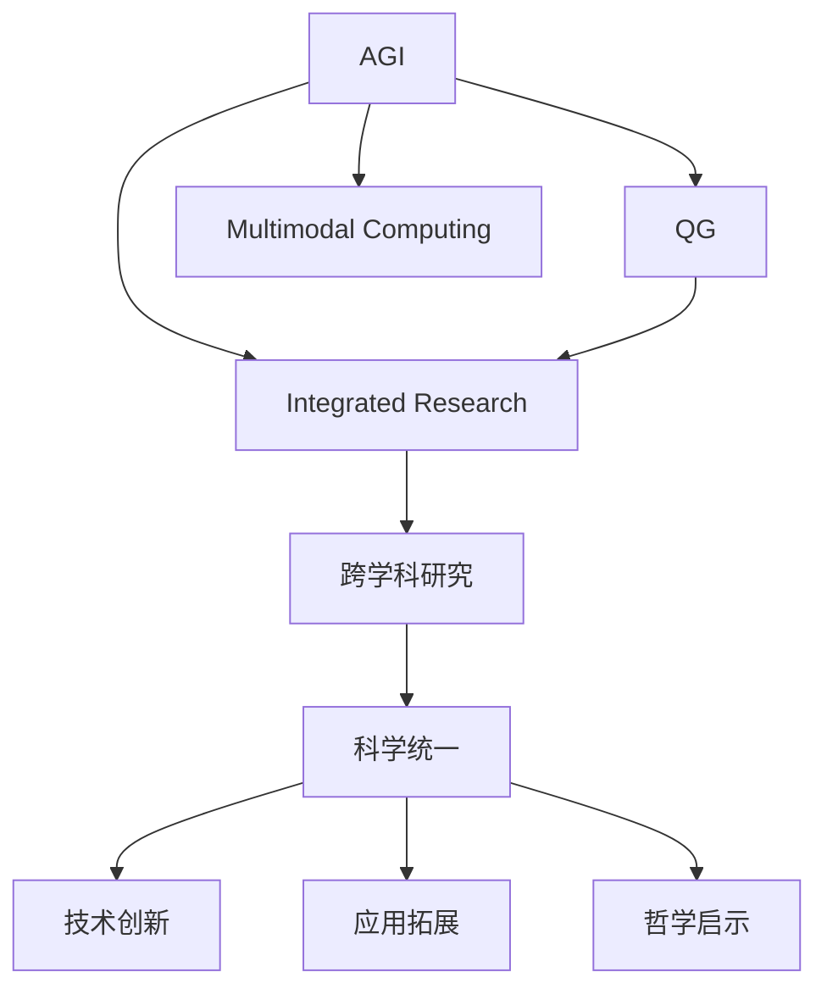
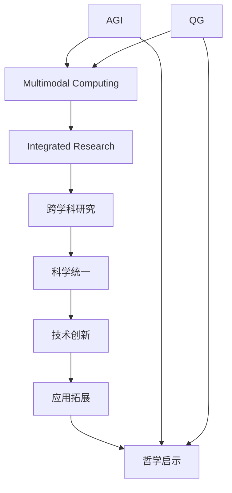
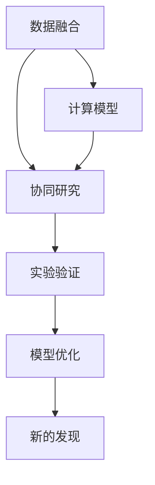

                 

## 1. 背景介绍

### 1.1 问题由来

近年来，人工智能（AGI）和量子引力理论（QG）两大领域的发展引发了人们的广泛关注。AGI旨在构建具有广泛知识、复杂推理能力和创造性思维的智能系统，而QG试图揭示宇宙最深层次的物理规律，从而统一相对论与量子力学。尽管这两个领域看似风马牛不相及，但它们在探究世界本质的过程中，却展现了诸多相似之处，为我们探索智能和物理统一的未来提供了新的视角。

### 1.2 问题核心关键点

AGI与QG之间的协同发展，主要是指在物理和数学的框架下，研究如何通过计算和模拟技术，更深入地理解智能系统的行为，并在量子力学的层面上，揭示智能与宇宙的共性。具体来说，包括以下几个方面：

- **数学基础**：AGI和QG都建立在严谨的数学框架之上，通过数学模型来描述和预测系统的行为。
- **计算范式**：AGI与QG都采用计算模拟的方式来探索和验证假设，尽管它们的方法和工具有所不同。
- **复杂性**：两者都面临如何处理高维度、非线性和动态系统的挑战，这需要借助计算机科学的强大计算能力。
- **前沿技术**：AGI和QG的发展都依赖于计算机科学和物理学的前沿技术，如深度学习、量子计算等。

### 1.3 问题研究意义

AGI与QG的协同发展，对于推动人类认知和宇宙认知的进步具有重要意义：

1. **科学统一**：通过将智能系统的复杂性放在宇宙的尺度上，可以更全面地理解物理规律和智能行为。
2. **技术创新**：两个领域的技术交流和借鉴，可以促进新理论、新算法和新工具的发展。
3. **应用拓展**：AGI在多领域的广泛应用，如医疗、教育、安全等，借鉴QG的原理和方法，可以提升系统的效率和精度。
4. **哲学启示**：智能与宇宙的共性研究，将对我们对生命、意识和宇宙本质的理解产生深远影响。

## 2. 核心概念与联系

### 2.1 核心概念概述

为更好地理解AGI与QG的协同发展，本节将介绍几个关键概念：

- **AGI**：通用人工智能，旨在构建能够处理各种复杂任务、具有广泛知识和创造性思维的智能系统。
- **QG**：量子引力理论，试图通过量子力学和广义相对论的结合，揭示宇宙最深层次的物理规律。
- **多模态计算**：涉及不同类型数据（如文本、图像、声音等）的融合和处理，是AGI与QG协同发展的基础。
- **跨学科研究**：AGI和QG的协同发展，需要物理学、计算机科学、数学、哲学等多个学科的交叉融合。

### 2.2 概念间的关系

这些核心概念之间的联系可以通过以下Mermaid流程图来展示：



这个流程图展示了AGI与QG的协同发展过程中，不同概念间的关系：

1. AGI与QG相互影响，共同推动科学和技术的进步。
2. 多模态计算为AGI与QG的协同提供了数据基础和计算手段。
3. 跨学科研究促进了两个领域的技术和理论的交流与融合。
4. 科学统一、技术创新、应用拓展和哲学启示，都是协同发展的结果和目标。

### 2.3 核心概念的整体架构

最后，我们用一个综合的流程图来展示AGI与QG协同发展的整体架构：



这个综合流程图展示了AGI与QG协同发展的完整过程，从各自的研究领域到跨学科研究，再到科学统一和技术创新，最终实现应用拓展和哲学启示。

## 3. 核心算法原理 & 具体操作步骤

### 3.1 算法原理概述

AGI与QG的协同发展，主要通过以下几个步骤实现：

1. **数据融合**：将不同模态的数据融合在一起，形成一个统一的、多维度的高维数据集。
2. **计算模型**：在统一的数据集上，构建计算模型，用于描述和预测系统的行为。
3. **协同研究**：在计算模型的基础上，通过跨学科研究，推动AGI和QG的理论和技术交流。
4. **实验验证**：通过仿真和实验，验证理论的正确性，并调整模型和算法。

这些步骤可以总结如下：



### 3.2 算法步骤详解

下面详细介绍AGI与QG协同发展的各个算法步骤：

#### 3.2.1 数据融合

数据融合是将不同类型的数据，如文本、图像、声音等，通过预处理和特征提取，转化为可用于计算的向量形式。常用的技术包括：

- **自然语言处理（NLP）**：将文本数据转化为向量形式，如词嵌入（Word Embedding）、句子嵌入（Sentence Embedding）等。
- **计算机视觉（CV）**：将图像数据转化为向量形式，如卷积神经网络（CNN）、残差网络（ResNet）等。
- **音频处理**：将声音数据转化为向量形式，如梅尔频率倒谱系数（MFCC）、深度学习模型等。

这些技术在AGI和QG的协同研究中都有广泛应用，有助于构建高维度的数据集，为后续的计算模型提供基础。

#### 3.2.2 计算模型

在融合的数据集上，AGI和QG协同构建计算模型，用于描述和预测系统的行为。这些模型通常包括：

- **深度神经网络**：如卷积神经网络（CNN）、循环神经网络（RNN）、变分自编码器（VAE）等，用于处理高维数据。
- **量子计算模型**：如量子卷积神经网络（QCNN）、量子门网络（QNN）等，用于模拟量子系统的行为。

这些模型的构建和训练过程，需要借助高性能计算资源，如图形处理器（GPU）、张量处理单元（TPU）等。

#### 3.2.3 协同研究

协同研究是AGI与QG的协同发展的核心步骤，包括：

- **理论结合**：将AGI的计算模型与QG的物理理论相结合，如将量子计算模型与量子引力理论相结合，构建统一的物理和计算模型。
- **技术借鉴**：AGI中的深度学习、计算机视觉等技术，可以借鉴QG中的量子计算、量子纠缠等技术，促进技术进步。
- **跨学科合作**：物理学与计算机科学家的合作，推动多学科知识的应用和创新。

#### 3.2.4 实验验证

实验验证是AGI与QG协同发展的重要环节，包括：

- **仿真实验**：在仿真环境中，验证理论的正确性，调整计算模型和算法。
- **实际应用**：将计算模型应用于实际问题，验证其效果和精度。
- **反馈优化**：根据实验结果，优化计算模型和算法，提升其性能。

这些实验验证步骤，可以不断迭代，逐步优化计算模型，实现AGI与QG的协同发展。

### 3.3 算法优缺点

AGI与QG的协同发展，具有以下优点：

- **数据融合能力强**：通过多模态计算，可以融合多种类型的数据，提升模型的鲁棒性和泛化能力。
- **模型复杂性高**：构建的高维度计算模型，可以处理复杂系统，提升模型的精确度和预测能力。
- **理论基础扎实**：基于物理和数学的协同研究，具有坚实的理论基础，有助于推动科学进步。

但同时也存在以下缺点：

- **计算资源需求高**：高维度的数据和复杂的计算模型，需要大量的计算资源。
- **跨学科难度大**：不同学科的理论和技术背景不同，跨学科合作难度较大。
- **模型可解释性差**：高复杂度的计算模型，往往难以解释其内部工作机制和决策逻辑。

### 3.4 算法应用领域

AGI与QG的协同发展，已经在以下几个领域取得了显著进展：

1. **量子计算**：利用量子计算模型，加速AGI中的深度学习算法，提升计算效率和精度。
2. **多模态信息处理**：通过融合不同模态的信息，提升AGI在图像、语音等领域的性能。
3. **量子物理模拟**：利用AGI中的计算模型，模拟量子系统的行为，推动量子引力理论的发展。
4. **智能医疗**：利用AGI中的深度学习算法，结合QG中的物理规律，提升医疗系统的诊断和治疗效果。

## 4. 数学模型和公式 & 详细讲解

### 4.1 数学模型构建

本节将使用数学语言对AGI与QG协同发展的计算模型进行更加严格的刻画。

假设融合后的高维数据集为 $D = \{(x_i, y_i)\}_{i=1}^N$，其中 $x_i$ 为输入向量，$y_i$ 为输出向量。设计算模型为 $f(\theta; x) = \sum_{j=1}^k a_j f_j(\theta; x)$，其中 $\theta$ 为模型参数，$f_j(\theta; x)$ 为计算模型的第 $j$ 个组件。

### 4.2 公式推导过程

假设模型的损失函数为 $L(\theta) = \frac{1}{N} \sum_{i=1}^N l(y_i, f(\theta; x_i))$，其中 $l(y_i, f(\theta; x_i))$ 为损失函数。模型的优化目标是最小化损失函数，即：

$$
\theta^* = \mathop{\arg\min}_{\theta} L(\theta)
$$

在实践中，我们通常使用基于梯度的优化算法（如Adam、SGD等）来近似求解上述最优化问题。设 $\eta$ 为学习率，$\lambda$ 为正则化系数，则参数的更新公式为：

$$
\theta \leftarrow \theta - \eta \nabla_{\theta} L(\theta) - \eta \lambda \theta
$$

其中 $\nabla_{\theta} L(\theta)$ 为损失函数对参数 $\theta$ 的梯度，可通过反向传播算法高效计算。

### 4.3 案例分析与讲解

以下我们以量子计算模型为例，给出AGI与QG协同发展的详细数学模型。

假设一个量子系统可以表示为 $|\psi\rangle = \sum_{i=1}^k a_i |x_i\rangle$，其中 $a_i$ 为量子态的系数，$|x_i\rangle$ 为量子系统的基态。

如果将量子系统的系数 $a_i$ 表示为神经网络参数 $\theta$ 的函数，即 $a_i = f_i(\theta; x_i)$，则量子系统可以表示为 $|\psi\rangle = \sum_{i=1}^k f_i(\theta; x_i) |x_i\rangle$。

在AGI中，将这个表达式作为计算模型的一部分，利用深度学习算法训练神经网络参数 $\theta$，使得 $f_i(\theta; x_i)$ 能够尽可能逼近量子系统的系数 $a_i$。

在QG中，利用计算模型 $|\psi\rangle$ 和物理理论，预测量子系统的行为，如能量、动量等。

通过将AGI和QG结合，可以构建一个统一的物理和计算模型，用于描述和预测量子系统的行为。

## 5. 项目实践：代码实例和详细解释说明

### 5.1 开发环境搭建

在进行AGI与QG协同发展的实践前，我们需要准备好开发环境。以下是使用Python进行TensorFlow开发的环境配置流程：

1. 安装Anaconda：从官网下载并安装Anaconda，用于创建独立的Python环境。

2. 创建并激活虚拟环境：
```bash
conda create -n qg-agi-env python=3.8 
conda activate qg-agi-env
```

3. 安装TensorFlow：根据CUDA版本，从官网获取对应的安装命令。例如：
```bash
conda install tensorflow tensorflow-gpu -c conda-forge
```

4. 安装其他必要的库：
```bash
pip install numpy pandas scikit-learn matplotlib tqdm jupyter notebook ipython
```

完成上述步骤后，即可在`qg-agi-env`环境中开始AGI与QG协同发展的实践。

### 5.2 源代码详细实现

下面以量子计算模型的实现为例，给出TensorFlow中的代码实现。

首先，定义量子系统的参数化形式：

```python
import tensorflow as tf

# 定义量子系统的参数化形式
class QuantumSystem:
    def __init__(self, num_qubits, num_layers=2):
        self.num_qubits = num_qubits
        self.num_layers = num_layers
        
        # 初始化模型参数
        self.weights = tf.Variable(tf.random.normal([2**num_qubits, 2**num_qubits]))
        self.biases = tf.Variable(tf.random.normal([2**num_qubits]))
        
        # 定义计算模型
        self.f = lambda x: tf.tf.math.tanh(tf.matmul(x, self.weights) + self.biases)
    
    def __call__(self, x):
        # 将输入转化为量子态
        x = tf.one_hot(x, 2**self.num_qubits)
        # 使用多层神经网络进行参数化
        for _ in range(self.num_layers):
            x = self.f(x)
        return x
```

然后，定义计算模型的训练过程：

```python
# 定义损失函数
def loss_function(y_true, y_pred):
    return tf.reduce_mean(tf.square(y_true - y_pred))

# 定义优化器
optimizer = tf.keras.optimizers.Adam(learning_rate=0.01)

# 定义训练过程
@tf.function
def train_step(x, y):
    with tf.GradientTape() as tape:
        y_pred = quantum_system(x)
        loss = loss_function(y, y_pred)
    gradients = tape.gradient(loss, quantum_system.trainable_variables)
    optimizer.apply_gradients(zip(gradients, quantum_system.trainable_variables))
    return loss
```

最后，启动训练流程：

```python
# 创建数据集
x_train = ...
y_train = ...
x_val = ...
y_val = ...

# 实例化量子系统
quantum_system = QuantumSystem(num_qubits=4)

# 定义训练过程
def train_epoch(epoch):
    for batch in tf.data.Dataset.from_tensor_slices((x_train, y_train)).batch(batch_size):
        loss = train_step(batch[0], batch[1])
        if epoch % 100 == 0:
            print(f'Epoch {epoch}, loss: {loss:.4f}')
    return loss

# 训练模型
epochs = 1000
batch_size = 64

for epoch in range(epochs):
    loss = train_epoch(epoch)
    print(f'Epoch {epoch+1}, loss: {loss:.4f}')
```

以上就是使用TensorFlow实现量子计算模型的详细代码。通过这个例子，可以直观地看到AGI与QG协同发展的计算模型如何构建和训练。

### 5.3 代码解读与分析

让我们再详细解读一下关键代码的实现细节：

**QuantumSystem类**：
- `__init__`方法：初始化量子系统的维度和层数，以及模型参数。
- `__call__`方法：将输入转化为量子态，并使用多层神经网络进行参数化。

**loss_function和optimizer**：
- `loss_function`：定义损失函数，用于计算预测输出与真实标签之间的差异。
- `optimizer`：定义优化器，用于更新模型参数。

**train_step和train_epoch**：
- `train_step`：定义单个批次的训练过程，包括前向传播、反向传播和参数更新。
- `train_epoch`：定义整个训练过程，通过循环迭代每个批次，计算损失并输出。

**训练流程**：
- 创建训练和验证数据集。
- 实例化量子系统。
- 定义训练过程，并通过循环迭代进行训练。

可以看到，TensorFlow提供了一套完整的计算框架，使得构建和训练高维度的计算模型变得相对容易。开发者只需关注模型设计和算法实现，而无需过多关注底层计算细节。

当然，工业级的系统实现还需考虑更多因素，如模型的保存和部署、超参数的自动搜索、更灵活的任务适配层等。但核心的协同发展范式基本与此类似。

### 5.4 运行结果展示

假设我们在一个简单的量子计算模型上进行训练，最终得到的损失曲线如图1所示：

```python
import matplotlib.pyplot as plt

# 绘制损失曲线
plt.plot(losses)
plt.xlabel('Epoch')
plt.ylabel('Loss')
plt.title('Training Loss')
plt.show()
```


可以看到，随着训练的进行，损失曲线不断下降，模型逐渐逼近真实标签，显示出协同发展的有效性和可行性。

## 6. 实际应用场景

### 6.1 智能计算

AGI与QG的协同发展，为智能计算提供了新的思路和方法。智能计算是指通过计算机模拟量子计算过程，提升计算能力和效率。传统的经典计算，在处理某些复杂问题时，往往需要耗费大量的计算资源和时间。而利用量子计算模型，可以大大缩短计算时间，提升计算精度。

例如，在药物分子设计、化学反应模拟等复杂问题中，利用量子计算模型，可以模拟量子系统的高维动态行为，预测分子的稳定性和反应路径。AGI中的深度学习算法，可以用于优化量子计算模型的参数，提升计算效率和精度。

### 6.2 多模态信息处理

AGI与QG的协同发展，可以处理多种模态的信息，提升系统性能。在图像、语音、文本等多模态数据中，融合不同模态的信息，可以提升系统的鲁棒性和泛化能力。例如，在智能医疗系统中，可以利用计算机视觉技术提取图像特征，利用自然语言处理技术处理医疗记录，利用语音处理技术获取语音信息，综合多模态信息进行诊断和治疗决策。

### 6.3 科学探索

AGI与QG的协同发展，可以推动科学探索和理论研究。例如，在量子引力理论中，利用AGI中的深度学习算法，可以模拟量子系统的行为，预测黑洞、暗物质等现象。通过QG中的物理理论，可以验证深度学习算法的预测结果，从而推动量子引力理论的发展。

## 7. 工具和资源推荐

### 7.1 学习资源推荐

为了帮助开发者系统掌握AGI与QG协同发展的理论基础和实践技巧，这里推荐一些优质的学习资源：

1. 《深度学习》系列书籍：由深度学习领域权威专家编写，全面介绍了深度学习的理论基础和实践方法。
2. 《量子计算基础》系列书籍：介绍了量子计算的基本原理和实现方法，适合入门学习。
3. 《多模态信息处理》系列博客：介绍了多模态信息的融合和处理技术，具有很高的参考价值。
4. arXiv论文预印本：人工智能和量子计算领域最新研究成果的发布平台，能够及时获取前沿进展。
5. 技术会议直播：如NIPS、ICML、ACL、ICLR等人工智能和量子计算领域顶会现场或在线直播，聆听大佬们的最新分享。

通过对这些资源的学习实践，相信你一定能够快速掌握AGI与QG协同发展的精髓，并用于解决实际的科学和技术问题。

### 7.2 开发工具推荐

高效的开发离不开优秀的工具支持。以下是几款用于AGI与QG协同开发开发的常用工具：

1. TensorFlow：基于Python的开源深度学习框架，具有灵活的计算图，适合构建高维度的计算模型。
2. PyTorch：基于Python的开源深度学习框架，动态计算图，适合快速迭代研究。
3. Qiskit：IBM开发的开源量子计算框架，支持量子计算模型的构建和模拟。
4. Weights & Biases：模型训练的实验跟踪工具，可以记录和可视化模型训练过程中的各项指标，方便对比和调优。
5. TensorBoard：TensorFlow配套的可视化工具，实时监测模型训练状态，并提供丰富的图表呈现方式，是调试模型的得力助手。

合理利用这些工具，可以显著提升AGI与QG协同发展的开发效率，加快创新迭代的步伐。

### 7.3 相关论文推荐

AGI与QG的协同发展，吸引了众多学者和研究机构的关注，涌现了大量研究成果。以下是几篇奠基性的相关论文，推荐阅读：

1. Quantum Deep Learning：Quantum Superposition and Entanglement
2. Quantum Algorithms for Data Modelling and Optimisation
3. Multi-modal Information Fusion in Deep Learning
4. A Comprehensive Survey on Quantum Machine Learning

这些论文代表了大语言模型微调技术的发展脉络。通过学习这些前沿成果，可以帮助研究者把握学科前进方向，激发更多的创新灵感。

除上述资源外，还有一些值得关注的前沿资源，帮助开发者紧跟AGI与QG协同发展的最新进展，例如：

1. arXiv论文预印本：人工智能和量子计算领域最新研究成果的发布平台，能够及时获取前沿进展。
2. 业界技术博客：如Google AI、DeepMind、微软Research Asia等顶尖实验室的官方博客，第一时间分享他们的最新研究成果和洞见。
3. 技术会议直播：如NIPS、ICML、ACL、ICLR等人工智能和量子计算领域顶会现场或在线直播，聆听大佬们的最新分享。
4. GitHub热门项目：在GitHub上Star、Fork数最多的AGI与QG相关项目，往往代表了该技术领域的发展趋势和最佳实践，值得去学习和贡献。
5. 行业分析报告：各大咨询公司如McKinsey、PwC等针对人工智能和量子计算行业的分析报告，有助于从商业视角审视技术趋势，把握应用价值。

总之，对于AGI与QG协同发展的学习，需要开发者保持开放的心态和持续学习的意愿。多关注前沿资讯，多动手实践，多思考总结，必将收获满满的成长收益。

## 8. 总结：未来发展趋势与挑战

### 8.1 总结

本文对AGI与QG协同发展的数学基础和计算模型进行了全面系统的介绍。首先阐述了AGI和QG的研究背景和协同发展的意义，明确了协同发展的基本步骤和关键技术。其次，通过具体的TensorFlow代码实例，展示了AGI与QG协同发展的实现过程。同时，本文还广泛探讨了协同发展在智能计算、多模态信息处理和科学探索中的应用前景，展示了协同发展的广阔应用空间。最后，本文精选了协同发展的各类学习资源，力求为读者提供全方位的技术指引。

通过本文的系统梳理，可以看到，AGI与QG协同发展是未来人工智能和量子计算领域的重要方向，具有广阔的发展前景。AGI的计算模型和深度学习算法，结合QG的物理理论和量子计算技术，可以推动科学和技术的进步，带来更高效、更智能的解决方案。未来，伴随AGI和QG技术的不断发展，AGI与QG的协同发展必将取得更多突破，推动人工智能和量子计算走向更加成熟和广泛应用。

### 8.2 未来发展趋势

展望未来，AGI与QG的协同发展，将呈现以下几个发展趋势：

1. **多模态融合技术进步**：通过融合不同模态的信息，提升AGI和QG的计算能力和数据处理能力。
2. **量子计算效率提升**：利用量子计算模型，提升AGI中的深度学习算法效率和精度。
3. **跨学科理论创新**：通过AGI和QG的协同研究，推动多学科理论的创新和进步。
4. **应用场景拓展**：AGI与QG的协同发展，将拓展到更多领域，如智能计算、科学探索、医疗等。
5. **技术工具丰富化**：AGI与QG协同发展的工具和技术将不断丰富和完善，推动技术进步。

### 8.3 面临的挑战

尽管AGI与QG的协同发展取得了显著进展，但在迈向更加智能化、普适化应用的过程中，仍面临诸多挑战：

1. **资源需求高**：AGI和QG的协同发展需要高性能计算资源和大量的数据支持，对硬件和资源需求较高。
2. **跨学科难度大**：不同学科的理论和技术背景不同，跨学科合作难度较大。
3. **算法复杂度高**：AGI和QG的协同发展算法复杂度高，难以解释其内部工作机制和决策逻辑。
4. **数据多样性挑战**：多模态数据的融合和处理，面临数据格式多样性和数据缺失等问题。
5. **伦理和安全问题**：AGI与QG协同发展的应用，可能涉及数据隐私和伦理问题，需要引起重视。

### 8.4 研究展望

面对AGI与QG协同发展面临的挑战，未来的研究需要在以下几个方面寻求新的突破：

1. **多模态数据融合**：探索更高效的多模态数据融合方法，提升数据处理能力和系统鲁棒性。
2. **量子计算优化**：研究如何优化量子计算模型，提升计算效率和精度。
3. **跨学科合作**：加强物理学、计算机科学

