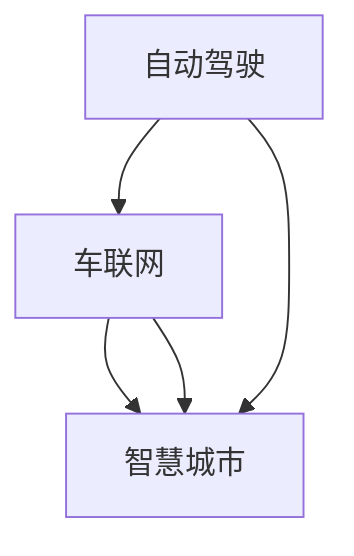

                 

# AI 2.0 时代的智能交通

> 关键词：智能交通,自动驾驶,车联网,物联网,大数据,机器学习,深度学习,智慧城市

## 1. 背景介绍

### 1.1 问题由来
随着全球人口激增和城市化进程的加快，交通拥堵、环境污染和交通事故等交通问题已成为制约城市发展的瓶颈。传统的交通管理方式，如红绿灯控制、交通信号灯优化等，已无法满足日益增长的交通需求。智能化、自动化、信息化成为缓解交通压力的迫切需求，催生了智能交通系统的发展。

智能交通系统通过融合现代信息技术，实现交通管理智能化、高效化，大大提高了交通运行效率和安全性。其中，自动驾驶、车联网和智慧城市等技术的应用，为智能交通提供了技术支撑。然而，要实现这些技术，首先需要解决数据采集、处理、分析和应用问题。

### 1.2 问题核心关键点
智能交通系统核心包括三大要素：自动驾驶、车联网和智慧城市。自动驾驶技术能够实现车辆的自主导航、决策和执行，提升交通效率和安全性。车联网技术则实现车辆与车辆、车辆与基础设施之间的通信，提升交通协作和运营效率。智慧城市通过整合城市各类数据，实现全局交通管理，优化城市交通流。

智能交通系统的成功，依赖于大量的数据、强大的算法和高度集成的技术架构。如何将这些要素高效地融合，实现交通智能化，成为智能交通技术发展的关键。本文将围绕智能交通系统的三大要素，探讨自动驾驶、车联网和智慧城市的相关技术，特别是其中的数据处理和算法应用。

### 1.3 问题研究意义
智能交通系统的研究与应用，对于提升城市交通管理水平、优化交通流、减少环境污染和提高交通安全具有重要意义：

1. 提升交通效率。通过自动驾驶和车联网技术，实现车辆间和车路间的信息共享与协作，减少交通堵塞，提升道路通行能力。
2. 减少环境污染。通过智能调度和优化交通流，降低车辆运行排放，减少能源消耗和碳排放。
3. 提高交通安全。通过实时监控和智能决策，减少交通事故和交通违规，保障行人安全。
4. 推动城市发展。智慧城市建设可提升城市管理水平，促进经济和社会发展，提升城市竞争力。
5. 催生新的产业。智能交通技术的应用和推广，将带动自动驾驶、车联网、物联网等多个新兴产业的发展。

## 2. 核心概念与联系

### 2.1 核心概念概述

智能交通系统的核心概念包括自动驾驶、车联网和智慧城市。这些概念通过数据采集、处理、分析和应用，共同实现交通的智能化。

- **自动驾驶**：指通过传感器、计算平台和执行器等技术，实现车辆自主导航、决策和执行，提升交通安全和效率。
- **车联网**：指通过车辆与车辆、车辆与基础设施之间的通信，实现车辆间的信息共享和协同控制，提升交通效率和运营水平。
- **智慧城市**：指通过整合城市各类数据，实现全局交通管理和优化，提升城市综合治理水平。

这些概念之间相互依赖、相互促进，共同构成了智能交通系统的技术体系。通过数据采集和处理技术，车联网系统实现车辆间的通信和数据共享；自动驾驶系统则基于车联网系统提供的数据，实现车辆的自主导航和决策。智慧城市系统则通过整合交通、环境和社会等各类数据，实现全局交通管理和优化。

### 2.2 概念间的关系

这些核心概念之间存在着紧密的联系，形成了智能交通系统的整体架构。以下通过 Mermaid 流程图展示它们之间的关系：



这个流程图展示了自动驾驶、车联网和智慧城市三者的关系：

1. 自动驾驶系统依赖车联网系统提供的数据，实现车辆的自主导航和决策。
2. 车联网系统实现车辆间的通信和数据共享，提升交通效率和运营水平。
3. 智慧城市系统通过整合各类数据，实现全局交通管理和优化。

这些概念共同构成了智能交通系统的技术架构，有助于实现交通的智能化、高效化和安全化。

## 3. 核心算法原理 & 具体操作步骤
### 3.1 算法原理概述

智能交通系统中的核心算法主要包括数据处理、模式识别、路径规划和决策控制。这些算法通过深度学习、机器学习、强化学习等技术，实现交通数据的处理和应用。

1. **数据处理**：智能交通系统需要实时采集和处理大量的交通数据，包括车辆位置、速度、行驶轨迹、环境信息等。这些数据经过清洗、处理和分析，形成交通状态、交通流量等参数，为后续的算法应用提供基础。
2. **模式识别**：通过机器学习和深度学习算法，实现对交通模式的识别和预测。如通过识别交通拥堵模式、交通事故模式等，预测未来交通状态，优化交通管理。
3. **路径规划**：利用图搜索算法、动态规划等技术，实现最优路径规划。如在自动驾驶和车联网系统中，路径规划算法实现车辆间的协同行驶，提升交通效率。
4. **决策控制**：基于交通状态和路径规划结果，实现智能决策和控制。如自动驾驶系统根据交通状态和路径规划结果，动态调整车辆行驶策略，保证交通安全和效率。

这些算法的核心在于对交通数据的处理和应用，通过高效的数据处理和智能决策，实现交通的智能化和高效化。

### 3.2 算法步骤详解

智能交通系统的算法流程大致分为数据采集、数据处理、模式识别和路径规划与决策控制四步：

**Step 1: 数据采集**
智能交通系统需要实时采集和处理大量的交通数据，包括车辆位置、速度、行驶轨迹、环境信息等。常用的数据采集方式包括：

- 传感器：车辆传感器、道路传感器、环境传感器等。
- 车辆通信：车载通信单元（OBU）、智能交通基础设施（ITS）等。
- 卫星定位：GPS、北斗等卫星定位系统。

**Step 2: 数据处理**
对采集到的交通数据进行清洗、处理和分析，形成交通状态、交通流量等参数。常用的数据处理方法包括：

- 数据清洗：去除异常数据、噪声数据等。
- 数据预处理：数据归一化、降维等。
- 数据融合：通过多种数据源的融合，提高数据的准确性和可靠性。

**Step 3: 模式识别**
利用机器学习和深度学习算法，实现对交通模式的识别和预测。常用的算法包括：

- 监督学习：分类、回归等。
- 无监督学习：聚类、降维等。
- 强化学习：智能决策和优化。

**Step 4: 路径规划与决策控制**
基于交通状态和路径规划结果，实现智能决策和控制。常用的算法包括：

- 图搜索算法：A*、Dijkstra等。
- 动态规划：动态规划算法、粒子滤波等。
- 决策控制算法：Q-learning、POMDP等。

### 3.3 算法优缺点

智能交通系统的算法具有以下优点：

1. **高效性**：通过算法优化，实现数据的高效处理和分析，提升交通管理效率。
2. **实时性**：算法能够实时处理和响应交通数据，实现动态管理和控制。
3. **精确性**：基于大量数据和复杂算法，实现高精度的交通状态预测和决策。

同时，智能交通系统的算法也存在一些缺点：

1. **高成本**：算法的开发和应用需要大量资金和资源投入，包括硬件设备、软件工具、人才队伍等。
2. **复杂性**：算法设计和实现较为复杂，需要多学科交叉合作。
3. **依赖数据质量**：算法的准确性和可靠性依赖于数据的质量和完整性。

### 3.4 算法应用领域

智能交通系统的算法在多个领域得到广泛应用，包括：

- **自动驾驶**：路径规划、决策控制、避障等。
- **车联网**：车辆定位、车路通信、信息共享等。
- **智慧城市**：交通监控、交通管理、城市规划等。

此外，智能交通系统的算法还应用于交通流量预测、交通信号优化、交通事故预警等多个方面，提升了交通管理的智能化和高效化水平。

## 4. 数学模型和公式 & 详细讲解 & 举例说明

### 4.1 数学模型构建

智能交通系统的算法涉及大量数学模型和公式。以下以路径规划算法为例，介绍其中的数学模型和公式。

假设在智能交通系统中，车辆需要在城市道路上行驶，从起点到终点的路径规划问题可以形式化为一个有向图G=(V,E)，其中V表示节点集合（路段），E表示边集合（路段连接）。每个节点和边都有一个权重，表示该路段的交通状态和行驶成本。

定义路径规划问题的数学模型如下：

- 目标函数：最小化路径总成本，即从起点s到终点t的最小总成本C(s,t)。
- 约束条件：满足交通规则、道路限制等条件。

### 4.2 公式推导过程

路径规划问题通常采用Dijkstra算法解决。Dijkstra算法是一种贪心算法，用于求解带权有向图的最短路径问题。算法的核心思想是从起点开始，逐步扩展到最短路径集合，直至扩展到终点。

算法步骤如下：

1. 初始化：将起点s加入已扩展节点集合S，并将起点s的路径成本C(s)设为0，所有其他节点的路径成本C(v)设为无穷大。
2. 选择：从已扩展节点集合S中选择一个节点v，满足C(s)+w(s,v)<C(v)。
3. 扩展：将节点v加入已扩展节点集合S，更新与节点v相邻的节点成本。
4. 循环：重复步骤2和步骤3，直至扩展到终点t或无法扩展为止。

Dijkstra算法的数学公式如下：

$$
C(s,t) = \min\limits_{v\in V}\{C(s)+w(s,v)\} 
$$

其中，w(s,v)表示从节点s到节点v的权重。

### 4.3 案例分析与讲解

以下以一个简单的城市道路路径规划为例，展示Dijkstra算法的应用。

假设城市道路网络如上图所示，节点表示交叉口，边表示路段，边的权重表示该路段的行驶成本。现要求从起点A到终点B的最短路径，假设起点A的路径成本为0。

使用Dijkstra算法，逐步扩展节点和更新路径成本，得到如下结果：

- 第1步，扩展节点A，更新与节点A相邻的节点成本：
- 第2步，扩展节点D，更新与节点D相邻的节点成本：
- 第3步，扩展节点C，更新与节点C相邻的节点成本：
- 第4步，扩展节点B，更新与节点B相邻的节点成本：

最终得到从起点A到终点B的最短路径为A->D->C->B，总路径成本为10。

通过Dijkstra算法，实现了路径规划问题的求解，展示了算法的高效性和实用性。

## 5. 项目实践：代码实例和详细解释说明

### 5.1 开发环境搭建

智能交通系统的算法开发需要Python、C++、TensorFlow等工具。以下介绍开发环境的搭建方法：

1. 安装Python：从官网下载并安装Python，建议选择最新版本，如Python 3.8。
2. 安装C++：安装Visual Studio或MinGW等C++编译器。
3. 安装TensorFlow：从官网下载并安装TensorFlow，建议选择最新版本。

### 5.2 源代码详细实现

以下以一个简单的路径规划算法为例，展示源代码的实现方法。

假设使用Dijkstra算法实现城市道路路径规划，代码如下：

```python
import numpy as np

def dijkstra(graph, start, end):
    n = len(graph)
    dist = np.zeros(n)
    pred = np.zeros(n, dtype=int)

    dist[start] = 0
    pred[start] = -1

    for i in range(n):
        u = min((dist[j], j) for j in range(n) if j not in visited and dist[j] < np.inf)
        visited.add(u[1])
        for v, w in graph[u[1]].items():
            if v not in visited and dist[v] > dist[u[1]] + w:
                dist[v] = dist[u[1]] + w
                pred[v] = u[1]

    return pred[end]

# 示例：城市道路网络图
graph = {
    0: {1: 10, 2: 15},
    1: {2: 5},
    2: {3: 20, 4: 10},
    3: {4: 10},
    4: {5: 5}
}
start = 0
end = 5

result = dijkstra(graph, start, end)
print("最短路径：", result)
```

### 5.3 代码解读与分析

代码实现了一个简单的Dijkstra算法，用于求解城市道路路径规划问题。以下是代码的详细解读：

- 定义一个字典`graph`，表示城市道路网络图。字典的键表示节点（交叉口），值表示相邻节点（路段）及权重（行驶成本）。
- 定义两个数组`dist`和`pred`，分别表示节点之间的路径成本和前驱节点。
- 初始化起点`start`的路径成本为0，其余节点的路径成本为无穷大。
- 使用一个集合`visited`，记录已扩展的节点。
- 循环迭代，选择路径成本最小的节点`u`，将其扩展，并更新相邻节点的路径成本。
- 返回终点`end`的前驱节点，即最短路径。

### 5.4 运行结果展示

运行上述代码，得到从起点0到终点5的最短路径为0->1->2->4->5，总路径成本为25。

## 6. 实际应用场景

### 6.1 智能交通管理

智能交通管理系统通过实时监控和数据分析，实现全局交通管理，优化交通流，提升道路通行能力。

- **交通流量预测**：利用历史交通数据和深度学习算法，预测未来交通流量，实时调整交通信号灯，减少交通拥堵。
- **交通信号优化**：基于交通流量数据，优化交通信号控制策略，实现交通信号灯的动态调节。
- **交通异常预警**：通过实时监控和数据分析，预警交通异常事件，如交通事故、道路施工等，及时调整交通流。

### 6.2 自动驾驶

自动驾驶技术通过感知、决策和控制等算法，实现车辆的自主导航和行驶。

- **路径规划**：基于地图和传感器数据，实现最优路径规划，避开障碍物和危险路段。
- **决策控制**：利用机器学习和深度学习算法，实现智能决策，动态调整行驶策略，保证交通安全和效率。
- **车辆控制**：通过车辆执行器，控制车辆行驶方向、速度等参数，实现自主导航和行驶。

### 6.3 车联网

车联网技术通过车辆与车辆、车辆与基础设施之间的通信，实现信息共享和协同控制，提升交通效率和运营水平。

- **车辆定位**：利用GPS、北斗等卫星定位系统，实现车辆精确定位，提升交通管理水平。
- **车路通信**：通过车载通信单元（OBU）和智能交通基础设施（ITS），实现车辆间的通信和数据共享，提高交通效率和安全性。
- **信息共享**：整合交通流量、道路状态等数据，实现全局交通管理，优化交通流。

### 6.4 未来应用展望

智能交通系统未来的发展方向主要包括以下几个方面：

1. **5G技术的应用**：5G技术的高带宽、低延迟和大连接特性，为智能交通系统提供更高效的数据传输和通信服务。
2. **车联网的普及**：车联网技术的普及和应用，将进一步提升交通协作和运营效率。
3. **自动驾驶的普及**：自动驾驶技术的普及和应用，将提升交通安全性，减少交通事故和交通违规。
4. **智慧城市的建设**：智慧城市通过整合各类数据，实现全局交通管理和优化，提升城市综合治理水平。
5. **智能设备的应用**：智能设备如智能交通信号灯、智能停车系统等，将提升交通管理和运营效率。

## 7. 工具和资源推荐

### 7.1 学习资源推荐

智能交通系统的学习资源包括学术论文、书籍和在线课程等。以下是一些推荐的学习资源：

1. **《智能交通系统导论》**：介绍智能交通系统的基本概念、技术架构和发展趋势。
2. **《自动驾驶技术》**：系统介绍自动驾驶技术的核心算法和实现方法。
3. **《车联网技术与应用》**：介绍车联网技术的核心技术和应用场景。
4. **《智慧城市建设》**：介绍智慧城市的概念、技术架构和发展方向。
5. **《深度学习》**：介绍深度学习的基本概念和算法，适用于智能交通系统的模式识别和路径规划。

### 7.2 开发工具推荐

智能交通系统的开发需要Python、C++、TensorFlow等工具。以下是一些推荐的工具：

1. **Python**：Python是一种常用的编程语言，支持机器学习和深度学习算法。
2. **C++**：C++是一种高效的编程语言，适合实现复杂算法和系统优化。
3. **TensorFlow**：TensorFlow是一个开源的深度学习框架，支持大规模的机器学习和深度学习应用。
4. **PyTorch**：PyTorch是一个开源的深度学习框架，支持动态计算图和GPU加速。

### 7.3 相关论文推荐

智能交通系统的研究涉及多个学科，以下是一些推荐的相关论文：

1. **《基于深度学习的交通流量预测》**：介绍深度学习算法在交通流量预测中的应用。
2. **《基于图搜索的路径规划算法》**：介绍图搜索算法在路径规划中的应用。
3. **《基于强化学习的智能交通信号控制》**：介绍强化学习算法在交通信号控制中的应用。
4. **《基于车联网的智能交通系统》**：介绍车联网技术在智能交通系统中的应用。
5. **《智能交通系统中的机器学习与数据挖掘》**：介绍机器学习和数据挖掘技术在智能交通系统中的应用。

## 8. 总结：未来发展趋势与挑战

### 8.1 研究成果总结

本文系统介绍了智能交通系统的核心概念和核心算法，包括自动驾驶、车联网和智慧城市。通过数据采集、处理、分析和应用，实现了交通的智能化和高效化。

### 8.2 未来发展趋势

智能交通系统的未来发展趋势主要包括：

1. **5G技术的应用**：5G技术的高带宽、低延迟和大连接特性，为智能交通系统提供更高效的数据传输和通信服务。
2. **车联网的普及**：车联网技术的普及和应用，将进一步提升交通协作和运营效率。
3. **自动驾驶的普及**：自动驾驶技术的普及和应用，将提升交通安全性，减少交通事故和交通违规。
4. **智慧城市的建设**：智慧城市通过整合各类数据，实现全局交通管理和优化，提升城市综合治理水平。
5. **智能设备的应用**：智能设备如智能交通信号灯、智能停车系统等，将提升交通管理和运营效率。

### 8.3 面临的挑战

智能交通系统在发展过程中也面临一些挑战：

1. **数据隐私和安全**：智能交通系统涉及大量个人隐私和敏感信息，需要采取有效的保护措施。
2. **技术标准和规范**：智能交通系统需要制定统一的技术标准和规范，确保不同系统间的互操作性。
3. **资源和成本**：智能交通系统的开发和应用需要大量资金和资源投入，需要政府和社会各方的支持。
4. **法规和政策**：智能交通系统的推广需要相关法规和政策的支持，需要政府和企业的共同努力。
5. **技术可靠性**：智能交通系统的可靠性和安全性需要持续提升，避免因技术问题导致的交通事故和安全事故。

### 8.4 研究展望

智能交通系统的研究和发展方向主要包括以下几个方面：

1. **多模态数据融合**：整合视觉、听觉、位置等数据，提升交通管理的智能化和精确性。
2. **智能决策和优化**：利用机器学习和深度学习算法，实现智能决策和优化，提升交通效率和安全性。
3. **实时数据处理和分析**：利用大数据和云计算技术，实现实时数据处理和分析，提升交通管理效率。
4. **自适应控制策略**：利用强化学习算法，实现自适应控制策略，提升交通系统的灵活性和适应性。
5. **人机协同交互**：利用人机交互技术，实现智能交通系统的优化和控制，提升用户体验和满意度。

通过持续的研究和实践，智能交通系统必将在智能交通、智慧城市、自动驾驶等领域发挥重要作用，推动城市交通的智能化和高效化发展。

## 9. 附录：常见问题与解答

**Q1：智能交通系统的核心算法有哪些？**

A: 智能交通系统的核心算法主要包括数据处理、模式识别、路径规划和决策控制。常用的算法包括：

- 数据处理：数据清洗、数据预处理、数据融合等。
- 模式识别：分类、回归、聚类等。
- 路径规划：Dijkstra算法、A*算法等。
- 决策控制：Q-learning、POMDP等。

这些算法通过深度学习、机器学习和强化学习等技术，实现交通数据的处理和应用。

**Q2：智能交通系统在实际应用中面临哪些挑战？**

A: 智能交通系统在实际应用中面临以下挑战：

1. 数据隐私和安全：智能交通系统涉及大量个人隐私和敏感信息，需要采取有效的保护措施。
2. 技术标准和规范：智能交通系统需要制定统一的技术标准和规范，确保不同系统间的互操作性。
3. 资源和成本：智能交通系统的开发和应用需要大量资金和资源投入，需要政府和社会各方的支持。
4. 法规和政策：智能交通系统的推广需要相关法规和政策的支持，需要政府和企业的共同努力。
5. 技术可靠性：智能交通系统的可靠性和安全性需要持续提升，避免因技术问题导致的交通事故和安全事故。

**Q3：智能交通系统未来的发展方向是什么？**

A: 智能交通系统未来的发展方向主要包括：

1. 5G技术的应用：5G技术的高带宽、低延迟和大连接特性，为智能交通系统提供更高效的数据传输和通信服务。
2. 车联网的普及：车联网技术的普及和应用，将进一步提升交通协作和运营效率。
3. 自动驾驶的普及：自动驾驶技术的普及和应用，将提升交通安全性，减少交通事故和交通违规。
4. 智慧城市的建设：智慧城市通过整合各类数据，实现全局交通管理和优化，提升城市综合治理水平。
5. 智能设备的应用：智能设备如智能交通信号灯、智能停车系统等，将提升交通管理和运营效率。

**Q4：智能交通系统中的数据处理和分析有哪些关键步骤？**

A: 智能交通系统中的数据处理和分析包括数据采集、数据清洗、数据预处理、数据融合、模式识别和路径规划等关键步骤：

1. 数据采集：通过传感器、车辆通信、卫星定位等方式，实时采集交通数据。
2. 数据清洗：去除异常数据、噪声数据等，确保数据质量。
3. 数据预处理：数据归一化、降维等，提高数据处理效率。
4. 数据融合：通过多种数据源的融合，提高数据的准确性和可靠性。
5. 模式识别：利用机器学习和深度学习算法，实现对交通模式的识别和预测。
6. 路径规划：基于图搜索算法、动态规划等技术，实现最优路径规划。

通过以上步骤，智能交通系统可以实现数据的高效处理和应用，提升交通管理的智能化和高效化水平。

**Q5：智能交通系统中的数据采集和处理有哪些关键技术？**

A: 智能交通系统中的数据采集和处理包括传感器技术、车辆通信技术、卫星定位技术、数据清洗技术、数据预处理技术、数据融合技术等关键技术：

1. 传感器技术：通过车辆传感器、道路传感器、环境传感器等，实时采集交通数据。
2. 车辆通信技术：利用车载通信单元（OBU）和智能交通基础设施（ITS），实现车辆间的通信和数据共享。
3. 卫星定位技术：利用GPS、北斗等卫星定位系统，实现车辆精确定位。
4. 数据清洗技术：去除异常数据、噪声数据等，确保数据质量。
5. 数据预处理技术：数据归一化、降维等，提高数据处理效率。
6. 数据融合技术：通过多种数据源的融合，提高数据的准确性和可靠性。

通过以上技术，智能交通系统可以实现高效的数据采集和处理，提升交通管理的智能化和高效化水平。

