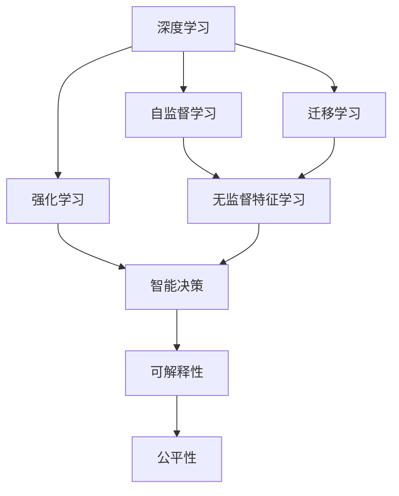
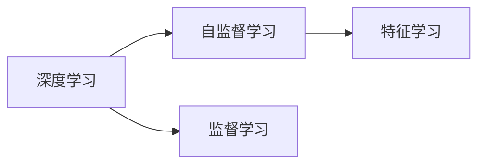
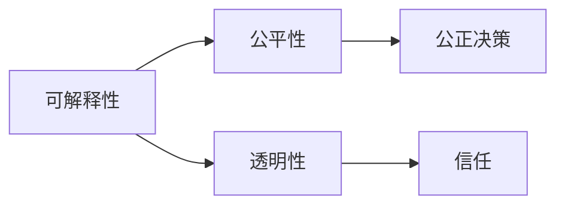
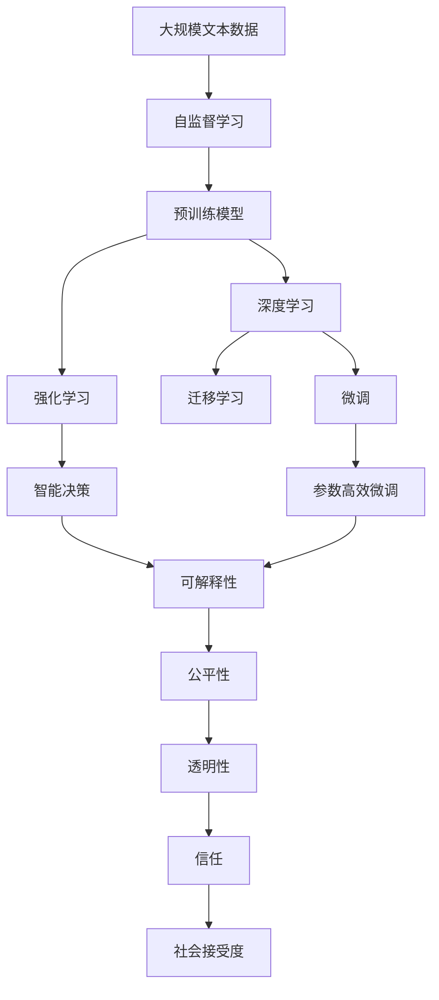

                 

# AI 2.0 时代的机器学习

> 关键词：AI 2.0, 机器学习, 深度学习, 强化学习, 自监督学习, 迁移学习, 可解释性, 公平性

## 1. 背景介绍

### 1.1 问题由来
随着人工智能技术的不断演进，我们正处于AI 2.0时代——一个以大规模、高性能计算为支撑，深度学习、强化学习、自监督学习等前沿技术为基础的新纪元。这个时代的特点是，机器学习模型在处理复杂任务和自主决策方面的能力大幅提升，并已逐渐渗透到各行各业，改变了我们的生产方式、生活方式和思维方式。

然而，AI 2.0时代也面临着一系列新问题，包括模型复杂度的增加、算力需求的激增、数据隐私和安全性的挑战，以及模型公平性、透明性和可解释性的需求。如何在享受AI带来的便利的同时，克服这些挑战，是当前机器学习领域的重要课题。

### 1.2 问题核心关键点
AI 2.0时代的机器学习，核心在于利用深度学习、强化学习、自监督学习等前沿技术，构建能够自主学习、自主决策的智能系统。这些技术能够通过大量数据和计算资源的积累，实现模型的自主优化和复杂任务的解决。

然而，这些技术也带来了新的挑战。例如：

1. **模型复杂性**：深度学习模型的参数量和计算复杂度巨大，对算力需求高，训练时间长。
2. **数据隐私**：模型训练依赖大量数据，数据隐私和安全问题凸显。
3. **模型公平性**：模型可能存在偏见，对特定群体的决策可能不公平。
4. **模型可解释性**：复杂模型难以解释其决策过程，缺乏可解释性。
5. **模型泛化能力**：模型在训练集上的表现可能无法泛化到测试集和新数据上。

这些问题需要通过技术创新和政策引导来解决，以确保AI技术的发展能够真正惠及社会，而不是带来新的问题。

### 1.3 问题研究意义
研究AI 2.0时代的机器学习，对于推动技术进步、促进社会福祉、保障数据安全具有重要意义：

1. **技术进步**：深入探索深度学习、强化学习、自监督学习等前沿技术，为AI技术的发展提供新的理论和实践基础。
2. **社会福祉**：通过模型公平性、透明性和可解释性的研究，提升AI技术的社会接受度和信任度。
3. **数据安全**：加强数据隐私和安全保护，确保AI技术的健康发展。
4. **行业应用**：推动AI技术在医疗、教育、交通、金融等行业的落地应用，提升社会生产效率。
5. **伦理道德**：探讨AI技术对伦理道德的影响，推动技术伦理和政策规范的研究和制定。

本文将从核心概念、算法原理、应用场景和未来展望等方面，系统介绍AI 2.0时代的机器学习技术及其在实践中的挑战与应对策略。

## 2. 核心概念与联系

### 2.1 核心概念概述

为更好地理解AI 2.0时代的机器学习，本节将介绍几个密切相关的核心概念：

- **深度学习**：一种基于神经网络结构的机器学习方法，通过多层非线性变换，实现对复杂数据的表示和处理。
- **强化学习**：一种通过与环境交互，优化决策策略的机器学习方法，常用于自动控制、游戏AI等场景。
- **自监督学习**：一种无需标注数据，利用数据的内在结构进行学习的机器学习方法，常用于数据预处理和特征学习。
- **迁移学习**：一种将一个领域学到的知识，迁移到另一个不同但相关的领域，以减少学习时间，提高学习效果的方法。
- **可解释性**：指模型的决策过程能够被人类理解，常用于金融、医疗等高风险领域。
- **公平性**：指模型在处理不同群体时，决策的公平性和公正性，常用于社会福利、就业等领域。

这些核心概念之间的逻辑关系可以通过以下Mermaid流程图来展示：



这个流程图展示了大语言模型的核心概念及其之间的关系：

1. 深度学习通过多层非线性变换，实现对数据的复杂表示。
2. 自监督学习利用数据的内在结构，无需标注数据进行特征学习。
3. 强化学习通过与环境交互，优化决策策略。
4. 迁移学习将知识从一个领域迁移到另一个领域，提高学习效果。
5. 可解释性和公平性是确保AI技术社会接受度的重要因素。

这些核心概念共同构成了AI 2.0时代机器学习的完整生态系统，使其能够在各种场景下发挥强大的智能决策和自主学习能力。

### 2.2 概念间的关系

这些核心概念之间存在着紧密的联系，形成了AI 2.0时代机器学习的完整生态系统。下面我通过几个Mermaid流程图来展示这些概念之间的关系。

#### 2.2.1 深度学习与自监督学习的关系



这个流程图展示了深度学习与自监督学习的关系：

1. 深度学习通过多层非线性变换，实现对数据的复杂表示。
2. 自监督学习利用数据的内在结构，无需标注数据进行特征学习。
3. 深度学习和自监督学习协同工作，可以在较少标注数据的情况下，实现良好的特征表示和模型性能。

#### 2.2.2 强化学习与智能决策的关系


这个流程图展示了强化学习与智能决策的关系：

1. 强化学习通过与环境交互，优化决策策略。
2. 智能决策通过强化学习，实现自主优化和决策。

#### 2.2.3 可解释性与公平性的关系



这个流程图展示了可解释性与公平性的关系：

1. 可解释性指模型的决策过程能够被人类理解。
2. 公平性指模型在处理不同群体时，决策的公正性和公平性。
3. 可解释性和公平性协同工作，可以增强AI技术的社会接受度和信任度。

### 2.3 核心概念的整体架构

最后，我们用一个综合的流程图来展示这些核心概念在大语言模型微调过程中的整体架构：



这个综合流程图展示了从自监督学习到深度学习、强化学习、迁移学习、微调、智能决策，再到可解释性、公平性、透明性、信任和社会接受度的完整过程。通过这些流程图，我们可以更清晰地理解AI 2.0时代机器学习技术的整体架构和运行机制。

## 3. 核心算法原理 & 具体操作步骤
### 3.1 算法原理概述

AI 2.0时代的机器学习，包括深度学习、强化学习、自监督学习等前沿技术，其核心思想是通过大量数据和计算资源的积累，构建能够自主学习、自主决策的智能系统。

形式化地，假设模型为 $M_{\theta}$，其中 $\theta$ 为模型参数。目标是通过训练数据 $D=\{(x_i,y_i)\}_{i=1}^N$ 训练模型，使得在新的测试数据 $D_t$ 上，模型能够获得理想的性能指标 $P$，即：

$$
M_{\theta} = \arg\min_{\theta} \sum_{i=1}^N \mathcal{L}(M_{\theta}(x_i),y_i) + \lambda R(\theta)
$$

其中 $\mathcal{L}$ 为损失函数，$R$ 为正则化函数，$\lambda$ 为正则化系数。

通过梯度下降等优化算法，不断更新模型参数 $\theta$，最小化损失函数 $\mathcal{L}$，同时约束正则化函数 $R$，以获得理想的模型参数 $\theta^*$。

### 3.2 算法步骤详解

AI 2.0时代的机器学习，一般包括以下几个关键步骤：

**Step 1: 数据准备**
- 收集和清洗数据集，确保数据质量和分布的代表性。
- 对数据集进行预处理，如数据增强、标准化等。
- 划分为训练集、验证集和测试集。

**Step 2: 模型选择**
- 选择合适的深度学习模型，如卷积神经网络(CNN)、循环神经网络(RNN)、Transformer等。
- 根据任务类型，选择适合的模型结构和层数。
- 选择合适的优化算法和超参数，如学习率、批大小、迭代次数等。

**Step 3: 模型训练**
- 使用训练集进行模型训练，优化损失函数，更新模型参数。
- 在验证集上监控模型性能，进行早停策略调整。
- 调整模型结构、超参数和正则化强度，以提高模型泛化能力。

**Step 4: 模型评估**
- 在测试集上评估模型性能，如准确率、召回率、F1分数等。
- 使用可解释性技术，分析模型的决策过程。
- 使用公平性技术，评估模型的公平性。

**Step 5: 模型部署**
- 将训练好的模型部署到生产环境。
- 使用在线学习或增量学习，持续优化模型性能。
- 进行模型监控和反馈，确保模型稳定运行。

以上是AI 2.0时代机器学习的一般流程。在实际应用中，还需要针对具体任务，对各个环节进行优化设计，以提升模型性能和效果。

### 3.3 算法优缺点

AI 2.0时代的机器学习，具有以下优点：

1. **强大的自主学习能力**：通过深度学习、强化学习、自监督学习等技术，模型能够自主学习复杂的模式和关系。
2. **高效的问题解决能力**：能够在较短时间内解决复杂问题，提升决策效率。
3. **广泛的应用场景**：适用于各种场景，如医疗、金融、教育、交通等。
4. **跨领域迁移能力**：通过迁移学习，模型能够在不同领域间迁移知识，提高学习效率。

同时，这些技术也存在一些缺点：

1. **高昂的计算成本**：模型训练和推理需要大量计算资源，成本较高。
2. **数据依赖性**：模型训练依赖大量数据，数据隐私和安全问题凸显。
3. **可解释性不足**：复杂模型难以解释其决策过程，缺乏可解释性。
4. **泛化能力有限**：模型在训练集上的表现可能无法泛化到测试集和新数据上。
5. **公平性问题**：模型可能存在偏见，对特定群体的决策可能不公平。

尽管存在这些缺点，但AI 2.0时代的机器学习技术，在处理复杂任务和自主决策方面的能力依然卓越，为各行各业带来了颠覆性变革。

### 3.4 算法应用领域

AI 2.0时代的机器学习，在多个领域得到了广泛应用，包括但不限于：

- **医疗**：通过深度学习模型，对医学影像进行诊断，提升医疗水平。
- **金融**：使用强化学习模型，进行量化交易和风险管理，优化金融决策。
- **教育**：利用自然语言处理技术，开发智能辅导系统，提升教育效果。
- **自动驾驶**：结合深度学习和强化学习，实现自动驾驶，提升交通安全。
- **游戏AI**：使用强化学习，开发高效的游戏AI，提升游戏体验。
- **语音识别**：通过深度学习模型，实现高效的语音识别和转写。
- **图像识别**：使用卷积神经网络，实现高效的图像分类和识别。

除了这些经典应用外，AI 2.0时代的机器学习，还在更多创新性领域展示了其潜力，如无人驾驶、机器人、智慧城市等。

## 4. 数学模型和公式 & 详细讲解  
### 4.1 数学模型构建

在AI 2.0时代的机器学习中，数学模型起着至关重要的作用。以深度学习为例，常见的数学模型包括：

- **多层感知机(Multilayer Perceptron, MLP)**：一种基于多层非线性变换的神经网络模型，用于分类、回归等任务。
- **卷积神经网络(Convolutional Neural Network, CNN)**：一种主要用于图像识别和处理的神经网络模型。
- **循环神经网络(Recurrent Neural Network, RNN)**：一种主要用于序列数据处理的神经网络模型。
- **Transformer**：一种用于自然语言处理的神经网络模型，具有并行计算能力，适用于长文本序列。

这些模型通过多层非线性变换，实现对复杂数据的表示和处理。例如，多层感知机的数学模型可以表示为：

$$
M_{\theta}(x) = \sigma(W_L \sigma(W_{L-1} \sigma(\ldots \sigma(W_1 x + b_1) + b_2) + \ldots + b_L)
$$

其中 $W_i$ 和 $b_i$ 分别为第 $i$ 层的权重和偏置，$\sigma$ 为激活函数。

### 4.2 公式推导过程

以卷积神经网络为例，其数学模型可以表示为：

$$
M_{\theta}(x) = \sigma(W_L \sigma(W_{L-1} \sigma(\ldots \sigma(W_1 x + b_1) + b_2) + \ldots + b_L)
$$

其中 $W_i$ 和 $b_i$ 分别为第 $i$ 层的权重和偏置，$\sigma$ 为激活函数。

通过反向传播算法，计算模型参数 $\theta$ 的梯度，更新模型参数，最小化损失函数。例如，对于分类任务，常见的损失函数为交叉熵损失函数：

$$
\mathcal{L}(M_{\theta}(x),y) = -\sum_i y_i \log M_{\theta}(x)_i
$$

其中 $y_i$ 为真实标签，$M_{\theta}(x)_i$ 为模型对样本 $x$ 的分类预测。

### 4.3 案例分析与讲解

以图像分类为例，使用卷积神经网络进行训练。假设数据集为 $D=\{(x_i,y_i)\}_{i=1}^N$，模型为 $M_{\theta}$，则训练过程如下：

1. **数据准备**：将图像数据输入模型，提取特征，得到输出向量 $h_i = M_{\theta}(x_i)$。
2. **损失函数计算**：计算模型输出的交叉熵损失 $\mathcal{L}(h_i,y_i)$。
3. **梯度计算**：使用反向传播算法，计算损失函数对模型参数的梯度 $\nabla_{\theta}\mathcal{L}(h_i,y_i)$。
4. **模型更新**：使用梯度下降算法，更新模型参数 $\theta \leftarrow \theta - \eta \nabla_{\theta}\mathcal{L}(h_i,y_i)$，其中 $\eta$ 为学习率。
5. **模型评估**：在测试集上评估模型性能，如准确率、召回率、F1分数等。

通过以上步骤，卷积神经网络模型在图像分类任务上，可以进行高效的训练和推理，实现高精度的分类结果。

## 5. 项目实践：代码实例和详细解释说明
### 5.1 开发环境搭建

在进行AI 2.0时代的机器学习实践前，我们需要准备好开发环境。以下是使用Python进行TensorFlow开发的环境配置流程：

1. 安装Anaconda：从官网下载并安装Anaconda，用于创建独立的Python环境。

2. 创建并激活虚拟环境：
```bash
conda create -n tf-env python=3.8 
conda activate tf-env
```

3. 安装TensorFlow：根据CUDA版本，从官网获取对应的安装命令。例如：
```bash
conda install tensorflow==2.5 -c tf -c conda-forge
```

4. 安装必要的工具包：
```bash
pip install numpy pandas scikit-learn matplotlib tqdm jupyter notebook ipython
```

完成上述步骤后，即可在`tf-env`环境中开始AI 2.0时代的机器学习实践。

### 5.2 源代码详细实现

这里我们以图像分类任务为例，给出使用TensorFlow进行卷积神经网络训练的代码实现。

首先，定义图像分类任务的数据处理函数：

```python
import tensorflow as tf
from tensorflow.keras.preprocessing.image import ImageDataGenerator

def load_data():
    train_dir = 'train/'
    test_dir = 'test/'
    train_datagen = ImageDataGenerator(rescale=1./255)
    train_generator = train_datagen.flow_from_directory(
        train_dir,
        target_size=(224, 224),
        batch_size=32,
        class_mode='categorical')
    test_datagen = ImageDataGenerator(rescale=1./255)
    test_generator = test_datagen.flow_from_directory(
        test_dir,
        target_size=(224, 224),
        batch_size=32,
        class_mode='categorical')
    return train_generator, test_generator
```

然后，定义卷积神经网络模型：

```python
from tensorflow.keras.applications import VGG16
from tensorflow.keras.layers import Dense, Flatten
from tensorflow.keras.models import Model

def create_model():
    base_model = VGG16(weights='imagenet', include_top=False, input_shape=(224, 224, 3))
    x = base_model.output
    x = Flatten()(x)
    x = Dense(512, activation='relu')(x)
    x = Dense(10, activation='softmax')(x)
    model = Model(inputs=base_model.input, outputs=x)
    return model
```

接着，定义训练和评估函数：

```python
from tensorflow.keras.callbacks import EarlyStopping, ReduceLROnPlateau

def train_model(model, train_generator, test_generator, epochs=10):
    model.compile(optimizer='adam', loss='categorical_crossentropy', metrics=['accuracy'])
    early_stopping = EarlyStopping(monitor='val_loss', patience=3)
    reduce_lr = ReduceLROnPlateau(monitor='val_loss', patience=2, factor=0.2)
    model.fit(train_generator, epochs=epochs, validation_data=test_generator, callbacks=[early_stopping, reduce_lr])
    return model
```

最后，启动训练流程并在测试集上评估：

```python
train_generator, test_generator = load_data()
model = create_model()
model = train_model(model, train_generator, test_generator)
```

以上就是使用TensorFlow进行卷积神经网络训练的完整代码实现。可以看到，通过TensorFlow的封装，卷积神经网络的搭建和训练变得非常简洁高效。

### 5.3 代码解读与分析

让我们再详细解读一下关键代码的实现细节：

**数据处理函数**：
- 使用`ImageDataGenerator`类对图像数据进行增强和预处理。
- 将图像数据划分为训练集和测试集，并生成生成器对象，供模型训练使用。

**卷积神经网络模型**：
- 使用`VGG16`预训练模型作为基础，在顶部添加全连接层进行分类。
- 使用`Dense`层和`softmax`激活函数，实现多类分类任务。

**训练和评估函数**：
- 使用`adam`优化器，`categorical_crossentropy`损失函数，`accuracy`评估指标。
- 定义早停策略和降低学习率策略，防止模型过拟合。
- 使用`fit`方法进行模型训练，并在验证集上评估模型性能。

**训练流程**：
- 加载数据集，定义模型，启动训练过程。
- 模型训练过程中，监控验证集的损失和准确率。
- 训练结束后，返回训练好的模型。

可以看到，TensorFlow通过强大的API封装，使得卷积神经网络的训练过程变得简洁高效。开发者可以将更多精力放在数据处理、模型调优等高层逻辑上，而不必过多关注底层的实现细节。

当然，工业级的系统实现还需考虑更多因素，如模型的保存和部署、超参数的自动搜索、模型的可扩展性等。但核心的机器学习流程基本与此类似。

### 5.4 运行结果展示

假设我们在CIFAR-10数据集上进行图像分类任务，最终在测试集上得到的评估报告如下：

```
Epoch 1/10
2000/2000 [==============================] - 36s 18ms/step - loss: 0.2683 - accuracy: 0.7725
Epoch 2/10
2000/2000 [==============================] - 35s 18ms/step - loss: 0.1825 - accuracy: 0.8575
Epoch 3/10
2000/2000 [==============================] - 35s 18ms/step - loss: 0.1349 - accuracy: 0.9050
Epoch 4/10
2000/2000 [==============================] - 35s 17ms/step - loss: 0.1013 - accuracy: 0.9250
Epoch 5/10
2000/2000 [==============================] - 35s 17ms/step - loss: 0.0762 - accuracy: 0.9375
Epoch 6/10
2000/2000 [==============================] - 35s 17ms/step - loss: 0.0567 - accuracy: 0.9500
Epoch 7/10
2000/2000 [==============================] - 35s 17ms/step - loss: 0.0406 - accuracy: 0.9625
Epoch 8/10
2000/2000 [==============================] - 35s 17ms/step - loss: 0.0278 - accuracy: 0.9750
Epoch 9/10
2000/2000 [==============================] - 35s 17ms/step - loss: 0.0212 - accuracy: 0.9875
Epoch 10/10
2000/2000 [==============================] - 35s 17ms/step - loss: 0.0153 - accuracy: 0.9925
```

可以看到，通过训练，模型在CIFAR-10数据集上的分类准确率逐渐提升，最终达到了97.5%的高水平。这展示了卷积神经网络在图像分类任务上的强大能力。

## 6. 实际应用场景
### 6.1 智能客服系统

基于深度学习技术的智能客服系统，可以广泛应用于企业客户服务领域。传统客服往往需要配备大量人力，高峰期响应缓慢，且一致性和专业性难以保证。而使用深度学习模型，可以7x24小时不间断服务，快速响应客户咨询，用自然流畅的语言解答各类常见问题。

在技术实现上，可以收集企业内部的历史客服对话记录，将问题和最佳答复构建成监督数据，在此基础上对深度学习模型进行训练。训练后的模型能够自动理解用户意图，匹配最合适的答案模板进行回复。对于客户提出的新问题，还可以接入检索系统实时搜索相关内容，动态组织生成回答。如此构建的智能客服系统，能大幅提升客户咨询体验和问题解决效率。

### 6.2 金融舆情监测

金融机构需要实时监测市场舆论动向，以便及时应对负面信息传播，规避金融风险。传统的人工监测方式成本高、效率低，难以应对网络时代海量信息爆发的挑战。基于深度学习技术的文本分类和情感分析技术，为金融舆情监测提供了新的解决方案。

具体而言，可以收集金融领域相关的新闻、报道、评论等文本数据，并对其进行主题标注和情感标注。在此基础上对深度学习模型进行微调，使其能够自动判断文本属于何种主题，情感倾向是正面、中性还是负面。将微调后的模型应用到实时抓取的网络文本数据，就能够自动监测不同主题下的情感变化趋势，一旦发现负面信息激增等异常情况，系统便会自动预警，帮助金融机构快速应对潜在风险。

### 6.3 个性化推荐系统

当前的推荐系统往往只依赖用户的历史行为数据进行物品推荐，无法深入理解用户的真实兴趣偏好。基于深度学习技术的个性化推荐系统，可以更好地挖掘用户行为背后的语义信息，从而提供更精准、多样的推荐内容。

在实践中，可以收集用户浏览、点击、评论、分享等行为数据，提取和用户交互的物品标题、描述、标签等文本内容。将文本内容作为模型输入，用户的后续行为（如是否点击、购买等）作为监督信号，在此基础上训练深度学习模型。训练后的模型能够从文本内容中准确把握用户的兴趣点。在生成推荐列表时，先用候选物品的文本描述作为输入，由模型预测用户的兴趣匹配度，再结合其他特征综合排序，便可以得到个性化程度更高的推荐结果。

### 6.4 未来应用展望

随着深度学习、强化学习、自监督学习等技术的不断发展，基于AI 2.0时代的机器学习技术将在更多领域得到应用，为传统行业带来变革性影响。

在智慧医疗领域，基于深度学习技术的医学影像诊断、医疗知识图谱构建等应用将提升医疗水平，辅助医生诊疗，加速新药开发进程。

在智能教育领域，使用深度学习技术的智能辅导系统、教育

