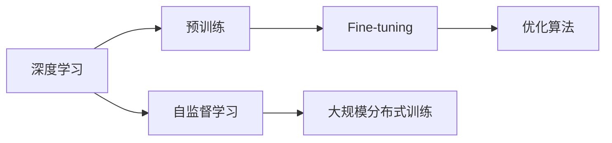
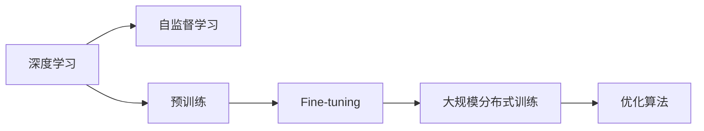
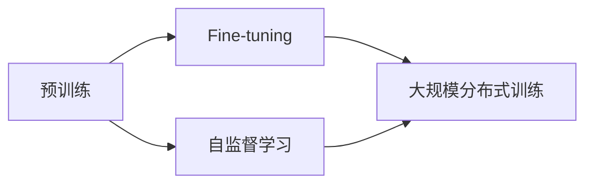
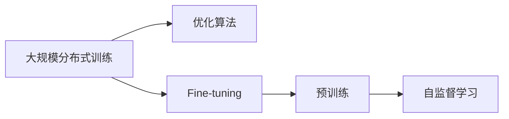
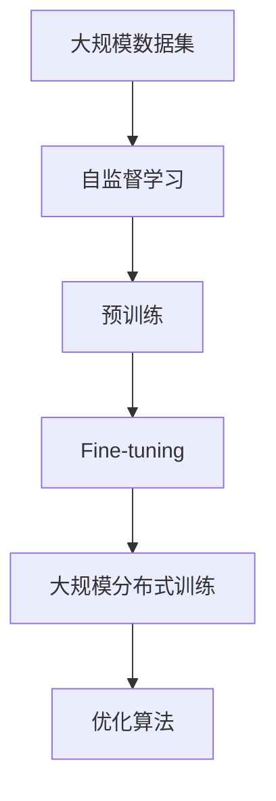

                 

# AI 2.0 时代的深度学习

在AI 2.0时代，深度学习技术取得了长足的发展和突破。本文将深入探讨深度学习的核心概念、算法原理、具体操作步骤，以及其在实际应用场景中的应用。同时，我们也将从项目实践的角度出发，展示如何通过代码实现深度学习的典型案例，并进行详细解读与分析。

## 1. 背景介绍

### 1.1 问题由来

深度学习作为一种基于神经网络的机器学习方法，近年来在计算机视觉、自然语言处理、语音识别等领域取得了显著的进展。深度学习的核心思想是通过模拟人脑的神经网络结构，构建多层次的非线性模型，从而实现对复杂数据的建模与预测。

然而，传统的深度学习模型在训练过程中，需要大量标注数据进行监督学习，并且往往需要长时间的大量计算资源进行训练。这使得深度学习在大规模数据集上的应用受到了限制。

为了解决这些问题，研究者们提出了预训练（Pre-training）和大规模自监督学习（Self-supervised Learning）的方法。预训练是指在无标签的大规模数据集上对深度模型进行预训练，然后通过微调（Fine-tuning）来实现对特定任务的适配。大规模自监督学习则是在大规模无标签数据上，通过自监督的任务（如掩码语言模型、对比学习等）对模型进行训练，从而学习到通用的语言表征。

### 1.2 问题核心关键点

深度学习的核心在于如何有效地对大规模数据进行建模与预测。为了提高模型的泛化能力和鲁棒性，研究者们提出了以下关键技术：

- 自监督学习（Self-supervised Learning）：通过设计自监督任务，在无标签数据上训练模型，从而学习到数据的内在结构。
- 预训练（Pre-training）：在无标签的大规模数据集上对模型进行预训练，然后通过微调适配特定任务。
- 大规模分布式训练（Large-scale Distributed Training）：通过分布式计算资源进行大规模模型训练，以提高效率。
- 优化算法（Optimization Algorithms）：如随机梯度下降（SGD）、Adam等，用于优化模型的损失函数。

这些技术共同构成了深度学习模型训练和应用的核心框架，使其能够在各种复杂的任务中取得卓越的性能。

## 2. 核心概念与联系

### 2.1 核心概念概述

为了更好地理解深度学习的核心概念，我们将从以下几个方面进行阐述：

- 深度学习（Deep Learning）：一种基于神经网络结构的多层次非线性模型。
- 自监督学习（Self-supervised Learning）：利用数据的自身结构进行模型训练，无需标签。
- 预训练（Pre-training）：在无标签的大规模数据集上对模型进行预训练，然后通过微调适配特定任务。
- 微调（Fine-tuning）：在预训练模型上，使用少量标注数据进行有监督学习，以适应特定任务。
- 大规模分布式训练（Large-scale Distributed Training）：通过分布式计算资源进行大规模模型训练，以提高效率。
- 优化算法（Optimization Algorithms）：如随机梯度下降（SGD）、Adam等，用于优化模型的损失函数。

这些核心概念之间的逻辑关系可以通过以下Mermaid流程图来展示：



这个流程图展示了大规模深度学习模型的训练流程：首先，在无标签的大规模数据集上进行自监督学习，学习到数据的内在结构；然后，在无标签的大规模数据集上进行预训练，学习到通用的语言表征；接着，使用少量标注数据进行微调，适配特定任务；最后，通过优化算法进行模型优化，提高模型性能。

### 2.2 概念间的关系

这些核心概念之间存在着紧密的联系，形成了深度学习模型的完整生态系统。下面我们通过几个Mermaid流程图来展示这些概念之间的关系：

#### 2.2.1 深度学习的学习范式



这个流程图展示了深度学习模型的学习范式，包括自监督学习、预训练、微调和分布式训练等关键环节。

#### 2.2.2 预训练与微调的关系



这个流程图展示了预训练与微调的关系，即预训练在无标签数据上训练模型，然后通过微调适配特定任务。

#### 2.2.3 大规模分布式训练方法



这个流程图展示了大规模分布式训练方法的流程，即在大规模分布式计算资源上进行模型训练，以提高效率。

### 2.3 核心概念的整体架构

最后，我们用一个综合的流程图来展示这些核心概念在大规模深度学习模型的完整训练流程：



这个综合流程图展示了从数据集预处理到模型训练的完整流程，包括自监督学习、预训练、微调和分布式训练等关键步骤。通过这些步骤，深度学习模型可以学习到复杂的语言表征，并在特定任务上取得优异性能。

## 3. 核心算法原理 & 具体操作步骤
### 3.1 算法原理概述

深度学习模型的核心思想是通过多层神经网络对复杂数据进行建模。深度学习模型一般由多个层次的神经网络构成，每一层都有多个神经元（Neuron）。每个神经元接收上一层多个神经元的输出，通过加权和、激活函数等操作，输出到下一层。

在深度学习模型的训练过程中，目标是通过最小化损失函数（Loss Function）来优化模型参数。常用的损失函数包括交叉熵损失（Cross-entropy Loss）、均方误差损失（Mean Squared Error Loss）等。通过反向传播（Backpropagation）算法，可以计算损失函数对模型参数的梯度，并使用优化算法（如随机梯度下降、Adam等）更新模型参数，从而不断优化模型性能。

### 3.2 算法步骤详解

深度学习模型的训练一般包括以下几个关键步骤：

**Step 1: 数据准备**

1. 收集数据集，并进行预处理，如分词、归一化等。
2. 划分训练集、验证集和测试集。
3. 将数据集转化为模型可用的格式，如TensorFlow数据集、PyTorch数据集等。

**Step 2: 模型定义**

1. 定义深度学习模型的架构，如卷积神经网络（CNN）、循环神经网络（RNN）、Transformer等。
2. 定义损失函数和优化算法。
3. 定义评估指标，如准确率、召回率、F1分数等。

**Step 3: 训练模型**

1. 定义训练循环，使用for循环或while循环进行训练。
2. 在训练循环中，对训练集进行迭代，每个批次（Batch）进行前向传播和反向传播。
3. 计算损失函数，并使用优化算法更新模型参数。
4. 在每个epoch（一个完整的训练集循环）结束后，对验证集进行评估，调整模型参数。
5. 重复上述步骤，直至达到预设的训练轮数或性能指标。

**Step 4: 模型评估**

1. 在测试集上进行模型评估，计算模型性能指标。
2. 使用混淆矩阵、ROC曲线等工具，可视化模型性能。
3. 调整模型参数，进行超参数优化，以提高模型性能。

### 3.3 算法优缺点

深度学习模型的优点包括：

- 强大的建模能力：深度学习模型能够学习到复杂的数据结构，适用于多种任务。
- 自适应能力强：深度学习模型能够自动提取数据中的特征，具有较好的泛化能力。
- 数据驱动：深度学习模型可以通过大量的标注数据进行训练，从而提高模型性能。

深度学习模型的缺点包括：

- 需要大量标注数据：深度学习模型在训练过程中需要大量的标注数据，标注成本较高。
- 训练时间较长：深度学习模型的训练时间较长，需要大量的计算资源。
- 模型复杂度较高：深度学习模型具有较高的复杂度，可能导致过拟合等问题。

### 3.4 算法应用领域

深度学习模型已经在计算机视觉、自然语言处理、语音识别、推荐系统等多个领域取得了广泛应用。以下是一些典型的应用场景：

- 计算机视觉：如目标检测、人脸识别、图像分类等。
- 自然语言处理：如机器翻译、文本分类、情感分析等。
- 语音识别：如语音识别、语音合成等。
- 推荐系统：如推荐商品、电影、音乐等。

## 4. 数学模型和公式 & 详细讲解  
### 4.1 数学模型构建

深度学习模型的数学模型一般包括以下几个部分：

- 输入层（Input Layer）：将原始数据转化为模型可用的格式。
- 隐藏层（Hidden Layer）：通过多层神经网络对输入数据进行建模，学习到数据的内在结构。
- 输出层（Output Layer）：将隐藏层的输出转化为任务所需的格式，如分类标签、回归值等。

深度学习模型的目标是最小化损失函数，从而优化模型参数。常用的损失函数包括交叉熵损失、均方误差损失等。以二分类任务为例，常用的交叉熵损失函数为：

$$
\mathcal{L}(\theta) = -\frac{1}{N} \sum_{i=1}^N [y_i \log \hat{y}_i + (1-y_i) \log (1-\hat{y}_i)]
$$

其中，$\theta$表示模型参数，$y_i$表示真实标签，$\hat{y}_i$表示模型预测概率。

### 4.2 公式推导过程

以二分类任务为例，我们推导一下交叉熵损失函数及其梯度的计算公式。

假设模型在输入$x$上的输出为$\hat{y}=\sigma(W^Tx+b)$，其中$W$和$b$为模型参数，$\sigma$为激活函数。

根据定义，交叉熵损失函数为：

$$
\mathcal{L}(\theta) = -\frac{1}{N} \sum_{i=1}^N [y_i \log \hat{y}_i + (1-y_i) \log (1-\hat{y}_i)]
$$

将$\hat{y}=\sigma(W^Tx+b)$代入上式，得：

$$
\mathcal{L}(\theta) = -\frac{1}{N} \sum_{i=1}^N [y_i \log \sigma(W^Tx_i+b) + (1-y_i) \log (1-\sigma(W^Tx_i+b))]
$$

对模型参数$\theta$求导，得到梯度：

$$
\frac{\partial \mathcal{L}(\theta)}{\partial \theta} = -\frac{1}{N} \sum_{i=1}^N [y_i \frac{\partial \log \sigma(W^Tx_i+b)}{\partial \theta} + (1-y_i) \frac{\partial \log (1-\sigma(W^Tx_i+b))}{\partial \theta}]
$$

利用链式法则，对$\log \sigma(W^Tx_i+b)$和$\log (1-\sigma(W^Tx_i+b))$求导，得到：

$$
\frac{\partial \log \sigma(W^Tx_i+b)}{\partial \theta} = \frac{\sigma(W^Tx_i+b)}{\sigma(W^Tx_i+b)(1-\sigma(W^Tx_i+b))} \frac{\partial \sigma(W^Tx_i+b)}{\partial \theta}
$$

$$
\frac{\partial \log (1-\sigma(W^Tx_i+b))}{\partial \theta} = \frac{(1-\sigma(W^Tx_i+b))}{\sigma(W^Tx_i+b)(1-\sigma(W^Tx_i+b))} \frac{\partial \sigma(W^Tx_i+b)}{\partial \theta}
$$

其中，$\frac{\partial \sigma(W^Tx_i+b)}{\partial \theta}$为激活函数对模型参数的导数，可以通过自动微分技术计算。

### 4.3 案例分析与讲解

以图像分类任务为例，我们可以用TensorFlow或PyTorch等深度学习框架实现模型的训练和评估。以下是一个简单的图像分类任务的TensorFlow代码实现：

```python
import tensorflow as tf
from tensorflow.keras import datasets, layers, models

# 加载数据集
(train_images, train_labels), (test_images, test_labels) = datasets.cifar10.load_data()

# 数据预处理
train_images, test_images = train_images / 255.0, test_images / 255.0

# 定义模型架构
model = models.Sequential([
    layers.Conv2D(32, (3,3), activation='relu', input_shape=(32, 32, 3)),
    layers.MaxPooling2D((2,2)),
    layers.Conv2D(64, (3,3), activation='relu'),
    layers.MaxPooling2D((2,2)),
    layers.Conv2D(64, (3,3), activation='relu'),
    layers.Flatten(),
    layers.Dense(64, activation='relu'),
    layers.Dense(10)
])

# 定义损失函数和优化算法
model.compile(optimizer='adam', 
              loss=tf.keras.losses.SparseCategoricalCrossentropy(from_logits=True), 
              metrics=['accuracy'])

# 训练模型
history = model.fit(train_images, train_labels, epochs=10, 
                    validation_data=(test_images, test_labels))

# 评估模型
test_loss, test_acc = model.evaluate(test_images, test_labels, verbose=2)
print(f'Test accuracy: {test_acc * 100:.2f}%')
```

以上代码展示了如何使用TensorFlow实现一个简单的卷积神经网络（CNN）对CIFAR-10数据集进行图像分类任务。在训练过程中，我们使用了交叉熵损失函数和Adam优化算法，对模型进行训练和评估。

## 5. 项目实践：代码实例和详细解释说明
### 5.1 开发环境搭建

在进行深度学习项目实践前，我们需要准备好开发环境。以下是使用Python进行TensorFlow或PyTorch开发的环

