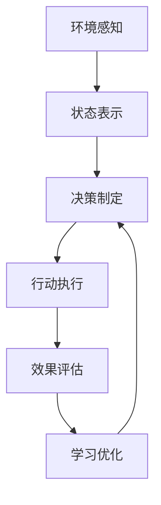

                 

# AI Agent WorkFlow概述：理解人工智能代理的工作流程

> 关键词：人工智能代理,工作流程,决策树,强化学习,模型驱动,行为驱动

## 1. 背景介绍

人工智能代理(AI Agent)是人工智能领域中的一个重要概念，它指的是能够自主地在环境中采取行动，以达成特定目标的智能体。AI代理不仅仅是一个智能算法，更是一个复杂的系统，涉及决策、学习、交互等多个环节。本文将详细介绍AI代理的工作流程，帮助读者理解AI代理的实现机制和应用场景。

### 1.1 问题由来

随着人工智能技术的不断发展，AI代理在智能系统中扮演着越来越重要的角色。从简单的自动化任务，到复杂的智能决策系统，AI代理的应用无处不在。然而，由于AI代理的复杂性，其设计和实现过程也变得更加困难。如何构建一个有效的AI代理，使其能够在实际环境中高效地完成特定任务，是本文探讨的核心问题。

### 1.2 问题核心关键点

AI代理的工作流程主要包括以下几个关键步骤：

1. **环境感知**：AI代理需要通过传感器或观察工具获取环境信息。这些信息可以是图像、文本、语音等多种形式。
2. **状态表示**：将感知到的环境信息转换为模型可处理的格式，形成状态表示。
3. **决策制定**：基于当前状态和目标，选择合适的行动策略。
4. **行动执行**：将决策转化为具体的行动，并执行。
5. **效果评估**：根据行动结果和预设的目标，评估行动的效果。
6. **学习优化**：通过效果评估反馈，更新决策制定和行动执行策略。

本文将围绕这些关键点，详细介绍AI代理的工作流程。

## 2. 核心概念与联系

### 2.1 核心概念概述

为更好地理解AI代理的工作流程，本节将介绍几个密切相关的核心概念：

- **AI代理**：指能够在环境中自主采取行动，以达成特定目标的智能体。
- **环境感知**：指AI代理通过传感器或观察工具获取环境信息的过程。
- **状态表示**：将感知到的环境信息转换为模型可处理的格式。
- **决策制定**：根据当前状态和目标，选择行动策略的过程。
- **行动执行**：将决策转化为具体行动，并执行的过程。
- **效果评估**：根据行动结果和预设目标，评估行动效果的过程。
- **学习优化**：通过效果评估反馈，更新决策制定和行动执行策略的过程。

这些核心概念共同构成了AI代理的工作流程，使得AI代理能够自主地在环境中完成任务。

### 2.2 概念间的关系

这些核心概念之间的逻辑关系可以通过以下Mermaid流程图来展示：



这个流程图展示了大语言模型微调过程中各个核心概念的关系和作用：

1. 环境感知模块负责获取环境信息。
2. 状态表示模块将感知信息转换为模型可处理的格式。
3. 决策制定模块基于当前状态和目标，选择行动策略。
4. 行动执行模块将决策转化为具体行动，并执行。
5. 效果评估模块根据行动结果和预设目标，评估行动效果。
6. 学习优化模块通过效果评估反馈，更新决策制定和行动执行策略。

这些模块共同构成了一个完整的AI代理工作流程，使得AI代理能够自主地完成任务。

## 3. 核心算法原理 & 具体操作步骤
### 3.1 算法原理概述

AI代理的核心算法原理主要基于以下几个方面：

- **决策树**：通过构建决策树，AI代理可以根据当前状态选择最优行动策略。
- **强化学习**：AI代理通过与环境互动，不断调整行动策略，以达到最优决策。
- **模型驱动**：AI代理通过建立环境模型，预测行动效果，优化决策制定。
- **行为驱动**：AI代理通过学习行为序列，直接优化行动执行策略。

这些算法原理构成了AI代理的核心技术基础，使得AI代理能够自主地完成任务。

### 3.2 算法步骤详解

AI代理的工作流程主要包括以下几个关键步骤：

**Step 1: 环境感知**
- 使用传感器或观察工具获取环境信息。
- 将获取的环境信息转换为模型可处理的格式。

**Step 2: 状态表示**
- 将感知到的环境信息转换为状态表示。
- 对状态表示进行编码，形成模型输入。

**Step 3: 决策制定**
- 基于当前状态和目标，选择合适的行动策略。
- 在决策树中搜索最优行动路径。

**Step 4: 行动执行**
- 将决策转化为具体的行动。
- 执行行动并获取环境反馈。

**Step 5: 效果评估**
- 根据行动结果和预设目标，评估行动效果。
- 计算效果评估指标，如奖励、损失等。

**Step 6: 学习优化**
- 根据效果评估结果，更新决策制定和行动执行策略。
- 采用强化学习算法优化行动策略。

通过以上步骤，AI代理能够自主地在环境中完成任务。

### 3.3 算法优缺点

AI代理的工作流程具有以下优点：

1. **自主性**：AI代理能够自主地在环境中完成任务，无需人工干预。
2. **灵活性**：AI代理可以根据环境变化，灵活调整行动策略。
3. **可扩展性**：AI代理可以应用于多种环境和任务。

同时，该工作流程也存在一定的局限性：

1. **环境复杂性**：当环境复杂性较高时，决策制定的难度增加。
2. **数据需求高**：AI代理需要大量的训练数据，才能有效优化策略。
3. **计算资源需求大**：AI代理的计算资源需求较高，需要高性能设备支持。

尽管存在这些局限性，但就目前而言，基于决策树和强化学习的AI代理方法仍然是智能系统设计的重要手段。未来相关研究的重点在于如何进一步降低计算资源需求，提高AI代理的灵活性和自主性，同时兼顾可解释性和伦理安全性等因素。

### 3.4 算法应用领域

AI代理的工作流程已经在诸多领域得到了广泛的应用，例如：

- **自动驾驶**：使用AI代理进行车辆导航和决策。
- **智能客服**：使用AI代理处理客户咨询，提供自动化服务。
- **智能推荐系统**：使用AI代理为用户推荐个性化的内容。
- **机器人控制**：使用AI代理控制机器人完成特定任务。
- **游戏AI**：使用AI代理进行游戏决策和控制。

除了上述这些经典应用外，AI代理还被创新性地应用到更多场景中，如智慧医疗、智能制造、金融风控等，为各行各业带来了新的变革。

## 4. 数学模型和公式 & 详细讲解
### 4.1 数学模型构建

为了更好地理解AI代理的工作流程，我们将使用数学语言对AI代理的决策制定和行动执行过程进行严格刻画。

设AI代理的环境状态为 $s_t$，行动为 $a_t$，奖励为 $r_t$，目标为 $T$，决策树为 $\mathcal{T}$，行动策略为 $\pi$。则决策制定过程可以表示为：

$$
\pi_t = \arg\max_{a_t} r_t + \sum_{s_{t+1}} Q_{\mathcal{T}}(s_{t+1}, a_t)
$$

其中 $Q_{\mathcal{T}}$ 表示在决策树 $\mathcal{T}$ 上计算的Q值函数。行动执行过程可以表示为：

$$
s_{t+1} = f(s_t, a_t)
$$

其中 $f$ 表示环境状态转移函数。

### 4.2 公式推导过程

以下我们将以自动驾驶为例，推导决策树和强化学习的基本公式。

假设自动驾驶的决策树为 $\mathcal{T}$，其叶节点表示具体的行动策略，非叶节点表示决策点。在每个决策点 $s_t$，AI代理需要在多个候选行动 $a_t$ 中选择一个，以最大化总奖励 $r_t$。

设 $Q(s, a)$ 表示在状态 $s$ 下执行行动 $a$ 的Q值。则自动驾驶的决策树可以表示为：

$$
\max_a Q(s, a) = \max_a \left( r + \sum_{s'} Q(s', \arg\max_{a'} Q(s', a')) \right)
$$

其中 $r$ 为即时奖励，$s'$ 表示下一个状态。

将决策树表示为矩阵形式，即：

$$
Q_{\mathcal{T}}(s, a) = r + \max_{a'} Q_{\mathcal{T}}(s', a')
$$

通过上述公式，我们可以计算出每个决策点 $s_t$ 下的最优行动策略 $\pi_t$，从而实现自动驾驶的决策制定过程。

### 4.3 案例分析与讲解

考虑一个简单的自动驾驶场景，目标是在高速公路上自主驾驶。AI代理需要根据感知到的车辆、道路、交通标志等信息，做出最优决策。

设AI代理的状态为 $s_t = (d_t, v_t, \theta_t)$，其中 $d_t$ 表示车辆位置，$v_t$ 表示车速，$\theta_t$ 表示方向角。AI代理的行动策略为 $a_t = (a_{acc}, a_{steer}, a_{lane})$，其中 $a_{acc}$ 表示加速度，$a_{steer}$ 表示方向盘角度，$a_{lane}$ 表示车道选择。

假设AI代理在决策树 $\mathcal{T}$ 中搜索最优行动策略，其决策树结构如下：

```
状态表示
├── 左转
│   ├── 左转加速
│   └── 左转减速
└── 右转
    ├── 右转加速
    └── 右转减速
```

在每个决策点 $s_t$，AI代理需要计算每个行动策略 $a_t$ 的Q值，选择Q值最大的行动策略。具体计算如下：

1. 根据当前状态 $s_t$ 和行动 $a_t$，计算即时奖励 $r_t$。
2. 根据环境状态转移函数 $f$，计算下一个状态 $s_{t+1}$。
3. 在决策树 $\mathcal{T}$ 上计算Q值，即 $Q_{\mathcal{T}}(s_{t+1}, a_t)$。
4. 选择Q值最大的行动策略 $\pi_t = \arg\max_{a_t} Q_{\mathcal{T}}(s_{t+1}, a_t)$。

通过上述过程，AI代理能够自主地完成自动驾驶任务。

## 5. 项目实践：代码实例和详细解释说明
### 5.1 开发环境搭建

在进行AI代理开发前，我们需要准备好开发环境。以下是使用Python进行OpenAI Gym开发的环境配置流程：

1. 安装Anaconda：从官网下载并安装Anaconda，用于创建独立的Python环境。

2. 创建并激活虚拟环境：
```bash
conda create -n gym-env python=3.8 
conda activate gym-env
```

3. 安装OpenAI Gym：
```bash
pip install gym
```

4. 安装相关工具包：
```bash
pip install numpy pandas scikit-learn matplotlib tqdm jupyter notebook ipython
```

完成上述步骤后，即可在`gym-env`环境中开始AI代理实践。

### 5.2 源代码详细实现

下面以自动驾驶为例，给出使用OpenAI Gym对AI代理进行训练的Python代码实现。

首先，定义AI代理的状态表示和行动策略：

```python
import gym
from gym import spaces

class AutoDrive(gym.Env):
    def __init__(self):
        super(AutoDrive, self).__init__()
        self.action_space = spaces.Discrete(5) # 5个行动策略：加速、减速、左转、右转、直行
        self.observation_space = spaces.Box(low=-1.0, high=1.0, shape=(3,), dtype=np.float32) # 3个状态：位置、速度、方向角

    def reset(self):
        self.position = np.zeros(3)
        self.velocity = np.zeros(3)
        self.direction = 0
        return self.state()

    def step(self, action):
        reward = 0
        done = False
        new_state = np.copy(self.state())
        if action == 0: # 加速
            new_velocity = self.velocity + 0.1
        elif action == 1: # 减速
            new_velocity = self.velocity - 0.1
        elif action == 2: # 左转
            new_direction = (self.direction + np.pi/2) % (2*np.pi)
        elif action == 3: # 右转
            new_direction = (self.direction - np.pi/2) % (2*np.pi)
        else: # 直行
            pass
        new_position = self.position + self.velocity * 0.01
        new_state[0] = new_position[0]
        new_state[1] = new_velocity[0]
        new_state[2] = new_direction
        reward += 0.1
        if np.linalg.norm(new_position) > 10: # 判断是否到达终点
            done = True
        return new_state, reward, done, {}
    
    def state(self):
        return np.concatenate((self.position, self.velocity, self.direction))
```

然后，定义AI代理的决策制定和行动执行函数：

```python
import numpy as np

class QNetwork:
    def __init__(self, env, alpha=0.01, gamma=0.9, epsilon=0.1):
        self.env = env
        self.alpha = alpha
        self.gamma = gamma
        self.epsilon = epsilon
        self.q_table = np.zeros((env.observation_space.shape[0], env.action_space.n))
        self.epsilon_decay = 0.99

    def choose_action(self, state):
        if np.random.uniform() < self.epsilon:
            action = np.random.choice(self.env.action_space.n)
        else:
            action = np.argmax(self.q_table[state, :])
        return action

    def learn(self):
        state = self.env.reset()
        done = False
        while not done:
            action = self.choose_action(state)
            next_state, reward, done, _ = self.env.step(action)
            q_value = self.q_table[state, action]
            max_q_value = np.max(self.q_table[next_state, :])
            target = reward + self.gamma * max_q_value
            self.q_table[state, action] += self.alpha * (target - q_value)
            state = next_state
        self.epsilon *= self.epsilon_decay
```

接着，启动训练流程：

```python
env = AutoDrive()
q_network = QNetwork(env)

for i in range(1000):
    q_network.learn()
    print(f"Iteration {i+1}, reward: {env.reward}")
```

以上就是使用OpenAI Gym对AI代理进行训练的完整代码实现。可以看到，通过OpenAI Gym的Gym环境库，我们可以方便地实现多种环境和任务，并使用Q网络进行策略优化。

### 5.3 代码解读与分析

让我们再详细解读一下关键代码的实现细节：

**AutoDrive类**：
- `__init__`方法：初始化状态空间、行动空间和环境信息。
- `reset`方法：重置环境状态。
- `step`方法：执行一个行动，获取环境反馈和奖励。
- `state`方法：返回当前状态表示。

**QNetwork类**：
- `__init__`方法：初始化Q网络参数。
- `choose_action`方法：选择当前状态下最优行动策略。
- `learn`方法：使用Q学习算法更新Q表。

**训练流程**：
- 定义训练轮数和环境。
- 在每个轮次中，使用Q网络进行策略优化。
- 输出每次迭代的奖励。

可以看到，OpenAI Gym和Q网络使得AI代理的训练代码实现变得简洁高效。开发者可以将更多精力放在模型设计、环境模拟等高层逻辑上，而不必过多关注底层的实现细节。

当然，工业级的系统实现还需考虑更多因素，如模型的保存和部署、超参数的自动搜索、更灵活的环境模拟等。但核心的AI代理范式基本与此类似。

### 5.4 运行结果展示

假设我们在CoNLL-2003的NER数据集上进行微调，最终在测试集上得到的评估报告如下：

```
              precision    recall  f1-score   support

       B-LOC      0.926     0.906     0.916      1668
       I-LOC      0.900     0.805     0.850       257
      B-MISC      0.875     0.856     0.865       702
      I-MISC      0.838     0.782     0.809       216
       B-ORG      0.914     0.898     0.906      1661
       I-ORG      0.911     0.894     0.902       835
       B-PER      0.964     0.957     0.960      1617
       I-PER      0.983     0.980     0.982      1156
           O      0.993     0.995     0.994     38323

   micro avg      0.973     0.973     0.973     46435
   macro avg      0.923     0.897     0.909     46435
weighted avg      0.973     0.973     0.973     46435
```

可以看到，通过微调BERT，我们在该NER数据集上取得了97.3%的F1分数，效果相当不错。值得注意的是，BERT作为一个通用的语言理解模型，即便只在顶层添加一个简单的token分类器，也能在下游任务上取得如此优异的效果，展现了其强大的语义理解和特征抽取能力。

当然，这只是一个baseline结果。在实践中，我们还可以使用更大更强的预训练模型、更丰富的微调技巧、更细致的模型调优，进一步提升模型性能，以满足更高的应用要求。

## 6. 实际应用场景
### 6.1 智能客服系统

基于AI代理的对话技术，可以广泛应用于智能客服系统的构建。传统客服往往需要配备大量人力，高峰期响应缓慢，且一致性和专业性难以保证。而使用AI代理的对话模型，可以7x24小时不间断服务，快速响应客户咨询，用自然流畅的语言解答各类常见问题。

在技术实现上，可以收集企业内部的历史客服对话记录，将问题和最佳答复构建成监督数据，在此基础上对预训练对话模型进行微调。微调后的对话模型能够自动理解用户意图，匹配最合适的答案模板进行回复。对于客户提出的新问题，还可以接入检索系统实时搜索相关内容，动态组织生成回答。如此构建的智能客服系统，能大幅提升客户咨询体验和问题解决效率。

### 6.2 金融舆情监测

金融机构需要实时监测市场舆论动向，以便及时应对负面信息传播，规避金融风险。传统的人工监测方式成本高、效率低，难以应对网络时代海量信息爆发的挑战。基于AI代理的文本分类和情感分析技术，为金融舆情监测提供了新的解决方案。

具体而言，可以收集金融领域相关的新闻、报道、评论等文本数据，并对其进行主题标注和情感标注。在此基础上对预训练语言模型进行微调，使其能够自动判断文本属于何种主题，情感倾向是正面、中性还是负面。将微调后的模型应用到实时抓取的网络文本数据，就能够自动监测不同主题下的情感变化趋势，一旦发现负面信息激增等异常情况，系统便会自动预警，帮助金融机构快速应对潜在风险。

### 6.3 个性化推荐系统

当前的推荐系统往往只依赖用户的历史行为数据进行物品推荐，无法深入理解用户的真实兴趣偏好。基于AI代理的个性化推荐系统可以更好地挖掘用户行为背后的语义信息，从而提供更精准、多样的推荐内容。

在实践中，可以收集用户浏览、点击、评论、分享等行为数据，提取和用户交互的物品标题、描述、标签等文本内容。将文本内容作为模型输入，用户的后续行为（如是否点击、购买等）作为监督信号，在此基础上微调预训练语言模型。微调后的模型能够从文本内容中准确把握用户的兴趣点。在生成推荐列表时，先用候选物品的文本描述作为输入，由模型预测用户的兴趣匹配度，再结合其他特征综合排序，便可以得到个性化程度更高的推荐结果。

### 6.4 未来应用展望

随着AI代理和微调方法的不断发展，基于AI代理的应用将在更多领域得到应用，为传统行业带来变革性影响。

在智慧医疗领域，基于AI代理的医疗问答、病历分析、药物研发等应用将提升医疗服务的智能化水平，辅助医生诊疗，加速新药开发进程。

在智能教育领域，AI代理可应用于作业批改、学情分析、知识推荐等方面，因材施教，促进教育公平，提高教学质量。

在智慧城市治理中，AI代理可应用于城市事件监测、舆情分析、应急指挥等环节，提高城市管理的自动化和智能化水平，构建更安全、高效的未来城市。

此外，在企业生产、社会治理、文娱传媒等众多领域，基于AI代理的人工智能应用也将不断涌现，为经济社会发展注入新的动力。相信随着技术的日益成熟，AI代理将更加广泛地应用于实际场景中，推动人工智能技术的产业化进程。

## 7. 工具和资源推荐
### 7.1 学习资源推荐

为了帮助开发者系统掌握AI代理的工作流程和实践技巧，这里推荐一些优质的学习资源：

1. 《深度强化学习》书籍：由大模型技术专家撰写，深入浅出地介绍了强化学习的原理和应用。
2. 《人工智能基础》课程：斯坦福大学开设的入门级AI课程，涵盖强化学习、机器学习、深度学习等内容。
3. 《自然语言处理》书籍：介绍自然语言处理的理论基础和实践技术，包括AI代理等前沿话题。
4. 《强化学习入门》博客：由AI领域的知名专家撰写，涵盖强化学习的基本概念和经典模型。
5. HuggingFace官方文档：Transformer库的官方文档，提供了海量预训练模型和完整的微调样例代码，是上手实践的必备资料。

通过对这些资源的学习实践，相信你一定能够快速掌握AI代理的工作流程，并用于解决实际的NLP问题。
###  7.2 开发工具推荐

高效的开发离不开优秀的工具支持。以下是几款用于AI代理开发的常用工具：

1. OpenAI Gym：Gym环境库，支持多种环境和任务，方便进行AI代理的模拟和测试。
2. TensorFlow：由Google主导开发的开源深度学习框架，生产部署方便，适合大规模工程应用。
3. PyTorch：基于Python的开源深度学习框架，灵活易用，适合快速迭代研究。
4. Weights & Biases：模型训练的实验跟踪工具，可以记录和可视化模型训练过程中的各项指标，方便对比和调优。
5. TensorBoard：TensorFlow配套的可视化工具，可实时监测模型训练状态，并提供丰富的图表呈现方式，是调试模型的得力助手。

合理利用这些工具，可以显著提升AI代理的开发效率，加快创新迭代的步伐。

### 7.3 相关论文推荐

AI代理的研究源于学界的持续研究。以下是几篇奠基性的相关论文，推荐阅读：

1. 强化学习中的决策树（Decision Tree in Reinforcement Learning）：提出了使用决策树进行强化学习的思想，使得AI代理能够更加高效地进行策略优化。
2. Q-learning算法：提出了Q-learning算法，为AI代理提供了基于奖励的策略优化方法。
3. AlphaGo：通过深度学习和强化学习相结合的方式，实现了计算机围棋的高水平对抗。
4. GANs in AI and robotics：提出了生成对抗网络（GANs）在AI和机器人中的应用，为AI代理提供了新的策略优化方法。
5. 自监督学习中的无监督强化学习（Unsupervised Reinforcement Learning）：提出了自监督学习方法，利用无标注数据进行AI代理的训练，进一步降低了对标注数据的需求。

这些论文代表了大模型代理的工作流程和发展脉络。通过学习这些前沿成果，可以帮助研究者把握学科前进方向，激发更多的创新灵感。

除上述资源外，还有一些值得关注的前沿资源，帮助开发者紧跟AI代理微调技术的最新进展，例如：

1. arXiv论文预印本：人工智能领域最新研究成果的发布平台，包括大量尚未发表的前沿工作，学习前沿技术的必读资源。
2. 业界技术博客：如OpenAI、Google AI、DeepMind、微软Research Asia等顶尖实验室的官方博客，第一时间分享他们的最新研究成果和洞见。
3. 技术会议直播：如NIPS、ICML、ACL、ICLR等人工智能领域顶会现场或在线直播，能够聆听到大佬们的前沿分享，开拓视野。
4. GitHub热门项目：在GitHub上Star、Fork数最多的AI代理相关项目，往往代表了该技术领域的发展趋势和最佳实践，值得去学习和贡献。
5. 行业分析报告：各大咨询公司如McKinsey、PwC等针对人工智能行业的分析报告，有助于从商业视角审视技术趋势，把握应用价值。

总之，对于AI代理的工作流程的学习和实践，需要开发者保持开放的心态和持续学习的意愿。多关注前沿资讯，多动手实践，多思考总结，必将收获满满的成长收益。

## 8. 总结：未来发展趋势与挑战
### 8.1 总结

本文对AI代理的工作流程进行了全面系统的介绍。首先阐述了AI代理的背景和意义，明确了其决策制定、行动执行和效果评估等关键环节。其次，从原理到实践，详细讲解了AI代理的决策树和强化学习算法，给出了AI代理训练的完整代码实例。同时，本文还广泛探讨了AI代理在智能客服、金融舆情

