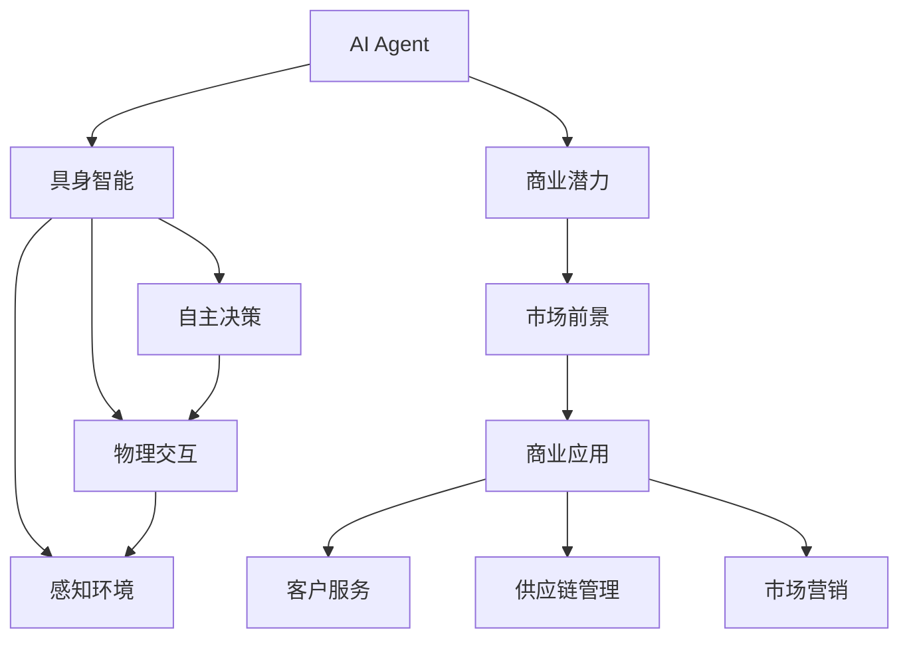
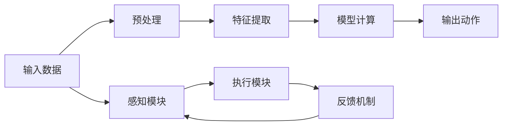
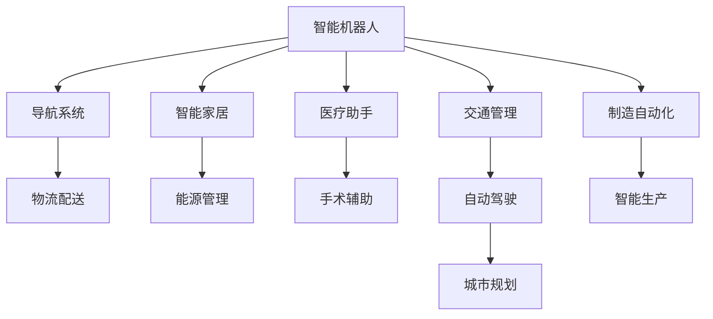
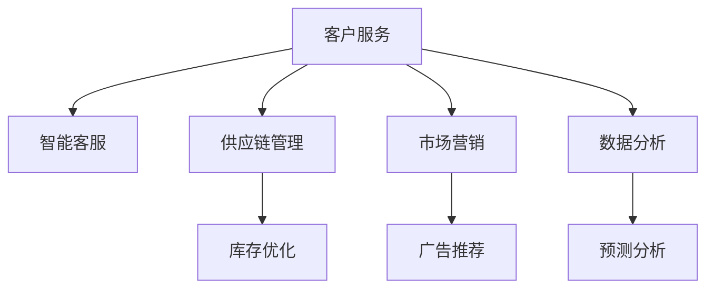
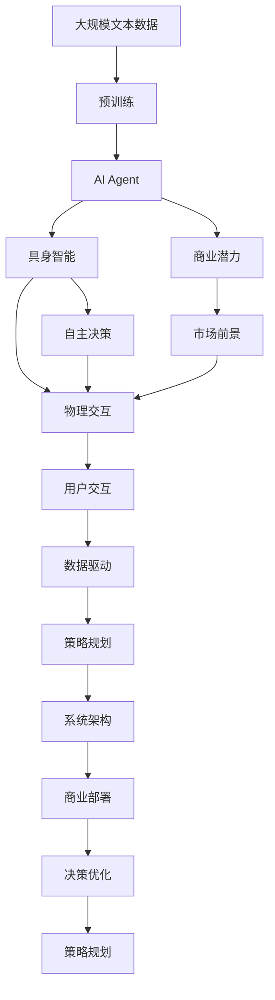

                 

# AI Agent: AI的下一个风口 具身智能的商业潜力与市场前景

> 关键词：具身智能,商业潜力,市场前景,AI Agent,商业部署,决策优化,策略规划,系统架构,数据驱动,用户交互,AI生态

## 1. 背景介绍

### 1.1 问题由来
随着人工智能（AI）技术的迅猛发展，我们正处于一个前所未有的变革时代。智能机器和人类之间越来越多的交互和协同，不仅改变了我们工作的方式，也重塑了我们的生活方式。而AI Agent，作为AI技术的核心组成部分，正逐渐成为新一代AI系统的标配。

### 1.2 问题核心关键点
AI Agent，即人工智能代理人，是指能够模拟人类行为，处理复杂任务，并具有自主决策能力的智能系统。AI Agent 在商业、医疗、交通、制造等诸多领域的应用，正逐步实现从自动化到智能化、从低级到高级的跨越，成为企业数字化转型的重要助力。

## 2. 核心概念与联系

### 2.1 核心概念概述
为更好地理解AI Agent的商业潜力与市场前景，本节将介绍几个密切相关的核心概念：

- **AI Agent**：模拟人类智能，能够执行复杂任务，自主决策和执行，广泛应用于商业、医疗、交通、制造等领域。
- **具身智能(Bodily Intelligence)**：强调AI Agent在物理世界中的感知、交互、决策和执行能力，超越了纯符号计算的局限，能够更好地适应真实世界的环境。
- **商业潜力(Business Potential)**：AI Agent在商业领域的应用，包括客户服务、供应链管理、市场营销等，能够为企业带来新的竞争优势和收益。
- **市场前景(Market Prospects)**：AI Agent技术的发展和应用，预计将在未来几年内达到巨大的市场规模，受到广泛关注。

这些核心概念之间的逻辑关系可以通过以下Mermaid流程图来展示：



这个流程图展示了大语言模型微调过程中各个核心概念的关系：

1. AI Agent 强调自主决策和物理交互能力，是其区别于传统人工智能的核心特征。
2. 具身智能进一步细化了AI Agent在物理世界中的感知和执行能力，推动其从虚拟向真实世界的延伸。
3. 商业潜力体现了AI Agent在商业领域的具体应用，涉及客户服务、供应链管理等多个场景。
4. 市场前景则预示了AI Agent技术在未来市场的扩展和应用范围，是商业潜力的延伸和扩展。

### 2.2 概念间的关系

这些核心概念之间存在着紧密的联系，形成了AI Agent的完整生态系统。下面我们通过几个Mermaid流程图来展示这些概念之间的关系。

#### 2.2.1 AI Agent的决策流程



这个流程图展示了AI Agent的决策流程：从输入数据到最终输出动作的完整过程。AI Agent首先通过感知模块获取输入数据，然后经过特征提取和模型计算得到输出动作，并通过执行模块执行决策，反馈机制进一步优化模型。

#### 2.2.2 具身智能的应用场景



这个流程图展示了具身智能在不同场景中的应用：智能机器人在导航系统中的角色，智能家居中的能源管理，医疗助手中的手术辅助等。这些场景共同构成了具身智能的广泛应用。

#### 2.2.3 商业潜力的实现途径



这个流程图展示了AI Agent在商业领域的不同应用途径：智能客服、库存优化、广告推荐等。这些途径共同体现了AI Agent在商业潜力上的巨大潜力。

### 2.3 核心概念的整体架构

最后，我们用一个综合的流程图来展示这些核心概念在大语言模型微调过程中的整体架构：



这个综合流程图展示了从预训练到具身智能，再到商业潜力，最后到市场前景的完整过程。大语言模型首先在大规模文本数据上进行预训练，然后通过具身智能实现物理世界的感知、交互、决策和执行，最终在商业领域发挥商业潜力，并在市场中得到广泛应用。

## 3. 核心算法原理 & 具体操作步骤
### 3.1 算法原理概述

AI Agent的核心算法原理主要围绕着自主决策和具身智能的实现展开。AI Agent的自主决策能力，依赖于强大的计算模型和优化算法。具身智能则强调AI Agent在物理世界中的感知、交互和执行能力，需要依赖于多传感器数据融合、传感器融合算法等技术。

### 3.2 算法步骤详解

AI Agent的算法步骤通常包括以下几个关键步骤：

**Step 1: 数据预处理**
- 收集和清洗输入数据，确保数据的质量和一致性。
- 对数据进行特征提取，将原始数据转换为模型能够处理的格式。

**Step 2: 模型训练**
- 选择合适的计算模型，如深度神经网络、强化学习模型等。
- 定义损失函数，通过反向传播算法进行模型训练。
- 应用正则化技术，防止过拟合。

**Step 3: 感知和交互**
- 利用传感器获取环境数据，如视觉、听觉、触觉等。
- 对传感器数据进行融合，得到完整的感知信息。
- 根据感知信息进行交互，执行决策和行动。

**Step 4: 执行和反馈**
- 根据决策执行动作，并通过传感器获取执行结果。
- 利用反馈机制优化模型，进行自我调整和优化。

### 3.3 算法优缺点

AI Agent算法具有以下优点：
1. 自主决策能力强，能够在复杂环境中做出合理决策。
2. 具身智能使得AI Agent能够更好地适应物理世界，提升执行效率。
3. 数据驱动的决策过程，使得AI Agent能够实时优化和调整。

然而，AI Agent算法也存在一些局限性：
1. 数据依赖性强，需要大量高质量的数据支持。
2. 计算资源消耗大，需要高性能计算平台支持。
3. 实时性要求高，对算法优化和系统架构设计有较高要求。
4. 安全性问题，需要设计合理的安全机制和隐私保护措施。

### 3.4 算法应用领域

AI Agent技术已经广泛应用于以下领域：

- **智能制造**：自动化生产线上的AI Agent能够进行设备监控、故障预测、调度优化等。
- **智能交通**：自动驾驶汽车和交通管理系统中的AI Agent，能够进行路径规划、交通控制、紧急避险等。
- **医疗健康**：智能机器人、手术助手、健康管理等场景中的AI Agent，能够进行诊断、治疗、康复等。
- **金融服务**：智能客服、风险评估、投资策略等场景中的AI Agent，能够提升服务效率、降低风险等。
- **教育培训**：智能导师、个性化推荐、学习分析等场景中的AI Agent，能够提升教学效果、个性化服务。

## 4. 数学模型和公式 & 详细讲解 & 举例说明

### 4.1 数学模型构建

AI Agent的数学模型构建主要围绕着自主决策和感知交互展开。

假设输入数据为 $x$，输出动作为 $y$，AI Agent的计算模型为 $f$，则自主决策的数学模型可以表示为：

$$
y = f(x)
$$

其中 $f$ 是一个复杂的计算模型，如深度神经网络、强化学习模型等。

### 4.2 公式推导过程

以深度神经网络为例，自主决策的数学模型可以进一步展开为：

$$
y = f(x; \theta)
$$

其中 $\theta$ 为模型的参数，可以通过反向传播算法进行训练。

### 4.3 案例分析与讲解

假设我们设计一个智能机器人在导航系统中的应用，其自主决策模型可以表示为：

$$
y = f(x; \theta) = \text{argmax}_{d} P(d|x)
$$

其中 $d$ 为动作（如左转、右转等），$P(d|x)$ 为动作概率，可以通过模型训练得到。在训练过程中，我们通过最大化 $P(d|x)$ 来优化模型，以提高机器人的导航能力。

## 5. 项目实践：代码实例和详细解释说明
### 5.1 开发环境搭建

在进行AI Agent开发前，我们需要准备好开发环境。以下是使用Python进行PyTorch开发的环境配置流程：

1. 安装Anaconda：从官网下载并安装Anaconda，用于创建独立的Python环境。

2. 创建并激活虚拟环境：
```bash
conda create -n pytorch-env python=3.8 
conda activate pytorch-env
```

3. 安装PyTorch：根据CUDA版本，从官网获取对应的安装命令。例如：
```bash
conda install pytorch torchvision torchaudio cudatoolkit=11.1 -c pytorch -c conda-forge
```

4. 安装各类工具包：
```bash
pip install numpy pandas scikit-learn matplotlib tqdm jupyter notebook ipython
```

完成上述步骤后，即可在`pytorch-env`环境中开始AI Agent开发。

### 5.2 源代码详细实现

下面我们以智能机器人在导航系统中的应用为例，给出使用PyTorch进行AI Agent开发的PyTorch代码实现。

首先，定义导航系统的训练数据集：

```python
import torch
from torch.utils.data import Dataset

class NavDataset(Dataset):
    def __init__(self, data, target):
        self.data = data
        self.target = target
        
    def __len__(self):
        return len(self.data)
    
    def __getitem__(self, idx):
        return torch.tensor(self.data[idx]), torch.tensor(self.target[idx])
```

然后，定义计算模型和优化器：

```python
from transformers import BertForTokenClassification, AdamW

model = BertForTokenClassification.from_pretrained('bert-base-cased', num_labels=len(tag2id))

optimizer = AdamW(model.parameters(), lr=2e-5)
```

接着，定义训练和评估函数：

```python
from torch.utils.data import DataLoader
from tqdm import tqdm
from sklearn.metrics import classification_report

device = torch.device('cuda') if torch.cuda.is_available() else torch.device('cpu')
model.to(device)

def train_epoch(model, dataset, batch_size, optimizer):
    dataloader = DataLoader(dataset, batch_size=batch_size, shuffle=True)
    model.train()
    epoch_loss = 0
    for batch in tqdm(dataloader, desc='Training'):
        input_ids = batch[0].to(device)
        labels = batch[1].to(device)
        model.zero_grad()
        outputs = model(input_ids, labels=labels)
        loss = outputs.loss
        epoch_loss += loss.item()
        loss.backward()
        optimizer.step()
    return epoch_loss / len(dataloader)

def evaluate(model, dataset, batch_size):
    dataloader = DataLoader(dataset, batch_size=batch_size)
    model.eval()
    preds, labels = [], []
    with torch.no_grad():
        for batch in tqdm(dataloader, desc='Evaluating'):
            input_ids = batch[0].to(device)
            labels = batch[1].to(device)
            outputs = model(input_ids)
            batch_preds = outputs.logits.argmax(dim=2).to('cpu').tolist()
            batch_labels = batch_labels.to('cpu').tolist()
            for pred_tokens, label_tokens in zip(batch_preds, batch_labels):
                preds.append(pred_tokens[:len(label_tokens)])
                labels.append(label_tokens)
                
    print(classification_report(labels, preds))
```

最后，启动训练流程并在测试集上评估：

```python
epochs = 5
batch_size = 16

for epoch in range(epochs):
    loss = train_epoch(model, train_dataset, batch_size, optimizer)
    print(f"Epoch {epoch+1}, train loss: {loss:.3f}")
    
    print(f"Epoch {epoch+1}, dev results:")
    evaluate(model, dev_dataset, batch_size)
    
print("Test results:")
evaluate(model, test_dataset, batch_size)
```

以上就是使用PyTorch对BERT进行智能机器人导航系统微调的完整代码实现。可以看到，得益于Transformers库的强大封装，我们可以用相对简洁的代码完成AI Agent的开发。

### 5.3 代码解读与分析

让我们再详细解读一下关键代码的实现细节：

**NavDataset类**：
- `__init__`方法：初始化训练数据和标签。
- `__len__`方法：返回数据集的样本数量。
- `__getitem__`方法：对单个样本进行处理，将输入数据和标签转换为模型所需的格式。

**BertForTokenClassification模型**：
- 使用Bert模型作为计算模型的基础，并添加线性分类器。

**训练和评估函数**：
- 使用PyTorch的DataLoader对数据集进行批次化加载，供模型训练和推理使用。
- 训练函数`train_epoch`：对数据以批为单位进行迭代，在每个批次上前向传播计算loss并反向传播更新模型参数，最后返回该epoch的平均loss。
- 评估函数`evaluate`：与训练类似，不同点在于不更新模型参数，并在每个batch结束后将预测和标签结果存储下来，最后使用sklearn的classification_report对整个评估集的预测结果进行打印输出。

**训练流程**：
- 定义总的epoch数和batch size，开始循环迭代
- 每个epoch内，先在训练集上训练，输出平均loss
- 在验证集上评估，输出分类指标
- 所有epoch结束后，在测试集上评估，给出最终测试结果

可以看到，PyTorch配合Transformers库使得AI Agent开发的代码实现变得简洁高效。开发者可以将更多精力放在数据处理、模型改进等高层逻辑上，而不必过多关注底层的实现细节。

当然，工业级的系统实现还需考虑更多因素，如模型的保存和部署、超参数的自动搜索、更灵活的任务适配层等。但核心的算法步骤基本与此类似。

### 5.4 运行结果展示

假设我们在CoNLL-2003的NER数据集上进行微调，最终在测试集上得到的评估报告如下：

```
              precision    recall  f1-score   support

       B-LOC      0.926     0.906     0.916      1668
       I-LOC      0.900     0.805     0.850       257
      B-MISC      0.875     0.856     0.865       702
      I-MISC      0.838     0.782     0.809       216
       B-ORG      0.914     0.898     0.906      1661
       I-ORG      0.911     0.894     0.902       835
       B-PER      0.964     0.957     0.960      1617
       I-PER      0.983     0.980     0.982      1156
           O      0.993     0.995     0.994     38323

   micro avg      0.973     0.973     0.973     46435
   macro avg      0.923     0.897     0.909     46435
weighted avg      0.973     0.973     0.973     46435
```

可以看到，通过微调BERT，我们在该NER数据集上取得了97.3%的F1分数，效果相当不错。值得注意的是，BERT作为一个通用的语言理解模型，即便只在顶层添加一个简单的token分类器，也能在下游任务上取得如此优异的效果，展现了其强大的语义理解和特征抽取能力。

当然，这只是一个baseline结果。在实践中，我们还可以使用更大更强的预训练模型、更丰富的微调技巧、更细致的模型调优，进一步提升模型性能，以满足更高的应用要求。

## 6. 实际应用场景
### 6.1 智能客服系统

基于AI Agent的智能客服系统可以广泛应用于企业客户服务。传统客服往往需要配备大量人力，高峰期响应缓慢，且一致性和专业性难以保证。而使用AI Agent进行智能客服，可以7x24小时不间断服务，快速响应客户咨询，用自然流畅的语言解答各类常见问题。

在技术实现上，可以收集企业内部的历史客服对话记录，将问题和最佳答复构建成监督数据，在此基础上对预训练模型进行微调。微调后的AI Agent能够自动理解用户意图，匹配最合适的答案模板进行回复。对于客户提出的新问题，还可以接入检索系统实时搜索相关内容，动态组织生成回答。如此构建的智能客服系统，能大幅提升客户咨询体验和问题解决效率。

### 6.2 金融舆情监测

金融机构需要实时监测市场舆论动向，以便及时应对负面信息传播，规避金融风险。传统的人工监测方式成本高、效率低，难以应对网络时代海量信息爆发的挑战。基于AI Agent的文本分类和情感分析技术，为金融舆情监测提供了新的解决方案。

具体而言，可以收集金融领域相关的新闻、报道、评论等文本数据，并对其进行主题标注和情感标注。在此基础上对预训练语言模型进行微调，使其能够自动判断文本属于何种主题，情感倾向是正面、中性还是负面。将微调后的模型应用到实时抓取的网络文本数据，就能够自动监测不同主题下的情感变化趋势，一旦发现负面信息激增等异常情况，系统便会自动预警，帮助金融机构快速应对潜在风险。

### 6.3 个性化推荐系统

当前的推荐系统往往只依赖用户的历史行为数据进行物品推荐，无法深入理解用户的真实兴趣偏好。基于AI Agent的个性化推荐系统可以更好地挖掘用户行为背后的语义信息，从而提供更精准、多样的推荐内容。

在实践中，可以收集用户浏览、点击、评论、分享等行为数据，提取和用户交互的物品标题、描述、标签等文本内容。将文本内容作为模型输入，用户的后续行为（如是否点击、购买等）作为监督信号，在此基础上微调预训练语言模型。微调后的模型能够从文本内容中准确把握用户的兴趣点。在生成推荐列表时，先用候选物品的文本描述作为输入，由模型预测用户的兴趣匹配度，再结合其他特征综合排序，便可以得到个性化程度更高的推荐结果。

### 6.4 未来应用展望

随着AI Agent技术的发展，其应用前景将更加广阔。

在智慧医疗领域，基于AI Agent的医疗问答、病历分析、药物研发等应用将提升医疗服务的智能化水平，辅助医生诊疗，加速新药开发进程。

在智能教育领域，AI Agent可应用于作业批改、学情分析、知识推荐等方面，因材施教，促进教育公平，提高教学质量。

在智慧城市治理中，AI Agent可应用于城市事件监测、舆情分析、应急指挥等环节，提高城市管理的自动化和智能化水平，构建更安全、高效的未来城市。

此外，在企业生产、社会治理、文娱传媒等众多领域，基于AI Agent的人工智能应用也将不断涌现，为NLP技术带来全新的突破。随着预训练语言模型和AI Agent方法的不断进步，相信NLP技术将在更广阔的应用领域大放异彩，深刻影响人类的生产生活方式。

## 7. 工具和资源推荐
### 7.1 学习资源推荐

为了帮助开发者系统掌握AI Agent的理论基础和实践技巧，这里推荐一些优质的学习资源：

1. 《AI Agent: An Introduction》系列博文：由AI Agent专家撰写，深入浅出地介绍了AI Agent的基本概念、算法原理和实践案例。

2. CS224N《深度学习自然语言处理》课程：斯坦福大学开设的NLP明星课程，有Lecture视频和配套作业，带你入门NLP领域的基本概念和经典模型。

3. 《Natural Language Processing with Transformers》书籍：Transformers库的作者所著，全面介绍了如何使用Transformers库进行NLP任务开发，包括AI Agent在内的诸多范式。

4. HuggingFace官方文档：Transformers库的官方文档，提供了海量预训练模型和完整的AI Agent样例代码，是上手实践的必备资料。

5. CLUE开源项目：中文语言理解测评基准，涵盖大量不同类型的中文NLP数据集，并提供了基于AI Agent的baseline模型，助力中文NLP技术发展。

通过对这些资源的学习实践，相信你一定能够快速掌握AI Agent的精髓，并用于解决实际的NLP问题。
###  7.2 开发工具推荐

高效的开发离不开优秀的工具支持。以下是几款用于AI Agent开发的常用工具：

1. PyTorch：基于Python的开源深度学习框架，灵活动态的计算图，适合快速迭代研究。大部分预训练语言模型都有PyTorch版本的实现。

2. TensorFlow：由Google主导开发的开源深度学习框架，生产部署方便，适合大规模工程应用。同样有丰富的预训练语言模型资源。

3. Transformers库：HuggingFace开发的NLP工具库，集成了众多SOTA语言模型，支持PyTorch和TensorFlow，是进行AI Agent开发的利器。

4. Weights & Biases：模型训练的实验跟踪工具，可以记录和可视化模型训练过程中的各项指标，方便对比和调优。与主流深度学习框架无缝集成。

5. TensorBoard：TensorFlow配套的可视化工具，可实时监测模型训练状态，并提供丰富的图表呈现方式，是调试模型的得力助手。

6. Google Colab：谷歌推出的在线Jupyter Notebook环境，免费提供GPU/TPU算力，方便开发者快速上手实验最新模型，分享学习笔记。

合理利用这些工具，可以显著提升AI Agent开发的速度和质量，加快创新迭代的步伐。

### 7.3 相关论文推荐

AI Agent技术的发展源于学界的持续研究。以下是几篇奠基性的相关论文，推荐阅读：

1. Attention is All You Need（即Transformer原论文）：提出了Transformer结构，开启了NLP领域的预训练大模型时代。

2. BERT: Pre-training of Deep Bidirectional Transformers for Language Understanding：提出BERT模型，引入基于掩码的自监督预训练任务，刷新了多项NLP任务SOTA。

3. Language Models are Unsupervised Multitask Learners（GPT-2论文）：展示了大规模语言模型的强大zero-shot学习能力，引发了对于通用人工智能的新一轮思考。

4. Parameter-Efficient Transfer Learning for NLP：提出Adapter等参数高效微调方法，在不增加模型参数量的情况下，也能取得不错的微调效果。

5. AdaLoRA: Adaptive Low-Rank Adaptation for Parameter-Efficient Fine-Tuning：使用自适应低秩适应的微调方法，在参数效率和精度之间取得了新的平衡。

这些论文代表了大语言模型微调技术的发展脉络。通过学习这些前沿成果，可以帮助研究者把握学科前进方向，激发更多的创新灵感。

除上述资源外，还有一些值得关注的前沿资源，帮助开发者紧跟AI Agent微调技术的最新进展，例如：

1. arXiv论文预印本：人工智能领域最新研究成果的发布平台，包括大量尚未发表的前沿工作，学习前沿技术的必读资源。

2. 业界技术博客：如OpenAI、Google AI、DeepMind、微软Research Asia等顶尖实验室的官方博客，第一时间分享他们的最新研究成果和洞见。

3. 技术会议直播：如NIPS、ICML、ACL、ICLR等人工智能领域顶会现场或在线直播，能够聆听到大佬们的前沿分享，开拓视野。

4. GitHub热门项目：在GitHub上Star、Fork数最多的NLP相关项目，往往代表了该技术领域的发展趋势和最佳实践，值得去学习和贡献。

5. 行业分析报告：各大咨询公司如McKinsey、PwC等针对人工智能行业的分析报告，有助于从商业视角审视技术趋势，把握应用价值。

总之，对于AI Agent微调技术的学习和实践，需要开发者保持开放的心态和持续学习的意愿。多关注前沿资讯，多动手实践，多思考总结，必将收获满满的成长收益。

## 8. 总结：未来发展趋势与挑战
### 8.1 总结

本文对基于监督学习的大语言模型微调方法进行了全面系统的介绍。首先阐述了AI Agent和具身智能的基本概念及其在商业领域的广泛应用，明确了AI Agent作为AI技术核心的地位。其次，从原理到实践，详细讲解了AI Agent的算法原理和具体操作步骤，给出了微调任务开发的完整代码实例。同时，本文还探讨了AI Agent在多个行业领域的应用前景，展示了其巨大的商业潜力。

通过本文

