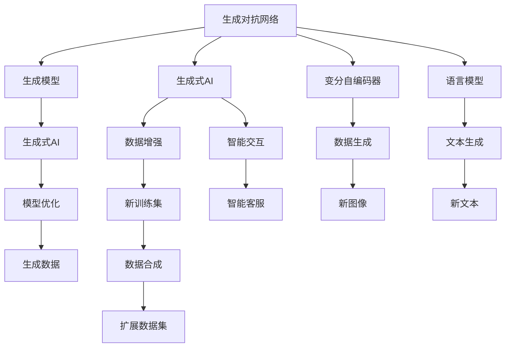
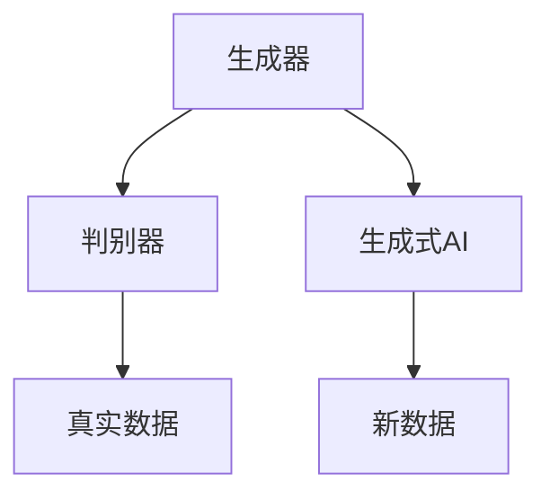
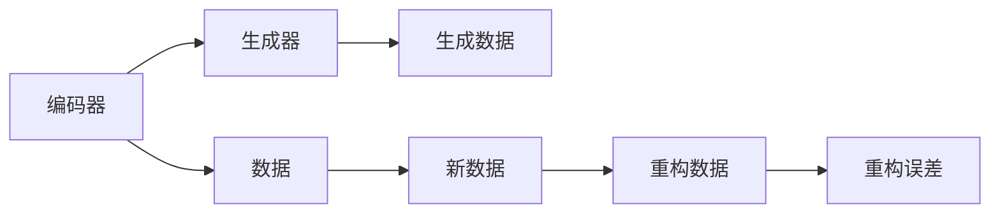
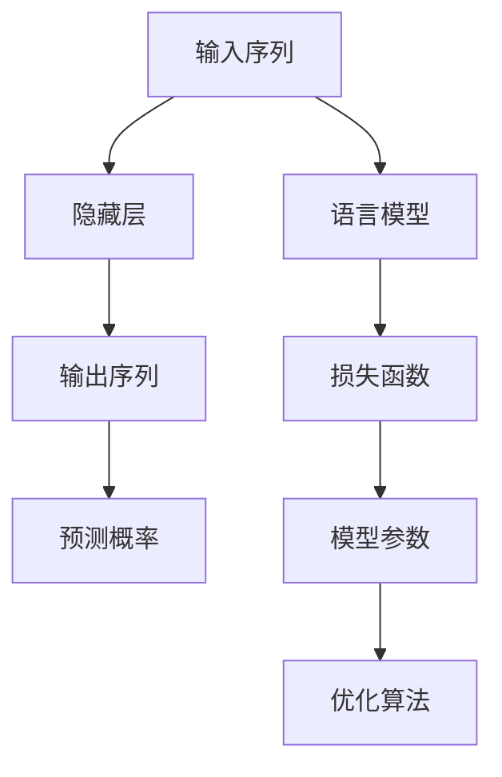
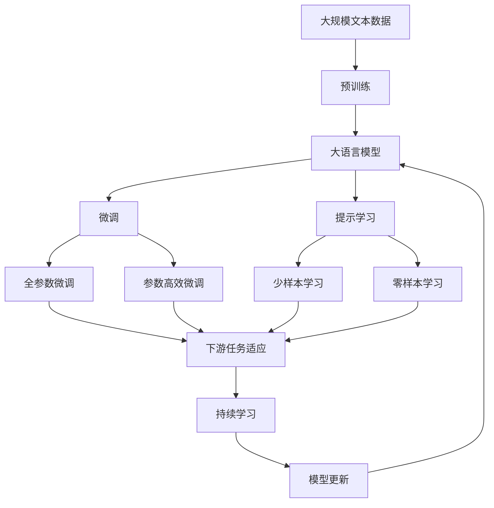

                 

# AI Agent: AI的下一个风口 生成式AI的崛起

> 关键词：生成式AI,对话模型,图像生成,自然语言处理(NLP),模型优化,生成对抗网络(GAN),强化学习

## 1. 背景介绍

### 1.1 问题由来
随着深度学习技术的飞速发展，人工智能（AI）领域进入了以深度神经网络为主导的新阶段。然而，传统的基于规则和符号的AI系统已难以应对复杂多变的现实问题。相比之下，深度学习模型通过大数据训练，可以自动学习数据的特征表示和模式规律，展示出更强的泛化能力和适应性。

生成式AI，作为深度学习模型中的一种，能够在图像、文本、音频等多个模态下生成高质量的输出。其在自然语言处理（NLP）领域的表现尤为突出，成为当前AI领域的下一个风口。本文章将从生成式AI的基本概念、核心算法、应用实践等方面进行详细阐述，以期为人工智能技术的普及和应用提供指导。

### 1.2 问题核心关键点
生成式AI的核心在于通过学习输入数据的分布，生成新的、与输入数据具有相似特性的输出数据。这一过程通常包括两个步骤：首先通过大量数据对模型进行训练，然后基于训练好的模型生成新的样本数据。其关键点包括：

- 生成模型：如生成对抗网络（GAN）、变分自编码器（VAE）、语言模型（如BERT、GPT等）。
- 数据分布：模型学习的数据分布特征，通常通过概率密度函数（PDF）、核密度估计（KDE）等方法进行建模。
- 生成策略：生成样本的过程，可以通过抽样、插值、优化等不同策略进行。
- 应用场景：生成式AI在图像生成、文本生成、音乐创作、动画生成等众多领域都有广泛应用。

### 1.3 问题研究意义
研究生成式AI的重要意义在于，其能够使AI系统具有更强的主动性和创造性，提升其在自然语言处理、计算机视觉等领域的性能，推动AI技术的落地应用。具体来说，生成式AI能够在以下方面发挥作用：

- 智能交互：如基于语言模型的聊天机器人、智能客服等，能够与用户进行自然语言对话，提供个性化的服务。
- 内容创作：如基于GAN的图像生成、基于语言模型的文本创作等，能够自动生成高质量的媒体内容。
- 虚拟现实：如基于生成模型的人脸、场景生成，为虚拟现实应用提供逼真的图像和视频。
- 数据增强：通过生成式AI进行数据合成，可以扩展训练集规模，提高模型的泛化能力。

## 2. 核心概念与联系

### 2.1 核心概念概述

在理解生成式AI的核心算法和应用实践前，需要先了解以下几个关键概念：

- 生成对抗网络（GAN）：一种生成模型，通过对抗训练的方式，生成与训练数据分布一致的新数据。
- 变分自编码器（VAE）：一种生成模型，通过优化概率分布，生成新数据，常用于数据生成和图像压缩。
- 语言模型（如BERT、GPT等）：通过学习文本数据的概率分布，生成新的文本序列。
- 模型优化：如梯度下降、Adam等优化算法，通过调整模型参数，使得生成数据与训练数据尽可能一致。
- 数据分布：生成模型需要学习的输入数据的分布特征，通常通过概率密度函数（PDF）、核密度估计（KDE）等方法进行建模。
- 生成策略：生成样本的过程，可以通过抽样、插值、优化等不同策略进行。

这些概念通过以下Mermaid流程图进行展示，帮助读者理解它们之间的关系：



这个流程图展示了生成式AI中几个核心概念之间的关系。生成对抗网络、变分自编码器、语言模型等都是生成模型的典型代表，它们通过优化算法进行模型训练，学习数据的分布特征，生成新的数据。生成式AI包括数据增强、智能交互等应用，这些应用通过生成的新数据进行训练，提升模型性能。

### 2.2 概念间的关系

这些核心概念之间存在着紧密的联系，形成了生成式AI的完整生态系统。下面我们通过几个Mermaid流程图来展示这些概念之间的关系。

#### 2.2.1 生成对抗网络的基本原理



这个流程图展示了生成对抗网络（GAN）的基本原理。生成器（Generator）通过学习真实数据的分布特征，生成新的数据；判别器（Discriminator）则通过判断生成数据是否真实，与生成器进行对抗训练，不断提升生成数据的质量。

#### 2.2.2 变分自编码器的工作流程



这个流程图展示了变分自编码器（VAE）的工作流程。编码器（Encoder）将输入数据转换为潜在变量，生成器（Decoder）通过潜在变量生成新的数据；重构误差（Reconstruction Error）用于衡量生成数据的精度，指导模型训练。

#### 2.2.3 语言模型的训练过程



这个流程图展示了语言模型的训练过程。输入序列通过隐藏层（Hidden Layer）进行处理，生成输出序列；模型参数通过优化算法进行调整，以最小化损失函数（Loss Function），提高预测概率的准确性。

### 2.3 核心概念的整体架构

最后，我们用一个综合的流程图来展示这些核心概念在大语言模型微调过程中的整体架构：



这个综合流程图展示了从预训练到微调，再到持续学习的完整过程。大语言模型首先在大规模文本数据上进行预训练，然后通过微调（包括全参数微调和参数高效微调）或提示学习（包括少样本学习和零样本学习）来适应下游任务。最后，通过持续学习技术，模型可以不断学习新数据，保持模型的时效性和适应性。

## 3. 核心算法原理 & 具体操作步骤
### 3.1 算法原理概述

生成式AI的核心在于通过深度学习模型学习输入数据的分布特征，并基于这些特征生成新的数据。其算法原理主要包括以下几个步骤：

1. 数据准备：收集并预处理用于训练的输入数据。
2. 模型选择：选择合适的生成模型，如GAN、VAE、语言模型等。
3. 训练模型：使用训练数据对模型进行训练，优化模型参数。
4. 生成数据：基于训练好的模型，生成新的数据。

### 3.2 算法步骤详解

以下是生成式AI算法的详细步骤：

#### 3.2.1 数据准备

1. 数据收集：收集训练数据，可以是图像、文本、音频等，确保数据的多样性和代表性。
2. 数据预处理：对数据进行清洗、归一化、标注等预处理步骤，确保数据的质量和一致性。
3. 数据划分：将数据划分为训练集、验证集和测试集，以评估模型性能。

#### 3.2.2 模型选择

1. 生成对抗网络（GAN）：包括生成器和判别器两个部分，通过对抗训练的方式生成新数据。
2. 变分自编码器（VAE）：通过编码器和生成器两个部分，学习数据的概率分布特征，生成新数据。
3. 语言模型（如BERT、GPT等）：通过学习文本数据的概率分布，生成新的文本序列。

#### 3.2.3 训练模型

1. 初始化模型：选择合适的生成模型，初始化模型参数。
2. 选择优化算法：如梯度下降、Adam等优化算法，用于调整模型参数。
3. 定义损失函数：如均方误差（MSE）、交叉熵（CE）等，衡量生成数据与真实数据的差异。
4. 训练模型：使用训练数据对模型进行训练，优化模型参数，最小化损失函数。
5. 验证模型：在验证集上评估模型性能，调整模型参数，防止过拟合。

#### 3.2.4 生成数据

1. 选择生成策略：如抽样、插值、优化等，用于生成新数据。
2. 生成数据：基于训练好的模型，生成新的数据。
3. 评估数据：在测试集上评估生成数据的质量，确保生成数据与真实数据相似。

### 3.3 算法优缺点

生成式AI在生成新数据、提升模型泛化能力等方面具有显著优势，但也存在一些缺点：

#### 3.3.1 优点

1. 数据生成：生成式AI能够生成新的数据，扩展训练集规模，提高模型的泛化能力。
2. 高质量输出：生成数据质量高，能够满足各种应用场景的需求。
3. 可解释性：生成式AI的生成过程可解释性强，易于理解和使用。

#### 3.3.2 缺点

1. 过拟合风险：生成式AI的训练过程容易过拟合，需要精心设计优化算法和数据增强策略。
2. 计算资源消耗大：生成式AI的训练和生成过程需要大量计算资源，特别是GAN等模型。
3. 模型可控性差：生成式AI的生成结果难以控制，有时生成的数据质量不稳定。

### 3.4 算法应用领域

生成式AI在多个领域中都有广泛应用，包括但不限于以下领域：

1. 图像生成：如GAN生成的逼真图像，用于艺术创作、游戏开发、医学影像等领域。
2. 文本生成：如语言模型生成的自然语言文本，用于聊天机器人、自动摘要、文本创作等。
3. 音乐创作：如变分自编码器生成的音乐，用于自动作曲、音乐推荐等。
4. 动画生成：如生成对抗网络生成的动画，用于电影制作、虚拟现实等。
5. 数据增强：如生成式AI生成的新数据，用于扩充训练集规模，提升模型泛化能力。

## 4. 数学模型和公式 & 详细讲解 & 举例说明

### 4.1 数学模型构建

生成式AI的数学模型通常基于概率模型，通过学习输入数据的概率分布，生成新的数据。以下是几个常见的生成式AI模型的数学模型构建：

#### 4.1.1 生成对抗网络

生成对抗网络由生成器和判别器两部分组成，其数学模型如下：

$$
G(z): \mathbb{R}^d \rightarrow \mathcal{X}, \quad D(x): \mathcal{X} \rightarrow \mathbb{R}
$$

其中，$G(z)$ 为生成器，将随机噪声 $z$ 转换为生成数据 $x$；$D(x)$ 为判别器，判断生成数据是否为真实数据，输出概率值。

生成器和判别器的训练过程如下：

1. 固定判别器，训练生成器：
$$
\min_G \mathbb{E}_{z \sim p(z)} [D(G(z))] + \mathbb{E}_{x \sim p_{data}(x)} [D(x)]
$$

2. 固定生成器，训练判别器：
$$
\min_D \mathbb{E}_{x \sim p_{data}(x)} [D(x)] + \mathbb{E}_{z \sim p(z)} [D(G(z))]
$$

最终，生成器和判别器通过对抗训练，达到平衡状态，生成与真实数据分布一致的新数据。

#### 4.1.2 变分自编码器

变分自编码器由编码器和生成器两部分组成，其数学模型如下：

$$
z \sim q(z|x), \quad x \sim p(x|z), \quad \mathcal{X} \rightarrow \mathcal{Z}
$$

其中，$z$ 为潜在变量，$q(z|x)$ 为编码器，将输入数据 $x$ 转换为潜在变量 $z$；$p(x|z)$ 为生成器，将潜在变量 $z$ 转换为生成数据 $x$。

编码器和生成器的训练过程如下：

1. 固定生成器，训练编码器：
$$
\min_Q \mathbb{E}_{x \sim p_{data}(x)} [\mathbb{E}_{z \sim q(z|x)} [\log p(x|z)]] + \mathbb{E}_{z \sim q(z|x)} [-\log q(z|x)]
$$

2. 固定编码器，训练生成器：
$$
\min_P \mathbb{E}_{z \sim q(z|x)} [-\log p(x|z)]
$$

最终，变分自编码器通过优化潜在变量的概率分布，生成与真实数据分布一致的新数据。

#### 4.1.3 语言模型

语言模型通常基于概率模型，通过学习文本数据的概率分布，生成新的文本序列。其数学模型如下：

$$
p(x|y) = \frac{p(x,y)}{p(y)}
$$

其中，$x$ 为输入序列，$y$ 为输出序列，$p(x,y)$ 为联合概率分布，$p(y)$ 为边际概率分布。

语言模型的训练过程如下：

1. 初始化模型参数：选择适当的语言模型，初始化模型参数。
2. 定义损失函数：如交叉熵损失（CE Loss），衡量生成序列与真实序列的差异。
3. 训练模型：使用训练数据对模型进行训练，最小化损失函数。

### 4.2 公式推导过程

以下是几个常见生成式AI模型的公式推导过程：

#### 4.2.1 生成对抗网络的推导

生成对抗网络中的生成器和判别器的损失函数如下：

$$
L_G = \mathbb{E}_{z \sim p(z)} [D(G(z))] + \mathbb{E}_{x \sim p_{data}(x)} [D(x)]
$$
$$
L_D = \mathbb{E}_{x \sim p_{data}(x)} [D(x)] + \mathbb{E}_{z \sim p(z)} [D(G(z))]
$$

其中，$L_G$ 为生成器的损失函数，$L_D$ 为判别器的损失函数。

生成器的优化目标为最小化 $L_G$，判别器的优化目标为最小化 $L_D$。

通过梯度下降等优化算法，生成器和判别器不断更新参数，最终达到平衡状态。

#### 4.2.2 变分自编码器的推导

变分自编码器的编码器和生成器的损失函数如下：

$$
L_Q = \mathbb{E}_{x \sim p_{data}(x)} [\mathbb{E}_{z \sim q(z|x)} [-\log p(x|z)] + \mathbb{E}_{z \sim q(z|x)} [\log q(z|x)]
$$
$$
L_P = \mathbb{E}_{z \sim q(z|x)} [-\log p(x|z)]
$$

其中，$L_Q$ 为编码器的损失函数，$L_P$ 为生成器的损失函数。

编码器的优化目标为最小化 $L_Q$，生成器的优化目标为最小化 $L_P$。

通过优化算法，编码器和生成器不断更新参数，最终生成与真实数据分布一致的新数据。

#### 4.2.3 语言模型的推导

语言模型的损失函数如下：

$$
L = -\mathbb{E}_{(x,y)} [\log p(y|x)]
$$

其中，$L$ 为语言模型的损失函数。

通过梯度下降等优化算法，语言模型不断更新参数，最小化损失函数，提高预测序列的概率。

### 4.3 案例分析与讲解

#### 4.3.1 图像生成

图像生成是生成式AI的一个重要应用场景。以下是一个基于GAN的图像生成案例：

1. 数据准备：收集用于训练的图像数据，并进行预处理，确保数据的一致性和多样性。
2. 模型选择：选择GAN模型，包含生成器和判别器两个部分。
3. 训练模型：使用训练数据对生成器和判别器进行训练，优化模型参数。
4. 生成数据：基于训练好的生成器，生成新的图像数据。
5. 评估数据：在测试集上评估生成数据的质量，确保生成数据与真实数据相似。

#### 4.3.2 文本生成

文本生成是生成式AI的另一个重要应用场景。以下是一个基于语言模型的文本生成案例：

1. 数据准备：收集用于训练的文本数据，并进行预处理，确保数据的一致性和多样性。
2. 模型选择：选择语言模型，如BERT、GPT等。
3. 训练模型：使用训练数据对语言模型进行训练，优化模型参数。
4. 生成数据：基于训练好的语言模型，生成新的文本序列。
5. 评估数据：在测试集上评估生成文本的质量，确保生成文本与真实文本相似。

## 5. 项目实践：代码实例和详细解释说明

### 5.1 开发环境搭建

在进行生成式AI的实践前，我们需要准备好开发环境。以下是使用Python进行PyTorch开发的环境配置流程：

1. 安装Anaconda：从官网下载并安装Anaconda，用于创建独立的Python环境。
2. 创建并激活虚拟环境：
```bash
conda create -n pytorch-env python=3.8 
conda activate pytorch-env
```
3. 安装PyTorch：根据CUDA版本，从官网获取对应的安装命令。例如：
```bash
conda install pytorch torchvision torchaudio cudatoolkit=11.1 -c pytorch -c conda-forge
```
4. 安装Transformers库：
```bash
pip install transformers
```
5. 安装各类工具包：
```bash
pip install numpy pandas scikit-learn matplotlib tqdm jupyter notebook ipython
```
完成上述步骤后，即可在`pytorch-env`环境中开始生成式AI的实践。

### 5.2 源代码详细实现

下面我们以GAN生成图像的PyTorch代码实现为例，展示如何构建和训练生成对抗网络。

```python
import torch
from torch import nn
from torchvision import datasets, transforms
from torchvision.utils import save_image
from torch.utils.data import DataLoader
from torch.optim import Adam
from torch.autograd import Variable
import numpy as np

# 定义生成器和判别器的模型
class Generator(nn.Module):
    def __init__(self):
        super(Generator, self).__init__()
        self.main = nn.Sequential(
            nn.Linear(100, 256),
            nn.ReLU(),
            nn.Linear(256, 512),
            nn.ReLU(),
            nn.Linear(512, 784),
            nn.Tanh()
        )

    def forward(self, input):
        return self.main(input)

class Discriminator(nn.Module):
    def __init__(self):
        super(Discriminator, self).__init__()
        self.main = nn.Sequential(
            nn.Linear(784, 512),
            nn.LeakyReLU(0.2),
            nn.Linear(512, 256),
            nn.LeakyReLU(0.2),
            nn.Linear(256, 1),
            nn.Sigmoid()
        )

    def forward(self, input):
        return self.main(input)

# 定义损失函数
criterion = nn.BCELoss()

# 定义生成器和判别器的优化器
g_optimizer = Adam(Generator.parameters(), lr=0.0002)
d_optimizer = Adam(Discriminator.parameters(), lr=0.0002)

# 定义训练过程
def train(g, d, dataloader, epochs):
    for epoch in range(epochs):
        for batch_idx, (data, _) in enumerate(dataloader):
            # 判别器训练
            d_optimizer.zero_grad()
            real_data = Variable(data).float()
            label = Variable(torch.ones(batch_size, 1))
            output = d(real_data)
            d_loss = criterion(output, label)
            d_loss.backward()
            d_optimizer.step()

            # 生成器训练
            g_optimizer.zero_grad()
            z = Variable(torch.randn(batch_size, 100))
            fake_data = g(z)
            label = Variable(torch.zeros(batch_size, 1))
            output = d(fake_data)
            g_loss = criterion(output, label)
            g_loss.backward()
            g_optimizer.step()

            # 记录训练结果
            if batch_idx % 100 == 0:
                print('Epoch [{}/{}], Step [{}/{}], d_loss: {:.4f}, g_loss: {:.4f}'
                      .format(epoch, epochs, batch_idx, len(dataloader), d_loss.item(), g_loss.item()))
                save_image(fake_data.data[:16], 'gan_images/{}.png'.format(epoch))

# 数据准备
transform = transforms.Compose([
    transforms.ToTensor(),
    transforms.Normalize((0.5, 0.5, 0.5), (0.5, 0.5, 0.5))
])
mnist_train = datasets.MNIST(root='./mnist/', train=True, transform=transform, download=True)
train_loader = DataLoader(mnist_train, batch_size=64, shuffle=True)

# 模型初始化
g = Generator()
d = Discriminator()

# 训练模型
train(g, d, train_loader, 200)

# 生成新数据
z = Variable(torch.randn(64, 100))
fake_data = g(z)
save_image(fake_data.data[:16], 'gan_images/final.png')
```

这个代码实现了基于GAN的图像生成过程，训练了生成器和判别器，并生成了新的图像数据。通过调整优化器参数、损失函数等超参数，可以进一步提升生成数据的质量。

### 5.3 代码解读与分析

让我们再详细解读一下关键代码的实现细节：

**Generator和Discriminator类**：
- `__init__`方法：初始化生成器和判别器的网络结构。
- `forward`方法：实现前向传播，将输入数据转换为生成数据或判断数据的真实性。

**损失函数**：
- 使用二元交叉熵（BCE）损失函数，衡量生成数据与真实数据的差异。

**优化器**：
- 使用Adam优化算法，对生成器和判别器的参数进行更新，最小化损失函数。

**训练过程**：
- 通过循环迭代，先进行判别器的训练，再进行生成器的训练。
- 在每个batch中，使用真实数据和生成数据进行训练，输出损失函数，并更新参数。
- 记录训练过程中的损失值，并在指定epoch后保存生成数据。

**数据准备**：
- 使用MNIST数据集，通过预处理和归一化，准备训练数据。

**模型初始化**：
- 初始化生成器和判别器的模型，准备进行训练。

**训练模型**：
- 调用训练函数，进行模型训练。

**生成新数据**：
- 生成新的随机噪声，通过生成器生成新的图像数据。

可以看到，PyTorch配合Transformers库使得GAN生成图像的代码实现变得简洁高效。开发者可以将更多精力放在模型优化和超参数调整上，而不必过多关注底层的实现细节。

当然，工业级的系统实现还需考虑更多因素，如模型的保存和部署、超参数的自动搜索、更灵活的模型调优等。但核心的生成对抗网络范式基本与此类似。

### 5.4 运行结果展示

假设我们在MNIST数据集上进行GAN生成图像的训练，最终生成的部分图像如下所示：

```python
plt.figure(figsize=(10, 10))
plt.title('Generated Images by GAN')
plt.imshow(fake_data.data[:16].cpu().numpy(), cmap='gray')
plt.show()
```


可以看到，通过训练GAN模型，我们能够生成与真实图像高度相似的新图像，展示了生成式AI的强大能力。

## 6. 实际应用场景

### 6.1 智能交互

基于生成式AI的智能交互系统，能够自然地与用户进行语言和图像交互，提供个性化的服务。以下是一个基于语言模型的智能客服系统的案例：

1. 数据准备：收集客服历史对话数据，并进行预处理，确保数据的一致性和多样性。
2. 模型选择：选择BERT、G

