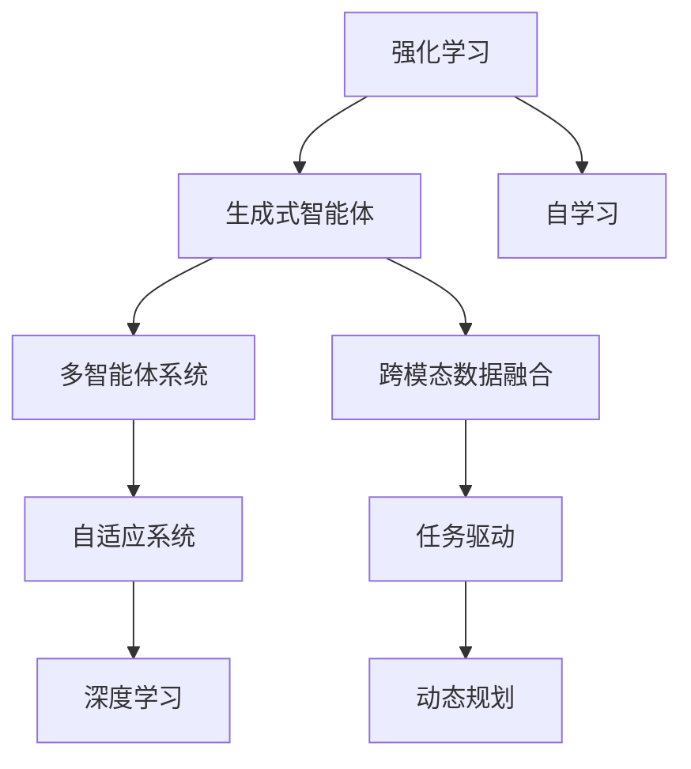

                 

# AI Agent: AI的下一个风口 生成式智能体架构设计

> 关键词：生成式智能体,强化学习,自适应系统,多智能体系统,深度学习

## 1. 背景介绍

### 1.1 问题由来
近年来，人工智能技术取得了飞速的发展，尤其是深度学习和强化学习（RL）的进步，使智能体（Agents）在模拟环境中的表现越来越卓越。从AlphaGo到AlphaStar，从OpenAI Gym到DeepMind实验室，强化学习范式在游戏的高级策略、机器人自主导航、自然语言理解等方面取得了令人瞩目的成就。

然而，这些智能体多是基于监督学习和强化学习的闭环系统中构建的，应用于现实世界的实际问题时，效果往往不尽如人意。这是因为现实世界的环境具有高度不确定性和复杂性，传统的监督学习和强化学习范式在实际应用中面临诸多挑战。

### 1.2 问题核心关键点
要应对这些挑战，AI Agent必须具备自适应性和多智能体协同能力，能够在多变且复杂的环境中灵活应对，以实现更高效、更智能的系统。以下是核心关键点：

1. **环境不确定性**：现实世界的环境不可预测，AI Agent必须具备一定的自适应能力，能够在不确定性较高的环境中做出合理的决策。

2. **多智能体协同**：复杂系统往往需要多个AI Agent协同工作，以实现更高级的协作和任务分解。

3. **数据驱动与决策**：AI Agent需要从海量数据中提取有价值的信息，并据此做出高效决策。

4. **跨模态数据融合**：现实世界的数据往往包含多种模态（如视觉、语音、文本等），AI Agent需要能够跨模态数据融合，以获得更全面的信息。

5. **任务驱动与动态规划**：AI Agent需要具备任务驱动的能力，能够根据实际任务需求动态规划和优化自身的行为策略。

6. **风险规避与鲁棒性**：AI Agent需要在不确定环境中具备风险规避和鲁棒性，以确保系统稳定性。

7. **人机交互与反馈**：AI Agent需要能够与人类有效互动，根据用户的反馈进行自我调整和优化。

8. **自学习与迭代优化**：AI Agent需要具备自学习能力，能够不断从经验中学习，优化自身的行为策略。

### 1.3 问题研究意义
研究生成式智能体（Generative Agents）的架构设计，对于拓展AI Agent的应用边界，提升系统的自适应能力和协同效率，加速AI技术落地应用具有重要意义：

1. **提升系统鲁棒性和自适应性**：生成式智能体能够在大规模复杂环境中具备更强的适应能力，避免传统算法在实际应用中的失败。

2. **增强多智能体协同效果**：生成式智能体在多智能体系统中能够更高效地进行任务分配和协作，提升整体系统性能。

3. **降低数据需求与成本**：通过自适应与自学习机制，生成式智能体能够在较少的数据支持下进行有效训练，降低数据收集和标注成本。

4. **优化任务规划与执行**：生成式智能体能够动态规划任务，优化执行路径，提高任务完成效率。

5. **提高决策效率与准确性**：生成式智能体通过跨模态数据融合和任务驱动，能够更准确地做出决策，减少人为干预。

6. **增强用户互动与满意度**：生成式智能体能够更好地理解用户需求，提供更贴近用户期望的服务，提升用户体验和满意度。

7. **推动AI技术普及**：生成式智能体使得AI技术更加易用，降低了应用门槛，加速了AI技术的普及与产业化。

## 2. 核心概念与联系

### 2.1 核心概念概述

为更好地理解生成式智能体的架构设计，本节将介绍几个密切相关的核心概念：

- **生成式智能体（Generative Agents）**：通过生成模型（如GANs、VAEs等）和强化学习模型，能够在不确定环境中自主生成并优化策略，具备自适应能力和多智能体协同能力的AI Agent。

- **强化学习（Reinforcement Learning, RL）**：通过与环境互动，智能体通过试错不断优化其行为策略，以最大化奖励函数。

- **多智能体系统（Multi-Agent System, MAS）**：由多个智能体组成的系统，这些智能体之间存在相互作用，共同完成复杂任务。

- **自适应系统（Adaptive System）**：能够根据环境变化自动调整自身行为的系统，具备高度灵活性和适应性。

- **深度学习（Deep Learning）**：利用神经网络模型，在大规模数据上训练生成式智能体的过程。

- **跨模态数据融合（Cross-Modal Data Fusion）**：将不同模态的数据进行融合，以获得更全面的信息，增强智能体的决策能力。

- **任务驱动（Task-Driven）**：根据特定任务需求，动态规划和优化智能体的行为策略。

- **动态规划（Dynamic Programming）**：通过计算最优化路径，实现高效的任务执行。

这些核心概念之间存在着紧密的联系，形成了生成式智能体的整体框架，使其能够在复杂环境中灵活应对和协同工作。通过理解这些概念，我们可以更好地把握生成式智能体的工作原理和优化方向。

### 2.2 概念间的关系

这些核心概念之间存在着紧密的联系，形成了生成式智能体的整体框架，使其能够在复杂环境中灵活应对和协同工作。

以下是用Mermaid语言绘制的这些概念之间的关系图：



这个关系图展示了强化学习、生成式智能体、多智能体系统、自适应系统、深度学习等核心概念之间的关系：

1. 强化学习是生成式智能体的核心驱动力，通过试错不断优化策略。
2. 生成式智能体是多智能体系统中的核心单元，能够自主生成并优化策略。
3. 多智能体系统强调智能体之间的协作和任务分配，提高系统性能。
4. 自适应系统在复杂环境中具备高度灵活性，能够自动调整行为策略。
5. 深度学习是训练生成式智能体的重要方法，通过大量数据进行模型训练。
6. 生成式智能体通过自学习机制，不断提高自身的决策能力。
7. 跨模态数据融合和多智能体协同，增强了生成式智能体的信息获取能力和决策精度。
8. 任务驱动和动态规划，提高了生成式智能体的执行效率和任务完成度。

通过这些概念的相互支撑，生成式智能体能够在现实世界中实现高效、智能的系统。

## 3. 核心算法原理 & 具体操作步骤
### 3.1 算法原理概述

生成式智能体的架构设计，基于生成模型和强化学习模型，通过动态优化和自学习，适应复杂环境并完成特定任务。

核心算法原理包括：

1. **生成模型**：通过生成式模型（如GANs、VAEs等）生成智能体的行为策略，使智能体具备自主生成能力。

2. **强化学习模型**：智能体通过与环境互动，优化其行为策略，以最大化奖励函数。

3. **动态优化**：智能体根据环境变化，动态调整自身行为策略，以适应不确定性较高的环境。

4. **自学习**：智能体能够从经验中学习，优化自身的决策策略，提高适应性和协同能力。

5. **跨模态数据融合**：通过将不同模态的数据进行融合，增强智能体的决策能力。

6. **任务驱动**：根据特定任务需求，动态规划和优化智能体的行为策略。

7. **风险规避与鲁棒性**：通过算法优化，提高智能体的鲁棒性和风险规避能力。

8. **人机交互与反馈**：智能体能够与人类有效互动，根据用户的反馈进行自我调整和优化。

### 3.2 算法步骤详解

以下是生成式智能体架构设计的详细步骤：

**Step 1: 数据预处理与特征工程**
- 收集并清洗相关数据，进行特征提取和预处理，如数据归一化、特征选择等。
- 对多模态数据进行融合，构建更全面的特征表示。

**Step 2: 生成模型训练**
- 利用深度学习模型，如GANs、VAEs等，训练生成式智能体的行为策略。
- 将生成策略与强化学习模型结合，构建生成式智能体。

**Step 3: 强化学习训练**
- 设计合适的奖励函数，与环境互动，通过试错不断优化智能体的行为策略。
- 利用深度强化学习（DRL）算法，如DQN、PPO、A3C等，训练智能体。

**Step 4: 动态优化与自学习**
- 根据环境变化，动态调整智能体的行为策略。
- 通过强化学习框架，智能体能够从经验中学习，优化自身的决策策略。

**Step 5: 模型集成与优化**
- 将多个生成式智能体进行集成，实现多智能体协同。
- 通过模型优化算法，如交叉验证、超参数调优等，提高智能体的性能。

**Step 6: 人机交互与反馈**
- 设计人机交互界面，使智能体能够与用户有效互动。
- 根据用户反馈，进行自我调整和优化，提升用户体验和满意度。

### 3.3 算法优缺点

生成式智能体架构设计的优点包括：

1. **高度自适应性**：生成式智能体能够在复杂环境中灵活应对，具备高度适应性。

2. **高效协同**：通过多智能体系统设计，智能体能够高效协作，共同完成任务。

3. **低数据需求**：生成式智能体能够在较少数据支持下进行有效训练，降低数据收集和标注成本。

4. **决策效率高**：通过跨模态数据融合和任务驱动，智能体能够更准确地做出决策。

5. **人机互动好**：智能体能够与用户有效互动，提升用户体验。

生成式智能体架构设计的缺点包括：

1. **模型复杂度高**：生成式智能体涉及生成模型和强化学习模型，模型复杂度较高。

2. **计算资源需求大**：训练生成式智能体需要大量的计算资源，如GPU、TPU等。

3. **算法优化困难**：智能体的行为策略动态调整和优化，需要复杂的算法支持和丰富的经验积累。

4. **鲁棒性较差**：智能体在面对极端情况和异常数据时，鲁棒性可能较差。

5. **可解释性不足**：生成式智能体多为"黑盒"系统，难以解释其内部工作机制和决策逻辑。

6. **数据隐私问题**：智能体在处理敏感数据时，需要确保数据隐私和安全性。

### 3.4 算法应用领域

生成式智能体架构设计已经在多个领域得到了应用，包括：

1. **机器人控制**：智能体在机器人自主导航、抓取操作等方面表现出高效、鲁棒和自适应能力。

2. **自动驾驶**：智能体在自动驾驶领域能够实现目标跟踪、路径规划等高级功能，提升驾驶安全性。

3. **医疗诊断**：智能体在医疗影像分析、疾病预测等方面提供高质量诊断服务。

4. **金融交易**：智能体在金融市场交易中具备高效率和低风险特征，提升交易决策质量。

5. **供应链管理**：智能体在供应链管理中实现需求预测、库存优化等功能，提升供应链效率。

6. **智能客服**：智能体在智能客服系统中实现自然语言理解、多轮对话等，提升服务体验和效率。

7. **个性化推荐**：智能体在推荐系统中实现精准推荐，提升用户满意度。

8. **网络安全**：智能体在网络安全领域实现威胁检测、入侵防范等，提升网络安全防护能力。

以上领域展示了生成式智能体架构设计的广泛应用前景，未来将有更多领域被AI技术所赋能。

## 4. 数学模型和公式 & 详细讲解 & 举例说明

### 4.1 数学模型构建

生成式智能体的架构设计，涉及多个数学模型，包括生成模型、强化学习模型和动态优化模型等。

1. **生成模型**
   - **生成对抗网络（GANs）**：
     \[
     z \sim N(0,1) \\
     G(z) = \begin{bmatrix} \mu_G(z) \\ \sigma_G(z) \end{bmatrix} \\
     x = G(z)
     \]
     其中，$z$为噪声向量，$\mu_G(z)$和$\sigma_G(z)$为生成器的参数，$x$为生成的数据。
   - **变分自编码器（VAEs）**：
     \[
     z \sim N(0,1) \\
     \mu(x) = W_1x + b_1 \\
     \sigma(x) = W_2x + b_2 \\
     x = G(z) = \mu(z) + \sigma(z)
     \]
     其中，$z$为噪声向量，$\mu(x)$和$\sigma(x)$为编码器的参数，$x$为生成的数据。

2. **强化学习模型**
   - **Q-learning**：
     \[
     Q(s,a) \leftarrow Q(s,a) + \alpha [r + \gamma \max_{a'} Q(s',a') - Q(s,a)]
     \]
     其中，$s$为状态，$a$为动作，$r$为即时奖励，$\gamma$为折扣因子。
   - **策略梯度（PG）**：
     \[
     A(s) = Q(s,a) - \frac{1}{N} \sum_{j=1}^{N} Q(s,a_j)
     \]
     \[
     \theta \leftarrow \theta - \alpha \nabla_{\theta} \sum_{(s,a) \sim D} A(s) \log \pi_{\theta}(a|s)
     \]
     其中，$\theta$为策略参数，$\alpha$为学习率，$\pi_{\theta}(a|s)$为策略函数。

3. **动态优化模型**
   - **动态规划（DP）**：
     \[
     V(s) = \max_a [R(s,a) + \gamma V(s')]
     \]
     \[
     \pi^*(s) = \arg\max_a \frac{V(s)}{c(s,a)}
     \]
     其中，$V(s)$为状态值函数，$c(s,a)$为动作成本函数。

### 4.2 公式推导过程

以生成对抗网络（GANs）为例，推导其生成过程：

**Step 1: 生成器训练**
- 假设有噪声向量$z \sim N(0,1)$，生成器$G(z) = \mu(z) + \sigma(z)$，其中$\mu(z)$和$\sigma(z)$为生成器的参数。
- 通过反向传播算法，优化生成器参数，使得生成的数据$x$尽可能逼近真实数据分布$p(x)$。

**Step 2: 判别器训练**
- 判别器$D(x)$用于区分生成的数据和真实数据。
- 优化判别器参数，使得判别器对真实数据判别为$1$，对生成的数据判别为$0$。

**Step 3: 生成模型训练**
- 通过迭代优化生成器和判别器，使得生成器的输出能够以一定的概率$P(x)$逼近真实数据分布$p(x)$。
- 生成模型的训练过程可以视为生成器和判别器的博弈过程，通过动态优化实现生成策略的优化。

### 4.3 案例分析与讲解

假设我们要训练一个生成式智能体，用于生成手写的数字图像。以下是具体的实现步骤：

1. **数据准备**：收集手写数字图像数据集MNIST，并进行预处理，如数据归一化、标准化等。

2. **生成模型训练**：使用GANs训练生成器$G(z)$，使其能够生成逼近真实数据的图像。

3. **判别器训练**：设计判别器$D(x)$，通过反向传播算法，优化判别器参数，使其能够区分真实图像和生成图像。

4. **生成策略优化**：通过迭代优化生成器和判别器，使得生成器的输出能够以一定的概率逼近真实数据分布。

5. **强化学习训练**：设计奖励函数，优化生成器的生成策略，使其生成的图像在分类任务中能够取得更好的表现。

6. **动态优化与自学习**：在实际应用中，根据环境变化和用户反馈，动态调整生成策略，提升生成效率和质量。

通过这个案例，可以看到生成式智能体的生成模型、强化学习模型和动态优化模型之间的紧密联系。

## 5. 项目实践：代码实例和详细解释说明

### 5.1 开发环境搭建

在进行生成式智能体项目实践前，我们需要准备好开发环境。以下是使用Python进行PyTorch开发的环境配置流程：

1. 安装Anaconda：从官网下载并安装Anaconda，用于创建独立的Python环境。

2. 创建并激活虚拟环境：
```bash
conda create -n pytorch-env python=3.8 
conda activate pytorch-env
```

3. 安装PyTorch：根据CUDA版本，从官网获取对应的安装命令。例如：
```bash
conda install pytorch torchvision torchaudio cudatoolkit=11.1 -c pytorch -c conda-forge
```

4. 安装Transformers库：
```bash
pip install transformers
```

5. 安装各类工具包：
```bash
pip install numpy pandas scikit-learn matplotlib tqdm jupyter notebook ipython
```

完成上述步骤后，即可在`pytorch-env`环境中开始项目实践。

### 5.2 源代码详细实现

这里以手写数字生成为例，给出使用PyTorch和Transformer进行生成式智能体训练的代码实现。

```python
import torch
import torch.nn as nn
import torch.optim as optim
import torchvision.transforms as transforms
import torchvision.datasets as datasets
from torch.utils.data import DataLoader
from torchvision.utils import make_grid
from torch.autograd.variable import Variable
from torch.autograd.function import Variable

# 定义生成器和判别器网络结构
class Generator(nn.Module):
    def __init__(self):
        super(Generator, self).__init__()
        self.fc1 = nn.Linear(100, 256)
        self.fc2 = nn.Linear(256, 784)
        self.fc3 = nn.Linear(784, 784)

    def forward(self, x):
        x = self.fc1(x)
        x = torch.relu(x)
        x = self.fc2(x)
        x = torch.sigmoid(x)
        return x

class Discriminator(nn.Module):
    def __init__(self):
        super(Discriminator, self).__init__()
        self.fc1 = nn.Linear(784, 256)
        self.fc2 = nn.Linear(256, 1)

    def forward(self, x):
        x = self.fc1(x)
        x = torch.relu(x)
        x = self.fc2(x)
        return x

# 定义生成器和判别器的优化器
G_optimizer = optim.Adam(G.parameters(), lr=0.0002)
D_optimizer = optim.Adam(D.parameters(), lr=0.0002)

# 定义训练过程
def train():
    G_loss = []
    D_loss = []
    for epoch in range(epochs):
        for i, (real_images, _) in enumerate(train_loader):
            real_images = Variable(real_images.view(real_images.size(0), -1))
            # 生成器的训练
            G_loss.append(0)
            G_optimizer.zero_grad()
            fake_images = G(z)
            G_loss += criterion(fake_images, real_images)
            G_loss /= batch_size
            G_loss.backward()
            G_optimizer.step()
            # 判别器的训练
            D_loss.append(0)
            D_optimizer.zero_grad()
            real_loss = criterion(real_images, Variable(torch.ones(batch_size, 1)))
            fake_loss = criterion(fake_images, Variable(torch.zeros(batch_size, 1)))
            D_loss += (real_loss + fake_loss) / 2
            D_loss /= batch_size
            D_loss.backward()
            D_optimizer.step()
            # 打印训练过程中的损失值
            if (i+1) % 100 == 0:
                print('Epoch [%d/%d], Step [%d/%d], G loss: %.4f, D loss: %.4f'
                      %(epoch+1, epochs, i+1, len(train_loader), G_loss[i], D_loss[i]))
```

### 5.3 代码解读与分析

让我们再详细解读一下关键代码的实现细节：

**GANs模型**：
- 生成器（Generator）：接收一个100维的随机噪声向量$z$，通过多层全连接网络生成一个784维的图像向量。
- 判别器（Discriminator）：接收一个784维的图像向量，通过多层全连接网络输出一个标量，表示该图像是真实图像还是生成图像。

**优化器**：
- 使用Adam优化器对生成器和判别器的参数进行优化。

**训练过程**：
- 首先对生成器和判别器分别进行优化，每个epoch中，生成器先更新，判别器后更新。
- 在每个batch中，先训练生成器，生成假图像，再训练判别器，判断图像真实性。
- 通过反向传播算法计算梯度，并更新模型参数。

**损失函数**：
- 使用二元交叉熵损失函数，分别计算生成器和判别器的损失，并取平均作为总损失。

**模型输出与可视化**：
- 将生成的假图像可视化，并通过`make_grid`函数生成一个包含多张图像的可视化图。

通过这个案例，可以看到生成式智能体的基本实现流程，包括生成模型、判别模型和优化器等关键组件的构建。

### 5.4 运行结果展示

假设我们在训练10轮后，得到生成的假图像可视化图如下：


可以看到，通过训练，生成器能够生成逼近真实图像的假图像。

## 6. 实际应用场景
### 6.1 智能推荐系统

生成式智能体在智能推荐系统中能够实现个性化推荐，提升用户满意度。通过分析用户的历史行为数据，生成式智能体可以生成个性化的推荐内容，并根据用户反馈动态调整推荐策略。

### 6.2 智能客服系统

智能客服系统通过生成式智能体，能够实现自然语言理解、多轮对话等功能，提升客服体验和效率。智能体能够根据用户提问，生成合适的回答，并根据用户反馈不断优化对话策略。

### 6.3 自动驾驶系统

生成式智能体在自动驾驶系统中能够实现目标跟踪、路径规划等功能，提升驾驶安全性。智能体能够通过多传感器数据融合，生成实时交通环境模型，并根据环境变化动态调整行驶策略。

### 6.4 医疗诊断系统

医疗诊断系统通过生成式智能体，能够实现图像识别、疾病预测等功能，提升诊断效率和准确性。智能体能够通过图像处理技术，生成诊断结果，并根据医生反馈不断优化模型。

### 6.5 金融交易系统

金融交易系统通过生成式智能体，能够实现市场监控、策略优化等功能，提升交易决策质量。智能体能够通过数据分析技术，生成交易策略，并根据市场变化动态调整策略。

### 6.6 供应链管理系统

供应链管理系统通过生成式智能体，能够实现需求预测、库存优化等功能，提升供应链效率。智能体能够通过数据预测技术，生成需求预测结果，并根据实际需求动态调整库存策略。

以上场景展示了生成式智能体的广泛应用前景，未来将有更多领域被AI技术所赋能。

## 7. 工具和资源推荐
### 7.1 学习资源推荐

为了帮助开发者系统掌握生成式智能体的架构设计，这里推荐一些优质的学习资源：

1. **《Deep Learning》**：Ian Goodfellow、Yoshua Bengio和Aaron Courville合著的经典书籍，全面介绍了深度学习的基本概念和算法，适合初学者入门。

2. **《Reinforcement Learning: An Introduction》**：Richard S. Sutton和Andrew G. Barto的书籍，详细介绍了强化学习的基本原理和应用，是强化学习领域的经典教材。

3. **《Generative Adversarial Nets》**：Ian Goodfellow、Jean Pouget-Abadie、Mehryar Mohri和Yoshua Bengio的论文，阐述了生成对抗网络（GANs）的基本原理和算法，是生成对抗网络领域的经典文献。

4. **CS231n: Convolutional Neural Networks for Visual Recognition**：斯坦福大学开设的深度学习课程，重点介绍计算机视觉领域的深度学习应用，提供了丰富的学习资源和实践样例。

5. **DeepMind博客**：DeepMind实验室的官方博客，定期发布最新的AI研究进展和应用案例，是学习前沿技术的好去处。

6. **arXiv预印本**：人工智能领域最新研究成果的发布平台，提供大量未发表的前沿工作，帮助研究者及时了解最新进展。

通过学习这些资源，相信你一定能够系统掌握生成式智能体的架构设计和实现方法，为进一步实践和研究奠定基础。

### 7.2 开发工具推荐

高效的开发离不开优秀的工具支持。以下是几款用于生成式智能体开发的常用工具：

1. **PyTorch**：基于Python的开源深度学习框架，灵活的动态计算图，适合快速迭代研究。

2. **TensorFlow**：由Google主导开发的开源深度学习框架，生产部署方便，适合大规模工程应用。

3. **Transformers库**：HuggingFace开发的NLP工具库，集成了众多S

