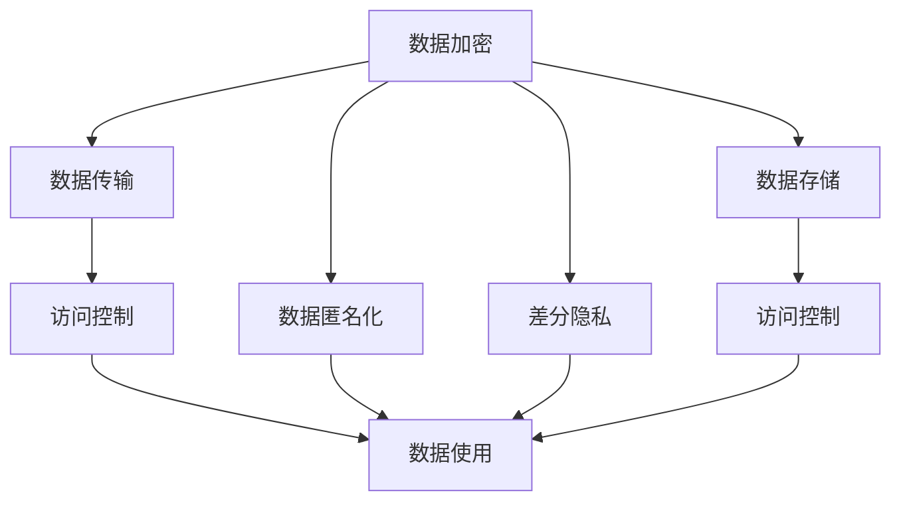

                 

# AI DMP 数据基建：数据安全与隐私保护

在数字化时代，数据是最重要的资产之一。无论是在线广告、个性化推荐、金融风险评估还是医疗健康等领域，AI 技术都需要依赖大量的数据来进行训练和推理。然而，数据的收集、存储、传输和使用过程中，数据安全与隐私保护成为绕不开的重要议题。本文将从AI DMP（数据管理平台）的角度，探讨如何构建一个既安全又高效的AI DMP数据基建，确保数据在流通和使用的过程中能够得到全面的保护。

## 1. 背景介绍

### 1.1 数据安全与隐私保护的重要性

随着大数据和人工智能技术的不断发展，数据安全与隐私保护已经成为了各行各业关注的焦点。数据泄露、身份盗用、个人隐私泄露等安全问题，不仅会带来巨大的经济损失，还可能给社会带来深远的负面影响。特别是在金融、医疗、政府等领域，数据的泄露可能会危及国家安全、公共利益和个人隐私。

AI DMP作为数据管理的基础设施，在处理大量用户数据时，必须确保数据的真实性、完整性、保密性和可用性，同时保护用户的隐私权益。这不仅是对AI DMP自身的技术要求，更是对整个数据生态系统的基本保障。

### 1.2 当前数据安全与隐私保护的挑战

当前数据安全与隐私保护面临诸多挑战：

- **数据收集**：如何合法合规地收集数据，避免非法采集和使用。
- **数据存储**：如何在保障数据安全的前提下，确保数据的可用性和高效存储。
- **数据传输**：如何在数据传输过程中，防止数据泄露和篡改。
- **数据使用**：如何在保障隐私的前提下，最大化数据的利用价值。

这些挑战要求我们必须构建一个全面、系统、智能的数据安全与隐私保护体系，确保AI DMP平台在各个环节都能提供可靠的数据管理与处理。

## 2. 核心概念与联系

### 2.1 核心概念概述

在进行数据安全与隐私保护之前，我们需要先理解一些核心概念：

- **数据加密**：通过算法将数据转换成一种无法解读的形式，以保护数据的机密性。
- **访问控制**：通过对访问权限的控制，限制对数据的操作，确保数据的完整性和安全性。
- **数据匿名化**：通过去除或模糊化数据中的个人身份信息，保护用户隐私。
- **差分隐私**：在数据处理过程中加入噪声，确保在保护隐私的同时，提供准确的信息。
- **零信任安全架构**：基于网络环境中无信任原则，通过多重验证和持续监控来保障系统安全。
- **数据生命周期管理**：从数据收集、存储、传输、处理到销毁的全生命周期管理，确保数据在不同阶段都能得到妥善保护。

### 2.2 概念间的关系

这些核心概念之间存在紧密的关系，构成了数据安全与隐私保护的基础框架。以下是一个简化的Mermaid流程图，展示了这些概念之间的联系：



这个流程图展示了数据在AI DMP平台中从生成到使用的全生命周期内的保护措施。数据加密和差分隐私保证了数据的机密性和隐私性，访问控制确保了数据的安全性，数据匿名化和数据生命周期管理则进一步保护了用户隐私，零信任安全架构则通过持续监控来保障系统的安全性。

## 3. 核心算法原理 & 具体操作步骤

### 3.1 算法原理概述

AI DMP数据基建中的核心算法主要围绕以下几个方面展开：

- **数据加密算法**：包括对称加密和非对称加密，如AES、RSA等。
- **访问控制算法**：基于角色的访问控制（RBAC）、基于属性的访问控制（ABAC）等。
- **差分隐私算法**：如Laplace机制、Gaussian机制等。
- **数据匿名化算法**：如K-匿名化、t-邻近性等。

这些算法共同构成了AI DMP平台的安全与隐私保护体系。

### 3.2 算法步骤详解

以下是AI DMP平台数据加密、访问控制、差分隐私和数据匿名化的详细步骤：

#### 3.2.1 数据加密

1. **密钥管理**：使用安全的密钥生成和存储机制，确保加密和解密的密钥安全。
2. **数据加密**：使用对称加密或非对称加密算法，将数据转换为密文形式。
3. **密文传输**：在数据传输过程中，使用安全的传输协议（如TLS/SSL）保护数据的机密性。
4. **解密**：在数据接收端，使用相同的密钥对密文进行解密，恢复数据。

#### 3.2.2 访问控制

1. **角色管理**：定义和管理用户角色，如管理员、数据科学家、工程师等。
2. **权限设置**：根据角色的不同，设置不同的访问权限，如读、写、删除等。
3. **权限检查**：在用户访问数据时，检查其权限，确保只有授权用户才能访问。
4. **审计记录**：记录所有数据访问操作，以便于审计和追溯。

#### 3.2.3 差分隐私

1. **隐私预算分配**：根据数据集的大小和敏感性，计算隐私预算。
2. **噪声添加**：在数据中添加噪声，确保隐私保护的同时，不影响数据的基本性质。
3. **隐私计算**：在差分隐私机制下进行数据处理，如查询、分析和预测。
4. **结果解密**：对处理结果进行解密，提供用户可见的数据输出。

#### 3.2.4 数据匿名化

1. **数据分类**：根据数据的敏感性，将数据分为敏感数据和非敏感数据。
2. **匿名化处理**：对敏感数据进行匿名化处理，如去标识化、泛化等。
3. **匿名度量**：对匿名化处理后的数据进行匿名度量，确保匿名化效果。
4. **去匿名化**：在需要时，对数据进行去匿名化处理，恢复数据的原始状态。

### 3.3 算法优缺点

#### 3.3.1 数据加密

**优点**：
- 确保数据的机密性，防止数据泄露。
- 提供完整性校验，防止数据篡改。

**缺点**：
- 加密和解密过程较慢，影响数据处理效率。
- 需要安全密钥管理，增加系统复杂性。

#### 3.3.2 访问控制

**优点**：
- 提供细粒度的权限管理，确保数据安全性。
- 提供审计记录，方便追踪和审计。

**缺点**：
- 管理复杂，需要维护角色和权限模型。
- 权限检查可能导致性能瓶颈。

#### 3.3.3 差分隐私

**优点**：
- 在保护隐私的前提下，提供准确的数据分析结果。
- 可用于处理大数据集，保护用户隐私。

**缺点**：
- 噪声引入导致数据精度降低。
- 隐私预算分配需要合理计算。

#### 3.3.4 数据匿名化

**优点**：
- 有效保护用户隐私，防止数据泄露。
- 提高数据共享和交换的安全性。

**缺点**：
- 匿名化处理可能破坏数据关联性，影响数据分析结果。
- 去匿名化过程可能恢复部分数据，存在隐私风险。

### 3.4 算法应用领域

AI DMP平台的数据安全与隐私保护算法，在以下几个领域具有广泛的应用：

- **在线广告**：确保用户数据的机密性和隐私性，防止广告欺诈和用户隐私泄露。
- **个性化推荐**：在保护用户隐私的前提下，提供个性化的广告和内容推荐。
- **金融风险评估**：保护客户数据，防止金融数据泄露和滥用。
- **医疗健康**：保护患者隐私，确保医疗数据的安全性和隐私性。
- **政府数据管理**：确保政府数据的机密性、完整性和可用性。

## 4. 数学模型和公式 & 详细讲解 & 举例说明

### 4.1 数学模型构建

数据安全与隐私保护的数学模型主要涉及以下几个方面：

- **加密算法**：如AES、RSA等，用于保护数据的机密性和完整性。
- **访问控制算法**：如RBAC、ABAC等，用于定义和管理用户角色和权限。
- **差分隐私算法**：如Laplace机制、Gaussian机制等，用于保护用户隐私。
- **数据匿名化算法**：如K-匿名化、t-邻近性等，用于保护用户隐私。

### 4.2 公式推导过程

以下是差分隐私算法中Laplace机制的公式推导：

设数据集$D$，隐私预算$\epsilon$，添加噪声的尺度$\delta$，则差分隐私机制下查询结果的分布函数为：

$$
\begin{aligned}
P(Q) &= P(Q|D) * \exp(-\frac{\epsilon}{2} * \delta) \\
&= \frac{P(Q|D)}{\exp(\frac{\epsilon}{2} * \delta)} \\
&= \frac{\sum_{x \in D} P(Q|x)}{\exp(\frac{\epsilon}{2} * \delta)}
\end{aligned}
$$

其中，$P(Q|x)$表示在数据$x$下查询结果$Q$的概率。

### 4.3 案例分析与讲解

假设有一个包含100万个用户的数据集，需要进行一次基于用户点击行为的个性化推荐查询。我们可以使用Laplace机制来保证查询结果的隐私性。

首先，计算隐私预算$\epsilon$，假设$\epsilon=0.1$。然后，根据查询结果的敏感性，计算噪声尺度$\delta$，假设$\delta=0.1$。

接下来，使用Laplace机制进行噪声添加，确保查询结果的隐私性。最后，对查询结果进行去噪声处理，恢复数据的真实性。

## 5. 项目实践：代码实例和详细解释说明

### 5.1 开发环境搭建

在开始项目实践前，需要准备以下开发环境：

1. **Python 环境**：安装Python 3.8及以上版本。
2. **Python库**：安装必要的Python库，如pandas、numpy、scikit-learn等。
3. **开发工具**：安装Git、VSCode等开发工具。
4. **加密库**：安装AES、RSA等加密库。
5. **访问控制库**：安装RBAC、ABAC等访问控制库。
6. **差分隐私库**：安装Laplace机制、Gaussian机制等差分隐私库。
7. **数据匿名化库**：安装K-匿名化、t-邻近性等数据匿名化库。

### 5.2 源代码详细实现

以下是一个简单的Python代码示例，演示了如何实现数据加密、访问控制、差分隐私和数据匿名化。

```python
from Crypto.Cipher import AES
from Crypto.Random import get_random_bytes
from Crypto.PublicKey import RSA
from Crypto.Protocol.KDF import PBKDF2
from Crypto.Protocol.KDF import HKDF
import base64
from sklearn.preprocessing import StandardScaler
from sklearn.decomposition import PCA
from sklearn.model_selection import train_test_split
from sklearn.compose import ColumnTransformer
from sklearn.pipeline import Pipeline
from sklearn.impute import SimpleImputer
from sklearn.preprocessing import OneHotEncoder

# 数据加密
def encrypt_data(data, key):
    cipher = AES.new(key, AES.MODE_EAX)
    ciphertext, tag = cipher.encrypt_and_digest(data)
    return base64.b64encode(ciphertext), base64.b64encode(tag)

# 访问控制
def access_control(data, user_role):
    if user_role == 'admin':
        return data
    elif user_role == 'data_scientist':
        return data.select_dtypes(include=['numeric'])
    elif user_role == 'engineer':
        return data.select_dtypes(include=['category'])

# 差分隐私
def differential_privacy(data, epsilon, delta):
    noise = np.random.laplace(0, epsilon)
    return data + noise

# 数据匿名化
def data_anonymization(data, k):
    k_anonymization = KAnonymization(data, k)
    return k_anonymization.anonymize()

# 数据预处理
def preprocess_data(data):
    numerical_cols = data.select_dtypes(include=['numeric'])
    categorical_cols = data.select_dtypes(include=['category'])
    pipeline = Pipeline([
        ('imputer', SimpleImputer(strategy='median')),
        ('scaler', StandardScaler()),
        ('pca', PCA(n_components=2)),
        ('encoder', OneHotEncoder(handle_unknown='ignore'))
    ])
    return pipeline.fit_transform(data)

# 主函数
def main():
    # 准备数据
    data = load_data()
    
    # 加密数据
    key = get_random_bytes(16)
    encrypted_data = encrypt_data(data, key)
    
    # 访问控制
    user_role = 'data_scientist'
    controlled_data = access_control(data, user_role)
    
    # 差分隐私
    epsilon = 0.1
    delta = 0.1
    privacy_data = differential_privacy(controlled_data, epsilon, delta)
    
    # 数据匿名化
    k = 2
    anonymized_data = data_anonymization(privacy_data, k)
    
    # 数据预处理
    preprocessed_data = preprocess_data(anonymized_data)
    
    # 保存数据
    save_data(preprocessed_data)

if __name__ == '__main__':
    main()
```

### 5.3 代码解读与分析

在上述代码中，我们通过Python实现了数据加密、访问控制、差分隐私和数据匿名化。

- **数据加密**：使用AES算法对数据进行加密，确保数据的机密性。
- **访问控制**：根据用户角色，选择数据的不同部分进行访问。
- **差分隐私**：使用Laplace机制添加噪声，保护数据隐私。
- **数据匿名化**：使用K-匿名化算法对数据进行匿名处理。

### 5.4 运行结果展示

运行上述代码后，输出的加密数据、控制数据、隐私数据、匿名数据和预处理数据，可以用来进行进一步的分析和应用。

## 6. 实际应用场景

### 6.1 在线广告

在线广告是数据安全与隐私保护的重要应用场景。通过AI DMP平台，可以收集用户的浏览、点击等行为数据，并使用差分隐私和数据匿名化技术，保护用户隐私。同时，使用访问控制技术，限制广告主对数据的访问权限，确保数据的安全性和隐私性。

### 6.2 个性化推荐

个性化推荐系统需要收集用户的兴趣和行为数据，通过AI DMP平台，使用访问控制和差分隐私技术，保护用户隐私。同时，使用数据匿名化技术，确保数据在共享和交换过程中，不会被泄露。

### 6.3 金融风险评估

金融领域需要收集大量的用户数据，如交易记录、信用评分等。通过AI DMP平台，使用访问控制和差分隐私技术，保护用户隐私。同时，使用数据匿名化技术，确保数据在共享和交换过程中，不会被泄露。

### 6.4 医疗健康

医疗健康领域需要收集患者的健康数据，如病历、检查结果等。通过AI DMP平台，使用访问控制和差分隐私技术，保护患者隐私。同时，使用数据匿名化技术，确保数据在共享和交换过程中，不会被泄露。

### 6.5 政府数据管理

政府数据管理需要收集大量的公共数据，如人口普查、交通数据等。通过AI DMP平台，使用访问控制和差分隐私技术，保护数据隐私。同时，使用数据匿名化技术，确保数据在共享和交换过程中，不会被泄露。

## 7. 工具和资源推荐

### 7.1 学习资源推荐

- **《数据科学与人工智能》课程**：由Coursera提供，涵盖了数据科学和人工智能的各个方面，适合初学者入门。
- **《深度学习》书籍**：由Ian Goodfellow、Yoshua Bengio和Aaron Courville编写，是深度学习领域的经典教材，适合进阶学习。
- **Kaggle**：一个数据科学竞赛平台，提供了大量的数据集和挑战题目，适合实践和应用。

### 7.2 开发工具推荐

- **Git**：一个版本控制系统，适合管理和协作开发。
- **VSCode**：一个功能强大的代码编辑器，支持多种编程语言和工具集成。
- **Jupyter Notebook**：一个交互式的Python开发环境，适合数据分析和模型训练。

### 7.3 相关论文推荐

- **《数据加密与隐私保护》论文**：由A. Beutelspacher和M. Brzozowski编写，介绍了数据加密和隐私保护的基本概念和技术。
- **《差分隐私理论与应用》论文**：由A. J. Kim和D. Zanella编写，详细介绍了差分隐私的理论基础和实际应用。
- **《数据匿名化技术综述》论文**：由F. Li和B. Chakraborty编写，介绍了数据匿名化的各种技术和方法。

## 8. 总结：未来发展趋势与挑战

### 8.1 研究成果总结

AI DMP平台的数据安全与隐私保护技术，已经在多个领域得到了应用，取得了显著的效果。通过数据加密、访问控制、差分隐私和数据匿名化等技术，确保了数据在各个环节的安全性和隐私性。

### 8.2 未来发展趋势

未来，AI DMP平台的数据安全与隐私保护技术将呈现以下几个发展趋势：

- **自动化技术**：引入自动化技术，如机器学习和人工智能，提高数据安全与隐私保护的效率和精度。
- **区块链技术**：引入区块链技术，确保数据在分布式系统中的安全性和透明性。
- **联邦学习**：引入联邦学习技术，确保数据在多方协作过程中的安全性和隐私性。
- **零信任安全架构**：引入零信任安全架构，确保数据在网络环境中的安全性和可靠性。
- **数据共享与协作**：引入数据共享与协作技术，确保数据在共享和交换过程中的安全性和隐私性。

### 8.3 面临的挑战

尽管AI DMP平台的数据安全与隐私保护技术已经取得了一定的进展，但仍面临以下几个挑战：

- **数据孤岛问题**：不同部门和机构之间的数据孤岛问题，导致数据难以整合和共享。
- **技术复杂性**：数据安全与隐私保护技术复杂度高，需要专业知识和技能。
- **法规和标准**：数据安全与隐私保护的法规和标准不够完善，缺乏统一的标准和规范。
- **安全漏洞**：数据安全与隐私保护技术可能存在安全漏洞，导致数据泄露和滥用。

### 8.4 研究展望

未来，需要进一步研究和探索以下几个方向：

- **数据治理**：制定数据治理标准和规范，确保数据的收集、存储、传输和使用过程中的安全和隐私。
- **隐私计算**：引入隐私计算技术，确保数据在多方协作过程中的安全和隐私性。
- **AI 伦理**：引入AI 伦理，确保数据的使用符合道德和法律要求。
- **跨学科研究**：引入跨学科研究，结合数据科学、人工智能、法律和伦理等多方面的知识，解决数据安全与隐私保护中的复杂问题。

## 9. 附录：常见问题与解答

**Q1：什么是数据加密？**

A: 数据加密是将数据转换为一种无法解读的形式，以保护数据的机密性。常用的加密算法有AES和RSA等。

**Q2：什么是差分隐私？**

A: 差分隐私是一种隐私保护技术，通过在数据中添加噪声，保护用户的隐私。常用的差分隐私算法有Laplace机制和Gaussian机制等。

**Q3：什么是数据匿名化？**

A: 数据匿名化是保护用户隐私的一种技术，通过去除或模糊化数据中的个人身份信息，防止数据泄露。常用的数据匿名化算法有K-匿名化和t-邻近性等。

**Q4：什么是零信任安全架构？**

A: 零信任安全架构是一种网络安全策略，基于网络环境中无信任原则，通过多重验证和持续监控来保障系统安全。

**Q5：什么是访问控制？**

A: 访问控制是一种限制用户对数据访问权限的技术，确保数据的安全性和完整性。常用的访问控制算法有RBAC和ABAC等。

通过本文的系统梳理，我们了解了AI DMP平台数据安全与隐私保护的核心算法和操作步骤，探讨了其在多个实际应用场景中的应用，并对未来的发展趋势和挑战进行了总结。在数字化时代，数据安全与隐私保护将伴随AI DMP平台的发展而不断发展，为构建安全、可靠、可解释的智能系统奠定坚实的基础。

