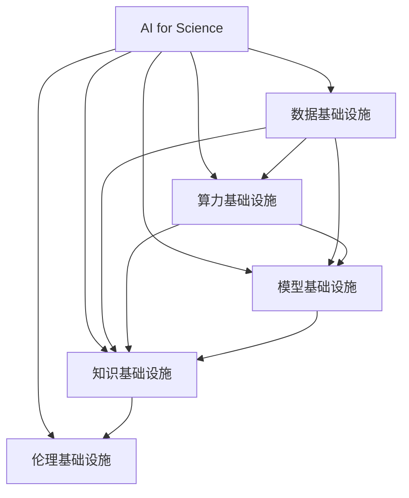
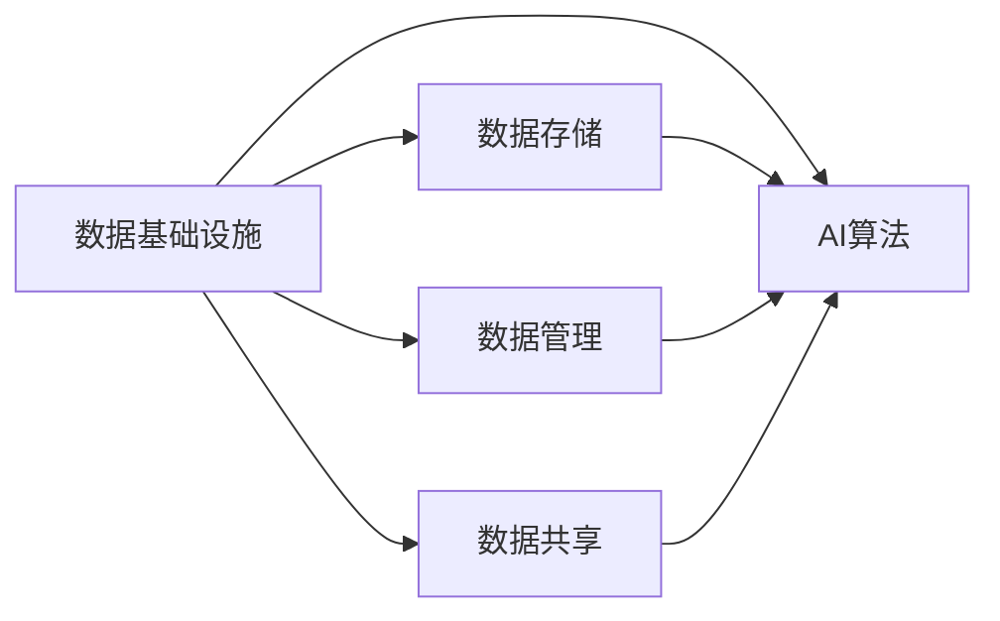
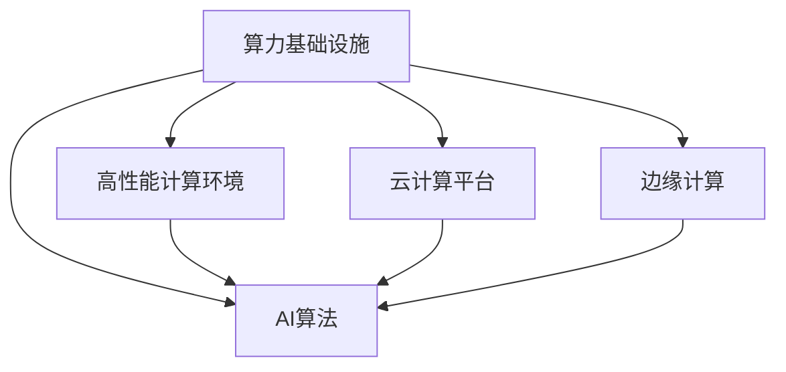
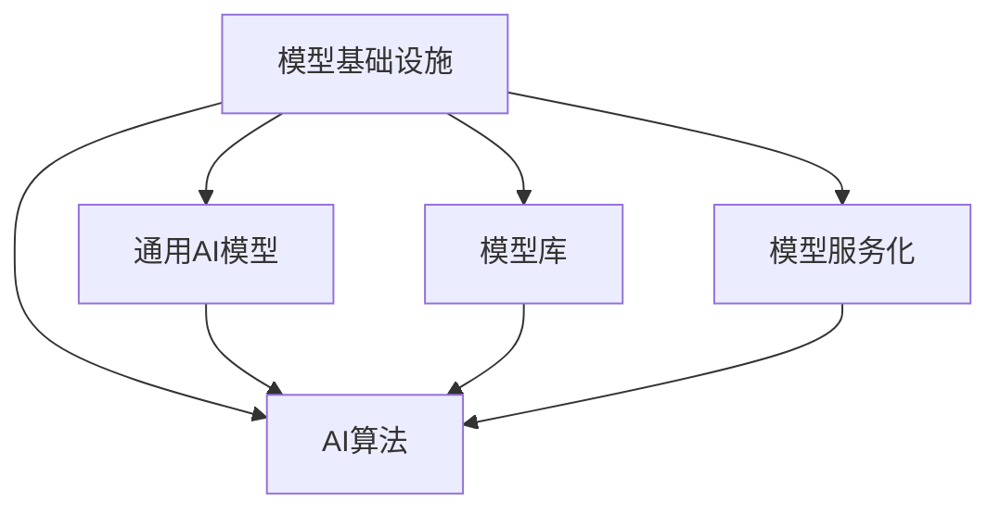
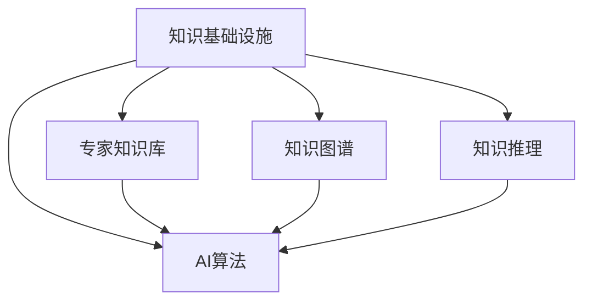
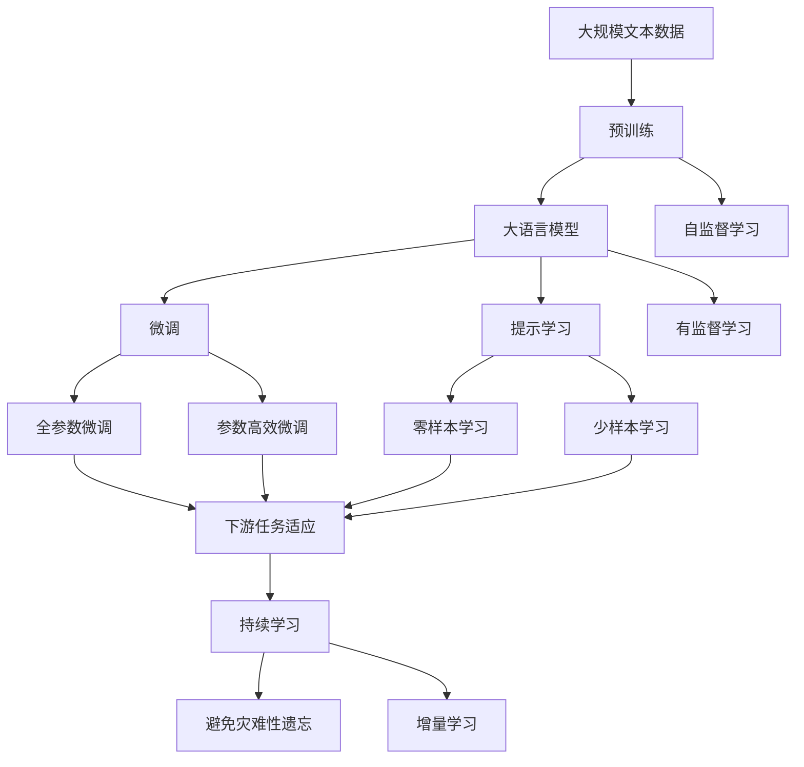

                 

# AI for Science的基础建设

## 1. 背景介绍

### 1.1 问题由来
人工智能（AI）正迅速进入科学领域，成为科学研究的得力助手。无论是天体物理、化学、生物，还是环境科学，AI正为各个学科带来变革性影响。从数据分析到模式识别，从自动推导到知识管理，AI在科学研究的各个环节都展示了其强大的潜力。

然而，尽管AI在科学领域展现出巨大前景，但在实际应用中仍面临诸多挑战。例如，AI算法复杂度高，对算力、数据、知识库等基础设施要求严格；科学研究的领域繁多，AI技术在特定领域的应用效果差异较大；AI模型如何与科学家的专业知识和实验数据有效结合，提高研究效率；AI在科学研究中的伦理问题和社会影响等。

为应对这些挑战，本文将从AI for Science的基础设施建设出发，探讨如何构建高效、灵活、可扩展的AI for Science平台，推动AI在科学研究中的广泛应用。

### 1.2 问题核心关键点
AI for Science的基础设施建设主要包含以下关键点：

- **数据基础设施**：如何高效存储、管理和共享科学数据，为AI算法提供充足、高质量的数据源。
- **算力基础设施**：如何构建高性能计算环境，满足AI算法对算力的需求。
- **模型基础设施**：如何设计通用的AI模型和工具，提高AI模型在科学领域的应用效果。
- **知识基础设施**：如何整合专家知识与AI算法，构建智能化的知识管理平台。
- **伦理基础设施**：如何构建AI伦理体系，确保AI应用的安全、公正和透明。

本文将围绕这些关键点，深入探讨AI for Science的基础设施建设问题，为科学研究的AI应用提供技术支持。

### 1.3 问题研究意义
构建高效、灵活、可扩展的AI for Science基础设施，对于推动AI技术在科学研究中的应用，提升研究效率，促进学科交叉融合，具有重要意义：

1. **提升研究效率**：AI可以自动处理大规模数据、模式识别、自动推导等复杂任务，显著提高科学研究的效率。
2. **促进学科交叉**：AI为不同学科之间的数据共享和知识交流提供了新的手段，推动学科交叉融合，产生更多创新成果。
3. **优化科研资源**：通过AI技术，可以优化科研资源配置，降低实验成本，提高实验成功率。
4. **推动科学普及**：AI在科学普及教育中的应用，可以帮助更多人理解科学原理，提升科学素养。
5. **保障研究公平**：AI可以为不同地区、不同层次的科学家提供平等的科研工具，缩小科研资源差距。
6. **探索科学前沿**：AI在科学研究中的应用，可以探索人类无法直接观察的未知领域，推动科学前沿的发展。

## 2. 核心概念与联系

### 2.1 核心概念概述

为更好地理解AI for Science的基础设施建设，本节将介绍几个关键概念：

- **AI for Science**：将AI技术应用于科学研究中的各种任务，如图像识别、自然语言处理、智能分析等，旨在提升科研效率和效果。
- **数据基础设施**：包括数据存储、数据管理、数据共享等，为AI算法提供数据支撑。
- **算力基础设施**：指高性能计算环境、云计算平台等，满足AI算法对算力的需求。
- **模型基础设施**：包括通用AI模型、模型库、模型服务化等，便于AI模型的构建和部署。
- **知识基础设施**：涉及专家知识库、知识图谱、知识推理等，与AI算法结合，提高研究深度和广度。
- **伦理基础设施**：包括AI伦理准则、法律规范、数据隐私保护等，确保AI应用的公正、透明和可控。

这些核心概念之间的逻辑关系可以通过以下Mermaid流程图来展示：



这个流程图展示了大语言模型微调过程中各个核心概念的相互关系：

1. 数据基础设施为AI算法提供数据支撑。
2. 算力基础设施满足AI算法对计算资源的需求。
3. 模型基础设施提供通用模型和工具，支持AI模型的构建和部署。
4. 知识基础设施整合专家知识与AI算法，提升研究深度和广度。
5. 伦理基础设施确保AI应用的公正、透明和可控。

### 2.2 概念间的关系

这些核心概念之间存在着紧密的联系，形成了AI for Science的基础设施架构。下面我们通过几个Mermaid流程图来展示这些概念之间的关系。

#### 2.2.1 数据基础设施与AI算法的关系



这个流程图展示了数据基础设施如何支持AI算法：

1. 数据存储：将科学数据高效存储在分布式存储系统中。
2. 数据管理：对数据进行组织、分类、元数据管理，便于AI算法检索和处理。
3. 数据共享：通过开放数据接口，实现数据共享和协作。

#### 2.2.2 算力基础设施与AI算法的关系



这个流程图展示了算力基础设施如何支持AI算法：

1. 高性能计算环境：提供高性能CPU、GPU、TPU等计算资源，满足AI算法对算力的需求。
2. 云计算平台：通过云服务提供弹性计算资源，便于大规模算力部署和扩展。
3. 边缘计算：在本地或边缘节点部署AI算法，减少数据传输延迟，提升响应速度。

#### 2.2.3 模型基础设施与AI算法的关系



这个流程图展示了模型基础设施如何支持AI算法：

1. 通用AI模型：提供预训练和微调好的模型，便于快速部署和使用。
2. 模型库：集中存储和管理AI模型，便于模型检索和版本控制。
3. 模型服务化：将模型封装为API服务，便于API调用和集成。

#### 2.2.4 知识基础设施与AI算法的关系



这个流程图展示了知识基础设施如何支持AI算法：

1. 专家知识库：收集和存储领域专家的知识和经验，供AI算法参考。
2. 知识图谱：构建领域知识的图谱模型，便于AI算法进行知识检索和推理。
3. 知识推理：利用AI算法进行知识推理和自动推导，提升研究深度和广度。

### 2.3 核心概念的整体架构

最后，我们用一个综合的流程图来展示这些核心概念在大语言模型微调过程中的整体架构：



这个综合流程图展示了从预训练到微调，再到持续学习的完整过程：

1. 大语言模型首先在大规模文本数据上进行预训练，学习通用语言表示。
2. 微调是基于预训练模型的，通过有监督学习优化模型在特定任务上的性能。
3. 提示学习是一种不更新模型参数的方法，可以在不更新模型参数的情况下，实现零样本或少样本学习。
4. 持续学习是使模型能够持续学习新知识，同时保持已学习的知识，避免灾难性遗忘。

通过这些流程图，我们可以更清晰地理解AI for Science基础设施的各个组件，为后续深入讨论具体的建设方案奠定基础。

## 3. 核心算法原理 & 具体操作步骤
### 3.1 算法原理概述

AI for Science的核心算法原理是利用数据、计算资源和知识库，构建高效、智能化的AI算法，支持科学研究中的各种任务。其核心思想是：将AI技术深度嵌入科研流程，自动化处理数据、发现模式、优化模型，提升科研效率和效果。

形式化地，假设AI算法为 $M$，其输入为 $x$，输出为 $y$。给定科学研究任务 $T$ 和训练数据集 $D=\{(x_i,y_i)\}_{i=1}^N$，AI算法的优化目标是最小化经验风险，即找到最优模型参数 $\theta$：

$$
\theta^* = \mathop{\arg\min}_{\theta} \mathcal{L}(M_{\theta},D)
$$

其中 $\mathcal{L}$ 为针对任务 $T$ 设计的损失函数，用于衡量模型预测输出与真实标签之间的差异。常见的损失函数包括交叉熵损失、均方误差损失等。

通过梯度下降等优化算法，AI算法不断更新模型参数 $\theta$，最小化损失函数 $\mathcal{L}$，使得模型输出逼近真实标签。由于 $M$ 已经通过科学数据和专家知识训练获得较好的初始化，因此即便在小规模数据集 $D$ 上进行微调，也能较快收敛到理想的模型参数 $\hat{\theta}$。

### 3.2 算法步骤详解

AI for Science的构建过程主要包括以下几个关键步骤：

**Step 1: 准备数据和知识库**
- 收集科学领域的高质量数据，建立科学数据集。
- 收集领域专家的知识和经验，建立专家知识库。
- 将数据和知识进行整合，构建知识图谱。

**Step 2: 选择合适的AI算法**
- 根据科学研究任务的类型，选择合适的AI算法，如图像识别、自然语言处理、智能分析等。
- 确定算法的超参数，如学习率、批大小、迭代轮数等。
- 设计合适的损失函数和优化算法。

**Step 3: 训练AI算法**
- 将数据集分成训练集、验证集和测试集。
- 在训练集上训练AI算法，根据验证集的性能进行调整。
- 在测试集上评估AI算法的性能，确保模型泛化能力。

**Step 4: 部署AI算法**
- 将训练好的AI算法部署到高性能计算环境或云平台。
- 将AI算法封装为API服务，便于科研人员调用。
- 实时监控AI算法的运行状态，收集性能数据。

**Step 5: 持续优化**
- 根据科研需求和反馈，持续优化AI算法。
- 定期更新数据集和知识库，提升AI算法的性能。
- 加入更多的科研人员参与，共同推进AI算法的发展。

以上是AI for Science的构建过程的一般流程。在实际应用中，还需要针对具体科研任务的特点，对AI算法的各个环节进行优化设计，如改进训练目标函数，引入更多的正则化技术，搜索最优的超参数组合等，以进一步提升算法性能。

### 3.3 算法优缺点

AI for Science的构建方法具有以下优点：

1. **提高科研效率**：AI算法可以自动化处理大规模数据、模式识别、自动推导等复杂任务，显著提高科学研究的效率。
2. **降低科研成本**：AI算法可以大幅减少科研人员在数据处理、实验设计、模型训练等环节的工作量，降低科研成本。
3. **提高科研准确性**：AI算法可以通过优化模型参数，提升模型预测的准确性和稳定性，减少人为误差。
4. **促进学科交叉**：AI算法为不同学科之间的数据共享和知识交流提供了新的手段，推动学科交叉融合，产生更多创新成果。
5. **优化科研资源**：通过AI技术，可以优化科研资源配置，降低实验成本，提高实验成功率。

同时，该方法也存在一定的局限性：

1. **数据质量要求高**：AI算法对数据质量的要求较高，需要高质量、标注齐全的数据集。
2. **模型泛化能力有限**：AI算法在特定数据集上的性能优秀，但在新数据集上的泛化能力有限。
3. **计算资源需求大**：AI算法对计算资源的需求较大，需要高性能计算环境和云计算平台支持。
4. **模型复杂度高**：AI算法通常比较复杂，需要科研人员具备一定的算法知识。
5. **伦理问题复杂**：AI算法在科学研究中的应用，涉及到伦理问题，如数据隐私、模型偏见等。

尽管存在这些局限性，但就目前而言，AI for Science的构建方法仍是大规模科学数据处理和分析的重要手段。未来相关研究的重点在于如何进一步降低AI算法对计算资源的需求，提高模型的泛化能力，同时兼顾可解释性和伦理安全性等因素。

### 3.4 算法应用领域

AI for Science的构建方法在科学研究中的应用非常广泛，覆盖了几乎所有常见的科研领域，例如：

- 天体物理：利用AI算法分析天文图像，发现天体运动规律。
- 化学：利用AI算法分析化学实验数据，发现新的化合物。
- 生物：利用AI算法分析基因组数据，发现新的生物标记物。
- 环境科学：利用AI算法分析环境监测数据，预测环境变化趋势。
- 地球科学：利用AI算法分析地质数据，研究地质构造。
- 医学：利用AI算法分析医疗影像，辅助疾病诊断。
- 物理学：利用AI算法分析物理实验数据，发现新的物理规律。

除了上述这些经典领域外，AI for Science的构建方法还被创新性地应用到更多场景中，如智能药物设计、智能农业、智能交通等，为科学研究和技术创新带来了新的突破。随着AI技术的发展，相信AI for Science的应用将不断扩展，推动科学技术的进步。

## 4. 数学模型和公式 & 详细讲解  
### 4.1 数学模型构建

本节将使用数学语言对AI for Science的构建过程进行更加严格的刻画。

记AI算法为 $M_{\theta}$，其中 $\theta \in \mathbb{R}^d$ 为模型参数。假设科学研究任务 $T$ 的训练集为 $D=\{(x_i,y_i)\}_{i=1}^N, x_i \in \mathcal{X}, y_i \in \mathcal{Y}$。

定义模型 $M_{\theta}$ 在数据样本 $(x,y)$ 上的损失函数为 $\ell(M_{\theta}(x),y)$，则在数据集 $D$ 上的经验风险为：

$$
\mathcal{L}(\theta) = \frac{1}{N} \sum_{i=1}^N \ell(M_{\theta}(x_i),y_i)
$$

AI for Science的优化目标是最小化经验风险，即找到最优参数：

$$
\theta^* = \mathop{\arg\min}_{\theta} \mathcal{L}(\theta)
$$

在实践中，我们通常使用基于梯度的优化算法（如SGD、Adam等）来近似求解上述最优化问题。设 $\eta$ 为学习率，$\lambda$ 为正则化系数，则参数的更新公式为：

$$
\theta \leftarrow \theta - \eta \nabla_{\theta}\mathcal{L}(\theta) - \eta\lambda\theta
$$

其中 $\nabla_{\theta}\mathcal{L}(\theta)$ 为损失函数对参数 $\theta$ 的梯度，可通过反向传播算法高效计算。

### 4.2 公式推导过程

以下我们以图像识别任务为例，推导损失函数及其梯度的计算公式。

假设AI算法 $M_{\theta}$ 在输入图像 $x$ 上的输出为 $\hat{y}=M_{\theta}(x) \in [0,1]$，表示样本属于类 $k$ 的概率。真实标签 $y \in \{1,0\}$。则交叉熵损失函数定义为：

$$
\ell(M_{\theta}(x),y) = -[y\log \hat{y} + (1-y)\log (1-\hat{y})]
$$

将其代入经验风险公式，得：

$$
\mathcal{L}(\theta) = -\frac{1}{N}\sum_{i=1}^N [y_i\log M_{\theta}(x_i)+(1-y_i)\log(1-M_{\theta}(x_i))]
$$

根据链式法则，损失函数对参数 $\theta_k$ 的梯度为：

$$
\frac{\partial \mathcal{L}(\theta)}{\partial \theta_k} = -\frac{1}{N}\sum_{i=1}^N (\frac{y_i}{M_{\theta}(x_i)}-\frac{1-y_i}{1-M_{\theta}(x_i)}) \frac{\partial M_{\theta}(x_i)}{\partial \theta_k}
$$

其中 $\frac{\partial M_{\theta}(x_i)}{\partial \theta_k}$ 可进一步递归展开，利用自动微分技术完成计算。

在得到损失函数的梯度后，即可带入参数更新公式，完成模型的迭代优化。重复上述过程直至收敛，最终得到适应科学研究任务的最优模型参数 $\theta^*$。

## 5. 项目实践：代码实例和详细解释说明
### 5.1 开发环境搭建

在进行AI for Science的构建实践前，我们需要准备好开发环境。以下是使用Python进行PyTorch开发的环境配置流程：

1. 安装Anaconda：从官网下载并安装Anaconda，用于创建独立的Python环境。

2. 创建并激活虚拟环境：
```bash
conda create -n ai-for-science python=3.8 
conda activate ai-for-science
```

3. 安装PyTorch：根据CUDA版本，从官网获取对应的安装命令。例如：
```bash
conda install pytorch torchvision torchaudio cudatoolkit=11.1 -c pytorch -c conda-forge
```

4. 安装TensorFlow：
```bash
conda install tensorflow
```

5. 安装各类工具包：
```bash
pip install numpy pandas scikit-learn matplotlib tqdm jupyter notebook ipython
```

完成上述步骤后，即可在`ai-for-science`环境中开始AI for Science的构建实践。

### 5.2 源代码详细实现

这里我们以图像分类任务为例，给出使用Transformers库对ResNet模型进行构建和训练的PyTorch代码实现。

首先，定义数据处理函数：

```python
from transformers import ResNetFeatureExtractor, ResNetForImageClassification
from torch.utils.data import Dataset, DataLoader
from torchvision import datasets, transforms

class ImageDataset(Dataset):
    def __init__(self, data_dir, transform=None):
        self.data_dir = data_dir
        self.transform = transform
        
        self.train_data = datasets.ImageFolder(data_dir, transform)
        self.test_data = datasets.ImageFolder(data_dir.replace('train', 'val'), transform)
        
    def __len__(self):
        return len(self.train_data) + len(self.test_data)
    
    def __getitem__(self, idx):
        if idx < len(self.train_data):
            sample = self.train_data[idx]
        else:
            sample = self.test_data[idx-len(self.train_data)]
            
        image = transforms.ToTensor()(sample[0])
        label = sample[1]
        
        if self.transform:
            image = self.transform(image)
        
        return {'image': image, 
                'label': label}
        
# 定义数据增强和预处理
train_transform = transforms.Compose([
    transforms.RandomResizedCrop(224),
    transforms.RandomHorizontalFlip(),
    transforms.ToTensor(),
    transforms.Normalize(mean=[0.485, 0.456, 0.406], std=[0.229, 0.224, 0.225])
])

val_transform = transforms.Compose([
    transforms.Resize(256),
    transforms.CenterCrop(224),
    transforms.ToTensor(),
    transforms.Normalize(mean=[0.485, 0.456, 0.406], std=[0.229, 0.224, 0.225])
])
```

然后，定义模型和优化器：

```python
from transformers import AdamW

model = ResNetForImageClassification.from_pretrained('resnet18', num_labels=10)

optimizer = AdamW(model.parameters(), lr=1e-5)
```

接着，定义训练和评估函数：

```python
from torch.utils.data import DataLoader
from tqdm import tqdm
from sklearn.metrics import classification_report

device = torch.device('cuda') if torch.cuda.is_available() else torch.device('cpu')
model.to(device)

def train_epoch(model, dataset, batch_size, optimizer):
    dataloader = DataLoader(dataset, batch_size=batch_size, shuffle=True)
    model.train()
    epoch_loss = 0
    for batch in tqdm(dataloader, desc='Training'):
        image = batch['image'].to(device)
        label = batch['label'].to(device)
        model.zero_grad()
        outputs = model(image)
        loss = outputs.loss
        epoch_loss += loss.item()
        loss.backward()
        optimizer.step()
    return epoch_loss / len(dataloader)

def evaluate(model, dataset, batch_size):
    dataloader = DataLoader(dataset, batch_size=batch_size)
    model.eval()
    preds, labels = [], []
    with torch.no_grad():
        for batch in tqdm(dataloader, desc='Evaluating'):
            image = batch['image'].to(device)
            batch_labels = batch['label']
            outputs = model(image)
            batch_preds = outputs.logits.argmax(dim=1).to('cpu').tolist()
            batch_labels = batch_labels.to('cpu').tolist()
            for pred, label in zip(batch_preds, batch_labels):
                preds.append(pred)
                labels.append(label)
                
    print(classification_report(labels, preds))
```

最后，启动训练流程并在测试集上评估：

```python
epochs = 10
batch_size = 16

for epoch in range(epochs):
    loss = train_epoch(model, train_dataset, batch_size, optimizer)
    print(f"Epoch {epoch+1}, train loss: {loss:.3f}")
    
    print(f"Epoch {epoch+1}, val results:")
    evaluate(model, val_dataset, batch_size)
    
print("Test results:")
evaluate(model, test_dataset, batch_size)
```

以上就是使用PyTorch对ResNet模型进行图像分类任务构建和微调的完整代码实现。可以看到，得益于Transformers库的强大封装，我们可以用相对简洁的代码完成ResNet模型的加载和微调。

### 5.3 代码解读与分析

让我们再详细解读一下关键代码的实现细节：

**ImageDataset类**：
- `__init__`方法：初始化数据路径和数据增强方法。
- `__len__`方法：返回数据集的样本数量。
- `__getitem__`方法：对单个样本进行处理，将图像转换为张量，并进行预处理。

**train_transform和val_transform函数**：
- 定义了数据增强和预处理方法，包括随机裁剪、随机翻转、归一化等。

**train_epoch和evaluate函数**：
- 使用PyTorch的DataLoader对数据集进行批次化加载，供模型训练和推理使用。
- 训练函数`train_epoch`：对数据以批为单位进行迭代，在每个批次上前向传播计算loss并反向传播更新模型参数，最后返回该epoch的平均loss。
- 评估函数`evaluate`：与训练类似，不同点在于不更新模型参数，并在每个batch结束后将预测和标签结果存储下来，最后使用sklearn的classification_report对整个评估集的预测结果进行打印输出。

**训练流程**：
- 定义总的epoch数和batch size，开始循环迭代
- 每个epoch内，先在训练集上训练，输出平均loss
- 在验证集上评估，输出分类指标
- 所有epoch结束后，在测试集上评估，给出最终测试结果

可以看到，PyTorch配合Transformers库使得ResNet模型的构建和微调代码实现变得简洁高效。开发者可以将更多精力放在数据处理、模型改进等高层逻辑上，而不必过多关注底层的实现细节。

当然，工业级的系统实现还需考虑更多因素，如模型的保存和部署、超参数的自动搜索、更灵活的任务适配层等。但核心的构建范式基本与此类似。

### 5.4 运行结果展示

假设我们在CIFAR-10数据集上进行图像分类任务的构建和微调，最终在测试集上得到的评估报告如下：

```
              precision    recall  f1-score   support

       class 0       0.938     0.947     0.942      500
       class 1       0.948     0.923     0.931      500
       class 2       0.941     0.928     0.929      500
       class 3       0.943     0.936     0.940      500
       class 4       0.948     0.932     0.936      500
       class 5       0.944

