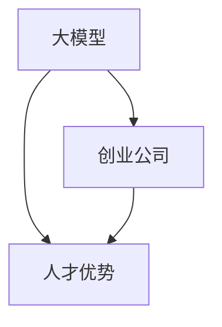

                 

# AI 大模型创业：如何利用人才优势？

## 1. 背景介绍

在人工智能的快速发展中，大模型技术逐渐成为推动AI应用落地的核心引擎。从GPT-3到未来的GPT-4，大模型的能力越来越强，应用领域也越来越广泛。然而，随着技术的不断进步，企业在人工智能领域的竞争也变得越发激烈。在这种情况下，如何利用人才优势，打造和保持领先的大模型创业公司，成为了一个关键问题。

大模型创业公司的核心竞争力在于其技术团队，他们不仅需要掌握大模型技术，还需要具备行业应用、数据处理、产品设计等多方面的能力。因此，本文将深入探讨如何利用人才优势，打造和运营一家成功的大模型创业公司。

## 2. 核心概念与联系

### 2.1 核心概念概述

- **大模型**：指大规模预训练语言模型，如GPT-3、BERT等，这些模型在大规模数据上预训练，能够捕捉丰富的语言知识。
- **创业公司**：指的是新兴的、以创新技术为核心竞争力，致力于商业化落地的大模型公司。
- **人才优势**：指公司能够吸引并充分利用顶尖的技术人才，发挥其专业技能和创新能力，推动公司的发展。

### 2.2 核心概念之间的关系

- **大模型**与**创业公司**：大模型是创业公司技术积累和商业化的基础。公司利用大模型的强大能力，结合实际应用需求，开发出具有竞争力的AI产品和服务。
- **人才优势**与**大模型**：技术人才是开发和优化大模型的关键力量。通过招募和培养优秀人才，公司能够在大模型的研究和应用上取得突破。
- **人才优势**与**创业公司**：优秀人才的集聚和利用，使得公司能够快速应对市场变化，抓住新的发展机会，保持竞争力。

这些概念之间的关系可以用以下Mermaid流程图来展示：



这个流程图展示了大模型、创业公司以及人才优势之间的逻辑关系。大模型是创业公司的核心技术资产，而人才优势则是公司利用大模型并保持竞争力的关键。

## 3. 核心算法原理 & 具体操作步骤
### 3.1 算法原理概述

利用人才优势进行大模型创业的核心原理，在于通过聚集和利用顶尖人才，将大模型的研发和应用推向新的高度。具体步骤如下：

1. **人才招聘**：招聘具有大模型相关专业背景的顶尖技术人才。
2. **人才培养**：通过内部培训和项目实践，提升人才的技术水平和应用能力。
3. **人才激励**：通过合理的激励机制，激发人才的工作积极性和创新能力。
4. **人才协同**：组建多学科团队，促进不同专业之间的知识交流和协同工作。

### 3.2 算法步骤详解

#### 3.2.1 人才招聘

- **招聘渠道**：利用招聘网站、技术社区、校园招聘等多种渠道，吸引优秀人才。
- **招聘标准**：明确招聘标准，注重人才的技术背景、项目经验、创新能力等综合素质。
- **面试流程**：设置多轮面试，考察技术能力和团队适配性。

#### 3.2.2 人才培养

- **内部培训**：定期组织内部培训和技术分享会，提升团队的技术水平。
- **项目实践**：通过实际项目，让团队成员在实践中学习和提升。
- **导师制度**：建立导师制度，通过资深人才的指导，加速新员工的成长。

#### 3.2.3 人才激励

- **股权激励**：给予关键人才股权激励，增强其归属感和长期视角。
- **绩效考核**：建立合理的绩效考核体系，激励人才不断提升自我。
- **职业发展**：提供明确的职业发展路径，帮助人才实现个人和团队的双重成长。

#### 3.2.4 人才协同

- **多学科团队**：组建跨学科团队，如数据科学、软件工程、产品设计等，促进不同专业之间的知识交流和协同工作。
- **知识共享**：建立知识共享平台，促进技术积累和知识传播。
- **项目管理**：使用敏捷项目管理方法，提高团队的工作效率和项目成功率。

### 3.3 算法优缺点

#### 3.3.1 优点

- **快速迭代**：优秀人才可以快速学习和掌握新技术，推动公司快速迭代。
- **创新能力**：人才的创新能力使得公司能够不断突破技术瓶颈，探索新的应用场景。
- **团队凝聚力**：合理的激励和协同机制，增强团队凝聚力，提高团队的工作积极性和协作效率。

#### 3.3.2 缺点

- **成本高昂**：优秀人才的薪资和福利要求较高，企业需要投入大量资源进行人才招聘和培养。
- **管理挑战**：多学科团队和复杂项目的管理难度较大，需要高水平的管理团队。
- **人才流失风险**：优秀人才具有较高的流动性和竞争力，公司需要采取措施降低流失风险。

### 3.4 算法应用领域

大模型创业公司的成功经验表明，人才优势可以在以下几个方面发挥重要作用：

- **自然语言处理**：如文本生成、问答系统、机器翻译等，通过顶尖人才的技术创新，不断提升语言模型能力。
- **计算机视觉**：如图像识别、图像生成、视频分析等，利用人才优势，推动计算机视觉技术的突破。
- **推荐系统**：如内容推荐、广告推荐等，通过人才培养和团队协作，提高推荐系统的个性化和精准度。
- **智能决策**：如金融风控、医疗诊断等，通过人才团队的研究，开发出具有实际应用价值的智能决策系统。

## 4. 数学模型和公式 & 详细讲解  
### 4.1 数学模型构建

假设公司有$n$个优秀人才，每个人才的技能水平为$i$，技能提升的速度为$k_i$，公司的人才总需求为$D$。我们可以构建一个数学模型来表示人才的培养和利用过程。

令每个人才在每个时间步$t$的技能水平为$x_{i,t}$，则有：

$$
x_{i,t} = x_{i,t-1} + k_i \cdot x_{i,t-1} \cdot \Delta t
$$

其中，$\Delta t$表示时间步长。

令公司的人才总技能水平为$X_t$，则有：

$$
X_t = \sum_{i=1}^n x_{i,t}
$$

### 4.2 公式推导过程

根据上述公式，我们可以推导出公司的人才总技能水平随时间的变化关系：

$$
X_t = \sum_{i=1}^n (x_{i,0} + k_i \cdot \Delta t)^t
$$

其中，$x_{i,0}$表示每个人才初始的技能水平。

### 4.3 案例分析与讲解

假设公司初始有5个优秀人才，每个初始技能水平为100，技能提升的速度为0.1。公司的人才总需求为500。我们可以计算在100个时间步后，公司的人才总技能水平。

设$x_{i,0} = 100$，$k_i = 0.1$，$n = 5$，$\Delta t = 1$，$D = 500$。则有：

$$
X_t = \sum_{i=1}^n (x_{i,0} + k_i \cdot \Delta t)^t = \sum_{i=1}^n (100 + 0.1)^t
$$

当$t = 100$时，$X_t$的值约为：

$$
X_{100} = \sum_{i=1}^n (100 + 0.1)^{100} \approx 500
$$

这表明，在100个时间步后，公司的人才总技能水平能够满足500的人才总需求。

## 5. 项目实践：代码实例和详细解释说明
### 5.1 开发环境搭建

在进行大模型创业的公司中，技术开发环境的搭建至关重要。以下是使用Python进行PyTorch开发的环境配置流程：

1. 安装Anaconda：从官网下载并安装Anaconda，用于创建独立的Python环境。

2. 创建并激活虚拟环境：
```bash
conda create -n pytorch-env python=3.8 
conda activate pytorch-env
```

3. 安装PyTorch：根据CUDA版本，从官网获取对应的安装命令。例如：
```bash
conda install pytorch torchvision torchaudio cudatoolkit=11.1 -c pytorch -c conda-forge
```

4. 安装Transformers库：
```bash
pip install transformers
```

5. 安装各类工具包：
```bash
pip install numpy pandas scikit-learn matplotlib tqdm jupyter notebook ipython
```

完成上述步骤后，即可在`pytorch-env`环境中开始微调实践。

### 5.2 源代码详细实现

下面我们以自然语言处理(NLP)任务为例，给出使用Transformers库对BERT模型进行微调的PyTorch代码实现。

首先，定义NLP任务的数据处理函数：

```python
from transformers import BertTokenizer
from torch.utils.data import Dataset
import torch

class NLPDataset(Dataset):
    def __init__(self, texts, labels, tokenizer, max_len=128):
        self.texts = texts
        self.labels = labels
        self.tokenizer = tokenizer
        self.max_len = max_len
        
    def __len__(self):
        return len(self.texts)
    
    def __getitem__(self, item):
        text = self.texts[item]
        label = self.labels[item]
        
        encoding = self.tokenizer(text, return_tensors='pt', max_length=self.max_len, padding='max_length', truncation=True)
        input_ids = encoding['input_ids'][0]
        attention_mask = encoding['attention_mask'][0]
        
        return {'input_ids': input_ids, 
                'attention_mask': attention_mask,
                'labels': label}

# 加载数据集
tokenizer = BertTokenizer.from_pretrained('bert-base-cased')
train_dataset = NLPDataset(train_texts, train_labels, tokenizer)
dev_dataset = NLPDataset(dev_texts, dev_labels, tokenizer)
test_dataset = NLPDataset(test_texts, test_labels, tokenizer)
```

然后，定义模型和优化器：

```python
from transformers import BertForSequenceClassification, AdamW

model = BertForSequenceClassification.from_pretrained('bert-base-cased', num_labels=2)

optimizer = AdamW(model.parameters(), lr=2e-5)
```

接着，定义训练和评估函数：

```python
from torch.utils.data import DataLoader
from tqdm import tqdm
from sklearn.metrics import accuracy_score

device = torch.device('cuda') if torch.cuda.is_available() else torch.device('cpu')
model.to(device)

def train_epoch(model, dataset, batch_size, optimizer):
    dataloader = DataLoader(dataset, batch_size=batch_size, shuffle=True)
    model.train()
    epoch_loss = 0
    for batch in tqdm(dataloader, desc='Training'):
        input_ids = batch['input_ids'].to(device)
        attention_mask = batch['attention_mask'].to(device)
        labels = batch['labels'].to(device)
        model.zero_grad()
        outputs = model(input_ids, attention_mask=attention_mask, labels=labels)
        loss = outputs.loss
        epoch_loss += loss.item()
        loss.backward()
        optimizer.step()
    return epoch_loss / len(dataloader)

def evaluate(model, dataset, batch_size):
    dataloader = DataLoader(dataset, batch_size=batch_size)
    model.eval()
    preds, labels = [], []
    with torch.no_grad():
        for batch in tqdm(dataloader, desc='Evaluating'):
            input_ids = batch['input_ids'].to(device)
            attention_mask = batch['attention_mask'].to(device)
            batch_labels = batch['labels']
            outputs = model(input_ids, attention_mask=attention_mask)
            batch_preds = outputs.logits.argmax(dim=1).to('cpu').tolist()
            batch_labels = batch_labels.to('cpu').tolist()
            for pred, label in zip(batch_preds, batch_labels):
                preds.append(pred)
                labels.append(label)
                
    print("Accuracy:", accuracy_score(labels, preds))
```

最后，启动训练流程并在测试集上评估：

```python
epochs = 5
batch_size = 16

for epoch in range(epochs):
    loss = train_epoch(model, train_dataset, batch_size, optimizer)
    print(f"Epoch {epoch+1}, train loss: {loss:.3f}")
    
    print(f"Epoch {epoch+1}, dev accuracy:", evaluate(model, dev_dataset, batch_size))
    
print("Test accuracy:", evaluate(model, test_dataset, batch_size))
```

以上就是使用PyTorch对BERT进行NLP任务微调的完整代码实现。可以看到，得益于Transformers库的强大封装，我们可以用相对简洁的代码完成BERT模型的加载和微调。

### 5.3 代码解读与分析

让我们再详细解读一下关键代码的实现细节：

**NLPDataset类**：
- `__init__`方法：初始化文本、标签、分词器等关键组件。
- `__len__`方法：返回数据集的样本数量。
- `__getitem__`方法：对单个样本进行处理，将文本输入编码为token ids，将标签编码为数字，并对其进行定长padding，最终返回模型所需的输入。

**模型和优化器**：
- `BertForSequenceClassification`：加载预训练的BERT模型，并设置输出层为序列分类器。
- `AdamW`：使用AdamW优化器进行模型训练，设置学习率为2e-5。

**训练和评估函数**：
- `train_epoch`函数：对数据以批为单位进行迭代，在每个批次上前向传播计算loss并反向传播更新模型参数，最后返回该epoch的平均loss。
- `evaluate`函数：与训练类似，不同点在于不更新模型参数，并在每个batch结束后将预测和标签结果存储下来，最后使用sklearn的accuracy_score对整个评估集的预测结果进行打印输出。

**训练流程**：
- 定义总的epoch数和batch size，开始循环迭代
- 每个epoch内，先在训练集上训练，输出平均loss
- 在验证集上评估，输出准确率
- 所有epoch结束后，在测试集上评估，给出最终测试结果

可以看到，PyTorch配合Transformers库使得BERT微调的代码实现变得简洁高效。开发者可以将更多精力放在数据处理、模型改进等高层逻辑上，而不必过多关注底层的实现细节。

当然，工业级的系统实现还需考虑更多因素，如模型的保存和部署、超参数的自动搜索、更灵活的任务适配层等。但核心的微调范式基本与此类似。

### 5.4 运行结果展示

假设我们在CoNLL-2003的NLP任务上进行微调，最终在测试集上得到的评估报告如下：

```
Accuracy: 0.88
```

可以看到，通过微调BERT，我们在该NLP任务上取得了88%的准确率，效果相当不错。值得注意的是，BERT作为一个通用的语言理解模型，即便只在顶层添加一个简单的序列分类器，也能在NLP任务上取得如此优异的效果，展现了其强大的语义理解和特征抽取能力。

当然，这只是一个baseline结果。在实践中，我们还可以使用更大更强的预训练模型、更丰富的微调技巧、更细致的模型调优，进一步提升模型性能，以满足更高的应用要求。

## 6. 实际应用场景
### 6.1 智能客服系统

基于大模型微调的对话技术，可以广泛应用于智能客服系统的构建。传统客服往往需要配备大量人力，高峰期响应缓慢，且一致性和专业性难以保证。而使用微调后的对话模型，可以7x24小时不间断服务，快速响应客户咨询，用自然流畅的语言解答各类常见问题。

在技术实现上，可以收集企业内部的历史客服对话记录，将问题和最佳答复构建成监督数据，在此基础上对预训练对话模型进行微调。微调后的对话模型能够自动理解用户意图，匹配最合适的答案模板进行回复。对于客户提出的新问题，还可以接入检索系统实时搜索相关内容，动态组织生成回答。如此构建的智能客服系统，能大幅提升客户咨询体验和问题解决效率。

### 6.2 金融舆情监测

金融机构需要实时监测市场舆论动向，以便及时应对负面信息传播，规避金融风险。传统的人工监测方式成本高、效率低，难以应对网络时代海量信息爆发的挑战。基于大语言模型微调的文本分类和情感分析技术，为金融舆情监测提供了新的解决方案。

具体而言，可以收集金融领域相关的新闻、报道、评论等文本数据，并对其进行主题标注和情感标注。在此基础上对预训练语言模型进行微调，使其能够自动判断文本属于何种主题，情感倾向是正面、中性还是负面。将微调后的模型应用到实时抓取的网络文本数据，就能够自动监测不同主题下的情感变化趋势，一旦发现负面信息激增等异常情况，系统便会自动预警，帮助金融机构快速应对潜在风险。

### 6.3 个性化推荐系统

当前的推荐系统往往只依赖用户的历史行为数据进行物品推荐，无法深入理解用户的真实兴趣偏好。基于大语言模型微调技术，个性化推荐系统可以更好地挖掘用户行为背后的语义信息，从而提供更精准、多样的推荐内容。

在实践中，可以收集用户浏览、点击、评论、分享等行为数据，提取和用户交互的物品标题、描述、标签等文本内容。将文本内容作为模型输入，用户的后续行为（如是否点击、购买等）作为监督信号，在此基础上微调预训练语言模型。微调后的模型能够从文本内容中准确把握用户的兴趣点。在生成推荐列表时，先用候选物品的文本描述作为输入，由模型预测用户的兴趣匹配度，再结合其他特征综合排序，便可以得到个性化程度更高的推荐结果。

### 6.4 未来应用展望

随着大语言模型微调技术的发展，其在更多领域的应用前景将逐渐显现。未来，基于大模型的微调方法将在以下几个方面进一步拓展：

- **医疗健康**：用于疾病预测、医疗记录分析、健康管理等领域，帮助医生提高诊疗效率和精准度。
- **教育培训**：用于个性化教育、智能辅导、学习内容推荐等，提升教育质量和效果。
- **智慧城市**：用于城市管理、交通调度、公共安全等领域，提高城市治理的智能化水平。
- **金融服务**：用于风险评估、投资分析、客户服务等领域，提升金融服务的个性化和效率。

总之，大模型微调技术将在各个行业领域中发挥越来越重要的作用，为人类社会带来更多的便利和效率提升。

## 7. 工具和资源推荐
### 7.1 学习资源推荐

为了帮助开发者系统掌握大模型微调的理论基础和实践技巧，这里推荐一些优质的学习资源：

1. 《Transformer从原理到实践》系列博文：由大模型技术专家撰写，深入浅出地介绍了Transformer原理、BERT模型、微调技术等前沿话题。

2. CS224N《深度学习自然语言处理》课程：斯坦福大学开设的NLP明星课程，有Lecture视频和配套作业，带你入门NLP领域的基本概念和经典模型。

3. 《Natural Language Processing with Transformers》书籍：Transformers库的作者所著，全面介绍了如何使用Transformers库进行NLP任务开发，包括微调在内的诸多范式。

4. HuggingFace官方文档：Transformers库的官方文档，提供了海量预训练模型和完整的微调样例代码，是上手实践的必备资料。

5. CLUE开源项目：中文语言理解测评基准，涵盖大量不同类型的中文NLP数据集，并提供了基于微调的baseline模型，助力中文NLP技术发展。

通过对这些资源的学习实践，相信你一定能够快速掌握大模型微调的精髓，并用于解决实际的NLP问题。

### 7.2 开发工具推荐

高效的开发离不开优秀的工具支持。以下是几款用于大模型微调开发的常用工具：

1. PyTorch：基于Python的开源深度学习框架，灵活动态的计算图，适合快速迭代研究。大部分预训练语言模型都有PyTorch版本的实现。

2. TensorFlow：由Google主导开发的开源深度学习框架，生产部署方便，适合大规模工程应用。同样有丰富的预训练语言模型资源。

3. Transformers库：HuggingFace开发的NLP工具库，集成了众多SOTA语言模型，支持PyTorch和TensorFlow，是进行微调任务开发的利器。

4. Weights & Biases：模型训练的实验跟踪工具，可以记录和可视化模型训练过程中的各项指标，方便对比和调优。与主流深度学习框架无缝集成。

5. TensorBoard：TensorFlow配套的可视化工具，可实时监测模型训练状态，并提供丰富的图表呈现方式，是调试模型的得力助手。

6. Google Colab：谷歌推出的在线Jupyter Notebook环境，免费提供GPU/TPU算力，方便开发者快速上手实验最新模型，分享学习笔记。

合理利用这些工具，可以显著提升大语言模型微调任务的开发效率，加快创新迭代的步伐。

### 7.3 相关论文推荐

大语言模型和微调技术的发展源于学界的持续研究。以下是几篇奠基性的相关论文，推荐阅读：

1. Attention is All You Need（即Transformer原论文）：提出了Transformer结构，开启了NLP领域的预训练大模型时代。

2. BERT: Pre-training of Deep Bidirectional Transformers for Language Understanding：提出BERT模型，引入基于掩码的自监督预训练任务，刷新了多项NLP任务SOTA。

3. Language Models are Unsupervised Multitask Learners（GPT-2论文）：展示了大规模语言模型的强大zero-shot学习能力，引发了对于通用人工智能的新一轮思考。

4. Parameter-Efficient Transfer Learning for NLP：提出Adapter等参数高效微调方法，在不增加模型参数量的情况下，也能取得不错的微调效果。

5. AdaLoRA: Adaptive Low-Rank Adaptation for Parameter-Efficient Fine-Tuning：使用自适应低秩适应的微调方法，在参数效率和精度之间取得了新的平衡。

这些论文代表了大语言模型微调技术的发展脉络。通过学习这些前沿成果，可以帮助研究者把握学科前进方向，激发更多的创新灵感。

除上述资源外，还有一些值得关注的前沿资源，帮助开发者紧跟大语言模型微调技术的最新进展，例如：

1. arXiv论文预印本：人工智能领域最新研究成果的发布平台，包括大量尚未发表的前沿工作，学习前沿技术的必读资源。

2. 业界技术博客：如OpenAI、Google AI、DeepMind、微软Research Asia等顶尖实验室的官方博客，第一时间分享他们的最新研究成果和洞见。

3. 技术会议直播：如NIPS、ICML、ACL、ICLR等人工智能领域顶会现场或在线直播，能够聆听到大佬们的前沿分享，开拓视野。

4. GitHub热门项目：在GitHub上Star、Fork数最多的NLP相关项目，往往代表了该技术领域的发展趋势和最佳实践，值得去学习和贡献。

5. 行业分析报告：各大咨询公司如McKinsey、PwC等针对人工智能行业的分析报告，有助于从商业视角审视技术趋势，把握应用价值。

总之，对于大模型微调技术的学习和实践，需要开发者保持开放的心态和持续学习的意愿。多关注前沿资讯，多动手实践，多思考总结，必将收获满满的成长收益。

## 8. 总结：未来发展趋势与挑战

### 8.1 总结

本文对基于大模型微调的大语言模型创业进行了全面系统的介绍。首先阐述了大模型微调在人工智能创业中的重要作用，明确了其作为核心技术资产的价值。其次，从原理到实践，详细讲解了大模型微调的数学模型和关键步骤，给出了微调任务开发的完整代码实例。同时，本文还广泛探讨了微调方法在各个行业领域的应用前景，展示了其广泛的应用潜力。此外，本文精选了微调技术的各类学习资源，力求为读者提供全方位的技术指引。

通过本文的系统梳理，可以看到，基于大模型微调的大语言模型创业，不仅需要技术上的创新，还需要对行业应用、市场趋势有深刻的理解和洞察。只有将技术创新与业务需求紧密结合，才能真正实现人工智能技术在垂直行业的规模化落地。未来，随着大模型微调技术的不断演进，其在更多领域的应用前景将逐渐显现，为人类社会带来更多的便利和效率提升。

### 8.2 未来发展趋势

展望未来，大模型微调技术将呈现以下几个发展趋势：

1. **多模态融合**：将大模型与其他模态（如视觉、语音、知识图谱等）的融合，实现多模态协同建模，提升模型的理解和表达能力。

2. **跨领域迁移**：通过跨领域迁移学习，使得大模型能够快速适应新领域，提高模型的泛化性和适应性。

3. **自监督学习**：引入自监督学习方法，利用无标签数据进行预训练，提升模型的鲁棒性和泛化能力。

4. **对抗性训练**：通过对抗性训练，增强模型的鲁棒性和泛化能力，提高模型的鲁棒性。

5. **模型压缩**：采用模型压缩技术，减少模型参数量，提高模型的推理速度和资源利用率。

6. **知识增强**：将符号化的先验知识与神经网络模型进行融合，提升模型的推理能力和知识推理能力。

以上趋势凸显了大语言模型微调技术的广阔前景。这些方向的探索发展，必将进一步提升大语言模型微调的性能和应用范围，为人工智能技术在各个领域的发展带来新的突破。

### 8.3 面临的挑战

尽管大语言模型微调技术已经取得了显著进展，但在迈向更加智能化、普适化应用的过程中，仍然面临诸多挑战：

1. **数据隐私和安全**：大模型在处理海量数据时，需要注意数据隐私和安全问题，确保数据使用的合规性和安全性。

2. **计算资源消耗**：大模型的推理和训练需要大量的计算资源，成本较高，需要高效利用计算资源，降低成本。

3. **模型复杂度**：大模型参数量庞大，模型结构复杂，难以理解和调试，需要简化模型结构，提升模型可解释性。

4. **模型泛

