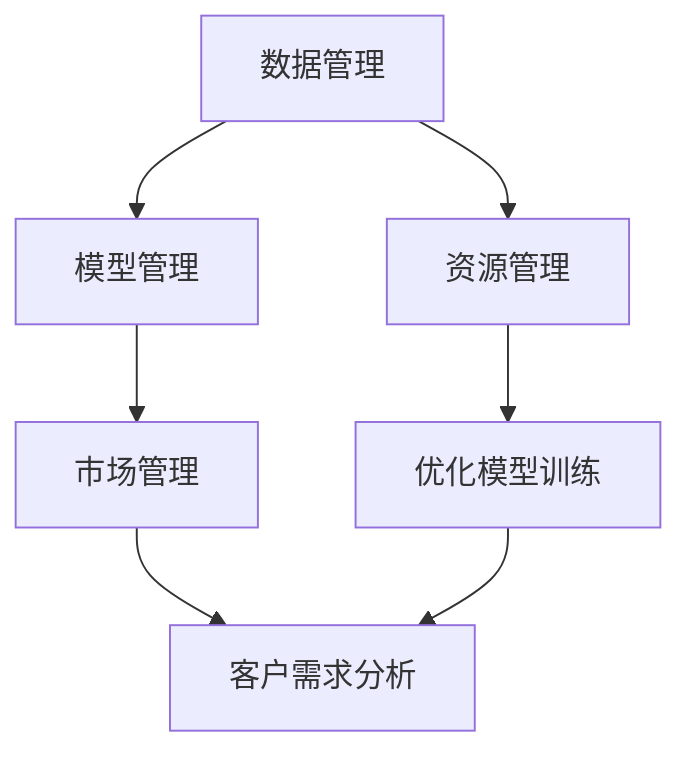
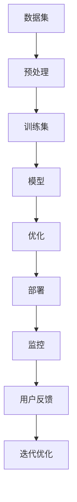

                 

# AI 大模型创业：如何利用管理优势？

在当今这个数字化转型加速的时代，AI 大模型成为了许多创业公司关注的焦点。然而，如何有效地利用和管理这些大模型，使其在实际应用中发挥最大潜力，是一个值得深思的问题。本文将探讨在AI 大模型创业过程中，如何通过管理优势来推动公司的成功。

## 1. 背景介绍

### 1.1 问题由来
随着AI技术的飞速发展，大模型如GPT-3、BERT等成为了热门话题。这些模型在自然语言处理、图像识别、语音识别等任务上展示了令人震撼的表现。然而，大模型的复杂性和高昂的计算成本也带来了许多挑战。如何在有限的资源和成本下，最大化这些模型的价值？如何有效管理这些模型以应对变化多端的市场需求？这成为了AI 大模型创业的关键问题。

### 1.2 问题核心关键点
对于AI 大模型创业公司而言，管理优势的关键在于以下几点：
- **数据管理**：如何有效地获取、处理和存储大规模数据集。
- **模型管理**：如何高效地训练、优化和部署模型。
- **资源管理**：如何在有限的资源下，实现高性能计算和模型推理。
- **市场管理**：如何准确把握市场需求，快速调整产品策略。

### 1.3 问题研究意义
通过管理优势，AI 大模型创业公司不仅能最大化模型的价值，还能在竞争激烈的市场中脱颖而出。优秀的管理能力不仅能提升模型性能，还能降低成本，加速产品迭代。此外，有效的管理还能帮助公司把握市场机遇，快速响应用户需求，实现可持续发展。

## 2. 核心概念与联系

### 2.1 核心概念概述

在探讨如何利用管理优势前，我们先了解几个核心概念：

- **数据管理**：涉及数据的收集、清洗、标注、存储和处理，是大模型训练的基础。
- **模型管理**：包括模型训练、优化、部署和更新，是模型应用的核心。
- **资源管理**：包括计算资源、存储资源和人力资源的规划和分配，是模型高效运行的基础。
- **市场管理**：包括用户需求分析、产品策略制定、渠道拓展和客户关系管理，是市场成功的保障。

这些概念之间相互关联，共同构成了AI 大模型创业公司的核心竞争力。通过有效的数据管理，模型管理，资源管理和市场管理，可以实现模型的最佳应用。

### 2.2 概念间的关系

数据管理、模型管理、资源管理和市场管理之间存在密切的联系，可以通过以下Mermaid流程图来展示：



这个流程图展示了数据管理、模型管理、资源管理和市场管理之间的相互关系：

1. **数据管理**为模型训练提供基础数据。
2. **模型管理**负责训练和优化模型，并部署到应用中。
3. **资源管理**保障了模型训练和部署的效率。
4. **市场管理**指导模型开发和应用策略，以满足市场需求。

这些管理环节相互支撑，共同推动AI 大模型的成功应用。

### 2.3 核心概念的整体架构

最后，我们用一个综合的流程图来展示这些核心概念在大模型创业中的整体架构：



这个综合流程图展示了从数据集预处理到模型部署，再到用户反馈和迭代优化的完整流程。数据管理、模型管理、资源管理和市场管理在每个环节中都发挥着关键作用。

## 3. 核心算法原理 & 具体操作步骤
### 3.1 算法原理概述

AI 大模型管理的关键在于高效的模型训练、优化和部署。其核心思想是通过科学的管理方法，确保模型在有限资源下达到最佳性能。

### 3.2 算法步骤详解

AI 大模型管理涉及以下几个关键步骤：

**Step 1: 数据管理**

1. **数据收集**：通过爬虫、API接口等方式，收集相关领域的原始数据。
2. **数据清洗**：去除噪声和冗余数据，确保数据质量。
3. **数据标注**：根据任务需求，为数据打上标签。
4. **数据存储**：选择合适的存储方式，如Hadoop、S3等，保证数据访问效率。

**Step 2: 模型管理**

1. **模型选择**：选择合适的预训练模型，如BERT、GPT等，根据任务需求进行微调。
2. **模型训练**：在准备好的数据集上进行模型训练，选择合适的超参数和优化算法。
3. **模型优化**：采用正则化、Dropout、学习率衰减等方法，提升模型泛化能力。
4. **模型部署**：将训练好的模型部署到服务器或云平台，提供API接口供外部调用。

**Step 3: 资源管理**

1. **资源规划**：根据模型需求，规划计算资源和存储资源。
2. **资源分配**：合理分配计算资源，确保模型训练和推理的高效性。
3. **性能监控**：实时监控模型推理和训练的性能指标，及时调整资源分配。

**Step 4: 市场管理**

1. **需求分析**：通过调研和分析，把握市场需求。
2. **策略制定**：根据市场需求，制定产品策略和技术路线。
3. **渠道拓展**：选择合适的渠道，如App Store、Google Play等，推广产品。
4. **客户关系**：建立和维护客户关系，提升用户满意度。

### 3.3 算法优缺点

AI 大模型管理的优点包括：

1. **高效性**：通过科学管理，可以最大化模型的价值，提升应用效率。
2. **可扩展性**：模型管理和资源管理可以支撑大规模应用，满足不同场景的需求。
3. **灵活性**：根据市场需求，快速调整产品策略，提升市场竞争力。

其缺点包括：

1. **复杂性**：涉及多个环节，管理难度大。
2. **成本高**：需要大量数据、计算和人力资源。
3. **技术门槛高**：需要深入理解数据管理、模型管理、资源管理和市场管理的技术细节。

### 3.4 算法应用领域

AI 大模型管理在多个领域都有广泛应用：

1. **自然语言处理**：如文本分类、情感分析、机器翻译等任务。
2. **计算机视觉**：如图像识别、目标检测、图像生成等任务。
3. **语音识别**：如语音转文本、语音合成等任务。
4. **推荐系统**：如商品推荐、个性化新闻推荐等任务。
5. **医疗健康**：如医学影像分析、基因组学等任务。

这些领域的大规模应用，展示了AI 大模型管理的巨大潜力。

## 4. 数学模型和公式 & 详细讲解  
### 4.1 数学模型构建

AI 大模型管理的数学模型涉及多个方面，以下是几个关键的数学模型：

- **数据管理**：数据清洗和标注模型的构建。
- **模型管理**：损失函数和优化算法的构建。
- **资源管理**：资源分配和性能监控的数学模型。

### 4.2 公式推导过程

**数据管理**：

假设原始数据集为 $D=\{x_1, x_2, ..., x_n\}$，其中 $x_i$ 表示第 $i$ 个数据样本。数据清洗和标注的数学模型可以表示为：

$$
\text{cleaned}(D) = \{x_i | x_i \text{ 经过清洗和标注}\}
$$

**模型管理**：

假设模型 $M$ 在数据集 $D$ 上的损失函数为 $\mathcal{L}(M, D)$，优化的目标是最小化损失函数：

$$
\hat{\theta} = \arg\min_{\theta} \mathcal{L}(M_{\theta}, D)
$$

其中 $M_{\theta}$ 为模型参数，$\mathcal{L}(M_{\theta}, D)$ 为模型在数据集 $D$ 上的损失函数。

**资源管理**：

假设计算资源为 $R$，存储资源为 $S$，根据模型需求进行资源分配：

$$
R_{分配} = f(M, R)
$$

$$
S_{分配} = g(M, S)
$$

其中 $f$ 和 $g$ 分别表示计算资源和存储资源的分配函数。

### 4.3 案例分析与讲解

以推荐系统为例，分析如何通过数据管理、模型管理和资源管理，实现高效的推荐效果。

**数据管理**：

1. **数据收集**：收集用户行为数据，如浏览、点击、购买等。
2. **数据清洗**：去除噪声和冗余数据，确保数据质量。
3. **数据标注**：对数据打上标签，如用户ID、商品ID等。
4. **数据存储**：选择合适的存储方式，如MySQL、NoSQL等，保证数据访问效率。

**模型管理**：

1. **模型选择**：选择合适的预训练模型，如ALS、协同过滤等，根据任务需求进行微调。
2. **模型训练**：在准备好的数据集上进行模型训练，选择合适的超参数和优化算法。
3. **模型优化**：采用正则化、Dropout、学习率衰减等方法，提升模型泛化能力。
4. **模型部署**：将训练好的模型部署到服务器或云平台，提供API接口供外部调用。

**资源管理**：

1. **资源规划**：根据模型需求，规划计算资源和存储资源。
2. **资源分配**：合理分配计算资源，确保模型训练和推理的高效性。
3. **性能监控**：实时监控模型推理和训练的性能指标，及时调整资源分配。

## 5. 项目实践：代码实例和详细解释说明
### 5.1 开发环境搭建

在进行AI 大模型管理实践前，我们需要准备好开发环境。以下是使用Python进行PyTorch开发的环境配置流程：

1. 安装Anaconda：从官网下载并安装Anaconda，用于创建独立的Python环境。

2. 创建并激活虚拟环境：
```bash
conda create -n pytorch-env python=3.8 
conda activate pytorch-env
```

3. 安装PyTorch：根据CUDA版本，从官网获取对应的安装命令。例如：
```bash
conda install pytorch torchvision torchaudio cudatoolkit=11.1 -c pytorch -c conda-forge
```

4. 安装TensorBoard：
```bash
pip install tensorboard
```

5. 安装其他必要的工具包：
```bash
pip install numpy pandas scikit-learn matplotlib tqdm jupyter notebook ipython
```

完成上述步骤后，即可在`pytorch-env`环境中开始管理实践。

### 5.2 源代码详细实现

下面我们以推荐系统为例，给出使用PyTorch进行模型微调和资源管理的PyTorch代码实现。

```python
import torch
import torch.nn as nn
import torch.optim as optim
from torch.utils.data import DataLoader
from sklearn.model_selection import train_test_split
from torchvision.datasets import MNIST
from torchvision.transforms import ToTensor

class RecommendationModel(nn.Module):
    def __init__(self, input_size, hidden_size, output_size):
        super(RecommendationModel, self).__init__()
        self.fc1 = nn.Linear(input_size, hidden_size)
        self.fc2 = nn.Linear(hidden_size, output_size)
        
    def forward(self, x):
        x = torch.relu(self.fc1(x))
        x = self.fc2(x)
        return x

# 加载数据集
train_data = MNIST(root='data', train=True, download=True, transform=ToTensor())
test_data = MNIST(root='data', train=False, download=True, transform=ToTensor())
train_size, test_size = 60000, 10000
train_data, val_data = train_test_split(train_data, test_size=test_size)
train_loader = DataLoader(train_data, batch_size=64, shuffle=True)
val_loader = DataLoader(val_data, batch_size=64, shuffle=True)

# 定义模型
model = RecommendationModel(input_size=784, hidden_size=128, output_size=10)
criterion = nn.CrossEntropyLoss()
optimizer = optim.Adam(model.parameters(), lr=0.001)

# 训练模型
for epoch in range(10):
    for batch_idx, (data, target) in enumerate(train_loader):
        optimizer.zero_grad()
        output = model(data.view(-1, 784))
        loss = criterion(output, target)
        loss.backward()
        optimizer.step()
        if (batch_idx+1) % 100 == 0:
            print('Train Epoch: {} [{}/{} ({:.0f}%)]\tLoss: {:.6f}'.format(
                epoch+1, batch_idx*len(data), len(train_loader.dataset),
                100. * batch_idx/len(train_loader), loss.item()))

# 评估模型
with torch.no_grad():
    correct = 0
    total = 0
    for data, target in test_loader:
        output = model(data.view(-1, 784))
        _, predicted = torch.max(output.data, 1)
        total += target.size(0)
        correct += (predicted == target).sum().item()

    print('Accuracy of the model on the 10000 test images: {} %'.format(100 * correct / total))

```

以上就是使用PyTorch进行推荐系统模型微调和资源管理的完整代码实现。可以看到，通过科学的数据管理、模型管理和资源管理，可以高效地实现推荐系统的训练和评估。

### 5.3 代码解读与分析

让我们再详细解读一下关键代码的实现细节：

**数据管理**：

1. **数据收集**：通过MNIST数据集加载器，获取训练和测试数据集。
2. **数据清洗**：通过Tensor转换，将数据集转换为张量形式。
3. **数据标注**：将数据集进行划分，分为训练集和验证集。

**模型管理**：

1. **模型选择**：定义了一个简单的多层感知器模型，用于推荐系统。
2. **模型训练**：在训练集上进行模型训练，选择交叉熵损失函数。
3. **模型优化**：使用Adam优化器进行模型优化。

**资源管理**：

1. **资源规划**：根据模型需求，选择了适当的超参数和学习率。
2. **资源分配**：使用PyTorch自带的DataLoader，实现高效的数据批处理。
3. **性能监控**：在训练过程中，实时打印训练损失，监控模型训练效果。

## 6. 实际应用场景
### 6.1 智能推荐系统

AI 大模型管理在智能推荐系统中具有广泛应用。通过数据管理、模型管理和资源管理，可以实时处理用户行为数据，动态调整推荐策略，提升推荐效果。

**数据管理**：

1. **数据收集**：收集用户的浏览、点击、购买等行为数据。
2. **数据清洗**：去除噪声和冗余数据，确保数据质量。
3. **数据标注**：对数据打上标签，如用户ID、商品ID等。
4. **数据存储**：选择合适的存储方式，如MySQL、NoSQL等，保证数据访问效率。

**模型管理**：

1. **模型选择**：选择合适的预训练模型，如ALS、协同过滤等，根据任务需求进行微调。
2. **模型训练**：在准备好的数据集上进行模型训练，选择合适的超参数和优化算法。
3. **模型优化**：采用正则化、Dropout、学习率衰减等方法，提升模型泛化能力。
4. **模型部署**：将训练好的模型部署到服务器或云平台，提供API接口供外部调用。

**资源管理**：

1. **资源规划**：根据模型需求，规划计算资源和存储资源。
2. **资源分配**：合理分配计算资源，确保模型训练和推理的高效性。
3. **性能监控**：实时监控模型推理和训练的性能指标，及时调整资源分配。

### 6.2 医疗影像分析

在医疗影像分析中，AI 大模型管理同样具有重要应用。通过数据管理、模型管理和资源管理，可以实现高效、准确的影像分析和诊断。

**数据管理**：

1. **数据收集**：收集患者的医疗影像数据。
2. **数据清洗**：去除噪声和冗余数据，确保数据质量。
3. **数据标注**：对数据打上标签，如病变区域、器官位置等。
4. **数据存储**：选择合适的存储方式，如Hadoop、S3等，保证数据访问效率。

**模型管理**：

1. **模型选择**：选择合适的预训练模型，如ResNet、VGG等，根据任务需求进行微调。
2. **模型训练**：在准备好的数据集上进行模型训练，选择合适的超参数和优化算法。
3. **模型优化**：采用正则化、Dropout、学习率衰减等方法，提升模型泛化能力。
4. **模型部署**：将训练好的模型部署到服务器或云平台，提供API接口供外部调用。

**资源管理**：

1. **资源规划**：根据模型需求，规划计算资源和存储资源。
2. **资源分配**：合理分配计算资源，确保模型训练和推理的高效性。
3. **性能监控**：实时监控模型推理和训练的性能指标，及时调整资源分配。

## 7. 工具和资源推荐
### 7.1 学习资源推荐

为了帮助开发者系统掌握AI 大模型管理的技术基础和实践技巧，这里推荐一些优质的学习资源：

1. 《深度学习》系列书籍：如Ian Goodfellow、Yoshua Bengio和Aaron Courville合著的《深度学习》，深入浅出地介绍了深度学习的基本原理和经典模型。

2. 《TensorFlow实战Google深度学习框架》：Google官方发布的TensorFlow实战指南，全面介绍了TensorFlow的开发环境和API使用。

3. 《PyTorch实战》：PyTorch官方发布的实战指南，系统介绍了PyTorch的开发环境、模型搭建和训练过程。

4. HuggingFace官方文档：HuggingFace官方文档提供了丰富的预训练语言模型和微调样例代码，是入门微调技术的必备资源。

5. arXiv论文预印本：人工智能领域最新研究成果的发布平台，包括大量尚未发表的前沿工作，学习前沿技术的必读资源。

通过对这些资源的学习实践，相信你一定能够快速掌握AI 大模型管理的技术基础，并用于解决实际的NLP问题。

### 7.2 开发工具推荐

高效的开发离不开优秀的工具支持。以下是几款用于AI 大模型管理开发的常用工具：

1. PyTorch：基于Python的开源深度学习框架，灵活动态的计算图，适合快速迭代研究。大部分预训练语言模型都有PyTorch版本的实现。

2. TensorFlow：由Google主导开发的开源深度学习框架，生产部署方便，适合大规模工程应用。同样有丰富的预训练语言模型资源。

3. HuggingFace官方文档：提供了丰富的预训练语言模型和微调样例代码，是进行微调任务开发的利器。

4. Weights & Biases：模型训练的实验跟踪工具，可以记录和可视化模型训练过程中的各项指标，方便对比和调优。

5. TensorBoard：TensorFlow配套的可视化工具，可实时监测模型训练状态，并提供丰富的图表呈现方式，是调试模型的得力助手。

6. Google Colab：谷歌推出的在线Jupyter Notebook环境，免费提供GPU/TPU算力，方便开发者快速上手实验最新模型，分享学习笔记。

合理利用这些工具，可以显著提升AI 大模型管理任务的开发效率，加快创新迭代的步伐。

### 7.3 相关论文推荐

AI 大模型管理的发展源于学界的持续研究。以下是几篇奠基性的相关论文，推荐阅读：

1. Attention is All You Need：提出了Transformer结构，开启了NLP领域的预训练大模型时代。

2. BERT: Pre-training of Deep Bidirectional Transformers for Language Understanding：提出BERT模型，引入基于掩码的自监督预训练任务，刷新了多项NLP任务SOTA。

3. Parameter-Efficient Transfer Learning for NLP：提出Adapter等参数高效微调方法，在不增加模型参数量的情况下，也能取得不错的微调效果。

4. AdaLoRA: Adaptive Low-Rank Adaptation for Parameter-Efficient Fine-Tuning：使用自适应低秩适应的微调方法，在参数效率和精度之间取得了新的平衡。

这些论文代表了大语言模型管理的发展脉络。通过学习这些前沿成果，可以帮助研究者把握学科前进方向，激发更多的创新灵感。

除上述资源外，还有一些值得关注的前沿资源，帮助开发者紧跟AI 大模型管理技术的最新进展，例如：

1. arXiv论文预印本：人工智能领域最新研究成果的发布平台，包括大量尚未发表的前沿工作，学习前沿技术的必读资源。

2. 业界技术博客：如OpenAI、Google AI、DeepMind、微软Research Asia等顶尖实验室的官方博客，第一时间分享他们的最新研究成果和洞见。

3. 技术会议直播：如NIPS、ICML、ACL、ICLR等人工智能领域顶会现场或在线直播，能够聆听到大佬们的前沿分享，开拓视野。

4. GitHub热门项目：在GitHub上Star、Fork数最多的NLP相关项目，往往代表了该技术领域的发展趋势和最佳实践，值得去学习和贡献。

5. 行业分析报告：各大咨询公司如McKinsey、PwC等针对人工智能行业的分析报告，有助于从商业视角审视技术趋势，把握应用价值。

总之，对于AI 大模型管理的学习和实践，需要开发者保持开放的心态和持续学习的意愿。多关注前沿资讯，多动手实践，多思考总结，必将收获满满的成长收益。

## 8. 总结：未来发展趋势与挑战

### 8.1 总结

本文对AI 大模型管理的核心概念和操作步骤进行了全面系统的介绍。首先阐述了AI 大模型管理的研究背景和意义，明确了数据管理、模型管理、资源管理和市场管理在大模型应用中的关键作用。其次，从原理到实践，详细讲解了数据管理、模型管理、资源管理和市场管理的数学模型和关键步骤，给出了微调任务开发的完整代码实例。同时，本文还广泛探讨了AI 大模型管理在多个行业领域的应用前景，展示了其巨大潜力。此外，本文精选了管理技术的各类学习资源，力求为读者提供全方位的技术指引。

通过本文的系统梳理，可以看到，AI 大模型管理在大模型应用中发挥着至关重要的作用。科学的管理策略不仅能提升模型性能，还能降低成本，加速产品迭代。未来，伴随预训练语言模型和微调方法的持续演进，AI 大模型管理技术必将在更多领域得到应用，为AI 大模型的成功落地和可持续发展提供有力支撑。

### 8.2 未来发展趋势

展望未来，AI 大模型管理技术将呈现以下几个发展趋势：

1. **自动化和智能化**：随着自动化技术的发展，AI 大模型管理将逐步实现自动化和智能化，降低人工干预，提升效率。

2. **多模态融合**：AI 大模型管理将突破单一模态的限制，融合图像、视频、音频等多模态数据，实现跨模态的智能推理。

3. **边缘计算**：随着物联网设备的普及，AI 大模型管理将逐步向边缘计算方向发展，提升推理速度和实时性。

4. **联邦学习**：AI 大模型管理将引入联邦学习技术，实现分布式计算和隐私保护，提升模型的可信度和安全性。

5. **模型压缩和优化**：AI 大模型管理将注重模型的压缩和优化，提升模型的计算效率和存储效率。

以上趋势凸显了AI 大模型管理的广阔前景。这些方向的探索发展，必将进一步提升AI 大模型管理的效率和应用范围，为AI 大模型的成功落地和可持续发展提供有力保障。

### 8.3 面临的挑战

尽管AI 大模型管理技术已经取得了不少成就，但在迈向更加智能化、普适化应用的过程中，仍面临诸多挑战：

1. **数据质量问题**：数据收集、清洗和标注需要耗费大量时间和资源，数据质量也难以保证。如何提升数据质量，降低数据管理成本，仍需进一步探索。

2. **模型复杂性**：AI 大模型管理涉及多个环节，模型复杂度较高，管理难度大。如何简化模型结构，降低管理复杂性，仍需更多创新。

3. **资源分配**：如何根据模型需求，合理分配计算资源和存储资源，仍需深入研究。

4. **安全性问题**：AI 大模型管理中涉及大量敏感数据，如何确保数据安全和模型安全，仍需更多探索。

5. **可解释性问题**：AI 大模型管理的复杂性增加了模型输出的可解释性难度，如何增强模型的可解释性，仍需更多研究和实践。

6. **伦理道德问题**：AI 大模型管理涉及伦理道德的考量，如何在模型开发和应用中遵循伦理道德规范，仍需更多探索。

正视这些挑战，积极应对并寻求突破，将是大模型管理走向成熟的必由之路。相信随着学界和产业界的共同努力，这些挑战终将一一被克服，AI 大模型管理必将在构建智能系统的人机协同中扮演越来越重要的角色。

### 8.4 研究展望

面对AI 大模型管理所面临的种种挑战，未来的研究需要在以下几个方面寻求新的突破：

1. **自动化和智能化**：开发更加自动化和智能化的管理工具，降低人工干预，提升效率。

2. **多模态融合**：融合图像、视频、音频等多模态数据，实现跨模态的智能推理。

3. **边缘计算**：引入边缘计算技术，

