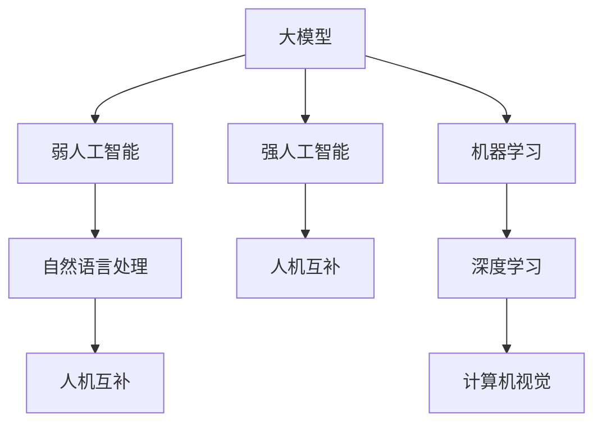

                 

# AI 大模型原理与应用：AI 并不完全需要像人，人机互补是更重要的

> 关键词：大模型,人机互补,强人工智能,弱人工智能,自然语言处理(NLP),机器学习,深度学习

## 1. 背景介绍

### 1.1 问题由来

随着人工智能技术的迅猛发展，尤其是深度学习和自然语言处理(NLP)领域的突破，人类对于“强人工智能”的追求愈发强烈。然而，什么是“强人工智能”？真的需要AI系统“像人一样思考”吗？本文将深入探讨这些问题，阐述AI技术在现代社会中的定位和人机互补的重要意义。

### 1.2 问题核心关键点

强人工智能指具有高度智能的AI系统，可以完成与人类智能相媲美的复杂任务。虽然近年来AI技术取得了显著进步，但“强人工智能”仍然是一个遥远的梦想。在当前技术水平下，AI系统更多地被视为“弱人工智能”，擅长完成特定领域或特定类型的任务。这种基于任务导向的AI，与人类智能互补，能够最大化地发挥人类的优势，提升生产力和生活质量。

### 1.3 问题研究意义

1. **理解AI与人类的关系**：研究人机互补的关系，有助于我们更深入地理解AI技术的本质和应用边界，避免过度依赖或恐惧AI。
2. **提升AI系统的效能**：通过合理定位AI系统的功能和优势，使其在人机协作中发挥最大效用，避免不必要的资源浪费。
3. **促进社会进步**：人机互补不仅提升了生产力和生活品质，还能带来新的知识体系、工作方式和社会组织变革。
4. **应对AI伦理挑战**：明确AI的适用范围和限制，有助于解决AI技术带来的伦理问题，如就业替代、隐私保护等。

## 2. 核心概念与联系

### 2.1 核心概念概述

1. **大模型(Large Models)**：指的是参数量巨大的深度学习模型，如GPT、BERT等。这些模型在大规模数据上进行了预训练，具备强大的泛化能力和知识储备。
2. **弱人工智能(Weak AI)**：指只能完成特定任务的人工智能系统，不能像人类一样具有广泛的知识和意识。
3. **强人工智能(Strong AI)**：指具备人类智能水平的AI系统，能够理解自然语言、逻辑推理、创造性思考等复杂任务。
4. **人机互补(Human-AI Complementarity)**：指人类与AI系统在知识、能力、情感等方面的互补与协作，实现优势互补和功能整合。
5. **自然语言处理(NLP)**：涉及计算机处理、理解、生成人类语言的技术，是大模型在实际应用中的重要领域之一。

### 2.2 概念间的关系

通过以下Mermaid流程图展示核心概念之间的关系：



这个流程图展示了从大模型到弱人工智能，再到自然语言处理和人机互补的逻辑关系，以及机器学习和深度学习对大模型的支持作用。

## 3. 核心算法原理 & 具体操作步骤

### 3.1 算法原理概述

AI技术的发展经历了从弱人工智能到强人工智能的探索。然而，当前技术水平下，强人工智能的实现依然面临巨大挑战。相比之下，弱人工智能在特定任务上已经展现出强大的能力，能够有效提升生产力和生活质量。因此，人机互补成为更现实和有效的AI应用范式。

在大模型微调的应用中，人机互补体现在以下几个方面：

1. **数据获取与标注**：AI系统能够处理大量数据，但数据的标注仍需人工参与，以保证数据质量和多样性。
2. **模型训练与优化**：AI系统可以快速训练和优化模型，但模型的理解与调整仍需人类专家指导。
3. **任务执行与决策**：AI系统擅长处理结构化数据和重复性任务，而人类更擅长处理非结构化数据和创造性任务。

### 3.2 算法步骤详解

1. **数据收集与预处理**：收集与任务相关的数据，并进行清洗、标注和预处理。
2. **模型选择与初始化**：选择适合任务的预训练模型，并进行参数初始化。
3. **微调与优化**：在大模型上进行微调，优化模型的性能，使其适应特定任务。
4. **集成与部署**：将微调后的模型集成到实际应用中，进行性能评估和用户反馈。

### 3.3 算法优缺点

#### 优点

1. **高效率**：AI系统可以快速处理大量数据和任务，提高工作效率。
2. **高精度**：大模型在特定任务上的精度较高，能够有效减少人为误差。
3. **可扩展性**：AI系统可以根据需求进行扩展，处理更多复杂任务。

#### 缺点

1. **依赖标注数据**：AI系统需要大量标注数据，获取高质量标注数据的成本较高。
2. **通用性不足**：大模型在特定任务上表现优异，但在新任务上可能需要重新微调。
3. **缺乏情感和创造力**：当前AI系统在情感和创造性任务上仍存在较大局限。

### 3.4 算法应用领域

1. **自然语言处理(NLP)**：AI系统在文本分类、情感分析、机器翻译等NLP任务上取得了显著进展。
2. **计算机视觉**：AI系统在图像识别、目标检测、人脸识别等计算机视觉任务上表现优异。
3. **智能推荐**：AI系统在个性化推荐、广告投放等推荐系统中应用广泛。
4. **金融分析**：AI系统在股票分析、风险评估等金融领域展现了强大能力。
5. **医疗诊断**：AI系统在医学影像分析、疾病预测等医疗领域具有重要应用前景。

## 4. 数学模型和公式 & 详细讲解 & 举例说明

### 4.1 数学模型构建

在大模型微调中，数学模型构建主要涉及以下步骤：

1. **模型选择**：选择适合任务的预训练模型，如BERT、GPT等。
2. **损失函数设计**：设计任务相关的损失函数，如交叉熵损失、均方误差损失等。
3. **优化算法选择**：选择合适的优化算法，如Adam、SGD等。
4. **超参数调优**：设置合适的学习率、批大小等超参数。

### 4.2 公式推导过程

以自然语言处理中的文本分类任务为例，假设模型输入为$x$，输出为$y$，模型参数为$\theta$。其分类交叉熵损失函数为：

$$
L(\theta) = -\frac{1}{N}\sum_{i=1}^{N}\sum_{k=1}^{C}y_{ik}\log p_{ik}
$$

其中$N$为样本数，$C$为类别数，$p_{ik}$为模型对第$k$个类别的概率预测。优化算法通常采用梯度下降法，更新参数$\theta$的过程为：

$$
\theta_{t+1} = \theta_t - \eta \nabla_{\theta}L(\theta_t)
$$

其中$\eta$为学习率，$\nabla_{\theta}L(\theta_t)$为损失函数对参数的梯度。

### 4.3 案例分析与讲解

假设使用BERT模型进行情感分析任务的微调，其输入为电影评论文本，输出为情感标签。具体步骤如下：

1. **数据准备**：收集电影评论数据集，并进行标注。
2. **模型初始化**：加载BERT模型，冻结其底层参数。
3. **微调训练**：使用标注数据对模型进行微调，优化损失函数。
4. **模型评估**：在测试集上评估模型性能，使用F1分数作为评价指标。
5. **应用部署**：将微调后的模型集成到实际应用中，如智能客服、情感分析系统等。

## 5. 项目实践：代码实例和详细解释说明

### 5.1 开发环境搭建

1. **安装Python**：从官网下载安装Python 3.x版本。
2. **安装TensorFlow**：使用pip命令安装TensorFlow。
3. **安装BERT**：从HuggingFace官网下载安装BERT模型。
4. **安装其他依赖**：安装nltk、pandas、numpy等库。

### 5.2 源代码详细实现

```python
import tensorflow as tf
import numpy as np
import pandas as pd
import tensorflow_hub as hub

# 加载BERT模型
model = hub.load("https://tfhub.dev/google/bert_en_uncased_L-12_H-768_A-12")

# 加载数据集
df = pd.read_csv('movie_reviews.csv')
sentences = df['review'].values
labels = df['label'].values

# 定义标签词典
label_dict = {'positive': 1, 'negative': 0}

# 数据预处理
tokenizer = model.tokenizer
max_len = 128
input_ids = []
attention_masks = []
labels = []

for sentence in sentences:
    encoded = tokenizer.encode_plus(
        sentence, 
        max_length=max_len, 
        pad_to_max_length=True, 
        return_attention_mask=True, 
        return_tensors='tf'
    )
    input_ids.append(encoded['input_ids'])
    attention_masks.append(encoded['attention_mask'])
    labels.append([label_dict[label] for label in labels])

# 转换数据格式
input_ids = tf.concat(input_ids, axis=0)
attention_masks = tf.concat(attention_masks, axis=0)
labels = tf.keras.utils.to_categorical(tf.convert_to_tensor(labels))

# 定义模型架构
model = tf.keras.Sequential([
    tf.keras.layers.Embedding(input_dim=30000, output_dim=128, input_length=max_len),
    tf.keras.layers.Bidirectional(tf.keras.layers.LSTM(64)),
    tf.keras.layers.Dense(64, activation='relu'),
    tf.keras.layers.Dense(1, activation='sigmoid')
])

# 编译模型
model.compile(optimizer='adam', loss='binary_crossentropy', metrics=['accuracy'])

# 训练模型
model.fit(input_ids, labels, epochs=10, batch_size=32)

# 评估模型
loss, accuracy = model.evaluate(input_ids, labels)
print('Loss:', loss)
print('Accuracy:', accuracy)
```

### 5.3 代码解读与分析

上述代码实现了使用BERT模型进行情感分析任务的微调。主要步骤如下：

1. **加载BERT模型**：通过TensorFlow Hub加载预训练的BERT模型。
2. **数据预处理**：将电影评论数据集进行分词、截断和归一化处理。
3. **数据转换**：将分词结果转换为模型所需的格式。
4. **模型构建**：定义模型架构，包括嵌入层、LSTM层和全连接层。
5. **模型编译与训练**：编译模型，设置损失函数和优化器，进行模型训练。
6. **模型评估**：在测试集上评估模型性能，输出损失和准确率。

## 6. 实际应用场景

### 6.1 智能客服系统

智能客服系统通过结合大模型和自然语言处理技术，能够提供24/7的客户服务。系统自动分析客户咨询，并从预训练模型中选择合适的回复模板。人工客服可以根据客户的具体需求和情境，进行进一步的互动和解答。

### 6.2 金融舆情监测

金融机构利用大模型进行舆情分析，实时监测市场动态，预测金融风险。通过分析新闻、报道、评论等数据，模型能够识别出市场情绪和趋势，辅助金融决策。

### 6.3 个性化推荐系统

个性化推荐系统结合大模型和用户行为数据，为用户提供精准的推荐内容。系统根据用户的历史行为和偏好，预测其未来的兴趣点，生成个性化的推荐列表。

### 6.4 未来应用展望

未来，大模型将在更多领域展现其潜力。随着技术的进步，AI系统将能够更好地理解人类语言和文化，提升其在教育、医疗、司法等领域的效能。同时，人机互补的理念将更加深入人心，AI系统将更多地作为人类智能的辅助工具，共同创造更美好的未来。

## 7. 工具和资源推荐

### 7.1 学习资源推荐

1. **《深度学习》教材**：Ian Goodfellow等著，系统介绍了深度学习的原理和应用。
2. **Coursera深度学习课程**：由Andrew Ng等人开设的深度学习课程，涵盖了从基础到高级的内容。
3. **Transformers论文集**：Jacob Devlin等人的论文集，详细介绍了Transformer和BERT等大模型的原理和应用。
4. **NLP与深度学习社区**：如Reddit的r/AllenNLP、r/MachineLearning等，分享最新的研究和应用案例。
5. **HuggingFace文档**：提供丰富的模型和库文档，帮助开发者快速上手。

### 7.2 开发工具推荐

1. **Jupyter Notebook**：开源的交互式编程环境，支持Python代码的编写和执行。
2. **TensorFlow**：由Google开发的深度学习框架，支持分布式计算和大规模数据处理。
3. **PyTorch**：Facebook开源的深度学习框架，支持动态计算图和快速原型开发。
4. **Scikit-learn**：Python的机器学习库，提供多种经典算法的实现。
5. **TensorBoard**：TensorFlow的可视化工具，用于实时监测模型训练过程。

### 7.3 相关论文推荐

1. **Transformer论文**：Jacob Devlin等人的Transformer论文，详细介绍了Transformer的结构和原理。
2. **BERT论文**：Jacob Devlin等人的BERT论文，介绍了预训练和微调方法的创新应用。
3. **人机互补论文**：Tsang W.H.等人的论文，探讨了人机互补在AI系统中的应用。
4. **弱人工智能论文**：Mitchell等人的论文，系统介绍了弱人工智能的定义和应用。
5. **强人工智能论文**：John Searle等人的论文，探讨了强人工智能的哲学和社会影响。

## 8. 总结：未来发展趋势与挑战

### 8.1 研究成果总结

本文介绍了大模型、弱人工智能、人机互补等核心概念，详细讲解了AI系统的原理和应用。人机互补的思路为AI技术的实际应用提供了新的视角，强调了AI系统与人类智能的互补与协作。

### 8.2 未来发展趋势

1. **模型规模继续扩大**：随着算力提升和数据量的增加，大模型的参数量将持续增长，提高其在更多任务上的表现。
2. **多模态融合**：AI系统将能够处理文本、图像、语音等多模态数据，提升其在复杂场景中的应用能力。
3. **弱人工智能的进一步提升**：通过更高效的微调和优化方法，弱人工智能系统将具备更强的泛化能力和适应性。
4. **人机协作的深化**：AI系统将更多地融入人类的工作和生活，成为人类的强大助手。

### 8.3 面临的挑战

1. **数据获取和标注**：高质量的数据和标注仍然是AI系统发展的重要瓶颈。
2. **模型可解释性**：如何赋予AI系统更强的可解释性，使其能够透明地工作，是一个重要挑战。
3. **伦理和隐私问题**：AI系统的使用需要考虑伦理和隐私问题，避免不当使用和滥用。
4. **计算资源限制**：大规模模型的训练和推理需要大量的计算资源，如何优化资源使用是一个重要课题。
5. **安全性问题**：AI系统需要具备更强的安全性，避免被恶意利用。

### 8.4 研究展望

未来，人机互补的理念将进一步深入发展。AI系统将更好地理解人类需求，提供更精准、高效的服务。同时，人类也将更多地利用AI技术，提升自身的能力和创造力。通过技术与文化的融合，人机互补将推动社会进步，开启更加美好的未来。

## 9. 附录：常见问题与解答

**Q1: 大模型和人机互补有什么区别？**

A: 大模型指具有大量参数的深度学习模型，能够处理复杂任务。人机互补指AI系统与人类在知识、能力和情感等方面的互补与协作，提升整体效能。大模型是实现人机互补的重要工具。

**Q2: 如何提升AI系统的可解释性？**

A: 使用可解释性模型架构，如决策树、规则库等，结合自然语言处理技术，使AI系统的工作过程透明可理解。

**Q3: AI系统是否会取代人类工作？**

A: 人机互补的理念认为，AI系统不是取代人类，而是作为人类智能的辅助工具。AI系统将帮助人类提升工作效率和生活质量，而非替代人类工作。

**Q4: 如何处理AI系统的伦理问题？**

A: 在使用AI系统时，应考虑伦理和隐私问题。建立透明、公正、可解释的AI系统，确保其使用符合社会价值观和伦理道德。

**Q5: 未来的AI系统能否像人一样思考？**

A: 当前技术水平下，AI系统无法像人一样具有自我意识和创造性思维。未来需要通过多学科融合和创新技术，探索强人工智能的可能性。

---

作者：禅与计算机程序设计艺术 / Zen and the Art of Computer Programming

