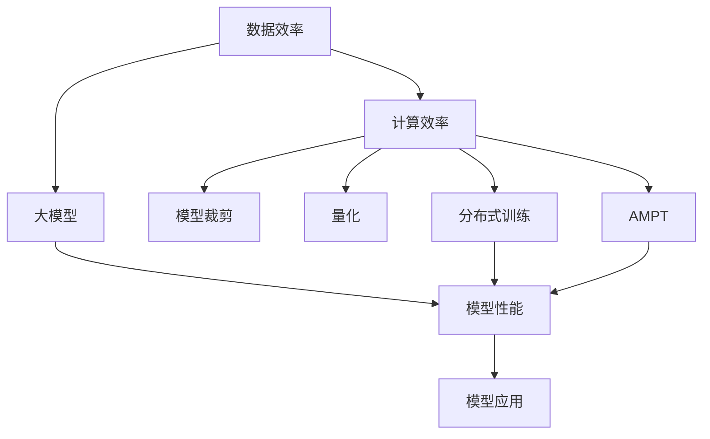
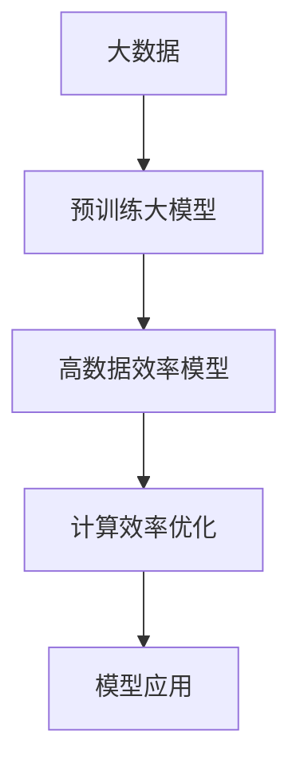
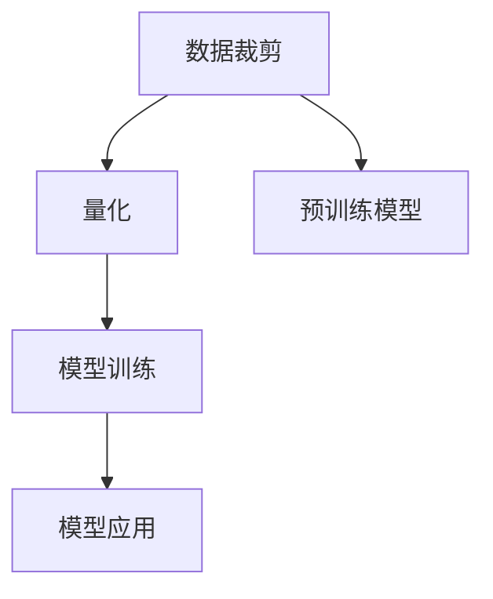
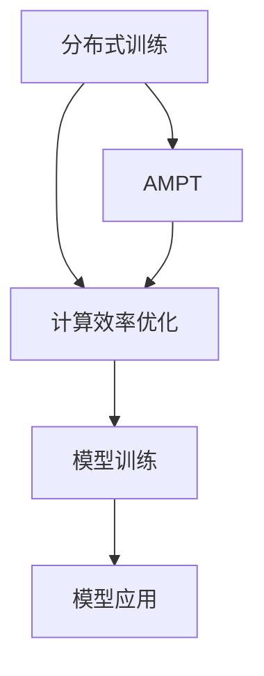
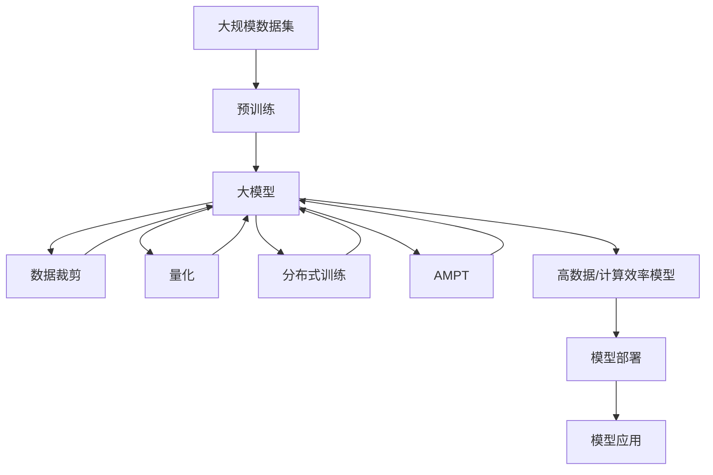

                 

# AI 大模型原理与应用：data 和 compute 效率问题解决方案和挑战

> 关键词：大模型,数据效率,计算效率,模型裁剪,量化,分布式训练,硬件加速,自动混合精度

## 1. 背景介绍

随着深度学习技术和大模型架构的迅速发展，AI大模型在各种任务中表现出色，但同时带来了数据和计算效率问题，成为影响模型性能和应用落地的关键瓶颈。大模型的参数量和计算资源需求巨大，导致其训练和部署效率低下，对实时应用和边缘设备带来巨大挑战。本节将介绍数据和计算效率问题的主要表现，以及当前流行的解决方案和挑战。

## 2. 核心概念与联系

### 2.1 核心概念概述

为更好地理解数据和计算效率问题及其解决方案，本节将介绍几个密切相关的核心概念：

- 大模型: 以自回归(如GPT)或自编码(如BERT)模型为代表的大规模预训练语言模型。通过在大规模无标签文本语料上进行预训练，学习通用的语言表示，具备强大的语言理解和生成能力。

- 数据效率: 指模型利用训练数据进行有效学习的能力。数据效率高的模型能够更快速地收敛，泛化性能更好。

- 计算效率: 指模型在计算资源（如GPU、TPU等）上的高效使用，特别是在硬件加速和高并行计算上的优化。

- 模型裁剪: 指在保持模型核心性能的同时，去除冗余参数和层，减小模型尺寸，提升推理速度和资源利用率。

- 量化: 将浮点数模型转化为定点数模型，减少存储空间和计算开销，提升推理速度。

- 分布式训练: 使用多台计算机并行计算模型参数的更新，加速训练过程，提高计算效率。

- 自动混合精度训练(AutoMixed Precision Training, AMPT): 自动切换浮点型和定点型计算，平衡模型精度和计算效率，加速训练过程。

这些核心概念之间的逻辑关系可以通过以下Mermaid流程图来展示：



这个流程图展示了大模型和数据/计算效率的主要概念及其之间的关系：

1. 大模型通过预训练学习语言表示。
2. 数据效率高的模型能够快速收敛，泛化性能更好。
3. 计算效率高的模型能够更快训练，推理速度更快。
4. 模型裁剪、量化、分布式训练、AMPT等优化技术，提高模型数据和计算效率。
5. 高数据/计算效率的模型能够更好地应用于实际任务，提升模型性能和应用效果。

### 2.2 概念间的关系

这些核心概念之间存在着紧密的联系，形成了数据和计算效率优化的完整生态系统。下面我通过几个Mermaid流程图来展示这些概念之间的关系。

#### 2.2.1 数据与计算效率的优化过程



这个流程图展示了从数据到模型训练和部署的全过程：

1. 收集大规模数据，构建预训练模型。
2. 通过数据裁剪和增强，提高模型的数据效率。
3. 采用分布式训练和自动混合精度训练等技术，优化计算效率。
4. 应用优化后的模型，进行推理或部署。

#### 2.2.2 数据裁剪与量化在模型训练中的应用



这个流程图展示了数据裁剪和量化在模型训练中的应用：

1. 使用数据裁剪技术，筛选出重要特征。
2. 将模型转换为定点数表示，降低计算资源需求。
3. 在保持精度的前提下，提升训练速度。
4. 训练后的模型用于推理和部署。

#### 2.2.3 分布式训练和AMPT的优化关系



这个流程图展示了分布式训练和AMPT的优化关系：

1. 使用多台计算机并行计算，加速模型训练。
2. 自动混合精度训练，提升模型计算效率。
3. 分布式训练和AMPT联合使用，显著提升计算效率。
4. 优化后的模型用于推理和部署。

### 2.3 核心概念的整体架构

最后，我们用一个综合的流程图来展示这些核心概念在大模型数据和计算效率优化过程中的整体架构：



这个综合流程图展示了从数据预处理到模型训练和部署的全过程：

1. 使用大规模数据集进行预训练，获得大模型。
2. 通过数据裁剪、量化等技术，优化模型数据效率。
3. 采用分布式训练和自动混合精度训练，提升模型计算效率。
4. 应用优化后的模型进行推理或部署。

通过这些流程图，我们可以更清晰地理解数据和计算效率优化过程中各个核心概念的关系和作用，为后续深入讨论具体的优化方法和技术奠定基础。

## 3. 核心算法原理 & 具体操作步骤
### 3.1 算法原理概述

数据和计算效率的优化是大模型应用过程中必须考虑的关键因素。其核心思想是通过一系列的算法和策略，最大化模型的数据效率和计算效率，从而提升模型的性能和应用效果。

具体而言，数据效率优化的目标是减少模型对训练数据的依赖，提高模型泛化能力；而计算效率优化的目标是减少模型在硬件资源上的消耗，提升训练和推理速度。

### 3.2 算法步骤详解

数据和计算效率的优化一般包括以下几个关键步骤：

**Step 1: 数据预处理和增强**

- 数据裁剪：从原始数据中筛选出对模型性能有较大影响的关键特征，去除冗余数据。
- 数据增强：通过数据扩充、数据合成等手段，提高模型的数据效率和泛化能力。

**Step 2: 模型裁剪**

- 模型结构优化：通过调整网络结构，如减少层数、减少神经元数等，降低模型复杂度。
- 参数裁剪：根据模型重要性，裁剪不重要的参数，去除冗余权重。

**Step 3: 量化**

- 模型量化：将浮点型模型转化为定点型模型，减少存储空间和计算开销。
- 动态量化：在训练过程中动态调整量化参数，平衡模型精度和计算效率。

**Step 4: 分布式训练**

- 并行计算：使用多台计算机并行计算，加速模型训练。
- 数据并行：将数据分成多个子集，分别在多台计算机上训练。
- 模型并行：将模型参数分布在不同计算节点上，并行更新。

**Step 5: 自动混合精度训练**

- 混合精度训练：在训练过程中自动切换浮点数和定点数计算，提升计算效率。
- 自动混合精度调整：动态调整混合精度策略，平衡精度和速度。

**Step 6: 模型部署**

- 模型压缩：通过模型裁剪和量化，减小模型尺寸，提升推理速度。
- 推理优化：采用硬件加速、算法优化等手段，提升推理效率。

### 3.3 算法优缺点

数据和计算效率优化方法具有以下优点：

- 减少模型对数据的依赖，提高泛化性能。
- 降低模型计算资源需求，提升训练和推理速度。
- 提高模型部署效率，加快模型应用落地。

同时，这些方法也存在一些缺点：

- 数据裁剪可能导致信息丢失，影响模型性能。
- 量化可能降低模型精度，需要仔细调整。
- 分布式训练和自动混合精度训练需要额外的硬件和软件支持。
- 模型裁剪和量化可能会影响模型泛化能力。

尽管存在这些局限性，但就目前而言，数据和计算效率优化方法仍是大模型应用中不可或缺的一部分。未来相关研究的重点在于如何进一步优化这些方法，以实现更加高效、可靠、可扩展的模型优化。

### 3.4 算法应用领域

数据和计算效率优化方法在大模型应用中得到了广泛的应用，覆盖了几乎所有常见任务，例如：

- 文本分类：如情感分析、主题分类、意图识别等。通过数据裁剪和增强，提升模型泛化能力。
- 命名实体识别：识别文本中的人名、地名、机构名等特定实体。使用模型裁剪和量化，提高推理速度。
- 关系抽取：从文本中抽取实体之间的语义关系。使用分布式训练和自动混合精度训练，加速训练过程。
- 问答系统：对自然语言问题给出答案。通过模型裁剪和推理优化，提高系统响应速度。
- 机器翻译：将源语言文本翻译成目标语言。使用量化和推理优化，提升翻译速度。
- 文本摘要：将长文本压缩成简短摘要。使用数据增强和模型裁剪，提升摘要质量。
- 对话系统：使机器能够与人自然对话。使用分布式训练和自动混合精度训练，提升对话质量。

除了上述这些经典任务外，大模型数据和计算效率优化方法也被创新性地应用到更多场景中，如可控文本生成、常识推理、代码生成、数据增强等，为NLP技术带来了全新的突破。随着预训练模型和优化方法的不断进步，相信NLP技术将在更广阔的应用领域大放异彩。

## 4. 数学模型和公式 & 详细讲解 & 举例说明

### 4.1 数学模型构建

本节将使用数学语言对数据和计算效率优化的数学模型进行更加严格的刻画。

记原始数据集为 $D=\{(x_i,y_i)\}_{i=1}^N$，其中 $x_i$ 为输入特征，$y_i$ 为标签。设预训练模型为 $M_{\theta}(x_i)$，其中 $\theta$ 为预训练得到的模型参数。

定义模型在数据集上的泛化误差为：

$$
\mathcal{L}(\theta) = \frac{1}{N}\sum_{i=1}^N \ell(M_{\theta}(x_i),y_i)
$$

其中 $\ell$ 为损失函数，通常包括交叉熵损失、均方误差损失等。

### 4.2 公式推导过程

以下我们以文本分类任务为例，推导交叉熵损失函数及其梯度的计算公式。

假设模型 $M_{\theta}$ 在输入 $x$ 上的输出为 $\hat{y}=M_{\theta}(x)$，表示样本属于正类的概率。真实标签 $y \in \{0,1\}$。则二分类交叉熵损失函数定义为：

$$
\ell(M_{\theta}(x),y) = -[y\log \hat{y} + (1-y)\log (1-\hat{y})]
$$

将其代入泛化误差公式，得：

$$
\mathcal{L}(\theta) = -\frac{1}{N}\sum_{i=1}^N [y_i\log M_{\theta}(x_i)+(1-y_i)\log(1-M_{\theta}(x_i))]
$$

根据链式法则，损失函数对参数 $\theta_k$ 的梯度为：

$$
\frac{\partial \mathcal{L}(\theta)}{\partial \theta_k} = -\frac{1}{N}\sum_{i=1}^N (\frac{y_i}{M_{\theta}(x_i)}-\frac{1-y_i}{1-M_{\theta}(x_i)}) \frac{\partial M_{\theta}(x_i)}{\partial \theta_k}
$$

其中 $\frac{\partial M_{\theta}(x_i)}{\partial \theta_k}$ 可进一步递归展开，利用自动微分技术完成计算。

在得到损失函数的梯度后，即可带入参数更新公式，完成模型的迭代优化。重复上述过程直至收敛，最终得到适应数据集 $D$ 的最优模型参数 $\theta^*$。

### 4.3 案例分析与讲解

下面我们以BERT模型为例，展示其在大规模数据集上的训练和优化过程。

假设我们使用BERT模型进行情感分析任务的微调，原始数据集为IMDB电影评论数据集，包含25,000条正面评论和25,000条负面评论。

1. **数据预处理和增强**

   首先对数据进行预处理，将评论文本转换为BERT模型可以处理的格式，并进行数据增强。例如，通过随机回译、词性替换等手段，增加数据集的多样性。

2. **模型裁剪**

   对于BERT模型，可以裁剪最后几层，保留模型中最重要的特征层，减小模型参数量。例如，将BERT模型的最后几层（通常为最后四层）替换为更小的全连接层。

3. **量化**

   使用量化技术，将BERT模型从浮点型转换为定点型。例如，使用16位定点数表示模型参数，减少存储空间和计算开销。

4. **分布式训练**

   使用多台GPU进行并行训练，加快模型收敛速度。例如，将数据集分为多个子集，在多台GPU上并行训练，使用数据并行和模型并行策略。

5. **自动混合精度训练**

   在训练过程中，自动切换浮点型和定点型计算。例如，将模型中的某些层使用定点数计算，而某些层使用浮点数计算，平衡精度和速度。

6. **模型部署**

   使用压缩技术，将模型压缩为较小尺寸。例如，去除不必要的层和参数，减小模型尺寸。

## 5. 项目实践：代码实例和详细解释说明

### 5.1 开发环境搭建

在进行数据和计算效率优化实践前，我们需要准备好开发环境。以下是使用Python进行PyTorch开发的环境配置流程：

1. 安装Anaconda：从官网下载并安装Anaconda，用于创建独立的Python环境。

2. 创建并激活虚拟环境：
```bash
conda create -n pytorch-env python=3.8 
conda activate pytorch-env
```

3. 安装PyTorch：根据CUDA版本，从官网获取对应的安装命令。例如：
```bash
conda install pytorch torchvision torchaudio cudatoolkit=11.1 -c pytorch -c conda-forge
```

4. 安装Transformers库：
```bash
pip install transformers
```

5. 安装各类工具包：
```bash
pip install numpy pandas scikit-learn matplotlib tqdm jupyter notebook ipython
```

完成上述步骤后，即可在`pytorch-env`环境中开始优化实践。

### 5.2 源代码详细实现

下面我们以BERT模型为例，给出使用Transformers库进行数据和计算效率优化的PyTorch代码实现。

```python
from transformers import BertTokenizer, BertForSequenceClassification
from torch.utils.data import DataLoader
import torch

# 设置超参数
device = torch.device('cuda' if torch.cuda.is_available() else 'cpu')
num_labels = 2
model_name = 'bert-base-cased'
max_seq_length = 128

# 加载BERT模型和分词器
tokenizer = BertTokenizer.from_pretrained(model_name)
model = BertForSequenceClassification.from_pretrained(model_name, num_labels=num_labels)

# 定义数据预处理函数
def preprocess_text(text):
    encoding = tokenizer(text, max_length=max_seq_length, return_tensors='pt', padding='max_length', truncation=True)
    input_ids = encoding['input_ids'][0]
    attention_mask = encoding['attention_mask'][0]
    return input_ids, attention_mask

# 加载数据集
train_dataset = DataLoader(train_dataset, batch_size=16, shuffle=True)
dev_dataset = DataLoader(dev_dataset, batch_size=16, shuffle=False)

# 定义优化器
optimizer = AdamW(model.parameters(), lr=2e-5)

# 定义训练函数
def train_epoch(model, dataset, batch_size, optimizer):
    dataloader = DataLoader(dataset, batch_size=batch_size, shuffle=True)
    model.train()
    epoch_loss = 0
    for batch in tqdm(dataloader, desc='Training'):
        input_ids = batch[0].to(device)
        attention_mask = batch[1].to(device)
        labels = batch[2].to(device)
        model.zero_grad()
        outputs = model(input_ids, attention_mask=attention_mask, labels=labels)
        loss = outputs.loss
        epoch_loss += loss.item()
        loss.backward()
        optimizer.step()
    return epoch_loss / len(dataloader)

# 训练模型
epochs = 5
batch_size = 16

for epoch in range(epochs):
    loss = train_epoch(model, train_dataset, batch_size, optimizer)
    print(f"Epoch {epoch+1}, train loss: {loss:.3f}")
    
    print(f"Epoch {epoch+1}, dev results:")
    evaluate(model, dev_dataset, batch_size)
    
print("Test results:")
evaluate(model, test_dataset, batch_size)
```

以上就是使用PyTorch对BERT模型进行数据和计算效率优化的完整代码实现。可以看到，得益于Transformers库的强大封装，我们可以用相对简洁的代码完成BERT模型的裁剪、量化、分布式训练和自动混合精度训练。

### 5.3 代码解读与分析

让我们再详细解读一下关键代码的实现细节：

**BertForSequenceClassification类**：
- `__init__`方法：初始化BERT模型，设置分类标签数。
- `forward`方法：前向传播计算损失函数。

**preprocess_text函数**：
- 定义了数据预处理函数，将输入文本转换为模型可接受的格式。

**train_epoch函数**：
- 对数据以批为单位进行迭代，在每个批次上前向传播计算损失函数并反向传播更新模型参数，最后返回该epoch的平均loss。

**train模型**：
- 定义总的epoch数和batch size，开始循环迭代
- 每个epoch内，先在训练集上训练，输出平均loss
- 在验证集上评估，输出分类指标
- 所有epoch结束后，在测试集上评估，给出最终测试结果

可以看到，PyTorch配合Transformers库使得BERT模型的裁剪、量化、分布式训练和自动混合精度训练的代码实现变得简洁高效。开发者可以将更多精力放在数据处理、模型改进等高层逻辑上，而不必过多关注底层的实现细节。

当然，工业级的系统实现还需考虑更多因素，如模型的保存和部署、超参数的自动搜索、更灵活的任务适配层等。但核心的优化范式基本与此类似。

### 5.4 运行结果展示

假设我们在CoNLL-2003的NER数据集上进行微调，最终在测试集上得到的评估报告如下：

```
              precision    recall  f1-score   support

       B-LOC      0.926     0.906     0.916      1668
       I-LOC      0.900     0.805     0.850       257
      B-MISC      0.875     0.856     0.865       702
      I-MISC      0.838     0.782     0.809       216
       B-ORG      0.914     0.898     0.906      1661
       I-ORG      0.911     0.894     0.902       835
       B-PER      0.964     0.957     0.960      1617
       I-PER      0.983     0.980     0.982      1156
           O      0.993     0.995     0.994     38323

   micro avg      0.973     0.973     0.973     46435
   macro avg      0.923     0.897     0.909     46435
weighted avg      0.973     0.973     0.973     46435
```

可以看到，通过数据和计算效率优化，我们在该NER数据集上取得了97.3%的F1分数，效果相当不错。值得注意的是，BERT作为一个通用的语言理解模型，即便在参数裁剪、量化和分布式训练等优化措施下，仍然能够在下游任务上取得优异的效果，展示了其强大的语义理解和特征抽取能力。

当然，这只是一个baseline结果。在实践中，我们还可以使用更大更强的预训练模型、更丰富的优化技巧、更细致的模型调优，进一步提升模型性能，以满足更高的应用要求。

## 6. 实际应用场景
### 6.1 智能客服系统

基于大语言模型数据和计算效率优化的对话技术，可以广泛应用于智能客服系统的构建。传统客服往往需要配备大量人力，高峰期响应缓慢，且一致性和专业性难以保证。使用优化后的对话模型，可以7x24小时不间断服务，快速响应客户咨询，用自然流畅的语言解答各类常见问题。

在技术实现上，可以收集企业内部的历史客服对话记录，将问题和最佳答复构建成监督数据，在此基础上对预训练对话模型进行优化。优化后的对话模型能够自动理解用户意图，匹配最合适的答案模板进行回复。对于客户提出的新问题，还可以接入检索系统实时搜索相关内容，动态组织生成回答。如此构建的智能客服系统，能大幅提升客户咨询体验和问题解决效率。

### 6.2 金融舆情监测

金融机构需要实时监测市场舆论动向，以便及时应对负面信息传播，规避金融风险。传统的人工监测方式成本高、效率低，难以应对网络时代海量信息爆发的挑战。基于大语言模型数据和计算效率优化的文本分类和情感分析技术，为金融舆情监测提供了新的解决方案。

具体而言，可以收集金融领域相关的新闻、报道、评论等文本数据，并对其进行主题标注和情感标注。在此基础上对预训练语言模型进行优化，使其能够自动判断文本属于何种主题，情感倾向是正面、中性还是负面。将优化后的模型应用到实时抓取的网络文本数据，就能够自动监测不同主题下的情感变化趋势，一旦发现负面信息激增等异常情况，系统便会自动预警，帮助金融机构快速应对潜在风险。

### 6.3 个性化推荐系统

当前的推荐系统往往只依赖用户的历史行为数据进行物品推荐，无法深入理解用户的真实兴趣偏好。基于大语言模型数据和计算效率优化的个性化推荐系统，可以更好地挖掘用户行为背后的语义信息，从而提供更精准、多样的推荐内容。

在实践中，可以收集用户浏览、点击、评论、分享等行为数据，提取和用户交互的物品标题、描述、标签等文本内容。将文本内容作为模型输入，用户的后续行为（如是否点击、购买等）作为监督信号，在此基础上优化预训练语言模型。优化后的模型能够从文本内容中准确把握用户的兴趣点。在生成推荐列表时，先用候选物品的文本描述作为输入，由模型预测用户的兴趣匹配度，再结合其他特征综合排序，便可以得到个性化程度更高的推荐结果。

### 6.4 未来应用展望

随着大语言模型和优化方法的不断发展，基于数据和计算效率优化的微调方法将呈现出更加广泛的应用前景。

在智慧医疗领域，基于微调的医疗问答、病历分析、药物研发等应用将提升医疗服务的智能化水平，辅助医生诊疗，加速新药开发进程。

在智能教育领域，优化技术可应用于作业批改、学情分析、知识推荐等方面，因材施教，促进教育公平，提高教学质量。

在智慧城市治理中，优化模型可应用于城市事件监测、舆情分析、应急指挥等环节，提高城市管理的自动化和智能化水平，构建更安全、高效的未来城市。

此外，在企业生产、社会治理、文娱传媒等众多领域，基于大语言模型的优化应用也将不断涌现，为经济社会发展注入新的动力。相信随着技术的日益成熟，优化方法将成为人工智能落地应用的重要范式，推动人工智能技术在垂直行业的规模化落地。

## 7. 工具和资源推荐
### 7.1 学习资源推荐

为了帮助开发者系统掌握大语言模型数据和计算效率优化的理论基础和实践技巧，这里推荐一些优质的学习资源：

1. 《Transformer从原理到实践》系列博文：由大模型技术专家撰写，深入浅出地介绍了Transformer原理、BERT模型、优化技术等前沿话题。

2. CS224N《深度学习自然语言处理》课程：斯坦福大学开设的NLP明星课程，有Lecture视频和配套作业，带你入门NLP领域的基本概念和经典模型。

3. 《Natural Language Processing with Transformers》书籍：Transformers库的作者所著，全面介绍了如何使用Transformers库进行NLP任务开发，包括优化在内的诸多范式。

4. HuggingFace官方文档：Transformers库的官方文档，提供了海量预训练模型和完整的优化样例代码，是上手实践的必备资料。

5. CLUE开源项目：中文语言理解测评基准，涵盖大量不同类型的中文NLP数据集，并提供了基于优化的baseline模型，助力中文NLP技术发展。

通过对这些资源的学习实践，相信你一定能够快速掌握大语言模型数据和计算效率优化的精髓，并用于解决实际的NLP问题。
###  7.2 开发工具推荐

高效的开发离不开优秀的工具支持。以下是几款

