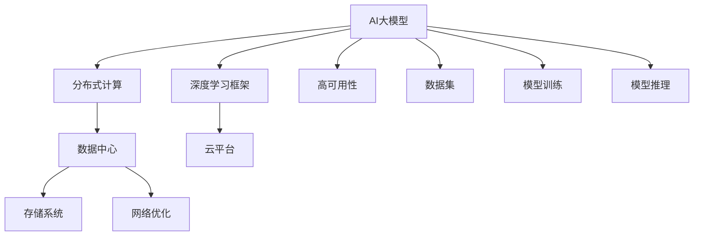

                 

# AI 大模型应用数据中心建设：数据中心产业发展

## 1. 背景介绍

在人工智能（AI）迅猛发展的今天，数据中心（Data Center）作为计算与存储的基础设施，扮演着至关重要的角色。特别地，随着深度学习和大型神经网络模型的兴起，AI大模型和应用对数据中心的需求日益增长，成为数据中心发展的新驱动力。本文将系统性地探讨AI大模型应用在数据中心中的建设，并展望数据中心产业的未来发展方向。

### 1.1 问题由来

近年来，深度学习模型不断突破，AI大模型的参数规模、计算需求和数据需求大幅增加。例如，GPT-3作为世界上最大的语言模型之一，拥有1750亿个参数，需要巨大的计算和存储资源。同时，AI大模型的训练和推理需要大量的数据，因此，如何构建高效的数据中心来支撑AI大模型的应用，成为业界关注的热点问题。

数据中心的建设和运营涉及到多个环节，如硬件设备、软件系统、网络架构、能效管理等。在AI大模型的背景下，数据中心需要应对新的技术挑战，例如，模型参数的爆炸性增长、对计算和存储资源的需求增加，以及对数据隐私和安全的要求。

### 1.2 问题核心关键点

AI大模型的应用对数据中心提出的关键需求包括：
- 高性能计算能力：需要支持并行计算和分布式训练，以满足大型模型的训练需求。
- 大规模存储需求：存储AI模型所需的巨量数据和中间结果。
- 高可用性和可靠性：确保模型训练和推理过程的稳定性和持续性。
- 低延迟和网络优化：提升模型响应的实时性和流畅性。
- 数据隐私和安全性：保护用户隐私和模型数据不被泄露。
- 可扩展性和弹性伸缩：根据需求灵活扩展计算和存储资源。

这些需求驱动数据中心在硬件设备、软件架构、网络优化、能源管理和安全保障等方面进行持续创新和升级。

### 1.3 问题研究意义

研究AI大模型应用对数据中心的建设需求，对于提升数据中心效率、降低运营成本、拓展数据中心的业务范围具有重要意义：
- 提升计算和存储效率：优化硬件设备和软件系统，满足AI大模型的高性能计算和存储需求。
- 降低能耗：采用先进的能效管理和资源利用技术，提升数据中心的能源利用率。
- 支持AI大模型的普及：构建能支撑大规模模型的数据中心，推动AI技术在各行业的广泛应用。
- 保障数据安全和隐私：加强数据中心的防护措施，确保AI模型的安全性和用户的隐私权益。
- 增强市场竞争力：通过数据中心的技术创新和优化，提升数据中心的综合服务能力，吸引更多的AI大模型应用。

## 2. 核心概念与联系

### 2.1 核心概念概述

在探讨AI大模型应用对数据中心的建设需求时，需要理解一些核心概念：
- **AI大模型**：通过大规模数据集进行预训练的大型神经网络模型，例如BERT、GPT等。
- **数据中心**：提供计算、存储、网络等资源，支持数据处理、存储、分析等任务的基础设施。
- **分布式计算**：通过多个计算节点协同工作，实现高吞吐量和高可扩展性的计算能力。
- **深度学习框架**：如TensorFlow、PyTorch等，提供模型训练和推理的工具和接口。
- **云平台**：如AWS、Google Cloud等，提供数据中心的云化解决方案，实现资源按需扩展。
- **高可用性**：通过冗余和故障转移机制，确保数据中心和应用的持续运行。

这些概念构成了AI大模型在数据中心中的应用基础，其相互作用和依赖关系如下图所示：



### 2.2 概念间的关系

上述核心概念通过数据流和控制流，相互连接和支撑。AI大模型作为驱动数据中心需求的核心，通过分布式计算、存储系统、云平台、高可用性、深度学习框架等手段，得到支撑和优化，最终实现模型的高效训练和推理。

## 3. 核心算法原理 & 具体操作步骤
### 3.1 算法原理概述

AI大模型的应用对数据中心的建设需求主要体现在以下几个方面：
- **高性能计算资源**：需要大量的GPU、TPU等硬件设备，支持分布式深度学习训练。
- **大规模存储系统**：需要海量硬盘和存储设备，支撑模型的存储和中间结果的存储。
- **高可用性设计**：需要冗余和备份机制，确保数据中心的持续运行。
- **低延迟网络架构**：需要高速网络设备和缓存机制，减少数据传输时延。
- **能源管理与优化**：需要高效能的电源管理，降低能源消耗和运营成本。
- **数据安全和隐私保护**：需要数据加密和访问控制机制，保护敏感数据。

### 3.2 算法步骤详解

基于上述需求，AI大模型应用的数据中心建设一般包括以下步骤：
1. **需求分析**：根据AI大模型的规模和类型，评估计算、存储、网络等需求。
2. **硬件采购**：根据需求采购高性能计算设备（如GPU、TPU）和存储设备。
3. **软件部署**：安装和配置深度学习框架和分布式计算系统。
4. **网络优化**：设计高速网络架构，提升数据传输效率。
5. **高可用性设计**：实现冗余和备份机制，确保系统的高可用性。
6. **能效管理**：优化能源管理和使用，降低运营成本。
7. **数据安全和隐私保护**：加强数据加密和访问控制，保护数据隐私和安全。
8. **系统测试和优化**：通过测试和调优，确保系统性能和稳定性。

### 3.3 算法优缺点

AI大模型应用对数据中心的建设需求具有以下优点：
- 提升计算和存储效率：通过分布式计算和存储，满足AI大模型的高性能需求。
- 降低能耗：采用先进的能效管理技术，提升能源利用率。
- 支持大规模应用：构建可扩展的数据中心，支持AI大模型的普及。

然而，也存在一些挑战和缺点：
- 高昂的建设成本：高性能计算和存储设备价格昂贵，构建高可用性的数据中心需要大量投资。
- 复杂的管理和运维：高性能系统和复杂架构需要专业的技术团队进行管理和维护。
- 数据隐私和安全风险：大量数据的存储和传输可能带来隐私泄露和安全风险。
- 难以适应小规模应用：大规模数据中心的建设可能无法灵活应对小规模应用。

### 3.4 算法应用领域

AI大模型应用对数据中心的建设需求不仅局限于AI领域，还可应用于以下领域：
- **科学研究**：支持大规模科学计算和数据分析，推动科学研究的进步。
- **金融服务**：提供高性能计算和存储，支持实时交易和分析。
- **医疗健康**：支持医疗影像分析和电子病历处理，提高医疗服务水平。
- **教育培训**：支持大规模在线教育和培训，提高教育质量。
- **工业制造**：提供工业数据分析和模拟，提升制造效率和质量。

## 4. 数学模型和公式 & 详细讲解
### 4.1 数学模型构建

AI大模型应用对数据中心的建设需求可以从以下几个方面进行数学建模：
- **计算需求建模**：描述训练和推理过程中所需的计算资源，包括CPU、GPU、TPU等设备。
- **存储需求建模**：描述模型参数和中间结果的存储需求，包括硬盘和内存设备。
- **能效管理建模**：描述能源管理的需求，包括能源消耗和利用率。
- **网络架构建模**：描述网络传输的需求，包括带宽和延迟。
- **高可用性建模**：描述系统冗余和备份的需求，包括故障转移和恢复机制。

### 4.2 公式推导过程

以计算需求建模为例，假设AI大模型的参数规模为 $P$，训练批次大小为 $B$，则单批次训练所需的计算量为 $C = P/B$。如果采用分布式训练，需要 $K$ 个计算节点，则总计算量为 $C_{\text{总}} = K \times C$。

对于存储需求，假设模型参数量为 $P$，训练过程中的中间结果量为 $I$，则总存储需求为 $S = P + I$。

对于能效管理，假设单位计算资源耗能为 $E$，单位存储资源耗能为 $F$，则总能耗为 $E_{\text{总}} = K \times E \times C_{\text{总}}$，总存储能耗为 $F_{\text{总}} = S \times F$。

### 4.3 案例分析与讲解

以BERT模型为例，假设使用16个TPU进行分布式训练，每片TPU有8核，模型参数量为300亿，训练批次大小为64。则单TPU计算量为 $C = 300 \times 10^9 / 64 = 4.6875 \times 10^8$，总计算量为 $C_{\text{总}} = 16 \times 4.6875 \times 10^8 = 7.51 \times 10^9$。总存储需求为 $S = 300 \times 10^9 + I$。假设中间结果量为500GB，则总存储需求为 $S = 300 \times 10^9 + 500 \times 10^9 = 8 \times 10^9$ GB。

## 5. 项目实践：代码实例和详细解释说明
### 5.1 开发环境搭建

AI大模型应用的数据中心建设需要丰富的计算和存储资源，可以使用AWS、Google Cloud等云平台进行建设和管理。以下是使用AWS搭建数据中心的示例步骤：

1. **创建EC2实例**：根据需求选择计算资源，如CPU、GPU、TPU等。
2. **安装和配置深度学习框架**：如TensorFlow、PyTorch等。
3. **配置网络环境**：使用AWS VPC（虚拟私有云）和Subnet进行网络隔离和安全保护。
4. **部署存储系统**：使用AWS EBS（弹性块存储）或S3（简单存储服务）进行数据存储。
5. **安装数据中心管理系统**：如Nagios、Zabbix等，监控和管理计算、存储、网络等资源。

### 5.2 源代码详细实现

以下是使用TensorFlow在AWS EC2实例上进行BERT模型训练的示例代码：

```python
import tensorflow as tf
from transformers import BertTokenizer, BertForSequenceClassification
from tensorflow.keras.models import Model
from tensorflow.keras.layers import Dense, Dropout
from tensorflow.keras.optimizers import Adam

# 配置参数
model_name = 'bert-base-uncased'
sequence_length = 128
learning_rate = 2e-5
epochs = 5
batch_size = 32

# 创建Tokenizers和模型
tokenizer = BertTokenizer.from_pretrained(model_name)
model = BertForSequenceClassification.from_pretrained(model_name, num_labels=2)

# 构建输入输出层
input_ids = tf.keras.layers.Input(shape=(sequence_length,), dtype=tf.int32, name='input_ids')
input_mask = tf.keras.layers.Input(shape=(sequence_length,), dtype=tf.int32, name='input_mask')
input_tensor = tf.keras.layers.Lambda(lambda x: tf.concat([input_ids, input_mask], axis=-1))(input_ids)
input_tensor = tf.keras.layers.Lambda(lambda x: tf.keras.layers.Reshape((sequence_length, 2))(x))(input_tensor)
output_tensor = model(input_tensor)
classifier = Dense(1, activation='sigmoid')(output_tensor)
model = Model(inputs=[input_ids, input_mask], outputs=[classifier])

# 编译模型
model.compile(optimizer=Adam(learning_rate=learning_rate), loss='binary_crossentropy', metrics=['accuracy'])

# 加载数据集
train_dataset = ...
train_dataset.shuffle(buffer_size=10000)
train_dataset.batch(batch_size)

# 训练模型
model.fit(train_dataset, epochs=epochs)
```

### 5.3 代码解读与分析

上述代码示例使用了TensorFlow和Transformers库，分别实现了BERT模型的构建和训练过程。其中，`BertForSequenceClassification`表示一个序列分类模型，`Dense`层用于输出分类结果，`Adam`优化器用于模型训练，`binary_crossentropy`损失函数用于二分类任务，`accuracy`指标用于评估模型性能。

### 5.4 运行结果展示

训练完成后，可以在测试集上评估模型的性能。假设测试集为10,000条数据，每条数据长度为128，可以得到模型在测试集上的准确率和损失值。

## 6. 实际应用场景
### 6.1 智能医疗

AI大模型在智能医疗领域的应用需求对数据中心提出了高计算、存储、网络和安全要求。例如，医学影像分析、电子病历处理、个性化医疗推荐等任务需要处理大规模的图像和文本数据，对计算和存储资源有高要求。

- **医学影像分析**：通过卷积神经网络对医学影像进行分类、分割和检测，需要高性能计算和存储资源。
- **电子病历处理**：通过自然语言处理技术分析电子病历，提取关键信息，需要大规模文本处理和存储。
- **个性化医疗推荐**：通过深度学习模型推荐个性化治疗方案，需要实时计算和存储。

### 6.2 金融服务

金融行业对AI大模型的应用需求主要包括实时交易分析、风险控制、客户服务等方面，对数据中心提出了高计算、存储、网络和隐私保护要求。

- **实时交易分析**：通过深度学习模型分析交易数据，预测市场趋势，需要实时计算和存储资源。
- **风险控制**：通过深度学习模型分析客户行为和交易记录，识别潜在的风险，需要高计算能力和数据隐私保护。
- **客户服务**：通过自然语言处理技术回答客户咨询，需要大规模文本处理和存储。

### 6.3 教育培训

教育行业对AI大模型的应用需求主要包括在线教育、智能答疑、学习分析等方面，对数据中心提出了高计算、存储、网络和隐私保护要求。

- **在线教育**：通过深度学习模型推荐个性化学习资源，需要实时计算和存储资源。
- **智能答疑**：通过自然语言处理技术回答学生问题，需要大规模文本处理和存储。
- **学习分析**：通过深度学习模型分析学习行为和成果，提供个性化反馈，需要高计算能力和数据隐私保护。

### 6.4 未来应用展望

未来，AI大模型在数据中心的应用将更加广泛和深入，数据中心的建设和管理也将更加智能化和高效化。具体展望如下：
- **边缘计算**：在数据中心边缘部署AI模型，提升响应速度和降低延迟。
- **云平台一体化**：实现计算、存储、网络等资源的云化管理，提升数据中心的灵活性和扩展性。
- **智能运维**：利用AI技术进行数据中心运维，提升资源利用率和系统稳定性。
- **数据安全和隐私保护**：加强数据加密和访问控制，保护敏感数据。

## 7. 工具和资源推荐
### 7.1 学习资源推荐

为了帮助开发者系统掌握AI大模型应用对数据中心建设的需求，以下是一些优质的学习资源：
- **《深度学习》（Ian Goodfellow）**：系统介绍深度学习的基本概念、算法和应用。
- **《TensorFlow官方文档》**：提供深度学习框架的详细文档和代码示例。
- **《Google Cloud AI及机器学习指南》**：介绍AWS、Google Cloud等云平台在AI领域的应用。
- **《数据中心运维管理》**：介绍数据中心的建设和管理，涵盖硬件设备、网络、存储、安全等方面。
- **《人工智能伦理与安全》**：探讨AI技术在伦理和隐私方面的挑战和解决方案。

### 7.2 开发工具推荐

AI大模型应用对数据中心建设需要使用多种工具，以下是一些推荐工具：
- **AWS EC2**：提供高性能计算资源，支持分布式训练。
- **Google Cloud Compute**：提供高性能计算和存储资源，支持云化管理。
- **Nagios**：监控和管理数据中心的计算、存储、网络等资源。
- **Zabbix**：监控和管理数据中心的环境和设备状态。
- **Prometheus**：监控和管理数据中心的性能指标和告警。

### 7.3 相关论文推荐

AI大模型应用对数据中心建设的研究涉及多个领域，以下是一些推荐论文：
- **《大规模深度学习系统：架构、系统和挑战》（J. Dean）**：介绍大规模深度学习系统的架构和系统挑战。
- **《深度学习加速器：通过GPU、FPGA和TPU加速深度学习》（A. Gupta）**：介绍深度学习加速器的硬件设计和优化。
- **《分布式深度学习系统：挑战与优化》（M. Abadi）**：介绍分布式深度学习系统的设计和优化。
- **《数据中心的能源管理：现状与挑战》（J. Wong）**：介绍数据中心的能源管理和优化技术。
- **《深度学习在数据中心的安全与隐私保护》（C. Smith）**：介绍深度学习在数据中心的安全和隐私保护技术。

## 8. 总结：未来发展趋势与挑战
### 8.1 研究成果总结

本文从需求分析、硬件采购、软件部署、网络优化、高可用性设计、能效管理、数据安全和隐私保护等方面，系统探讨了AI大模型应用对数据中心的建设需求。通过理论分析和实际案例，展示了数据中心在计算、存储、网络、能源管理等方面的优化手段，以及未来发展的趋势和挑战。

### 8.2 未来发展趋势

AI大模型应用对数据中心建设的需求将推动数据中心在以下几个方面进行持续创新和升级：
- **高性能计算**：采用更先进的计算硬件和分布式训练技术，满足AI大模型的高性能计算需求。
- **大规模存储**：采用更高效的数据存储技术和分布式文件系统，支撑AI大模型的存储需求。
- **高可用性**：实现更可靠的冗余和故障转移机制，确保数据中心的持续运行。
- **低延迟网络**：采用更高效的网络架构和缓存机制，提升数据传输效率。
- **能效管理**：采用更高效的能源管理和优化技术，降低运营成本。
- **数据安全和隐私保护**：加强数据加密和访问控制，保护敏感数据。

### 8.3 面临的挑战

AI大模型应用对数据中心建设的需求也面临着诸多挑战：
- **高昂的建设成本**：高性能计算和存储设备价格昂贵，构建高可用性的数据中心需要大量投资。
- **复杂的管理和运维**：高性能系统和复杂架构需要专业的技术团队进行管理和维护。
- **数据隐私和安全风险**：大量数据的存储和传输可能带来隐私泄露和安全风险。
- **难以适应小规模应用**：大规模数据中心的建设可能无法灵活应对小规模应用。

### 8.4 研究展望

未来，需要在以下几个方面进行深入研究：
- **硬件创新**：开发更高效的计算和存储硬件，如量子计算、光子计算等。
- **分布式训练**：优化分布式训练算法和系统，提升训练效率和资源利用率。
- **智能运维**：利用AI技术进行数据中心运维，提升资源利用率和系统稳定性。
- **数据安全和隐私保护**：开发更强大的数据加密和访问控制技术，保护敏感数据。
- **多模态数据融合**：实现视觉、语音、文本等多模态数据的融合和协同建模，提升模型的全面性和鲁棒性。

## 9. 附录：常见问题与解答

**Q1：什么是AI大模型？**

A: AI大模型是通过大规模数据集进行预训练的大型神经网络模型，如BERT、GPT等。其特点是参数规模大、计算需求高、数据需求大，适用于复杂的自然语言理解和生成任务。

**Q2：AI大模型对数据中心提出了哪些需求？**

A: AI大模型对数据中心提出的主要需求包括高性能计算能力、大规模存储需求、高可用性和可靠性、低延迟和网络优化、能源管理和优化、数据安全和隐私保护。

**Q3：如何评估AI大模型的计算需求？**

A: 通过计算资源（如CPU、GPU、TPU）和训练批次大小（B），可以计算单批次训练所需的计算量C = P/B，其中P为模型参数量。采用分布式训练，总计算量为C_总 = K × C，其中K为计算节点数。

**Q4：如何设计高效的数据中心网络架构？**

A: 采用高速网络设备，如10Gb/s以太网、100Gb/s以太网等，提升数据传输速度。同时，采用缓存机制，减少数据传输时延。

**Q5：如何保护AI大模型的数据隐私和安全？**

A: 采用数据加密技术，如AES、RSA等，保护数据在传输和存储过程中的安全。实施严格的访问控制机制，限制数据访问权限，确保数据隐私。

---

作者：禅与计算机程序设计艺术 / Zen and the Art of Computer Programming

