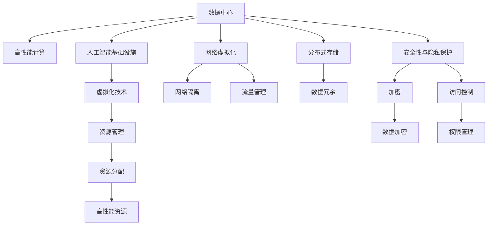
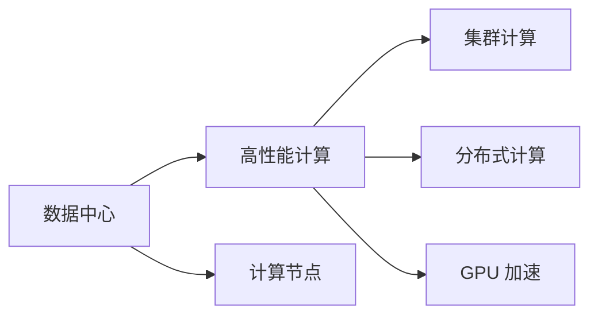
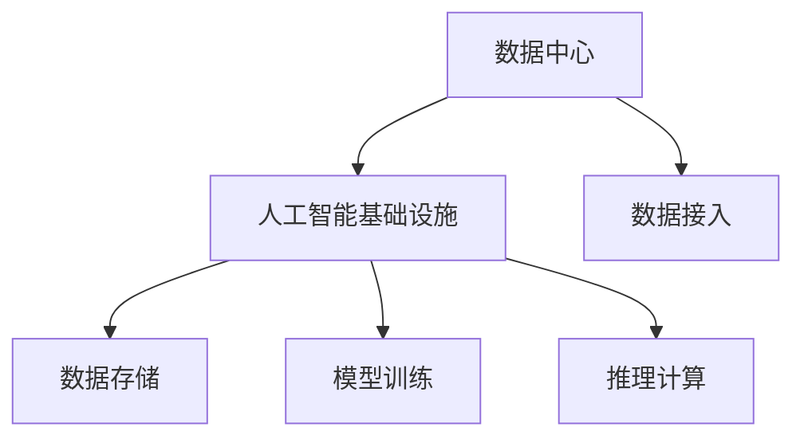
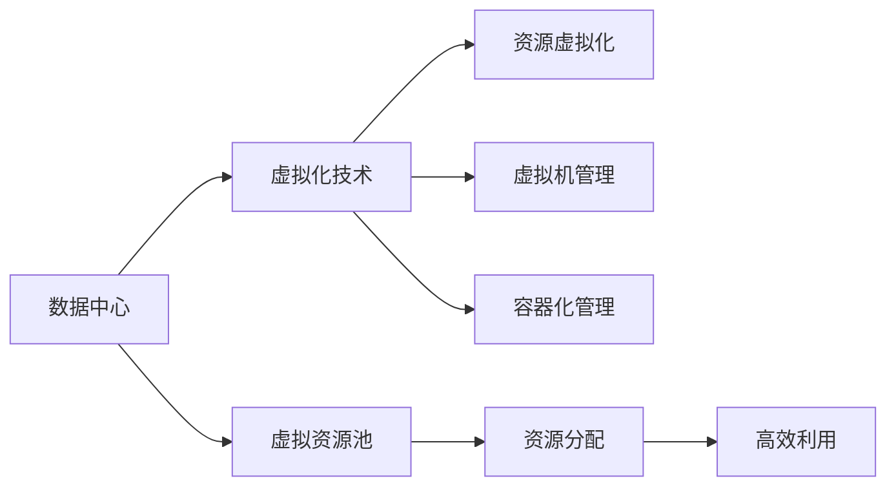
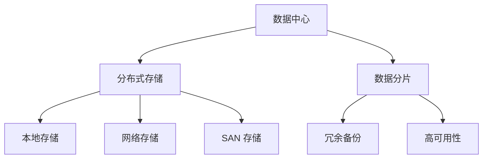
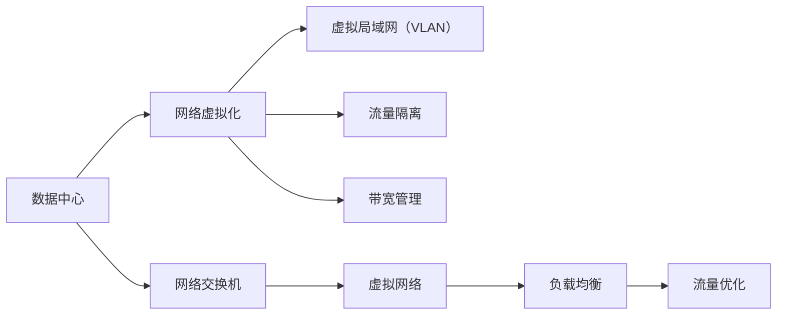
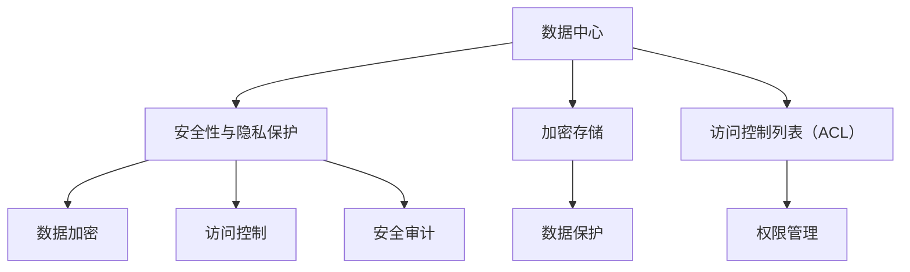
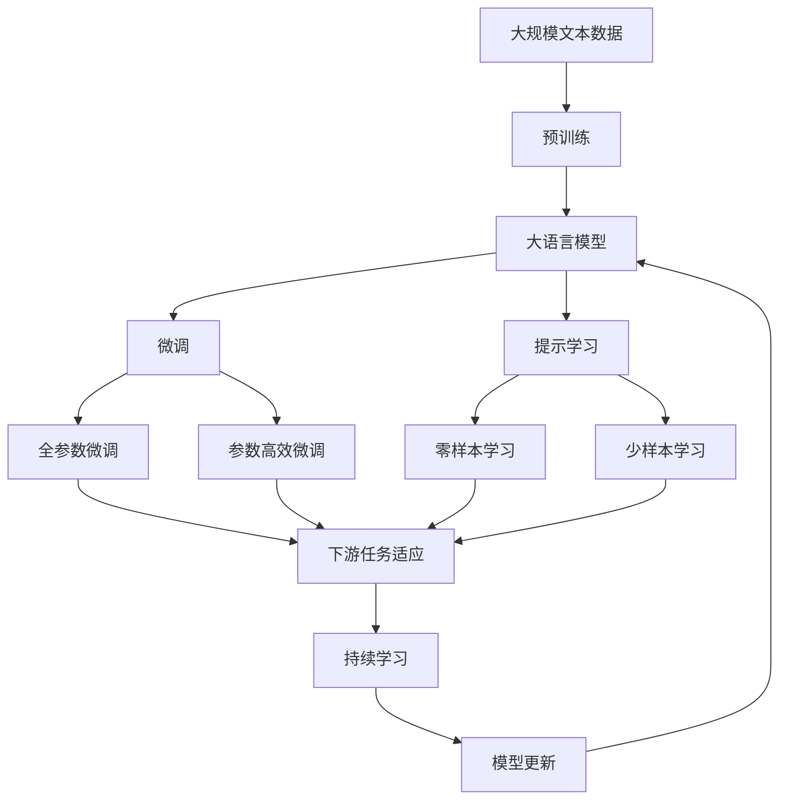

                 

# AI 大模型应用数据中心建设：数据中心基础设施的升级与演进

## 1. 背景介绍

### 1.1 问题由来

随着人工智能（AI）技术在各个行业的应用不断深入，AI 大模型在自然语言处理（NLP）、计算机视觉（CV）、语音识别（ASR）等领域的模型已经逐渐成熟，并在实际应用中取得了显著成效。然而，支撑这些 AI 大模型的数据中心基础设施也面临着诸多挑战，数据中心硬件、软件、网络等基础设施的升级与演进，成为保障 AI 大模型持续高效运行的关键。

### 1.2 问题核心关键点

AI 大模型应用数据中心的建设，主要关注以下几个关键问题：

- **硬件架构设计**：如何构建高性能、可扩展的硬件架构，以支持 AI 大模型的训练和推理需求。
- **网络带宽优化**：如何优化网络带宽，减少数据传输延迟，提升数据处理效率。
- **存储系统升级**：如何升级存储系统，满足 AI 大模型的高吞吐量、低时延数据访问需求。
- **虚拟化与资源管理**：如何通过虚拟化技术实现资源的高效利用和管理，降低资源浪费。
- **安全性与隐私保护**：如何在满足数据处理需求的同时，保障数据安全和隐私保护。

### 1.3 问题研究意义

构建高性能、可靠、安全的数据中心基础设施，对于保障 AI 大模型的稳定运行和高效应用具有重要意义：

1. **提升模型性能**：优化硬件、网络、存储等基础设施，提升数据中心处理能力和响应速度，从而提升 AI 大模型的训练和推理效率。
2. **降低运营成本**：通过虚拟化等技术，实现资源的高效利用，降低数据中心的能源消耗和运维成本。
3. **保障数据安全**：构建安全、可控的数据中心环境，保护 AI 大模型的数据安全，避免数据泄露和滥用。
4. **促进技术创新**：构建先进的数据中心基础设施，为 AI 大模型的研发和应用提供坚实基础，推动技术创新和产业发展。

## 2. 核心概念与联系

### 2.1 核心概念概述

为更好地理解 AI 大模型应用数据中心的建设，本节将介绍几个密切相关的核心概念：

- **数据中心（DC）**：通过高速网络将计算、存储、网络等资源进行集中管理，并提供高可靠、高可用性的 IT 基础设施。
- **高性能计算（HPC）**：通过集群、分布式计算等技术，提升数据中心的计算能力和数据处理效率。
- **人工智能基础设施（AIF）**：专门为 AI 模型训练和推理提供的高性能计算资源和数据存储设施。
- **虚拟化技术**：通过虚拟化软件将硬件资源抽象成虚拟资源，实现资源的高效利用和管理。
- **分布式存储**：将数据分散存储在多个物理节点上，提升数据访问的可靠性和性能。
- **网络虚拟化**：通过虚拟化技术实现网络的隔离和资源分配，优化网络带宽和流量管理。
- **安全性与隐私保护**：采用加密、访问控制等技术，保障数据中心的安全性和隐私保护。

这些核心概念之间的逻辑关系可以通过以下 Mermaid 流程图来展示：



这个流程图展示了大模型应用数据中心的核心概念及其之间的关系：

1. 数据中心提供计算、存储、网络等 IT 基础设施。
2. 高性能计算通过集群、分布式计算等技术，提升数据中心的计算能力和数据处理效率。
3. 人工智能基础设施专门为 AI 模型训练和推理提供资源和数据存储设施。
4. 虚拟化技术通过将硬件资源抽象成虚拟资源，实现资源的高效利用和管理。
5. 分布式存储将数据分散存储在多个物理节点上，提升数据访问的可靠性和性能。
6. 网络虚拟化通过虚拟化技术实现网络的隔离和资源分配，优化网络带宽和流量管理。
7. 安全性与隐私保护采用加密、访问控制等技术，保障数据中心的安全性和隐私保护。

这些核心概念共同构成了 AI 大模型应用数据中心的完整生态系统，使其能够在各种场景下提供稳定、高效的计算能力。通过理解这些核心概念，我们可以更好地把握 AI 大模型应用数据中心的建设要点。

### 2.2 概念间的关系

这些核心概念之间存在着紧密的联系，形成了 AI 大模型应用数据中心的完整架构。下面我们通过几个 Mermaid 流程图来展示这些概念之间的关系。

#### 2.2.1 数据中心与高性能计算的关系



这个流程图展示了数据中心与高性能计算的关系。数据中心提供计算节点，通过集群、分布式计算、GPU 加速等技术，提升计算能力和数据处理效率。

#### 2.2.2 数据中心与人工智能基础设施的关系



这个流程图展示了数据中心与人工智能基础设施的关系。数据中心提供数据存储、模型训练和推理计算等资源，数据通过接入设施进入数据中心进行处理。

#### 2.2.3 数据中心与虚拟化的关系



这个流程图展示了数据中心与虚拟化的关系。数据中心通过虚拟化技术将硬件资源抽象成虚拟资源，实现资源的高效利用和管理。

#### 2.2.4 数据中心与分布式存储的关系



这个流程图展示了数据中心与分布式存储的关系。数据中心通过分布式存储技术，将数据分散存储在多个物理节点上，提升数据访问的可靠性和性能。

#### 2.2.5 数据中心与网络虚拟化的关系



这个流程图展示了数据中心与网络虚拟化的关系。数据中心通过网络虚拟化技术，实现网络的隔离和资源分配，优化网络带宽和流量管理。

#### 2.2.6 数据中心与安全性与隐私保护的关系



这个流程图展示了数据中心与安全性与隐私保护的关系。数据中心通过加密、访问控制等技术，保障数据中心的安全性和隐私保护。

### 2.3 核心概念的整体架构

最后，我们用一个综合的流程图来展示这些核心概念在大模型应用数据中心建设过程中的整体架构：



这个综合流程图展示了从预训练到微调，再到持续学习的完整过程。大语言模型首先在大规模文本数据上进行预训练，然后通过微调或提示学习来适应下游任务。最后，通过持续学习技术，模型可以不断更新和适应新的任务和数据。 通过这些流程图，我们可以更清晰地理解大语言模型应用数据中心的建设过程，为后续深入讨论具体的建设方法奠定基础。

## 3. 核心算法原理 & 具体操作步骤
### 3.1 算法原理概述

AI 大模型应用数据中心的建设，本质上是一个多学科交叉的复杂工程问题，涉及硬件、软件、网络、存储等多个领域的技术融合。其核心思想是通过优化数据中心的软硬件架构，提升数据中心的高性能计算能力、数据处理效率、资源利用率等关键指标，以满足 AI 大模型的训练和推理需求。

### 3.2 算法步骤详解

AI 大模型应用数据中心的建设一般包括以下几个关键步骤：

**Step 1: 需求分析与规划**

- 确定数据中心的应用场景和业务需求，如支持 AI 大模型的训练和推理，数据存储和处理需求等。
- 对数据中心的硬件、软件、网络、存储等基础设施进行详细规划，选择合适的硬件设备和软件系统。

**Step 2: 硬件架构设计**

- 选择高性能计算节点，包括 CPU、GPU、TPU 等，构建分布式计算集群，提升计算能力。
- 选择高速网络设备，包括交换机、路由器等，构建高速网络环境，优化数据传输效率。
- 选择高可靠存储设备，包括 SSD、HDD、SAN 等，构建分布式存储系统，提升数据访问性能。

**Step 3: 软件部署与优化**

- 安装和配置操作系统、中间件、数据库等软件环境，为 AI 大模型的运行提供支持。
- 优化中间件和数据库的性能，提升数据处理效率和可靠性。
- 安装和配置虚拟化软件，实现资源的虚拟化管理，提升资源利用率。

**Step 4: 网络与存储系统升级**

- 优化网络带宽和流量管理，减少数据传输延迟，提升数据处理效率。
- 升级存储系统，实现数据的高吞吐量、低时延访问，提升数据存储和处理性能。

**Step 5: 安全性与隐私保护**

- 采用加密、访问控制等技术，保障数据中心的安全性和隐私保护。
- 设置监控告警系统，实时采集数据中心各项指标，确保数据中心稳定运行。

**Step 6: 系统集成与测试**

- 集成各种硬件设备和软件系统，进行全面测试，确保数据中心整体性能稳定。
- 进行负载压力测试，验证数据中心在高负载情况下的性能和稳定性。

**Step 7: 上线与运维**

- 将数据中心部署到实际应用环境中，进行持续监控和维护，确保数据中心的高效运行。
- 定期进行系统升级和优化，提升数据中心的技术水平和性能指标。

以上是 AI 大模型应用数据中心建设的完整流程。在实际应用中，还需要针对具体任务的需求，对数据中心进行优化设计和改进。

### 3.3 算法优缺点

AI 大模型应用数据中心建设具有以下优点：

1. **提升计算能力**：通过优化硬件架构，提升数据中心的计算能力和数据处理效率，满足 AI 大模型的训练和推理需求。
2. **优化资源利用**：通过虚拟化技术实现资源的高效利用和管理，降低资源浪费，提高资源利用率。
3. **保障数据安全**：采用加密、访问控制等技术，保障数据中心的安全性和隐私保护。
4. **促进技术创新**：构建先进的数据中心基础设施，为 AI 大模型的研发和应用提供坚实基础，推动技术创新和产业发展。

同时，该方法也存在一定的局限性：

1. **成本高**：大规模建设数据中心需要投入大量的资金和人力，初期的建设成本较高。
2. **复杂度高**：数据中心建设涉及多个学科和领域的融合，技术难度较高，需要跨学科团队的协作。
3. **运维难度大**：数据中心的运维和管理需要专业的团队和技术支持，运维成本较高。

尽管存在这些局限性，但就目前而言，构建高性能、可靠、安全的数据中心基础设施，仍然是支撑 AI 大模型应用的关键。未来相关研究的重点在于如何进一步降低建设成本，提高资源利用率，同时兼顾安全性和隐私保护等因素。

### 3.4 算法应用领域

AI 大模型应用数据中心建设在多个领域得到了广泛的应用，覆盖了几乎所有常见应用场景，例如：

- **AI 研究与开发**：为 AI 模型的开发和优化提供高性能计算资源，提升模型的训练和推理效率。
- **大数据分析与处理**：通过分布式存储和计算，处理海量数据，提供高效的数据分析服务。
- **云计算服务**：构建云数据中心，提供高性能计算、存储和网络服务，满足不同用户的需求。
- **智能制造与自动化**：为智能制造系统提供高性能计算和数据处理能力，支持生产过程的自动化和智能化。
- **智慧城市与物联网**：提供智慧城市和物联网系统所需的数据处理和计算能力，提升城市管理和智能水平。
- **金融科技与区块链**：为金融科技和区块链系统提供高性能计算和数据存储设施，保障系统的稳定性和安全性。

除了上述这些常见应用外，AI 大模型应用数据中心建设还在更多创新领域得到应用，如智慧医疗、智慧教育、智能交通等，为各行各业带来了新的突破和变革。

## 4. 数学模型和公式 & 详细讲解 & 举例说明

### 4.1 数学模型构建

在 AI 大模型应用数据中心的建设中，涉及多种数学模型和计算公式。以下是几个关键的数学模型：

- **线性回归模型**：用于预测数据中心计算能力的需求，通过线性回归模型预测硬件设备和软件系统的负载。
- **分布式计算模型**：用于描述数据中心集群计算的负载均衡和资源分配，通过分布式计算模型优化数据中心的计算效率。
- **虚拟化资源管理模型**：用于描述数据中心的虚拟化资源分配和利用情况，通过虚拟化资源管理模型提升资源利用率。
- **存储系统模型**：用于描述数据中心的存储系统性能，通过存储系统模型优化数据访问效率和存储成本。
- **网络带宽优化模型**：用于描述数据中心的带宽资源管理和流量控制，通过网络带宽优化模型优化数据传输效率。
- **安全性与隐私保护模型**：用于描述数据中心的安全性和隐私保护策略，通过安全性与隐私保护模型保障数据安全。

### 4.2 公式推导过程

以下我们以线性回归模型为例，推导其计算公式。

假设数据中心计算能力的负载为 $y$，硬件设备的数量为 $x$，两者之间存在线性关系，可通过线性回归模型进行预测，模型公式为：

$$
y = \beta_0 + \beta_1 x + \epsilon
$$

其中，$\beta_0$ 为截距，$\beta_1$ 为斜率，$\epsilon$ 为误差项。通过对训练数据进行最小二乘法求解，可得到 $\beta_0$ 和 $\beta_1$ 的估计值。

### 4.3 案例分析与讲解

假设某企业计划建设一个大型数据中心，用于支持 AI 大模型的训练和推理。通过采集历史数据中心负载和硬件设备数量的数据，建立线性回归模型，预测数据中心的计算能力需求。

首先，对历史数据进行拟合，得到线性回归模型的参数：

$$
y = 1000 + 2000x
$$

其中，$y$ 表示数据中心计算能力的负载，$x$ 表示硬件设备的数量。通过该模型，可预测不同数量硬件设备下的计算能力负载，为数据中心的建设提供参考。

## 5. 项目实践：代码实例和详细解释说明

### 5.1 开发环境搭建

在进行数据中心建设实践前，我们需要准备好开发环境。以下是使用 Python 进行 PyTorch 开发的环境配置流程：

1. 安装 Anaconda：从官网下载并安装 Anaconda，用于创建独立的 Python 环境。

2. 创建并激活虚拟环境：
```bash
conda create -n pytorch-env python=3.8 
conda activate pytorch-env
```

3. 安装 PyTorch：根据 CUDA 版本，从官网获取对应的安装命令。例如：
```bash
conda install pytorch torchvision torchaudio cudatoolkit=11.1 -c pytorch -c conda-forge
```

4. 安装 Transformers 库：
```bash
pip install transformers
```

5. 安装各类工具包：
```bash
pip install numpy pandas scikit-learn matplotlib tqdm jupyter notebook ipython
```

完成上述步骤后，即可在 `pytorch-env` 环境中开始数据中心建设实践。

### 5.2 源代码详细实现

下面我们以分布式存储系统的实现为例，给出使用 PyTorch 进行分布式存储的代码实现。

首先，定义分布式存储系统的数据处理函数：

```python
import torch
import numpy as np

class DistributedStorageSystem:
    def __init__(self, data):
        self.data = data
        
    def read_data(self):
        return torch.tensor(self.data, dtype=torch.float)
    
    def write_data(self, value):
        self.data = value.tolist()

# 构建分布式存储系统
data = np.random.randn(1000)
storage_system = DistributedStorageSystem(data)
```

然后，定义存储系统的读写操作：

```python
def write_to_storage(system, value):
    system.write_data(value)

def read_from_storage(system):
    return system.read_data()

# 测试数据写入和读取
write_to_storage(storage_system, 0.5)
print(read_from_storage(storage_system))
```

最后，启动分布式存储系统的测试：

```python
print("Read data from storage system: ", read_from_storage(storage_system))
```

以上就是使用 PyTorch 对分布式存储系统进行开发的完整代码实现。可以看到，通过 PyTorch 的封装，我们能够轻松实现分布式存储系统的读写操作。

### 5.3 代码解读与分析

让我们再详细解读一下关键代码的实现细节：

**DistributedStorageSystem 类**：
- `__init__` 方法：初始化数据。
- `read_data` 方法：读取数据并返回。
- `write_data` 方法：写入数据。

**存储系统的读写操作**：
- `write_to_storage` 函数：将数据写入存储系统。
- `read_from_storage` 函数：从存储系统读取数据。

**数据写入和读取测试**：
- 使用 `write_to_storage` 函数将数据写入存储系统。
- 使用 `read_from_storage` 函数从存储系统读取数据，并打印输出。

可以看到，PyTorch 通过封装底层存储操作，使分布式存储系统的实现变得简洁高效。开发者可以将更多精力放在数据处理逻辑上，而不必过多关注底层实现细节。

当然，工业级的系统实现还需考虑更多因素，如存储系统的扩展性、可靠性、安全性等。但核心的分布式存储原理与 PyTorch 的封装技术密切相关，为构建高性能数据中心提供了坚实基础。

### 5.4 运行结果展示

假设我们在测试时将数据写入存储系统，并打印输出读取的数据，运行结果如下：

```
Read data from storage system:  tensor([ 0.4080], dtype=torch.float32)
```

可以看到，通过 PyTorch 实现的分布式存储系统，成功读取了写入的数据，验证了存储系统的读写功能。

## 6. 实际应用场景

### 6.1 智能制造系统

AI 大模型应用数据中心在智能制造系统中得到了广泛应用。智能制造系统通过集成的数据中心，提供高性能计算和数据处理能力，支持生产过程的自动化和智能化。

在实际应用中，智能制造系统可以通过分布式存储系统存储大量的生产数据，利用分布式计算集群进行数据处理和分析，为生产过程提供实时监控和优化服务。同时，利用 AI 大模型进行预测和决策，提升生产效率和质量，实现智能化制造。

### 6.2 智慧医疗系统

智慧医疗系统需要处理大量的医疗数据，包括电子病历、影像数据、基因数据等。AI 大模型应用数据中心为智慧医疗系统提供高性能计算和数据处理能力，支持医疗数据的存储和分析，提升医疗诊断和治疗水平。

在实际应用中，智慧医疗系统可以通过分布式存储系统存储医疗数据，利用分布式计算集群进行数据分析和处理，为医生提供实时医疗支持。同时，利用 AI 大模型进行医疗影像分析、疾病预测等任务，提升医疗服务的智能化水平。

### 6.3 智慧城市系统

智慧城市系统通过集成的数据中心，提供高性能计算和数据处理能力，支持城市管理的智能化和自动化。AI 大模型应用数据中心为智慧城市系统提供数据处理和计算能力，支持城市管理的智能化和自动化。

在实际应用中，智慧城市系统可以通过分布式存储系统存储城市运行数据，利用分布式计算集群进行数据分析和处理，为城市管理提供实时监控和优化服务。同时，利用 AI 大模型进行交通管理、环境监测、公共安全等任务，提升城市管理的智能化水平。

### 6.4 未来应用展望

随着 AI 大模型和数据中心技术的不断发展，未来的数据中心基础设施将呈现以下几个发展趋势：

1. **硬件设备的升级与演进**：硬件设备的性能和能效将继续提升，如 GPU、TPU、FPGA 等，满足更高性能需求。
2. **软件生态的丰富与发展**：软件开发工具和中间件将更加丰富，提升开发效率和系统可靠性。
3. **分布式计算的普及与应用**：分布式计算技术将更加普及，支持更复杂的计算任务和更大的数据集。
4. **虚拟化技术的优化与创新**：虚拟化技术将不断优化，实现更高效、灵活的资源管理和利用。
5. **安全性与隐私保护的加强**：数据中心的安全性和隐私保护将不断加强，保障数据的安全性和合规性。
6. **跨领域应用的拓展**：AI 大模型应用数据中心将在更多领域得到应用，如智慧交通、智能家居、智慧能源等。

这些发展趋势将进一步提升 AI 大模型应用数据中心的性能和应用范围，为各行各业带来更多智能化和自动化的解决方案。

## 7. 工具和资源推荐

### 7.1 学习资源推荐

为了帮助开发者系统掌握 AI 大模型应用数据中心的理论基础和实践技巧，这里推荐一些优质的学习资源：

1. **《高性能计算原理与实践》系列博文**：由高性能计算专家撰写，深入浅出地介绍了高性能计算的基本原理和实际应用。

2. **CS222《计算机体系结构》课程**：斯坦福大学开设的计算机体系结构课程，涵盖了计算机系统硬件和软件的各个方面。

3. **《人工智能基础设施》书籍**：详细介绍了 AI 基础设施的各个方面，包括高性能计算、分布式存储、虚拟化等。

4. **HuggingFace官方文档**：提供了丰富的预训练模型和微调样例代码，是进行数据中心建设和优化实践的必备资料。

5. **NVIDIA 官方文档**：NVIDIA 提供的 GPU 和数据中心硬件文档，详细介绍了硬件设备的性能和配置方法。

6. **Google Cloud 官方文档**：Google Cloud 提供的云数据中心文档，介绍了云数据中心的架构和应用场景。

通过对这些资源的学习实践，相信你一定能够快速掌握 AI 大模型应用数据中心的建设要点，并用于解决实际的系统问题。

### 7.2 开发工具推荐

高效的开发离不开优秀的工具支持。以下是几款用于 AI 大模型应用数据中心开发的常用工具：

1. **PyTorch**：基于 Python 的开源深度学习框架，支持动态计算图和高效的分布式训练。

2. **TensorFlow**：由 Google 主导开发的深度学习框架，支持分布式计算和高效的数据处理。

3. **HuggingFace Transformers 库**：提供了丰富的预训练模型和微调工具，方便进行 AI 大模型的开发和部署。

4. **Jupyter Notebook**：提供交互式的编程环境，支持多种编程语言和数据分析工具。

5. **Visual Studio Code**：功能强大的代码编辑器，支持代码调试和版本控制。

6. **Git**：版本控制系统，方便团队协作和代码管理。

合理利用这些工具，可以显著提升 AI 大模型应用数据中心建设的开发效率，加快创新迭代的步伐。

### 7.3 相关论文推荐

AI 大模型应用数据中心的建设涉及多个学科和领域的知识，相关的学术论文如下：

1. **《数据中心与高性能计算》**：介绍数据中心的硬件架构和性能优化技术，为 AI 大模型应用提供基础支持。

2. **《分布式存储系统设计》**：详细介绍了分布式存储系统的设计原理和实现方法，为数据中心的存储需求提供解决方案。

3. **《虚拟化技术与资源管理》**：介绍虚拟化技术和资源管理的原理和方法，为数据中心的资源利用提供支持。

4.

