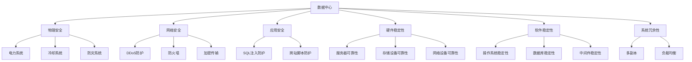
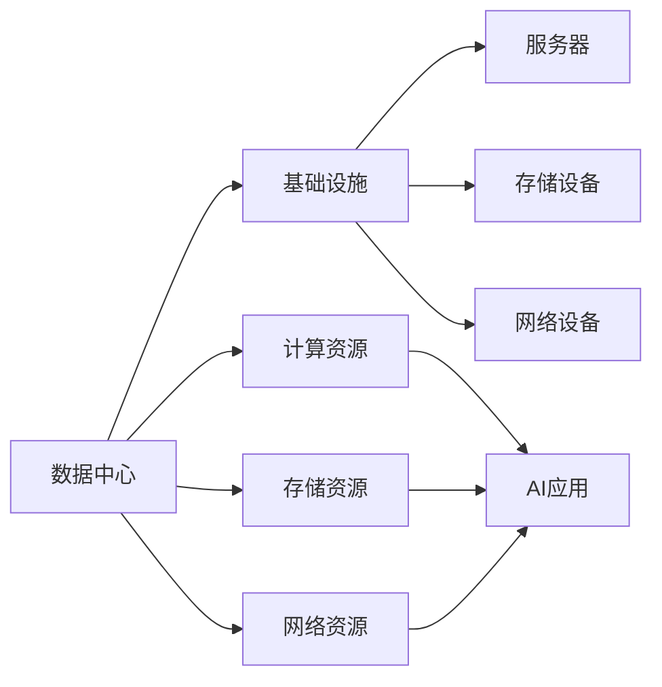
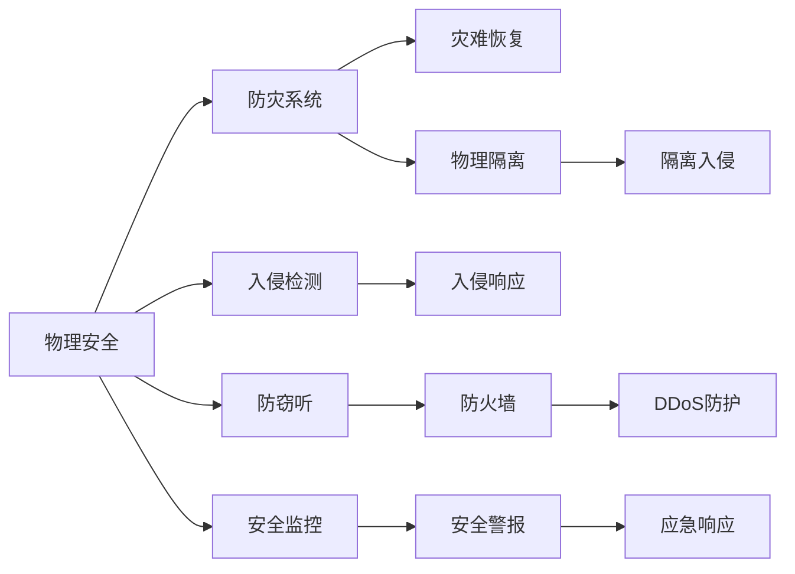
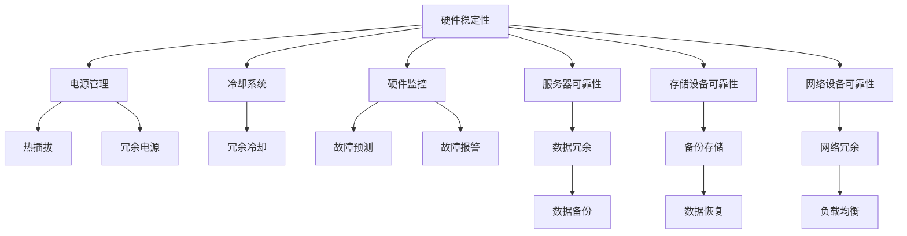
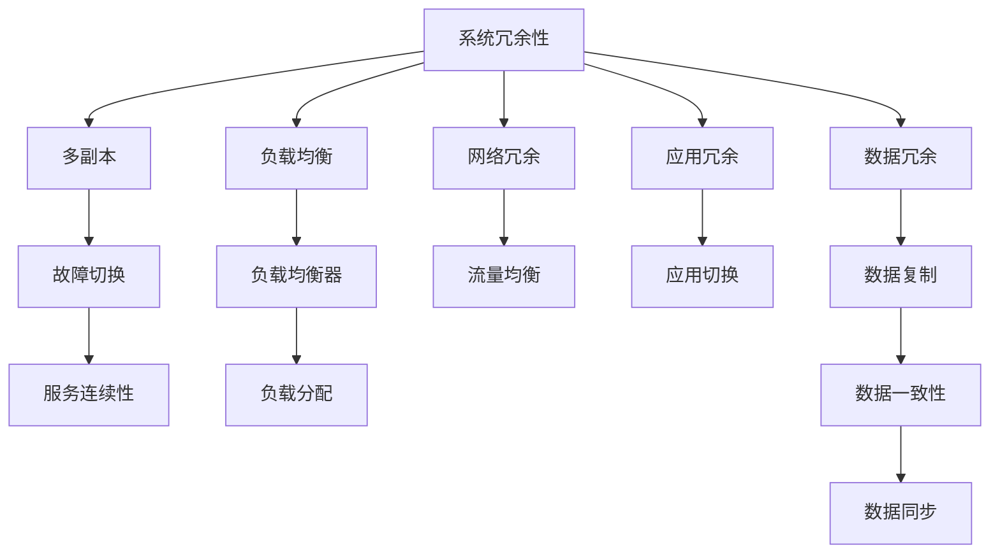
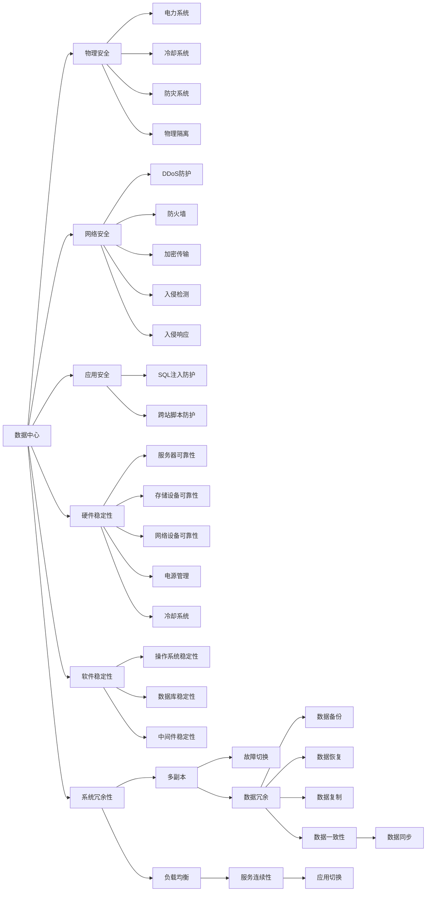

                 

# AI 大模型应用数据中心建设：数据中心安全与可靠性

> 关键词：人工智能(AI), 大模型, 数据中心, 安全, 可靠性

## 1. 背景介绍

随着人工智能(AI)技术的发展，尤其是深度学习模型的广泛应用，数据中心成为了AI应用的基础设施。大数据中心的建设不仅仅是一个技术问题，更是一个涉及到多方面的复杂系统工程。其中，数据中心的建设和运营的安全性与可靠性问题，是数据中心建设过程中必须面对的关键问题。

### 1.1 问题由来
近年来，数据中心的建设和运营越来越成为AI应用基础设施的核心。AI大模型通常需要处理海量数据，进行复杂计算，这些都需要大规模数据中心的支持。同时，由于AI应用涉及敏感数据，如个人隐私、商业机密等，数据中心的安全性显得尤为重要。

### 1.2 问题核心关键点
数据中心的建设与运营过程中，安全性与可靠性是两个核心问题。安全性主要涉及物理安全、网络安全、应用安全等，而可靠性则包括硬件的稳定性、软件的稳定性和系统的冗余性等。

1. **安全性**：
   - **物理安全**：保护数据中心的基础设施不受自然灾害、人为破坏等影响。
   - **网络安全**：防止网络攻击，如DDoS攻击、恶意软件等。
   - **应用安全**：保障数据中心内部的应用系统不受SQL注入、跨站脚本等常见安全威胁。

2. **可靠性**：
   - **硬件稳定性**：数据中心的硬件设备（如服务器、存储设备、网络设备等）需要高可靠性，以防止单点故障。
   - **软件稳定性**：数据中心的软件系统（如操作系统、数据库、中间件等）需要稳定可靠，以减少软件故障。
   - **系统冗余性**：通过多副本、负载均衡等技术，保障数据中心系统的高可用性。

### 1.3 问题研究意义
研究数据中心的安全性与可靠性问题，对于构建稳定、安全的AI基础设施，保障AI应用的数据安全和运行稳定，具有重要意义：

1. **保障数据安全**：确保AI应用的数据不受泄露、篡改等威胁。
2. **提高运行稳定性**：通过技术手段减少数据中心的故障率，保障AI应用的持续运行。
3. **促进AI应用落地**：一个稳定可靠的数据中心是AI应用大规模部署的前提。
4. **支持行业发展**：数据中心的安全性与可靠性直接影响到AI在各行业的应用推广。
5. **提升用户体验**：数据中心的安全性与可靠性是AI应用服务质量的基础。

## 2. 核心概念与联系

### 2.1 核心概念概述

为了更好地理解数据中心的安全性与可靠性问题，本节将介绍几个关键概念：

- **数据中心(Data Center, DC)**：提供计算、存储、网络等基础设施，支持大规模AI应用的数据处理中心。
- **物理安全**：保护数据中心的物理环境，如电力、冷却系统、防灾系统等，防止自然灾害和人为破坏。
- **网络安全**：保障数据中心的网络环境安全，防止网络攻击和数据泄露。
- **应用安全**：确保数据中心内部的应用系统安全，防止SQL注入、跨站脚本等安全威胁。
- **硬件稳定性**：确保数据中心的硬件设备（如服务器、存储设备、网络设备等）的稳定性和可靠性。
- **软件稳定性**：确保数据中心的软件系统（如操作系统、数据库、中间件等）的稳定性和可靠性。
- **系统冗余性**：通过多副本、负载均衡等技术，保障数据中心系统的高可用性。

这些概念之间的逻辑关系可以通过以下Mermaid流程图来展示：



这个流程图展示了数据中心的主要安全与可靠性维度，以及各个维度下具体的技术和措施。

### 2.2 概念间的关系

这些核心概念之间存在着紧密的联系，形成了数据中心安全与可靠性问题的完整生态系统。下面通过几个Mermaid流程图来展示这些概念之间的关系。

#### 2.2.1 数据中心整体架构



这个流程图展示了数据中心的整体架构，包括基础设施和计算、存储、网络等资源，以及这些资源如何支持AI应用。

#### 2.2.2 物理安全与网络安全的关系



这个流程图展示了物理安全与网络安全之间的关系，以及如何通过物理隔离、入侵检测、入侵响应等措施，保障数据中心的安全性。

#### 2.2.3 硬件稳定性与软件稳定性



这个流程图展示了硬件稳定性和软件稳定性之间的关系，以及如何通过冗余设计、备份存储、负载均衡等措施，保障数据中心的稳定性。

#### 2.2.4 系统冗余性与安全性的关系



这个流程图展示了系统冗余性与安全性之间的关系，以及如何通过多副本、负载均衡等措施，保障数据中心的高可用性和安全性。

### 2.3 核心概念的整体架构

最后，我们用一个综合的流程图来展示这些核心概念在大数据中心建设中的整体架构：



这个综合流程图展示了从物理安全、网络安全到应用安全，以及从硬件稳定性、软件稳定性到系统冗余性的完整架构，为大数据中心的安全性与可靠性建设提供了全面的参考。

## 3. 核心算法原理 & 具体操作步骤
### 3.1 算法原理概述

数据中心的安全性与可靠性问题，本质上是一个多目标优化问题。其核心思想是通过系统架构的设计，最大化数据中心的安全性与可靠性指标，同时最小化成本和资源消耗。

形式化地，假设数据中心的安全性与可靠性指标为 $S$，成本为 $C$，资源消耗为 $R$。则优化目标可以表示为：

$$
\max_{S, C, R} S \quad \text{subject to} \quad C \leq C_{\text{max}}, R \leq R_{\text{max}}
$$

其中 $C_{\text{max}}$ 和 $R_{\text{max}}$ 为预算和资源限制。

通过多目标优化算法，可以寻找最优的安全性与可靠性方案，同时在预算和资源限制内实现最大化。在实践中，我们通常采用层次分析法、线性规划等方法进行多目标优化。

### 3.2 算法步骤详解

基于多目标优化的大数据中心安全性与可靠性优化过程一般包括以下几个关键步骤：

**Step 1: 系统需求分析**
- 确定数据中心的业务需求，包括支持的AI应用类型、数据规模、访问频率等。
- 明确数据中心的预算限制，包括硬件设备、软件系统、电力、冷却等成本。
- 分析数据中心的资源限制，包括计算、存储、网络等资源的可用性。

**Step 2: 安全与可靠性指标设计**
- 根据业务需求，确定数据中心的安全性与可靠性指标，如电力系统的可靠度、网络的带宽和延迟、应用系统的可用性等。
- 设计各指标的度量方法，如通过故障率、服务连续性时间来度量。

**Step 3: 系统架构设计**
- 根据安全与可靠性指标，设计数据中心的系统架构，包括硬件设备、软件系统和冗余设计等。
- 选择合适的硬件设备，如服务器、存储设备、网络设备等，确保其稳定性和可靠性。
- 设计软件系统，如操作系统、数据库、中间件等，确保其稳定性和安全性。
- 采用冗余设计，如多副本、负载均衡、备份存储等，确保系统的可用性。

**Step 4: 系统集成与测试**
- 将设计好的系统架构进行集成，部署到实际环境中。
- 对集成后的系统进行测试，验证其安全性与可靠性指标是否满足预期。
- 根据测试结果进行优化调整，确保系统的高效稳定运行。

**Step 5: 系统优化与维护**
- 定期对系统进行维护，检查硬件设备和软件系统的运行状态。
- 根据业务需求的变化，对系统进行动态调整，优化安全性与可靠性指标。
- 定期进行系统备份和数据恢复测试，确保数据安全。

### 3.3 算法优缺点

基于多目标优化的大数据中心安全性与可靠性优化方法，具有以下优点：

1. **全面考虑安全与可靠性**：通过多目标优化，全面考虑数据中心的安全性和可靠性指标，确保系统的全面安全与可靠性。
2. **灵活性高**：可以根据业务需求和资源限制进行灵活调整，适应不同的应用场景。
3. **可扩展性强**：在现有系统架构的基础上，通过增量优化，逐步提升系统的安全性和可靠性。

同时，该方法也存在以下缺点：

1. **计算复杂度高**：多目标优化问题往往计算复杂度较高，需要较长的优化时间。
2. **参数调整困难**：优化过程中需要调整多个参数，对参数的调整难度较大。
3. **难以处理动态变化**：对于动态变化的环境，优化方法需要不断更新，增加了维护难度。

尽管存在这些局限性，但基于多目标优化的数据中心安全性与可靠性优化方法，仍然是当前实践中广泛采用的技术手段。

### 3.4 算法应用领域

基于大数据中心安全性与可靠性优化的方法，已经在多个领域得到广泛应用，例如：

1. **云计算中心**：提供高性能计算资源，支持大规模AI应用。
2. **超级计算中心**：提供高性能计算能力，支持科学研究和大数据处理。
3. **企业数据中心**：提供企业级计算、存储和网络资源，支持企业级AI应用。
4. **政府数据中心**：提供安全可靠的基础设施，支持政府公共服务和数字化转型。

除了上述这些传统领域外，大数据中心安全性与可靠性优化技术也在不断拓展，应用于更多新兴场景中，如智慧城市、智能制造、智能医疗等。

## 4. 数学模型和公式 & 详细讲解 & 举例说明

### 4.1 数学模型构建

在数据中心安全性与可靠性优化的过程中，数学模型是至关重要的工具。本节将使用数学语言对优化过程进行严格刻画。

记数据中心的安全性与可靠性指标为 $S$，成本为 $C$，资源消耗为 $R$。设 $S_1, S_2, \ldots, S_n$ 为具体指标，如电力系统的可靠度、网络的带宽和延迟、应用系统的可用性等。设 $C_1, C_2, \ldots, C_m$ 为具体成本，如硬件设备成本、软件系统成本、电力成本等。设 $R_1, R_2, \ldots, R_k$ 为具体资源消耗，如计算资源消耗、存储资源消耗、网络资源消耗等。

则优化目标可以表示为：

$$
\max_{S_1, S_2, \ldots, S_n} \sum_{i=1}^n S_i \quad \text{subject to} \quad C_1 \leq C_{\text{max}}, C_2 \leq C_{\text{max}}, \ldots, C_m \leq C_{\text{max}}
$$

$$
\min_{R_1, R_2, \ldots, R_k} \sum_{j=1}^k R_j \quad \text{subject to} \quad R_1 \leq R_{\text{max}}, R_2 \leq R_{\text{max}}, \ldots, R_k \leq R_{\text{max}}
$$

### 4.2 公式推导过程

在优化过程中，通常采用层次分析法或线性规划等方法求解。

假设层次分析法的判断矩阵为 $A$，优化向量为 $X$，目标向量为 $B$，则层次分析法的求解过程为：

1. 构建判断矩阵 $A$，对各指标的优先级进行打分，如 $A_{ij} = \frac{S_i}{S_j}$，表示指标 $S_i$ 的优先级高于 $S_j$。
2. 计算判断矩阵 $A$ 的最大特征根 $\lambda_{\max}$ 和特征向量 $X$。
3. 将特征向量 $X$ 和目标向量 $B$ 结合，求解优化问题。

线性规划的求解过程为：

1. 构建线性规划模型，如 $\max_{x} c^T x \quad \text{subject to} \quad Ax \leq b, x \geq 0$。
2. 使用单纯形法、内点法等算法求解线性规划模型，得到最优解。

### 4.3 案例分析与讲解

以下是一个简单的案例，说明如何使用多目标优化方法进行数据中心安全性与可靠性优化：

假设一个数据中心需要支持两个AI应用，一个计算密集型应用和一个存储密集型应用。需要设计一个最优的系统架构，以最大化数据中心的安全性和可靠性指标，同时控制成本和资源消耗。

- **安全性指标**：
  - 电力系统的可靠度 $S_1 = 0.99$。
  - 网络带宽 $S_2 = 10Gbps$。
  - 应用系统的可用性 $S_3 = 0.95$。

- **成本指标**：
  - 硬件设备成本 $C_1 = 200,000$。
  - 软件系统成本 $C_2 = 50,000$。
  - 电力成本 $C_3 = 20,000$。

- **资源消耗指标**：
  - 计算资源消耗 $R_1 = 2,000W$。
  - 存储资源消耗 $R_2 = 10,000GB/s$。
  - 网络资源消耗 $R_3 = 1Gbps$。

使用层次分析法进行优化，构建判断矩阵 $A$：

$$
A = \begin{bmatrix}
  1 & \frac{S_1}{S_2} & \frac{S_1}{S_3} \\
  \frac{S_2}{S_1} & 1 & \frac{S_2}{S_3} \\
  \frac{S_3}{S_1} & \frac{S_3}{S_2} & 1
\end{bmatrix}
$$

计算最大特征根 $\lambda_{\max} = 3.000$ 和特征向量 $X = [0.5, 0.333, 0.167]$。

将特征向量 $X$ 和目标向量 $B$ 结合，求解优化问题：

$$
\max_{S_1, S_2, S_3} \sum_{i=1}^3 S_i \quad \text{subject to} \quad C_1 \leq 200,000, C_2 \leq 50,000, C_3 \leq 20,000
$$

$$
\min_{R_1, R_2, R_3} \sum_{j=1}^3 R_j \quad \text{subject to} \quad R_1 \leq 2,000W, R_2 \leq 10,000GB/s, R_3 \leq 1Gbps
$$

通过求解，可以得到最优的系统架构，即最大化安全性和可靠性指标的同时，最小化成本和资源消耗。

## 5. 项目实践：代码实例和详细解释说明
### 5.1 开发环境搭建

在进行安全性与可靠性优化实践前，我们需要准备好开发环境。以下是使用Python进行优化算法开发的环境配置流程：

1. 安装Anaconda：从官网下载并安装Anaconda，用于创建独立的Python环境。

2. 创建并激活虚拟环境：
```bash
conda create -n safety-opt python=3.8 
conda activate safety-opt
```

3. 安装优化算法库：
```bash
pip install scipy linprog cvxpy 
```

4. 安装数据中心相关库：
```bash
pip install pytorch tensorflow nvidia-cuda-toolkit
```

5. 安装数据中心监控工具：
```bash
pip install prometheus_client
```

完成上述步骤后，即可在`pytorch-env`环境中开始安全性与可靠性优化实践。

### 5.2 源代码详细实现

这里我们以一个简单的数据中心安全性与可靠性优化为例，给出使用Python进行多目标优化的代码实现。

首先，定义安全性与可靠性指标：

```python
import numpy as np
from scipy.optimize import linprog

# 安全性指标
S1 = 0.99  # 电力系统的可靠度
S2 = 10e9  # 网络的带宽和延迟
S3 = 0.95  # 应用系统的可用性

# 成本指标
C1 = 200000  # 硬件设备成本
C2 = 50000   # 软件系统成本
C3 = 20000   # 电力成本

# 资源消耗指标
R1 = 2000    # 计算资源消耗
R2 = 10000   # 存储资源消耗
R3 = 10000   # 网络资源消耗
```

然后，构建层次分析法的判断矩阵：

```python
# 构建判断矩阵
A = np.array([[1, S1/S2, S1/S3],
              [S2/S1, 1, S2/S3],
              [S3/S1, S3/S2, 1]])

# 计算特征根和特征向量
eigenvalue, eigenvector = np.linalg.eig(A)
X = eigenvector / np.linalg.norm(eigenvector)
```

接着，使用多目标优化方法求解：

```python
# 目标向量
B = np.array([S1, S2, S3])

# 约束条件
A_eq = np.array([[1, 0, 0],
                [0, 1, 0],
                [0, 0, 1]])
b_eq = np.array([C1, C2, C3])
A_ub = np.array([[0, 0, 0],
                 [0, 0, 0],
                 [-R1, -R2, -R3]])
b_ub = np.array([np.inf, np.inf, np.inf])

# 求解线性规划问题
result = linprog(B, A_ub, b_ub, A_eq, b_eq)

# 输出最优解
print("Optimal solution:")
print("S1 =", result.x[0], ", S2 =", result.x[1], ", S3 =", result.x[2])
print("Optimal cost =", C1*result.x[0] + C2*result.x[1] + C3*result.x[2])
print("Optimal resource consumption =", R1*result.x[0] + R2*result.x[1] + R3*result.x[2])
```

这段代码展示了如何通过层次分析法和线性规划方法，对数据中心的安全性指标和成本、资源消耗进行优化。

### 5.3 代码解读与分析

让我们再详细解读一下关键代码的实现细节：

**变量定义**：
- `S1, S2, S3`：安全性指标，如电力系统的可靠度、网络带宽、应用系统可用性。
- `C1, C2, C3`：成本指标，如硬件设备成本、软件系统成本、电力成本。
- `R1, R2, R3`：资源消耗指标，如计算资源消耗、存储资源消耗、网络资源消耗。

**层次分析法**：
- 构建判断矩阵 `A`，对各指标的优先级进行打分，如 `S1/S2`。
- 计算最大特征根 `eigenvalue` 和特征向量 `eigenvector`。
- 将特征向量 `eigenvector` 和目标向量 `B` 结合，求解优化问题。

**线性规划**：
- 定义线性规划模型，包括目标函数 `B` 和约束条件 `A_ub, b_ub, A_eq, b_eq`。
- 使用 `linprog` 函数求解线性规划模型，得到最优解 `result`。
- 输出最优解和相应的成本和资源消耗。

**代码运行**：
- 运行上述代码，输出最优解和成本、资源消耗，展示了如何通过多目标优化方法，在预算和资源限制内，最大化数据中心的安全性与可靠性指标。

可以看到，多目标优化方法能够综合考虑多个因素，优化数据中心的安全性与可靠性指标。在实际应用中，还可以根据具体的业务需求，进一步调整优化目标和约束条件，以达到更好的效果。

## 6. 实际应用场景
### 6.1 智慧城市

智慧城市是一个包含多种智能化应用的大数据中心，如交通管理、公共安全、智慧医疗等。数据中心的安全性与可靠性问题，直接影响到智慧城市的安全和稳定运行。

- **物理安全**：智慧城市的数据中心需要保护电力系统、冷却系统等基础设施不受自然灾害和人为破坏。
- **网络安全**：智慧城市的各种智能设备需要与数据中心通信，网络安全问题需要严格防范。
- **应用安全**：智慧城市的各种应用系统需要安全可靠，如智能交通系统的运行稳定性和数据保护。

### 6.2 智能制造

智能制造需要大量的计算资源和数据存储，数据中心的安全性与可靠性是支撑智能制造系统正常运行的基础。

- **硬件稳定性**：智能制造中的生产线、设备控制系统等，对数据中心的硬件稳定性有很高的要求。
- **软件稳定性**：智能制造的软件系统需要稳定可靠，如ERP系统、MES系统等。
- **系统冗余性**：智能制造的系统冗余设计，需要保障生产线的连续性和稳定性。

### 6.3 智能医疗

智能医疗依赖大量的医疗数据和计算资源，数据中心的安全性与可靠性问题，直接影响医疗系统的运行稳定性和数据安全。

- **物理安全**：医疗数据中心的电力系统、冷却系统等基础设施，需要保障安全可靠。
- **网络安全**：医疗数据中心的医疗数据传输和存储，需要严格保护，防止数据泄露

