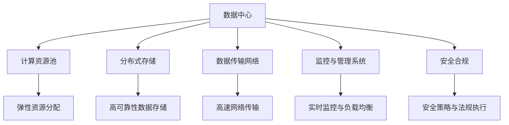
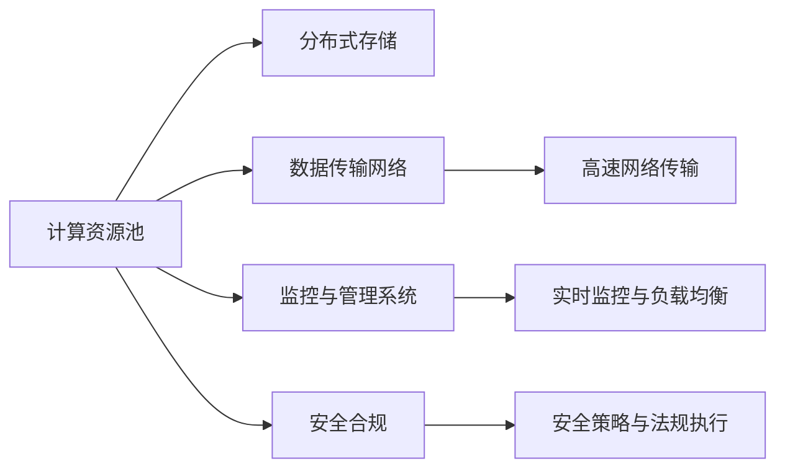
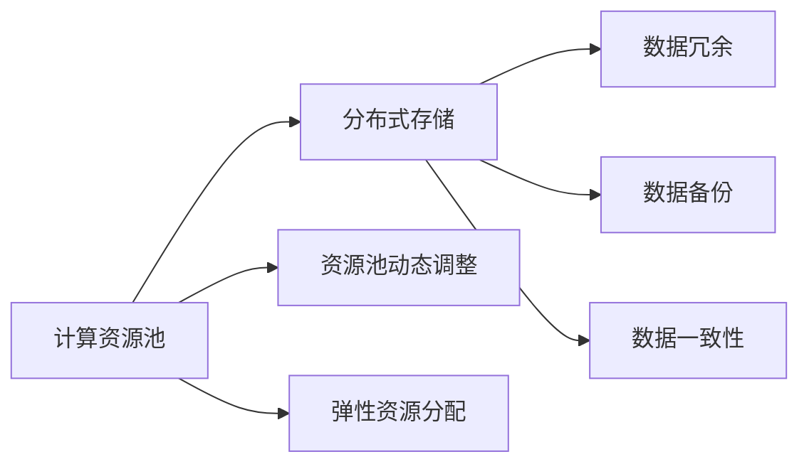
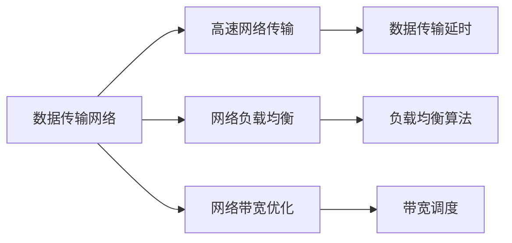
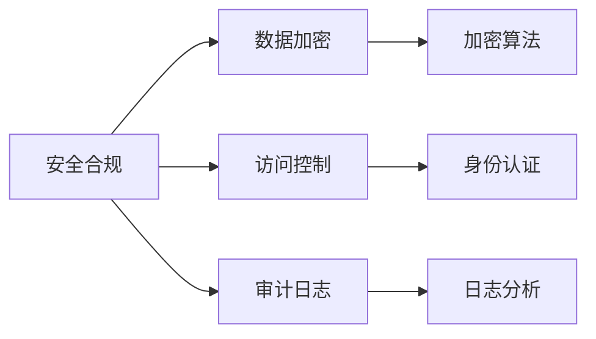
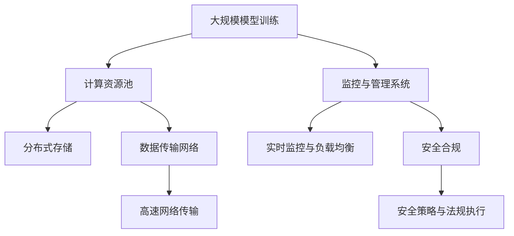

                 

# AI 大模型应用数据中心建设：数据中心标准与规范

## 1. 背景介绍

### 1.1 问题由来
在人工智能(AI)大模型时代，模型的训练和部署对数据中心的要求越来越高。传统数据中心主要围绕CPU、内存、存储等基础设施展开建设，而随着大模型的出现，数据的存储、处理和传输变得更为复杂，对数据中心的架构、管理和运维提出了新的挑战。如何构建一个高效、可靠、可扩展的数据中心，以支持AI大模型的训练和推理应用，成为当前IT行业的一个热点问题。

### 1.2 问题核心关键点
AI大模型数据中心的核心在于如何设计数据中心的软硬件架构，以支持大规模的模型训练和推理任务。其关键点包括：

1. **存储与带宽**：如何高效存储和传输海量数据。
2. **计算与网络**：如何高效计算与分布式网络传输。
3. **监控与管理**：如何实时监控和管理资源使用情况，保证服务稳定性。
4. **安全与合规**：如何保障数据和模型的安全性，符合法律法规要求。

### 1.3 问题研究意义
构建高质量的AI大模型数据中心，对于推动AI技术的发展和应用具有重要意义：

1. **加速AI模型训练**：通过优化数据中心基础设施，可以显著提高模型训练速度，缩短开发周期。
2. **提升AI应用性能**：高效的数据中心可以提供更强的计算能力，提升AI应用在实际场景中的性能。
3. **降低运营成本**：优化数据中心设计和管理流程，可以有效降低能源消耗和维护成本。
4. **保障数据安全**：构建数据中心时需要充分考虑数据和模型的安全性，防止数据泄露和模型滥用。
5. **支持模型迭代**：数据中心需要具备灵活扩展和快速迭代的能力，适应模型和应用的变化。

## 2. 核心概念与联系

### 2.1 核心概念概述

为了更好地理解AI大模型数据中心的构建，本节将介绍几个密切相关的核心概念：

- **数据中心(DC)**：由一系列计算、存储、网络设备组成，提供高性能、高可用性的计算和存储服务。
- **计算资源池(CRP)**：将数据中心的计算资源集中管理，提供弹性的计算资源分配。
- **分布式存储(DS)**：通过多台存储设备协同工作，提高数据存储的可靠性和可扩展性。
- **数据传输网络(DTN)**：用于高速、低延迟地传输数据，支持大规模模型训练和推理。
- **监控与管理系统(MMS)**：实时监控数据中心各项资源使用情况，进行负载均衡和管理调度。
- **安全合规(S&C)**：制定和执行数据中心的安全策略和法律法规要求，保障数据和模型安全。

这些概念之间的逻辑关系可以通过以下Mermaid流程图来展示：



这个流程图展示了大模型数据中心的核心概念及其之间的关系：

1. 数据中心由计算资源池、分布式存储、数据传输网络、监控与管理系统和安全合规等模块组成。
2. 计算资源池通过集中管理，提供弹性的资源分配，支持大规模模型训练和推理。
3. 分布式存储通过多台存储设备的协同工作，提高数据存储的可靠性和可扩展性。
4. 数据传输网络用于高速、低延迟地传输数据，满足大模型训练和推理的高带宽需求。
5. 监控与管理系统实时监控各项资源使用情况，进行负载均衡和管理调度，保障系统的稳定性和可靠性。
6. 安全合规模块制定和执行安全策略和法规要求，保障数据和模型的安全性。

### 2.2 概念间的关系

这些核心概念之间存在着紧密的联系，形成了大模型数据中心的完整生态系统。下面我通过几个Mermaid流程图来展示这些概念之间的关系。

#### 2.2.1 数据中心架构



这个流程图展示了大模型数据中心的整体架构，由计算资源池、分布式存储、数据传输网络、监控与管理系统和安全合规等模块组成，共同支撑大规模模型训练和推理。

#### 2.2.2 资源池与存储



这个流程图展示了计算资源池与分布式存储之间的关系。计算资源池通过集中管理，动态调整资源分配，支持弹性的计算需求。而分布式存储通过数据冗余、备份和一致性策略，提供高可靠性的数据存储服务。

#### 2.2.3 网络与监控



这个流程图展示了数据传输网络与监控之间的关系。数据传输网络通过高速网络传输和负载均衡算法，支持大规模数据传输。而监控系统通过实时监控网络负载和带宽使用情况，进行负载均衡和带宽调度，保障数据传输的稳定性和高效性。

#### 2.2.4 安全与合规



这个流程图展示了安全合规模块与数据安全之间的关系。安全合规模块通过数据加密、访问控制和审计日志等措施，保障数据和模型的安全性。同时，安全合规策略需要符合相关法律法规要求，确保数据处理和模型使用符合规范。

### 2.3 核心概念的整体架构

最后，我们用一个综合的流程图来展示这些核心概念在大模型数据中心中的整体架构：



这个综合流程图展示了从模型训练到数据传输，再到监控和安全管理的完整过程。大规模模型训练需要高性能的计算资源池和分布式存储支持，通过高速网络传输数据，监控系统实时监控和管理资源使用情况，安全合规策略保障数据和模型的安全性。通过这些模块的协同工作，构建出一个高效、可靠、可扩展的大模型数据中心。

## 3. 核心算法原理 & 具体操作步骤

### 3.1 算法原理概述

构建AI大模型数据中心的原理可以概括为以下几个关键点：

1. **计算资源集中管理**：通过集中管理计算资源，实现弹性资源分配和动态调整。
2. **数据存储冗余与备份**：通过分布式存储和数据冗余，提高数据存储的可靠性和可用性。
3. **高速网络传输**：通过优化数据传输网络，支持大规模数据的快速传输。
4. **实时监控与管理**：通过监控与管理系统，实时监控资源使用情况，进行负载均衡和管理调度。
5. **安全合规策略**：通过制定和执行安全策略，保障数据和模型的安全性，符合法律法规要求。

### 3.2 算法步骤详解

基于上述原理，AI大模型数据中心的构建主要包括以下几个关键步骤：

**Step 1: 设计数据中心架构**
- 根据业务需求，选择合适的硬件设备和软件系统，设计计算资源池、分布式存储、数据传输网络、监控与管理系统和安全合规等模块。
- 确定各模块之间的接口和数据传输协议，确保系统的高效协同。

**Step 2: 配置计算资源池**
- 根据业务需求，配置计算资源池的硬件设备，如服务器、GPU、TPU等。
- 定义资源池的资源类型和分配策略，如CPU、GPU、内存、存储等资源的优先级和分配算法。
- 对资源池进行动态调整和监控，确保资源分配的公平性和合理性。

**Step 3: 配置分布式存储**
- 根据业务需求，配置分布式存储的硬件设备，如SSD、HDD等存储设备。
- 设计数据冗余、备份和一致性策略，确保数据存储的高可靠性和可用性。
- 配置数据存储的接口和协议，支持大规模数据的高效读写。

**Step 4: 配置数据传输网络**
- 根据业务需求，配置数据传输网络的硬件设备，如交换机、路由器等。
- 设计网络负载均衡和带宽调度策略，确保数据传输的高带宽和低延时。
- 配置网络接口和协议，支持大规模数据的快速传输。

**Step 5: 配置监控与管理系统**
- 根据业务需求，配置监控与管理系统所需的硬件设备和软件系统。
- 设计监控系统的网络接口和协议，实现实时监控和负载均衡。
- 定义监控指标和报警规则，进行异常检测和故障处理。

**Step 6: 配置安全合规模块**
- 根据业务需求，配置安全合规模块所需的硬件设备和软件系统。
- 制定数据加密、访问控制和审计日志等安全策略。
- 配置安全合规模块的接口和协议，确保数据和模型的安全性。

**Step 7: 集成与测试**
- 将上述各模块集成到数据中心架构中，进行整体测试和调试。
- 验证系统的各项功能和性能指标，确保系统的高可用性和可靠性。
- 根据测试结果进行调整和优化，确保系统的稳定性和可扩展性。

### 3.3 算法优缺点

构建AI大模型数据中心的主要优点包括：

1. **高可靠性**：通过冗余和备份策略，提高数据存储和传输的可靠性，确保系统的稳定运行。
2. **高效性**：通过优化计算资源池和数据传输网络，支持大规模模型的训练和推理，提升AI应用的性能。
3. **可扩展性**：通过弹性资源分配和动态调整，支持AI模型和应用的高频迭代和扩展。
4. **安全性**：通过安全合规策略，保障数据和模型的安全性，符合法律法规要求。
5. **灵活性**：通过灵活的架构设计和管理调度，适应不同的业务需求和数据中心环境。

同时，构建AI大模型数据中心也存在一些局限性：

1. **高成本**：大规模硬件设备和高性能计算资源需要较高的投资和维护成本。
2. **复杂性**：数据中心的构建和管理需要专业的知识和技能，对运维团队的要求较高。
3. **依赖性**：数据中心高度依赖硬件设备和网络基础设施，对环境要求较高。
4. **能耗高**：大规模计算和存储设备的运行需要大量的电力消耗，对环境影响较大。

### 3.4 算法应用领域

AI大模型数据中心的应用领域非常广泛，主要包括：

- **高性能计算中心(HPC)**：支持大规模并行计算和高性能计算任务，如科学计算、数据分析等。
- **云计算中心(CC)**：提供弹性的计算和存储资源，支持云应用和服务的高效运行。
- **大数据中心(DBC)**：支持大规模数据的存储、处理和分析，如数据仓库、数据湖等。
- **边缘计算中心(EC)**：支持本地计算和数据处理，降低数据传输延迟和带宽成本。
- **人工智能中心(AIC)**：提供AI模型和应用的训练、推理、管理和运维服务。

## 4. 数学模型和公式 & 详细讲解 & 举例说明

### 4.1 数学模型构建

构建AI大模型数据中心可以抽象为以下几个数学模型：

1. **资源池模型**
   - 定义计算资源池的资源类型和分配策略，如CPU、GPU、内存、存储等资源的优先级和分配算法。
   - 假设资源池中有$n$种资源类型，每种资源类型有$m$个实例，分配策略为最小资源优先(MLP)，则资源分配问题可以表示为：
     \[
     \min_{x_{ij}} \sum_{i=1}^{n} \sum_{j=1}^{m} x_{ij} c_{ij}
     \]
     其中$x_{ij}$表示第$i$种资源类型第$j$个实例的分配量，$c_{ij}$表示资源$i$的使用成本。

2. **存储模型**
   - 定义分布式存储的冗余和备份策略，如数据冗余因子$k$和备份副本数$r$。
   - 假设存储系统中有$k$个冗余副本和$r$个备份副本，数据块大小为$s$，则数据冗余和备份问题可以表示为：
     \[
     \min_{x_{ik}, y_{ir}} \sum_{i=1}^{k} x_{ik} + \sum_{i=1}^{r} y_{ir}
     \]
     其中$x_{ik}$表示第$i$个数据块的第$k$个冗余副本的存储量，$y_{ir}$表示第$i$个数据块的备份副本的存储量。

3. **网络模型**
   - 定义数据传输网络的负载均衡和带宽调度策略。
   - 假设网络中有$n$个节点，节点$i$的带宽为$b_i$，数据传输量为$d_i$，则网络带宽调度问题可以表示为：
     \[
     \min_{x_{ij}} \sum_{i=1}^{n} \sum_{j=1}^{n} x_{ij} b_j
     \]
     其中$x_{ij}$表示节点$i$向节点$j$传输的数据量。

4. **监控模型**
   - 定义监控系统的监控指标和报警规则，进行实时监控和异常检测。
   - 假设监控系统中有$m$个监控指标，第$i$个指标的阈值为$\theta_i$，监控结果为$x_i$，则监控问题可以表示为：
     \[
     \min_{x_i} \sum_{i=1}^{m} w_i \delta(x_i, \theta_i)
     \]
     其中$w_i$表示第$i$个指标的权重，$\delta(x_i, \theta_i)$表示监控结果$x_i$是否超出阈值$\theta_i$。

5. **安全模型**
   - 定义安全合规模块的安全策略和法规要求。
   - 假设安全策略中有$r$个策略，第$i$个策略的权重为$\alpha_i$，策略执行结果为$x_i$，则安全策略问题可以表示为：
     \[
     \min_{x_i} \sum_{i=1}^{r} \alpha_i x_i
     \]
     其中$\alpha_i$表示第$i$个策略的权重，$x_i$表示第$i$个策略的执行情况。

### 4.2 公式推导过程

下面将对上述数学模型进行详细的推导和讲解：

**资源池模型**
- 假设资源池中有$n$种资源类型，每种资源类型有$m$个实例，分配策略为最小资源优先(MLP)，则资源分配问题可以表示为：
  \[
  \min_{x_{ij}} \sum_{i=1}^{n} \sum_{j=1}^{m} x_{ij} c_{ij}
  \]
  其中$x_{ij}$表示第$i$种资源类型第$j$个实例的分配量，$c_{ij}$表示资源$i$的使用成本。

  将问题转换为线性规划问题，求解最优解$x_{ij}$。

**存储模型**
- 假设存储系统中有$k$个冗余副本和$r$个备份副本，数据块大小为$s$，则数据冗余和备份问题可以表示为：
  \[
  \min_{x_{ik}, y_{ir}} \sum_{i=1}^{k} x_{ik} + \sum_{i=1}^{r} y_{ir}
  \]
  其中$x_{ik}$表示第$i$个数据块的第$k$个冗余副本的存储量，$y_{ir}$表示第$i$个数据块的备份副本的存储量。

  将问题转换为线性规划问题，求解最优解$x_{ik}$和$y_{ir}$。

**网络模型**
- 假设网络中有$n$个节点，节点$i$的带宽为$b_i$，数据传输量为$d_i$，则网络带宽调度问题可以表示为：
  \[
  \min_{x_{ij}} \sum_{i=1}^{n} \sum_{j=1}^{n} x_{ij} b_j
  \]
  其中$x_{ij}$表示节点$i$向节点$j$传输的数据量。

  将问题转换为线性规划问题，求解最优解$x_{ij}$。

**监控模型**
- 假设监控系统中有$m$个监控指标，第$i$个指标的阈值为$\theta_i$，监控结果为$x_i$，则监控问题可以表示为：
  \[
  \min_{x_i} \sum_{i=1}^{m} w_i \delta(x_i, \theta_i)
  \]
  其中$w_i$表示第$i$个指标的权重，$\delta(x_i, \theta_i)$表示监控结果$x_i$是否超出阈值$\theta_i$。

  将问题转换为线性规划问题，求解最优解$x_i$。

**安全模型**
- 假设安全策略中有$r$个策略，第$i$个策略的权重为$\alpha_i$，策略执行结果为$x_i$，则安全策略问题可以表示为：
  \[
  \min_{x_i} \sum_{i=1}^{r} \alpha_i x_i
  \]
  其中$\alpha_i$表示第$i$个策略的权重，$x_i$表示第$i$个策略的执行情况。

  将问题转换为线性规划问题，求解最优解$x_i$。

### 4.3 案例分析与讲解

**案例分析：某企业AI大模型数据中心构建**

某企业计划构建一个AI大模型数据中心，用于支持深度学习模型的训练和推理。根据业务需求，企业选择了一个具有高计算能力和高速网络传输能力的数据中心。

**Step 1: 设计数据中心架构**

企业选择了一种高性能计算集群和分布式存储系统作为数据中心的核心架构，并设计了计算资源池、分布式存储、数据传输网络、监控与管理系统和安全合规等模块。计算资源池使用HPC集群，由256个节点组成，每个节点配置32个GPU和64个CPU，总计算能力为512GPU和1024CPU。分布式存储系统使用Hadoop HDFS，配置了5个数据节点，每个节点存储容量为16TB。数据传输网络使用SDN技术，部署了OpenFlow控制器，支持网络流量调度和负载均衡。监控与管理系统使用Prometheus和Grafana，实现实时监控和可视化。安全合规模块使用OpenSSL和LDAP认证，保障数据和模型的安全性。

**Step 2: 配置计算资源池**

企业对计算资源池进行了详细配置，定义了CPU、GPU、内存、存储等资源的优先级和分配算法。对于GPU资源，优先分配给深度学习训练任务，确保资源高效利用。对于CPU资源，优先分配给推理任务，保障响应速度。对于内存和存储资源，优先分配给数据预处理任务，减少I/O延迟。

**Step 3: 配置分布式存储**

企业对分布式存储进行了详细配置，定义了数据冗余和备份策略。对于数据块，配置了3个冗余副本和1个备份副本，确保数据存储的可靠性和可用性。对于数据备份，配置了周期性备份策略，每天备份一次，确保数据的时效性和完整性。

**Step 4: 配置数据传输网络**

企业对数据传输网络进行了详细配置，定义了网络负载均衡和带宽调度策略。对于网络流量，使用SDN技术进行动态调度，确保数据传输的高带宽和低延时。对于网络带宽，使用流量整形算法进行优化，确保网络带宽的公平分配。

**Step 5: 配置监控与管理系统**

企业对监控与管理系统进行了详细配置，定义了监控指标和报警规则。对于计算资源，监控CPU利用率、GPU利用率和内存使用情况，进行实时报警和调度。对于存储资源，监控磁盘I/O和带宽使用情况，进行负载均衡和带宽调度。对于网络资源，监控网络流量和延迟，进行实时监控和异常检测。

**Step 6: 配置安全合规模块**

企业对安全合规模块进行了详细配置，定义了安全策略和法规要求。对于数据加密，使用AES加密算法，保障数据传输和存储的安全性。对于访问控制，使用LDAP认证，确保数据访问的合法性和合规性。对于审计日志，记录所有数据访问和操作，进行日志分析和审计。

**Step 7: 集成与测试**

企业将上述各模块集成到数据中心架构中，进行了全面的测试和调试。测试结果显示，数据中心的各项功能满足预期，计算资源池、分布式存储、数据传输网络、监控与管理系统和安全合规等模块协同工作，实现了高效、可靠、可扩展的AI大模型数据中心。

## 5. 项目实践：代码实例和详细解释说明

### 5.1 开发环境搭建

在进行AI大模型数据中心构建的实践前，我们需要准备好开发环境。以下是使用Python进行PyTorch开发的环境配置流程：

1. 安装Anaconda：从官网下载并安装Anaconda，用于创建独立的Python环境。

2. 创建并激活虚拟环境：
```bash
conda create -n pytorch-env python=3.8 
conda activate pytorch-env
```

3. 安装PyTorch：根据CUDA版本，从官网获取对应的安装命令。例如：
```bash
conda install pytorch torchvision torchaudio cudatoolkit=11.1 -c pytorch -c conda-forge
```

4. 安装Transformers库：
```bash
pip install transformers
```

5. 安装各类工具包：
```bash
pip install numpy pandas scikit-learn matplotlib tqdm jupyter notebook ipython
```

完成上述步骤后，即可在`pytorch-env`环境中开始数据中心构建的实践。

### 5.2 源代码详细实现

这里我们以构建一个简单的AI大模型数据中心为例，给出使用Python进行PyTorch和Hadoop开发的源代码实现。

首先，我们需要定义数据中心的核心组件，包括计算资源池、分布式存储、数据传输网络、监控与管理系统和安全合规等模块。

```python
import torch
import hadoop
import prometheus_client
import logging
from transformers import BertForTokenClassification, AdamW

# 计算资源池定义
class ComputePool:
    def __init__(self):
        self.nodes = []
    
    def add_node(self, node):
        self.nodes.append(node)
    
    def allocate_resource(self, resource_type, amount):
        for node in self.nodes:
            if resource_type in node.available_resources:
                node.allocate_resource(resource_type, amount)
                logging.info(f"Resource {resource_type} {amount} allocated to {node.node_id}")
                return True
        logging.error(f"Resource {resource_type} {amount} not available")
        return False

# 分布式存储定义
class DistributedStorage:
    def __init__(self):
        self.data_nodes = []
    
    def add_data_node(self, data_node):
        self.data_nodes.append(data_node)
    
    def allocate_data(self, block_id, amount):
        for data_node in self.data_nodes:
            if data_node.has_space(block_id, amount):
                data_node.allocate_data(block_id, amount)
                logging.info(f"Block {block_id} {amount} allocated to {data_node.node_id}")
                return True
        logging.error(f"Block {block_id} {amount} not available")
        return False

# 数据传输网络定义
class DataTransferNetwork:
    def __init__(self):
        self.network_nodes = []
    
    def add_network_node(self, network_node):
        self.network_nodes.append(network_node)
    
    def allocate_network带宽(self, node_id, amount):
        for network_node in self.network_nodes:
            if network_node.node_id == node_id:
                network_node.allocate_bandwidth(amount)
                logging.info(f"Bandwidth {amount} allocated to node {node_id}")
                return True
        logging.error(f"Node {node_id} not found")
        return False

# 监控与管理系统定义
class MonitorManagementSystem:
    def __init__(self):
        self.metrics = []
    
    def add_metric(self, metric):
        self.metrics.append(metric)
    
    def allocate_monitor(self, metric):
        for metric in self.metrics:
            metric.allocate_monitor()
            logging.info(f"Monitor allocated for {metric.name}")
            return True
        logging.error(f"Monitor allocation failed")
        return False

# 安全合规模块定义
class SecurityCompliance:
    def __init__(self):
        self.strategies = []
    
    def add_strategy(self, strategy):
        self.strategies.append(strategy)
    
    def allocate_security(self, strategy):
        for strategy in self.strategies:
            strategy.allocate_security()
            logging.info(f"Security allocated for {strategy.name}")
            return True
        logging

