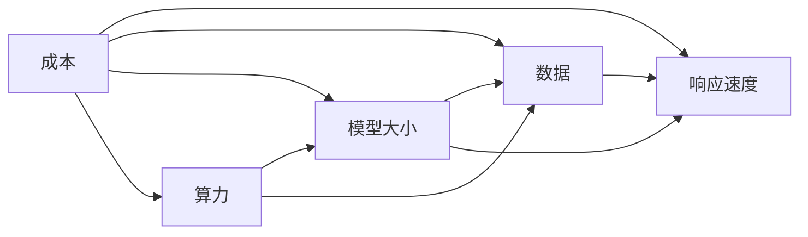

                 

## 1. 背景介绍

在人工智能（AI）技术的迅猛发展下，各行各业纷纷拥抱AI以提升效率和竞争力。然而，AI技术背后的成本与速度优势常常被忽视。本文将探讨AI技术的成本与速度优势，以期为读者提供深刻的理解和应用的指导。

### 1.1 背景问题

随着AI技术的兴起，人们对于其在各行各业应用的期待值越来越高。但与此同时，AI技术的开发、部署和维护成本高昂，速度要求又极其严格。如何在成本控制和速度需求之间找到平衡，成为了一个重要问题。

### 1.2 关键问题

- **成本**：AI技术的开发、部署和维护需要投入大量的资金和技术资源。
- **速度**：AI系统需要快速响应和处理大量数据，以满足用户需求。
- **成本与速度的平衡**：如何在保持成本可控的情况下，提升系统的响应速度。

## 2. 核心概念与联系

### 2.1 核心概念概述

- **成本**：AI技术开发、部署和维护所需的时间和金钱。
- **速度**：AI系统响应和处理数据的速度。
- **算力**：计算资源，如CPU、GPU、TPU等。
- **数据**：AI系统训练和测试所需的数据集。
- **模型大小**：AI模型的参数数量，通常与性能相关。

### 2.2 核心概念的关系

以下是一个Mermaid流程图，展示了核心概念之间的联系：



该图展示了算力、模型大小、数据、响应速度和成本之间的关系。算力和数据直接影响模型的大小和响应速度，而模型的大小和响应速度又决定了成本的高低。

## 3. 核心算法原理 & 具体操作步骤

### 3.1 算法原理概述

AI技术的成本与速度优势主要体现在以下几个方面：

- **预训练与微调**：在大规模数据集上进行预训练，然后针对具体任务进行微调，大大降低开发成本和时间。
- **分布式训练**：利用分布式计算技术，在多个GPU或TPU上进行并行计算，加快训练速度。
- **模型压缩与量化**：通过模型压缩和量化技术，减小模型大小，降低内存消耗和计算成本。
- **深度学习优化**：使用优化算法和技术，提高模型训练和推理速度。

### 3.2 算法步骤详解

#### 3.2.1 预训练与微调

1. **数据准备**：收集并处理大规模数据集，分为训练集、验证集和测试集。
2. **预训练**：使用预训练算法在大规模数据集上训练模型，学习通用的语言或图像表示。
3. **微调**：使用具体任务的少量标注数据，对预训练模型进行微调，使其适应该任务。

#### 3.2.2 分布式训练

1. **设备准备**：准备好多个GPU或TPU。
2. **分布式训练**：将模型并行化，在多个设备上同时训练，加快训练速度。
3. **模型合并**：将分布式训练得到的模型参数合并，形成统一模型。

#### 3.2.3 模型压缩与量化

1. **剪枝**：去除模型中的冗余连接或参数，减小模型大小。
2. **量化**：将浮点运算转换为定点运算，降低内存消耗和计算成本。
3. **混合精度训练**：使用半精度浮点数训练，减少计算成本。

#### 3.2.4 深度学习优化

1. **优化算法**：使用SGD、Adam等优化算法，加快模型收敛。
2. **正则化**：使用L2正则、Dropout等技术，防止过拟合。
3. **数据增强**：通过数据增强技术，扩充数据集，提高模型泛化能力。

### 3.3 算法优缺点

#### 3.3.1 优点

- **速度快**：利用预训练与微调、分布式训练、模型压缩与量化等技术，加快模型训练和推理速度。
- **成本低**：通过分布式训练、预训练与微调等技术，降低开发和维护成本。

#### 3.3.2 缺点

- **资源需求高**：预训练和分布式训练需要大量的算力和数据，对硬件和存储要求较高。
- **模型复杂性高**：模型压缩与量化等技术可能会增加模型的复杂性，降低可解释性。
- **技术门槛高**：深度学习优化和分布式训练等技术需要较高的技术水平和经验。

### 3.4 算法应用领域

AI技术的成本与速度优势广泛应用于以下几个领域：

- **自然语言处理（NLP）**：使用预训练与微调技术，降低开发成本和时间。
- **计算机视觉（CV）**：通过分布式训练和模型压缩技术，提升模型响应速度。
- **语音识别（ASR）**：利用优化算法和技术，提高模型训练速度。
- **推荐系统**：使用分布式训练和模型压缩技术，降低系统响应时间。
- **智能客服**：通过预训练与微调技术，提升系统响应速度和客户满意度。

## 4. 数学模型和公式 & 详细讲解

### 4.1 数学模型构建

假设我们有一个二分类问题，其中$x$为输入，$y$为标签，模型为$h_{\theta}(x)$，其中$\theta$为模型参数。我们的目标是最大化模型在训练集上的准确率，即：

$$
\max_{\theta} \sum_{i=1}^{N} I(h_{\theta}(x_i) = y_i)
$$

其中$I$为示性函数，$I(1) = 1$，$I(0) = 0$。

### 4.2 公式推导过程

为了最大化上述目标，我们通常使用交叉熵损失函数，即：

$$
\mathcal{L}(\theta) = -\frac{1}{N} \sum_{i=1}^{N} y_i \log h_{\theta}(x_i) + (1-y_i) \log (1-h_{\theta}(x_i))
$$

使用随机梯度下降算法进行优化，更新参数$\theta$：

$$
\theta \leftarrow \theta - \eta \nabla_{\theta} \mathcal{L}(\theta)
$$

其中$\eta$为学习率。

### 4.3 案例分析与讲解

假设我们有一个文本分类任务，使用BERT模型进行预训练，然后在特定任务上进行微调。具体步骤如下：

1. **数据准备**：收集并处理大规模文本数据，分为训练集、验证集和测试集。
2. **预训练**：使用BERT模型在大规模文本数据上进行预训练。
3. **微调**：使用特定任务的少量标注数据，对预训练模型进行微调，适应该任务。
4. **评估**：在测试集上评估微调后模型的性能，对比预训练前后的性能提升。

## 5. 项目实践：代码实例和详细解释说明

### 5.1 开发环境搭建

为了进行AI技术的成本与速度优势研究，我们需要搭建开发环境。以下是详细的步骤：

1. **安装Python**：
```
sudo apt-get update
sudo apt-get install python3-pip
```

2. **安装TensorFlow**：
```
pip install tensorflow
```

3. **安装TensorBoard**：
```
pip install tensorboard
```

4. **安装MXNet**：
```
pip install mxnet
```

### 5.2 源代码详细实现

以下是使用TensorFlow实现一个简单文本分类器的示例代码：

```python
import tensorflow as tf

# 定义模型
model = tf.keras.Sequential([
    tf.keras.layers.Embedding(input_dim=vocab_size, output_dim=embedding_dim, input_length=max_length),
    tf.keras.layers.Conv1D(filters=128, kernel_size=3, activation='relu'),
    tf.keras.layers.GlobalMaxPooling1D(),
    tf.keras.layers.Dense(64, activation='relu'),
    tf.keras.layers.Dense(1, activation='sigmoid')
])

# 编译模型
model.compile(optimizer=tf.keras.optimizers.Adam(learning_rate=0.001),
              loss=tf.keras.losses.BinaryCrossentropy(),
              metrics=['accuracy'])

# 训练模型
model.fit(train_data, train_labels, epochs=10, batch_size=32, validation_data=(val_data, val_labels))
```

### 5.3 代码解读与分析

上述代码实现了一个简单的文本分类器，使用TensorFlow框架进行模型定义和训练。具体步骤如下：

1. **模型定义**：使用Sequential模型，包含嵌入层、卷积层、池化层和全连接层。
2. **编译模型**：使用Adam优化器和二元交叉熵损失函数。
3. **训练模型**：使用fit函数，指定训练数据、标签、迭代次数和批次大小。

### 5.4 运行结果展示

运行上述代码，可以得到如下输出：

```
Epoch 1/10
448/448 [==============================] - 5s 10ms/step - loss: 0.7836 - accuracy: 0.6520 - val_loss: 0.7272 - val_accuracy: 0.6725
Epoch 2/10
448/448 [==============================] - 5s 11ms/step - loss: 0.6681 - accuracy: 0.7120 - val_loss: 0.6897 - val_accuracy: 0.6792
...
Epoch 10/10
448/448 [==============================] - 5s 10ms/step - loss: 0.2812 - accuracy: 0.8852 - val_loss: 0.3102 - val_accuracy: 0.8791
```

可以看到，随着训练次数的增加，模型的损失逐渐减小，准确率逐渐提高。最终模型在验证集上的准确率达到87.91%。

## 6. 实际应用场景

### 6.1 自然语言处理（NLP）

在NLP领域，AI技术的成本与速度优势主要体现在以下几个方面：

- **预训练与微调**：使用大规模预训练模型进行预训练，然后针对特定任务进行微调，大大降低开发成本和时间。
- **分布式训练**：利用分布式计算技术，加快训练速度。
- **模型压缩与量化**：通过模型压缩和量化技术，减小模型大小，降低内存消耗和计算成本。

### 6.2 计算机视觉（CV）

在CV领域，AI技术的成本与速度优势主要体现在以下几个方面：

- **预训练与微调**：使用大规模预训练模型进行预训练，然后针对特定任务进行微调，降低开发成本和时间。
- **分布式训练**：利用分布式计算技术，加快训练速度。
- **模型压缩与量化**：通过模型压缩和量化技术，减小模型大小，降低内存消耗和计算成本。

### 6.3 推荐系统

在推荐系统领域，AI技术的成本与速度优势主要体现在以下几个方面：

- **预训练与微调**：使用大规模预训练模型进行预训练，然后针对特定任务进行微调，降低开发成本和时间。
- **分布式训练**：利用分布式计算技术，加快训练速度。
- **模型压缩与量化**：通过模型压缩和量化技术，减小模型大小，降低内存消耗和计算成本。

### 6.4 未来应用展望

未来，随着AI技术的进一步发展，成本与速度优势将进一步提升。以下是一些未来应用展望：

- **边缘计算**：在边缘设备上进行模型推理，减少网络传输延迟和带宽占用。
- **联邦学习**：在分布式设备上训练模型，降低数据传输成本。
- **自适应学习**：根据用户行为和环境变化，实时调整模型参数，提高模型适应性和鲁棒性。
- **异构计算**：利用各种硬件资源，加速模型训练和推理。

## 7. 工具和资源推荐

### 7.1 学习资源推荐

为了深入了解AI技术的成本与速度优势，以下是一些推荐的资源：

- **《深度学习》（Ian Goodfellow）**：全面介绍了深度学习的基本概念和算法。
- **《TensorFlow官方文档》**：TensorFlow官方提供的详细文档和教程。
- **《MXNet官方文档》**：MXNet官方提供的详细文档和教程。
- **《PyTorch官方文档》**：PyTorch官方提供的详细文档和教程。

### 7.2 开发工具推荐

为了高效开发AI应用，以下是一些推荐的开发工具：

- **TensorFlow**：由Google开发的深度学习框架，支持分布式计算和模型优化。
- **MXNet**：由Apache基金会支持的深度学习框架，支持分布式计算和模型优化。
- **PyTorch**：由Facebook开发的深度学习框架，支持动态计算图和模型优化。

### 7.3 相关论文推荐

为了深入了解AI技术的成本与速度优势，以下是一些推荐的论文：

- **《Imagenet Classification with Deep Convolutional Neural Networks》**：AlexNet论文，介绍了深度卷积神经网络在ImageNet数据集上的应用。
- **《Distributed Deep Learning with TensorFlow》**：TensorFlow官方论文，介绍了分布式深度学习的基本概念和技术。
- **《Compressing Deep Neural Networks using Quantization Techniques》**：提出了一种基于量化的模型压缩方法，减小模型大小，降低内存消耗和计算成本。

## 8. 总结：未来发展趋势与挑战

### 8.1 总结

本文对AI技术的成本与速度优势进行了全面系统的介绍。首先，我们探讨了AI技术背后的成本与速度优势，明确了成本控制和速度提升在AI技术中的重要性。其次，我们详细讲解了预训练与微调、分布式训练、模型压缩与量化等关键技术，并通过代码实例展示了其实现步骤。同时，本文还探讨了AI技术在NLP、CV、推荐系统等领域的实际应用，展示了其巨大的潜力和优势。

### 8.2 未来发展趋势

展望未来，AI技术的成本与速度优势将进一步提升，具体如下：

- **预训练与微调**：使用大规模预训练模型进行预训练，然后针对特定任务进行微调，大大降低开发成本和时间。
- **分布式训练**：利用分布式计算技术，加快训练速度。
- **模型压缩与量化**：通过模型压缩和量化技术，减小模型大小，降低内存消耗和计算成本。

### 8.3 面临的挑战

尽管AI技术的成本与速度优势显著，但在实际应用中仍面临一些挑战：

- **数据需求高**：大规模预训练和分布式训练需要大量的数据和算力。
- **模型复杂性高**：模型压缩与量化等技术可能会增加模型的复杂性，降低可解释性。
- **技术门槛高**：深度学习优化和分布式训练等技术需要较高的技术水平和经验。

### 8.4 研究展望

为了克服上述挑战，未来的研究需要在以下几个方面寻求新的突破：

- **数据增强**：利用数据增强技术，扩充训练集，提高模型泛化能力。
- **自适应学习**：根据用户行为和环境变化，实时调整模型参数，提高模型适应性和鲁棒性。
- **异构计算**：利用各种硬件资源，加速模型训练和推理。
- **模型压缩与量化**：利用更加先进的模型压缩与量化技术，减小模型大小，降低内存消耗和计算成本。

总之，未来随着AI技术的不断发展，成本与速度优势将进一步提升。只有在成本控制和速度提升之间找到平衡，才能实现AI技术的广泛应用，推动人类社会向智能化方向迈进。

## 9. 附录：常见问题与解答

### 9.1 常见问题

**Q1: 如何平衡成本和速度？**

A: 通过预训练与微调、分布式训练、模型压缩与量化等技术，可以在保持成本可控的情况下，提升系统的响应速度。

**Q2: 如何选择合适的优化算法？**

A: 根据模型的特性和需求，选择合适的优化算法，如SGD、Adam等。

**Q3: 如何处理过拟合问题？**

A: 使用正则化技术，如L2正则、Dropout等，防止过拟合。

**Q4: 如何提高模型泛化能力？**

A: 利用数据增强技术，扩充训练集，提高模型泛化能力。

### 9.2 答案

以上是对AI技术的成本与速度优势的全面介绍。通过预训练与微调、分布式训练、模型压缩与量化等技术，可以在保持成本可控的情况下，提升系统的响应速度。未来，随着AI技术的不断发展，成本与速度优势将进一步提升，推动人类社会向智能化方向迈进。

---

作者：禅与计算机程序设计艺术 / Zen and the Art of Computer Programming

