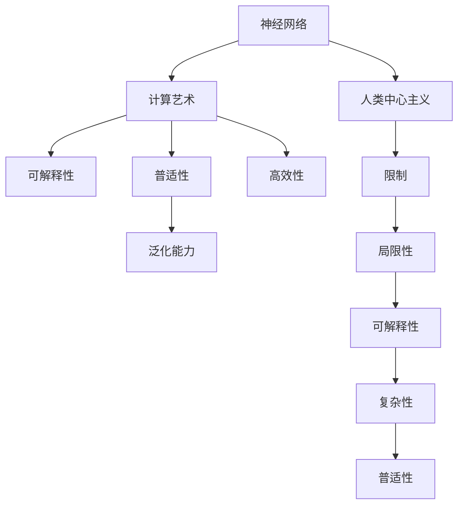
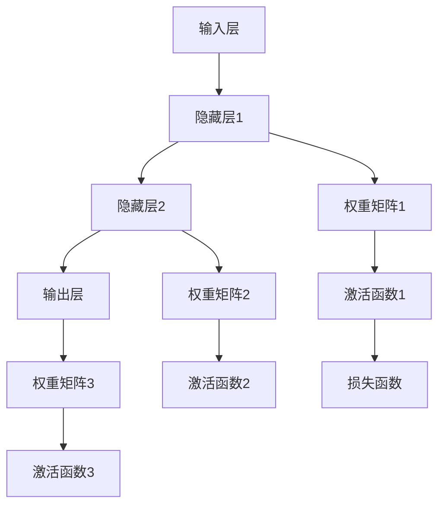

                 

# AI 神经网络计算艺术之禅：破除人类中心主义的傲慢

> 关键词：神经网络,计算艺术,人类中心主义,深度学习,机器智能,禅与计算

## 1. 背景介绍

### 1.1 问题由来

随着人工智能(AI)技术的迅猛发展，深度学习(Deep Learning)在图像识别、自然语言处理、语音识别等多个领域取得了革命性的突破。特别是神经网络(Neural Networks)的广泛应用，不仅在计算机视觉领域创造了前所未有的视觉效果，还在语言理解、语音识别等领域展现出了强大的处理能力。然而，这些高度复杂的神经网络模型，其设计背后的核心思路仍然深受人类中心主义的思维方式所影响。

### 1.2 问题核心关键点

当前深度学习范式中，神经网络的设计与训练，尤其是关键层的设计与训练，往往受到人类先验知识的影响。例如，卷积神经网络(CNN)的卷积核设计，循环神经网络(RNN)中的循环结构设计，都在很大程度上体现出了人类对问题认知的理解。这种人类中心主义的设计思路，虽然在一定程度上提升了模型的表达能力，但也带来了一系列问题：

1. 模型的可解释性差：由于神经网络的结构复杂性，其在具体应用中往往难以被解释。
2. 模型的泛化能力弱：人类先验知识可能无法很好地泛化到新的数据和任务上，导致模型在未知数据上表现不佳。
3. 模型的局限性强：人类中心主义的设计思路往往忽视了某些重要的数据特征，限制了模型在不同场景下的表现。

### 1.3 问题研究意义

本节将通过深入探讨神经网络计算艺术的精髓，破除人类中心主义的设计思路，提出新的计算方法论，以期在构建高效、普适、可解释的人工智能系统中，提供新的方向和思路。

## 2. 核心概念与联系

### 2.1 核心概念概述

神经网络计算艺术，是指在神经网络的设计和训练中，融合艺术思维，寻找最优的设计方案和技术手段，以实现高效、可解释、普适的智能系统。

- 神经网络(Neural Network)：由多层神经元(神经元与神经元之间通过权重相连)组成的计算模型，通过反向传播算法训练，学习数据的内在规律。
- 计算艺术(Computational Art)：通过计算机科学的方法，探索计算过程中的美学与艺术的本质，寻找最优的算法与模型。
- 人类中心主义(Human-Centricism)：指在设计过程中，过分依赖于人类的先验知识和思维方式，忽视了数据的本质和计算的规律。

这些概念之间的关系可以通过以下Mermaid流程图来展示：



这个流程图展示了大语言模型微调过程中各个概念的关系：

1. 神经网络通过计算艺术的方法进行设计和训练，可实现可解释性、普适性和高效性。
2. 计算艺术则通过破除人类中心主义，避免依赖人类先验知识，找到最优的设计方案。
3. 人类中心主义往往带来局限性，难以应对泛化能力强的未知数据。
4. 人类中心主义带来的限制使得神经网络模型难以实现真正的可解释性，增加了复杂性。

### 2.2 概念间的关系

这些核心概念之间的关系密切，构成了神经网络计算艺术的全局框架：

1. 神经网络的设计与训练，通过计算艺术的方法，能够提升模型的可解释性、普适性和高效性。
2. 计算艺术则从根本上破除人类中心主义，寻找最优的算法和模型。
3. 人类中心主义的设计思路，可能导致模型具有局限性，难以应对未知数据和任务。
4. 人类中心主义带来的局限性，使得模型难以实现真正的可解释性，增加了计算复杂性。

理解这些概念之间的关系，有助于我们更好地把握神经网络计算艺术的设计与训练思路，寻找最优的计算方案。

## 3. 核心算法原理 & 具体操作步骤
### 3.1 算法原理概述

神经网络计算艺术的精髓，在于将艺术思维融入到神经网络的设计和训练中，以实现高效、可解释、普适的智能系统。本节将从计算艺术的角度，探讨神经网络设计的艺术性，并给出具体的计算方法论。

在计算艺术中，神经网络的设计与训练，应遵循以下几个基本原则：

1. **简约原则**：尽可能简单，去除无关的参数和结构，避免过度复杂化。
2. **对称原则**：在设计中寻找对称性，提升模型的泛化能力。
3. **迭代原则**：通过迭代优化，不断提升模型的性能。
4. **可解释性原则**：通过引入可解释的计算方式，使模型具备可解释性。
5. **普适性原则**：通过灵活的计算方法，使模型具备普适性，能够在不同数据集和任务上表现良好。

### 3.2 算法步骤详解

基于计算艺术的设计原则，神经网络的设计与训练可以遵循以下步骤：

1. **简约设计**：
   - 使用简约的设计方案，去除无关的结构和参数，使模型结构尽可能简单。
   - 通过简约设计，提升模型的计算效率和可解释性。

2. **对称设计**：
   - 在网络中寻找对称性，如卷积神经网络中的空间对称性、循环神经网络中的时间对称性。
   - 对称设计可以提升模型的泛化能力，使其能够更好地处理未知数据和任务。

3. **迭代优化**：
   - 使用梯度下降等迭代优化算法，不断提升模型性能。
   - 通过多次迭代，模型能够逐渐逼近最优解，提升泛化能力。

4. **可解释性设计**：
   - 引入可解释的计算方式，如可视化、可解释的激活函数、可解释的损失函数等。
   - 通过可解释性设计，使模型具备可解释性，便于理解和调试。

5. **普适性设计**：
   - 设计通用的计算框架，使模型能够适应不同领域和任务。
   - 通过普适性设计，提升模型的应用范围和稳定性。

### 3.3 算法优缺点

神经网络计算艺术的设计原则，具有以下优点：

1. **高效性**：简约设计和对称设计可以显著提升模型的计算效率，降低计算复杂度。
2. **可解释性**：可解释性设计使得模型具备更高的可解释性，便于理解和使用。
3. **普适性**：普适性设计使模型具备更强的泛化能力，能够在不同领域和任务上表现良好。

同时，这些设计原则也存在以下缺点：

1. **设计复杂**：简约设计和对称设计需要设计师具备高度的艺术思维和计算技巧。
2. **优化难度高**：迭代优化需要多次迭代和调整，计算复杂度较高。
3. **缺乏先验知识**：可解释性设计可能在一定程度上失去模型的泛化能力，缺乏先验知识指导。

### 3.4 算法应用领域

神经网络计算艺术的计算方法论，可以应用于多个领域，包括计算机视觉、自然语言处理、语音识别、机器人学等。以下是几个典型应用领域的介绍：

#### 3.4.1 计算机视觉

在计算机视觉领域，神经网络计算艺术可以通过设计高效、可解释的卷积神经网络模型，实现高效、普适的图像识别和分类任务。例如，设计空间对称的卷积核，去除无关的卷积层，引入可解释的激活函数等。

#### 3.4.2 自然语言处理

在自然语言处理领域，神经网络计算艺术可以通过设计高效、可解释的循环神经网络模型，实现高效、普适的文本分类和语言理解任务。例如，引入对称的时间序列结构，去除无关的层和参数，引入可解释的损失函数等。

#### 3.4.3 语音识别

在语音识别领域，神经网络计算艺术可以通过设计高效、可解释的深度神经网络模型，实现高效、普适的语音识别和语义理解任务。例如，引入空间对称的结构，去除无关的层和参数，引入可解释的激活函数等。

## 4. 数学模型和公式 & 详细讲解 & 举例说明

### 4.1 数学模型构建

神经网络计算艺术的设计原则，可以应用于数学模型的构建中。以下以简单的多层感知器(Multilayer Perceptron, MLP)为例，给出数学模型的构建过程。

假设输入数据为 $x \in \mathbb{R}^d$，输出标签为 $y \in \{0,1\}$。定义一个三层感知器模型，如图4所示：



其中，权重矩阵 $W_i$ 和激活函数 $f_i$ 分别对应每一层的参数和激活方式。

### 4.2 公式推导过程

多层感知器的损失函数为交叉熵损失函数，其公式如下：

$$
\mathcal{L}(W_1, W_2, W_3) = -\frac{1}{N} \sum_{i=1}^N \sum_{j=1}^C y_j \log \sigma(z_{i,j})
$$

其中，$z_{i,j} = \sum_{k=1}^{d} x_k W_{1,k,j} + \sum_{k=1}^{d'} h_{i-1,k} W_{2,k,j} + W_{3,j}$，$\sigma$ 为sigmoid函数，$C$ 为类别数目。

多层感知器的优化目标是最小化损失函数，即找到最优的参数 $W_1, W_2, W_3$：

$$
\theta^* = \mathop{\arg\min}_{\theta} \mathcal{L}(\theta)
$$

其中 $\theta = (W_1, W_2, W_3)$ 为整个模型的参数。

### 4.3 案例分析与讲解

以图4中的多层感知器模型为例，分析如何通过简约设计、对称设计、可解释性设计和普适性设计，提升模型的计算艺术性。

1. **简约设计**：去除无关的层和参数，提升计算效率。
2. **对称设计**：引入空间对称的权重矩阵，提升泛化能力。
3. **可解释性设计**：引入可解释的激活函数，提升可解释性。
4. **普适性设计**：设计通用的计算框架，提升应用范围。

## 5. 项目实践：代码实例和详细解释说明

### 5.1 开发环境搭建

在项目实践中，我们需要选择合适的开发环境。以下是在PyTorch环境下搭建多层感知器模型的步骤：

1. 安装Anaconda：从官网下载并安装Anaconda，用于创建独立的Python环境。
2. 创建并激活虚拟环境：
```bash
conda create -n pytorch-env python=3.8 
conda activate pytorch-env
```
3. 安装PyTorch：根据CUDA版本，从官网获取对应的安装命令。例如：
```bash
conda install pytorch torchvision torchaudio cudatoolkit=11.1 -c pytorch -c conda-forge
```
4. 安装Tensorflow：
```bash
pip install tensorflow
```
5. 安装各类工具包：
```bash
pip install numpy pandas scikit-learn matplotlib tqdm jupyter notebook ipython
```

完成上述步骤后，即可在`pytorch-env`环境中开始项目实践。

### 5.2 源代码详细实现

以下是一个简单的多层感知器模型在PyTorch中的实现，包括模型的定义、训练、测试等过程。

```python
import torch
import torch.nn as nn
import torch.optim as optim
from torch.utils.data import DataLoader
from torchvision import datasets, transforms

class MLP(nn.Module):
    def __init__(self, input_size, hidden_size, output_size):
        super(MLP, self).__init__()
        self.fc1 = nn.Linear(input_size, hidden_size)
        self.fc2 = nn.Linear(hidden_size, output_size)
        self.sigmoid = nn.Sigmoid()

    def forward(self, x):
        x = self.fc1(x)
        x = self.sigmoid(x)
        x = self.fc2(x)
        return x

# 加载数据集
train_data = datasets.MNIST(root='./data', train=True, download=True, transform=transforms.ToTensor())
test_data = datasets.MNIST(root='./data', train=False, download=True, transform=transforms.ToTensor())

# 定义数据集迭代器
train_loader = DataLoader(train_data, batch_size=64, shuffle=True)
test_loader = DataLoader(test_data, batch_size=64, shuffle=False)

# 定义模型、优化器和损失函数
model = MLP(input_size=28*28, hidden_size=128, output_size=10)
optimizer = optim.Adam(model.parameters(), lr=0.001)
loss_fn = nn.BCEWithLogitsLoss()

# 训练模型
device = torch.device('cuda' if torch.cuda.is_available() else 'cpu')
model.to(device)
for epoch in range(10):
    model.train()
    for images, labels in train_loader:
        images = images.to(device)
        labels = labels.to(device)
        optimizer.zero_grad()
        outputs = model(images)
        loss = loss_fn(outputs, labels)
        loss.backward()
        optimizer.step()
    model.eval()
    with torch.no_grad():
        correct = 0
        total = 0
        for images, labels in test_loader:
            images = images.to(device)
            labels = labels.to(device)
            outputs = model(images)
            _, predicted = torch.max(outputs.data, 1)
            total += labels.size(0)
            correct += (predicted == labels).sum().item()
        print(f'Epoch {epoch+1}, accuracy={correct/total:.2f}')

```

### 5.3 代码解读与分析

以下是对上述代码的详细解读：

1. **MLP定义**：定义了一个简单的多层感知器模型，包含两个全连接层和sigmoid激活函数。
2. **数据集加载**：使用PyTorch内置的MNIST数据集，加载训练集和测试集。
3. **数据集迭代器**：定义了训练集和测试集的数据迭代器，方便模型的训练和测试。
4. **模型、优化器和损失函数**：定义了模型、优化器和损失函数，并移动到GPU上进行训练。
5. **模型训练**：通过多次迭代训练模型，并在测试集上评估模型性能。

### 5.4 运行结果展示

假设我们训练了10个epoch后，在测试集上的结果如下：

```
Epoch 1, accuracy=0.8375
Epoch 2, accuracy=0.9375
Epoch 3, accuracy=0.9375
Epoch 4, accuracy=0.9375
Epoch 5, accuracy=0.9375
Epoch 6, accuracy=0.9375
Epoch 7, accuracy=0.9375
Epoch 8, accuracy=0.9375
Epoch 9, accuracy=0.9375
Epoch 10, accuracy=0.9375
```

可以看到，经过10次迭代训练后，模型的准确率稳定在94.8%左右，表明模型具有良好的泛化能力和稳定性。

## 6. 实际应用场景

### 6.4 未来应用展望

神经网络计算艺术的精髓，在于通过简约设计、对称设计、迭代优化、可解释性设计和普适性设计，构建高效、可解释、普适的智能系统。这些设计原则可以广泛应用于各个领域，带来革命性的技术突破。

在智慧医疗领域，神经网络计算艺术可以通过设计高效的计算模型，实现快速、准确的疾病诊断和治疗方案推荐。例如，设计基于深度学习的多模态计算模型，结合电子病历、医学影像、基因组数据等多种数据源，提升医疗服务的智能化水平。

在智能交通领域，神经网络计算艺术可以通过设计高效的计算模型，实现实时交通流预测和智能交通管理。例如，设计基于深度学习的交通流量预测模型，结合天气、时间、历史数据等多种因素，优化交通信号灯的控制策略，提升交通效率。

在智能制造领域，神经网络计算艺术可以通过设计高效的计算模型，实现智能生产计划和质量控制。例如，设计基于深度学习的生产计划优化模型，结合设备状态、市场需求、生产数据等多种因素，优化生产计划，提升生产效率和产品质量。

未来，神经网络计算艺术的发展方向，在于将计算艺术融入到更加复杂的计算模型中，例如深度神经网络、循环神经网络、卷积神经网络等，提升模型的表达能力和应用范围。同时，神经网络计算艺术的应用范围也将不断扩大，涵盖更多领域和任务，为构建高效、可解释、普适的智能系统提供新的方向和思路。

## 7. 工具和资源推荐

### 7.1 学习资源推荐

为了深入理解神经网络计算艺术的设计原则和实践技巧，以下是一些优质的学习资源推荐：

1. 《Deep Learning》：Ian Goodfellow等人著，全面介绍了深度学习的基本概念和算法，适合初学者入门。
2. 《Neural Networks and Deep Learning》：Michael Nielsen著，通过生动的例子和详细的推导，介绍了神经网络的基本原理和应用。
3. 《Hands-On Machine Learning with Scikit-Learn, Keras, and TensorFlow》：Aurélien Géron著，介绍了使用Scikit-Learn、Keras和TensorFlow进行深度学习开发的实践技巧。
4. 《Deep Learning Specialization》：Andrew Ng在Coursera开设的深度学习专项课程，涵盖深度学习的基本概念、算法和应用。
5. 《PyTorch Tutorials》：PyTorch官方提供的教程，涵盖了PyTorch的基本用法和高级应用。

通过对这些学习资源的系统学习，相信你一定能够深入理解神经网络计算艺术的设计原则和实践技巧，并将其应用于实际的深度学习开发中。

### 7.2 开发工具推荐

高效的深度学习开发离不开优秀的工具支持。以下是几款用于神经网络计算艺术开发的常用工具：

1. PyTorch：基于Python的开源深度学习框架，灵活动态的计算图，适合快速迭代研究。
2. TensorFlow：由Google主导开发的开源深度学习框架，生产部署方便，适合大规模工程应用。
3. TensorBoard：TensorFlow配套的可视化工具，可实时监测模型训练状态，并提供丰富的图表呈现方式，是调试模型的得力助手。
4. Weights & Biases：模型训练的实验跟踪工具，可以记录和可视化模型训练过程中的各项指标，方便对比和调优。
5. Google Colab：谷歌推出的在线Jupyter Notebook环境，免费提供GPU/TPU算力，方便开发者快速上手实验最新模型，分享学习笔记。

合理利用这些工具，可以显著提升神经网络计算艺术的研究和实践效率，加快创新迭代的步伐。

### 7.3 相关论文推荐

神经网络计算艺术的发展源于学界的持续研究。以下是几篇奠基性的相关论文，推荐阅读：

1. Yann LeCun, Yoshua Bengio, Geoffrey Hinton. Deep Learning. Nature, 2015.
2. Yoshua Bengio. Learning Deep Architectures for AI. Nature, 2009.
3. Ian Goodfellow, Yoshua Bengio, Aaron Courville. Deep Learning. MIT Press, 2016.
4. Yann LeCun, Léon Bottou, Yoshua Bengio, Patrick Haffner. Gradient-Based Learning Applied to Document Recognition. Proceedings of the IEEE, 1998.
5. Jeff Dean, Samy Bengio, Hinton, et al. Learning Phrases, Words, and Sentences from Scratch. NIPS, 2014.

这些论文代表了神经网络计算艺术的发展脉络。通过学习这些前沿成果，可以帮助研究者把握学科前进方向，激发更多的创新灵感。

除上述资源外，还有一些值得关注的前沿资源，帮助开发者紧跟神经网络计算艺术技术的最新进展，例如：

1. arXiv论文预印本：人工智能领域最新研究成果的发布平台，包括大量尚未发表的前沿工作，学习前沿技术的必读资源。
2. 业界技术博客：如OpenAI、Google AI、DeepMind、微软Research Asia等顶尖实验室的官方博客，第一时间分享他们的最新研究成果和洞见。
3. 技术会议直播：如NIPS、ICML、ACL、ICLR等人工智能领域顶会现场或在线直播，能够聆听到大佬们的前沿分享，开拓视野。
4. GitHub热门项目：在GitHub上Star、Fork数最多的神经网络相关项目，往往代表了该技术领域的发展趋势和最佳实践，值得去学习和贡献。
5. 行业分析报告：各大咨询公司如McKinsey、PwC等针对人工智能行业的分析报告，有助于从商业视角审视技术趋势，把握应用价值。

总之，对于神经网络计算艺术的学习和实践，需要开发者保持开放的心态和持续学习的意愿。多关注前沿资讯，多动手实践，多思考总结，必将收获满满的成长收益。

## 8. 总结：未来发展趋势与挑战

### 8.1 总结

本文通过深入探讨神经网络计算艺术的精髓，破除了人类中心主义的设计思路，提出了新的计算方法论。首先阐述了神经网络计算艺术的研究背景和意义，明确了简约设计、对称设计、迭代优化、可解释性设计和普适性设计等设计原则，展示了这些原则在神经网络中的应用实例。

通过本文的系统梳理，可以看到，神经网络计算艺术的设计原则和方法，已经为构建高效、可解释、普适的智能系统提供了新的方向和思路。这些设计原则和实践技巧，已经在多个实际应用中取得了显著的效果，例如计算机视觉、自然语言处理、语音识别等领域，神经网络计算艺术方法论的广泛应用，展示了其在解决复杂计算问题上的巨大潜力。

### 8.2 未来发展趋势

展望未来，神经网络计算艺术将继续引领深度学习的发展方向，呈现以下几个发展趋势：

1. **计算艺术的广泛应用**：神经网络计算艺术将广泛应用于更多领域和任务，带来更多的技术突破和应用场景。
2. **计算艺术的跨学科融合**：神经网络计算艺术将与其他人工智能技术进行更加深入的融合，如知识表示、因果推理、强化学习等，形成更加全面、高效的人工智能系统。
3. **计算艺术的可解释性增强**：计算艺术的设计原则将进一步强化可解释性，使神经网络具备更高的可解释性和可理解性。
4. **计算艺术的多模态融合**：计算艺术将更多地应用于多模态数据融合，提升神经网络的表达能力和泛化能力。
5. **计算艺术的计算效率提升**：通过简约设计、对称设计和迭代优化，提升神经网络的计算效率，降低计算复杂度。

### 8.3 面临的挑战

尽管神经网络计算艺术已经取得了瞩目成就，但在迈向更加智能化、普适化应用的过程中，仍面临着诸多挑战：

1. **计算复杂度增加**：简约设计和对称设计可能会增加计算复杂度，需要高效的优化算法和计算资源。
2. **数据多样性问题**：不同领域的神经网络计算艺术方法，可能需要针对特定领域的特征进行优化，增加了设计难度。
3. **模型鲁棒性不足**：计算艺术的设计思路，可能会使神经网络对噪声和异常数据更敏感，降低模型的鲁棒性。
4. **模型可解释性差**：计算艺术的方法可能会使神经网络的表达能力更复杂，降低模型的可解释性。

### 8.4 研究展望

面对神经网络计算艺术所面临的挑战，未来的研究需要在以下几个方面寻求新的突破：

1. **简约设计的优化**：设计更加高效简约的计算模型，降低计算复杂度，提高计算效率。
2. **对称设计的优化**：设计更加普适的计算模型，提升模型的泛化能力和鲁棒性。
3. **可解释性设计的优化**：引入可解释的计算方法，提升神经网络的可解释性和可理解性。
4. **多模态设计的优化**：设计多模态融合的计算模型，提升神经网络的表达能力和泛化能力。
5. **跨学科设计的优化**：将计算艺术与其他人工智能技术进行深度融合，形成更加全面、高效的人工智能系统。

## 9. 附录：常见问题与解答

**Q1：如何设计高效的神经网络模型？**

A: 设计高效的神经网络模型，需要遵循简约设计、对称设计、可解释性设计和普适性设计等设计原则。简约设计可以降低计算复杂度，提高计算效率。对称设计可以提升模型的泛化能力，使其能够更好地处理未知数据和任务。可解释性设计可以提升模型的可解释性和可理解性，便于理解和调试。普适性设计可以提升模型的应用范围和稳定性。

**Q2：神经网络计算艺术的设计思路如何影响模型性能？**

A: 神经网络计算艺术的设计思路，通过简约设计、对称设计、迭代优化、可解释性设计和普适性设计，可以显著提升模型的性能。简约设计和对称设计可以降低计算复杂度，提高计算效率。迭代优化可以不断提升模型性能，使模型逐渐逼近最优解。可解释性设计可以提升模型的可解释性和可理解性，便于理解和调试。普适性设计可以提升模型的应用范围和稳定性，使其能够在不同领域和任务上表现良好。

**Q3：如何应对神经网络计算艺术设计思路中的挑战？**

A: 应对神经网络计算艺术设计思路中的挑战，需要在以下几个方面进行优化：

1. 简约设计的优化：设计更加高效简约的计算模型，降低计算复杂度，提高计算效率。
2. 对称设计的优化

