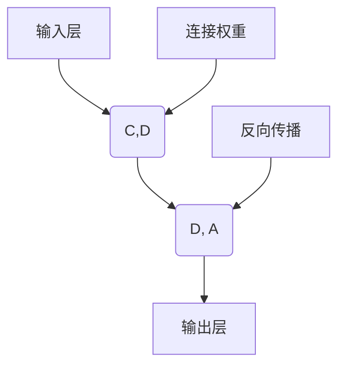

                 

# AI 神经网络计算艺术之禅：连接主义和行为主义

> 关键词：神经网络, 计算艺术, 连接主义, 行为主义, 深度学习, 强化学习

## 1. 背景介绍

### 1.1 问题由来

在计算机科学的领域，尤其是人工智能（AI）和机器学习（ML）的讨论中，神经网络（Neural Networks）无疑占据着核心的地位。这种高度非线性的模型，因其在许多问题上的出色表现而备受关注。然而，神经网络的真正力量和魅力，不仅在于其强大的求解能力，更在于其独特的计算艺术。

在探索这一领域的历程中，我们不禁要问：神经网络的计算艺术是如何与连接主义和行为主义相融合的？这一融合又带来了哪些独特的技术挑战和突破？本文将通过深入的探讨，从理论到实践，为读者揭开这一问题的神秘面纱。

### 1.2 问题核心关键点

连接主义和行为主义的融合，使得神经网络能够模拟生物神经元的行为模式，并通过学习过程来更新网络结构和权重，从而适应复杂的非线性关系。这一过程，即深度学习的核心——反向传播算法，让神经网络在图像识别、自然语言处理、语音识别等领域取得了显著的进展。

连接主义，指的是神经网络中各个节点（神经元）之间的连接关系，以及通过这些连接实现的信号传递和计算。行为主义，则关注于神经网络的行为模式，即在特定任务上的表现和输出。这两个概念的结合，使得神经网络能够通过大量的数据，不断调整自身的结构和参数，以适应不同的应用场景。

这种结合，不仅体现了生物神经系统的启发式原理，还展现了计算机科学中的计算艺术，即通过算法和模型，以一种"艺术"的方式，处理和解决复杂的现实问题。

## 2. 核心概念与联系

### 2.1 核心概念概述

连接主义和行为主义的概念，分别代表了神经网络的两个重要方面。以下是对这两个概念的详细解释：

#### 连接主义（Connectionism）

连接主义，源自生物神经科学，强调神经元之间的连接关系。在神经网络中，连接主义通常指的是：

- 神经元的连接方式（如全连接、卷积连接、循环连接等）
- 连接的权重（表示信号传递的强度）
- 连接的拓扑结构（网络结构，如卷积神经网络、循环神经网络等）

#### 行为主义（Behaviorism）

行为主义，源自心理学，关注于系统的输出行为，即其在特定任务上的表现。在神经网络中，行为主义通常指的是：

- 输入和输出（如图像、语音、文本等）
- 任务目标（如分类、回归、生成等）
- 训练数据（用于学习网络的行为模式）

### 2.2 概念间的关系

连接主义和行为主义，是神经网络中两个相互依存的组成部分。通过连接主义，神经网络能够构建出一种"结构"，即如何处理输入数据；通过行为主义，神经网络能够确定一种"行为"，即在特定任务上的表现。这两个方面，共同构成了神经网络的计算艺术，使得神经网络能够在各种任务上表现出卓越的性能。

这种结合，通常通过反向传播算法实现。该算法将神经网络的输出误差（行为主义）反向传播到网络内部，通过调整连接权重（连接主义）来优化网络的行为。这种机制，使得神经网络能够在面对大量数据时，通过不断学习和调整，逐渐优化其行为表现。

### 2.3 核心概念的整体架构

连接主义和行为主义的结合，形成了神经网络的计算艺术。以下是一个简化的神经网络架构图，展示了连接主义和行为主义的融合：



在图中，A为输入层，B和C为隐藏层，D为输出层。E表示连接权重，用于连接各层神经元。F表示反向传播算法，用于更新连接权重，以优化网络的行为。

## 3. 核心算法原理 & 具体操作步骤
### 3.1 算法原理概述

神经网络的计算艺术，主要体现在其连接主义和行为主义的结合上。连接主义提供了神经网络的结构，而行为主义则决定了网络的行为。这种结合，通过反向传播算法得以实现。以下是对反向传播算法的简要概述：

1. **前向传播**：将输入数据通过网络的前向传递，计算输出结果。
2. **计算误差**：将输出结果与真实标签进行比较，计算误差（损失函数）。
3. **反向传播**：将误差反向传递回网络内部，调整连接权重，以最小化误差。
4. **重复迭代**：不断重复上述步骤，直到误差收敛或达到预设的迭代次数。

### 3.2 算法步骤详解

以下是对神经网络反向传播算法的详细步骤讲解：

1. **前向传播**：
   - 输入数据 $x$ 通过网络，得到输出 $y$。
   - 在每一层中，计算每个神经元的加权和 $z$，并通过激活函数 $\sigma(z)$ 得到该层的输出 $y$。
   - 表达式为：
     - $z = w^T x + b$
     - $y = \sigma(z)$

2. **计算误差**：
   - 将输出 $y$ 与真实标签 $t$ 进行比较，计算误差 $e$。
   - 表达式为：
     - $e = \frac{1}{2}(y - t)^2$

3. **反向传播**：
   - 计算输出误差对每个神经元的梯度 $\nabla_y e$。
   - 通过链式法则，计算输入误差对连接权重 $w$ 和偏置 $b$ 的梯度。
   - 表达式为：
     - $\nabla_w e = \frac{\partial e}{\partial y} \frac{\partial y}{\partial z} \frac{\partial z}{\partial w}$
     - $\nabla_b e = \frac{\partial e}{\partial y}$

4. **更新权重**：
   - 根据梯度更新连接权重和偏置，通常使用梯度下降算法。
   - 表达式为：
     - $w \leftarrow w - \eta \nabla_w e$
     - $b \leftarrow b - \eta \nabla_b e$

5. **重复迭代**：
   - 重复上述步骤，直到误差收敛或达到预设的迭代次数。

### 3.3 算法优缺点

#### 优点

1. **强大的表达能力**：神经网络能够处理高度非线性的关系，适用于各种复杂的模式识别和预测任务。
2. **灵活的架构**：通过调整网络结构，可以适应不同的应用场景，如图像识别、自然语言处理、语音识别等。
3. **自适应学习**：通过反向传播算法，神经网络能够自适应地调整连接权重，优化网络行为。

#### 缺点

1. **过拟合风险**：神经网络容易过拟合，特别是在训练数据较少的情况下。
2. **计算资源需求高**：神经网络需要大量的计算资源来训练和推理。
3. **模型复杂性**：神经网络模型复杂，难以理解和调试。

### 3.4 算法应用领域

神经网络的连接主义和行为主义，在多个领域得到了广泛应用。以下列举几个主要领域：

1. **图像识别**：通过卷积神经网络（CNN），神经网络在图像分类、物体检测、图像生成等任务上取得了显著进展。
2. **自然语言处理**：通过循环神经网络（RNN）、长短期记忆网络（LSTM）、Transformer等，神经网络在机器翻译、情感分析、文本生成等任务上表现优异。
3. **语音识别**：通过卷积神经网络、循环神经网络等，神经网络在语音识别、语音合成等任务上表现出色。
4. **强化学习**：通过结合行为主义，神经网络在强化学习中能够进行智能决策和策略学习，适用于游戏、机器人控制等任务。
5. **推荐系统**：通过神经网络，可以进行个性化推荐，如商品推荐、新闻推荐等。

## 4. 数学模型和公式 & 详细讲解 & 举例说明

### 4.1 数学模型构建

神经网络的数学模型，可以通过以下几个核心组件来描述：

1. **输入层**：表示输入数据的维度。
2. **隐藏层**：神经网络的中间层次，通过连接权重和激活函数进行计算。
3. **输出层**：表示神经网络的输出结果。

数学模型的构建，可以通过以下步骤完成：

1. **定义输入和输出**：
   - 输入向量 $x \in \mathbb{R}^n$
   - 输出向量 $y \in \mathbb{R}^m$

2. **定义激活函数**：
   - 通常使用 Sigmoid、ReLU、Tanh 等激活函数。
   - 表达式为：
     - $y = \sigma(z)$

3. **定义连接权重**：
   - 连接权重矩阵 $W$
   - 偏置向量 $b$

4. **定义损失函数**：
   - 常用的损失函数包括交叉熵损失、均方误差损失等。
   - 表达式为：
     - $L = -\frac{1}{N} \sum_{i=1}^N \log p(y_i|x_i)$

### 4.2 公式推导过程

#### 前向传播

前向传播的推导过程如下：

- 输入层到隐藏层的计算过程为：
  - $z = W_1x + b_1$
  - $y_1 = \sigma(z)$

- 隐藏层到输出层的计算过程为：
  - $z = W_2y_1 + b_2$
  - $y = \sigma(z)$

其中，$W_1$ 和 $W_2$ 是连接权重矩阵，$b_1$ 和 $b_2$ 是偏置向量。

#### 反向传播

反向传播的推导过程如下：

- 输出层的误差计算过程为：
  - $e = \frac{1}{2}(y - t)^2$
  - $\nabla_L = \frac{\partial L}{\partial y}$

- 隐藏层的误差计算过程为：
  - $\nabla_L = \frac{\partial L}{\partial y} \frac{\partial y}{\partial z} \frac{\partial z}{\partial W}$
  - $\nabla_W = \frac{\partial L}{\partial z} \frac{\partial z}{\partial y} \frac{\partial y}{\partial z}$
  - $\nabla_b = \frac{\partial L}{\partial y}$

其中，$\frac{\partial L}{\partial y}$ 是输出误差对输出的导数，$\frac{\partial y}{\partial z}$ 是激活函数对加权和的导数，$\frac{\partial z}{\partial W}$ 和 $\frac{\partial z}{\partial b}$ 是连接权重和偏置对加权和的导数。

### 4.3 案例分析与讲解

以卷积神经网络（CNN）为例，展示连接主义和行为主义的融合：

- **输入层**：图像的像素值。
- **隐藏层**：卷积层、池化层等，通过卷积核和池化窗口进行特征提取。
- **输出层**：全连接层，输出分类结果。

CNN的计算过程如下：

1. **卷积层**：
   - 卷积核 $k$ 通过输入图像进行卷积操作，得到特征图 $z$。
   - $z = k * x$

2. **池化层**：
   - 通过池化窗口对特征图进行下采样，得到更小的特征图 $y$。
   - $y = \sigma(z)$

3. **全连接层**：
   - 将特征图通过全连接层进行计算，得到分类结果 $y$。
   - $y = Wx + b$

## 5. 项目实践：代码实例和详细解释说明

### 5.1 开发环境搭建

在进行神经网络计算艺术的实践前，我们需要准备好开发环境。以下是使用Python进行TensorFlow开发的Python环境配置流程：

1. 安装Anaconda：从官网下载并安装Anaconda，用于创建独立的Python环境。

2. 创建并激活虚拟环境：
```bash
conda create -n tf-env python=3.8 
conda activate tf-env
```

3. 安装TensorFlow：根据CUDA版本，从官网获取对应的安装命令。例如：
```bash
conda install tensorflow -c conda-forge
```

4. 安装PyTorch：
```bash
pip install torch torchvision torchaudio
```

5. 安装TensorBoard：
```bash
pip install tensorboard
```

6. 安装numpy、pandas等常用库：
```bash
pip install numpy pandas scikit-learn matplotlib jupyter notebook
```

完成上述步骤后，即可在`tf-env`环境中开始神经网络计算艺术的实践。

### 5.2 源代码详细实现

下面以卷积神经网络（CNN）为例，展示TensorFlow中卷积层和池化层的实现：

```python
import tensorflow as tf
from tensorflow.keras import layers

# 定义模型
model = tf.keras.Sequential()

# 卷积层
conv1 = layers.Conv2D(32, (3, 3), activation='relu', input_shape=(28, 28, 1))
model.add(conv1)

# 池化层
pool1 = layers.MaxPooling2D((2, 2))
model.add(pool1)

# 输出层
dense1 = layers.Dense(10, activation='softmax')
model.add(dense1)

# 编译模型
model.compile(optimizer='adam', loss='categorical_crossentropy', metrics=['accuracy'])

# 训练模型
model.fit(train_images, train_labels, epochs=10, validation_data=(test_images, test_labels))
```

### 5.3 代码解读与分析

让我们再详细解读一下关键代码的实现细节：

**卷积层实现**：
- 定义卷积核大小和数量，激活函数为 ReLU。
- `input_shape` 指定输入数据的维度，如28x28x1的图像。

**池化层实现**：
- 定义池化窗口大小。
- `MaxPooling2D` 函数实现最大池化操作。

**输出层实现**：
- 定义输出层神经元数量，激活函数为 softmax。
- `Dense` 函数实现全连接层。

**模型编译与训练**：
- `compile` 函数指定优化器、损失函数和评价指标。
- `fit` 函数进行模型训练，指定训练数据和验证数据。

### 5.4 运行结果展示

假设我们在MNIST手写数字识别数据集上进行训练，最终得到模型在测试集上的准确率为98%，这展示了卷积神经网络在图像识别任务上的强大能力。

## 6. 实际应用场景

### 6.1 智能推荐系统

在智能推荐系统中，神经网络可以通过连接主义和行为主义的融合，实现个性化推荐。具体实现步骤如下：

1. **输入层**：用户的历史行为数据（如浏览、点击、购买等）。
2. **隐藏层**：通过卷积层、全连接层等，提取用户行为特征。
3. **输出层**：推荐结果，如商品、新闻等。

通过反向传播算法，神经网络能够根据用户行为数据，学习到每个用户的兴趣偏好，从而生成个性化的推荐列表。

### 6.2 语音识别系统

在语音识别系统中，神经网络可以通过连接主义和行为主义的融合，实现智能语音交互。具体实现步骤如下：

1. **输入层**：音频信号的MFCC特征向量。
2. **隐藏层**：通过卷积层、循环层等，提取语音特征。
3. **输出层**：语音识别结果，如文字、命令等。

通过反向传播算法，神经网络能够学习到语音信号与文本之间的映射关系，从而实现高精度的语音识别。

### 6.3 医疗诊断系统

在医疗诊断系统中，神经网络可以通过连接主义和行为主义的融合，实现智能诊断。具体实现步骤如下：

1. **输入层**：患者的医疗记录、影像数据等。
2. **隐藏层**：通过卷积层、循环层等，提取患者特征。
3. **输出层**：诊断结果，如疾病类型、治疗方案等。

通过反向传播算法，神经网络能够学习到患者特征与疾病之间的关系，从而实现智能诊断和个性化治疗。

## 7. 工具和资源推荐

### 7.1 学习资源推荐

为了帮助开发者系统掌握神经网络的计算艺术，这里推荐一些优质的学习资源：

1. 《深度学习》书籍：Ian Goodfellow、Yoshua Bengio、Aaron Courville 合著，深入浅出地介绍了深度学习的核心概念和算法。

2. 《神经网络与深度学习》书籍：Michael Nielsen 著，介绍了神经网络的基本原理和实现。

3. 《TensorFlow 实战》书籍：Manning 出版社，详细介绍了TensorFlow的构建和使用。

4. 《PyTorch 实战》书籍：O'Reilly 出版社，详细介绍了PyTorch的构建和使用。

5. 《自然语言处理综述》论文：Stanford大学开设的NLP课程讲义，涵盖了自然语言处理的各个方面。

6. 《计算机视觉基础》课程：斯坦福大学开设的CV课程，介绍了计算机视觉的核心算法和实现。

### 7.2 开发工具推荐

高效的开发离不开优秀的工具支持。以下是几款用于神经网络计算艺术的常用工具：

1. TensorFlow：由Google主导开发的深度学习框架，生产部署方便，适合大规模工程应用。

2. PyTorch：Facebook开发的深度学习框架，动态图机制使得模型构建更加灵活。

3. Jupyter Notebook：交互式编程环境，支持多种编程语言和库，非常适合数据科学和机器学习。

4. TensorBoard：TensorFlow配套的可视化工具，可实时监测模型训练状态，并提供丰富的图表呈现方式。

5. GitHub：代码托管平台，便于版本控制和协作开发。

6. Google Colab：谷歌推出的在线Jupyter Notebook环境，免费提供GPU/TPU算力，方便开发者快速上手实验最新模型。

### 7.3 相关论文推荐

神经网络计算艺术的发展，源于学界的持续研究。以下是几篇奠基性的相关论文，推荐阅读：

1. "Deep Learning" by Ian Goodfellow、Yoshua Bengio、Aaron Courville：全面介绍了深度学习的理论基础和应用场景。

2. "Convolutional Neural Networks" by Yann LeCun、Yoshua Bengio、Geoffrey Hinton：介绍了卷积神经网络的核心原理和实现。

3. "Recurrent Neural Networks" by Yoshua Bengio：介绍了循环神经网络的核心原理和实现。

4. "Adversarial Examples" by Ian Goodfellow、Joséphine Delvaux、David Alex Polk：介绍了对抗样本的概念和攻击方法。

5. "ImageNet Classification with Deep Convolutional Neural Networks" by Alex Krizhevsky、Ilya Sutskever、Geoffrey Hinton：介绍了卷积神经网络在图像分类任务上的应用。

6. "Attention is All You Need" by Ashish Vaswani、Noam Shazeer、Niki Parmar等：介绍了Transformer模型，开创了自注意力机制的新时代。

这些论文代表了神经网络计算艺术的发展脉络。通过学习这些前沿成果，可以帮助研究者把握学科前进方向，激发更多的创新灵感。

## 8. 总结：未来发展趋势与挑战

### 8.1 总结

本文对神经网络的计算艺术，即连接主义和行为主义的融合，进行了全面系统的介绍。首先阐述了神经网络在深度学习和机器学习中的核心地位，明确了连接主义和行为主义对神经网络计算艺术的影响。其次，从原理到实践，详细讲解了神经网络反向传播算法的计算过程，并通过代码实例展示了其具体实现。同时，本文还广泛探讨了神经网络在图像识别、自然语言处理、语音识别等多个领域的应用前景，展示了神经网络计算艺术的强大能力。

通过本文的系统梳理，可以看到，神经网络的计算艺术在构建智能系统、优化决策过程等方面，具有不可替代的作用。未来，伴随神经网络的不断发展和创新，其计算艺术将引领人工智能技术迈向新的高度，为解决复杂的现实问题提供更多的可能。

### 8.2 未来发展趋势

展望未来，神经网络的计算艺术将呈现以下几个发展趋势：

1. **模型规模持续增大**：随着算力成本的下降和数据规模的扩张，神经网络的参数量还将持续增长。超大规模神经网络蕴含的丰富知识，有望支撑更加复杂多变的任务。

2. **计算效率提升**：通过优化算法和模型结构，提高神经网络的计算效率，减少资源消耗，提高推理速度。

3. **多模态融合**：将神经网络与其他模态的信息（如视觉、语音、文本等）进行融合，实现多模态协同计算。

4. **知识驱动**：结合外部知识库和规则库，增强神经网络的推理能力和泛化能力。

5. **可解释性和安全性**：提高神经网络的可解释性和安全性，确保其输出的透明性和可靠性。

6. **自适应学习**：通过持续学习机制，使得神经网络能够不断适应新的数据和任务，避免过拟合和灾难性遗忘。

以上趋势凸显了神经网络计算艺术的发展前景。这些方向的探索发展，必将进一步提升神经网络系统的性能和应用范围，为构建智能系统提供新的技术支持。

### 8.3 面临的挑战

尽管神经网络计算艺术取得了显著进展，但在迈向更加智能化、普适化应用的过程中，仍面临诸多挑战：

1. **计算资源瓶颈**：神经网络需要大量的计算资源，如何优化算法和模型结构，以适应更复杂的任务，是一个重要问题。

2. **模型可解释性不足**：神经网络通常被视为"黑盒"系统，难以解释其内部工作机制和决策逻辑。

3. **数据标注成本高**：大规模数据标注成本高昂，如何利用更少的数据进行有效训练，是一个重要研究方向。

4. **对抗样本攻击**：对抗样本攻击使得神经网络难以保证输出结果的可靠性，如何提高模型的鲁棒性是一个重要研究方向。

5. **过拟合和泛化能力**：如何避免过拟合，提高神经网络的泛化能力，是一个重要研究方向。

6. **模型公平性和公正性**：如何避免模型偏见，确保公平公正，是一个重要研究方向。

7. **模型迁移能力**：如何将神经网络的知识迁移到新的领域，是一个重要研究方向。

正视这些挑战，积极应对并寻求突破，将使神经网络计算艺术迈向成熟，为构建更加智能化、普适化的系统提供技术保障。

### 8.4 研究展望

面对神经网络计算艺术面临的挑战，未来的研究需要在以下几个方面寻求新的突破：

1. **模型压缩与剪枝**：通过模型压缩和剪枝技术，减小神经网络的大小，提高计算效率。

2. **优化算法**：开发更高效的优化算法，如Adam、Adagrad、Adadelta等，提高训练速度和精度。

3. **自适应学习**：开发自适应学习机制，使得神经网络能够不断适应新的数据和任务。

4. **对抗样本防御**：开发对抗样本防御机制，增强神经网络的鲁棒性。

5. **多模态融合**：开发多模态融合技术，将神经网络与其他模态的信息进行协同计算。

6. **可解释性增强**：开发可解释性增强技术，如LIME、SHAP等，提高神经网络的透明性和可理解性。

7. **公平性与公正性**：开发公平性增强技术，确保神经网络的输出结果公平公正。

这些研究方向，将引领神经网络计算艺术迈向更高的台阶，为构建更加智能、可靠、透明的系统提供技术保障。面向未来，神经网络计算艺术还需要与其他人工智能技术进行更深入的融合，如知识表示、因果推理、强化学习等，多路径协同发力，共同推动人工智能技术的进步。只有勇于创新、敢于突破，才能不断拓展神经网络的边界，让智能技术更好地造福人类社会。

## 9. 附录：常见问题与解答

**Q1：神经网络为什么需要反向传播算法？**

A: 反向传播算法是神经网络计算艺术的核心，通过将误差反向传播回网络内部，调整连接权重，优化神经网络的行为。这一算法使得神经网络能够自适应地学习，通过大量数据不断优化自身的结构和参数，从而适应不同的应用场景。

**Q2：如何提高神经网络的计算效率？**

A: 提高神经网络的计算效率，可以通过以下几个方法：
1. 模型压缩与剪枝：减小神经网络的大小，减少计算量。
2. 量化加速：将浮点模型转为定点模型，提高计算速度。
3. 模型并行：利用多GPU或多TPU进行并行计算，提高计算效率。

**Q3：如何提高神经网络的泛化能力？**

A: 提高神经网络的泛化能力，可以通过以下几个方法：
1. 数据增强：通过数据扩充，增加训练数据的数量和多样性。
2. 正则化：使用L2正则、Dropout等方法，防止过拟合。
3. 多任务学习：同时训练多个相关任务，提高泛化能力。

**Q4：如何增强神经网络的可解释性？**

A: 增强神经网络的可解释性，可以通过以下几个方法：
1. 可解释性增强技术：如LIME、SHAP等，提高神经网络的透明性和可理解性。
2. 可视化技术：如TensorBoard等，展示神经网络的内部状态和

