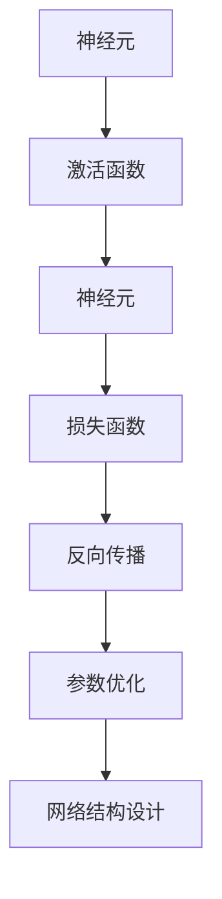

                 

# AI 神经网络计算艺术之道

## 1. 背景介绍

### 1.1 问题由来
在过去的几十年里，人工智能领域尤其是神经网络领域的飞速发展，让AI算法在各个领域得到了广泛的应用。从语音识别、图像处理到自然语言处理，AI技术已经渗透到生活的方方面面。而在AI的诸多领域中，神经网络（Neural Networks）无疑是最为核心的技术之一。

神经网络的出现，让我们看到了通过模拟生物神经网络的方式来构建复杂系统、处理复杂任务的可能。然而，神经网络并非一蹴而就，而是经历了多次迭代和演进的漫长历程。在这一过程中，从早期简单的感知器模型到如今的深度神经网络，再到最新的神经网络架构如Transformer等，每一步的突破都蕴含了数学家、计算机科学家、工程师们无数心血和智慧。

本文将从神经网络的基本原理和历史演进出发，探讨神经网络计算艺术之道，展现这一领域最前沿的思考和实践。

## 2. 核心概念与联系

### 2.1 核心概念概述

神经网络的核心概念包括多个方面，如神经元、激活函数、损失函数、反向传播、参数优化、网络结构设计等。本文将重点介绍其中的一些核心概念，并通过数学模型和流程图展示它们之间的联系。

#### 2.1.1 神经元

神经元是神经网络的基本构成单元，可以看作是信息处理和传递的原子。每个神经元接收多个输入，并根据这些输入通过一个激活函数计算出一个输出，然后将这个输出传递给下一层神经元。神经元的数量和连接方式决定了神经网络的结构和能力。

#### 2.1.2 激活函数

激活函数用于对神经元的输出进行非线性变换，使其能够处理非线性问题。常见的激活函数有sigmoid、tanh、ReLU等。这些函数的不同选择对神经网络的性能有着重要的影响。

#### 2.1.3 损失函数

损失函数用于衡量神经网络的输出与真实值之间的差异，通过最小化损失函数来优化神经网络参数。常见的损失函数有均方误差、交叉熵等。

#### 2.1.4 反向传播

反向传播是神经网络训练的核心算法之一，用于通过链式法则计算神经网络中的梯度，从而进行参数更新。反向传播算法能够高效地计算梯度，是神经网络训练不可或缺的一部分。

#### 2.1.5 参数优化

参数优化是神经网络训练中的关键步骤，通过调整学习率、批量大小等超参数，以及选择不同的优化算法，来最小化损失函数，优化神经网络参数。常见的优化算法有SGD、Adam等。

#### 2.1.6 网络结构设计

神经网络的结构设计涉及到层数、每层的神经元数量、激活函数的选择、网络的拓扑结构等。合理的网络结构设计能够显著提高神经网络的性能和效率。

通过这些核心概念，神经网络可以实现对各种复杂任务的处理和预测。

### 2.2 核心概念间的关系

以下是一个简单的Mermaid流程图，展示了神经网络的基本结构和训练流程：



这个流程图展示了神经网络的核心组件和训练流程。首先，输入数据经过多个神经元处理后，通过激活函数计算出输出。然后，将输出与真实值计算损失函数，并通过反向传播计算梯度，进行参数更新。最后，通过调整超参数和网络结构设计，提高神经网络的性能。

## 3. 核心算法原理 & 具体操作步骤
### 3.1 算法原理概述

神经网络的基本原理是通过反向传播算法，通过链式法则计算梯度，并根据梯度更新神经网络参数。其核心思想是通过大量数据训练神经网络，使其输出尽可能逼近真实值。

### 3.2 算法步骤详解

#### 3.2.1 前向传播
前向传播是将输入数据通过神经网络，从输入层传递到输出层的过程。在前向传播中，神经元依次计算输入的加权和，并通过激活函数计算输出。

#### 3.2.2 计算损失函数
将前向传播的输出与真实值计算损失函数，衡量神经网络的预测误差。

#### 3.2.3 反向传播
通过反向传播算法，利用链式法则计算每个神经元的梯度，从而更新神经网络参数。

#### 3.2.4 参数优化
通过调整学习率、批量大小等超参数，以及选择合适的优化算法，来最小化损失函数，优化神经网络参数。

#### 3.2.5 重复迭代
重复以上步骤，直到损失函数收敛或者达到预设的迭代次数。

### 3.3 算法优缺点

#### 3.3.1 优点
1. 可以处理非线性问题，具有较强的表达能力。
2. 能够自动提取特征，不需要手动设计特征工程。
3. 在大规模数据集上训练，性能优异。

#### 3.3.2 缺点
1. 模型复杂度较高，训练和推理速度较慢。
2. 需要大量的标注数据，对数据质量要求较高。
3. 容易出现过拟合问题，需要严格的参数调优。

### 3.4 算法应用领域

神经网络的应用领域非常广泛，涵盖了计算机视觉、自然语言处理、语音识别、推荐系统等多个领域。以下是几个典型的应用场景：

#### 3.4.1 计算机视觉
神经网络在计算机视觉领域中广泛应用于图像分类、目标检测、图像生成等任务。例如，卷积神经网络（CNN）被广泛应用于图像分类和目标检测，生成对抗网络（GAN）被应用于图像生成等任务。

#### 3.4.2 自然语言处理
神经网络在自然语言处理领域中广泛应用于语言模型、机器翻译、情感分析等任务。例如，循环神经网络（RNN）被广泛应用于语言模型，Transformer被广泛应用于机器翻译等任务。

#### 3.4.3 语音识别
神经网络在语音识别领域中广泛应用于语音识别、语音合成等任务。例如，卷积神经网络（CNN）被广泛应用于语音特征提取，循环神经网络（RNN）被广泛应用于语音识别。

#### 3.4.4 推荐系统
神经网络在推荐系统领域中广泛应用于推荐算法、用户画像等任务。例如，神经协同过滤（NCF）被广泛应用于推荐算法，深度神经网络（DNN）被广泛应用于用户画像等任务。

## 4. 数学模型和公式 & 详细讲解  
### 4.1 数学模型构建

以一个简单的神经网络为例，我们构建一个三层神经网络的数学模型：


其中，$x$为输入向量，$w_i$和$b_i$分别为第$i$层神经元的权重和偏置，$h_i$为第$i$层神经元的输出。$h_1$为隐层，$h_2$为输出层。

### 4.2 公式推导过程

#### 4.2.1 前向传播
前向传播公式为：

$$
h_1 = \sigma(W_1 x + b_1)
$$

$$
h_2 = \sigma(W_2 h_1 + b_2)
$$

其中，$\sigma$为激活函数，如ReLU、tanh等。

#### 4.2.2 计算损失函数
假设输出层有$m$个神经元，$y$为真实标签，则损失函数为：

$$
L(h_2, y) = \frac{1}{m} \sum_{i=1}^m (y_i - h_{2i})^2
$$

#### 4.2.3 反向传播
反向传播公式为：

$$
\frac{\partial L}{\partial W_1} = \frac{\partial L}{\partial h_2} \frac{\partial h_2}{\partial h_1} \frac{\partial h_1}{\partial W_1}
$$

$$
\frac{\partial L}{\partial b_1} = \frac{\partial L}{\partial h_2} \frac{\partial h_2}{\partial h_1}
$$

$$
\frac{\partial L}{\partial W_2} = \frac{\partial L}{\partial h_2} \frac{\partial h_2}{\partial h_1}
$$

$$
\frac{\partial L}{\partial b_2} = \frac{\partial L}{\partial h_2}
$$

其中，$\frac{\partial L}{\partial h_2}$为损失函数对输出层的梯度，$\frac{\partial h_2}{\partial h_1}$为激活函数导数，$\frac{\partial h_1}{\partial W_1}$为输出层对隐层的梯度。

#### 4.2.4 参数优化
使用梯度下降算法优化损失函数：

$$
W_1, b_1 \leftarrow W_1 - \eta \frac{\partial L}{\partial W_1}, b_1
$$

$$
W_2, b_2 \leftarrow W_2 - \eta \frac{\partial L}{\partial W_2}, b_2
$$

其中，$\eta$为学习率。

### 4.3 案例分析与讲解

假设我们有一个简单的手写数字识别任务，使用MNIST数据集。我们使用一个三层神经网络，其中输入层有784个神经元，隐层有64个神经元，输出层有10个神经元。使用ReLU作为激活函数，交叉熵作为损失函数，Adam作为优化算法。

首先，将数据集分为训练集和测试集，使用训练集进行训练，使用测试集进行评估。

在训练过程中，我们不断调整学习率、批量大小等超参数，直到损失函数收敛或者达到预设的迭代次数。最后，使用测试集评估模型的性能。

## 5. 项目实践：代码实例和详细解释说明
### 5.1 开发环境搭建

首先，我们需要安装Python和必要的库，包括TensorFlow、Keras等。

```
pip install tensorflow keras
```

### 5.2 源代码详细实现

以下是一个简单的手写数字识别任务代码实现：

```python
import tensorflow as tf
from tensorflow import keras

# 加载MNIST数据集
(x_train, y_train), (x_test, y_test) = keras.datasets.mnist.load_data()

# 数据预处理
x_train = x_train.reshape((60000, 28 * 28))
x_test = x_test.reshape((10000, 28 * 28))
x_train = x_train / 255.0
x_test = x_test / 255.0

# 定义模型
model = keras.Sequential([
    keras.layers.Dense(64, activation='relu', input_shape=(784,)),
    keras.layers.Dense(10, activation='softmax')
])

# 编译模型
model.compile(optimizer='adam',
              loss='sparse_categorical_crossentropy',
              metrics=['accuracy'])

# 训练模型
model.fit(x_train, y_train, epochs=5, batch_size=128, validation_data=(x_test, y_test))

# 评估模型
test_loss, test_acc = model.evaluate(x_test, y_test)
print('Test accuracy:', test_acc)
```

### 5.3 代码解读与分析

#### 5.3.1 数据预处理
将MNIST数据集的图像数据转换为一个一维数组，并归一化到0-1之间。

#### 5.3.2 定义模型
使用Sequential模型定义一个简单的三层神经网络，其中隐层64个神经元，激活函数为ReLU，输出层10个神经元，激活函数为softmax。

#### 5.3.3 编译模型
使用Adam优化算法，交叉熵损失函数，准确率作为评估指标。

#### 5.3.4 训练模型
使用训练集进行5个epochs的训练，批量大小为128。

#### 5.3.5 评估模型
使用测试集评估模型的性能，输出测试集上的准确率。

## 6. 实际应用场景
### 6.4 未来应用展望

神经网络在未来的应用前景非常广阔，预计将在以下几个领域取得重要进展：

#### 6.4.1 自动驾驶
神经网络在自动驾驶领域中，可以用于目标检测、路径规划、决策制定等任务。例如，使用卷积神经网络（CNN）进行目标检测，使用循环神经网络（RNN）进行路径规划，使用深度强化学习（DRL）进行决策制定。

#### 6.4.2 医疗诊断
神经网络在医疗诊断领域中，可以用于医学影像分析、疾病预测等任务。例如，使用卷积神经网络（CNN）进行医学影像分析，使用循环神经网络（RNN）进行疾病预测。

#### 6.4.3 金融分析
神经网络在金融分析领域中，可以用于风险评估、交易策略制定等任务。例如，使用循环神经网络（RNN）进行风险评估，使用生成对抗网络（GAN）进行交易策略制定。

#### 6.4.4 智能推荐
神经网络在智能推荐领域中，可以用于用户画像、推荐算法等任务。例如，使用深度神经网络（DNN）进行用户画像，使用神经协同过滤（NCF）进行推荐算法。

## 7. 工具和资源推荐
### 7.1 学习资源推荐

为了深入学习神经网络，以下是一些值得推荐的资源：

1. 《深度学习》（Ian Goodfellow）：这本书是深度学习领域的经典之作，涵盖了深度学习的基本概念和算法。

2. 《神经网络与深度学习》（Michael Nielsen）：这本书深入浅出地介绍了神经网络和深度学习的基本原理和算法。

3. Coursera深度学习课程：由Andrew Ng教授主讲，涵盖了深度学习的基本概念和算法。

4. Kaggle数据集：Kaggle是一个数据科学竞赛平台，提供了大量数据集和竞赛，可以帮助学习者实践深度学习算法。

5. GitHub代码库：GitHub是一个代码托管平台，提供了大量神经网络的开源代码和实现，可以帮助学习者学习深度学习算法。

### 7.2 开发工具推荐

以下是一些常用的深度学习开发工具：

1. TensorFlow：由Google开发，是一个强大的开源深度学习框架，支持GPU计算。

2. Keras：是一个简单易用的深度学习框架，基于TensorFlow实现，支持多种深度学习模型。

3. PyTorch：是一个灵活的深度学习框架，支持动态计算图，支持GPU和CPU计算。

4. JAX：是一个基于NumPy的深度学习框架，支持自动微分和分布式计算。

5. MXNet：是一个高效的深度学习框架，支持GPU和CPU计算，支持多种深度学习模型。

### 7.3 相关论文推荐

以下是一些深度学习领域的经典论文：

1. AlexNet：ImageNet图像分类竞赛冠军模型，开启了深度学习在计算机视觉领域的应用。

2. ResNet：提出了残差网络结构，解决了深度网络训练中的梯度消失问题。

3. Inception：提出了Inception模块，用于提高深度神经网络的性能。

4. Transformer：提出了Transformer结构，用于解决序列到序列问题，在自然语言处理领域取得了显著效果。

5. GAN：提出了生成对抗网络，用于生成高质量的图像和视频。

## 8. 总结：未来发展趋势与挑战

### 8.1 研究成果总结

本文介绍了神经网络的基本原理和核心概念，并展示了神经网络在实际应用中的广泛应用。通过数学模型和代码实例，深入探讨了神经网络的计算艺术之道。

### 8.2 未来发展趋势

未来，神经网络将继续在各个领域发挥重要作用，以下是一些可能的发展趋势：

1. 更加深度的网络结构：随着硬件的提升和算法的优化，神经网络的深度将继续增加，网络结构将更加复杂。

2. 更加高效的计算模型：随着计算模型的发展，神经网络的训练和推理速度将大幅提升，能够处理更大规模的数据集。

3. 更加智能的决策模型：随着知识图谱、深度强化学习等技术的发展，神经网络将更加智能，能够处理更加复杂的决策问题。

4. 更加多样化的应用场景：随着技术的发展，神经网络将应用于更多领域，如自动驾驶、医疗诊断、金融分析等。

### 8.3 面临的挑战

神经网络的发展仍面临一些挑战，以下是一些主要的挑战：

1. 数据质量问题：神经网络需要大量的高质量数据进行训练，数据获取和标注成本较高。

2. 计算资源问题：神经网络的深度和规模不断增加，训练和推理需要大量的计算资源。

3. 模型复杂性问题：神经网络的复杂性不断增加，导致模型的训练和调试变得困难。

4. 模型可解释性问题：神经网络作为"黑盒"模型，其内部机制难以解释，难以满足某些领域的要求。

### 8.4 研究展望

为了克服上述挑战，未来的研究将主要集中在以下几个方面：

1. 数据获取和标注技术：发展高效的数据获取和标注技术，降低神经网络训练的成本。

2. 计算模型优化：发展高效的计算模型，提高神经网络的训练和推理效率。

3. 模型可解释性研究：研究如何提高神经网络的可解释性，使其能够满足某些领域的要求。

4. 知识图谱与神经网络融合：研究如何通过知识图谱与神经网络的融合，提高神经网络的性能。

总之，神经网络作为人工智能领域的核心技术之一，其发展前景广阔，但仍然面临一些挑战。通过不断的研究和实践，相信神经网络将在未来的各个领域发挥更加重要的作用。

## 9. 附录：常见问题与解答

### 9.1 常见问题

1. 神经网络需要多少数据进行训练？
2. 神经网络有哪些优化算法？
3. 神经网络有哪些激活函数？
4. 神经网络如何避免过拟合？
5. 神经网络有哪些重要的发展历史？

### 9.2 解答

1. 神经网络需要大量高质量的数据进行训练，一般而言，至少需要数万条数据。

2. 神经网络常用的优化算法包括梯度下降、Adam、Adagrad、SGD等。

3. 神经网络常用的激活函数包括sigmoid、tanh、ReLU等。

4. 神经网络可以通过正则化、Dropout等技术避免过拟合。

5. 神经网络的发展历史可以追溯到1943年的感知器模型，经过多年演进，目前已经发展到了深度学习阶段。

---

作者：禅与计算机程序设计艺术 / Zen and the Art of Computer Programming

