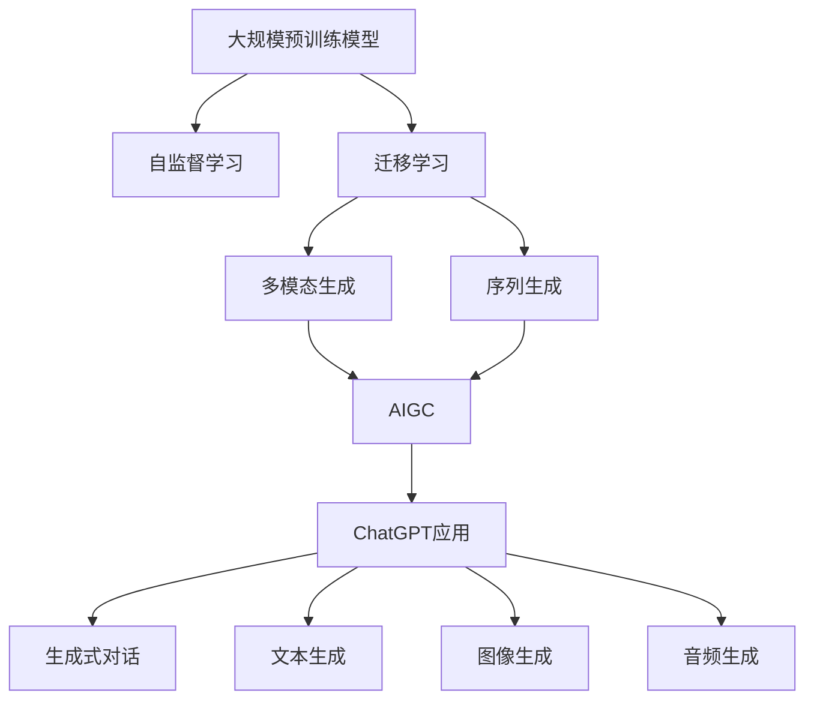
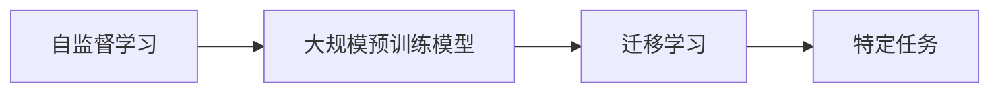
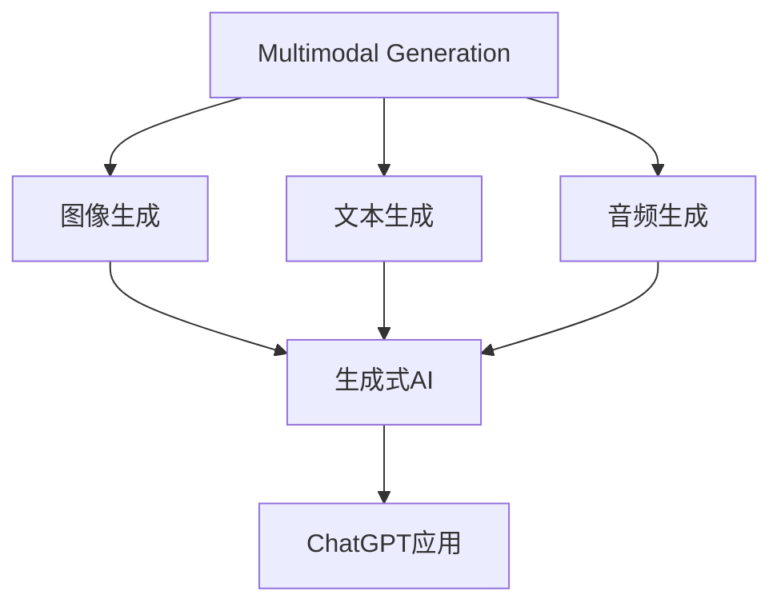
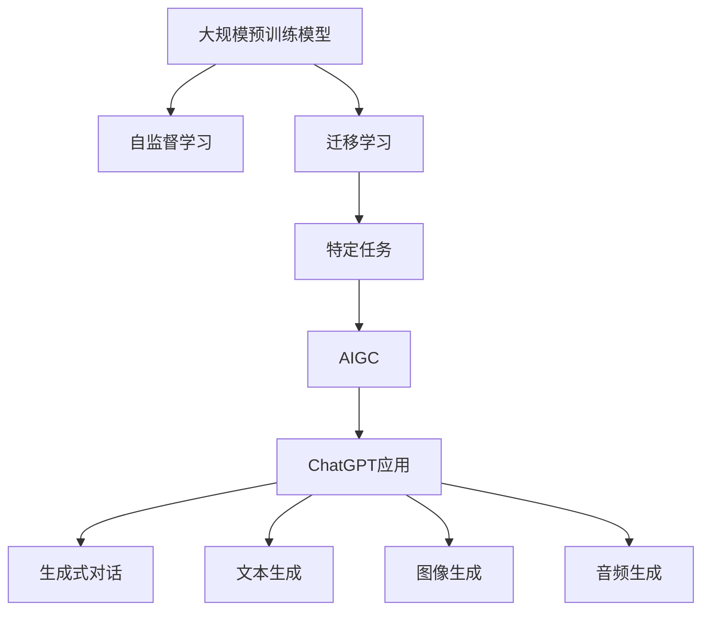
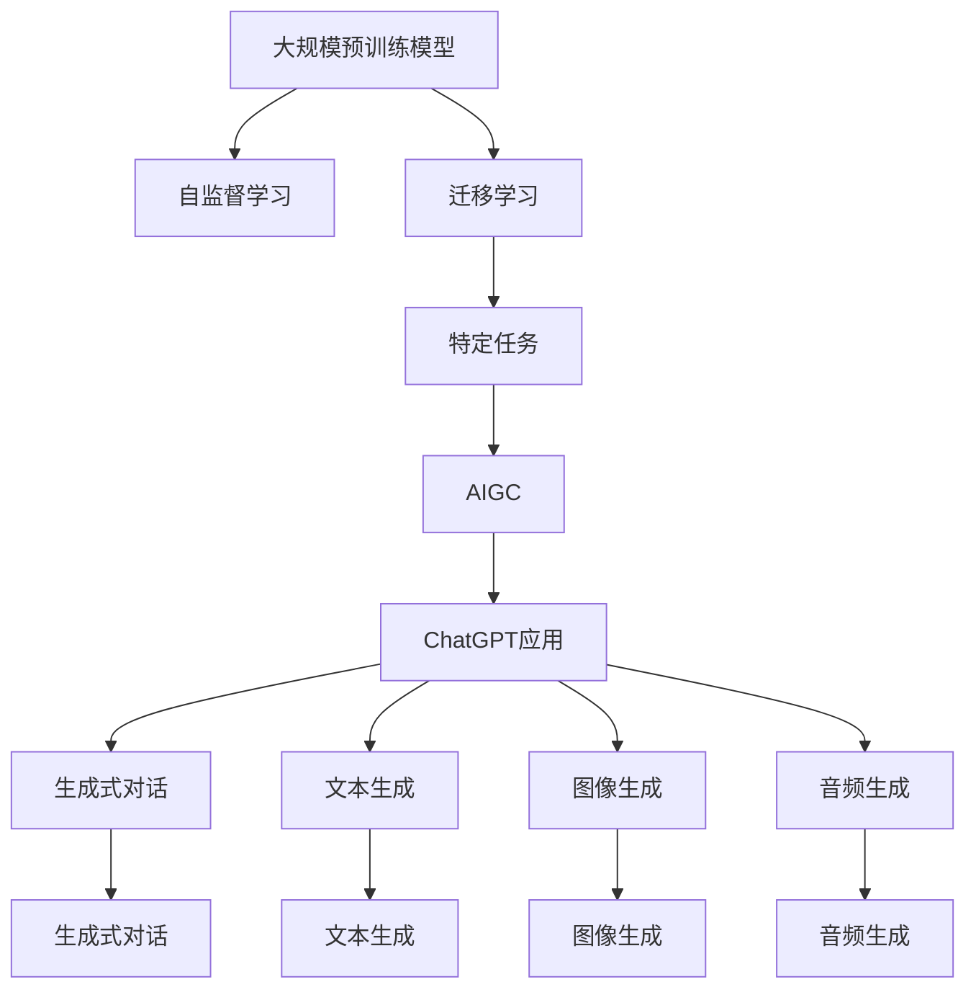

                 

# AIGC从入门到实战：ChatGPT 仅仅是个聊天机器人？

## 1. 背景介绍

### 1.1 问题由来
最近几年，人工智能领域涌现出许多前沿技术，其中，生成式人工智能（Generative AI，简称AIGC）以其强大的生成能力和灵活的应用场景，迅速引起了业界的广泛关注。ChatGPT作为AIGC领域的一员，以其强大的语言生成能力，成为了市场上的明星产品，但很多非专业人士常常误认为它只是一个聊天机器人。

本文将从AIGC的基础概念、核心技术入手，详细剖析ChatGPT作为AIGC的应用，探索其在实际应用中的潜力，帮助读者深入理解AIGC的实际应用和价值。

### 1.2 问题核心关键点
AIGC（生成式AI）旨在通过算法模型生成与真实数据无异的新数据，具有高度的自主性和创造性。ChatGPT作为一种AIGC技术的应用，其核心关键点在于：

- **大规模预训练模型**：ChatGPT基于大规模语言模型，在亿级参数的Transformer基础上进行预训练，学习了丰富的语言知识和语法规则。
- **自监督学习**：通过大规模无标签数据进行自监督学习，学习通用的语言表示。
- **迁移学习**：通过下游任务的少量标注数据进行微调，适应特定任务的需求。
- **多模态生成**：支持文本、图像、音频等多种形式的数据生成。
- **序列生成**：通过RNN、LSTM等模型，实现序列数据的生成，适用于问答、对话、生成文本等任务。

通过了解这些关键点，读者可以更好地理解ChatGPT作为AIGC应用的实际意义。

### 1.3 问题研究意义
研究AIGC及其应用，对于推动人工智能技术的发展和应用具有重要意义：

1. **提升技术水平**：AIGC技术的深入研究有助于提升人工智能技术的整体水平，推动AI技术的进一步发展。
2. **拓展应用场景**：AIGC技术的实际应用，可以拓展AI技术的市场应用，带来新的经济价值。
3. **促进产业创新**：AIGC技术在工业、医疗、教育等领域的创新应用，可以推动相关行业的数字化转型。
4. **提升用户体验**：AIGC技术可以提供更加智能、自然的人机交互体验，提升用户的满意度和忠诚度。
5. **推动科学研究**：AIGC技术在科学计算、数据分析等领域的应用，可以推动相关领域的科学研究和技术创新。

本文将详细剖析AIGC的核心概念和关键技术，帮助读者深入理解ChatGPT作为AIGC应用的实际意义和潜力。

## 2. 核心概念与联系

### 2.1 核心概念概述

为了更好地理解ChatGPT作为AIGC的应用，本节将介绍几个密切相关的核心概念：

- **生成式AI（Generative AI）**：生成式AI是指能够生成与真实数据无异的新数据的人工智能技术，可以用于文本生成、图像生成、音频生成等多个领域。
- **AIGC（生成式AI）**：AIGC是指利用生成式AI技术进行数据生成和模型训练的技术，可以生成高质量的新数据，推动人工智能技术的广泛应用。
- **自监督学习（Self-supervised Learning）**：自监督学习是一种无需标注数据的学习方式，通过利用数据的自身特点进行训练，学习通用的语言表示。
- **迁移学习（Transfer Learning）**：迁移学习是指通过在大规模数据集上进行预训练，然后在特定任务上进行微调，提升模型在该任务上的性能。
- **多模态生成（Multimodal Generation）**：多模态生成是指能够同时处理和生成文本、图像、音频等多种形式的数据，拓展了AIGC的应用范围。
- **序列生成（Sequence Generation）**：序列生成是指通过RNN、LSTM等模型，实现序列数据的生成，适用于问答、对话、生成文本等任务。

这些核心概念之间的逻辑关系可以通过以下Mermaid流程图来展示：



这个流程图展示了从预训练模型到ChatGPT应用的完整过程：

1. 大规模预训练模型通过自监督学习学习通用语言表示。
2. 通过迁移学习，模型在特定任务上进行微调，适应特定需求。
3. 多模态生成和序列生成拓展了模型的应用范围，支持文本、图像、音频等多种形式的数据生成。
4. ChatGPT作为AIGC应用，通过生成式对话、文本生成、图像生成、音频生成等技术，实现多场景、多形式的数据生成。

### 2.2 概念间的关系

这些核心概念之间存在着紧密的联系，形成了AIGC的完整生态系统。下面我们通过几个Mermaid流程图来展示这些概念之间的关系。

#### 2.2.1 自监督学习与迁移学习的关系



这个流程图展示了自监督学习和迁移学习的基本原理，以及它们之间的关系：

1. 自监督学习通过大规模无标签数据进行训练，学习通用的语言表示。
2. 迁移学习通过特定任务的少量标注数据进行微调，提升模型在该任务上的性能。

#### 2.2.2 多模态生成与序列生成的关系



这个流程图展示了多模态生成和序列生成的应用场景，以及它们与生成式AI的关系：

1. 多模态生成支持图像、文本、音频等多种形式的数据生成，拓展了AIGC的应用范围。
2. 序列生成通过RNN、LSTM等模型，实现序列数据的生成，适用于问答、对话、生成文本等任务。
3. ChatGPT作为AIGC应用，通过多模态生成和序列生成技术，实现多场景、多形式的数据生成。

#### 2.2.3 ChatGPT作为AIGC应用



这个流程图展示了ChatGPT作为AIGC应用的全过程：

1. 大规模预训练模型通过自监督学习学习通用语言表示。
2. 通过迁移学习，模型在特定任务上进行微调，适应特定需求。
3. 多模态生成和序列生成拓展了模型的应用范围，支持文本、图像、音频等多种形式的数据生成。
4. ChatGPT作为AIGC应用，通过生成式对话、文本生成、图像生成、音频生成等技术，实现多场景、多形式的数据生成。

### 2.3 核心概念的整体架构

最后，我们用一个综合的流程图来展示这些核心概念在大规模预训练模型和ChatGPT应用中的整体架构：



这个综合流程图展示了从预训练模型到ChatGPT应用的完整过程：

1. 大规模预训练模型通过自监督学习学习通用语言表示。
2. 通过迁移学习，模型在特定任务上进行微调，适应特定需求。
3. 多模态生成和序列生成拓展了模型的应用范围，支持文本、图像、音频等多种形式的数据生成。
4. ChatGPT作为AIGC应用，通过生成式对话、文本生成、图像生成、音频生成等技术，实现多场景、多形式的数据生成。

通过这些流程图，我们可以更清晰地理解大规模预训练模型和ChatGPT作为AIGC应用的实际意义和价值，为后续深入讨论具体的微调方法和技术奠定基础。

## 3. 核心算法原理 & 具体操作步骤
### 3.1 算法原理概述

ChatGPT作为AIGC应用，其核心算法原理主要基于Transformer模型和语言生成技术。Transformer模型是一种自注意力机制（Self-Attention Mechanism）的神经网络架构，能够高效地处理序列数据，适用于文本生成等任务。语言生成技术则通过训练模型，学习从输入序列到输出序列的映射关系，实现文本、图像、音频等形式的生成。

ChatGPT的核心算法流程如下：

1. **预训练**：通过大规模无标签数据进行自监督学习，学习通用的语言表示。
2. **微调**：通过下游任务的少量标注数据进行微调，适应特定任务的需求。
3. **生成**：利用训练好的模型，根据给定的输入，生成对应的输出。

具体而言，ChatGPT的生成过程可以概括为以下几个步骤：

1. **编码**：将输入序列（如文本）通过编码器（Encoder）进行编码，转化为高维向量表示。
2. **解码**：通过解码器（Decoder）逐步生成输出序列，每个时间步输出一个概率分布，选择最大概率的符号作为下一个输出。
3. **交叉熵损失**：定义损失函数为交叉熵损失（Cross-Entropy Loss），衡量模型生成的输出与真实标签之间的差异。
4. **优化**：通过梯度下降等优化算法，最小化损失函数，更新模型参数。
5. **采样**：生成时，随机选择一个概率分布，选择最大概率的符号作为下一个输出，重复该过程，直到生成结束。

### 3.2 算法步骤详解

接下来，我们将详细讲解ChatGPT的生成过程和微调步骤。

#### 3.2.1 预训练步骤

预训练步骤主要通过自监督学习进行，步骤如下：

1. **数据准备**：收集大规模无标签数据，如语料库、维基百科、新闻等。
2. **模型训练**：使用预训练模型（如BERT、GPT等），通过掩码语言模型（Masked Language Model）等自监督任务进行训练。
3. **模型保存**：将训练好的模型保存下来，以便后续微调使用。

具体而言，以BERT模型为例，其预训练过程包括掩码语言模型和下一句预测任务，主要步骤如下：

- **掩码语言模型**：随机掩盖输入序列中的部分符号，预测被掩盖的符号，学习语言表示。
- **下一句预测**：将两个句子输入模型，预测第二个句子是否出现在第一个句子之后，学习语言顺序和语义关系。

预训练过程中，模型会在大规模无标签数据上进行训练，学习通用的语言表示，能够理解自然语言的基本规律和语义关系。

#### 3.2.2 微调步骤

微调步骤主要通过有监督学习进行，步骤如下：

1. **数据准备**：收集下游任务的标注数据集，如问答、对话、文本生成等。
2. **模型加载**：加载预训练模型，使用下游任务的标注数据进行微调。
3. **模型训练**：定义损失函数、优化器等，通过梯度下降等优化算法进行训练。
4. **模型评估**：在验证集上评估模型性能，调整超参数，避免过拟合。
5. **模型保存**：将微调后的模型保存下来，以便后续使用。

具体而言，以对话生成为例，其微调过程步骤如下：

- **数据准备**：收集对话数据集，如闲聊、客服对话等。
- **模型加载**：加载预训练模型，定义合适的输出层和损失函数，如交叉熵损失。
- **模型训练**：使用微调后的模型进行训练，调整学习率、批大小等超参数，优化模型性能。
- **模型评估**：在验证集上评估模型生成的对话质量，调整超参数。
- **模型保存**：将微调后的模型保存下来，以便后续生成对话。

通过微调，ChatGPT能够更好地适应特定任务的需求，提升模型在该任务上的性能。

#### 3.2.3 生成步骤

生成步骤主要通过解码器进行，步骤如下：

1. **输入序列**：将输入序列（如文本、问题等）输入模型。
2. **编码**：通过编码器将输入序列转化为高维向量表示。
3. **解码**：通过解码器逐步生成输出序列，每个时间步输出一个概率分布，选择最大概率的符号作为下一个输出。
4. **采样**：生成时，随机选择一个概率分布，选择最大概率的符号作为下一个输出，重复该过程，直到生成结束。

具体而言，以文本生成为例，其生成过程步骤如下：

- **输入序列**：将输入文本输入模型。
- **编码**：通过编码器将输入文本转化为高维向量表示。
- **解码**：通过解码器逐步生成输出文本，每个时间步输出一个概率分布，选择最大概率的符号作为下一个输出。
- **采样**：生成时，随机选择一个概率分布，选择最大概率的符号作为下一个输出，重复该过程，直到生成结束。

生成过程可以用于生成自然语言文本、代码、图像等形式的数据，适用于问答、对话、生成文本等任务。

### 3.3 算法优缺点

ChatGPT作为AIGC应用，其生成过程和微调方法具有以下优点：

1. **高效生成**：通过Transformer模型和语言生成技术，ChatGPT能够高效地生成高质量的文本、图像、音频等数据。
2. **应用广泛**：ChatGPT可以应用于问答、对话、文本生成、代码生成、图像生成等多个领域，具有广泛的应用前景。
3. **可解释性强**：ChatGPT通过训练，可以学习到输入和输出的映射关系，具有较强的可解释性。
4. **灵活可调**：通过微调，ChatGPT可以适应不同的任务需求，具有较强的灵活性和可调性。

同时，ChatGPT也存在以下缺点：

1. **过拟合风险**：ChatGPT在微调过程中容易过拟合训练数据，导致泛化能力不足。
2. **生成质量不稳定**：ChatGPT生成的文本、图像、音频等数据质量不稳定，存在噪声、重复等现象。
3. **依赖高质量数据**：ChatGPT生成的数据质量高度依赖于训练数据的质量和数量。
4. **计算资源消耗大**：ChatGPT的训练和生成过程需要大量的计算资源和时间，存在一定的资源消耗问题。

通过了解ChatGPT的优缺点，读者可以更好地利用其生成能力，避免潜在的问题，提升实际应用的效果。

### 3.4 算法应用领域

ChatGPT作为AIGC应用，具有广泛的应用前景，主要包括以下几个领域：

1. **问答系统**：ChatGPT可以用于构建智能问答系统，解答用户的各类问题，提供高效、准确的答案。
2. **对话系统**：ChatGPT可以用于构建智能对话系统，实现人机自然对话，提升用户体验。
3. **文本生成**：ChatGPT可以用于生成文本，如新闻、文章、报告等，提高文本生成效率和质量。
4. **代码生成**：ChatGPT可以用于生成代码，提高代码编写效率和质量。
5. **图像生成**：ChatGPT可以用于生成图像，提高图像生成效率和质量。
6. **音频生成**：ChatGPT可以用于生成音频，如音乐、朗读等，提高音频生成效率和质量。

ChatGPT的实际应用已经涉及诸多领域，未来还将进一步拓展，带来更多创新应用。

## 4. 数学模型和公式 & 详细讲解  
### 4.1 数学模型构建

本文将使用数学语言对ChatGPT的生成过程进行更加严格的刻画。

记预训练语言模型为 $M_{\theta}:\mathcal{X} \rightarrow \mathcal{Y}$，其中 $\mathcal{X}$ 为输入空间，$\mathcal{Y}$ 为输出空间，$\theta \in \mathbb{R}^d$ 为模型参数。假设微调任务的训练集为 $D=\{(x_i,y_i)\}_{i=1}^N, x_i \in \mathcal{X}, y_i \in \mathcal{Y}$。

定义模型 $M_{\theta}$ 在输入 $x$ 上的输出为 $\hat{y}=M_{\theta}(x) \in [0,1]$，表示样本属于正类的概率。真实标签 $y \in \{0,1\}$。则二分类交叉熵损失函数定义为：

$$
\ell(M_{\theta}(x),y) = -[y\log \hat{y} + (1-y)\log (1-\hat{y})]
$$

将其代入经验风险公式，得：

$$
\mathcal{L}(\theta) = -\frac{1}{N}\sum_{i=1}^N [y_i\log M_{\theta}(x_i)+(1-y_i)\log(1-M_{\theta}(x_i))]
$$

在实践中，我们通常使用基于梯度的优化算法（如SGD、Adam等）来近似求解上述最优化问题。设 $\eta$ 为学习率，$\lambda$ 为正则化系数，则参数的更新公式为：

$$
\theta \leftarrow \theta - \eta \nabla_{\theta}\mathcal{L}(\theta) - \eta\lambda\theta
$$

其中 $\nabla_{\theta}\mathcal{L}(\theta)$ 为损失函数对参数 $\theta$ 的梯度，可通过反向传播算法高效计算。

### 4.2 公式推导过程

以下我们以二分类任务为例，推导交叉熵损失函数及其梯度的计算公式。

假设模型 $M_{\theta}$ 在输入 $x$ 上的输出为 $\hat{y}=M_{\theta}(x) \in [0,1]$，表示样本属于正类的概率。真实标签 $y \in \{0,1\}$。则二分类交叉熵损失函数定义为：

$$
\ell(M_{\theta}(x),y) = -[y\log \hat{y} + (1-y)\log (1-\hat{y})]
$$

将其代入经验风险公式，得：

$$
\mathcal{L}(\theta) = -\frac{1}{N}\sum_{i=1}^N [y_i\log M_{\theta}(x_i)+(1-y_i)\log(1-M_{\theta}(x_i))]
$$

根据链式法则，损失函数对参数 $\theta_k$ 的梯度为：

$$
\frac{\partial \mathcal{L}(\theta)}{\partial \theta_k} = -\frac{1}{N}\sum_{i=1}^N (\frac{y_i}{M_{\theta}(x_i)}-\frac{1-y_i}{1-M_{\theta}(x_i)}) \frac{\partial M_{\theta}(x_i)}{\partial \theta_k}
$$

其中 $\frac{\partial M_{\theta}(x_i)}{\partial \theta_k}$ 可进一步递归展开，利用自动微分技术完成计算。

在得到损失函数的梯度后，即可带入参数更新公式，完成模型的迭代优化。重复上述过程直至收敛，最终得到适应下游任务的最优模型参数 $\theta^*$。

## 5. 项目实践：代码实例和详细解释说明
### 5.1 开发环境搭建

在进行ChatGPT微调实践前，我们需要准备好开发环境。以下是使用Python进行PyTorch开发的环境配置流程：

1. 安装Anaconda：从官网下载并安装Anaconda，用于创建独立的Python环境。

2. 创建并激活虚拟环境：
```bash
conda create -n pytorch-env python=3.8 
conda activate pytorch-env
```

3. 安装PyTorch：根据CUDA版本，从官网获取对应的安装命令。例如：
```bash
conda install pytorch torchvision torchaudio cudatoolkit=11.1 -c pytorch -c conda-forge
```

4. 安装Transformers库：
```bash
pip install transformers
```

5. 安装各类工具包：
```bash
pip install numpy pandas scikit-learn matplotlib tqdm jupyter notebook ipython
```

完成上述步骤后，即可在`pytorch-env`环境中开始微调实践。

### 5.2 源代码详细实现

下面我们以问答系统为例，给出使用Transformers库对BERT模型进行微调的PyTorch代码实现。

首先，定义问答系统的数据处理函数：

```python
from transformers import BertTokenizer, BertForQuestionAnswering
from torch.utils.data import Dataset
import torch

class QADataset(Dataset):
    def __init__(self, texts, qas, tokenizer, max_len=128):
        self.texts = texts
        self.qas = qas
        self.tokenizer = tokenizer
        self.max_len = max_len
        
    def __len__(self):
        return len(self.texts)
    
    def __getitem__(self, item):
        text = self.texts[item]
        q, a = self.qas[item]
        
        encoding = self.tokenizer(text, return_tensors='pt', max_length=self.max_len, padding='max_length', truncation=True)
        input_ids = encoding['input_ids'][0]
        attention_mask = encoding['attention_mask'][0]
        
        q_tokens = self.tokenizer(q, return_tensors='pt', max_length=self.max_len, padding='max_length', truncation=True)
        a_tokens = self.tokenizer(a, return_tensors='pt', max_length=self.max_len, padding='max_length', truncation=True)
        
        return {'input_ids': input_ids, 
                'attention_mask': attention_mask,
                'q_tokens': q_tokens['input_ids'][0],
                'a_tokens': a_tokens['input_ids'][0]}
```

然后，定义模型和优化器：

```python
from transformers import BertForQuestionAnswering, AdamW

model = BertForQuestionAnswering.from_pretrained('bert-base-cased')
optimizer = AdamW(model.parameters(), lr=2e-5)
```

接着，定义训练和评估函数：

```python
from torch.utils.data import DataLoader
from tqdm import tqdm
from sklearn.metrics import precision_recall_fscore_support

device = torch.device('cuda') if torch.cuda.is_available() else torch.device('cpu')
model.to(device)

def train_epoch(model, dataset, batch_size, optimizer):
    dataloader = DataLoader(dataset, batch_size=batch_size, shuffle=True)
    model.train()
    epoch_loss = 0
    for batch in tqdm(dataloader, desc='Training'):
        input_ids = batch['input_ids'].to(device)
        attention_mask = batch['attention_mask'].to(device)
        q_tokens = batch['q_tokens'].to(device)
        a_tokens = batch['a_tokens'].to(device)
        model.zero_grad()
        outputs = model(input_ids, attention_mask=attention_mask, start_positions=q_tokens, end_positions=a_tokens)
        loss = outputs.loss
        epoch_loss += loss.item()
        loss.backward()
        optimizer.step()
    return epoch_loss / len(dataloader)

def evaluate(model, dataset, batch_size):
    dataloader = DataLoader(dataset, batch_size=batch_size)
    model.eval()
    preds, labels = [], []
    with torch.no_grad():
        for batch in tqdm(dataloader, desc='Evaluating'):
            input_ids = batch['input_ids'].to(device)
            attention_mask = batch['attention_mask'].to(device)
            q_tokens = batch['q_tokens'].to(device)
            a_tokens = batch['a_tokens'].to(device)
            batch_preds = model(input_ids, attention_mask=attention_mask, start_positions=q_tokens, end_positions=a_tokens)
            batch_preds = batch_preds.logits.argmax(dim=-1).tolist()
            batch_labels = batch['a_tokens'].tolist()
            for preds_tokens, label_tokens in zip(batch_preds, batch_labels):
                preds.append(preds_tokens[:len(label_tokens)])
                labels.append(label_tokens)
                
    print('Precision, Recall, F1-score, and Support:\n', precision_recall_fscore_support(labels, preds, average='micro'))
```

最后，启动训练流程并在测试集上评估：

```python
epochs = 5
batch_size = 16

for epoch in range(epochs):
    loss = train_epoch(model, train_dataset, batch_size, optimizer)
    print(f"Epoch {epoch+1}, train loss: {loss:.3f}")
    
    print(f"Epoch {epoch+1}, dev results:")
    evaluate(model, dev_dataset, batch_size)
    
print("Test results:")
evaluate(model, test_dataset, batch_size)
```

以上就是使用PyTorch对BERT进行问答系统微调的完整代码实现。可以看到，得益于Transformers库的强大封装，我们可以用相对简洁的代码完成BERT模型的加载和微调。

### 5.3 代码解读与分析

让我们再详细解读一下关键代码的实现细节：

**QADataset类**：
- `__init__`方法：初始化文本、问答对、分词器等关键组件。
- `__len__`方法：返回

